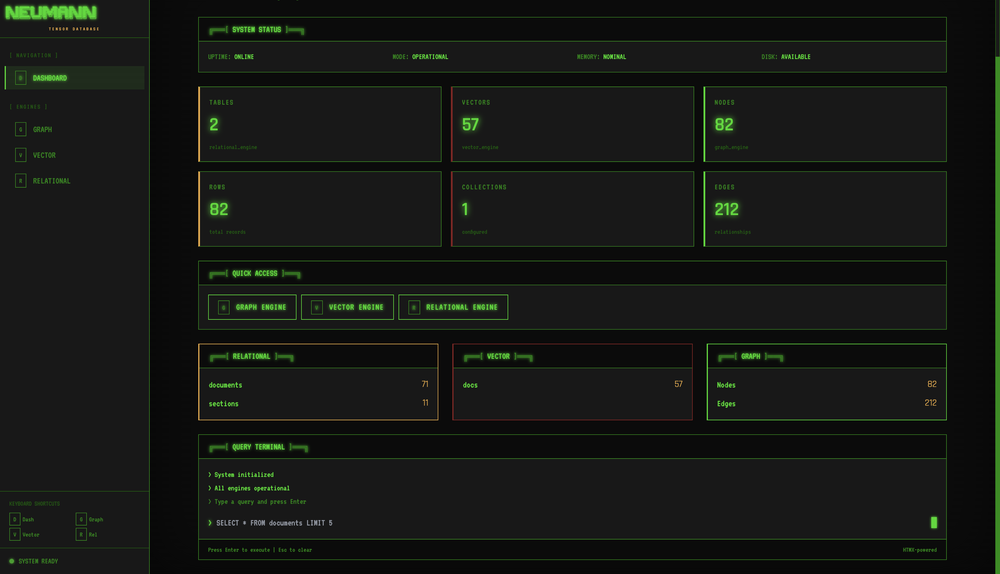
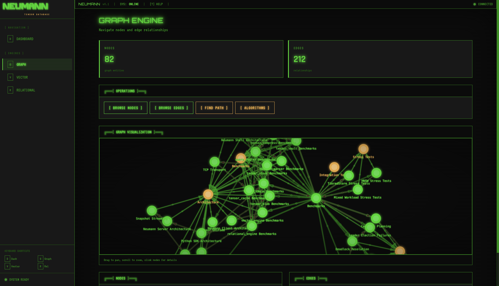

# Neumann

Stop juggling five databases for one AI app.

Neumann stores your tables, graphs, and vectors in one place.
Query across all three in a single statement.

```sql
-- Find engineers similar to Alice who report to Bob
FIND NODE person
  WHERE role = 'engineer'
  SIMILAR TO 'user:alice'
  CONNECTED TO 'user:bob'
```

One query. Relational filter + vector similarity + graph traversal.

[](https://github.com/Shadylukin/Neumann/actions/workflows/ci.yml)
[](https://codecov.io/gh/Shadylukin/Neumann)
[](LICENSE-MIT)
[](https://www.rust-lang.org)
[](https://discord.gg/uN3KbAyKvw)
[](https://github.com/sponsors/Shadylukin)

## Installation

### Quick Install (Recommended)

```bash
curl -sSfL https://raw.githubusercontent.com/Shadylukin/Neumann/main/install.sh | bash
```

### Homebrew (macOS/Linux)

```bash
brew tap Shadylukin/tap
brew install neumann
```

### Cargo

```bash
cargo install neumann_shell
```

### Docker

```bash
# Interactive CLI
docker run -it shadylukinack/neumann:latest

# Server mode with persistent storage
docker run -d -p 9200:9200 -v neumann-data:/var/lib/neumann \
  shadylukinack/neumann:server
```

### Docker Compose

```bash
git clone https://github.com/Shadylukin/Neumann.git
cd Neumann

# Start server
docker compose up -d neumann-server

# Run CLI
docker compose run --rm neumann-cli
```

### From Source

```bash
git clone https://github.com/Shadylukin/Neumann.git
cd Neumann
cargo build --release
./target/release/neumann
```

See [Installation Guide](docs/book/src/getting-started/installation.md) for
platform support, troubleshooting, and environment variables.

## Quick Start

```bash
neumann
```

```sql
-- Relational
> CREATE TABLE users (id INT, name TEXT, role TEXT)
> INSERT users id=1, name='Alice', role='engineer'
> SELECT * FROM users WHERE role = 'engineer'

-- Graph
> NODE CREATE person name='Alice'
> NODE CREATE person name='Bob'
> EDGE CREATE node:1 -> node:2 reports_to

-- Vector
> EMBED 'user:alice' [0.1, 0.2, 0.3, ...]
> SIMILAR 'user:alice' TOP 5
```

## What Makes This Different

**Unified storage.** One entity can have table fields, graph edges, AND
vector embeddings. No sync logic between systems.

**Semantic consensus.** Orthogonal changes auto-merge without conflicts.

```text
Alice updates email, Bob updates photo (same user, same time).
Traditional DB: conflict error, manual resolution.
Neumann: auto-merges because changes are orthogonal (different fields).
```

This extends to distributed scenarios. The consensus layer classifies
conflicts geometrically rather than treating all concurrent writes as
conflicts.

## Use Cases

### RAG Application

Store documents with their embeddings and relationships in one place.

```python
from neumann import NeumannClient

client = NeumannClient.connect("localhost:9200")

# Store document with embedding
client.execute(
    "INSERT docs id='readme', content='...', embedding=[0.1, 0.2, ...]"
)

# Link documents
client.execute("EDGE CREATE doc:readme -> doc:architecture references")

# Semantic search + follow links
results = client.execute("""
  FIND NODE doc
    SIMILAR TO 'doc:readme'
    CONNECTED TO 'doc:*'
""")
```

### Agent Memory

Conversation history with semantic recall across sessions.

```typescript
const client = await NeumannClient.connect("localhost:9200");

// Store message with embedding
await client.execute(`
  INSERT messages
    session='abc', role='user', content='...',
    embedding=[0.1, 0.2, ...]
`);

// Recall similar past conversations
const memories = await client.execute(`
  SIMILAR 'current-context' TOP 10
`);
```

### Semantic Search with Access Control

```python
# Store user with permissions via graph
client.execute("NODE CREATE user name='alice', team='eng'")
client.execute("EDGE CREATE user:alice -> project:neumann can_read")

# Query respects graph-based access
results = client.execute("""
  FIND NODE document
    WHERE team = 'eng'
    SIMILAR TO 'query embedding'
    CONNECTED TO 'user:alice'
""")
```

## SDKs

### Python

```bash
pip install neumann-db
```

```python
from neumann import NeumannClient

# Remote
client = NeumannClient.connect("localhost:9200", api_key="...")

# Embedded (in-process)
client = NeumannClient.embedded()

result = client.execute("SELECT * FROM users")
for row in result.rows:
    print(row.to_dict())
```

### TypeScript

```bash
npm install neumann-db
```

```typescript
import { NeumannClient } from 'neumann';

const client = await NeumannClient.connect("localhost:9200");
const result = await client.execute("SELECT * FROM users");

// Streaming for large results
for await (const chunk of client.executeStream(
  "SELECT * FROM large_table"
)) {
  console.log(chunk.rows);
}
```

## Dashboard


*Web dashboard with system status and query terminal*


*Interactive graph visualization with force-directed layout*

## Status

Neumann is pre-1.0.

- Core engines: 95%+ test coverage, 22 fuzz targets
- Single-node: production-ready
- Multi-node consensus: validation ongoing

The distributed layer has comprehensive testing but real-world multi-node
deployments need more validation.

See the [roadmap](docs/roadmap.md) for planned work.

## Performance

Benchmarked on Apple M-series silicon:

- **3.8M reads/sec, 2.0M writes/sec** (in-memory, no durability)
- **22K durable writes/sec** with group commit, 260/sec with fsync per write
- **150us vector similarity** (HNSW index, 10K embeddings, 128-dim)
- **52M conflict checks/sec** via sparse delta comparison

Full benchmarks:
[docs/book/src/benchmarks/index.md](docs/book/src/benchmarks/index.md)

## Documentation

- [API Documentation](https://shadylukin.github.io/Neumann/) -
  Full rustdoc reference
- [Installation](docs/book/src/getting-started/installation.md)
- [Quick Start](docs/book/src/getting-started/quick-start.md)
- [Architecture](docs/architecture.md)
- [Tensor Chain](docs/book/src/architecture/tensor-chain.md) -
  Distributed consensus details

## The Name

John von Neumann unified code and data in the stored-program architecture.
Neumann unifies structure, relationships, and semantics.

## License

Dual licensed under [MIT](LICENSE-MIT) or [Apache-2.0](LICENSE-APACHE).

## Author

Built by [Lukin Ackroyd](https://scrunchee.ai) in Auckland, New Zealand.

Neumann is the infrastructure layer for [Scrunchee](https://scrunchee.ai).
