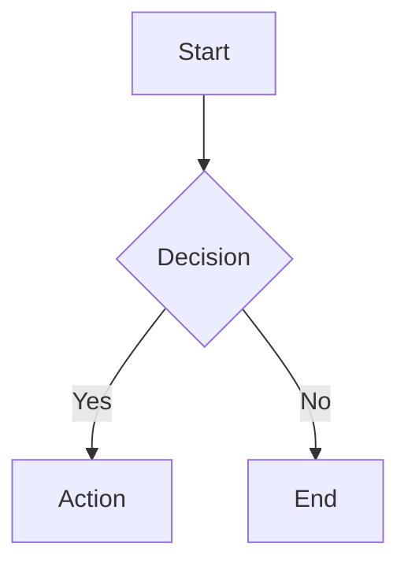

# Documentation Standards

This document defines the rigid formatting rules for all documentation in the
Neumann project. All contributions must adhere to these standards.

## General Formatting

### Line Length

- **Maximum line length**: 80 characters
- **Exceptions**: Code blocks, tables, and headings are exempt
- **Rationale**: Ensures readability in terminals and side-by-side diffs

### Headings

- Use ATX-style headings (`#`, `##`, `###`)
- Increment heading levels by one (no skipping from `#` to `###`)
- Leave one blank line before and after headings
- Do not end headings with punctuation

```markdown
# Top Level

## Second Level

### Third Level
```

### Lists

- Use dashes (`-`) for unordered lists
- Use two-space indentation for nested lists
- Leave one blank line before and after list blocks

```markdown
- First item
  - Nested item
  - Another nested item
- Second item
```

### Emphasis

- Use asterisks for *italic* (`*italic*`)
- Use double asterisks for **bold** (`**bold**`)
- Do not use underscores for emphasis

### Code Blocks

- Use fenced code blocks with triple backticks
- **Always specify the language** for syntax highlighting
- Supported languages: `rust`, `bash`, `toml`, `json`, `sql`, `text`

````markdown
```rust
fn example() -> Result<()> {
    Ok(())
}
```
````

### Tables

- Align columns with pipes and padding
- Use header separators with at least three dashes
- Tables are exempt from line length limits

```markdown
| Column A | Column B | Column C |
| -------- | -------- | -------- |
| Value 1  | Value 2  | Value 3  |
| Value 4  | Value 5  | Value 6  |
```

## Diagrams

### Mermaid

- Use `flowchart` directive (not deprecated `graph`)
- Keep diagrams simple and focused
- Add descriptive node labels

```markdown


```bash

### ASCII Diagrams

Use ASCII diagrams for wire formats and data structures:

```text
+--------+--------+--------+
| Header | Length | Data   |
| 4B     | 4B     | N bytes|
+--------+--------+--------+
```

## Document Types

### Architecture Documents

Location: `docs/book/src/architecture/`

Required sections:

1. **Overview** - Brief description of the component
2. **Architecture** - Diagram showing component relationships
3. **Configuration** - Table of configuration options
4. **Error Handling** - Error types and recovery strategies

### Concept Documents

Location: `docs/book/src/concepts/`

Required sections:

1. **Overview** - What the concept is and why it matters
2. **How It Works** - Technical explanation with diagrams
3. **Example Usage** - Code examples demonstrating the concept

### Runbooks

Location: `docs/book/src/operations/runbooks/`

Required sections:

1. **Symptoms** - How to identify the issue
2. **Diagnostic Steps** - Commands to diagnose the problem
3. **Resolution** - Step-by-step fix procedure
4. **Prevention** - How to avoid the issue

### Tutorials

Location: `docs/book/src/tutorials/`

Required sections:

1. **Prerequisites** - What the reader needs before starting
2. **Steps** - Numbered procedure with code examples
3. **Verification** - How to confirm success

## Validation

### Pre-commit Hook

The pre-commit hook validates:

- Markdownlint compliance
- Code block language specifiers
- Mermaid deprecated directive warnings

### CI Checks

The documentation workflow validates:

- All markdownlint rules
- Required sections by document type
- Link integrity with mdbook-linkcheck

### Running Locally

```bash
# Install markdownlint-cli
npm install -g markdownlint-cli

# Check all documentation
npx markdownlint-cli "docs/**/*.md" "*.md"

# Run validation script
./scripts/validate-docs.sh

# Build and preview book
cd docs/book && mdbook serve
```

## Style Guide

### Tone

- Use active voice
- Be concise and direct
- Avoid jargon without explanation
- No emojis in documentation

### Terminology

Use consistent terminology throughout:

| Term | Definition |
| --- | --- |
| Node | A single instance in the cluster |
| Leader | The node handling write requests |
| Follower | A node replicating from the leader |
| Quorum | Majority of nodes required for consensus |
| Transaction | A unit of work with ACID properties |
| Workspace | Isolated transaction state container |
| Delta | Difference between before/after states |
| Embedding | Vector representation of data |

### Cross-References

- Use relative links for internal references
- Include file extensions in links

```markdown
See [Transaction Workspace](../architecture/transaction-workspace.md) for
details on workspace lifecycle.
```

## Checklist

Before submitting documentation:

- [ ] Line length under 80 characters (except code/tables)
- [ ] All code blocks have language specifiers
- [ ] Headings use ATX style and increment properly
- [ ] Lists use dashes with two-space nesting
- [ ] Tables are aligned with pipe padding
- [ ] Mermaid diagrams use `flowchart` not `graph`
- [ ] Required sections present for document type
- [ ] All links resolve correctly
- [ ] No emojis or excessive formatting
