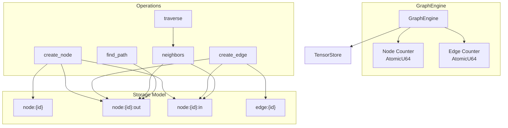
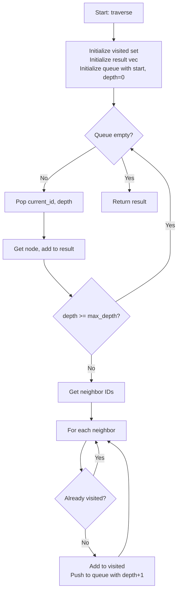
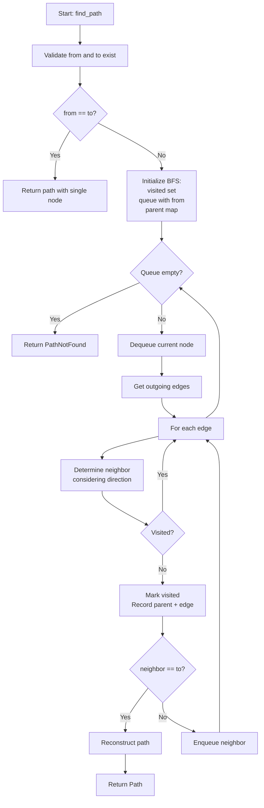
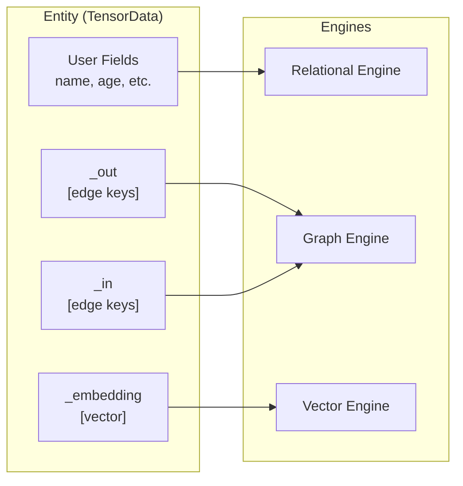

# Graph Engine

The Graph Engine provides graph operations on top of the Tensor Store. It implements a labeled property graph model with support for both directed and undirected edges, BFS traversals, and shortest path finding. The engine inherits thread safety from TensorStore and supports cross-engine unified entity connections.

## Design Principles

| Principle | Description |
|-----------|-------------|
| Layered Architecture | Depends only on Tensor Store for persistence |
| Direction-Aware | Supports both directed and undirected edges |
| BFS Traversal | Breadth-first search for shortest paths |
| Cycle-Safe | Handles cyclic graphs without infinite loops via visited set |
| Unified Entities | Edges can connect shared entities across engines |
| Thread Safety | Inherits from Tensor Store's DashMap (~16 shards) |
| Serializable Types | All types implement serde Serialize/Deserialize |
| Parallel Optimization | High-degree node deletion uses rayon for parallelism |

## Key Types

### Core Types

| Type | Description |
|------|-------------|
| `GraphEngine` | Main entry point for graph operations |
| `Node` | Graph node with id, label, and properties |
| `Edge` | Graph edge with from/to nodes, type, properties, and direction flag |
| `Path` | Result of path finding containing node and edge sequences |
| `Direction` | Edge traversal direction (Outgoing, Incoming, Both) |
| `PropertyValue` | Node/edge property values (Null, Int, Float, String, Bool) |
| `GraphError` | Error types for graph operations |

### PropertyValue Variants

| Variant | Rust Type | Description |
|---------|-----------|-------------|
| `Null` | - | NULL value |
| `Int` | `i64` | 64-bit signed integer |
| `Float` | `f64` | 64-bit floating point |
| `String` | `String` | UTF-8 string |
| `Bool` | `bool` | Boolean |

### Error Types

| Error | Cause |
|-------|-------|
| `NodeNotFound(u64)` | Node with given ID does not exist |
| `EdgeNotFound(u64)` | Edge with given ID does not exist |
| `PathNotFound` | No path exists between the specified nodes |
| `StorageError(String)` | Underlying Tensor Store error |

## Architecture



## Internal Architecture

### GraphEngine Struct

```rust
pub struct GraphEngine {
    store: TensorStore,           // Underlying key-value storage
    node_counter: AtomicU64,      // Atomic counter for node IDs
    edge_counter: AtomicU64,      // Atomic counter for edge IDs
}
```

The engine uses atomic counters (SeqCst ordering) to generate unique IDs:
- Node IDs start at 1 and increment monotonically
- Edge IDs are separate from node IDs
- Both counters support concurrent ID allocation

### Key Generation Functions

```rust
fn node_key(id: u64) -> String { format!("node:{}", id) }
fn edge_key(id: u64) -> String { format!("edge:{}", id) }
fn outgoing_edges_key(node_id: u64) -> String { format!("node:{}:out", node_id) }
fn incoming_edges_key(node_id: u64) -> String { format!("node:{}:in", node_id) }
```

## Storage Model

Nodes and edges are stored in Tensor Store using the following key patterns:

| Key Pattern | Content | TensorData Fields |
|-------------|---------|-------------------|
| `node:{id}` | Node data | `_id`, `_type="node"`, `_label`, user properties |
| `node:{id}:out` | List of outgoing edge IDs | `e{edge_id}` fields |
| `node:{id}:in` | List of incoming edge IDs | `e{edge_id}` fields |
| `edge:{id}` | Edge data | `_id`, `_type="edge"`, `_from`, `_to`, `_edge_type`, `_directed`, user properties |

### Edge List Storage Format

Edge lists are stored as TensorData with dynamically named fields:
```rust
// Each edge ID stored as: "e{edge_id}" -> edge_id
tensor.set("e1", TensorValue::Scalar(ScalarValue::Int(1)));
tensor.set("e5", TensorValue::Scalar(ScalarValue::Int(5)));
```

This format allows O(1) edge addition but O(n) edge listing. The edge retrieval scans all keys starting with 'e':
```rust
fn get_edge_list(&self, key: &str) -> Result<Vec<u64>> {
    let tensor = self.store.get(key)?;
    let mut edges = Vec::new();
    for k in tensor.keys() {
        if k.starts_with('e') {
            if let Some(TensorValue::Scalar(ScalarValue::Int(id))) = tensor.get(k) {
                edges.push(*id as u64);
            }
        }
    }
    Ok(edges)
}
```

## API Reference

### Engine Construction

```rust
// Create new engine with internal store
let engine = GraphEngine::new();

// Create engine with shared store (for cross-engine queries)
let store = TensorStore::new();
let engine = GraphEngine::with_store(store.clone());

// Access underlying store
let store = engine.store();
```

### Node Operations

```rust
// Create node with properties
let mut props = HashMap::new();
props.insert("name".to_string(), PropertyValue::String("Alice".into()));
props.insert("age".to_string(), PropertyValue::Int(30));
let id = engine.create_node("Person", props)?;

// Get node by ID
let node = engine.get_node(id)?;

// Check node existence
let exists = engine.node_exists(id);

// Delete node (cascades to connected edges)
engine.delete_node(id)?;

// Count nodes in graph
let count = engine.node_count();
```

### Edge Operations

```rust
// Create directed edge
let edge_id = engine.create_edge(from, to, "KNOWS", properties, true)?;

// Create undirected edge
let edge_id = engine.create_edge(from, to, "FRIENDS", properties, false)?;

// Get edge by ID
let edge = engine.get_edge(edge_id)?;
```

#### Undirected Edge Implementation

When an undirected edge is created, it is added to **four** edge lists to enable bidirectional traversal:

```rust
if !directed {
    // Add to both nodes' outgoing AND incoming lists
    self.add_edge_to_list(Self::outgoing_edges_key(to), id)?;
    self.add_edge_to_list(Self::incoming_edges_key(from), id)?;
}
```

This enables undirected edges to be traversed from either endpoint regardless of direction filter.

### Traversal Operations

```rust
// Get neighbors (all edge types, both directions)
let neighbors = engine.neighbors(node_id, None, Direction::Both)?;

// Get neighbors filtered by edge type
let friends = engine.neighbors(node_id, Some("FRIENDS"), Direction::Both)?;

// BFS traversal with depth limit
let nodes = engine.traverse(start_id, Direction::Outgoing, max_depth, None)?;

// Traversal filtered by edge type
let deps = engine.traverse(start_id, Direction::Outgoing, 10, Some("DEPENDS_ON"))?;

// Find shortest path (BFS)
let path = engine.find_path(from_id, to_id)?;
```

### Direction Enum

| Direction | Behavior |
|-----------|----------|
| `Outgoing` | Follow edges away from the node |
| `Incoming` | Follow edges toward the node |
| `Both` | Follow edges in either direction |

## BFS Traversal Algorithm

The `traverse` method implements breadth-first search with depth limiting and cycle detection:



### Implementation Details

```rust
pub fn traverse(
    &self,
    start: u64,
    direction: Direction,
    max_depth: usize,
    edge_type: Option<&str>,
) -> Result<Vec<Node>> {
    if !self.node_exists(start) {
        return Err(GraphError::NodeNotFound(start));
    }

    let mut visited = HashSet::new();
    let mut result = Vec::new();
    let mut queue = VecDeque::new();

    queue.push_back((start, 0usize));
    visited.insert(start);

    while let Some((current_id, depth)) = queue.pop_front() {
        if let Ok(node) = self.get_node(current_id) {
            result.push(node);
        }

        if depth >= max_depth {
            continue;
        }

        let neighbors = self.get_neighbor_ids(current_id, edge_type, direction)?;
        for neighbor_id in neighbors {
            if !visited.contains(&neighbor_id) {
                visited.insert(neighbor_id);
                queue.push_back((neighbor_id, depth + 1));
            }
        }
    }

    Ok(result)
}
```

### Key Properties

- **Cycle-Safe**: The `visited` HashSet prevents revisiting nodes
- **Depth-Limited**: The `max_depth` parameter bounds traversal depth
- **Level-Order**: BFS naturally visits nodes in level order
- **Start Node Included**: The starting node is always in the result at depth 0

## Shortest Path Algorithm

The `find_path` method uses BFS to find the shortest (minimum hop) path between two nodes:



### Implementation Details

```rust
pub fn find_path(&self, from: u64, to: u64) -> Result<Path> {
    // Validate endpoints exist
    if !self.node_exists(from) {
        return Err(GraphError::NodeNotFound(from));
    }
    if !self.node_exists(to) {
        return Err(GraphError::NodeNotFound(to));
    }

    // Handle trivial case
    if from == to {
        return Ok(Path {
            nodes: vec![from],
            edges: vec![],
        });
    }

    // BFS for shortest path
    let mut visited = HashSet::new();
    let mut queue = VecDeque::new();
    let mut parent: HashMap<u64, (u64, u64)> = HashMap::new(); // node -> (parent_node, edge_id)

    queue.push_back(from);
    visited.insert(from);

    while let Some(current) = queue.pop_front() {
        let out_edges = self.get_edge_list(&Self::outgoing_edges_key(current))?;

        for edge_id in out_edges {
            if let Ok(edge) = self.get_edge(edge_id) {
                let neighbor = if edge.from == current {
                    edge.to
                } else if !edge.directed && edge.to == current {
                    edge.from
                } else {
                    continue;
                };

                if !visited.contains(&neighbor) {
                    visited.insert(neighbor);
                    parent.insert(neighbor, (current, edge_id));

                    if neighbor == to {
                        return Ok(self.reconstruct_path(from, to, &parent));
                    }

                    queue.push_back(neighbor);
                }
            }
        }
    }

    Err(GraphError::PathNotFound)
}
```

### Path Reconstruction

The path is reconstructed by following parent pointers backwards from the target to the source:

```rust
fn reconstruct_path(&self, from: u64, to: u64, parent: &HashMap<u64, (u64, u64)>) -> Path {
    let mut nodes = Vec::new();
    let mut edges = Vec::new();
    let mut current = to;

    // Walk backwards from target to source
    while current != from {
        nodes.push(current);
        if let Some((p, edge_id)) = parent.get(&current) {
            edges.push(*edge_id);
            current = *p;
        } else {
            break;
        }
    }
    nodes.push(from);

    // Reverse to get source-to-target order
    nodes.reverse();
    edges.reverse();

    Path { nodes, edges }
}
```

## Parallel Deletion Optimization

High-degree nodes (>100 edges) use rayon's parallel iterator for edge deletion:

```rust
const PARALLEL_THRESHOLD: usize = 100;

pub fn delete_node(&self, id: u64) -> Result<()> {
    if !self.node_exists(id) {
        return Err(GraphError::NodeNotFound(id));
    }

    // Collect all connected edges
    let out_edges = self.get_edge_list(&Self::outgoing_edges_key(id))?;
    let in_edges = self.get_edge_list(&Self::incoming_edges_key(id))?;
    let all_edges: Vec<u64> = out_edges.into_iter().chain(in_edges).collect();

    // Parallel deletion for high-degree nodes
    if all_edges.len() >= Self::PARALLEL_THRESHOLD {
        all_edges.par_iter().for_each(|edge_id| {
            let _ = self.store.delete(&Self::edge_key(*edge_id));
        });
    } else {
        for edge_id in all_edges {
            let _ = self.store.delete(&Self::edge_key(edge_id));
        }
    }

    // Delete node and edge lists
    self.store.delete(&Self::node_key(id))?;
    self.store.delete(&Self::outgoing_edges_key(id))?;
    self.store.delete(&Self::incoming_edges_key(id))?;

    Ok(())
}
```

### Performance Characteristics

| Edge Count | Deletion Strategy | Benefit |
|------------|-------------------|---------|
| < 100 | Sequential | Lower overhead for small nodes |
| >= 100 | Parallel (rayon) | ~2-4x speedup on multi-core systems |

## Unified Entity API

The Unified Entity API connects any shared entities (not just graph nodes) for cross-engine queries. Entity edges use the `_out` and `_in` reserved fields in TensorData, enabling the same entity key to have relational fields, graph connections, and a vector embedding.



### Reserved Fields

| Field | Type | Purpose |
|-------|------|---------|
| `_out` | `Vec<String>` | Outgoing edge keys |
| `_in` | `Vec<String>` | Incoming edge keys |
| `_embedding` | `Vec<f32>` | Vector embedding |
| `_type` | `String` | Entity type |
| `_id` | `i64` | Entity numeric ID |
| `_label` | `String` | Entity label |

### Entity Edge Key Format

Entity edges use a different key format from node-based edges:
```
edge:{edge_type}:{edge_id}
```

For example: `edge:follows:42`

### API Reference

```rust
// Create engine with shared store
let store = TensorStore::new();
let engine = GraphEngine::with_store(store.clone());

// Add directed edge between entities
let edge_key = engine.add_entity_edge("user:1", "user:2", "follows")?;

// Add undirected edge between entities
let edge_key = engine.add_entity_edge_undirected("user:1", "user:2", "friend")?;

// Get neighbors
let neighbors = engine.get_entity_neighbors("user:1")?;
let out_neighbors = engine.get_entity_neighbors_out("user:1")?;
let in_neighbors = engine.get_entity_neighbors_in("user:1")?;

// Get edge lists
let outgoing = engine.get_entity_outgoing("user:1")?;
let incoming = engine.get_entity_incoming("user:1")?;

// Get edge details
let (from, to, edge_type, directed) = engine.get_entity_edge(&edge_key)?;

// Check if entity has edges
let has_edges = engine.entity_has_edges("user:1");

// Delete edge
engine.delete_entity_edge(&edge_key)?;

// Scan for entities with edges
let entities = engine.scan_entities_with_edges();
```

### Undirected Entity Edges

For undirected entity edges, both entities receive the edge in both `_out` and `_in`:

```rust
pub fn add_entity_edge_undirected(
    &self,
    key1: &str,
    key2: &str,
    edge_type: &str,
) -> Result<String> {
    // ... create edge data ...

    // Both entities get the edge in both directions
    let mut entity1 = self.get_or_create_entity(key1);
    entity1.add_outgoing_edge(edge_key.clone());
    entity1.add_incoming_edge(edge_key.clone());

    let mut entity2 = self.get_or_create_entity(key2);
    entity2.add_outgoing_edge(edge_key.clone());
    entity2.add_incoming_edge(edge_key.clone());

    Ok(edge_key)
}
```

## Cross-Engine Integration

### Query Router Integration

The Query Router provides unified queries combining graph traversal with vector similarity:

```rust
// Find entities similar to query that are connected to a specific entity
let items = router.find_similar_connected("query:entity", "connected_to:entity", top_k)?;

// Find graph neighbors sorted by embedding similarity
let items = router.find_neighbors_by_similarity("entity:key", &query_vector, top_k)?;
```

### Tensor Vault Integration

Tensor Vault uses GraphEngine for access control relationships:

```rust
pub struct Vault {
    store: TensorStore,
    pub graph: Arc<GraphEngine>,  // Shared graph for access edges
    // ...
}
```

Access control edges connect principals to secrets with permission metadata.

### Tensor Chain Integration

Tensor Chain uses GraphEngine for block linking:

```rust
pub struct Chain {
    graph: Arc<GraphEngine>,  // Stores blocks as nodes, links as edges
    // ...
}
```

Blocks are stored with `chain:block:{height}` keys and linked via graph edges with type `chain_next`.

## Performance Characteristics

| Operation | Complexity | Notes |
|-----------|------------|-------|
| `create_node` | O(1) | Store put |
| `create_edge` | O(1) | Store put + edge list updates |
| `get_node` | O(1) | Store get |
| `get_edge` | O(1) | Store get |
| `neighbors` | O(e) | e = edges from node |
| `traverse` | O(n + e) | BFS over reachable nodes |
| `find_path` | O(n + e) | BFS shortest path |
| `delete_node` | O(e) | Parallel for e >= 100 |
| `node_count` | O(k) | k = total keys (scan-based) |
| `get_edge_list` | O(k) | k = keys in edge list |

### Memory Characteristics

| Data | Storage |
|------|---------|
| Node | ~50-200 bytes + properties |
| Edge | ~50-150 bytes + properties |
| Edge list entry | ~10 bytes per edge |

## Edge Cases and Gotchas

### Self-Loop Edges

Self-loops (edges from a node to itself) are valid but filtered from neighbor results:

```rust
#[test]
fn self_loop_edge() {
    let engine = GraphEngine::new();
    let n1 = engine.create_node("A", HashMap::new()).unwrap();
    engine.create_edge(n1, n1, "SELF", HashMap::new(), true).unwrap();

    // Self-loop doesn't appear in neighbors
    let neighbors = engine.neighbors(n1, None, Direction::Both).unwrap();
    assert_eq!(neighbors.len(), 0);
}
```

### Same-Node Path

Finding a path from a node to itself returns a single-node path:

```rust
let path = engine.find_path(n1, n1)?;
assert_eq!(path.nodes, vec![n1]);
assert!(path.edges.is_empty());
```

### Deleted Edge Orphans

When deleting a node, connected edges are deleted from storage but may remain in other nodes' edge lists. This is a known limitation - the edge retrieval gracefully handles missing edges.

### Bytes Property Conversion

`ScalarValue::Bytes` converts to `PropertyValue::Null` since PropertyValue doesn't support binary data:

```rust
let bytes = ScalarValue::Bytes(vec![1, 2, 3]);
assert_eq!(PropertyValue::from_scalar(&bytes), PropertyValue::Null);
```

### Node Count Calculation

The `node_count` method uses a formula based on scan counts to account for edge lists:

```rust
pub fn node_count(&self) -> usize {
    // Each node has 3 keys: node:{id}, node:{id}:out, node:{id}:in
    self.store.scan_count("node:") - self.store.scan_count("node:") / 3 * 2
}
```

## Best Practices

### Use Shared Store for Cross-Engine Queries

```rust
// Create shared store first
let store = TensorStore::new();

// Create engines with shared store
let graph = GraphEngine::with_store(store.clone());
let vector = VectorEngine::with_store(store.clone());

// Now entities can have both graph edges and embeddings
```

### Prefer Entity API for Cross-Engine Data

Use the Unified Entity API when entities need to combine relational, graph, and vector data:

```rust
// Good: Entity API preserves all fields
engine.add_entity_edge("user:1", "user:2", "follows")?;

// Less flexible: Node API creates graph-only entities
engine.create_node("User", props)?;
```

### Batch Edge Creation

When creating many edges, avoid creating them one at a time if possible. Consider the overhead of multiple store operations.

### Choose Direction Wisely

- Use `Direction::Outgoing` for forward-only traversals (dependency graphs)
- Use `Direction::Both` for symmetric relationships (social graphs)
- Use `Direction::Incoming` for reverse lookups (finding predecessors)

### Set Appropriate Traversal Depth

BFS traversal can be expensive on dense graphs. Set `max_depth` based on expected graph diameter:

```rust
// For typical social networks, 3-6 hops is usually sufficient
let reachable = engine.traverse(start, Direction::Both, 4, None)?;
```

## Usage Examples

### Social Network

```rust
let engine = GraphEngine::new();

// Create users
let alice = engine.create_node("User", user_props("Alice"))?;
let bob = engine.create_node("User", user_props("Bob"))?;
let charlie = engine.create_node("User", user_props("Charlie"))?;

// Create friendships (undirected)
engine.create_edge(alice, bob, "FRIENDS", HashMap::new(), false)?;
engine.create_edge(bob, charlie, "FRIENDS", HashMap::new(), false)?;

// Find path from Alice to Charlie
let path = engine.find_path(alice, charlie)?;
// path.nodes = [alice, bob, charlie]

// Get Alice's friends
let friends = engine.neighbors(alice, Some("FRIENDS"), Direction::Both)?;
```

### Dependency Graph

```rust
let engine = GraphEngine::new();

// Create packages
let app = engine.create_node("Package", package_props("app"))?;
let lib_a = engine.create_node("Package", package_props("lib-a"))?;
let lib_b = engine.create_node("Package", package_props("lib-b"))?;

// Create dependencies (directed)
engine.create_edge(app, lib_a, "DEPENDS_ON", HashMap::new(), true)?;
engine.create_edge(app, lib_b, "DEPENDS_ON", HashMap::new(), true)?;
engine.create_edge(lib_a, lib_b, "DEPENDS_ON", HashMap::new(), true)?;

// Find all dependencies of app
let deps = engine.traverse(app, Direction::Outgoing, 10, Some("DEPENDS_ON"))?;
```

### Cross-Engine Unified Entities

```rust
// Shared store for multiple engines
let store = TensorStore::new();
let graph = GraphEngine::with_store(store.clone());

// Add graph edges between entities
graph.add_entity_edge("user:1", "post:1", "created")?;
graph.add_entity_edge("user:2", "post:1", "liked")?;

// Query relationships
let creators = graph.get_entity_neighbors_in("post:1")?;
```

### High-Degree Node Operations

```rust
let engine = GraphEngine::new();

// Create a hub with many connections (will use parallel deletion)
let hub = engine.create_node("Hub", HashMap::new())?;
for i in 0..150 {
    let leaf = engine.create_node("Leaf", HashMap::new())?;
    engine.create_edge(hub, leaf, "CONNECTS", HashMap::new(), true)?;
}

// Deletion will use parallel processing (150 > 100 threshold)
engine.delete_node(hub)?;
```

## Configuration

The Graph Engine has minimal configuration as it inherits behavior from TensorStore:

| Setting | Value | Description |
|---------|-------|-------------|
| Parallel threshold | 100 | Edge count triggering parallel deletion |
| ID ordering | SeqCst | Atomic ordering for ID generation |

## Dependencies

| Crate | Purpose |
|-------|---------|
| `tensor_store` | Underlying key-value storage |
| `rayon` | Parallel iteration for high-degree node deletion |
| `serde` | Serialization of graph types |

## Related Modules

| Module | Relationship |
|--------|--------------|
| [Tensor Store](tensor-store.md) | Storage backend |
| [Tensor Vault](tensor-vault.md) | Uses graph for access control |
| [Tensor Chain](tensor-chain.md) | Uses graph for block linking |
| [Query Router](query-router.md) | Executes graph queries |
