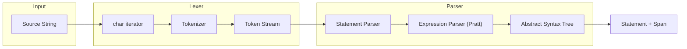
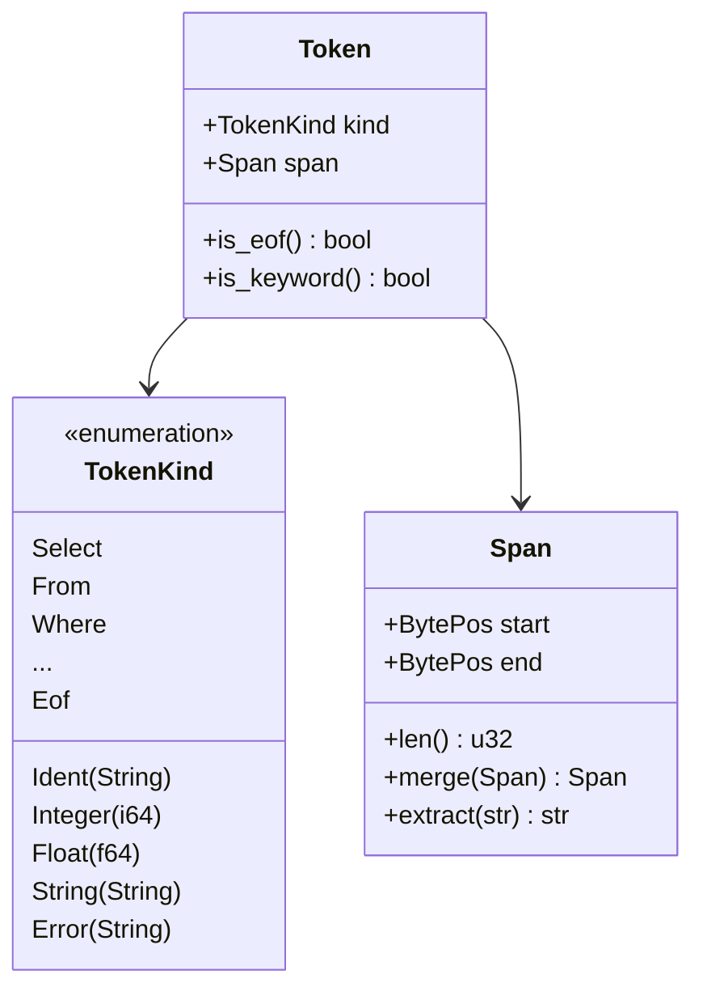
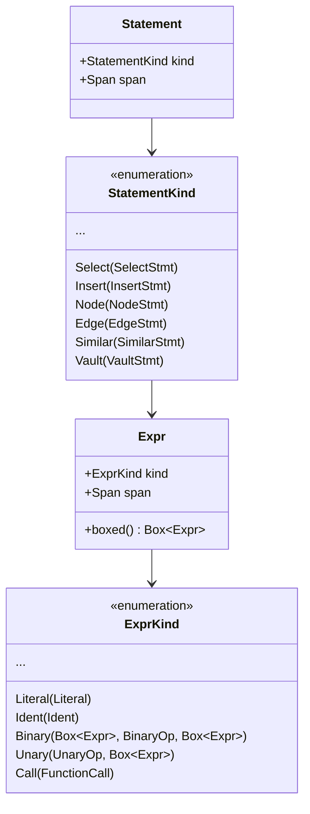
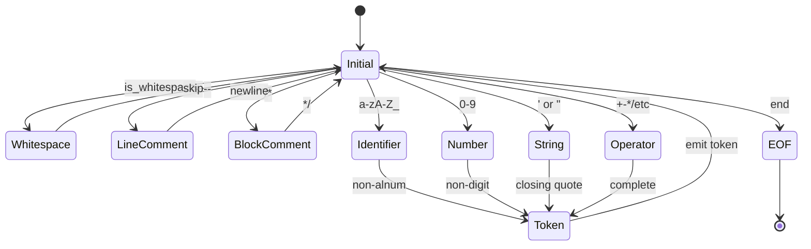
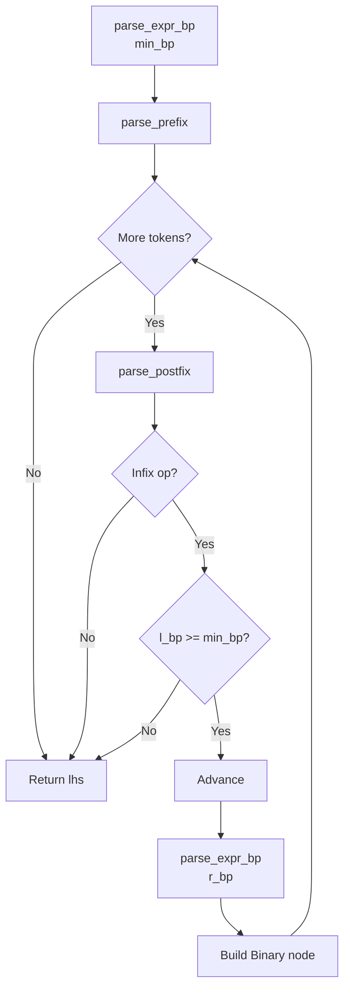

# Neumann Parser

The `neumann_parser` crate provides a hand-written recursive descent parser for
the Neumann unified query language. It converts source text into an Abstract
Syntax Tree (AST) that can be executed by the query router.

The parser is designed with zero external dependencies, full span tracking for
error reporting, and support for SQL, graph, vector, and domain-specific
operations in a single unified syntax.

## Key Concepts

| Concept | Description |
| --- | --- |
| Recursive Descent | Top-down parsing where each grammar rule becomes a function |
| Pratt Parsing | Operator precedence parsing for expressions with correct associativity |
| Span Tracking | Every AST node carries source location for error messages |
| Case Insensitivity | Keywords are matched case-insensitively via uppercase conversion |
| Single Lookahead | Parser uses one-token lookahead with optional peek |
| Depth Limiting | Expression nesting is limited to 64 levels to prevent stack overflow |

## Architecture



### Detailed Parsing Flow

```mermaid
sequenceDiagram
    participant User
    participant parse()
    participant Parser
    participant Lexer
    participant ExprParser

    User->>parse(): "SELECT * FROM users"
    parse()->>Parser: new(source)
    Parser->>Lexer: new(source)
    Lexer-->>Parser: first token

    Parser->>Parser: parse_statement()
    Parser->>Parser: match on token kind
    Parser->>Parser: parse_select()
    Parser->>Parser: parse_select_body()

    loop For each select item
        Parser->>ExprParser: parse_expr()
        ExprParser->>ExprParser: parse_expr_bp(0)
        ExprParser->>ExprParser: parse_prefix_expr()
        ExprParser-->>Parser: Expr with span
    end

    Parser-->>parse(): Statement
    parse()-->>User: Result<Statement>
```

## Source Files

| File | Purpose | Key Functions |
| --- | --- | --- |
| `lib.rs` | Public API exports | `parse()`, `parse_all()`, `parse_expr()`, `tokenize()` |
| `lexer.rs` | Tokenization (source to tokens) | `Lexer::next_token()`, `scan_ident()`, `scan_number()`, `scan_string()` |
| `token.rs` | Token definitions and keyword lookup | `TokenKind`, `keyword_from_str()` |
| `parser.rs` | Statement parsing (recursive descent) | `Parser::parse_statement()`, `parse_select()`, `parse_insert()` |
| `expr.rs` | Expression parsing (Pratt algorithm) | `ExprParser::parse_expr()`, `parse_expr_bp()`, `infix_binding_power()` |
| `ast.rs` | AST node definitions | `Statement`, `StatementKind`, `Expr`, `ExprKind` |
| `span.rs` | Source location tracking | `BytePos`, `Span`, `line_col()`, `get_line()` |
| `error.rs` | Error types with source context | `ParseError`, `ParseErrorKind`, `format_with_source()` |

## Core Types

### Token System



| Type | Description |
| --- | --- |
| `Token` | A token with its kind and span |
| `TokenKind` | Enum of all token variants (130+ variants including keywords, literals, operators) |
| `Lexer` | Stateful tokenizer that produces tokens from source |

### AST Structure



| Type | Description |
| --- | --- |
| `Statement` | Top-level parsed statement with span |
| `StatementKind` | Enum of all statement variants (30+ variants) |
| `Expr` | Expression node with span |
| `ExprKind` | Enum of expression variants (20+ variants) |
| `Literal` | Literal values (Null, Boolean, Integer, Float, String) |
| `Ident` | Identifier with name and span |
| `BinaryOp` | Binary operators with precedence (18 operators) |
| `UnaryOp` | Unary operators (Not, Neg, BitNot) |

### Span Types

| Type | Description | Example |
| --- | --- | --- |
| `BytePos` | A byte offset into source text (u32) | `BytePos(7)` |
| `Span` | A range of bytes (start, end) | `Span { start: 0, end: 6 }` |
| `Spanned<T>` | A value paired with its source location | `Spanned::new(42, span)` |

```rust
// Span operations
let span1 = Span::from_offsets(0, 6);   // "SELECT"
let span2 = Span::from_offsets(7, 8);   // "*"
let merged = span1.merge(span2);         // "SELECT *"

// Extract source text
let source = "SELECT * FROM users";
let text = span1.extract(source);        // "SELECT"

// Line/column computation
let (line, col) = line_col(source, BytePos(7));  // (1, 8)
```

### Error Types

| Type | Description |
| --- | --- |
| `ParseError` | Error with kind, span, and optional help message |
| `ParseErrorKind` | Enum of error variants (10 kinds) |
| `ParseResult<T>` | `Result<T, ParseError>` |
| `Errors` | Collection of parse errors with iteration support |

```rust
// Error kinds
pub enum ParseErrorKind {
    UnexpectedToken { found: TokenKind, expected: String },
    UnexpectedEof { expected: String },
    InvalidSyntax(String),
    InvalidNumber(String),
    UnterminatedString,
    UnknownCommand(String),
    DuplicateColumn(String),
    InvalidEscape(char),
    TooDeep,           // Expression nesting > 64 levels
    Custom(String),
}
```

## Lexer Implementation

### State Machine

The lexer is implemented as an iterator-based state machine with
single-character lookahead:



### Internal Structure

```rust
pub struct Lexer<'a> {
    source: &'a str,      // Original source text
    chars: Chars<'a>,     // Character iterator
    pos: u32,             // Current byte position
    peeked: Option<char>, // One-character lookahead
}
```

### Character Classification

| Category | Characters | Handling |
| --- | --- | --- |
| Whitespace | space, tab, newline | Skipped |
| Line comment | `--` to newline | Skipped |
| Block comment | `/* */` (nestable) | Skipped, supports nesting |
| Identifier | `[a-zA-Z_][a-zA-Z0-9_]*` | Keyword lookup then Ident |
| Integer | `[0-9]+` | Parse as i64 |
| Float | `[0-9]+\.[0-9]+` or scientific | Parse as f64 |
| String | `'...'` or `"..."` | Handle escapes |

### String Escape Sequences

| Escape | Result |
| --- | --- |
| `\n` | Newline |
| `\r` | Carriage return |
| `\t` | Tab |
| `\\` | Backslash |
| `\'` | Single quote |
| `\"` | Double quote |
| `\0` | Null character |
| `''` | Single quote (SQL-style doubled) |
| `\x` | Unknown: preserved as `\x` |

### Operator Recognition

Multi-character operators are recognized with lookahead:

```rust
// Lexer::next_token() operator matching
match c {
    '-' => if self.eat('>') { Arrow }      // ->
           else { Minus },                  // -
    '=' => if self.eat('>') { FatArrow }   // =>
           else { Eq },                     // =
    '<' => if self.eat('=') { Le }         // <=
           else if self.eat('>') { Ne }    // <>
           else if self.eat('<') { Shl }   // <<
           else { Lt },                     // <
    '>' => if self.eat('=') { Ge }         // >=
           else if self.eat('>') { Shr }   // >>
           else { Gt },                     // >
    '|' => if self.eat('|') { Concat }     // ||
           else { Pipe },                   // |
    '&' => if self.eat('&') { AmpAmp }     // &&
           else { Amp },                    // &
    ':' => if self.eat(':') { ColonColon } // ::
           else { Colon },                  // :
    // ...
}
```

## Pratt Parser (Expression Parsing)

### Algorithm Overview

The Pratt parser handles operator precedence through "binding power" - each
operator has a left and right binding power that determines associativity and
precedence.



### Binding Power Table

Each operator has left and right binding powers `(l_bp, r_bp)`:

| Precedence | Operators | Binding Power (l, r) | Associativity |
| --- | --- | --- | --- |
| 1 (lowest) | OR | (1, 2) | Left |
| 2 | AND | (3, 4) | Left |
| 3 | =, !=, <, <=, >, >= | (5, 6) | Left |
| 4 | `\|` (bitwise OR) | (7, 8) | Left |
| 5 | ^ (bitwise XOR) | (9, 10) | Left |
| 6 | & (bitwise AND) | (11, 12) | Left |
| 7 | <<, >> | (13, 14) | Left |
| 8 | +, -, `\|\|` (concat) | (15, 16) | Left |
| 9 | *, /, % | (17, 18) | Left |
| 10 (highest) | NOT, -, ~ (unary) | 19 (prefix) | Right |

Left associativity is achieved by having `r_bp > l_bp`.

### Implementation Details

```rust
const MAX_DEPTH: usize = 64;  // Prevent stack overflow

fn parse_expr_bp(&mut self, min_bp: u8) -> ParseResult<Expr> {
    self.depth += 1;
    if self.depth > MAX_DEPTH {
        return Err(ParseError::new(ParseErrorKind::TooDeep, self.current.span));
    }

    let mut lhs = self.parse_prefix()?;

    loop {
        // Handle postfix operators (IS NULL, IN, BETWEEN, LIKE, DOT)
        lhs = self.parse_postfix(lhs)?;

        // Check for infix operator
        let op = match self.current_binary_op() {
            Some(op) => op,
            None => break,
        };

        let (l_bp, r_bp) = infix_binding_power(op);
        if l_bp < min_bp {
            break;  // Operator binds less tightly than current context
        }

        self.advance();
        let rhs = self.parse_expr_bp(r_bp)?;

        let span = lhs.span.merge(rhs.span);
        lhs = Expr::new(ExprKind::Binary(Box::new(lhs), op, Box::new(rhs)), span);
    }

    self.depth -= 1;
    Ok(lhs)
}
```

### Prefix Expression Handling

```rust
fn parse_prefix(&mut self) -> ParseResult<Expr> {
    match &self.current.kind {
        // Literals
        TokenKind::Integer(n) => { /* emit Literal(Integer) */ },
        TokenKind::Float(n) => { /* emit Literal(Float) */ },
        TokenKind::String(s) => { /* emit Literal(String) */ },
        TokenKind::True | TokenKind::False => { /* emit Literal(Boolean) */ },
        TokenKind::Null => { /* emit Literal(Null) */ },

        // Identifiers and function calls
        TokenKind::Ident(_) => self.parse_ident_or_call(),

        // Aggregate functions (COUNT, SUM, AVG, MIN, MAX)
        TokenKind::Count | TokenKind::Sum | ... => self.parse_aggregate_call(),

        // Wildcard
        TokenKind::Star => { /* emit Wildcard */ },

        // Parenthesized expression or tuple
        TokenKind::LParen => self.parse_paren_expr(),

        // Array literal
        TokenKind::LBracket => self.parse_array(),

        // Unary operators
        TokenKind::Minus => { /* parse operand with PREFIX_BP, emit Unary(Neg) */ },
        TokenKind::Not | TokenKind::Bang => { /* emit Unary(Not) */ },
        TokenKind::Tilde => { /* emit Unary(BitNot) */ },

        // Special expressions
        TokenKind::Case => self.parse_case(),
        TokenKind::Exists => self.parse_exists(),
        TokenKind::Cast => self.parse_cast(),

        // Contextual keywords as identifiers
        _ if token.kind.is_contextual_keyword() => self.parse_keyword_as_ident(),

        // Error
        _ => Err(ParseError::unexpected(...)),
    }
}
```

### Postfix Expression Handling

Postfix operators bind tighter than any infix operator:

```rust
fn parse_postfix(&mut self, mut expr: Expr) -> ParseResult<Expr> {
    loop {
        // Handle NOT IN, NOT BETWEEN, NOT LIKE
        if self.check(&TokenKind::Not) {
            let next = self.peek().kind.clone();
            if next == TokenKind::In { /* parse NOT IN */ }
            else if next == TokenKind::Between { /* parse NOT BETWEEN */ }
            else if next == TokenKind::Like { /* parse NOT LIKE */ }
        }

        match self.current.kind {
            TokenKind::Is => {
                // IS [NOT] NULL
                self.advance();
                let negated = self.eat(&TokenKind::Not);
                self.expect(&TokenKind::Null)?;
                expr = Expr::new(ExprKind::IsNull { expr, negated }, span);
            },
            TokenKind::In => { /* parse IN (values) or IN (subquery) */ },
            TokenKind::Between => { /* parse BETWEEN low AND high */ },
            TokenKind::Like => { /* parse LIKE pattern */ },
            TokenKind::Dot => {
                // Qualified name: table.column or table.*
                self.advance();
                if self.eat(&TokenKind::Star) {
                    expr = Expr::new(ExprKind::QualifiedWildcard(ident), span);
                } else {
                    let field = self.expect_ident()?;
                    expr = Expr::new(ExprKind::Qualified(Box::new(expr), field), span);
                }
            },
            _ => return Ok(expr),
        }
    }
}
```

## Statement Kinds

### SQL Statements

| Statement | Example | AST Type |
| --- | --- | --- |
| `Select` | `SELECT * FROM users WHERE id = 1` | `SelectStmt` |
| `Insert` | `INSERT INTO users (name) VALUES ('Alice')` | `InsertStmt` |
| `Update` | `UPDATE users SET name = 'Bob' WHERE id = 1` | `UpdateStmt` |
| `Delete` | `DELETE FROM users WHERE id = 1` | `DeleteStmt` |
| `CreateTable` | `CREATE TABLE users (id INT PRIMARY KEY)` | `CreateTableStmt` |
| `DropTable` | `DROP TABLE IF EXISTS users CASCADE` | `DropTableStmt` |
| `CreateIndex` | `CREATE UNIQUE INDEX idx ON users(email)` | `CreateIndexStmt` |
| `DropIndex` | `DROP INDEX idx_name` | `DropIndexStmt` |
| `ShowTables` | `SHOW TABLES` | unit |
| `Describe` | `DESCRIBE TABLE users` | `DescribeStmt` |

### Graph Statements

| Statement | Example | AST Type |
| --- | --- | --- |
| `Node` | `NODE CREATE person {name: 'Alice'}` | `NodeStmt` |
| `Edge` | `EDGE CREATE 1 -> 2 : FOLLOWS {since: 2023}` | `EdgeStmt` |
| `Neighbors` | `NEIGHBORS 'entity' OUTGOING follows` | `NeighborsStmt` |
| `Path` | `PATH SHORTEST 1 TO 5` | `PathStmt` |
| `Find` | `FIND NODE person WHERE age > 18` | `FindStmt` |

### Vector Statements

| Statement | Example | AST Type |
| --- | --- | --- |
| `Embed` | `EMBED STORE 'key' [0.1, 0.2, 0.3]` | `EmbedStmt` |
| `Similar` | `SIMILAR 'query' LIMIT 10 COSINE` | `SimilarStmt` |

### Domain Statements

| Statement | Example | AST Type |
| --- | --- | --- |
| `Vault` | `VAULT SET 'secret' 'value'` | `VaultStmt` |
| `Cache` | `CACHE STATS` | `CacheStmt` |
| `Blob` | `BLOB PUT 'file.txt' 'data'` | `BlobStmt` |
| `Blobs` | `BLOBS BY TAG 'important'` | `BlobsStmt` |
| `Chain` | `BEGIN CHAIN TRANSACTION` | `ChainStmt` |
| `Cluster` | `CLUSTER STATUS` | `ClusterStmt` |
| `Checkpoint` | `CHECKPOINT 'backup1'` | `CheckpointStmt` |
| `Entity` | `ENTITY CREATE 'key' {props} EMBEDDING [vec]` | `EntityStmt` |

## Expression Kinds

| Kind | Example | Notes |
| --- | --- | --- |
| `Literal` | `42`, `3.14`, `'hello'`, `TRUE`, `NULL` | Five literal types |
| `Ident` | `column_name` | Simple identifier |
| `Qualified` | `table.column` | Dot notation |
| `Binary` | `a + b`, `x AND y` | 18 binary operators |
| `Unary` | `NOT flag`, `-value`, `~bits` | 3 unary operators |
| `Call` | `COUNT(*)`, `MAX(price)` | Function with args |
| `Case` | `CASE WHEN x THEN y ELSE z END` | Simple and searched |
| `Subquery` | `(SELECT ...)` | Nested SELECT |
| `Exists` | `EXISTS (SELECT 1 ...)` | Existence test |
| `In` | `x IN (1, 2, 3)` or `x IN (SELECT...)` | Value list or subquery |
| `Between` | `x BETWEEN 1 AND 10` | Range check |
| `Like` | `name LIKE '%smith'` | Pattern matching |
| `IsNull` | `x IS NULL`, `y IS NOT NULL` | NULL check |
| `Array` | `[1, 2, 3]` | Array literal |
| `Tuple` | `(1, 2, 3)` | Tuple/row literal |
| `Cast` | `CAST(x AS INT)` | Type conversion |
| `Wildcard` | `*` | All columns |
| `QualifiedWildcard` | `table.*` | All columns from table |

## Span Tracking Implementation

### BytePos and Span

```rust
/// A byte position in source code (u32 for memory efficiency).
pub struct BytePos(pub u32);

/// A span representing a range of source code.
pub struct Span {
    pub start: BytePos,  // Inclusive
    pub end: BytePos,    // Exclusive
}

impl Span {
    /// Combines two spans into one that covers both.
    pub const fn merge(self, other: Span) -> Span {
        let start = if self.start.0 < other.start.0 { self.start } else { other.start };
        let end = if self.end.0 > other.end.0 { self.end } else { other.end };
        Span { start, end }
    }
}
```

### Line/Column Calculation

```rust
/// Computes line and column from a byte position.
pub fn line_col(source: &str, pos: BytePos) -> (usize, usize) {
    let offset = pos.as_usize().min(source.len());
    let mut line = 1;
    let mut col = 1;

    for (i, ch) in source.char_indices() {
        if i >= offset { break; }
        if ch == '\n' {
            line += 1;
            col = 1;
        } else {
            col += 1;
        }
    }

    (line, col)
}

/// Returns the line containing a position.
pub fn get_line(source: &str, pos: BytePos) -> &str {
    let offset = pos.as_usize().min(source.len());
    let line_start = source[..offset].rfind('\n').map(|i| i + 1).unwrap_or(0);
    let line_end = source[offset..].find('\n').map(|i| offset + i).unwrap_or(source.len());
    &source[line_start..line_end]
}
```

## Error Recovery

### Error Creation Patterns

```rust
// Unexpected token
ParseError::unexpected(
    TokenKind::Comma,
    self.current.span,
    "column name"
)

// Unexpected EOF
ParseError::unexpected_eof(
    self.current.span,
    "expression"
)

// Invalid syntax
ParseError::invalid(
    "CASE requires at least one WHEN clause",
    self.current.span
)

// With help message
ParseError::invalid("unknown keyword SELCT", span)
    .with_help("did you mean SELECT?")
```

### Error Formatting

```rust
pub fn format_with_source(&self, source: &str) -> String {
    let (line, col) = line_col(source, self.span.start);
    let line_text = get_line(source, self.span.start);

    // Build error message with source context
    let mut result = format!("error: {}\n", self.kind);
    result.push_str(&format!("  --> line {}:{}\n", line, col));
    result.push_str("   |\n");
    result.push_str(&format!("{:3} | {}\n", line, line_text));
    result.push_str("   | ");

    // Add carets under the error location
    for _ in 0..(col - 1) { result.push(' '); }
    let len = self.span.len().max(1) as usize;
    for _ in 0..len.min(line_text.len() - col + 1).max(1) {
        result.push('^');
    }
    result.push('\n');

    if let Some(help) = &self.help {
        result.push_str(&format!("   = help: {}\n", help));
    }

    result
}
```

### Example Error Output

```sql
error: unexpected FROM, expected expression or '*' after SELECT
  --> line 1:8
   |
  1 | SELECT FROM users
   |        ^^^^
```

## Usage Examples

### Parse a Statement

```rust
use neumann_parser::parse;

let stmt = parse("SELECT * FROM users WHERE id = 1")?;

match &stmt.kind {
    StatementKind::Select(select) => {
        println!("Distinct: {}", select.distinct);
        println!("Columns: {}", select.columns.len());
        if let Some(from) = &select.from {
            println!("Table: {:?}", from.table.kind);
        }
        if let Some(where_clause) = &select.where_clause {
            println!("Has WHERE clause");
        }
    }
    _ => {}
}
```

### Parse Multiple Statements

```rust
use neumann_parser::parse_all;

let stmts = parse_all("SELECT 1; SELECT 2; INSERT INTO t VALUES (1)")?;
assert_eq!(stmts.len(), 3);

for stmt in &stmts {
    println!("Statement at {:?}", stmt.span);
}
```

### Parse an Expression

```rust
use neumann_parser::parse_expr;

let expr = parse_expr("1 + 2 * 3")?;
// Parses as: 1 + (2 * 3) due to precedence

if let ExprKind::Binary(lhs, BinaryOp::Add, rhs) = expr.kind {
    // lhs = Literal(1)
    // rhs = Binary(Literal(2), Mul, Literal(3))
}
```

### Tokenize Source

```rust
use neumann_parser::tokenize;

let tokens = tokenize("SELECT * FROM users");
for token in tokens {
    println!("{:?} at {:?}", token.kind, token.span);
}

// Output:
// Select at 0..6
// Star at 7..8
// From at 9..13
// Ident("users") at 14..19
// Eof at 19..19
```

### Working with the Parser Directly

```rust
use neumann_parser::Parser;

let mut parser = Parser::new("SELECT 1; SELECT 2");

// Parse first statement
let stmt1 = parser.parse_statement()?;
assert!(matches!(stmt1.kind, StatementKind::Select(_)));

// Parse second statement
let stmt2 = parser.parse_statement()?;
assert!(matches!(stmt2.kind, StatementKind::Select(_)));

// Third call returns Empty (EOF)
let stmt3 = parser.parse_statement()?;
assert!(matches!(stmt3.kind, StatementKind::Empty));
```

### Error Handling

```rust
use neumann_parser::parse;

let result = parse("SELECT FROM users");
if let Err(e) = result {
    // Format error with source context
    let formatted = e.format_with_source("SELECT FROM users");
    println!("{}", formatted);

    // Access error details
    println!("Error kind: {:?}", e.kind);
    println!("Span: {:?}", e.span);
    if let Some(help) = &e.help {
        println!("Help: {}", help);
    }
}
```

## Grammar Overview

### SELECT Statement

```sql
SELECT [DISTINCT | ALL] columns
FROM table [alias]
[JOIN table ON condition | USING (cols)]...
[WHERE condition]
[GROUP BY exprs]
[HAVING condition]
[ORDER BY expr [ASC|DESC] [NULLS FIRST|LAST]]...
[LIMIT n]
[OFFSET n]
```

### CREATE TABLE Statement

```sql
CREATE TABLE [IF NOT EXISTS] name (
    column type [NULL|NOT NULL] [PRIMARY KEY] [UNIQUE]
                [DEFAULT expr] [CHECK(expr)]
                [REFERENCES table(col) [ON DELETE action] [ON UPDATE action]]
    [, ...]
    [, PRIMARY KEY (cols)]
    [, UNIQUE (cols)]
    [, FOREIGN KEY (cols) REFERENCES table(cols)]
    [, CHECK (expr)]
)
```

### Graph Operations

```sql
NODE CREATE label {properties}
NODE GET id
NODE DELETE id
NODE LIST [label]

EDGE CREATE from -> to : type {properties}
EDGE GET id
EDGE DELETE id
EDGE LIST [type]

NEIGHBORS node [OUTGOING|INCOMING|BOTH] [edge_type]
          [BY SIMILAR [vector] LIMIT n]

PATH [SHORTEST|ALL] from TO to [MAX depth]
```

### Vector Operations

```sql
EMBED STORE key [vector]
EMBED GET key
EMBED DELETE key
EMBED BUILD INDEX
EMBED BATCH [(key, [vector]), ...]

SIMILAR key|[vector] [LIMIT k] [COSINE|EUCLIDEAN|DOT_PRODUCT]
        [CONNECTED TO entity]
```

### Chain Operations

```text
BEGIN CHAIN TRANSACTION
COMMIT CHAIN
ROLLBACK CHAIN TO height

CHAIN HEIGHT
CHAIN TIP
CHAIN BLOCK height
CHAIN VERIFY
CHAIN HISTORY key
CHAIN SIMILAR [embedding] LIMIT n
CHAIN DRIFT FROM height TO height

SHOW CODEBOOK GLOBAL
SHOW CODEBOOK LOCAL domain
ANALYZE CODEBOOK TRANSITIONS
```

## Reserved Keywords

Keywords are case-insensitive. The lexer converts to uppercase for matching.

**SQL (70+ keywords)**: SELECT, DISTINCT, ALL, FROM, WHERE, INSERT, INTO,
VALUES, UPDATE, SET, DELETE, CREATE, DROP, TABLE, INDEX, AND, OR, NOT, NULL, IS,
IN, LIKE, BETWEEN, ORDER, BY, ASC, DESC, NULLS, FIRST, LAST, LIMIT, OFFSET,
GROUP, HAVING, JOIN, INNER, LEFT, RIGHT, FULL, OUTER, CROSS, NATURAL, ON, USING,
AS, PRIMARY, KEY, UNIQUE, REFERENCES, FOREIGN, CHECK, DEFAULT, CASCADE,
RESTRICT, IF, EXISTS, SHOW, TABLES, UNION, INTERSECT, EXCEPT, CASE, WHEN, THEN,
ELSE, END, CAST, ANY

**Types (16 keywords)**: INT, INTEGER, BIGINT, SMALLINT, FLOAT, DOUBLE, REAL,
DECIMAL, NUMERIC, VARCHAR, CHAR, TEXT, BOOLEAN, DATE, TIME, TIMESTAMP

**Aggregates (5 keywords)**: COUNT, SUM, AVG, MIN, MAX

**Graph (16 keywords)**: NODE, EDGE, NEIGHBORS, PATH, GET, LIST, STORE,
OUTGOING, INCOMING, BOTH, SHORTEST, PROPERTIES, LABEL, VERTEX, VERTICES, EDGES

**Vector (10 keywords)**: EMBED, SIMILAR, VECTOR, EMBEDDING, DIMENSION,
DISTANCE, COSINE, EUCLIDEAN, DOT_PRODUCT, BUILD

**Unified (6 keywords)**: FIND, WITH, RETURN, MATCH, ENTITY, CONNECTED

**Domain (30+ keywords)**: VAULT, GRANT, REVOKE, ROTATE, CACHE, INIT, STATS,
CLEAR, EVICT, PUT, SEMANTIC, THRESHOLD, CHECKPOINT, ROLLBACK, CHAIN, BEGIN,
COMMIT, TRANSACTION, HISTORY, DRIFT, CODEBOOK, GLOBAL, LOCAL, ANALYZE, HEIGHT,
TIP, BLOCK, CLUSTER, CONNECT, DISCONNECT, STATUS, NODES, LEADER, BLOB, BLOBS,
INFO, LINK, TAG, VERIFY, GC, REPAIR

### Contextual Keywords

These keywords can be used as identifiers in expression contexts (column names,
etc.):

```rust
pub fn is_contextual_keyword(&self) -> bool {
    matches!(self,
        Status | Nodes | Leader | Connect | Disconnect | Cluster |
        Blobs | Info | Link | Unlink | Links | Tag | Untag | Verify | Gc | Repair |
        Height | Transitions | Tip | Block | Codebook | Global | Local | Drift |
        Begin | Commit | Transaction | ...
    )
}
```

## Edge Cases and Gotchas

### Ambiguous Token Sequences

1. **Minus vs Arrow**: `-` vs `->` distinguished by lookahead
2. **Less-than variants**: `<` vs `<=` vs `<>` vs `<<`
3. **Pipe variants**: `|` (bitwise) vs `||` (concat)
4. **Keyword as identifier**: `SELECT status FROM orders` - `status` is
   contextual keyword

### Number Parsing Edge Cases

```rust
// "3." is integer 3 followed by dot
tokens("3. ") // [Integer(3), Dot, Eof]

// "3.0" is float
tokens("3.0") // [Float(3.0), Eof]

// "3.x" is integer 3, dot, identifier x
tokens("3.x") // [Integer(3), Dot, Ident("x"), Eof]

// Scientific notation
tokens("1e10")   // [Float(1e10), Eof]
tokens("2.5E-3") // [Float(0.0025), Eof]
```

### String Literal Edge Cases

```rust
// SQL-style doubled quotes
tokens("'it''s'") // [String("it's"), Eof]

// Unterminated string
tokens("'unterminated") // [Error("unterminated string literal"), Eof]

// String with newline (error)
tokens("'line1\nline2'") // Error - strings cannot span lines
```

### Expression Depth Limit

```rust
// Deeply nested expressions hit the depth limit (64)
let mut expr = "x".to_string();
for _ in 0..70 {
    expr = format!("({})", expr);
}
parse_expr(&expr) // Err(ParseErrorKind::TooDeep)
```

### BETWEEN Precedence

The `AND` in `BETWEEN low AND high` is part of the BETWEEN syntax, not a logical
operator:

```rust
// "x BETWEEN 1 AND 10 AND y = 5" parses as:
// (x BETWEEN 1 AND 10) AND (y = 5)
// Not: x BETWEEN 1 AND (10 AND y = 5)
```

### Qualified Wildcard Restriction

```rust
// Valid: table.*
parse_expr("users.*") // Ok(QualifiedWildcard)

// Invalid: (expr).*
parse_expr("(1 + 2).*") // Err("qualified wildcard requires identifier")
```

## Performance

| Operation | Complexity | Notes |
| --- | --- | --- |
| Tokenize | O(n) | Single pass, no backtracking |
| Parse | O(n) | Single pass, constant stack per token |
| Total | O(n) | Where n = input length |

### Memory Usage

- Lexer: O(1) - only stores position and one peeked character
- Parser: O(1) - only stores current and peeked token
- AST: O(n) - proportional to number of nodes
- Span: 8 bytes per span (two u32 values)

### Optimizations

1. **Keyword lookup**: O(1) via match statement on uppercase string
2. **Token comparison**: Uses `std::mem::discriminant` for enum comparison
3. **Span tracking**: Constant-time merge operation
4. **No allocations during parsing**: Identifiers and strings owned in tokens

## Related Modules

| Module | Relationship |
| --- | --- |
| `query_router` | Consumes AST and executes queries against engines |
| `neumann_shell` | Uses parser for interactive REPL commands |
| `tensor_chain` | Chain statements (BEGIN, COMMIT, HISTORY) parsed here |
| `tensor_vault` | Vault statements (SET, GET, GRANT) parsed here |
| `tensor_cache` | Cache statements (INIT, STATS, PUT) parsed here |
| `tensor_blob` | Blob statements (PUT, GET, TAG) parsed here |

## Testing

The parser has comprehensive test coverage including:

- **Unit tests in each module**: Token, span, lexer, parser, expression tests
- **Integration tests**: Complex SQL queries, multi-statement parsing
- **Edge case tests**: Unterminated strings, deeply nested expressions,
  ambiguous operators
- **Fuzz targets**: `parser_parse`, `parser_parse_all`, `parser_parse_expr`,
  `parser_tokenize`

```bash
# Run parser tests
cargo test -p neumann_parser

# Run parser fuzz targets
cargo +nightly fuzz run parser_parse -- -max_total_time=60
cargo +nightly fuzz run parser_tokenize -- -max_total_time=60
```
