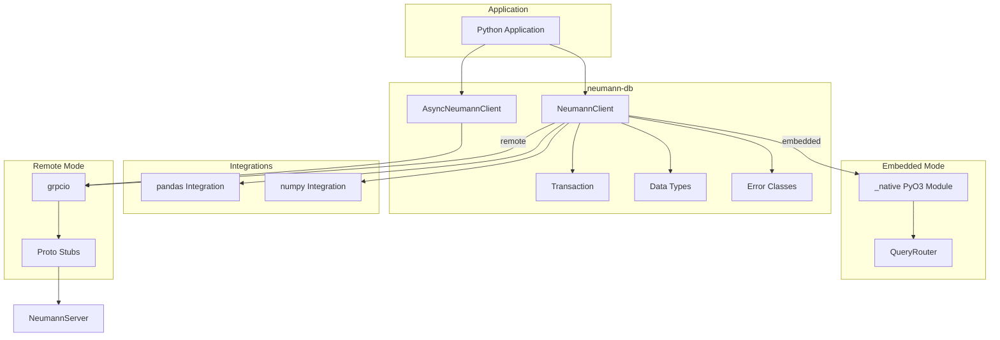

# Python SDK Architecture

The Python SDK (`neumann-db`) provides a Python client for the Neumann database
with support for both embedded mode (via PyO3 bindings) and remote mode (via
gRPC). It includes async support and integrations for pandas and numpy.

The SDK follows four design principles: Pythonic API (context managers, type
hints, dataclasses), dual-mode (same API for embedded and remote), async-first
(native asyncio support), and ecosystem integration (pandas DataFrame and numpy
array support).

## Architecture Overview



## Installation

```bash
# Basic installation (remote mode only)
pip install neumann-db

# With native module for embedded mode
pip install neumann-db[native]

# With pandas integration
pip install neumann-db[pandas]

# With numpy integration
pip install neumann-db[numpy]

# Full installation
pip install neumann-db[full]
```

## Key Types

| Type | Description |
| --- | --- |
| `NeumannClient` | Synchronous client supporting both modes |
| `AsyncNeumannClient` | Async client for remote mode |
| `Transaction` | Transaction context manager |
| `QueryResult` | Query result with typed accessors |
| `QueryResultType` | Enum of result types |
| `Value` | Typed scalar value |
| `ScalarType` | Enum of scalar types |
| `Row` | Relational row with typed column accessors |
| `Node` | Graph node with properties |
| `Edge` | Graph edge with properties |
| `Path` | Graph path as list of segments |
| `PathSegment` | Path segment (node + optional edge) |
| `SimilarItem` | Vector similarity result |
| `ArtifactInfo` | Blob artifact metadata |
| `NeumannError` | Base exception class |

## Client Modes

| Mode | Class Method | Requirements | Use Case |
| --- | --- | --- | --- |
| Embedded | `NeumannClient.embedded()` | `neumann-db[native]` | Testing, CLI tools |
| Remote | `NeumannClient.connect()` | `grpcio` | Production |
| Async Remote | `AsyncNeumannClient.connect()` | `grpcio` | Async applications |

## Synchronous Client

### Embedded Mode

```python
from neumann import NeumannClient

# In-memory database
client = NeumannClient.embedded()

# Persistent storage
client = NeumannClient.embedded(path="/path/to/data")

# Use as context manager
with NeumannClient.embedded() as client:
    client.execute("CREATE TABLE users (name:string)")
```

### Remote Mode

```python
from neumann import NeumannClient

# Basic connection
client = NeumannClient.connect("localhost:9200")

# With authentication and TLS
client = NeumannClient.connect(
    "db.example.com:9443",
    api_key="your-api-key",
    tls=True,
)

# Context manager
with NeumannClient.connect("localhost:9200") as client:
    result = client.execute("SELECT users")
```

### Query Execution

```python
# Single query
result = client.execute("SELECT users")

# With identity for vault access
result = client.execute(
    "VAULT GET 'secret'",
    identity="service:backend",
)

# Streaming query
for chunk in client.execute_stream("SELECT large_table"):
    for row in chunk.rows:
        print(row.to_dict())

# Batch execution
results = client.execute_batch([
    "CREATE TABLE orders (id:int, total:float)",
    "INSERT orders id=1, total=99.99",
    "SELECT orders",
])
```

## Async Client

The async client supports remote mode only (PyO3 has threading limitations):

```python
from neumann.aio import AsyncNeumannClient

# Connect
client = await AsyncNeumannClient.connect(
    "localhost:9200",
    api_key="your-api-key",
)

# Execute query
result = await client.execute("SELECT users")

# Streaming
async for chunk in client.execute_stream("SELECT large_table"):
    for row in chunk.rows:
        print(row.to_dict())

# Batch
results = await client.execute_batch(queries)

# Close
await client.close()
```

### Async Context Manager

```python
async with await AsyncNeumannClient.connect("localhost:9200") as client:
    result = await client.execute("SELECT users")
    for row in result.rows:
        print(row.to_dict())
```

### Run Embedded in Async Context

Use `run_in_executor` to use embedded mode from async code:

```python
async def query_embedded():
    client = await AsyncNeumannClient.connect("localhost:9200")
    # This runs the embedded client in a thread pool
    result = await client.run_in_executor("SELECT users")
    return result
```

## Transaction Support

Transactions provide automatic commit/rollback with context managers:

```python
from neumann import NeumannClient, Transaction

client = NeumannClient.connect("localhost:9200")

# Using Transaction directly
tx = Transaction(client)
tx.begin()
try:
    tx.execute("INSERT users name='Alice'")
    tx.execute("INSERT users name='Bob'")
    tx.commit()
except Exception:
    tx.rollback()
    raise

# Using context manager (preferred)
with Transaction(client) as tx:
    tx.execute("INSERT users name='Alice'")
    tx.execute("INSERT users name='Bob'")
    # Auto-commits on success, auto-rollbacks on exception
```

### Transaction Properties

| Property | Type | Description |
| --- | --- | --- |
| `is_active` | `bool` | True if transaction is active |

### Transaction Methods

| Method | Description |
| --- | --- |
| `begin()` | Start the transaction |
| `commit()` | Commit the transaction |
| `rollback()` | Rollback the transaction |
| `execute(query)` | Execute query within transaction |

## Query Result Types

The `QueryResult` class provides typed access to query results:

| Property | Return Type | Description |
| --- | --- | --- |
| `type` | `QueryResultType` | Result type enum |
| `is_empty` | `bool` | True if empty result |
| `is_error` | `bool` | True if error result |
| `value` | `str` or `None` | Single value result |
| `count` | `int` or `None` | Row count |
| `rows` | `list[Row]` | Relational rows |
| `nodes` | `list[Node]` | Graph nodes |
| `edges` | `list[Edge]` | Graph edges |
| `paths` | `list[Path]` | Graph paths |
| `similar_items` | `list[SimilarItem]` | Similarity results |
| `ids` | `list[str]` | ID list |
| `table_names` | `list[str]` | Table names |
| `blob_data` | `bytes` or `None` | Binary data |
| `blob_info` | `ArtifactInfo` or `None` | Blob metadata |
| `error_message` | `str` or `None` | Error message |

### Result Type Enum

```python
from neumann import QueryResultType

result = client.execute(query)

match result.type:
    case QueryResultType.EMPTY:
        print("OK")
    case QueryResultType.COUNT:
        print(f"{result.count} rows affected")
    case QueryResultType.ROWS:
        for row in result.rows:
            print(row.to_dict())
    case QueryResultType.NODES:
        for node in result.nodes:
            print(f"[{node.id}] {node.label}")
    case QueryResultType.SIMILAR:
        for item in result.similar_items:
            print(f"{item.key}: {item.score:.4f}")
    case QueryResultType.ERROR:
        raise Exception(result.error_message)
```

## Data Types

### Value

Immutable typed scalar value:

```python
from neumann import Value, ScalarType

# Create values
v1 = Value.null()
v2 = Value.int_(42)
v3 = Value.float_(3.14)
v4 = Value.string("hello")
v5 = Value.bool_(True)
v6 = Value.bytes_(b"data")

# Access type and data
print(v2.type)  # ScalarType.INT
print(v2.data)  # 42

# Convert to Python native type
native = v2.as_python()  # 42
```

### Row

Relational row with typed accessors:

```python
from neumann import Row

row = result.rows[0]

# Get raw Value
val = row.get("name")

# Get typed values
name: str | None = row.get_string("name")
age: int | None = row.get_int("age")
score: float | None = row.get_float("score")
active: bool | None = row.get_bool("active")

# Convert to dict
data = row.to_dict()  # {"name": "Alice", "age": 30}
```

### Node

Graph node with properties:

```python
from neumann import Node

node = result.nodes[0]

print(node.id)      # "1"
print(node.label)   # "person"

# Get property
name = node.get_property("name")

# Convert to dict
data = node.to_dict()
# {"id": "1", "label": "person", "properties": {"name": "Alice"}}
```

### Edge

Graph edge with properties:

```python
from neumann import Edge

edge = result.edges[0]

print(edge.id)         # "1"
print(edge.edge_type)  # "knows"
print(edge.source)     # "1"
print(edge.target)     # "2"

# Get property
since = edge.get_property("since")

# Convert to dict
data = edge.to_dict()
# {"id": "1", "type": "knows", "source": "1", "target": "2", "properties": {}}
```

### Path

Graph path as segments:

```python
from neumann import Path

path = result.paths[0]

# Get all nodes in path
nodes = path.nodes  # [Node, Node, ...]

# Get all edges in path
edges = path.edges  # [Edge, Edge, ...]

# Path length
length = len(path)

# Iterate segments
for segment in path.segments:
    print(f"Node: {segment.node.id}")
    if segment.edge:
        print(f"  -> via edge {segment.edge.id}")
```

### SimilarItem

Vector similarity result:

```python
from neumann import SimilarItem

for item in result.similar_items:
    print(f"Key: {item.key}")
    print(f"Score: {item.score:.4f}")
    if item.metadata:
        print(f"Metadata: {item.metadata}")
```

### ArtifactInfo

Blob artifact metadata:

```python
from neumann import ArtifactInfo

info = result.blob_info
print(f"ID: {info.artifact_id}")
print(f"Filename: {info.filename}")
print(f"Size: {info.size} bytes")
print(f"Checksum: {info.checksum}")
print(f"Content-Type: {info.content_type}")
print(f"Created: {info.created_at}")
print(f"Tags: {info.tags}")
```

## Error Handling

### Error Codes

| Code | Name | Description |
| --- | --- | --- |
| 0 | `UNKNOWN` | Unknown error |
| 1 | `INVALID_ARGUMENT` | Bad request data |
| 2 | `NOT_FOUND` | Resource not found |
| 3 | `PERMISSION_DENIED` | Access denied |
| 4 | `ALREADY_EXISTS` | Resource exists |
| 5 | `UNAUTHENTICATED` | Auth failed |
| 6 | `UNAVAILABLE` | Server unavailable |
| 7 | `INTERNAL` | Internal error |
| 8 | `PARSE_ERROR` | Query parse error |
| 9 | `QUERY_ERROR` | Query execution error |

### Error Classes

```python
from neumann import (
    NeumannError,
    ConnectionError,
    AuthenticationError,
    PermissionError,
    NotFoundError,
    InvalidArgumentError,
    ParseError,
    QueryError,
    InternalError,
    ErrorCode,
)

try:
    result = client.execute("SELECT nonexistent")
except ConnectionError as e:
    print(f"Connection failed: {e.message}")
except AuthenticationError:
    print("Check your API key")
except ParseError as e:
    print(f"Query syntax error: {e.message}")
except NeumannError as e:
    print(f"[{e.code.name}] {e.message}")
```

### Error Factory

```python
from neumann.errors import error_from_code, ErrorCode

# Create error from code
error = error_from_code(ErrorCode.NOT_FOUND, "Table 'users' not found")
# Returns NotFoundError instance
```

## Pandas Integration

Convert query results to pandas DataFrames:

```python
from neumann.integrations.pandas import (
    result_to_dataframe,
    rows_to_dataframe,
    dataframe_to_inserts,
)

# Result to DataFrame
result = client.execute("SELECT users")
df = result_to_dataframe(result)

# Rows to DataFrame
df = rows_to_dataframe(result.rows)

# DataFrame to INSERT statements
inserts = dataframe_to_inserts(
    df,
    table="users",
    column_mapping={"user_name": "name"},  # Optional column rename
)

# Execute inserts
for query in inserts:
    client.execute(query)
```

## NumPy Integration

Work with vectors using numpy arrays:

```python
from neumann.integrations.numpy import (
    vector_to_insert,
    vectors_to_inserts,
    parse_embedding,
    cosine_similarity,
    euclidean_distance,
    normalize_vectors,
)
import numpy as np

# Single vector to INSERT
query = vector_to_insert("doc1", np.array([0.1, 0.2, 0.3]))
client.execute(query)

# Multiple vectors
vectors = {
    "doc1": np.array([0.1, 0.2, 0.3]),
    "doc2": np.array([0.4, 0.5, 0.6]),
}
queries = vectors_to_inserts(vectors, normalize=True)
for q in queries:
    client.execute(q)

# Parse embedding from result
embedding = parse_embedding("[0.1, 0.2, 0.3]")

# Distance calculations
sim = cosine_similarity(vec1, vec2)
dist = euclidean_distance(vec1, vec2)

# Batch normalization
normalized = normalize_vectors(np.array([vec1, vec2, vec3]))
```

## Usage Examples

### Complete CRUD Example

```python
from neumann import NeumannClient

with NeumannClient.connect("localhost:9200") as client:
    # Create table
    client.execute("CREATE TABLE products (name:string, price:float)")

    # Insert data
    client.execute('INSERT products name="Widget", price=9.99')
    client.execute('INSERT products name="Gadget", price=19.99')

    # Query data
    result = client.execute("SELECT products WHERE price > 10")
    for row in result.rows:
        print(row.to_dict())

    # Update
    client.execute('UPDATE products SET price=24.99 WHERE name="Gadget"')

    # Delete
    client.execute("DELETE products WHERE price < 15")

    # Drop table
    client.execute("DROP TABLE products")
```

### Graph Operations

```python
from neumann import NeumannClient

with NeumannClient.connect("localhost:9200") as client:
    # Create nodes
    client.execute('NODE CREATE person {name: "Alice", age: 30}')
    client.execute('NODE CREATE person {name: "Bob", age: 25}')

    # Create edge
    client.execute("EDGE CREATE 1 -> 2 : knows {since: 2020}")

    # List nodes
    result = client.execute("NODE LIST person")
    for node in result.nodes:
        print(f"[{node.id}] {node.label}: {node.to_dict()['properties']}")

    # Find neighbors
    result = client.execute("NEIGHBORS 1 OUTGOING")

    # Find path
    result = client.execute("PATH 1 -> 2")
    if result.paths:
        path = result.paths[0]
        print(" -> ".join(n.id for n in path.nodes))
```

### Vector Search with NumPy

```python
from neumann import NeumannClient
from neumann.integrations.numpy import vector_to_insert, normalize_vectors
import numpy as np

with NeumannClient.connect("localhost:9200") as client:
    # Generate and store embeddings
    embeddings = np.random.randn(100, 768).astype(np.float32)
    embeddings = normalize_vectors(embeddings)

    for i, emb in enumerate(embeddings):
        query = vector_to_insert(f"doc{i}", emb)
        client.execute(query)

    # Query vector
    query_vec = np.random.randn(768).astype(np.float32)
    query_str = vector_to_insert("query", query_vec)
    client.execute(query_str)

    # Find similar
    result = client.execute('SIMILAR "query" COSINE LIMIT 10')
    for item in result.similar_items:
        print(f"{item.key}: {item.score:.4f}")
```

### Async Web Application

```python
from fastapi import FastAPI
from neumann.aio import AsyncNeumannClient

app = FastAPI()
client: AsyncNeumannClient | None = None

@app.on_event("startup")
async def startup():
    global client
    client = await AsyncNeumannClient.connect(
        "localhost:9200",
        api_key="your-api-key",
    )

@app.on_event("shutdown")
async def shutdown():
    if client:
        await client.close()

@app.get("/users")
async def get_users():
    result = await client.execute("SELECT users")
    return [row.to_dict() for row in result.rows]

@app.get("/users/{user_id}")
async def get_user(user_id: int):
    result = await client.execute(f"SELECT users WHERE id = {user_id}")
    if result.rows:
        return result.rows[0].to_dict()
    return {"error": "Not found"}
```

## Dependencies

| Package | Purpose | Extra |
| --- | --- | --- |
| `grpcio` | gRPC client | Default |
| `protobuf` | Protocol buffers | Default |
| `neumann-native` | PyO3 bindings | `[native]` |
| `pandas` | DataFrame support | `[pandas]` |
| `numpy` | Array support | `[numpy]` |

## Related Modules

| Module | Relationship |
| --- | --- |
| `neumann_server` | Server that this SDK connects to |
| `neumann_client` | Rust SDK with same capabilities |
| `@neumann/client` | TypeScript SDK with same API design |
