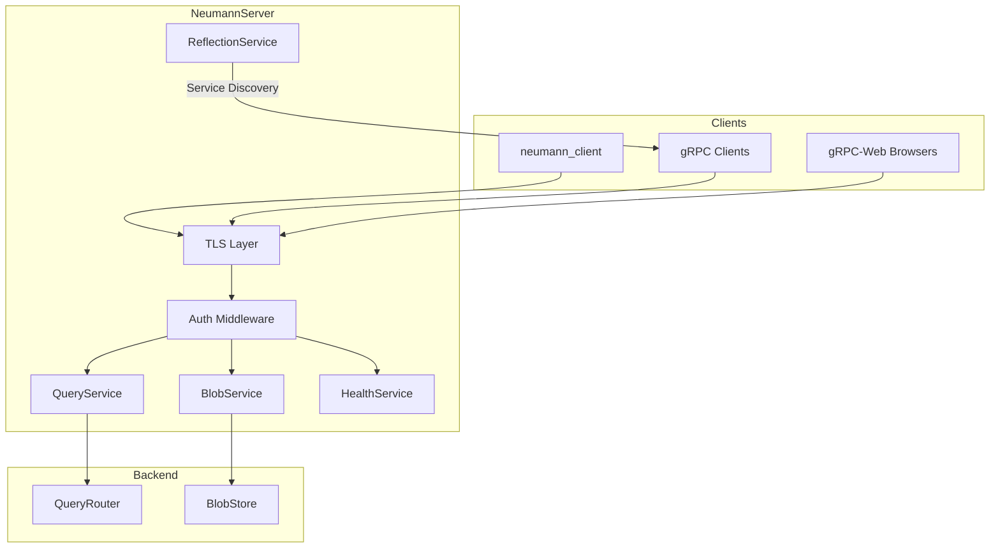
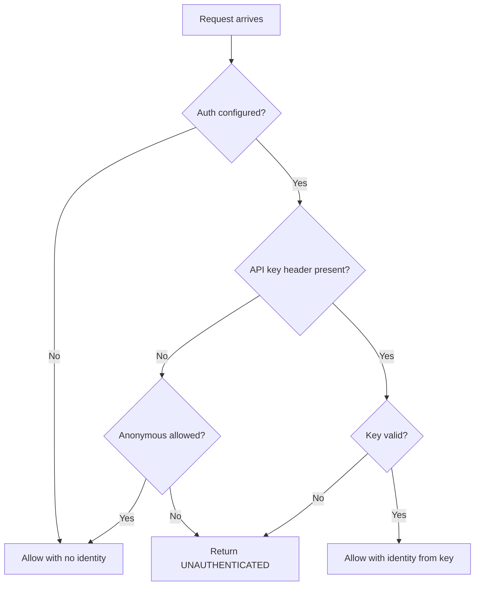
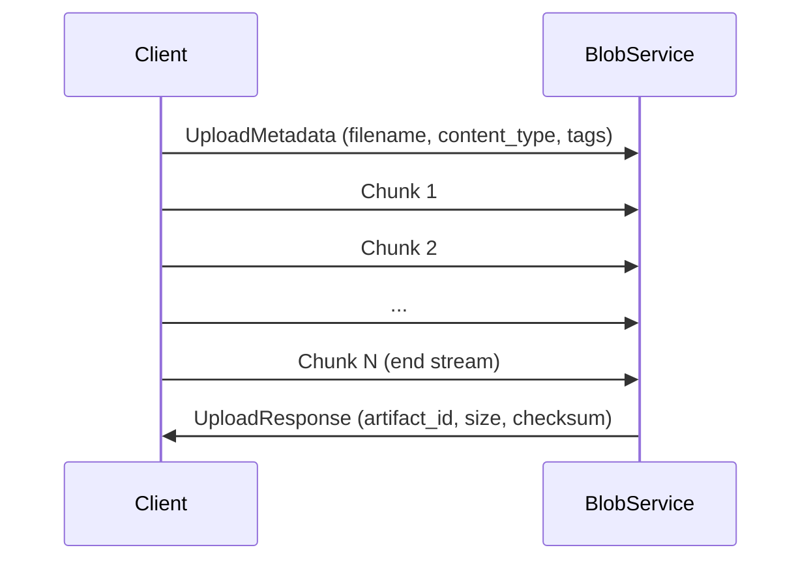
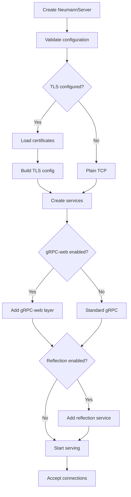

# Neumann Server Architecture

The Neumann Server (`neumann_server`) provides a gRPC server that exposes the
Neumann database over the network. It serves as the network gateway for remote
clients, wrapping the Query Router with authentication, TLS encryption, and
streaming support for large result sets and blob storage.

The server follows four design principles: zero-configuration startup (works
out of the box with sensible defaults), security-first (API key authentication
with constant-time comparison, TLS support), streaming-native (all large
operations use gRPC streaming), and health monitoring (automatic failure
tracking with configurable thresholds).

## Architecture Overview



## Key Types

| Type | Description |
| --- | --- |
| `NeumannServer` | Main server struct with router, blob store, and configuration |
| `ServerConfig` | Configuration for bind address, TLS, auth, and limits |
| `TlsConfig` | TLS certificate paths and client certificate settings |
| `AuthConfig` | API key list, header name, and anonymous access control |
| `ApiKey` | Individual API key with identity and optional description |
| `QueryServiceImpl` | gRPC service for query execution with streaming |
| `BlobServiceImpl` | gRPC service for artifact storage with streaming |
| `HealthServiceImpl` | gRPC service for health checks |
| `HealthState` | Shared health state across services |
| `ServerError` | Error type for server operations |

## Server Configuration

| Field | Type | Default | Description |
| --- | --- | --- | --- |
| `bind_addr` | `SocketAddr` | `127.0.0.1:9200` | Server bind address |
| `tls` | `Option<TlsConfig>` | `None` | TLS configuration |
| `auth` | `Option<AuthConfig>` | `None` | Authentication configuration |
| `max_message_size` | `usize` | 64 MB | Maximum gRPC message size |
| `max_upload_size` | `usize` | 512 MB | Maximum blob upload size |
| `enable_grpc_web` | `bool` | `true` | Enable gRPC-web for browsers |
| `enable_reflection` | `bool` | `true` | Enable service reflection |
| `blob_chunk_size` | `usize` | 64 KB | Chunk size for blob streaming |
| `stream_channel_capacity` | `usize` | 32 | Bounded channel capacity for backpressure |

### Configuration Builder

```rust
use neumann_server::{ServerConfig, TlsConfig, AuthConfig, ApiKey};
use std::path::PathBuf;

let config = ServerConfig::new()
    .with_bind_addr("0.0.0.0:9443".parse()?)
    .with_tls(TlsConfig::new(
        PathBuf::from("server.crt"),
        PathBuf::from("server.key"),
    ))
    .with_auth(
        AuthConfig::new()
            .with_api_key(ApiKey::new(
                "sk-prod-key-12345678".to_string(),
                "service:backend".to_string(),
            ))
            .with_anonymous(false)
    )
    .with_max_message_size(128 * 1024 * 1024)
    .with_grpc_web(true)
    .with_reflection(true);
```

## TLS Configuration

| Field | Type | Default | Description |
| --- | --- | --- | --- |
| `cert_path` | `PathBuf` | Required | Path to certificate file (PEM) |
| `key_path` | `PathBuf` | Required | Path to private key file (PEM) |
| `ca_cert_path` | `Option<PathBuf>` | `None` | CA certificate for client auth |
| `require_client_cert` | `bool` | `false` | Require client certificates |

### TLS Setup Example

```rust
use neumann_server::TlsConfig;
use std::path::PathBuf;

// Basic TLS
let tls = TlsConfig::new(
    PathBuf::from("/etc/neumann/server.crt"),
    PathBuf::from("/etc/neumann/server.key"),
);

// Mutual TLS (mTLS)
let tls = TlsConfig::new(
    PathBuf::from("/etc/neumann/server.crt"),
    PathBuf::from("/etc/neumann/server.key"),
)
.with_ca_cert(PathBuf::from("/etc/neumann/ca.crt"))
.with_required_client_cert(true);
```

## Authentication

### AuthConfig Options

| Field | Type | Default | Description |
| --- | --- | --- | --- |
| `api_keys` | `Vec<ApiKey>` | Empty | List of valid API keys |
| `api_key_header` | `String` | `x-api-key` | Header name for API key |
| `allow_anonymous` | `bool` | `false` | Allow unauthenticated access |

### API Key Validation

The server uses constant-time comparison to prevent timing attacks. All keys are
checked regardless of match status to avoid leaking information about valid
prefixes:

```rust
// Internal validation logic
fn validate_key(&self, key: &str) -> Option<&str> {
    let key_bytes = key.as_bytes();
    let mut found_identity: Option<&str> = None;

    for api_key in &self.api_keys {
        let stored_bytes = api_key.key.as_bytes();
        let max_len = stored_bytes.len().max(key_bytes.len());

        let mut matches: u8 = 1;
        for i in 0..max_len {
            let stored_byte = stored_bytes.get(i).copied().unwrap_or(0);
            let key_byte = key_bytes.get(i).copied().unwrap_or(0);
            matches &= u8::from(stored_byte == key_byte);
        }

        let lengths_match = u8::from(stored_bytes.len() == key_bytes.len());
        matches &= lengths_match;

        if matches == 1 {
            found_identity = Some(api_key.identity.as_str());
        }
    }

    found_identity
}
```

### Authentication Flow



## gRPC Services

### QueryService

The QueryService provides query execution with three RPC methods:

| Method | Type | Description |
| --- | --- | --- |
| `Execute` | Unary | Execute single query, return full result |
| `ExecuteStream` | Server streaming | Execute query, stream results chunk by chunk |
| `ExecuteBatch` | Unary | Execute multiple queries, return all results |

#### Execute RPC

```protobuf
rpc Execute(QueryRequest) returns (QueryResponse);

message QueryRequest {
    string query = 1;
    optional string identity = 2;
}

message QueryResponse {
    oneof result {
        EmptyResult empty = 1;
        CountResult count = 2;
        RowsResult rows = 3;
        NodesResult nodes = 4;
        EdgesResult edges = 5;
        PathResult path = 6;
        SimilarResult similar = 7;
        TableListResult table_list = 8;
        BlobResult blob = 9;
        IdsResult ids = 10;
    }
    optional ErrorInfo error = 15;
}
```

#### ExecuteStream RPC

For large result sets (rows, nodes, edges, similar items, blobs), the streaming
RPC sends results one item at a time:

```protobuf
rpc ExecuteStream(QueryRequest) returns (stream QueryResponseChunk);

message QueryResponseChunk {
    oneof chunk {
        RowChunk row = 1;
        NodeChunk node = 2;
        EdgeChunk edge = 3;
        SimilarChunk similar_item = 4;
        bytes blob_data = 5;
        ErrorInfo error = 15;
    }
    bool is_final = 16;
}
```

#### ExecuteBatch RPC

```protobuf
rpc ExecuteBatch(BatchQueryRequest) returns (BatchQueryResponse);

message BatchQueryRequest {
    repeated QueryRequest queries = 1;
}

message BatchQueryResponse {
    repeated QueryResponse results = 1;
}
```

**Security Note**: In batch execution, the authenticated request identity is
always used. Per-query identity fields are ignored to prevent privilege
escalation attacks.

### BlobService

The BlobService provides artifact storage with streaming upload/download:

| Method | Type | Description |
| --- | --- | --- |
| `Upload` | Client streaming | Upload artifact with metadata |
| `Download` | Server streaming | Download artifact in chunks |
| `Delete` | Unary | Delete artifact |
| `GetMetadata` | Unary | Get artifact metadata |

#### Upload Protocol



The first message must be metadata, followed by data chunks:

```protobuf
rpc Upload(stream BlobUploadRequest) returns (BlobUploadResponse);

message BlobUploadRequest {
    oneof request {
        UploadMetadata metadata = 1;
        bytes chunk = 2;
    }
}

message UploadMetadata {
    string filename = 1;
    optional string content_type = 2;
    repeated string tags = 3;
}

message BlobUploadResponse {
    string artifact_id = 1;
    uint64 size = 2;
    string checksum = 3;
}
```

#### Download Protocol

```protobuf
rpc Download(BlobDownloadRequest) returns (stream BlobDownloadChunk);

message BlobDownloadRequest {
    string artifact_id = 1;
}

message BlobDownloadChunk {
    bytes data = 1;
    bool is_final = 2;
}
```

### HealthService

The HealthService follows the gRPC health checking protocol:

```protobuf
rpc Check(HealthCheckRequest) returns (HealthCheckResponse);

message HealthCheckRequest {
    optional string service = 1;
}

message HealthCheckResponse {
    ServingStatus status = 1;
}

enum ServingStatus {
    UNSPECIFIED = 0;
    SERVING = 1;
    NOT_SERVING = 2;
}
```

#### Health Check Targets

| Service Name | Checks |
| --- | --- |
| Empty or `""` | Overall server health (all services) |
| `neumann.v1.QueryService` | Query service health |
| `neumann.v1.BlobService` | Blob service health |
| Unknown service | Returns `UNSPECIFIED` |

#### Automatic Health Tracking

The QueryService tracks consecutive failures and marks itself unhealthy after
reaching the threshold (default: 5 failures):

```rust
const FAILURE_THRESHOLD: u32 = 5;

fn record_failure(&self) {
    let failures = self.consecutive_failures.fetch_add(1, Ordering::SeqCst) + 1;
    if failures >= FAILURE_THRESHOLD {
        if let Some(ref health) = self.health_state {
            health.set_query_service_healthy(false);
        }
    }
}

fn record_success(&self) {
    self.consecutive_failures.store(0, Ordering::SeqCst);
    if let Some(ref health) = self.health_state {
        health.set_query_service_healthy(true);
    }
}
```

## Server Lifecycle

### Startup Sequence



### Basic Server Setup

```rust
use neumann_server::{NeumannServer, ServerConfig};
use query_router::QueryRouter;
use std::sync::Arc;
use parking_lot::RwLock;

#[tokio::main]
async fn main() -> Result<(), Box<dyn std::error::Error>> {
    // Create router
    let router = Arc::new(RwLock::new(QueryRouter::new()));

    // Create server with default config
    let server = NeumannServer::new(router, ServerConfig::default());

    // Start serving (blocks until shutdown)
    server.serve().await?;

    Ok(())
}
```

### Server with Shared Storage

For applications that need both query and blob services sharing the same
storage:

```rust
use neumann_server::{NeumannServer, ServerConfig};

#[tokio::main]
async fn main() -> Result<(), Box<dyn std::error::Error>> {
    let config = ServerConfig::default();

    // Creates QueryRouter and BlobStore sharing the same TensorStore
    let server = NeumannServer::with_shared_storage(config).await?;

    server.serve().await?;

    Ok(())
}
```

### Graceful Shutdown

```rust
use tokio::signal;

#[tokio::main]
async fn main() -> Result<(), Box<dyn std::error::Error>> {
    let server = NeumannServer::with_shared_storage(ServerConfig::default()).await?;

    // Shutdown on Ctrl+C
    server.serve_with_shutdown(signal::ctrl_c().map(|_| ())).await?;

    Ok(())
}
```

## Error Handling

### Server Errors

| Error | Cause | gRPC Status |
| --- | --- | --- |
| `Config` | Invalid configuration | `INVALID_ARGUMENT` |
| `Transport` | Network/TLS failure | `UNAVAILABLE` |
| `Query` | Query execution failed | `INVALID_ARGUMENT` |
| `Auth` | Authentication failed | `UNAUTHENTICATED` |
| `Blob` | Blob operation failed | `INTERNAL` |
| `Internal` | Unexpected server error | `INTERNAL` |
| `InvalidArgument` | Bad request data | `INVALID_ARGUMENT` |
| `NotFound` | Resource not found | `NOT_FOUND` |
| `PermissionDenied` | Access denied | `PERMISSION_DENIED` |
| `Io` | I/O error | `INTERNAL` |

### Error Conversion

```rust
impl From<ServerError> for Status {
    fn from(err: ServerError) -> Self {
        match &err {
            ServerError::Config(msg) => Status::invalid_argument(msg),
            ServerError::Transport(e) => Status::unavailable(e.to_string()),
            ServerError::Query(msg) => Status::invalid_argument(msg),
            ServerError::Auth(msg) => Status::unauthenticated(msg),
            ServerError::Blob(msg) => Status::internal(msg),
            ServerError::Internal(msg) => Status::internal(msg),
            ServerError::InvalidArgument(msg) => Status::invalid_argument(msg),
            ServerError::NotFound(msg) => Status::not_found(msg),
            ServerError::PermissionDenied(msg) => Status::permission_denied(msg),
            ServerError::Io(e) => Status::internal(e.to_string()),
        }
    }
}
```

## Backpressure and Flow Control

### Streaming Backpressure

The server uses bounded channels for streaming responses to prevent memory
exhaustion:

```rust
// Default: 32 items buffered
let (tx, rx) = mpsc::channel(self.stream_channel_capacity);

tokio::spawn(async move {
    for item in results {
        // This will block if channel is full, providing backpressure
        if tx.send(Ok(item)).await.is_err() {
            // Receiver dropped, stop sending
            return;
        }
    }
});
```

### Upload Size Limits

The BlobService enforces upload size limits:

```rust
if data.len().saturating_add(chunk.len()) > max_size {
    return Err(Status::resource_exhausted(format!(
        "upload exceeds maximum size of {max_size} bytes"
    )));
}
```

## Production Deployment

### Recommended Configuration

```rust
let config = ServerConfig::new()
    .with_bind_addr("0.0.0.0:9443".parse()?)
    .with_tls(TlsConfig::new(
        PathBuf::from("/etc/neumann/tls/server.crt"),
        PathBuf::from("/etc/neumann/tls/server.key"),
    ))
    .with_auth(
        AuthConfig::new()
            .with_api_key(ApiKey::new(
                std::env::var("NEUMANN_API_KEY")?,
                "service:default".to_string(),
            ))
            .with_anonymous(false)
    )
    .with_max_message_size(64 * 1024 * 1024)
    .with_max_upload_size(1024 * 1024 * 1024)  // 1GB
    .with_stream_channel_capacity(64)
    .with_grpc_web(true)
    .with_reflection(false);  // Disable in production
```

### Health Check Integration

Use health checks with load balancers:

```bash
# grpcurl health check
grpcurl -plaintext localhost:9200 neumann.v1.Health/Check

# With service name
grpcurl -plaintext -d '{"service":"neumann.v1.QueryService"}' \
    localhost:9200 neumann.v1.Health/Check
```

### Logging

The server uses the `tracing` crate for structured logging:

```rust
use tracing_subscriber::FmtSubscriber;

let subscriber = FmtSubscriber::builder()
    .with_max_level(tracing::Level::INFO)
    .finish();
tracing::subscriber::set_global_default(subscriber)?;

// Server logs connection info and errors
// INFO: Starting Neumann gRPC server with TLS on 0.0.0.0:9443
// ERROR: Query execution error: table 'users' not found
```

## Dependencies

| Crate | Purpose |
| --- | --- |
| `query_router` | Query execution backend |
| `tensor_blob` | Blob storage backend |
| `tensor_store` | Shared storage for both query and blob |
| `tonic` | gRPC server framework |
| `tonic-web` | gRPC-web layer for browser support |
| `tonic-reflection` | Service reflection for debugging |
| `tokio` | Async runtime |
| `parking_lot` | Thread-safe router access |
| `tracing` | Structured logging |
| `thiserror` | Error type derivation |

## Related Modules

| Module | Relationship |
| --- | --- |
| `neumann_client` | Client SDK for connecting to this server |
| `query_router` | Query execution backend |
| `tensor_blob` | Blob storage backend |
| `neumann_shell` | Interactive CLI (alternative interface) |
