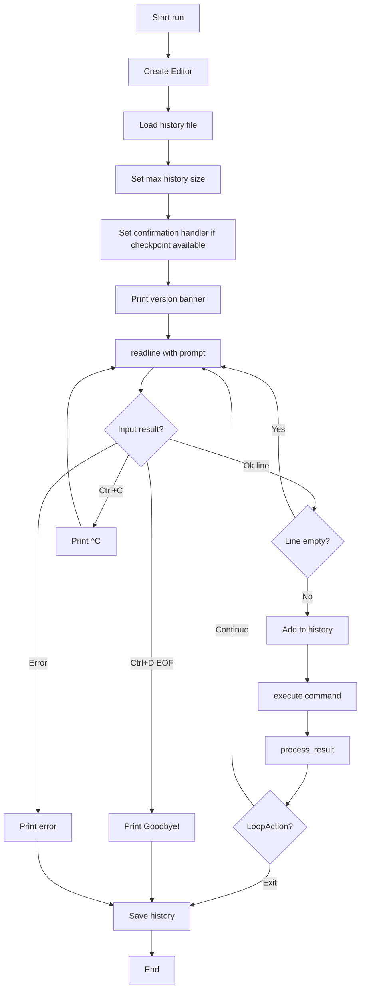
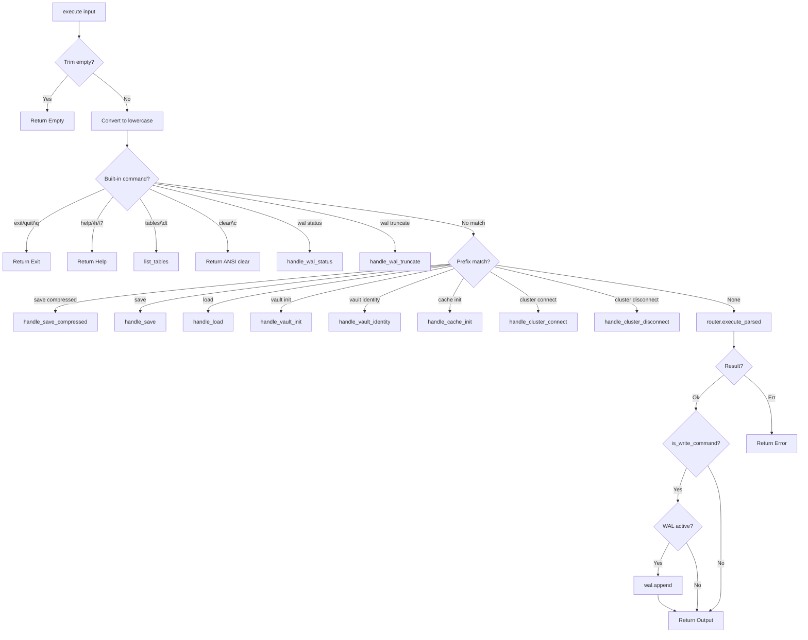
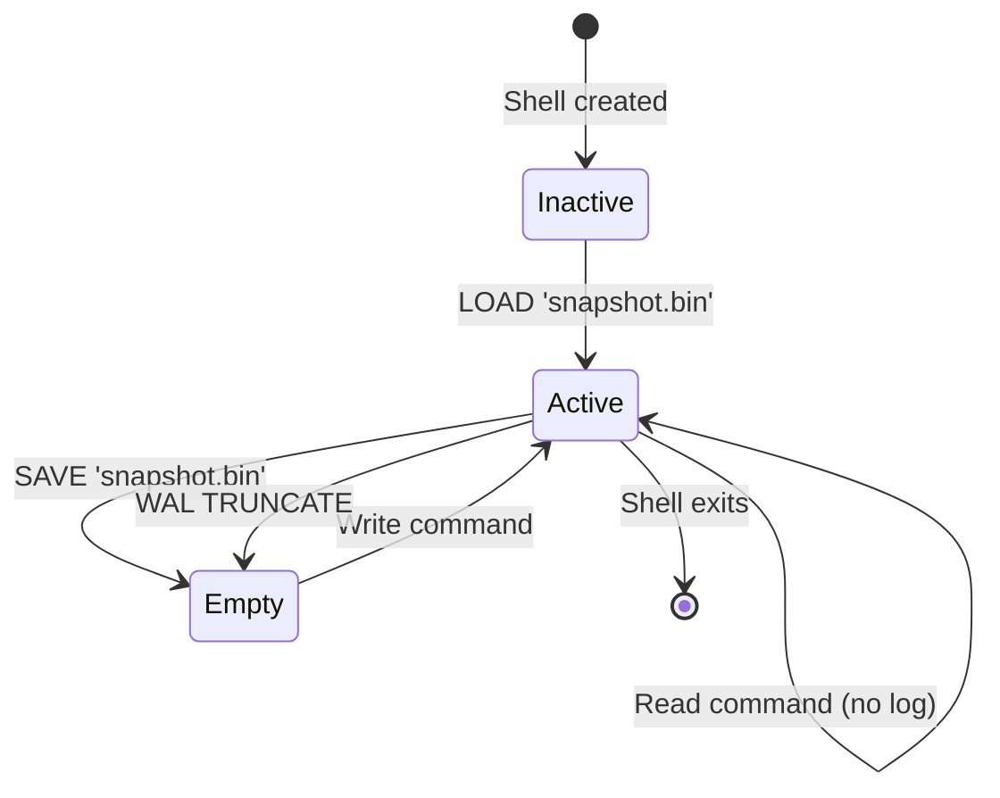

# Neumann Shell Architecture

The Neumann Shell (`neumann_shell`) provides an interactive CLI interface for
the Neumann database. It is a thin layer that delegates query execution to the
Query Router while providing readline-based input handling, command history,
output formatting, and crash recovery via write-ahead logging.

The shell follows four design principles: human-first interface (readable
prompts, formatted output, command history), thin layer (minimal logic,
delegates to Query Router), graceful handling (Ctrl+C does not exit, errors
displayed cleanly), and zero configuration (works out of the box with sensible
defaults).

## Key Types

| Type | Description |
| --- | --- |
| `Shell` | Main shell struct holding router, config, and WAL state |
| `ShellConfig` | Configuration for history file, history size, and prompt |
| `CommandResult` | Result enum: `Output`, `Exit`, `Help`, `Empty`, `Error` |
| `LoopAction` | Action after command: `Continue` or `Exit` |
| `ShellError` | Error type for initialization failures |
| `Wal` | Internal write-ahead log for crash recovery |
| `RouterExecutor` | Wrapper implementing `QueryExecutor` trait for cluster operations |
| `ShellConfirmationHandler` | Interactive confirmation handler for destructive operations |

## Shell Configuration

| Field | Type | Default | Description |
| --- | --- | --- | --- |
| `history_file` | `Option<PathBuf>` | `~/.neumann_history` | Path for persistent history |
| `history_size` | `usize` | `1000` | Maximum history entries |
| `prompt` | `String` | `"> "` | Input prompt string |

The default history file location is determined by reading the `HOME`
environment variable:

```rust
fn dirs_home() -> Option<PathBuf> {
    std::env::var_os("HOME").map(PathBuf::from)
}
```

## Command Result Types

| Variant | Description | REPL Behavior |
| --- | --- | --- |
| `Output(String)` | Query executed successfully with output | Print to stdout, continue loop |
| `Exit` | Shell should exit | Print "Goodbye!", break loop |
| `Help(String)` | Help text to display | Print to stdout, continue loop |
| `Empty` | Empty input (no-op) | Continue loop silently |
| `Error(String)` | Error occurred | Print to stderr, continue loop |

## REPL Loop Implementation

The shell implements a Read-Eval-Print Loop (REPL) using the `rustyline` crate
for readline functionality. Here is the complete control flow:



### Initialization Sequence

```rust
pub fn run(&mut self) -> Result<(), ShellError> {
    // 1. Create rustyline editor
    let editor: Editor<(), DefaultHistory> =
        DefaultEditor::new().map_err(|e| ShellError::Init(e.to_string()))?;
    let editor = Arc::new(Mutex::new(editor));

    // 2. Load existing history
    {
        let mut ed = editor.lock();
        if let Some(ref path) = self.config.history_file {
            let _ = ed.load_history(path);
        }
        ed.history_mut()
            .set_max_len(self.config.history_size)
            .map_err(|e| ShellError::Init(e.to_string()))?;
    }

    // 3. Set up confirmation handler for destructive operations
    {
        let router = self.router.read();
        if router.has_checkpoint() {
            let handler = Arc::new(ShellConfirmationHandler::new(Arc::clone(&editor)));
            drop(router);
            let router = self.router.write();
            if let Err(e) = router.set_confirmation_handler(handler) {
                eprintln!("Warning: Failed to set confirmation handler: {e}");
            }
        }
    }

    println!("Neumann Database Shell v{}", Self::version());
    println!("Type 'help' for available commands.\n");

    // 4. Main REPL loop
    loop {
        let readline_result = {
            let mut ed = editor.lock();
            ed.readline(&self.config.prompt)
        };

        match readline_result {
            Ok(line) => {
                if !line.trim().is_empty() {
                    let mut ed = editor.lock();
                    let _ = ed.add_history_entry(line.trim());
                }
                if Self::process_result(&self.execute(&line)) == LoopAction::Exit {
                    break;
                }
            },
            Err(ReadlineError::Interrupted) => println!("^C"),
            Err(ReadlineError::Eof) => {
                println!("Goodbye!");
                break;
            },
            Err(err) => {
                eprintln!("Error: {err}");
                break;
            },
        }
    }

    // 5. Save history on exit
    if let Some(ref path) = self.config.history_file {
        let mut ed = editor.lock();
        let _ = ed.save_history(path);
    }
    Ok(())
}
```

### Command Execution Flow



## Usage Examples

### Shell Creation

```rust
use neumann_shell::{Shell, ShellConfig};

// Default configuration
let shell = Shell::new();

// Custom configuration
let config = ShellConfig {
    history_file: Some("/custom/path/.neumann_history".into()),
    history_size: 500,
    prompt: "neumann> ".to_string(),
};
let shell = Shell::with_config(config);
```

### Running the REPL

```rust
shell.run()?;
```

### Programmatic Execution

```rust
use neumann_shell::CommandResult;

match shell.execute("SELECT * FROM users") {
    CommandResult::Output(text) => println!("{}", text),
    CommandResult::Error(err) => eprintln!("Error: {}", err),
    CommandResult::Exit => println!("Goodbye!"),
    CommandResult::Help(text) => println!("{}", text),
    CommandResult::Empty => {},
}
```

### Direct Router Access

The shell provides thread-safe access to the underlying Query Router:

```rust
// Read-only access
let router_guard = shell.router();
let tables = router_guard.list_tables();

// Mutable access
let mut router_guard = shell.router_mut();
router_guard.init_vault(&key)?;

// Get Arc clone for shared ownership
let router_arc = shell.router_arc();
```

## Built-in Commands

| Command | Aliases | Description |
| --- | --- | --- |
| `help` | `\h`, `\?` | Show help message |
| `exit` | `quit`, `\q` | Exit the shell |
| `tables` | `\dt` | List all tables |
| `clear` | `\c` | Clear the screen (ANSI escape: `\x1B[2J\x1B[H`) |
| `save 'path'` | --- | Save database snapshot to file |
| `save compressed 'path'` | --- | Save compressed snapshot (int8 quantization) |
| `load 'path'` | --- | Load database snapshot from file (auto-detects format) |
| `wal status` | --- | Show write-ahead log status |
| `wal truncate` | --- | Clear the write-ahead log |
| `vault init` | --- | Initialize vault from `NEUMANN_VAULT_KEY` environment variable |
| `vault identity 'name'` | --- | Set current identity for vault access control |
| `cache init` | --- | Initialize semantic cache with default configuration |
| `cluster connect` | --- | Connect to cluster with specified node addresses |
| `cluster disconnect` | --- | Disconnect from cluster |

### Command Parsing Details

All built-in commands are case-insensitive. The shell first converts input to
lowercase before matching:

```rust
let lower = trimmed.to_lowercase();
match lower.as_str() {
    "exit" | "quit" | "\\q" => return CommandResult::Exit,
    "help" | "\\h" | "\\?" => return CommandResult::Help(Self::help_text()),
    "tables" | "\\dt" => return self.list_tables(),
    "clear" | "\\c" => return CommandResult::Output("\x1B[2J\x1B[H".to_string()),
    "wal status" => return self.handle_wal_status(),
    "wal truncate" => return self.handle_wal_truncate(),
    _ => {},
}
```

### Path Extraction

The `extract_path` function handles both quoted and unquoted paths:

```rust
fn extract_path(input: &str, command: &str) -> Option<String> {
    let rest = input[command.len()..].trim();
    if rest.is_empty() {
        return None;
    }

    // Handle quoted path (single or double quotes)
    if (rest.starts_with('\'') && rest.ends_with('\''))
        || (rest.starts_with('"') && rest.ends_with('"'))
    {
        if rest.len() > 2 {
            return Some(rest[1..rest.len() - 1].to_string());
        }
        return None;
    }

    // Handle unquoted path
    Some(rest.to_string())
}
```

**Examples:**

- `save 'foo.bin'` -> `Some("foo.bin")`
- `LOAD "bar.bin"` -> `Some("bar.bin")`
- `save /path/to/file.bin` -> `Some("/path/to/file.bin")`
- `save ''` -> `None`
- `save` -> `None`

## Query Support

The shell supports all query types from the Query Router:

### Relational (SQL)

```sql
CREATE TABLE users (id INT, name TEXT, email TEXT)
INSERT INTO users VALUES (1, 'Alice', 'alice@example.com')
SELECT * FROM users WHERE id = 1
UPDATE users SET name = 'Bob' WHERE id = 1
DELETE FROM users WHERE id = 1
DROP TABLE users
```

### Graph

```sql
NODE CREATE person {name: 'Alice', age: 30}
NODE LIST [label]
NODE GET id
EDGE CREATE node1 -> node2 : label [{props}]
EDGE LIST [type]
EDGE GET id
NEIGHBORS node_id OUTGOING|INCOMING|BOTH [: label]
PATH node1 -> node2 [LIMIT n]
```

### Vector

```sql
EMBED STORE 'key' [vector values]
EMBED GET 'key'
EMBED DELETE 'key'
SIMILAR 'key' [COSINE|EUCLIDEAN|DOT_PRODUCT] LIMIT n
```

### Unified (Cross-Engine)

```sql
FIND NODE [label] [WHERE condition] [LIMIT n]
FIND EDGE [type] [WHERE condition] [LIMIT n]
```

### Blob Storage

```sql
BLOB PUT 'path' [CHUNK size] [TAGS 'a','b'] [FOR 'entity']
BLOB GET 'id' TO 'path'
BLOB DELETE 'id'
BLOB INFO 'id'
BLOB LINK 'id' TO 'entity'
BLOB UNLINK 'id' FROM 'entity'
BLOBS
BLOBS FOR 'entity'
BLOBS BY TAG 'tag'
```

### Vault (Secrets)

```sql
VAULT INIT
VAULT IDENTITY 'node:name'
VAULT SET 'key' 'value'
VAULT GET 'key'
VAULT DELETE 'key'
VAULT LIST 'pattern'
VAULT ROTATE 'key' 'new'
VAULT GRANT 'entity' ON 'key'
VAULT REVOKE 'entity' ON 'key'
```

### Cache (LLM Responses)

```sql
CACHE INIT
CACHE STATS
CACHE CLEAR
CACHE EVICT [n]
CACHE GET 'key'
CACHE PUT 'key' 'value'
```

### Checkpoints (Rollback)

```sql
CHECKPOINT
CHECKPOINT 'name'
CHECKPOINTS
CHECKPOINTS LIMIT n
ROLLBACK TO 'name-or-id'
```

## Write-Ahead Log (WAL)

The shell includes a write-ahead log for crash recovery. When enabled, all write
commands are logged to a file that can be replayed after loading a snapshot.

### WAL Data Structure

```rust
struct Wal {
    file: File,    // Open file handle for appending
    path: PathBuf, // Path to WAL file (derived from snapshot: data.bin -> data.log)
}

impl Wal {
    fn open_append(path: &Path) -> std::io::Result<Self>;
    fn append(&mut self, cmd: &str) -> std::io::Result<()>;  // Writes line + flush
    fn truncate(&mut self) -> std::io::Result<()>;           // Recreates empty file
    fn path(&self) -> &Path;
    fn size(&self) -> std::io::Result<u64>;
}
```

### WAL File Format

The WAL is a simple text file with one command per line. Each command is written
verbatim followed by a newline and an immediate flush:

```sql
INSERT INTO users VALUES (1, 'Alice')
NODE CREATE person {name: 'Bob'}
EMBED STORE 'doc1' [0.1, 0.2, 0.3]
```

**Format details:**

- Line-delimited plain text
- UTF-8 encoded
- Each line is the exact command string
- Flushed immediately after each write for durability
- Empty lines are skipped during replay

### WAL Lifecycle



### Write Command Detection

The `is_write_command` function determines which commands should be logged to
the WAL:

```rust
fn is_write_command(cmd: &str) -> bool {
    let upper = cmd.to_uppercase();
    let first_word = upper.split_whitespace().next().unwrap_or("");

    match first_word {
        "INSERT" | "UPDATE" | "DELETE" | "CREATE" | "DROP" => true,
        "NODE" => !upper.contains("NODE GET"),
        "EDGE" => !upper.contains("EDGE GET"),
        "EMBED" => upper.contains("EMBED STORE") || upper.contains("EMBED DELETE"),
        "VAULT" => {
            upper.contains("VAULT SET")
                || upper.contains("VAULT DELETE")
                || upper.contains("VAULT ROTATE")
                || upper.contains("VAULT GRANT")
                || upper.contains("VAULT REVOKE")
        },
        "CACHE" => upper.contains("CACHE CLEAR"),
        "BLOB" => {
            upper.contains("BLOB PUT")
                || upper.contains("BLOB DELETE")
                || upper.contains("BLOB LINK")
                || upper.contains("BLOB UNLINK")
                || upper.contains("BLOB TAG")
                || upper.contains("BLOB UNTAG")
                || upper.contains("BLOB GC")
                || upper.contains("BLOB REPAIR")
                || upper.contains("BLOB META SET")
        },
        _ => false,
    }
}
```

**Write commands logged to WAL:**

| Category | Commands |
| --- | --- |
| Relational | `INSERT`, `UPDATE`, `DELETE`, `CREATE`, `DROP` |
| Graph | `NODE CREATE`, `NODE DELETE`, `EDGE CREATE`, `EDGE DELETE` |
| Vector | `EMBED STORE`, `EMBED DELETE` |
| Vault | `VAULT SET`, `VAULT DELETE`, `VAULT ROTATE`, `VAULT GRANT`, `VAULT REVOKE` |
| Cache | `CACHE CLEAR` |
| Blob | `BLOB PUT`, `BLOB DELETE`, `BLOB LINK`, `BLOB UNLINK`, `BLOB TAG`, `BLOB UNTAG`, `BLOB GC`, `BLOB REPAIR`, `BLOB META SET` |

### WAL Replay Algorithm

```rust
fn replay_wal(&self, wal_path: &Path) -> Result<usize, String> {
    let file = File::open(wal_path).map_err(|e| format!("Failed to open WAL: {e}"))?;
    let reader = BufReader::new(file);

    let mut count = 0;
    for (line_num, line) in reader.lines().enumerate() {
        let cmd = line.map_err(|e| format!("Failed to read WAL line {}: {e}", line_num + 1))?;
        let cmd = cmd.trim();

        if cmd.is_empty() {
            continue;  // Skip empty lines
        }

        let result = self.router.read().execute_parsed(cmd);
        if let Err(e) = result {
            return Err(format!("WAL replay failed at line {}: {e}", line_num + 1));
        }
        count += 1;
    }

    Ok(count)
}
```

### Example Session

```sql
> LOAD 'data.bin'
Loaded snapshot from: data.bin

> INSERT INTO users VALUES (1, 'Alice')
1 row affected

> -- If the shell crashes here, the INSERT is saved in data.log

> -- On next load, the WAL is automatically replayed:
> LOAD 'data.bin'
Loaded snapshot from: data.bin
Replayed 1 commands from WAL

> WAL STATUS
WAL enabled
  Path: data.log
  Size: 42 bytes

> SAVE 'data.bin'
Saved snapshot to: data.bin

> WAL STATUS
WAL enabled
  Path: data.log
  Size: 0 bytes
```

**WAL Behavior Summary:**

- WAL is activated after `LOAD` (stored as `<snapshot>.log`)
- All write commands (INSERT, UPDATE, DELETE, NODE CREATE, etc.) are logged
- On subsequent `LOAD`, the snapshot is loaded first, then WAL is replayed
- `SAVE` truncates the WAL (snapshot now contains all data)
- `WAL TRUNCATE` manually clears the log without saving

## Persistence Commands

### Save and Load

```sql
> CREATE TABLE users (id INT, name TEXT)
OK

> INSERT INTO users VALUES (1, 'Alice')
1 row affected

> SAVE 'backup.bin'
Saved snapshot to: backup.bin

> SAVE COMPRESSED 'backup_compressed.bin'
Saved compressed snapshot to: backup_compressed.bin

> LOAD 'backup.bin'
Loaded snapshot from: backup.bin
```

### Auto-Detection of Embedding Dimension

For compressed snapshots, the shell auto-detects the embedding dimension by
sampling stored vectors:

```rust
fn detect_embedding_dimension(store: &TensorStore) -> usize {
    // Sample vectors to find dimension
    let keys = store.scan("");
    for key in keys.iter().take(100) {
        if let Ok(tensor) = store.get(key) {
            for field in tensor.keys() {
                match tensor.get(field) {
                    Some(TensorValue::Vector(v)) => return v.len(),
                    Some(TensorValue::Sparse(s)) => return s.dimension(),
                    _ => {},
                }
            }
        }
    }

    // Default to standard BERT dimension if no vectors found
    tensor_compress::CompressionDefaults::STANDARD  // 768
}
```

**Compression Options:**

- `SAVE`: Uncompressed bincode format
- `SAVE COMPRESSED`: Uses int8 quantization (4x smaller), delta encoding, and
  RLE
- `LOAD`: Auto-detects format (works with both compressed and uncompressed)

## Output Formatting

The shell converts `QueryResult` variants into human-readable strings through
the `format_result` function:

```rust
fn format_result(result: &QueryResult) -> String {
    match result {
        QueryResult::Empty => "OK".to_string(),
        QueryResult::Value(s) => s.clone(),
        QueryResult::Count(n) => format_count(*n),
        QueryResult::Ids(ids) => format_ids(ids),
        QueryResult::Rows(rows) => format_rows(rows),
        QueryResult::Nodes(nodes) => format_nodes(nodes),
        QueryResult::Edges(edges) => format_edges(edges),
        QueryResult::Path(path) => format_path(path),
        QueryResult::Similar(results) => format_similar(results),
        QueryResult::Unified(unified) => unified.description.clone(),
        QueryResult::TableList(tables) => format_table_list(tables),
        QueryResult::Blob(data) => format_blob(data),
        QueryResult::ArtifactInfo(info) => format_artifact_info(info),
        QueryResult::ArtifactList(ids) => format_artifact_list(ids),
        QueryResult::BlobStats(stats) => format_blob_stats(stats),
        QueryResult::CheckpointList(checkpoints) => format_checkpoint_list(checkpoints),
        QueryResult::Chain(chain) => format_chain_result(chain),
    }
}
```

### Table Formatting Algorithm (ASCII Tables)

The `format_rows` function implements dynamic column width calculation:

```rust
fn format_rows(rows: &[Row]) -> String {
    if rows.is_empty() {
        return "(0 rows)".to_string();
    }

    // Get column names from first row
    let columns: Vec<&String> = rows[0].values.iter().map(|(k, _)| k).collect();
    if columns.is_empty() {
        return "(0 rows)".to_string();
    }

    // Convert rows to string values
    let string_rows: Vec<Vec<String>> = rows
        .iter()
        .map(|row| {
            columns
                .iter()
                .map(|col| row.get(col).map(|v| format!("{v:?}")).unwrap_or_default())
                .collect()
        })
        .collect();

    // Calculate column widths (max of header and all cell widths)
    let mut widths: Vec<usize> = columns.iter().map(|c| c.len()).collect();
    for row in &string_rows {
        for (i, cell) in row.iter().enumerate() {
            if i < widths.len() {
                widths[i] = widths[i].max(cell.len());
            }
        }
    }

    // Build output with header, separator, and data rows
    let mut output = String::new();

    // Header
    let header: Vec<String> = columns
        .iter()
        .zip(&widths)
        .map(|(col, &w)| format!("{col:w$}"))
        .collect();
    output.push_str(&header.join(" | "));
    output.push('\n');

    // Separator
    let sep: Vec<String> = widths.iter().map(|&w| "-".repeat(w)).collect();
    output.push_str(&sep.join("-+-"));
    output.push('\n');

    // Data rows
    for row in &string_rows {
        let formatted: Vec<String> = row
            .iter()
            .zip(&widths)
            .map(|(cell, &w)| format!("{cell:w$}"))
            .collect();
        output.push_str(&formatted.join(" | "));
        output.push('\n');
    }

    let _ = write!(output, "({} rows)", rows.len());
    output
}
```

**Output example:**

```text
name  | age | email
------+-----+------------------
Alice | 30  | alice@example.com
Bob   | 25  | bob@example.com
(2 rows)
```

### Node Formatting

```rust
fn format_nodes(nodes: &[NodeResult]) -> String {
    if nodes.is_empty() {
        "(0 nodes)".to_string()
    } else {
        let lines: Vec<String> = nodes
            .iter()
            .map(|n| {
                let props: Vec<String> = n
                    .properties
                    .iter()
                    .map(|(k, v)| format!("{k}: {v}"))
                    .collect();
                if props.is_empty() {
                    format!("  [{}] {} {{}}", n.id, n.label)
                } else {
                    format!("  [{}] {} {{{}}}", n.id, n.label, props.join(", "))
                }
            })
            .collect();
        format!("Nodes:\n{}\n({} nodes)", lines.join("\n"), nodes.len())
    }
}
```

**Output example:**

```text
Nodes:
  [1] person {name: Alice, age: 30}
  [2] person {name: Bob, age: 25}
(2 nodes)
```

### Edge Formatting

```text
Edges:
  [1] 1 -> 2 : knows
(1 edges)
```

### Path Formatting

```text
Path: 1 -> 3 -> 5 -> 7
```

### Similar Embeddings Formatting

```text
Similar:
  1. doc1 (similarity: 0.9800)
  2. doc2 (similarity: 0.9500)
```

### Blob Formatting

Binary data handling with size threshold:

```rust
fn format_blob(data: &[u8]) -> String {
    let size = data.len();
    if size <= 256 {
        // Try to display as UTF-8 if valid
        if let Ok(s) = std::str::from_utf8(data) {
            if s.chars().all(|c| !c.is_control() || c == '\n' || c == '\t') {
                return s.to_string();
            }
        }
    }
    // Show summary for binary/large data
    format!("<binary data: {size} bytes>")
}
```

### Timestamp Formatting

Relative time formatting for better readability:

```rust
fn format_timestamp(unix_secs: u64) -> String {
    let now = std::time::SystemTime::now()
        .duration_since(std::time::UNIX_EPOCH)
        .map(|d| d.as_secs())
        .unwrap_or(0);

    if unix_secs == 0 {
        return "unknown".to_string();
    }

    let diff = now.saturating_sub(unix_secs);

    if diff < 60 {
        format!("{diff}s ago")
    } else if diff < 3600 {
        let mins = diff / 60;
        format!("{mins}m ago")
    } else if diff < 86400 {
        let hours = diff / 3600;
        format!("{hours}h ago")
    } else {
        let days = diff / 86400;
        format!("{days}d ago")
    }
}
```

## Destructive Operation Confirmation

The shell integrates with the checkpoint system to provide interactive
confirmation for destructive operations:

```rust
struct ShellConfirmationHandler {
    editor: Arc<Mutex<Editor<(), DefaultHistory>>>,
}

impl ConfirmationHandler for ShellConfirmationHandler {
    fn confirm(&self, op: &DestructiveOp, preview: &OperationPreview) -> bool {
        let prompt = format_confirmation_prompt(op, preview);

        // Print the warning with sample data
        println!("\n{prompt}");

        // Ask for confirmation using readline
        let mut editor = self.editor.lock();
        editor
            .readline("Type 'yes' to proceed: ")
            .is_ok_and(|input| input.trim().eq_ignore_ascii_case("yes"))
    }
}
```

**Supported destructive operations:**

| Operation | Warning Message |
| --- | --- |
| `Delete` | `WARNING: About to delete N row(s) from table 'name'` |
| `DropTable` | `WARNING: About to drop table 'name' with N row(s)` |
| `DropIndex` | `WARNING: About to drop index on 'column' in table 'name'` |
| `NodeDelete` | `WARNING: About to delete node N and M connected edge(s)` |
| `EmbedDelete` | `WARNING: About to delete embedding 'key'` |
| `VaultDelete` | `WARNING: About to delete vault secret 'key'` |
| `BlobDelete` | `WARNING: About to delete blob 'id' (size)` |
| `CacheClear` | `WARNING: About to clear cache with N entries` |

## Keyboard Shortcuts

Provided by rustyline:

| Shortcut | Action |
| --- | --- |
| Up/Down | Navigate history |
| Ctrl+C | Cancel current input (prints `^C`, continues loop) |
| Ctrl+D | Exit shell (EOF) |
| Ctrl+L | Clear screen |
| Ctrl+A | Move to start of line |
| Ctrl+E | Move to end of line |
| Ctrl+W | Delete word backward |
| Ctrl+U | Delete to start of line |

## Error Handling

| Error Type | Example | Output Stream |
| --- | --- | --- |
| Parse error | `Error: unexpected token 'FORM' at position 12` | stderr |
| Table not found | `Error: table 'users' not found` | stderr |
| Invalid query | `Error: unsupported operation` | stderr |
| WAL write failure | `Command succeeded but WAL write failed: ...` | Returned as Error |
| WAL replay failure | `WAL replay failed at line N: ...` | Returned as Error |

Errors are printed to stderr and do not exit the shell. The `process_result`
function routes output appropriately:

```rust
pub fn process_result(result: &CommandResult) -> LoopAction {
    match result {
        CommandResult::Output(text) | CommandResult::Help(text) => {
            println!("{text}");
            LoopAction::Continue
        },
        CommandResult::Error(text) => {
            eprintln!("{text}");
            LoopAction::Continue
        },
        CommandResult::Exit => {
            println!("Goodbye!");
            LoopAction::Exit
        },
        CommandResult::Empty => LoopAction::Continue,
    }
}
```

## Cluster Connectivity

### Connect Command Syntax

```text
CLUSTER CONNECT 'node_id@bind_addr' ['peer_id@peer_addr', ...]
```

**Example:**

```sql
> CLUSTER CONNECT 'node1@127.0.0.1:8001' 'node2@127.0.0.1:8002'
Cluster initialized: node1 @ 127.0.0.1:8001 with 1 peer(s)
```

### Address Parsing

```rust
fn parse_node_address(s: &str) -> Result<(String, SocketAddr), String> {
    let parts: Vec<&str> = s.splitn(2, '@').collect();
    if parts.len() != 2 {
        return Err("Expected format 'node_id@host:port'".to_string());
    }

    let node_id = parts[0].to_string();
    let addr: SocketAddr = parts[1]
        .parse()
        .map_err(|e| format!("Invalid address '{}': {}", parts[1], e))?;

    Ok((node_id, addr))
}
```

### Cluster Query Execution

The shell wraps the router for distributed query execution:

```rust
struct RouterExecutor(Arc<RwLock<QueryRouter>>);

impl QueryExecutor for RouterExecutor {
    fn execute(&self, query: &str) -> Result<Vec<u8>, String> {
        let router = self.0.read();
        router.execute_for_cluster(query)
    }
}
```

## Performance Characteristics

| Operation | Time |
| --- | --- |
| Empty input | 2.3 ns |
| Help command | 43 ns |
| SELECT (100 rows) | 17.8 us |
| Format 1000 rows | 267 us |

The shell adds negligible overhead to query execution.

## Edge Cases and Gotchas

1. **Empty quoted paths**: `save ''` returns an error, not an empty path.

2. **WAL not active by default**: The WAL only becomes active after `LOAD`. New
   shells have no WAL.

3. **Case sensitivity**: Built-in commands are case-insensitive, but query
   strings preserve case for data.

4. **History persistence**: History is only saved when the shell exits normally
   (not on crash).

5. **ANSI codes**: The `clear` command outputs ANSI escape sequences
   (`\x1B[2J\x1B[H`), which may not work on all terminals.

6. **Confirmation handler**: Only active if checkpoint module is available when
   shell starts.

7. **WAL replay stops on first error**: If any command fails during replay, the
   entire replay stops.

8. **Missing columns**: When formatting rows with inconsistent columns, missing
   values show as empty strings.

9. **Binary blob display**: Blobs over 256 bytes or with control characters show
   as `<binary data: N bytes>`.

10. **Timestamp overflow**: Very old timestamps (before 1970) or 0 display as
    "unknown".

## User Experience Tips

1. **Use compressed snapshots for large datasets**: `SAVE COMPRESSED` reduces
   file size by ~4x with minimal precision loss.

2. **Check WAL status before critical operations**: Run `WAL STATUS` to verify
   recovery capability.

3. **Use tab completion**: Rustyline provides filename completion in some
   contexts.

4. **Ctrl+C is safe**: It only cancels the current line, not the entire session.

5. **History survives sessions**: Previous commands are available across shell
   restarts.

6. **For scripts, use programmatic API**: `shell.execute()` returns structured
   results for automation.

7. **Cluster connect before distributed operations**: Ensure `CLUSTER CONNECT`
   succeeds before running distributed transactions.

## Dependencies

| Crate | Purpose |
| --- | --- |
| `query_router` | Query execution |
| `relational_engine` | Row type for formatting |
| `tensor_store` | Snapshot persistence (save/load) |
| `tensor_compress` | Compressed snapshot support |
| `tensor_checkpoint` | Checkpoint confirmation handling |
| `tensor_chain` | Cluster query executor trait |
| `rustyline` | Readline functionality (history, shortcuts, Ctrl+C) |
| `parking_lot` | Mutex and RwLock for thread-safe router access |
| `base64` | Vault key decoding |

## Related Modules

- **query_router**: The Query Router executes all queries. The shell delegates
  all query parsing and execution to this module.
- **tensor_store**: Provides the underlying storage layer and snapshot
  functionality.
- **tensor_compress**: Handles compressed snapshot format with int8
  quantization.
- **tensor_checkpoint**: Provides checkpoint/rollback functionality with
  confirmation prompts.
- **tensor_chain**: Provides cluster connectivity and distributed transaction
  support.
