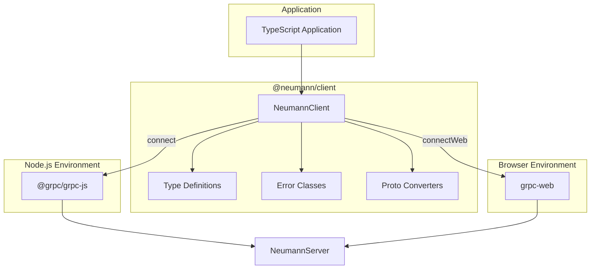

# TypeScript SDK Architecture

The TypeScript SDK (`@neumann/client`) provides a TypeScript/JavaScript client
for the Neumann database with support for both Node.js (gRPC) and browser
(gRPC-Web) environments.

The SDK follows four design principles: environment agnostic (same API for
Node.js and browsers via dynamic imports), type-safe (full TypeScript support
with discriminated unions for results), streaming-first (async iterators for
large result sets), and zero dependencies in core types (proto converters are
separate from type definitions).

## Architecture Overview



## Installation

```bash
# npm
npm install @neumann/client

# yarn
yarn add @neumann/client

# pnpm
pnpm add @neumann/client
```

For Node.js, also install the gRPC package:

```bash
npm install @grpc/grpc-js
```

For browsers, install gRPC-Web:

```bash
npm install grpc-web
```

## Key Types

| Type | Description |
| --- | --- |
| `NeumannClient` | Main client class for database operations |
| `ConnectOptions` | Options for server connection (API key, TLS, metadata) |
| `QueryOptions` | Options for query execution (identity) |
| `ClientMode` | Client mode: `'remote'` or `'embedded'` |
| `QueryResult` | Discriminated union of all result types |
| `Value` | Typed scalar value with type tag |
| `Row` | Relational row with column values |
| `Node` | Graph node with label and properties |
| `Edge` | Graph edge with type, source, target, properties |
| `Path` | Graph path as list of segments |
| `SimilarItem` | Vector similarity search result |
| `ArtifactInfo` | Blob artifact metadata |
| `NeumannError` | Base error class with error code |

## Connection Options

| Field | Type | Default | Description |
| --- | --- | --- | --- |
| `apiKey` | `string?` | `undefined` | API key for authentication |
| `tls` | `boolean?` | `false` | Enable TLS encryption |
| `metadata` | `Record<string, string>?` | `undefined` | Custom metadata headers |

## Query Options

| Field | Type | Default | Description |
| --- | --- | --- | --- |
| `identity` | `string?` | `undefined` | Identity for vault access control |

## Connection Methods

### Node.js Connection

```typescript
import { NeumannClient } from '@neumann/client';

// Basic connection
const client = await NeumannClient.connect('localhost:9200');

// With authentication and TLS
const client = await NeumannClient.connect('db.example.com:9443', {
  apiKey: process.env.NEUMANN_API_KEY,
  tls: true,
  metadata: { 'x-request-id': 'abc123' },
});
```

### Browser Connection (gRPC-Web)

```typescript
import { NeumannClient } from '@neumann/client';

// Connect via gRPC-Web
const client = await NeumannClient.connectWeb('https://api.example.com', {
  apiKey: 'your-api-key',
});
```

## Query Execution

### Single Query

```typescript
const result = await client.execute('SELECT users');

// With identity for vault access
const result = await client.execute('VAULT GET "secret"', {
  identity: 'service:backend',
});
```

### Streaming Query

For large result sets, use streaming to receive results incrementally:

```typescript
for await (const chunk of client.executeStream('SELECT large_table')) {
  if (chunk.type === 'rows') {
    for (const row of chunk.rows) {
      console.log(rowToObject(row));
    }
  }
}
```

### Batch Query

Execute multiple queries in a single request:

```typescript
const results = await client.executeBatch([
  'CREATE TABLE orders (id:int, total:float)',
  'INSERT orders id=1, total=99.99',
  'SELECT orders',
]);

for (const result of results) {
  console.log(result.type);
}
```

## Query Result Types

The `QueryResult` type is a discriminated union. Use the `type` field to
determine which result type you have:

| Type | Fields | Description |
| --- | --- | --- |
| `'empty'` | - | No result (DDL operations) |
| `'value'` | `value: string` | Single value result |
| `'count'` | `count: number` | Row count |
| `'rows'` | `rows: Row[]` | Relational query rows |
| `'nodes'` | `nodes: Node[]` | Graph nodes |
| `'edges'` | `edges: Edge[]` | Graph edges |
| `'paths'` | `paths: Path[]` | Graph paths |
| `'similar'` | `items: SimilarItem[]` | Vector similarity results |
| `'ids'` | `ids: string[]` | List of IDs |
| `'tableList'` | `names: string[]` | Table names |
| `'blob'` | `data: Uint8Array` | Binary blob data |
| `'blobInfo'` | `info: ArtifactInfo` | Blob metadata |
| `'error'` | `code: number, message: string` | Error response |

### Type Guards

Use the provided type guards for type-safe result handling:

```typescript
import {
  isRowsResult,
  isNodesResult,
  isErrorResult,
  rowToObject,
} from '@neumann/client';

const result = await client.execute('SELECT users');

if (isErrorResult(result)) {
  console.error(`Error ${result.code}: ${result.message}`);
} else if (isRowsResult(result)) {
  for (const row of result.rows) {
    console.log(rowToObject(row));
  }
}
```

### Result Pattern Matching

```typescript
const result = await client.execute(query);

switch (result.type) {
  case 'empty':
    console.log('OK');
    break;
  case 'count':
    console.log(`${result.count} rows affected`);
    break;
  case 'rows':
    console.table(result.rows.map(rowToObject));
    break;
  case 'nodes':
    result.nodes.forEach((n) => console.log(`[${n.id}] ${n.label}`));
    break;
  case 'similar':
    result.items.forEach((s) => console.log(`${s.key}: ${s.score.toFixed(4)}`));
    break;
  case 'error':
    throw new Error(result.message);
}
```

## Value Types

Values use a tagged union pattern for type safety:

```typescript
import {
  Value,
  nullValue,
  intValue,
  floatValue,
  stringValue,
  boolValue,
  bytesValue,
  valueToNative,
  valueFromNative,
} from '@neumann/client';

// Create typed values
const v1: Value = nullValue();
const v2: Value = intValue(42);
const v3: Value = floatValue(3.14);
const v4: Value = stringValue('hello');
const v5: Value = boolValue(true);
const v6: Value = bytesValue(new Uint8Array([1, 2, 3]));

// Convert to native JavaScript types
const native = valueToNative(v2); // 42

// Create from native values (auto-detects type)
const auto = valueFromNative(42); // { type: 'int', data: 42 }
```

## Conversion Utilities

### Row Conversion

```typescript
import { rowToObject } from '@neumann/client';

const result = await client.execute('SELECT users');
if (result.type === 'rows') {
  const objects = result.rows.map(rowToObject);
  // [{ name: 'Alice', age: 30 }, { name: 'Bob', age: 25 }]
}
```

### Node Conversion

```typescript
import { nodeToObject } from '@neumann/client';

const result = await client.execute('NODE LIST');
if (result.type === 'nodes') {
  const objects = result.nodes.map(nodeToObject);
  // [{ id: '1', label: 'person', properties: { name: 'Alice' } }]
}
```

### Edge Conversion

```typescript
import { edgeToObject } from '@neumann/client';

const result = await client.execute('EDGE LIST');
if (result.type === 'edges') {
  const objects = result.edges.map(edgeToObject);
  // [{ id: '1', type: 'knows', source: '1', target: '2', properties: {} }]
}
```

## Error Handling

### Error Codes

| Code | Name | Description |
| --- | --- | --- |
| 0 | `UNKNOWN` | Unknown error |
| 1 | `INVALID_ARGUMENT` | Bad request data |
| 2 | `NOT_FOUND` | Resource not found |
| 3 | `PERMISSION_DENIED` | Access denied |
| 4 | `ALREADY_EXISTS` | Resource already exists |
| 5 | `UNAUTHENTICATED` | Authentication failed |
| 6 | `UNAVAILABLE` | Server unavailable |
| 7 | `INTERNAL` | Internal server error |
| 8 | `PARSE_ERROR` | Query parse error |
| 9 | `QUERY_ERROR` | Query execution error |

### Error Classes

```typescript
import {
  NeumannError,
  ConnectionError,
  AuthenticationError,
  PermissionDeniedError,
  NotFoundError,
  InvalidArgumentError,
  ParseError,
  QueryError,
  InternalError,
  errorFromCode,
} from '@neumann/client';

try {
  await client.execute('SELECT nonexistent');
} catch (e) {
  if (e instanceof ConnectionError) {
    console.error('Connection failed:', e.message);
  } else if (e instanceof AuthenticationError) {
    console.error('Auth failed - check API key');
  } else if (e instanceof ParseError) {
    console.error('Query syntax error:', e.message);
  } else if (e instanceof NeumannError) {
    console.error(`[${e.code}] ${e.message}`);
  }
}
```

### Error Factory

Create errors from numeric codes:

```typescript
import { errorFromCode, ErrorCode } from '@neumann/client';

const error = errorFromCode(ErrorCode.NOT_FOUND, 'Table not found');
// Returns NotFoundError instance
```

## Client Lifecycle

```typescript
// Create client
const client = await NeumannClient.connect('localhost:9200');

// Check connection status
console.log(client.isConnected); // true
console.log(client.clientMode); // 'remote'

// Execute queries
const result = await client.execute('SELECT users');

// Close connection when done
client.close();
console.log(client.isConnected); // false
```

## Usage Examples

### Complete CRUD Example

```typescript
import { NeumannClient, isRowsResult, rowToObject } from '@neumann/client';

async function main() {
  const client = await NeumannClient.connect('localhost:9200', {
    apiKey: process.env.NEUMANN_API_KEY,
  });

  try {
    // Create table
    await client.execute('CREATE TABLE products (name:string, price:float)');

    // Insert data
    await client.execute('INSERT products name="Widget", price=9.99');
    await client.execute('INSERT products name="Gadget", price=19.99');

    // Query data
    const result = await client.execute('SELECT products WHERE price > 10');

    if (isRowsResult(result)) {
      const products = result.rows.map(rowToObject);
      console.log('Products over $10:', products);
    }

    // Update data
    await client.execute('UPDATE products SET price=24.99 WHERE name="Gadget"');

    // Delete data
    await client.execute('DELETE products WHERE price < 15');

    // Drop table
    await client.execute('DROP TABLE products');
  } finally {
    client.close();
  }
}
```

### Graph Operations

```typescript
const client = await NeumannClient.connect('localhost:9200');

// Create nodes
await client.execute('NODE CREATE person {name: "Alice", age: 30}');
await client.execute('NODE CREATE person {name: "Bob", age: 25}');

// Create edge
await client.execute('EDGE CREATE 1 -> 2 : knows {since: 2020}');

// Query nodes
const nodes = await client.execute('NODE LIST person');
if (nodes.type === 'nodes') {
  nodes.nodes.forEach((n) => {
    console.log(`[${n.id}] ${n.label}:`, nodeToObject(n).properties);
  });
}

// Find path
const path = await client.execute('PATH 1 -> 2');
if (path.type === 'paths' && path.paths.length > 0) {
  const nodeIds = path.paths[0].segments.map((s) => s.node.id);
  console.log('Path:', nodeIds.join(' -> '));
}
```

### Vector Similarity Search

```typescript
const client = await NeumannClient.connect('localhost:9200');

// Store embeddings
await client.execute('EMBED STORE "doc1" [0.1, 0.2, 0.3, 0.4]');
await client.execute('EMBED STORE "doc2" [0.15, 0.25, 0.35, 0.45]');
await client.execute('EMBED STORE "doc3" [0.9, 0.8, 0.7, 0.6]');

// Find similar
const result = await client.execute('SIMILAR "doc1" COSINE LIMIT 2');
if (result.type === 'similar') {
  result.items.forEach((item) => {
    console.log(`${item.key}: ${item.score.toFixed(4)}`);
  });
}
```

### Browser Usage with React

```typescript
import { useState, useEffect } from 'react';
import { NeumannClient, QueryResult } from '@neumann/client';

function useNeumannQuery(query: string) {
  const [result, setResult] = useState<QueryResult | null>(null);
  const [loading, setLoading] = useState(true);
  const [error, setError] = useState<Error | null>(null);

  useEffect(() => {
    let cancelled = false;

    async function fetchData() {
      try {
        const client = await NeumannClient.connectWeb('/api/neumann');
        const data = await client.execute(query);
        if (!cancelled) {
          setResult(data);
          setLoading(false);
        }
        client.close();
      } catch (e) {
        if (!cancelled) {
          setError(e as Error);
          setLoading(false);
        }
      }
    }

    fetchData();
    return () => {
      cancelled = true;
    };
  }, [query]);

  return { result, loading, error };
}
```

## Proto Conversion

The SDK includes utilities for converting protobuf messages to typed objects:

| Function | Description |
| --- | --- |
| `convertProtoValue` | Convert proto Value to typed Value |
| `convertProtoRow` | Convert proto Row to Row |
| `convertProtoNode` | Convert proto Node to Node |
| `convertProtoEdge` | Convert proto Edge to Edge |
| `convertProtoPath` | Convert proto Path to Path |
| `convertProtoSimilarItem` | Convert proto SimilarItem to SimilarItem |
| `convertProtoArtifactInfo` | Convert proto ArtifactInfo to ArtifactInfo |

These are used internally but exported for custom integrations.

## Dependencies

| Package | Purpose | Environment |
| --- | --- | --- |
| `@grpc/grpc-js` | gRPC client | Node.js |
| `grpc-web` | gRPC-Web client | Browser |

The SDK uses dynamic imports to load the appropriate gRPC library based on the
connection method used.

## Related Modules

| Module | Relationship |
| --- | --- |
| `neumann_server` | Server that this SDK connects to |
| `neumann_client` | Rust SDK with same capabilities |
| `neumann-py` | Python SDK with same API design |
