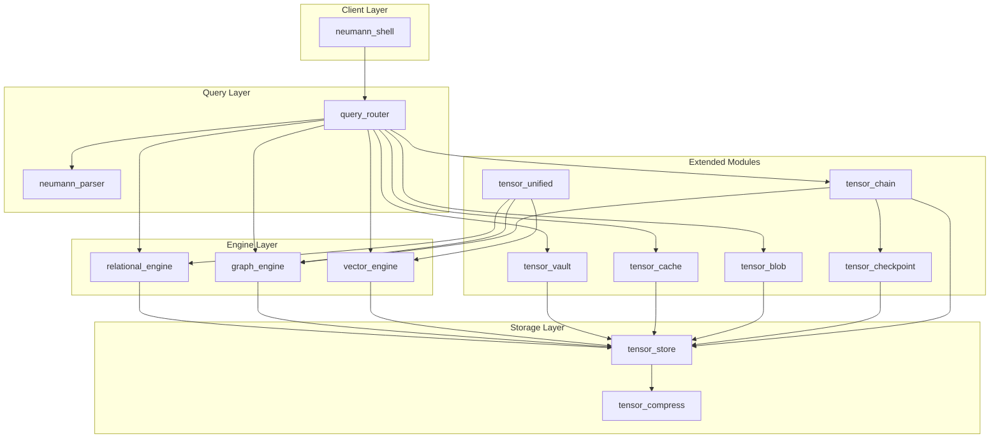
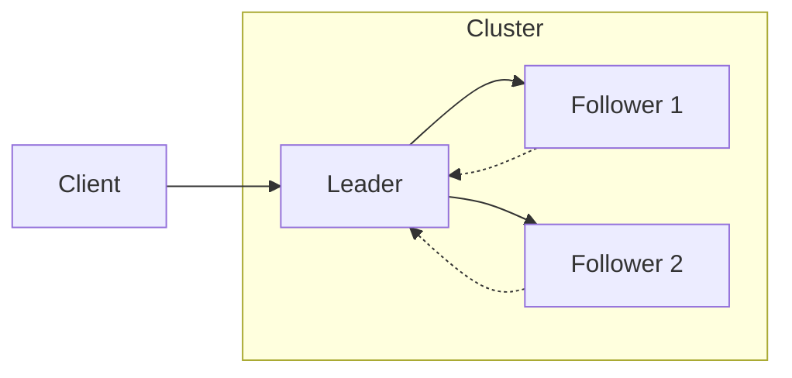

# Architecture Overview

Neumann is a unified tensor-based runtime that stores relational data, graph relationships, and vector embeddings in a single mathematical structure.

## System Architecture

## Module Dependencies

| Module | Purpose | Depends On |
|--------|---------|------------|
| tensor_store | Key-value storage layer | tensor_compress |
| relational_engine | SQL-like tables with indexes | tensor_store |
| graph_engine | Graph nodes and edges | tensor_store |
| vector_engine | Embeddings and similarity search | tensor_store |
| tensor_compress | Compression algorithms | - |
| tensor_vault | Encrypted secret storage | tensor_store, graph_engine |
| tensor_cache | Semantic LLM response caching | tensor_store |
| tensor_blob | S3-style chunked blob storage | tensor_store |
| tensor_checkpoint | Atomic snapshot/restore | tensor_store |
| tensor_unified | Multi-engine unified storage | all engines |
| tensor_chain | Tensor-native blockchain | tensor_store, graph_engine, tensor_checkpoint |
| neumann_parser | Query tokenization and parsing | - |
| query_router | Unified query execution | all engines, parser |
| neumann_shell | Interactive CLI interface | query_router |

## Key Design Principles

### Unified Data Model

All data is represented as tensors:
- **Scalars**: Single values (int, float, string, bool)
- **Vectors**: Dense or sparse embeddings
- **Pointers**: References to other entities

### Thread Safety

All engines use DashMap for concurrent access:
- Sharded locks for write throughput
- No lock poisoning
- Read operations are lock-free

### Composability

Engines can be composed:
- Use relational_engine alone for SQL workloads
- Combine with graph_engine for relationship queries
- Add vector_engine for similarity search

## Data Flow

1. **Query Parsing**: neumann_parser tokenizes and parses input
2. **Query Routing**: query_router dispatches to appropriate engine
3. **Execution**: Engine performs operation using tensor_store
4. **Storage**: tensor_store persists data with optional compression

## Distributed Architecture (tensor_chain)

For distributed deployments:

- **Raft Consensus**: Leader election and log replication
- **2PC Transactions**: Cross-shard atomic operations
- **SWIM Gossip**: Membership and failure detection
