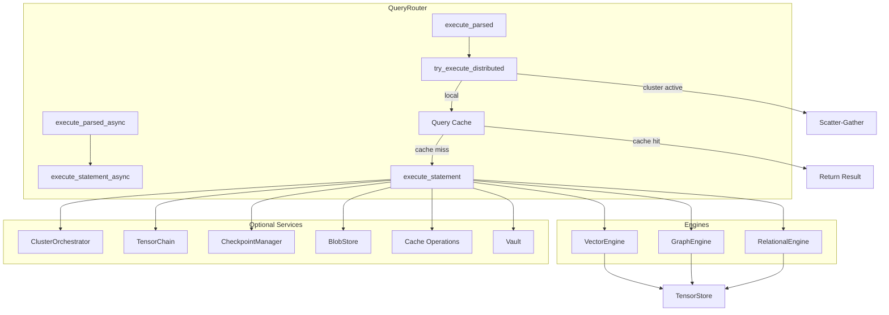
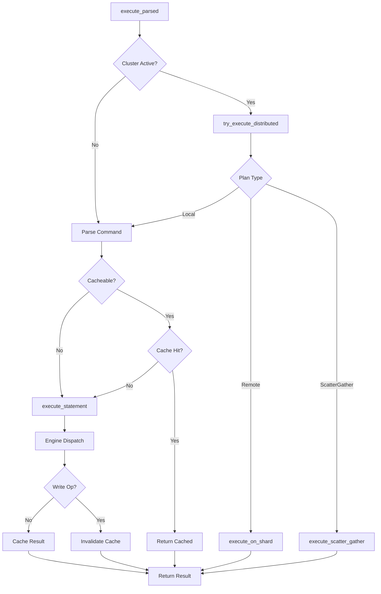
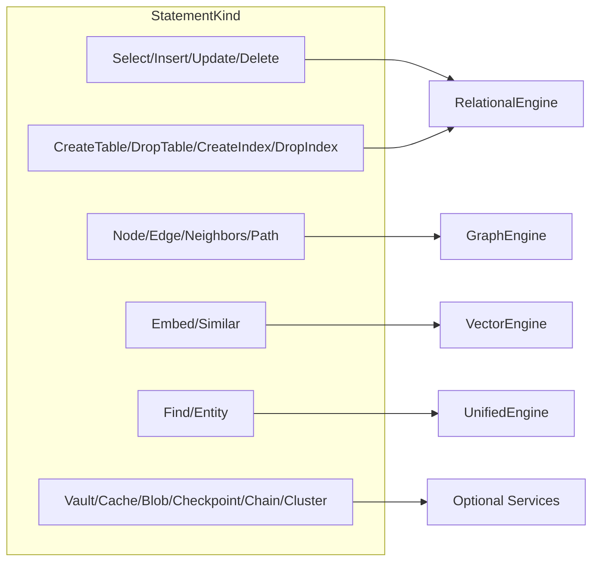
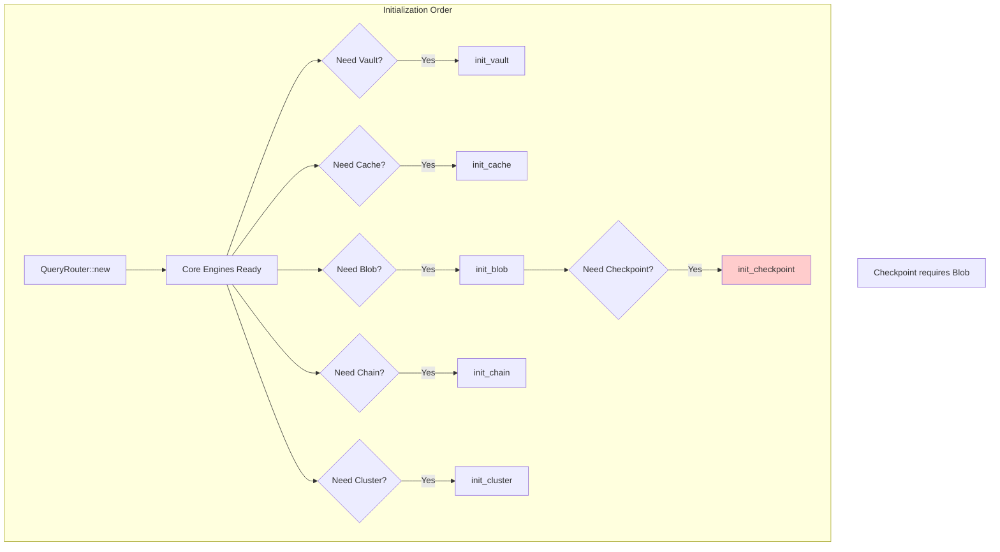
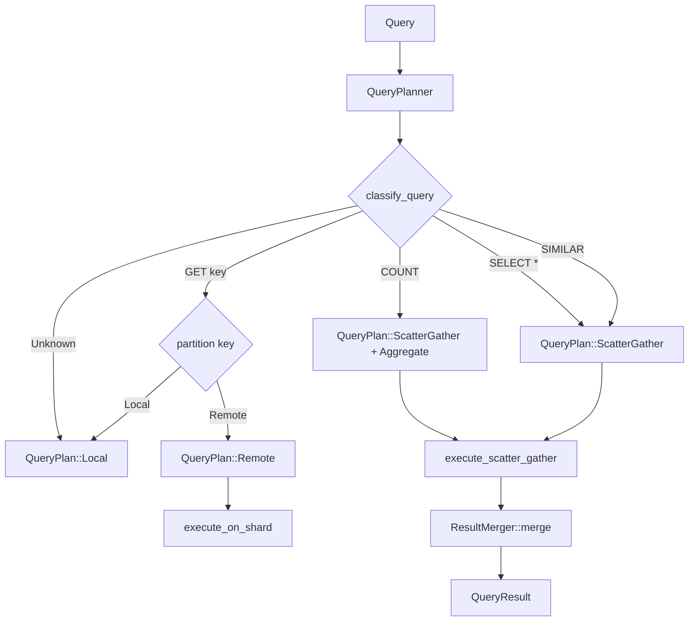

# Query Router

Query Router is the unified query execution layer for Neumann. It parses shell
commands, routes them to appropriate engines, and combines results. All query
types (relational, graph, vector, unified) flow through the router, which
provides a single entry point for the entire system.

The router supports both synchronous and asynchronous execution, optional result
caching, and distributed query execution when cluster mode is enabled.

## Key Types

| Type | Description |
| --- | --- |
| `QueryRouter` | Main router orchestrating queries across all engines |
| `QueryResult` | Unified result enum for all query types |
| `RouterError` | Error types for query routing failures |
| `NodeResult` | Graph node result with id, label, properties |
| `EdgeResult` | Graph edge result with id, from, to, label |
| `SimilarResult` | Vector similarity result with key and score |
| `UnifiedResult` | Cross-engine query result with description and items |
| `ChainResult` | Blockchain operation results |
| `QueryPlanner` | Plans distributed query execution across shards |
| `ResultMerger` | Merges results from multiple shards |
| `ShardResult` | Result from a single shard with timing and error info |
| `DistributedQueryConfig` | Configuration for distributed execution |
| `DistributedQueryStats` | Statistics tracking for distributed queries |
| `FilterCondition` | Re-exported from vector_engine for programmatic filter building |
| `FilterValue` | Re-exported from vector_engine for filter values |
| `FilterStrategy` | Re-exported from vector_engine for search strategy |
| `FilteredSearchConfig` | Re-exported from vector_engine for filtered search config |

### QueryResult Variants

| Variant | Description | Typical Source |
| --- | --- | --- |
| `Empty` | No result (CREATE, INSERT) | DDL, writes |
| `Value(String)` | Single value result | Scalar queries, DESCRIBE |
| `Count(usize)` | Count of affected rows/nodes/edges | UPDATE, DELETE |
| `Ids(Vec<u64>)` | List of IDs | INSERT |
| `Rows(Vec<Row>)` | Relational query results | SELECT |
| `Nodes(Vec<NodeResult>)` | Graph node results | NODE queries |
| `Edges(Vec<EdgeResult>)` | Graph edge results | EDGE queries |
| `Path(Vec<u64>)` | Graph traversal path | PATH queries |
| `Similar(Vec<SimilarResult>)` | Vector similarity results | SIMILAR queries |
| `Unified(UnifiedResult)` | Cross-engine query results | FIND queries |
| `TableList(Vec<String>)` | List of table names | SHOW TABLES |
| `Blob(Vec<u8>)` | Blob data bytes | BLOB GET |
| `ArtifactInfo(ArtifactInfoResult)` | Blob artifact metadata | BLOB INFO |
| `ArtifactList(Vec<String>)` | List of artifact IDs | BLOBS LIST |
| `BlobStats(BlobStatsResult)` | Blob storage statistics | BLOB STATS |
| `CheckpointList(Vec<CheckpointInfo>)` | List of checkpoints | CHECKPOINTS |
| `Chain(ChainResult)` | Chain operation result | CHAIN queries |

### RouterError Types

| Error | Cause | Recovery |
| --- | --- | --- |
| `ParseError` | Invalid query syntax | Fix query syntax |
| `UnknownCommand` | Unknown command or keyword | Check command spelling |
| `RelationalError` | Error from relational engine | Check table/column names |
| `GraphError` | Error from graph engine | Verify node/edge IDs |
| `VectorError` | Error from vector engine | Check embedding dimensions |
| `VaultError` | Error from vault | Verify permissions |
| `CacheError` | Error from cache | Check cache configuration |
| `BlobError` | Error from blob storage | Verify artifact exists |
| `CheckpointError` | Error from checkpoint system | Check blob store initialized |
| `ChainError` | Error from chain system | Verify chain initialized |
| `InvalidArgument` | Invalid argument value | Check argument types |
| `MissingArgument` | Missing required argument | Provide required args |
| `TypeMismatch` | Type mismatch in query | Check value types |
| `AuthenticationRequired` | Vault operations require identity | Call `SET IDENTITY` first |

### Error Propagation

The router implements `From` traits to convert engine-specific errors:

```rust
// Errors from underlying engines are automatically converted
impl From<RelationalError> for RouterError {
    fn from(e: RelationalError) -> Self {
        RouterError::RelationalError(e.to_string())
    }
}

impl From<GraphError> for RouterError { ... }
impl From<VectorError> for RouterError { ... }
impl From<VaultError> for RouterError { ... }
impl From<CacheError> for RouterError { ... }
impl From<BlobError> for RouterError { ... }
impl From<CheckpointError> for RouterError { ... }
impl From<ChainError> for RouterError { ... }
impl From<UnifiedError> for RouterError { ... }
```

This allows using the `?` operator throughout execution methods:

```rust
fn exec_select(&self, select: &SelectStmt) -> Result<QueryResult> {
    // RelationalError automatically converts to RouterError
    let rows = self.relational.select_columnar(table_name, condition, options)?;
    Ok(QueryResult::Rows(rows))
}
```

## Architecture



### Internal Router Structure

```rust
pub struct QueryRouter {
    // Core engines (always initialized)
    relational: Arc<RelationalEngine>,
    graph: Arc<GraphEngine>,
    vector: Arc<VectorEngine>,

    // Unified engine for cross-engine queries (lazily initialized)
    unified: Option<UnifiedEngine>,

    // Optional services (require explicit initialization)
    vault: Option<Arc<Vault>>,
    cache: Option<Arc<Cache>>,
    blob: Option<Arc<tokio::sync::Mutex<BlobStore>>>,
    blob_runtime: Option<Arc<Runtime>>,
    checkpoint: Option<Arc<tokio::sync::Mutex<CheckpointManager>>>,
    chain: Option<Arc<TensorChain>>,

    // Cluster mode
    cluster: Option<Arc<ClusterOrchestrator>>,
    cluster_runtime: Option<Arc<Runtime>>,
    distributed_planner: Option<Arc<QueryPlanner>>,
    distributed_config: DistributedQueryConfig,
    local_shard_id: ShardId,

    // Authentication state
    current_identity: Option<String>,

    // Vector index for fast similarity search
    hnsw_index: Option<(HNSWIndex, Vec<String>)>,
}
```

## Initialization

```rust
use query_router::QueryRouter;
use tensor_store::TensorStore;

// Create with independent engines
let router = QueryRouter::new();

// Create with existing engines
let router = QueryRouter::with_engines(relational, graph, vector);

// Create with shared storage (enables unified entities)
let store = TensorStore::new();
let router = QueryRouter::with_shared_store(store);
```

### Constructor Comparison

| Constructor | UnifiedEngine | Use Case |
| --- | --- | --- |
| `new()` | No | Simple single-engine queries |
| `with_engines(...)` | No | Custom engine configuration |
| `with_shared_store(...)` | Yes | Cross-engine unified queries |

### Shared Store Benefits

When using `with_shared_store()`, all engines share the same underlying
`TensorStore`:

```rust
pub fn with_shared_store(store: TensorStore) -> Self {
    let relational = Arc::new(RelationalEngine::with_store(store.clone()));
    let graph = Arc::new(GraphEngine::with_store(store.clone()));
    let vector = Arc::new(VectorEngine::with_store(store.clone()));
    let unified = UnifiedEngine::with_engines(
        store,
        Arc::clone(&relational),
        Arc::clone(&graph),
        Arc::clone(&vector),
    );
    // ...
}
```

This enables:

- Cross-engine queries via `UnifiedEngine`
- Entity-level operations spanning all modalities
- Consistent view of data across engines

## Query Execution

### Execution Methods

| Method | Parser | Async | Distributed | Cache |
| --- | --- | --- | --- | --- |
| `execute(command)` | Regex (legacy) | No | No | No |
| `execute_parsed(command)` | AST | No | Yes | Yes |
| `execute_parsed_async(command)` | AST | Yes | No | Yes |
| `execute_statement(stmt)` | Pre-parsed | No | No | No |
| `execute_statement_async(stmt)` | Pre-parsed | Yes | No | No |

### Execution Flow



### Detailed Execution Steps

1. **Distributed Check**: If cluster is active, `try_execute_distributed` plans
   query execution
2. **Parse**: Convert command string to AST via `neumann_parser`
3. **Cache Check**: For cacheable queries (`SELECT`, `SIMILAR`, `NEIGHBORS`,
   `PATH`), check cache first
4. **Execute**: Dispatch to appropriate engine based on `StatementKind`
5. **Cache Update**: Store result for cacheable queries (as JSON via serde)
6. **Invalidate**: Clear entire cache on write operations (INSERT, UPDATE,
   DELETE, DDL)

```rust
// Synchronous execution
let result = router.execute_parsed("SELECT * FROM users")?;

// Async execution
let result = router.execute_parsed_async("SELECT * FROM users").await?;

// Concurrent queries
let (users, posts, similar) = tokio::join!(
    router.execute_parsed_async("SELECT * FROM users"),
    router.execute_parsed_async("SELECT * FROM posts"),
    router.execute_parsed_async("SIMILAR 'doc:1' LIMIT 10"),
);
```

### Cache Key Generation

```rust
fn cache_key_for_query(command: &str) -> String {
    format!("query:{}", command.trim().to_lowercase())
}
```

This normalizes queries for cache lookup by trimming whitespace and lowercasing.

## Statement Routing

The router dispatches statements based on their `StatementKind`:



### Complete Statement Routing Table

| Statement Type | Engine | Handler Method | Operations |
| --- | --- | --- | --- |
| `Select` | Relational | `exec_select` | Table queries with WHERE, JOIN, GROUP BY, ORDER BY |
| `Insert` | Relational | `exec_insert` | Single/multi-row insert, INSERT...SELECT |
| `Update` | Relational | `exec_update` | Row updates with conditions |
| `Delete` | Relational | `exec_delete` | Row deletion with protection |
| `CreateTable` | Relational | `exec_create_table` | Table DDL |
| `DropTable` | Relational | inline | Table removal with protection |
| `CreateIndex` | Relational | inline | Index creation |
| `DropIndex` | Relational | inline | Index removal with protection |
| `ShowTables` | Relational | inline | List tables |
| `Describe` | Multiple | `exec_describe` | Schema/node/edge info |
| `Node` | Graph | `exec_node` | CREATE/GET/DELETE/LIST/UPDATE |
| `Edge` | Graph | `exec_edge` | CREATE/GET/DELETE/LIST/UPDATE |
| `Neighbors` | Graph | `exec_neighbors` | Neighbor traversal |
| `Path` | Graph | `exec_path` | Path finding |
| `Embed` | Vector | `exec_embed` | Embedding storage, batch, delete |
| `Similar` | Vector | `exec_similar` | k-NN search |
| `ShowEmbeddings` | Vector | inline | List embedding keys |
| `CountEmbeddings` | Vector | inline | Count embeddings |
| `Find` | Unified | `exec_find` | Cross-engine queries |
| `Entity` | Unified | `exec_entity` | Entity CRUD |
| `Vault` | Vault | `exec_vault` | Secret management |
| `Cache` | Cache | `exec_cache` | LLM response cache |
| `Blob` | BlobStore | `exec_blob` | Artifact operations |
| `Blobs` | BlobStore | `exec_blobs` | Artifact listing |
| `Checkpoint` | Checkpoint | `exec_checkpoint` | Create snapshot |
| `Rollback` | Checkpoint | `exec_rollback` | Restore snapshot |
| `Checkpoints` | Checkpoint | `exec_checkpoints` | List snapshots |
| `Chain` | TensorChain | `exec_chain` | Blockchain operations |
| `Cluster` | Orchestrator | `exec_cluster` | Cluster management |
| `Empty` | --- | inline | No-op |

### Statement Handler Pattern

Each handler follows a consistent pattern:

```rust
fn exec_<statement>(&self, stmt: &<Statement>Stmt) -> Result<QueryResult> {
    // 1. Validate/extract parameters
    let param = self.eval_string_expr(&stmt.field)?;

    // 2. Check service availability (for optional services)
    let service = self.service.as_ref()
        .ok_or_else(|| RouterError::ServiceError("Service not initialized".to_string()))?;

    // 3. For destructive ops, check protection
    if is_destructive {
        match self.protect_destructive_op(...)? {
            ProtectedOpResult::Cancelled => return Err(...),
            ProtectedOpResult::Proceed => {},
        }
    }

    // 4. Execute operation
    let result = service.operation(...)?;

    // 5. Convert to QueryResult
    Ok(QueryResult::Variant(result))
}
```

## Supported Queries

### Relational Operations

```sql
-- DDL
CREATE TABLE users (id INT, name VARCHAR(100), email VARCHAR(255))
DROP TABLE users

-- DML
INSERT INTO users (id, name, email) VALUES (1, 'Alice', 'alice@example.com')
INSERT INTO users SELECT * FROM temp_users
UPDATE users SET name = 'Bob' WHERE id = 1
DELETE FROM users WHERE id = 1

-- Queries
SELECT * FROM users WHERE id = 1
SELECT id, name FROM users ORDER BY name ASC LIMIT 10 OFFSET 5
SELECT COUNT(*), AVG(age) FROM users WHERE active = true GROUP BY dept HAVING COUNT(*) > 5

-- JOINs
SELECT * FROM users u INNER JOIN orders o ON u.id = o.user_id
SELECT * FROM users u LEFT JOIN profiles p ON u.id = p.user_id
SELECT * FROM a CROSS JOIN b
SELECT * FROM a NATURAL JOIN b
```

### Aggregate Functions

| Function | Description | Null Handling |
| --- | --- | --- |
| `COUNT(*)` | Count all rows | Counts nulls |
| `COUNT(col)` | Count non-null values | Excludes nulls |
| `SUM(col)` | Sum numeric values | Skips nulls |
| `AVG(col)` | Average numeric values | Skips nulls, returns NULL if no values |
| `MIN(col)` | Minimum value | Skips nulls |
| `MAX(col)` | Maximum value | Skips nulls |

### Graph Operations

```sql
-- Node operations
NODE CREATE person {name: 'Alice', age: 30}
NODE GET 123
NODE DELETE 123
NODE LIST person LIMIT 100
NODE UPDATE 123 {name: 'Alice Smith'}

-- Edge operations
EDGE CREATE person:1 friend person:2 {since: 2020}
EDGE GET 456
EDGE DELETE 456
EDGE LIST friend LIMIT 50

-- Traversals
NEIGHBORS person:1 friend OUTGOING
NEIGHBORS 123 * BOTH
PATH person:1 TO person:5 VIA friend
```

### Vector Operations

```sql
-- Single embedding
EMBED doc1 [0.1, 0.2, 0.3, 0.4]
EMBED DELETE doc1

-- Batch embedding
EMBED BATCH [('key1', [0.1, 0.2]), ('key2', [0.3, 0.4])]

-- Similarity search
SIMILAR 'doc1' LIMIT 5
SIMILAR 'doc1' LIMIT 5 EUCLIDEAN
SIMILAR [0.1, 0.2, 0.3] LIMIT 10 COSINE

-- Listing
SHOW EMBEDDINGS LIMIT 100
COUNT EMBEDDINGS
```

### Distance Metrics

| Metric | Description | Use Case | Formula |
| --- | --- | --- | --- |
| `COSINE` | Cosine similarity (default) | Semantic similarity | `1 - (a.b) / (‖a‖ * ‖b‖)` |
| `EUCLIDEAN` | Euclidean distance (L2) | Spatial distance | sqrt(sum((a[i] - b[i])^2)) |
| `DOT_PRODUCT` | Dot product | Magnitude-aware similarity | sum(a[i] * b[i]) |

### Unified Entity Operations

```sql
-- Create entity with all modalities
ENTITY CREATE 'user:1' {name: 'Alice'} EMBEDDING [0.1, 0.2, 0.3]

-- Connect entities
ENTITY CONNECT 'user:1' -> 'doc:1' : authored

-- Combined similarity + graph search
SIMILAR 'query:key' CONNECTED TO 'hub:entity' LIMIT 10
```

## Cross-Engine Queries

Cross-engine queries combine graph relationships with vector similarity:

```rust
let store = TensorStore::new();
let mut router = QueryRouter::with_shared_store(store);

// Set up entities with embeddings
router.vector().set_entity_embedding("user:1", vec![0.1, 0.2, 0.3])?;
router.vector().set_entity_embedding("user:2", vec![0.15, 0.25, 0.35])?;

// Connect via graph edges
router.connect_entities("user:1", "user:2", "follows")?;

// Build HNSW index for O(log n) similarity search
router.build_vector_index()?;

// Find neighbors sorted by similarity
let results = router.find_neighbors_by_similarity("user:1", &query_vec, 10)?;

// Find similar AND connected entities
let results = router.find_similar_connected("user:1", "user:2", 5)?;
```

### Cross-Engine Methods

| Method | Description | Complexity |
| --- | --- | --- |
| `build_vector_index()` | Build HNSW index for O(log n) search | O(n log n) |
| `connect_entities(from, to, type)` | Add graph edge between entities | O(1) |
| `find_neighbors_by_similarity(key, query, k)` | Neighbors sorted by vector similarity | O(k * log n) with HNSW |
| `find_similar_connected(query, connected_to, k)` | Similar AND connected entities | O(k * log n) + O(neighbors) |
| `create_unified_entity(key, fields, embedding)` | Create entity with all modalities | O(1) |

### Implementation Details

The `find_similar_connected` method combines vector and graph operations:

```rust
pub fn find_similar_connected(
    &self,
    query_key: &str,
    connected_to: &str,
    top_k: usize,
) -> Result<Vec<UnifiedItem>> {
    let query_embedding = self.vector.get_entity_embedding(query_key)?;

    // Use HNSW index if available, otherwise brute-force
    let similar = if let Some((ref index, ref keys)) = self.hnsw_index {
        self.vector.search_with_hnsw(index, keys, &query_embedding, top_k * 2)?
    } else {
        self.vector.search_entities(&query_embedding, top_k * 2)?
    };

    // Get graph neighbors of connected_to entity
    let connected_neighbors: HashSet<String> = self.graph
        .get_entity_neighbors(connected_to)
        .unwrap_or_default()
        .into_iter()
        .collect();

    // Filter to entities that are both similar AND connected
    let items: Vec<UnifiedItem> = similar
        .into_iter()
        .filter(|s| connected_neighbors.contains(&s.key))
        .take(top_k)
        .map(|s| UnifiedItem::new("vector+graph", &s.key).with_score(s.score))
        .collect();

    Ok(items)
}
```

## Optional Services

Services are lazily initialized and can be enabled as needed:



### Vault

```rust
// Initialize with master key
router.init_vault(master_key)?;

// Or auto-initialize from NEUMANN_VAULT_KEY env var
router.ensure_vault()?;

// Set identity for access control
router.set_identity("user:alice");
```

Vault requires authentication for all operations:

```rust
fn exec_vault(&self, stmt: &VaultStmt) -> Result<QueryResult> {
    let vault = self.vault.as_ref()
        .ok_or_else(|| RouterError::VaultError("Vault not initialized".to_string()))?;

    // SECURITY: Require explicit authentication
    let identity = self.require_identity()?;

    match &stmt.operation {
        VaultOp::Get { key } => {
            let value = vault.get(identity, &key)?;
            Ok(QueryResult::Value(value))
        },
        // ...
    }
}
```

### Cache

```rust
// Default configuration
router.init_cache();

// Custom configuration
router.init_cache_with_config(CacheConfig::default())?;

// Auto-initialize
router.ensure_cache();
```

Cache operations are available through queries:

```sql
CACHE INIT
CACHE STATS
CACHE CLEAR
CACHE EVICT 100
CACHE GET 'key'
CACHE PUT 'key' 'value'
CACHE SEMANTIC GET 'query' THRESHOLD 0.9
CACHE SEMANTIC PUT 'query' 'response' [0.1, 0.2, 0.3]
```

### Blob Storage

```rust
// Initialize blob store
router.init_blob()?;
router.start_blob()?;  // Start GC

// Graceful shutdown
router.shutdown_blob()?;
```

Blob operations use async execution internally:

```rust
fn exec_blob(&self, stmt: &BlobStmt) -> Result<QueryResult> {
    let blob = self.blob.as_ref()
        .ok_or_else(|| RouterError::BlobError("Blob store not initialized".to_string()))?;
    let runtime = self.blob_runtime.as_ref()
        .ok_or_else(|| RouterError::BlobError("Blob runtime not initialized".to_string()))?;

    match &stmt.operation {
        BlobOp::Put { filename, data, ... } => {
            let artifact_id = runtime.block_on(async {
                let blob_guard = blob.lock().await;
                blob_guard.put(&filename, &data, options).await
            })?;
            Ok(QueryResult::Value(artifact_id))
        },
        // ...
    }
}
```

### Checkpoint

```rust
// Requires blob storage
router.init_blob()?;
router.init_checkpoint()?;

// Set confirmation handler for destructive ops
router.set_confirmation_handler(handler)?;
```

Checkpoint provides automatic protection for destructive operations:

```rust
fn protect_destructive_op(
    &self,
    command: &str,
    op: DestructiveOp,
    sample_data: Vec<String>,
) -> Result<ProtectedOpResult> {
    let Some(checkpoint) = self.checkpoint.as_ref() else {
        return Ok(ProtectedOpResult::Proceed);
    };

    runtime.block_on(async {
        let cp = checkpoint.lock().await;

        if !cp.auto_checkpoint_enabled() {
            return Ok(ProtectedOpResult::Proceed);
        }

        let preview = cp.generate_preview(&op, sample_data);

        if !cp.request_confirmation(&op, &preview) {
            return Ok(ProtectedOpResult::Cancelled);
        }

        // Create auto-checkpoint before operation
        cp.create_auto(command, op, preview, store).await?;

        Ok(ProtectedOpResult::Proceed)
    })
}
```

Protected operations include:

- `DELETE` (relational rows)
- `DROP TABLE`
- `DROP INDEX`
- `NODE DELETE`
- `EMBED DELETE`
- `VAULT DELETE`
- `BLOB DELETE`
- `CACHE CLEAR`

### Chain

```rust
// Initialize tensor chain
router.init_chain("node_1")?;

// Auto-initialize with default node ID
router.ensure_chain()?;
```

Chain operations available through queries:

```sql
CHAIN BEGIN
CHAIN COMMIT
CHAIN ROLLBACK 100
CHAIN HISTORY 'key'
CHAIN HEIGHT
CHAIN TIP
CHAIN BLOCK 42
CHAIN VERIFY
CHAIN SHOW CODEBOOK GLOBAL
CHAIN SHOW CODEBOOK LOCAL 'domain'
CHAIN ANALYZE TRANSITIONS
```

### Cluster

```rust
// Initialize cluster mode
router.init_cluster("node_1", bind_addr, &peers)?;

// Check cluster status
if router.is_cluster_active() {
    // Distributed queries enabled
}

// Graceful shutdown
router.shutdown_cluster()?;
```

Cluster initialization creates:

1. `ClusterOrchestrator` for Raft consensus
2. `ConsistentHashPartitioner` for key-based routing
3. `QueryPlanner` for distributed execution

## Distributed Query Execution

When cluster mode is active, queries are automatically distributed:



### Query Classification

The `QueryPlanner` classifies queries based on text pattern matching:

```rust
fn classify_query(&self, query: &str) -> QueryType {
    let query_upper = query.to_uppercase();

    // Point lookups
    if query_upper.starts_with("GET ")
       || query_upper.starts_with("NODE GET ")
       || query_upper.starts_with("ENTITY GET ") {
        if let Some(key) = self.extract_key(query) {
            return QueryType::PointLookup { key };
        }
    }

    // Similarity search
    if query_upper.starts_with("SIMILAR ") {
        let k = self.extract_top_k(query).unwrap_or(10);
        return QueryType::SimilaritySearch { k };
    }

    // Table scans with aggregates
    if query_upper.starts_with("SELECT ") {
        if query_upper.contains("COUNT(") {
            return QueryType::Aggregate { func: AggregateFunction::Count };
        }
        if query_upper.contains("SUM(") {
            return QueryType::Aggregate { func: AggregateFunction::Sum };
        }
        return QueryType::TableScan;
    }

    QueryType::Unknown
}
```

### Query Plans

| Plan | When Used | Example | Shards Contacted |
| --- | --- | --- | --- |
| `Local` | Point lookups on local shard | `GET user:1` (local key) | 1 |
| `Remote` | Point lookups on remote shard | `GET user:2` (remote key) | 1 |
| `ScatterGather` | Full scans, aggregates, similarity | `SELECT *`, `SIMILAR`, `COUNT` | All |

### Merge Strategies

| Strategy | Description | Use Case | Algorithm |
| --- | --- | --- | --- |
| `Union` | Combine all results | SELECT, NODE queries | Concatenate rows/nodes/edges |
| `TopK(k)` | Keep top K by score | SIMILAR queries | Sort by score desc, truncate |
| `Aggregate(func)` | SUM, COUNT, AVG, MAX, MIN | Aggregate queries | Combine partial aggregates |
| `FirstNonEmpty` | First result found | Point lookups | Short-circuit on first result |
| `Concat` | Concatenate in order | Ordered results | Same as Union |

### Result Merger Implementation

```rust
impl ResultMerger {
    pub fn merge(results: Vec<ShardResult>, strategy: &MergeStrategy) -> Result<QueryResult> {
        // Filter out errors if not fail-fast
        let successful: Vec<_> = results.into_iter()
            .filter(|r| r.error.is_none())
            .collect();

        if successful.is_empty() {
            return Ok(QueryResult::Empty);
        }

        match strategy {
            MergeStrategy::Union => Self::merge_union(successful),
            MergeStrategy::TopK(k) => Self::merge_top_k(successful, *k),
            MergeStrategy::Aggregate(func) => Self::merge_aggregate(successful, *func),
            MergeStrategy::FirstNonEmpty => Self::merge_first_non_empty(successful),
            MergeStrategy::Concat => Self::merge_concat(successful),
        }
    }

    fn merge_top_k(results: Vec<ShardResult>, k: usize) -> Result<QueryResult> {
        let mut all_similar: Vec<SimilarResult> = Vec::new();

        for shard_result in results {
            if let QueryResult::Similar(similar) = shard_result.result {
                all_similar.extend(similar);
            }
        }

        // Sort by score descending
        all_similar.sort_by(|a, b|
            b.score.partial_cmp(&a.score).unwrap_or(std::cmp::Ordering::Equal)
        );

        // Take top K
        all_similar.truncate(k);

        Ok(QueryResult::Similar(all_similar))
    }
}
```

### Distributed Query Configuration

```rust
pub struct DistributedQueryConfig {
    /// Maximum concurrent shard queries (default: 10)
    pub max_concurrent: usize,
    /// Query timeout per shard in milliseconds (default: 5000)
    pub shard_timeout_ms: u64,
    /// Retry count for failed shards (default: 2)
    pub retry_count: usize,
    /// Whether to fail fast on first shard error (default: false)
    pub fail_fast: bool,
}
```

### Semantic Routing

For embedding-aware routing, use `plan_with_embedding`:

```rust
pub fn plan_with_embedding(&self, query: &str, embedding: &[f32]) -> QueryPlan {
    // Get semantically relevant shards
    let relevant_shards = self.shards_for_embedding(embedding);

    if relevant_shards.is_empty() {
        return self.plan(query);  // Fallback to all shards
    }

    // Route similarity search to relevant shards only
    match self.classify_query(query) {
        QueryType::SimilaritySearch { k } => QueryPlan::ScatterGather {
            shards: relevant_shards,
            query: query.to_string(),
            merge: MergeStrategy::TopK(k),
        },
        _ => self.plan(query),
    }
}
```

## Performance Characteristics

| Operation | Complexity | Notes |
| --- | --- | --- |
| Parse | O(n) | n = query length |
| SELECT | O(m) | m = rows in table |
| SELECT with index | O(log m + k) | k = matching rows |
| INSERT | O(1) | Single row insert |
| NODE | O(1) | Single node create |
| EDGE | O(1) | Single edge create |
| PATH | O(V+E) | BFS traversal |
| SIMILAR (brute-force) | O(n*d) | n = embeddings, d = dimensions |
| SIMILAR (HNSW) | O(log n * d) | After `build_vector_index()` |
| `find_similar_connected` | O(log n) or O(n) | Uses HNSW if index built |
| Distributed query | O(query) / shards | Parallelized across shards |
| Result merge (Union) | O(total results) | Linear in combined size |
| Result merge (TopK) | O(n log k) | Sort + truncate |

### HNSW Index Performance

| Entities | Brute-force | With HNSW | Speedup |
| --- | --- | --- | --- |
| 200 | 4.17s | 9.3us | 448,000x |

### Distributed Query Overhead

| Operation | Overhead |
| --- | --- |
| Query planning | ~1-5 us |
| Network round-trip | ~1-10 ms (depends on network) |
| Result serialization | ~10-100 us (depends on result size) |
| Result merging | ~1-10 us (TopK), O(n) for Union |

## Query Caching

Cacheable statements are automatically cached when a cache is configured:

- **Cacheable**: `SELECT`, `SIMILAR`, `NEIGHBORS`, `PATH`
- **Write operations**: `INSERT`, `UPDATE`, `DELETE`, DDL invalidate cache

```rust
fn is_cacheable_statement(stmt: &Statement) -> bool {
    matches!(&stmt.kind,
        StatementKind::Select(_)
        | StatementKind::Similar(_)
        | StatementKind::Neighbors(_)
        | StatementKind::Path(_)
    )
}

fn is_write_statement(stmt: &Statement) -> bool {
    matches!(&stmt.kind,
        StatementKind::Insert(_)
        | StatementKind::Update(_)
        | StatementKind::Delete(_)
        | StatementKind::CreateTable(_)
        | StatementKind::DropTable(_)
        | StatementKind::CreateIndex(_)
        | StatementKind::DropIndex(_)
    )
}
```

### Cache Usage Example

```rust
// Enable caching
router.init_cache();

// First call executes and caches (JSON serialization)
let result1 = router.execute_parsed("SELECT * FROM users")?;

// Second call returns cached result (JSON deserialization)
let result2 = router.execute_parsed("SELECT * FROM users")?;

// Write operations invalidate entire cache
router.execute_parsed("INSERT INTO users VALUES (2, 'Bob')")?;
// Cache is now empty
```

### Cache Gotchas

1. **Full cache invalidation**: Any write operation clears the entire cache. No
   table-level tracking.
2. **Case sensitivity**: Cache keys are lowercased, so `SELECT` and `select` hit
   the same entry.
3. **Whitespace normalization**: Queries are trimmed but not fully normalized.
4. **No TTL**: Cached entries persist until invalidated by writes or explicit
   `CACHE CLEAR`.

## Best Practices

### Service Initialization Order

```rust
// Initialize in dependency order
let mut router = QueryRouter::with_shared_store(store);

// Optional services (no dependencies)
router.init_vault(key)?;
router.init_cache();

// Blob first (required for checkpoint)
router.init_blob()?;
router.start_blob()?;

// Checkpoint depends on blob
router.init_checkpoint()?;
router.set_confirmation_handler(handler)?;

// Chain is independent
router.init_chain("node_1")?;

// Cluster is independent but typically last
router.init_cluster("node_1", addr, &peers)?;
```

### Identity Management

```rust
// Always set identity before vault operations
router.set_identity("user:alice");

// Check authentication status
if !router.is_authenticated() {
    return Err("Authentication required");
}

// Identity persists across queries
router.execute_parsed("VAULT GET 'secret'")?;  // Uses alice's identity
```

### Error Handling

```rust
match router.execute_parsed(query) {
    Ok(result) => handle_result(result),
    Err(RouterError::ParseError(msg)) => println!("Invalid query: {}", msg),
    Err(RouterError::AuthenticationRequired) => println!("Please run SET IDENTITY first"),
    Err(RouterError::RelationalError(msg)) if msg.contains("not found") => {
        println!("Table not found");
    },
    Err(e) => println!("Error: {}", e),
}
```

### Async vs Sync

```rust
// Use sync for simple scripts
let result = router.execute_parsed("SELECT * FROM users")?;

// Use async for concurrent operations
async fn parallel_queries(router: &QueryRouter) -> Result<()> {
    let (users, orders) = tokio::join!(
        router.execute_parsed_async("SELECT * FROM users"),
        router.execute_parsed_async("SELECT * FROM orders"),
    );
    // Both queries execute concurrently
    Ok(())
}

// Note: async execution doesn't support distributed routing yet
```

### Building Vector Index

```rust
// Build index after loading embeddings
for (key, embedding) in embeddings {
    router.vector().set_entity_embedding(&key, embedding)?;
}

// Build HNSW index for fast similarity search
router.build_vector_index()?;

// Now SIMILAR queries use O(log n) search
let results = router.execute_parsed("SIMILAR 'query' LIMIT 10")?;
```

## Related Modules

| Module | Relationship |
| --- | --- |
| [Tensor Store](tensor-store.md) | Underlying storage layer |
| [Relational Engine](relational-engine.md) | Table operations |
| [Graph Engine](graph-engine.md) | Node/edge operations |
| [Vector Engine](vector-engine.md) | Embedding operations |
| [Tensor Unified](tensor-unified.md) | Cross-engine queries |
| [Neumann Parser](neumann-parser.md) | Query parsing |
| [Tensor Vault](tensor-vault.md) | Secret storage |
| [Tensor Cache](tensor-cache.md) | LLM response caching |
| [Tensor Blob](tensor-blob.md) | Artifact storage |
| [Tensor Checkpoint](tensor-checkpoint.md) | Snapshots |
| [Tensor Chain](tensor-chain.md) | Blockchain |
| [Neumann Shell](neumann-shell.md) | CLI interface |
