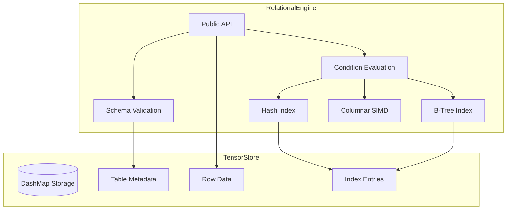
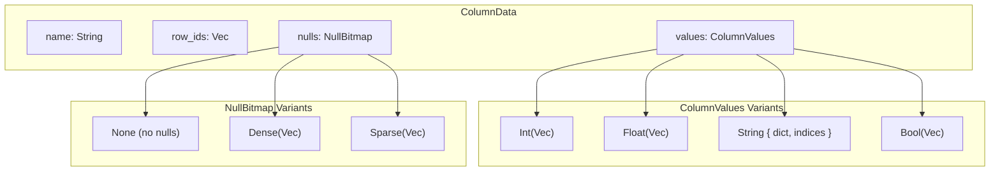
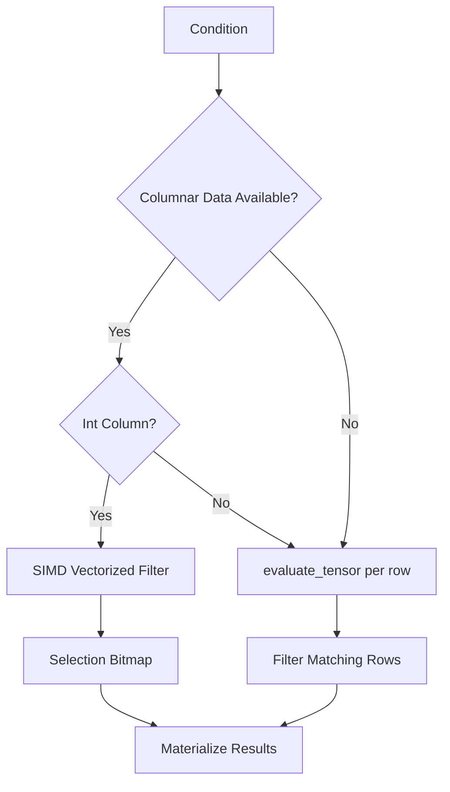
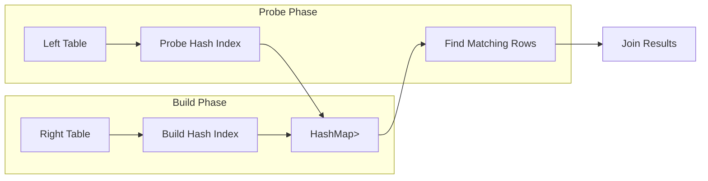

# Relational Engine

The Relational Engine (Module 2) provides SQL-like table operations on top of the Tensor Store. It implements schema enforcement, composable condition predicates, SIMD-accelerated columnar filtering, and both hash and B-tree indexes for query acceleration.

Tables, rows, and indexes are stored as tensor data in the underlying Tensor Store, inheriting its thread safety from DashMap. The engine supports all standard CRUD operations, six SQL join types, aggregate functions, and batch operations for bulk inserts.

## Architecture



### Query Execution Flow

```mermaid
flowchart TD
    Query[SELECT Query] --> ParseCond[Parse Condition]
    ParseCond --> CheckIdx{Has Index?}

    CheckIdx -->|Hash Index + Eq| HashLookup[O(1) Hash Lookup]
    CheckIdx -->|BTree + Range| BTreeRange[O(log n) Range Scan]
    CheckIdx -->|No Index| FullScan[Full Table Scan]

    HashLookup --> FilterRows[Apply Remaining Conditions]
    BTreeRange --> FilterRows
    FullScan --> SIMDFilter{Columnar Data?}

    SIMDFilter -->|Yes| VectorFilter[SIMD Vectorized Filter]
    SIMDFilter -->|No| RowFilter[Row-by-Row Filter]

    VectorFilter --> Results[Build Result Set]
    RowFilter --> Results
    FilterRows --> Results
```

## Key Types

| Type | Description |
|------|-------------|
| `RelationalEngine` | Main engine struct with TensorStore backend |
| `Schema` | Table schema with column definitions |
| `Column` | Column name, type, and nullability |
| `ColumnType` | `Int`, `Float`, `String`, `Bool` |
| `Value` | Typed value: `Null`, `Int(i64)`, `Float(f64)`, `String(String)`, `Bool(bool)` |
| `Row` | Row with ID and ordered column values |
| `Condition` | Composable filter predicate tree |
| `RelationalError` | Error variants for table/column/index operations |
| `ColumnData` | Columnar storage for a single column with null bitmap |
| `SelectionVector` | Bitmap-based row selection for SIMD operations |
| `OrderedKey` | B-tree index key with total ordering semantics |

### Column Types

| Type | Rust Type | Storage Format | Description |
|------|-----------|----------------|-------------|
| `Int` | `i64` | 8-byte little-endian | 64-bit signed integer |
| `Float` | `f64` | 8-byte IEEE 754 | 64-bit floating point |
| `String` | `String` | Dictionary-encoded | UTF-8 string with deduplication |
| `Bool` | `bool` | Packed bitmap (64 values per u64) | Boolean |

### Conditions

| Condition | Description | Index Support |
|-----------|-------------|---------------|
| `Condition::True` | Matches all rows | N/A |
| `Condition::Eq(col, val)` | Column equals value | Hash Index |
| `Condition::Ne(col, val)` | Column not equals value | None |
| `Condition::Lt(col, val)` | Column less than value | B-Tree Index |
| `Condition::Le(col, val)` | Column less than or equal | B-Tree Index |
| `Condition::Gt(col, val)` | Column greater than value | B-Tree Index |
| `Condition::Ge(col, val)` | Column greater than or equal | B-Tree Index |
| `Condition::And(a, b)` | Logical AND of two conditions | Partial (first indexable) |
| `Condition::Or(a, b)` | Logical OR of two conditions | None |

Conditions can be combined using `.and()` and `.or()` methods:

```rust
// age >= 18 AND age < 65
let condition = Condition::Ge("age".into(), Value::Int(18))
    .and(Condition::Lt("age".into(), Value::Int(65)));

// status = 'active' OR priority > 5
let condition = Condition::Eq("status".into(), Value::String("active".into()))
    .or(Condition::Gt("priority".into(), Value::Int(5)));
```

The special column `_id` filters by row ID and can be indexed.

### Error Types

| Error | Cause |
|-------|-------|
| `TableNotFound` | Table does not exist |
| `TableAlreadyExists` | Creating duplicate table |
| `ColumnNotFound` | Update references unknown column |
| `TypeMismatch` | Value type does not match column type |
| `NullNotAllowed` | NULL in non-nullable column |
| `IndexAlreadyExists` | Creating duplicate index |
| `IndexNotFound` | Dropping non-existent index |
| `StorageError` | Underlying Tensor Store error |

## Storage Model

Tables, rows, and indexes are stored in Tensor Store with specific key patterns:

| Key Pattern | Content |
|-------------|---------|
| `_meta:table:{name}` | Schema metadata |
| `{table}:{row_id}` | Row data |
| `_idx:{table}:{column}` | Hash index metadata |
| `_idx:{table}:{column}:{hash}` | Hash index entries (list of row IDs) |
| `_btree:{table}:{column}` | B-tree index metadata |
| `_btree:{table}:{column}:{sortable_key}` | B-tree index entries |
| `_col:{table}:{column}:data` | Columnar data storage |
| `_col:{table}:{column}:ids` | Columnar row ID mapping |
| `_col:{table}:{column}:nulls` | Columnar null bitmap |
| `_col:{table}:{column}:meta` | Columnar metadata |

Schema metadata encodes:
- `_columns`: Comma-separated column names
- `_col:{name}`: Type and nullability for each column

### Row Storage Format

Each row is stored as a `TensorData` object:

```rust
// Internal row structure
{
    "_id": Scalar(Int(row_id)),
    "name": Scalar(String("Alice")),
    "age": Scalar(Int(30)),
    "email": Scalar(String("alice@example.com"))
}
```

## Usage Examples

### Table Operations

```rust
let engine = RelationalEngine::new();

// Create table with schema
let schema = Schema::new(vec![
    Column::new("name", ColumnType::String),
    Column::new("age", ColumnType::Int),
    Column::new("email", ColumnType::String).nullable(),
]);
engine.create_table("users", schema)?;

// Check existence
engine.table_exists("users")?;  // -> bool

// List all tables
let tables = engine.list_tables();  // -> Vec<String>

// Get schema
let schema = engine.get_schema("users")?;

// Drop table (deletes all rows and indexes)
engine.drop_table("users")?;

// Row count
engine.row_count("users")?;  // -> usize
```

### CRUD Operations

```rust
// INSERT
let mut values = HashMap::new();
values.insert("name".to_string(), Value::String("Alice".into()));
values.insert("age".to_string(), Value::Int(30));
let row_id = engine.insert("users", values)?;

// BATCH INSERT (59x faster for bulk inserts)
let rows: Vec<HashMap<String, Value>> = (0..1000)
    .map(|i| {
        let mut values = HashMap::new();
        values.insert("name".to_string(), Value::String(format!("User{}", i)));
        values.insert("age".to_string(), Value::Int(20 + i));
        values
    })
    .collect();
let row_ids = engine.batch_insert("users", rows)?;

// SELECT
let rows = engine.select("users", Condition::Eq("age".into(), Value::Int(30)))?;

// UPDATE
let mut updates = HashMap::new();
updates.insert("age".to_string(), Value::Int(31));
let count = engine.update(
    "users",
    Condition::Eq("name".into(), Value::String("Alice".into())),
    updates
)?;

// DELETE
let count = engine.delete_rows("users", Condition::Lt("age".into(), Value::Int(18)))?;
```

### Joins

All six SQL join types are supported using hash join algorithm (O(n+m)):

```rust
// INNER JOIN - Only matching rows from both tables
let joined = engine.join("users", "posts", "_id", "user_id")?;
// Returns: Vec<(Row, Row)>

// LEFT JOIN - All rows from left, matching from right (or None)
let joined = engine.left_join("users", "posts", "_id", "user_id")?;
// Returns: Vec<(Row, Option<Row>)>

// RIGHT JOIN - All rows from right, matching from left (or None)
let joined = engine.right_join("users", "posts", "_id", "user_id")?;
// Returns: Vec<(Option<Row>, Row)>

// FULL JOIN - All rows from both tables
let joined = engine.full_join("users", "posts", "_id", "user_id")?;
// Returns: Vec<(Option<Row>, Option<Row>)>

// CROSS JOIN (Cartesian product)
let joined = engine.cross_join("users", "posts")?;
// Returns: Vec<(Row, Row)> with n*m rows

// NATURAL JOIN (on common column names)
let joined = engine.natural_join("users", "user_profiles")?;
// Returns: Vec<(Row, Row)> matching on all common columns
```

### Aggregate Functions

```rust
// COUNT(*) - count all rows
let count = engine.count("users", Condition::True)?;

// COUNT(column) - count non-null values
let count = engine.count_column("users", "email", Condition::True)?;

// SUM - returns f64
let total = engine.sum("orders", "amount", Condition::True)?;

// AVG - returns Option<f64> (None if no matching rows)
let avg = engine.avg("orders", "amount", Condition::True)?;

// MIN/MAX - returns Option<Value>
let min = engine.min("products", "price", Condition::True)?;
let max = engine.max("products", "price", Condition::True)?;
```

## Indexes

### Hash Indexes

Hash indexes provide O(1) equality lookups for `Condition::Eq` queries:

```rust
// Create hash index
engine.create_index("users", "age")?;

// Check existence
engine.has_index("users", "age");  // -> bool

// Get indexed columns
engine.get_indexed_columns("users");  // -> Vec<String>

// Drop index
engine.drop_index("users", "age")?;
```

**Hash Index Implementation Details:**

```mermaid
graph LR
    subgraph "Hash Index Structure"
        Value[Column Value] --> Hash[hash_key()]
        Hash --> Bucket["_idx:table:col:hash"]
        Bucket --> IDs["Vec<row_id>"]
    end
```

The hash index uses value-specific hashing:

| Value Type | Hash Format | Example |
|------------|-------------|---------|
| `Null` | `"null"` | `"null"` |
| `Int(i)` | `"i:{value}"` | `"i:42"` |
| `Float(f)` | `"f:{bits}"` | `"f:4614253070214989087"` |
| `String(s)` | `"s:{hash}"` | `"s:a1b2c3d4"` |
| `Bool(b)` | `"b:{value}"` | `"b:true"` |

Hash index performance:

| Query Type | Without Index | With Index | Speedup |
|------------|---------------|------------|---------|
| Equality (2% match on 5K rows) | 5.96ms | 126us | 47x |
| Single row by _id (5K rows) | 5.59ms | 3.5us | 1,597x |

### B-Tree Indexes

B-tree indexes accelerate range queries (`Lt`, `Le`, `Gt`, `Ge`) with O(log n + m) complexity:

```rust
// Create B-tree index
engine.create_btree_index("users", "age")?;

// Check existence
engine.has_btree_index("users", "age");  // -> bool

// Get B-tree indexed columns
engine.get_btree_indexed_columns("users");  // -> Vec<String>

// Drop index
engine.drop_btree_index("users", "age")?;

// Range queries now use the index
engine.select("users", Condition::Ge("age".into(), Value::Int(18)))?;
```

**B-Tree Index Implementation Details:**

The B-tree index uses a dual-storage approach:
1. **In-memory BTreeMap**: For O(log n) range operations
2. **Persistent TensorStore**: For durability and recovery

```rust
// Internal B-tree index structure
btree_indexes: RwLock<HashMap<
    (String, String),           // (table, column)
    BTreeMap<OrderedKey, Vec<u64>>  // value -> row_ids
>>
```

**OrderedKey for Total Ordering:**

The `OrderedKey` enum provides correct ordering semantics:

```rust
pub enum OrderedKey {
    Null,                    // Sorts first
    Bool(bool),              // false < true
    Int(i64),                // Standard integer ordering
    Float(OrderedFloat),     // NaN < all other values
    String(String),          // Lexicographic ordering
}
```

**Sortable Key Encoding:**

For persistent storage, values are encoded to maintain lexicographic ordering:

| Type | Encoding | Example |
|------|----------|---------|
| `Null` | `"0"` | `"0"` |
| `Int(i)` | `"i{hex(i + 2^63)}"` | `"i8000000000000000"` for 0 |
| `Float(f)` | `"f{sortable_bits}"` | IEEE 754 with sign handling |
| `String(s)` | `"s{s}"` | `"sAlice"` |
| `Bool(b)` | `"b0"` or `"b1"` | `"b1"` for true |

Integer encoding shifts the range from `[-2^63, 2^63-1]` to `[0, 2^64-1]` for correct lexicographic ordering of negative numbers.

**B-Tree Range Operations:**

```rust
// Internal range lookup
fn btree_range_lookup(&self, table: &str, column: &str,
                      value: &Value, op: RangeOp) -> Option<Vec<u64>> {
    match op {
        RangeOp::Lt => btree.range(..target),
        RangeOp::Le => btree.range(..=target),
        RangeOp::Gt => btree.range((Excluded(target), Unbounded)),
        RangeOp::Ge => btree.range(target..),
    }
}
```

## Columnar Architecture

The engine uses columnar storage with SIMD-accelerated filtering:

### Columnar Data Structures



**Null Bitmap Selection:**
- `None`: When column has no null values
- `Sparse`: When nulls are < 10% of rows (stores positions)
- `Dense`: When nulls are >= 10% of rows (stores bitmap)

### SIMD Filtering

Column data is stored in contiguous arrays enabling 4-wide SIMD vectorized comparisons using the `wide` crate:

```rust
// SIMD filter implementation using wide::i64x4
pub fn filter_lt_i64(values: &[i64], threshold: i64, result: &mut [u64]) {
    let chunks = values.len() / 4;
    let threshold_vec = i64x4::splat(threshold);

    for i in 0..chunks {
        let offset = i * 4;
        let v = i64x4::new([
            values[offset],
            values[offset + 1],
            values[offset + 2],
            values[offset + 3],
        ]);
        let cmp = v.cmp_lt(threshold_vec);
        let mask_arr: [i64; 4] = cmp.into();

        for (j, &m) in mask_arr.iter().enumerate() {
            if m != 0 {
                let bit_pos = offset + j;
                result[bit_pos / 64] |= 1u64 << (bit_pos % 64);
            }
        }
    }

    // Handle remainder with scalar fallback
    let start = chunks * 4;
    for i in start..values.len() {
        if values[i] < threshold {
            result[i / 64] |= 1u64 << (i % 64);
        }
    }
}
```

**Available SIMD Filter Functions:**

| Function | Operation | Types |
|----------|-----------|-------|
| `filter_lt_i64` | Less than | i64 |
| `filter_le_i64` | Less than or equal | i64 |
| `filter_gt_i64` | Greater than | i64 |
| `filter_ge_i64` | Greater than or equal | i64 |
| `filter_eq_i64` | Equal | i64 |
| `filter_ne_i64` | Not equal | i64 |
| `filter_lt_f64` | Less than | f64 |
| `filter_gt_f64` | Greater than | f64 |
| `filter_eq_f64` | Equal (with epsilon) | f64 |

**Bitmap Operations:**

```rust
// AND two selection bitmaps
pub fn bitmap_and(a: &[u64], b: &[u64], result: &mut [u64])

// OR two selection bitmaps
pub fn bitmap_or(a: &[u64], b: &[u64], result: &mut [u64])

// Count set bits
pub fn popcount(bitmap: &[u64]) -> usize

// Extract selected indices
pub fn selected_indices(bitmap: &[u64], max_count: usize) -> Vec<usize>
```

### Selection Vectors

Query results use bitmap-based selection vectors to avoid copying data:

```rust
pub struct SelectionVector {
    bitmap: Vec<u64>,  // Packed bits indicating selected rows
    row_count: usize,
}

impl SelectionVector {
    // Create selection of all rows
    pub fn all(row_count: usize) -> Self;

    // Create empty selection
    pub fn none(row_count: usize) -> Self;

    // Check if row is selected
    pub fn is_selected(&self, idx: usize) -> bool;

    // Count selected rows
    pub fn count(&self) -> usize;

    // AND two selections (intersection)
    pub fn intersect(&self, other: &SelectionVector) -> SelectionVector;

    // OR two selections (union)
    pub fn union(&self, other: &SelectionVector) -> SelectionVector;
}
```

### Columnar Select API

```rust
// Materialize columns for SIMD filtering
engine.materialize_columns("users", &["age", "name"])?;

// Check if columnar data exists
engine.has_columnar_data("users", "age");  // -> bool

// Select with columnar scan options
let options = ColumnarScanOptions {
    projection: Some(vec!["name".into()]),  // Only return these columns
    prefer_columnar: true,                   // Use SIMD when available
};

let rows = engine.select_columnar(
    "users",
    Condition::Gt("age".into(), Value::Int(50)),
    options
)?;

// Drop columnar data
engine.drop_columnar_data("users", "age")?;
```

### Condition Evaluation

Two evaluation methods are available:

| Method | Input | Performance | Use Case |
|--------|-------|-------------|----------|
| `evaluate(&row)` | Row struct | Legacy, creates intermediate objects | Row-by-row filtering |
| `evaluate_tensor(&tensor)` | TensorData | 31% faster, no intermediate allocation | Direct tensor filtering |

The engine automatically chooses the optimal evaluation path:



## Join Algorithm Implementations

### Hash Join (INNER, LEFT, RIGHT, FULL)

All equality joins use the hash join algorithm with O(n+m) complexity:



**Hash Join Implementation:**

```rust
pub fn join(&self, table_a: &str, table_b: &str,
            on_a: &str, on_b: &str) -> Result<Vec<(Row, Row)>> {
    let rows_a = self.select(table_a, Condition::True)?;
    let rows_b = self.select(table_b, Condition::True)?;

    // Build phase: index the right table
    let mut index: HashMap<String, Vec<usize>> = HashMap::with_capacity(rows_b.len());
    for (i, row) in rows_b.iter().enumerate() {
        if let Some(val) = row.get_with_id(on_b) {
            let hash = val.hash_key();
            index.entry(hash).or_default().push(i);
        }
    }

    // Probe phase: scan left table and probe index
    let mut results = Vec::with_capacity(min(rows_a.len(), rows_b.len()));
    for row_a in &rows_a {
        if let Some(val) = row_a.get_with_id(on_a) {
            let hash = val.hash_key();
            if let Some(indices) = index.get(&hash) {
                for &i in indices {
                    let row_b = &rows_b[i];
                    // Verify actual equality (handles hash collisions)
                    if row_b.get_with_id(on_b).as_ref() == Some(&val) {
                        results.push((row_a.clone(), row_b.clone()));
                    }
                }
            }
        }
    }
    Ok(results)
}
```

**Parallel Join Optimization:**

When left table exceeds `PARALLEL_THRESHOLD` (1000 rows), joins use Rayon for parallel probing:

```rust
if rows_a.len() >= Self::PARALLEL_THRESHOLD {
    rows_a.par_iter()
        .flat_map(|row_a| {
            // Parallel probe of hash index
        })
        .collect()
}
```

### Natural Join

Natural join finds all common column names and joins on their equality:

```rust
pub fn natural_join(&self, table_a: &str, table_b: &str) -> Result<Vec<(Row, Row)>> {
    let schema_a = self.get_schema(table_a)?;
    let schema_b = self.get_schema(table_b)?;

    // Find common columns
    let cols_a: HashSet<_> = schema_a.columns.iter().map(|c| c.name.as_str()).collect();
    let cols_b: HashSet<_> = schema_b.columns.iter().map(|c| c.name.as_str()).collect();
    let common_cols: Vec<_> = cols_a.intersection(&cols_b).copied().collect();

    // No common columns = cross join
    if common_cols.is_empty() {
        return self.cross_join(table_a, table_b);
    }

    // Build composite hash key from all common columns
    // ...
}
```

## Aggregate Function Internals

### Parallel Aggregation

For tables exceeding `PARALLEL_THRESHOLD` (1000 rows), aggregates use parallel reduction:

```rust
pub fn avg(&self, table: &str, column: &str, condition: Condition) -> Result<Option<f64>> {
    let rows = self.select(table, condition)?;

    let (total, count) = if rows.len() >= Self::PARALLEL_THRESHOLD {
        // Parallel map-reduce
        rows.par_iter()
            .map(|row| extract_numeric(row, column))
            .reduce(|| (0.0, 0u64), |(s1, c1), (s2, c2)| (s1 + s2, c1 + c2))
    } else {
        // Sequential accumulation
        let mut total = 0.0;
        let mut count = 0u64;
        for row in &rows {
            // accumulate...
        }
        (total, count)
    };

    if count == 0 { Ok(None) } else { Ok(Some(total / count as f64)) }
}
```

### MIN/MAX with Parallel Reduction

```rust
pub fn min(&self, table: &str, column: &str, condition: Condition) -> Result<Option<Value>> {
    let rows = self.select(table, condition)?;

    if rows.len() >= Self::PARALLEL_THRESHOLD {
        rows.par_iter()
            .filter_map(|row| row.get(column).filter(|v| !matches!(v, Value::Null)))
            .reduce_with(|a, b| {
                if a.partial_cmp_value(&b) == Some(Ordering::Less) { a } else { b }
            })
    } else {
        // Sequential scan
    }
}
```

## Performance Characteristics

| Operation | Complexity | Notes |
|-----------|------------|-------|
| `insert` | O(1) + O(k) | Schema validation + store put + k index updates |
| `batch_insert` | O(n) + O(n*k) | Single schema lookup, 59x faster than n inserts |
| `select` (no index) | O(n) | Full table scan with SIMD filter |
| `select` (hash index) | O(1) | Direct lookup via hash index |
| `select` (btree range) | O(log n + m) | B-tree lookup + m matching rows |
| `update` | O(n) + O(k) | Scan + conditional update + index maintenance |
| `delete_rows` | O(n) + O(k) | Scan + conditional delete + index removal |
| `join` | O(n+m) | Hash join for all 6 join types |
| `cross_join` | O(n*m) | Cartesian product |
| `count/sum/avg/min/max` | O(n) | Single pass over matching rows |
| `create_index` | O(n) | Scan all rows to build index |
| `materialize_columns` | O(n) | Extract column to contiguous array |

Where k = number of indexes on the table, n = rows in left table, m = rows in right table.

### Parallel Threshold

Operations automatically switch to parallel execution when row count exceeds `PARALLEL_THRESHOLD`:

```rust
impl RelationalEngine {
    const PARALLEL_THRESHOLD: usize = 1000;
}
```

**Parallel Operations:**
- `delete_rows` (parallel deletion via Rayon)
- `join` (parallel probe phase)
- `sum`, `avg`, `min`, `max` (parallel reduction)

## Configuration

The Relational Engine uses the underlying TensorStore configuration. Key internal constants:

| Constant | Value | Description |
|----------|-------|-------------|
| `PARALLEL_THRESHOLD` | 1000 | Minimum rows for parallel operations |
| Null bitmap sparse threshold | 10% | Use sparse bitmap when nulls < 10% |
| SIMD vector width | 4 | i64x4/f64x4 operations |

## Edge Cases and Gotchas

### NULL Handling

1. **NULL in conditions**: Comparisons with NULL columns return `false`:
   ```rust
   // If email is NULL, this returns false (not true!)
   Condition::Lt("email".into(), Value::String("z".into()))
   ```

2. **NULL in joins**: NULL values never match in join conditions:
   ```rust
   // Post with user_id = NULL will not join with any user
   engine.join("users", "posts", "_id", "user_id")
   ```

3. **COUNT vs COUNT(column)**:
   - `count()` counts all rows
   - `count_column()` counts non-null values only

### Type Mismatches

Comparisons between incompatible types return `false` rather than error:

```rust
// Age is Int, comparing with String returns 0 matches (not error)
engine.select("users", Condition::Lt("age".into(), Value::String("30".into())));
```

### Index Maintenance

Indexes are automatically maintained on INSERT, UPDATE, and DELETE:

```rust
// Creating index AFTER data exists
engine.insert("users", values)?;  // No index update
engine.create_index("users", "age")?;  // Scans all rows

// Creating index BEFORE data exists
engine.create_index("users", "age")?;  // Empty index
engine.insert("users", values)?;  // Updates index
```

### Batch Insert Atomicity

`batch_insert` validates ALL rows upfront before inserting any:

```rust
let rows = vec![valid_row, invalid_row];
// Fails on validation - NO rows inserted (not partial insert)
engine.batch_insert("users", rows);
```

### B-Tree Index Recovery

B-tree indexes maintain both in-memory and persistent state. The in-memory BTreeMap is rebuilt lazily on first access after restart.

## Best Practices

### Index Selection

| Query Pattern | Recommended Index |
|--------------|-------------------|
| `WHERE col = value` | Hash Index |
| `WHERE col > value` | B-Tree Index |
| `WHERE col BETWEEN a AND b` | B-Tree Index |
| `WHERE col IN (...)` | Hash Index |
| Unique lookups by ID | Hash Index on `_id` |

### Columnar Materialization

Materialize columns when:
- Performing many range scans on large tables
- Query selectivity is low (scanning most rows)
- Column data fits in memory

```rust
// Good: Materialize frequently-filtered columns
engine.materialize_columns("events", &["timestamp", "user_id"])?;

// Query uses SIMD acceleration
engine.select_columnar("events",
    Condition::Gt("timestamp".into(), Value::Int(cutoff)),
    ColumnarScanOptions { prefer_columnar: true, .. }
)?;
```

### Batch Operations

Use `batch_insert` for bulk loading:

```rust
// Bad: 1000 individual inserts
for row in rows {
    engine.insert("table", row)?;  // 1000 schema lookups
}

// Good: Single batch insert
engine.batch_insert("table", rows)?;  // 1 schema lookup, 59x faster
```

## SQL Features via Query Router

When using the relational engine through `query_router`, additional SQL features are available:

### ORDER BY and OFFSET

```sql
SELECT * FROM users ORDER BY age ASC;
SELECT * FROM users ORDER BY department DESC, name ASC;
SELECT * FROM users ORDER BY email NULLS FIRST;
SELECT * FROM users ORDER BY created_at DESC LIMIT 10 OFFSET 20;
```

### GROUP BY and HAVING

```sql
SELECT department, COUNT(*), AVG(salary) FROM employees GROUP BY department;

SELECT product, SUM(quantity) as total
FROM orders
GROUP BY product
HAVING SUM(quantity) > 100;
```

## Related Modules

| Module | Relationship |
|--------|--------------|
| `tensor_store` | Storage backend for tables, rows, and indexes |
| `query_router` | Executes SQL queries using RelationalEngine |
| `neumann_parser` | Parses SQL statements into AST |
| `tensor_unified` | Multi-engine unified storage layer |

## Feature Summary

### Implemented

| Feature | Description |
|---------|-------------|
| Hash indexes | O(1) equality lookups |
| B-tree indexes | O(log n) range query acceleration |
| All 6 JOIN types | INNER, LEFT, RIGHT, FULL, CROSS, NATURAL |
| Aggregate functions | COUNT, SUM, AVG, MIN, MAX |
| ORDER BY | Multi-column sorting with ASC/DESC, NULLS FIRST/LAST |
| LIMIT/OFFSET | Pagination support |
| GROUP BY + HAVING | Row grouping with aggregate filtering |
| Columnar storage | SIMD-accelerated filtering with selection vectors |
| Batch operations | 59x faster bulk inserts |
| Parallel operations | Rayon-based parallelism for large tables |
| Dictionary encoding | String column compression |

### Future Considerations

| Feature | Status |
|---------|--------|
| Query Optimization | Not implemented |
| Transactions | Not implemented |
| Foreign Keys | Not implemented |
| Subqueries | Not implemented |
| Window Functions | Not implemented |
| Composite Indexes | Not implemented |
