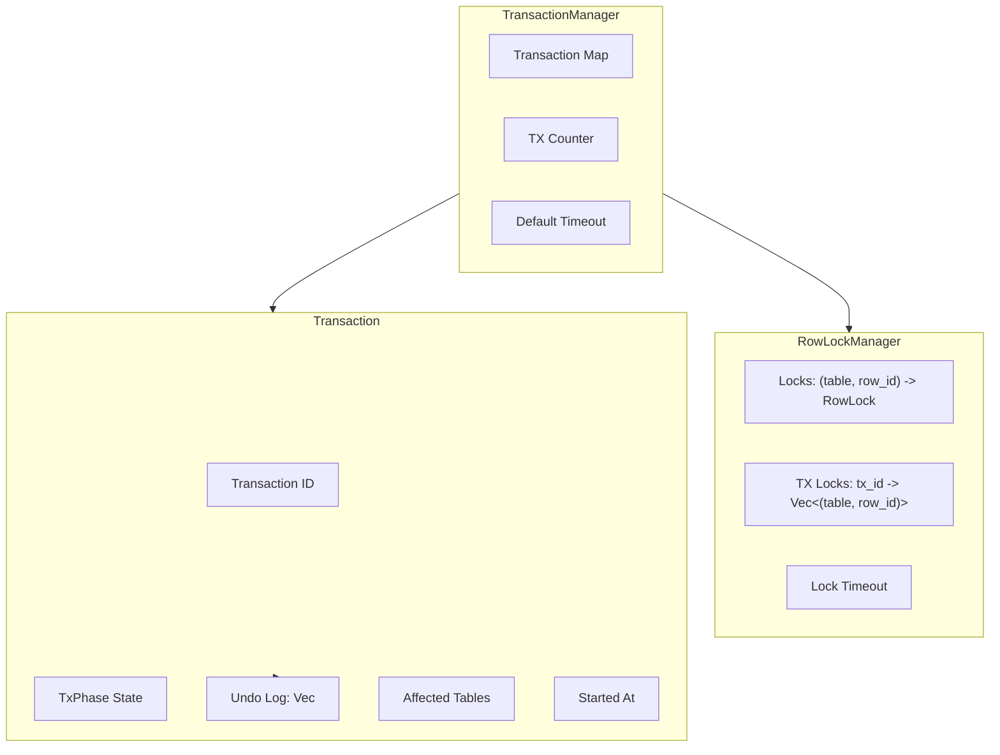
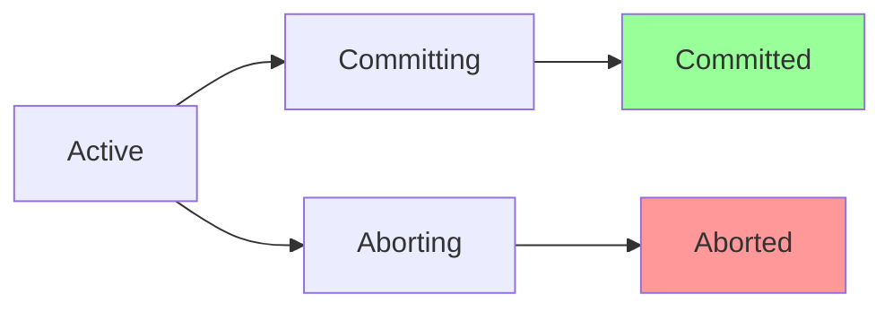
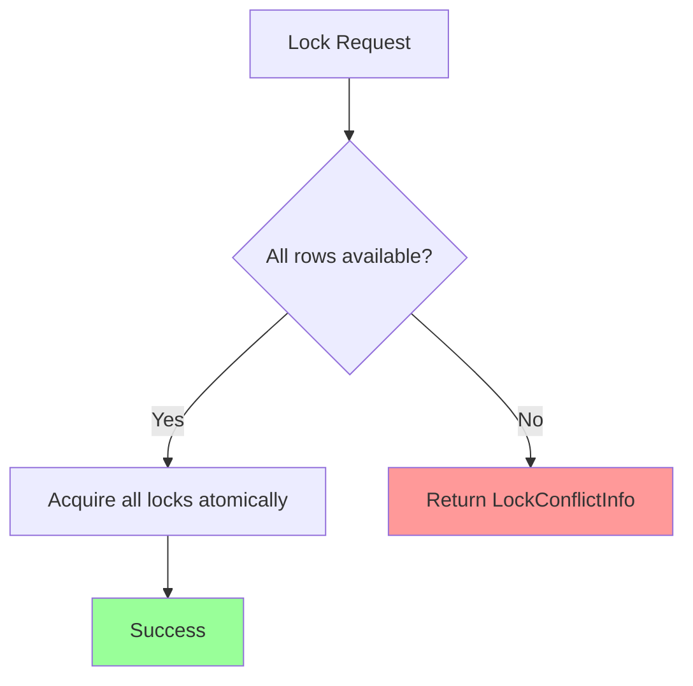

# Relational Engine Transactions

Local ACID transactions for single-shard relational operations. This module
provides row-level locking, undo logging for rollback, and timeout-based
deadlock prevention.

Transactions in the relational engine operate within a single shard and do not
coordinate with other nodes. For distributed transactions across multiple
shards, see [Distributed Transactions](../concepts/distributed-transactions.md).

## Architecture



### Component Relationships

```text
+-------------------+
| RelationalEngine  |
+-------------------+
         |
         v
+-------------------+     +------------------+
| TransactionManager| --> | RowLockManager   |
| - begin()         |     | - try_lock()     |
| - commit()        |     | - release()      |
| - rollback()      |     | - cleanup_expired|
+-------------------+     +------------------+
         |
         v
+-------------------+
| Transaction       |
| - tx_id           |
| - phase           |
| - undo_log        |
+-------------------+
```

## Transaction Lifecycle

Transactions follow a 5-state machine with well-defined transitions:



| Phase | Description | Valid Transitions |
| --- | --- | --- |
| `Active` | Operations allowed, locks acquired | Committing, Aborting |
| `Committing` | Finalizing changes | Committed |
| `Committed` | Changes permanent (terminal) | None |
| `Aborting` | Rolling back via undo log | Aborted |
| `Aborted` | Changes reverted (terminal) | None |

### Lifecycle Flow

```rust
// Begin transaction
let tx_id = tx_manager.begin();
// Phase: Active

// Acquire row locks for modifications
lock_manager.try_lock(tx_id, &[("users", 1), ("users", 2)])?;

// Record undo entries for rollback
tx_manager.record_undo(tx_id, UndoEntry::UpdatedRow { ... });

// Option 1: Commit
tx_manager.set_phase(tx_id, TxPhase::Committing);
// Apply changes...
tx_manager.set_phase(tx_id, TxPhase::Committed);
tx_manager.release_locks(tx_id);

// Option 2: Rollback
tx_manager.set_phase(tx_id, TxPhase::Aborting);
for entry in tx_manager.get_undo_log(tx_id).iter().rev() {
    // Apply undo entry...
}
tx_manager.set_phase(tx_id, TxPhase::Aborted);
tx_manager.release_locks(tx_id);
```

## Undo Log

The undo log stores entries needed to reverse each operation on rollback.
Entries are applied in reverse order during rollback.

### UndoEntry Variants

| Variant | Action on Rollback | Stored Data |
| --- | --- | --- |
| `InsertedRow` | Delete the row | table, slab_row_id, row_id, index_entries |
| `UpdatedRow` | Restore old values | table, slab_row_id, row_id, old_values, index_changes |
| `DeletedRow` | Re-insert the row | table, slab_row_id, row_id, old_values, index_entries |

### Undo Log Structure

```text
Transaction Undo Log:
+---------------------------------------------------+
| Entry 0: InsertedRow { table: "users", row_id: 5 }|
+---------------------------------------------------+
| Entry 1: UpdatedRow { table: "users", row_id: 3,  |
|          old_values: [Int(25)], ... }             |
+---------------------------------------------------+
| Entry 2: DeletedRow { table: "orders", row_id: 7, |
|          old_values: [...], index_entries: [...] }|
+---------------------------------------------------+

Rollback order: Entry 2 -> Entry 1 -> Entry 0
```

### Index Change Tracking

Updates that modify indexed columns record `IndexChange` entries:

```rust
pub struct IndexChange {
    pub column: String,     // Column name
    pub old_value: Value,   // Value before update
    pub new_value: Value,   // Value after update
}
```

On rollback, index entries are reverted:

1. Remove new index entry for the new value
2. Restore old index entry for the old value

## Row-Level Locking

The `RowLockManager` provides pessimistic row-level locking with atomic
multi-row acquisition.

### Lock Acquisition



Locks are acquired atomically to prevent partial lock acquisition:

```rust
// Atomic multi-row locking
let rows = vec![
    ("users".to_string(), 1),
    ("users".to_string(), 2),
    ("orders".to_string(), 5),
];

match lock_manager.try_lock(tx_id, &rows) {
    Ok(()) => {
        // All locks acquired
    }
    Err(conflict) => {
        // No locks acquired, conflict info provided
        println!("Blocked by tx {}", conflict.blocking_tx);
    }
}
```

### Lock Semantics

| Property | Behavior |
| --- | --- |
| Granularity | Row-level: (table, row_id) |
| Acquisition | All-or-nothing atomic |
| Re-entry | Same transaction can re-acquire its locks |
| Timeout | Configurable, default 30 seconds |
| Expiration | Expired locks are treated as available |

### Lock Conflict Detection

When a lock conflict occurs, `LockConflictInfo` provides details:

```rust
pub struct LockConflictInfo {
    pub blocking_tx: u64,   // Transaction holding the lock
    pub table: String,      // Table name
    pub row_id: u64,        // Row ID
}
```

### Expired Lock Handling

Locks automatically expire after the configured timeout:

```rust
// Check if lock is expired
if lock.is_expired() {
    // Lock can be acquired by another transaction
}

// Periodic cleanup of expired locks
let cleaned = lock_manager.cleanup_expired();
```

## Deadline

The `Deadline` struct provides monotonic time-based timeout checking:

```rust
// Create deadline with timeout
let deadline = Deadline::from_timeout_ms(Some(5000));

// Check expiration
if deadline.is_expired() {
    return Err(TimeoutError);
}

// Get remaining time
if let Some(remaining) = deadline.remaining_ms() {
    println!("{} ms remaining", remaining);
}

// Never-expiring deadline
let no_deadline = Deadline::never();
```

Benefits of monotonic time (`Instant`):

- Immune to system clock changes
- Consistent timeout behavior
- No backwards time jumps

## Configuration

### Transaction Manager

| Parameter | Default | Description |
| --- | --- | --- |
| `default_timeout` | 60 seconds | Maximum transaction duration |

### Row Lock Manager

| Parameter | Default | Description |
| --- | --- | --- |
| `default_timeout` | 30 seconds | Maximum time to hold a lock |

### Custom Configuration

```rust
use std::time::Duration;

// Custom transaction timeout
let tx_manager = TransactionManager::with_timeout(
    Duration::from_secs(120)
);

// Custom lock timeout
let lock_manager = RowLockManager::with_default_timeout(
    Duration::from_secs(60)
);
```

## Error Handling

### Lock Errors

| Error | Cause | Recovery |
| --- | --- | --- |
| `LockConflict` | Row locked by another transaction | Retry with exponential backoff |
| Lock timeout | Could not acquire lock in time | Rollback and retry |

### Transaction Errors

| Error | Cause | Recovery |
| --- | --- | --- |
| Transaction not found | Invalid transaction ID | Start new transaction |
| Transaction expired | Exceeded timeout | Transaction auto-aborted |
| Invalid phase transition | Illegal state change | Check transaction state |

### Cleanup Operations

```rust
// Clean up expired transactions (releases their locks)
let expired_count = tx_manager.cleanup_expired();

// Clean up expired locks only
let expired_locks = lock_manager.cleanup_expired();
```

## Comparison with Distributed Transactions

| Aspect | Relational Tx | Distributed Tx (2PC) |
| --- | --- | --- |
| Scope | Single shard | Cross-shard |
| Protocol | Local locking | Prepare/Commit phases |
| Deadlock detection | Timeout-based | Wait-for graph analysis |
| Coordinator | None | DistributedTxCoordinator |
| Recovery | Undo log | WAL + 2PC recovery |
| Latency | Low (local) | Higher (network round-trips) |
| Isolation | Row-level locks | Key-level locks |

For cross-shard transactions, use `tensor_chain`'s
[Distributed Transactions](../concepts/distributed-transactions.md).

## Usage Examples

### Basic Transaction

```rust
let engine = RelationalEngine::new();
let tx_manager = engine.tx_manager();

// Begin transaction
let tx_id = tx_manager.begin();

// Perform operations (simplified)
// engine.insert_tx(tx_id, "users", values)?;
// engine.update_tx(tx_id, "users", condition, updates)?;

// Commit
tx_manager.set_phase(tx_id, TxPhase::Committing);
// Apply pending changes...
tx_manager.set_phase(tx_id, TxPhase::Committed);
tx_manager.release_locks(tx_id);
tx_manager.remove(tx_id);
```

### Rollback on Error

```rust
let tx_id = tx_manager.begin();

match perform_operations(tx_id) {
    Ok(()) => {
        tx_manager.set_phase(tx_id, TxPhase::Committed);
    }
    Err(e) => {
        tx_manager.set_phase(tx_id, TxPhase::Aborting);

        // Apply undo log in reverse
        if let Some(undo_log) = tx_manager.get_undo_log(tx_id) {
            for entry in undo_log.iter().rev() {
                apply_undo(entry);
            }
        }

        tx_manager.set_phase(tx_id, TxPhase::Aborted);
    }
}

tx_manager.release_locks(tx_id);
tx_manager.remove(tx_id);
```

### Checking Lock Status

```rust
let lock_manager = tx_manager.lock_manager();

// Check if row is locked
if lock_manager.is_locked("users", 42) {
    println!("Row is locked");
}

// Get lock holder
if let Some(holder_tx) = lock_manager.lock_holder("users", 42) {
    println!("Locked by transaction {}", holder_tx);
}

// Count active locks
println!("{} active locks", lock_manager.active_lock_count());
println!("{} locks held by tx {}", lock_manager.locks_held_by(tx_id), tx_id);
```

## Key Types

| Type | Description |
| --- | --- |
| `TxPhase` | 5-state transaction phase enum |
| `Transaction` | Active transaction state |
| `UndoEntry` | Undo log entry for rollback |
| `IndexChange` | Index modification record |
| `RowLock` | Row lock with timeout |
| `RowLockManager` | Row-level lock manager |
| `LockConflictInfo` | Lock conflict details |
| `Deadline` | Monotonic timeout checker |
| `TransactionManager` | Transaction lifecycle manager |

## Source References

- `relational_engine/src/transaction.rs` - Transaction implementation
- `relational_engine/src/lib.rs` - Integration with RelationalEngine
