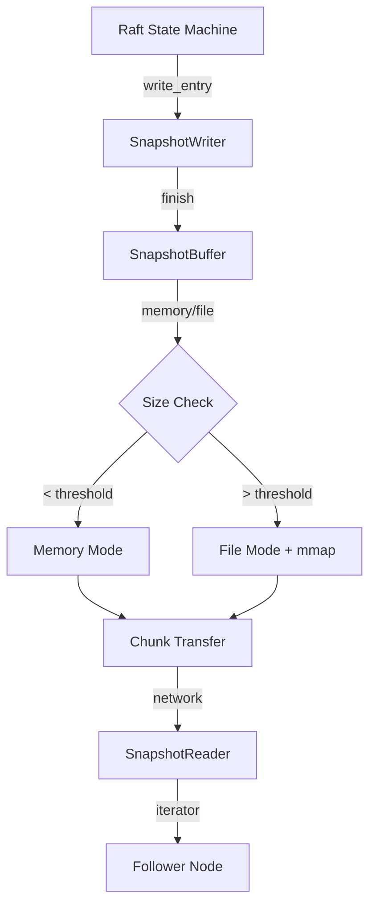
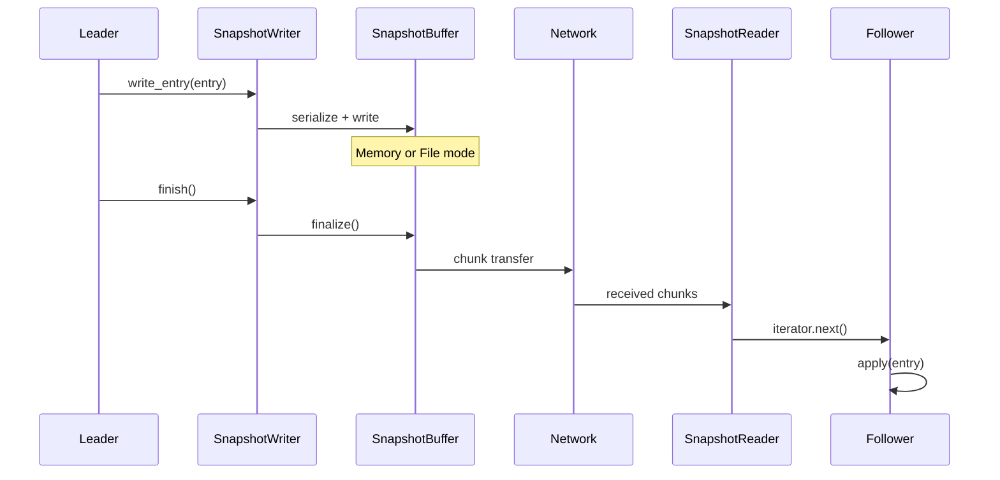
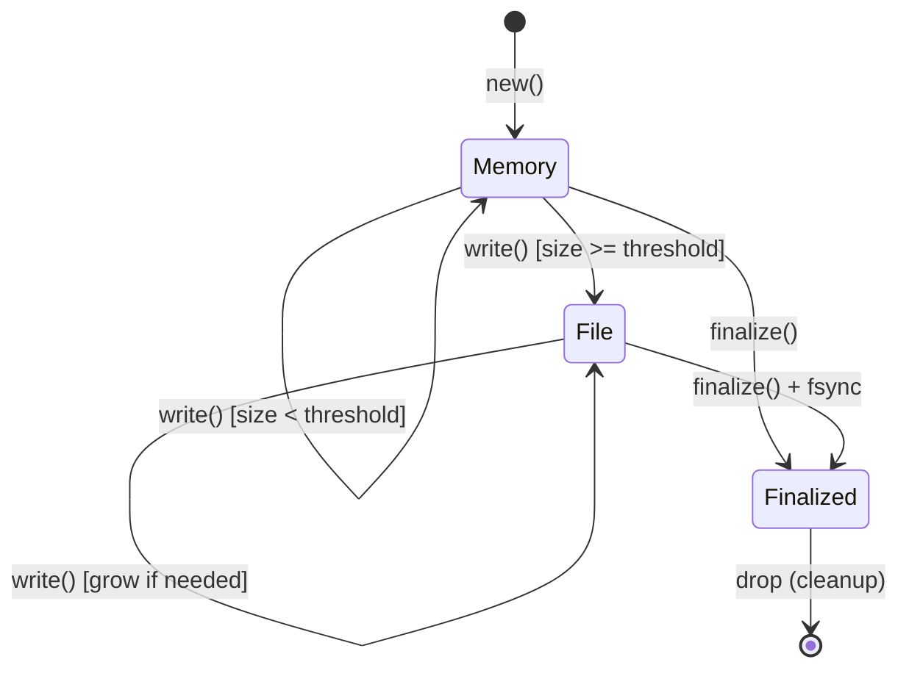
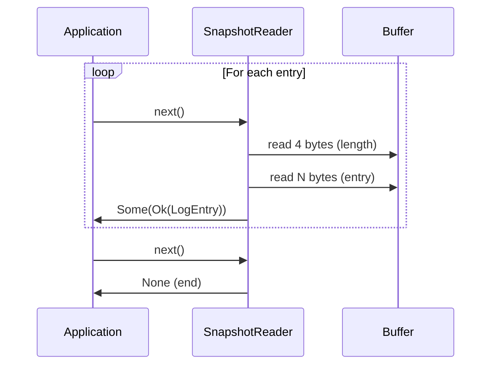
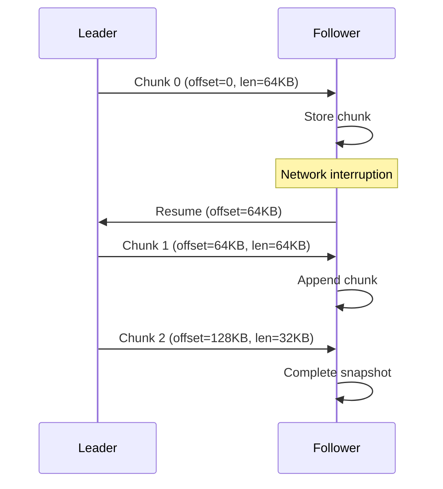

# Snapshot Streaming

The snapshot streaming system provides memory-efficient serialization and
transfer of Raft log snapshots. It enables handling of large snapshots
containing millions of log entries without exhausting heap memory.

## Overview

Key features:

- **Incremental writing**: Entries serialized one at a time via `SnapshotWriter`
- **Lazy reading**: Entries deserialized on-demand via `SnapshotReader` iterator
- **Memory bounded**: Automatic disk spill via `SnapshotBuffer`
- **Backwards compatible**: Falls back to legacy format for old snapshots



## Wire Format

The streaming format uses length-prefixed entries for efficient parsing.

### Header Structure

```text
+--------+--------+------------------+
| Magic | Version | Entry Count |
| 4 bytes | 4 bytes | 8 bytes |
+--------+--------+------------------+
| "SNAP" | 1 | u64 LE |
+--------+--------+------------------+
Total: 16 bytes
```

### Entry Structure

```text
+--------+------------------------+
| Length | Bincode-serialized |
| 4 bytes | LogEntry |
+--------+------------------------+
| u32 LE | variable |
+--------+------------------------+
```

### Complete Snapshot Layout

```text
+--------+--------+--------+--------+--------+--------+
| SNAP   | Ver(1) | Count  | Len1   | Entry1 | Len2   | ...
| 4B     | 4B     | 8B     | 4B     | N bytes| 4B     | ...
+--------+--------+--------+--------+--------+--------+
```

## Architecture

### Leader-to-Follower Flow



### SnapshotBuffer State Transitions



## SnapshotBuffer

The `SnapshotBuffer` provides adaptive memory/disk storage with bounded
memory usage.

### Configuration

| Parameter | Default | Description |
| --- | --- | --- |
| `max_memory_bytes` | 256 MB | Threshold before disk spill |
| `temp_dir` | System | Directory for temp files |
| `initial_file_capacity` | 64 MB | Initial file size when spilling |

### Configuration Example

```rust
use tensor_chain::snapshot_buffer::SnapshotBufferConfig;

let config = SnapshotBufferConfig::default()
    .with_max_memory(512 * 1024 * 1024)  // 512 MB
    .with_temp_dir("/var/lib/neumann/snapshots");
```

### Performance Characteristics

| Operation | Memory Mode | File Mode |
| --- | --- | --- |
| `write()` | O(1) amortized | O(1) + possible mmap resize |
| `as_slice()` | O(1) | O(1) zero-copy via mmap |
| `read_chunk()` | O(n) copy | O(n) copy |
| `finalize()` | O(1) | O(1) + fsync |

## SnapshotWriter

The `SnapshotWriter` serializes log entries incrementally using the length-
prefixed format.

### Usage

```rust
use tensor_chain::snapshot_streaming::SnapshotWriter;
use tensor_chain::snapshot_buffer::SnapshotBufferConfig;

let config = SnapshotBufferConfig::default();
let mut writer = SnapshotWriter::new(config)?;

// Write entries incrementally
for entry in log_entries {
    writer.write_entry(&entry)?;
}

// Check progress
println!("Entries: {}", writer.entry_count());
println!("Bytes: {}", writer.bytes_written());
println!("Last index: {}", writer.last_index());

// Finalize and get buffer
let buffer = writer.finish()?;
```

### Progress Tracking

| Method | Description |
| --- | --- |
| `entry_count()` | Number of entries written |
| `bytes_written()` | Total bytes including header |
| `last_index()` | Index of last entry written |
| `last_term()` | Term of last entry written |

## SnapshotReader

The `SnapshotReader` deserializes entries on-demand using an iterator
interface.

### Usage

```rust
use tensor_chain::snapshot_streaming::SnapshotReader;

// Create reader (validates header)
let reader = SnapshotReader::new(&buffer)?;

println!("Entry count: {}", reader.entry_count());

// Read via iterator
for result in reader {
    let entry = result?;
    state_machine.apply(entry);
}
```

### Iterator Protocol



### Progress Tracking

| Method | Description |
| --- | --- |
| `entry_count()` | Total entries in snapshot |
| `entries_read()` | Entries read so far |
| `remaining()` | Entries not yet read |

## Chunk Transfer

For network transfer, the buffer supports chunked reading with resume
capability.

### Resume Protocol



### Bandwidth Configuration

| Chunk Size | Use Case |
| --- | --- |
| 16 KB | High-latency networks |
| 64 KB | Default, balanced |
| 256 KB | Low-latency, high-bandwidth |
| 1 MB | Local/datacenter transfers |

## Error Handling

| Error Type | Cause | Recovery |
| --- | --- | --- |
| `Io` | File/mmap operation failed | Check disk space/perms |
| `Buffer` | Out of bounds read | Verify offset/length |
| `Serialization` | Bincode encode/decode failed | Check data integrity |
| `InvalidFormat` | Wrong magic, version, or size | Verify snapshot source |
| `UnexpectedEof` | Truncated data or count error | Re-transfer snapshot |

### Security Limits

| Limit | Value | Purpose |
| --- | --- | --- |
| Max entry size | 100 MB | Prevent memory exhaustion |
| Max header version | 1 | Reject unknown formats |

## Legacy Compatibility

The system automatically handles legacy (non-streaming) snapshots.

### Format Detection

```rust
use tensor_chain::snapshot_streaming::deserialize_entries;

// Automatically detects format
let entries = deserialize_entries(snapshot_bytes)?;

// Works with:
// - Streaming format (magic = "SNAP")
// - Legacy bincode Vec<LogEntry>
```

## Usage Example

### Complete Leader Workflow

```rust
use tensor_chain::snapshot_streaming::{SnapshotWriter, serialize_entries};
use tensor_chain::snapshot_buffer::SnapshotBufferConfig;

// Create optimized config for large snapshots
let config = SnapshotBufferConfig::default()
    .with_max_memory(256 * 1024 * 1024);

// Serialize incrementally
let mut writer = SnapshotWriter::new(config)?;
for entry in state_machine.log_entries() {
    writer.write_entry(&entry)?;
}
let buffer = writer.finish()?;

// Serve chunks to followers
let total_len = buffer.total_len();
let chunk_size = 64 * 1024;
let mut offset = 0;

while offset < total_len {
    let len = (total_len - offset).min(chunk_size as u64) as usize;
    let chunk = buffer.as_slice(offset, len)?;
    send_chunk_to_follower(offset, chunk)?;
    offset += len as u64;
}
```

### Complete Follower Workflow

```rust
use tensor_chain::snapshot_streaming::SnapshotReader;
use tensor_chain::snapshot_buffer::SnapshotBuffer;

// Receive and assemble chunks
let mut buffer = SnapshotBuffer::with_defaults()?;
while let Some(chunk) = receive_chunk() {
    buffer.write(&chunk)?;
}
buffer.finalize()?;

// Verify integrity
let expected_hash = received_hash;
let actual_hash = buffer.hash();
assert_eq!(expected_hash, actual_hash);

// Apply entries
let reader = SnapshotReader::new(&buffer)?;
for result in reader {
    let entry = result?;
    state_machine.apply(entry)?;
}
```

## Source Reference

- `tensor_chain/src/snapshot_streaming.rs` - Streaming protocol
- `tensor_chain/src/snapshot_buffer.rs` - Adaptive buffer implementation
