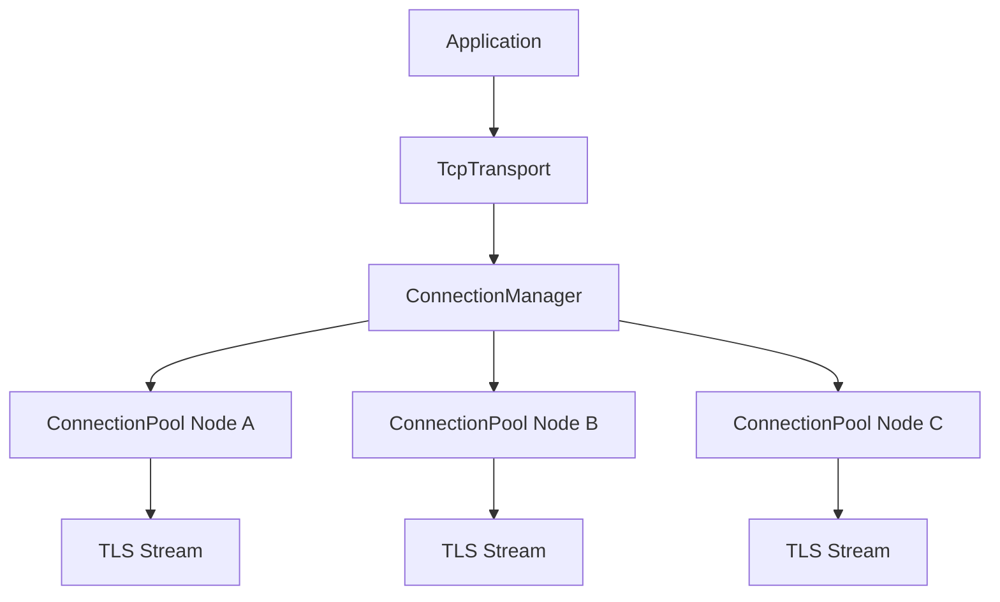
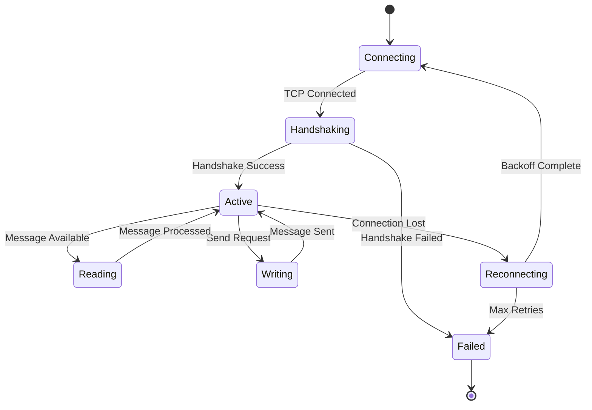
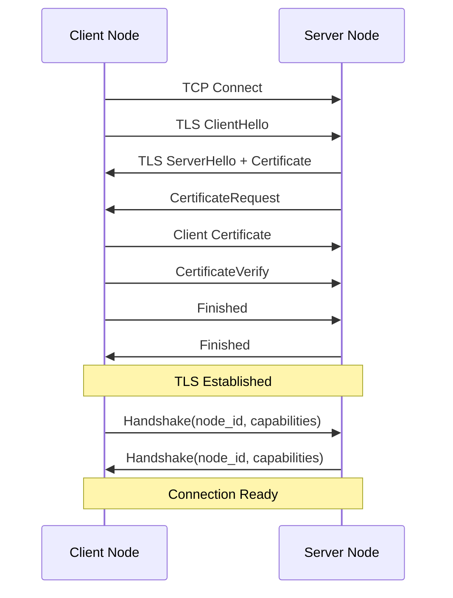
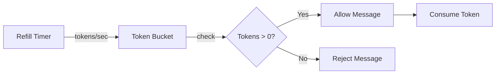

# TCP Transport

The TCP transport layer provides reliable, secure node-to-node communication
for the tensor_chain distributed system. It implements connection pooling,
TLS security, rate limiting, compression, and automatic reconnection.

## Overview

The `TcpTransport` implements the `Transport` trait, providing:

- **Connection pooling** for efficient peer communication
- **TLS encryption** with mutual authentication support
- **Rate limiting** using token bucket algorithm
- **LZ4 compression** for bandwidth efficiency
- **Automatic reconnection** with exponential backoff



## Connection Architecture

### Connection Manager

The `ConnectionManager` maintains connection pools for each peer. Each pool
can hold multiple connections for load distribution.

```rust
let config = TcpTransportConfig::new("node1", "0.0.0.0:9100".parse()?);
let transport = TcpTransport::new(config);
transport.start().await?;
```

### Connection Lifecycle



### Configuration

| Parameter | Default | Description |
| --- | --- | --- |
| `pool_size` | 2 | Connections per peer |
| `connect_timeout_ms` | 5000 | Connection timeout in milliseconds |
| `io_timeout_ms` | 30000 | Read/write timeout in milliseconds |
| `max_message_size` | 16 MB | Maximum message size in bytes |
| `keepalive` | true | Enable TCP keepalive |
| `keepalive_interval_secs` | 30 | Keepalive probe interval |
| `max_pending_messages` | 1000 | Outbound queue size per peer |
| `recv_buffer_size` | 1000 | Incoming message channel size |

## TLS Security

The transport supports four security modes to accommodate different deployment
scenarios.

### Security Modes

| Mode | TLS | mTLS | NodeId Verify | Use Case |
| --- | --- | --- | --- | --- |
| Strict | Yes | Yes | Yes | Production deployments |
| Permissive | Yes | No | No | Gradual TLS rollout |
| Development | No | No | No | Local testing only |
| Legacy | No | No | No | Migration from older versions |

### NodeId Verification

NodeId verification ensures the peer's identity matches their TLS certificate:

| Mode | Description |
| --- | --- |
| None | Trust NodeId from handshake (testing only) |
| CommonName | NodeId must match certificate CN |
| SubjectAltName | NodeId must match a SAN DNS entry |

### TLS Configuration

```toml
[tls]
cert_path = "/etc/neumann/node.crt"
key_path = "/etc/neumann/node.key"
ca_cert_path = "/etc/neumann/ca.crt"
require_client_auth = true
node_id_verification = "CommonName"
```

### mTLS Handshake



## Rate Limiting

Per-peer rate limiting uses the token bucket algorithm to prevent any single
peer from overwhelming the system.

### Token Bucket Algorithm



### Configuration Presets

| Preset | Bucket Size | Refill Rate | Description |
| --- | --- | --- | --- |
| Default | 100 | 50/sec | Balanced throughput |
| Aggressive | 50 | 25/sec | Lower burst, tighter limit |
| Permissive | 200 | 100/sec | Higher throughput allowed |
| Disabled | --- | --- | No rate limiting |

### Configuration Example

```toml
[rate_limit]
enabled = true
bucket_size = 100
refill_rate = 50.0
```

## Compression

Frame-level LZ4 compression reduces bandwidth usage for larger messages.
Compression is negotiated during the handshake.

### Frame Format

```text
+--------+--------+------------+
| Length | Flags  | Payload    |
| 4 bytes| 1 byte | N bytes    |
+--------+--------+------------+

Flags byte:
  bit 0: 1 = LZ4 compressed, 0 = uncompressed
  bits 1-7: reserved (must be 0)
```

### Configuration

| Parameter | Default | Description |
| --- | --- | --- |
| `enabled` | true | Enable compression |
| `method` | Lz4 | Compression algorithm |
| `min_size` | 256 | Minimum payload size to compress |

Messages smaller than `min_size` are sent uncompressed to avoid overhead.

```toml
[compression]
enabled = true
method = "Lz4"
min_size = 256
```

## Reconnection

Automatic reconnection uses exponential backoff with jitter to recover from
transient failures without overwhelming the network.

### Backoff Calculation

```text
backoff = min(initial * multiplier^attempt, max_backoff)
jitter = backoff * random(-jitter_factor, +jitter_factor)
final_delay = backoff + jitter
```

### Configuration

| Parameter | Default | Description |
| --- | --- | --- |
| `enabled` | true | Enable auto-reconnection |
| `initial_backoff_ms` | 100 | Initial backoff delay |
| `max_backoff_ms` | 30000 | Maximum backoff delay |
| `multiplier` | 2.0 | Exponential multiplier |
| `max_attempts` | None | Max retries (None = infinite) |
| `jitter` | 0.1 | Jitter factor (0.0 to 1.0) |

### Backoff Example

| Attempt | Base Delay | With 10% Jitter |
| --- | --- | --- |
| 0 | 100ms | 90-110ms |
| 1 | 200ms | 180-220ms |
| 2 | 400ms | 360-440ms |
| 3 | 800ms | 720-880ms |
| ... | ... | ... |
| 8+ | 30000ms | 27000-33000ms |

## Metrics

The transport exposes statistics through `TransportStats`:

| Metric | Description |
| --- | --- |
| `messages_sent` | Total messages sent |
| `messages_received` | Total messages received |
| `bytes_sent` | Total bytes sent |
| `bytes_received` | Total bytes received |
| `peer_count` | Number of connected peers |
| `connection_count` | Total active connections |

```rust
let stats = transport.stats();
println!("Messages sent: {}", stats.messages_sent);
println!("Connected peers: {}", stats.peer_count);
```

## Error Handling

| Error | Cause | Recovery |
| --- | --- | --- |
| `Timeout` | Operation exceeded timeout | Retry with backoff |
| `PeerNotFound` | No pool for peer | Establish connection first |
| `HandshakeFailed` | Protocol mismatch or bad cert | Check configuration |
| `TlsRequired` | TLS needed but not configured | Configure TLS |
| `MtlsRequired` | mTLS needed but not enabled | Enable client auth |
| `RateLimited` | Token bucket exhausted | Wait for refill |
| `Compression` | Decompression failed | Check for data corruption |

## Usage Example

```rust
use tensor_chain::tcp::{
    TcpTransport, TcpTransportConfig, TlsConfig, SecurityMode,
    RateLimitConfig, CompressionConfig,
};

// Create secure production configuration
let tls = TlsConfig::new_secure(
    "/etc/neumann/node.crt",
    "/etc/neumann/node.key",
    "/etc/neumann/ca.crt",
);

let config = TcpTransportConfig::new("node1", "0.0.0.0:9100".parse()?)
    .with_tls(tls)
    .with_security_mode(SecurityMode::Strict)
    .with_rate_limit(RateLimitConfig::default())
    .with_compression(CompressionConfig::default())
    .with_pool_size(4);

// Validate security before starting
config.validate_security()?;

// Start transport
let transport = TcpTransport::new(config);
transport.start().await?;

// Connect to peer
transport.connect(&PeerConfig {
    node_id: "node2".to_string(),
    address: "10.0.1.2:9100".to_string(),
}).await?;

// Send message
transport.send(&"node2".to_string(), Message::Ping { term: 1 }).await?;

// Receive messages
let (from, msg) = transport.recv().await?;
```

## Source Reference

- `tensor_chain/src/tcp/config.rs` - Configuration types
- `tensor_chain/src/tcp/transport.rs` - Transport implementation
- `tensor_chain/src/tcp/tls.rs` - TLS wrapper
- `tensor_chain/src/tcp/rate_limit.rs` - Token bucket rate limiter
- `tensor_chain/src/tcp/compression.rs` - LZ4 compression
- `tensor_chain/src/tcp/framing.rs` - Wire protocol codec
- `tensor_chain/src/tcp/connection.rs` - Connection pool
