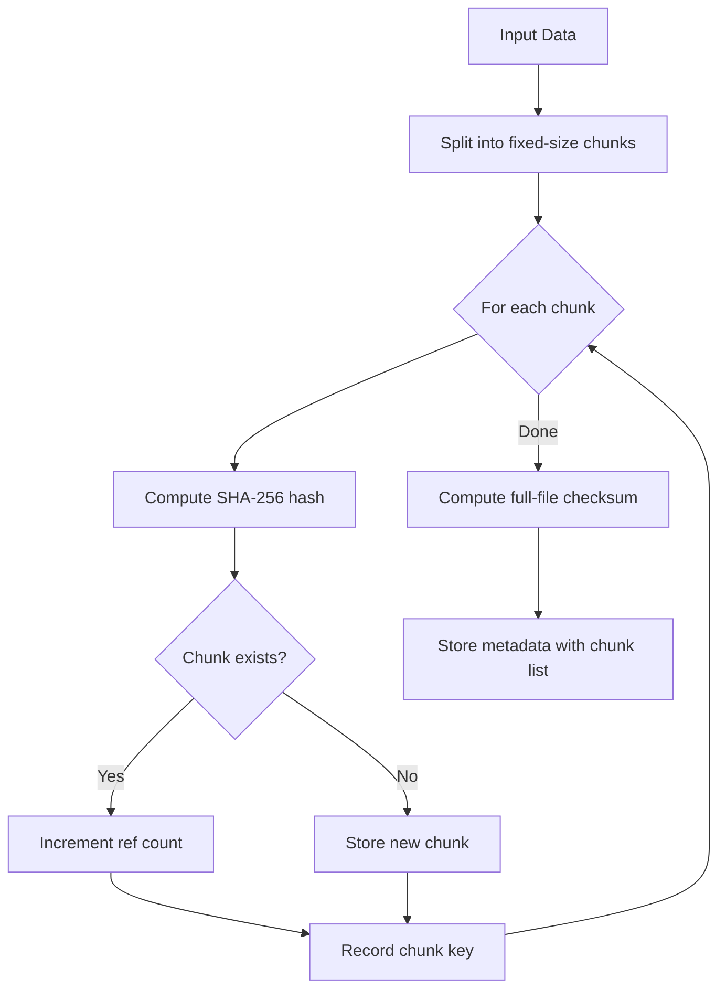
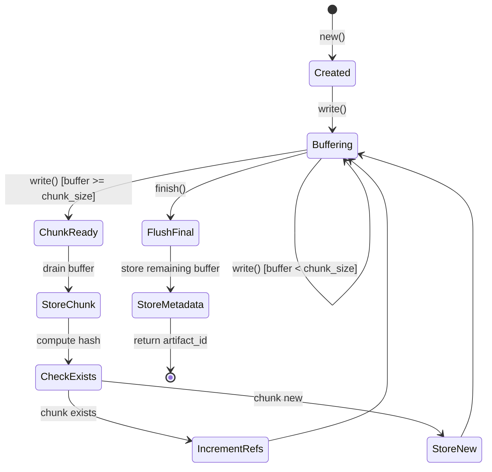
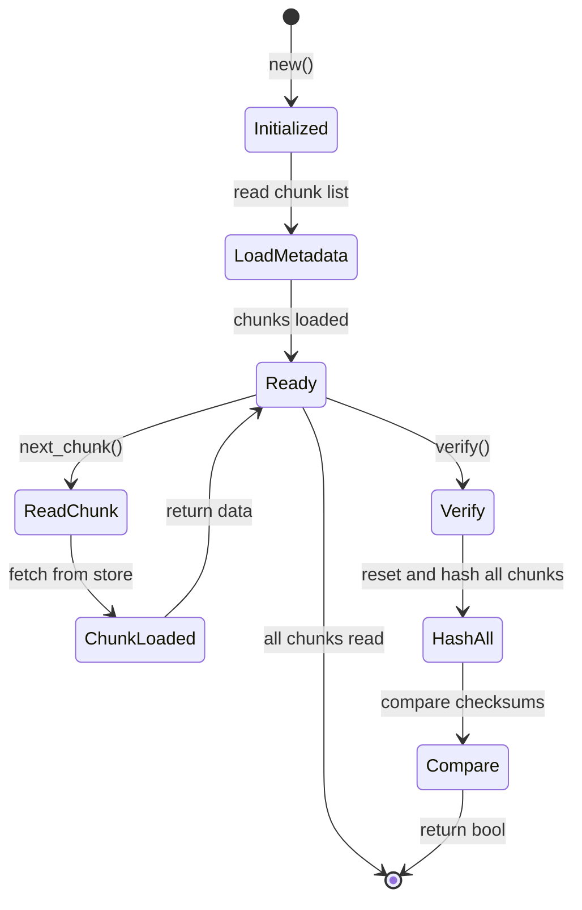
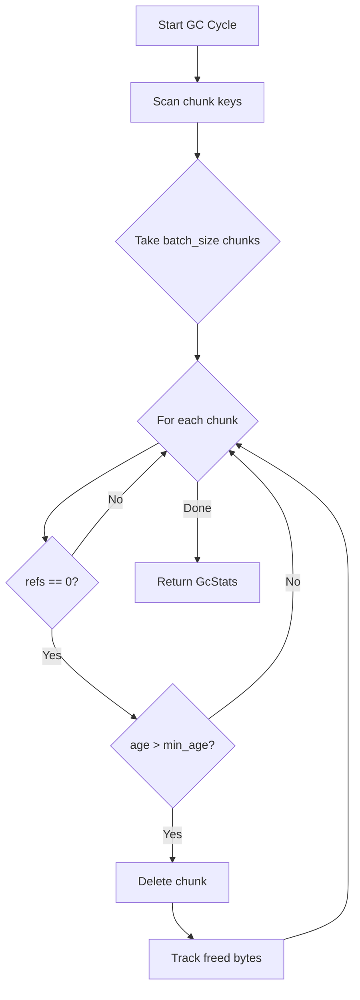
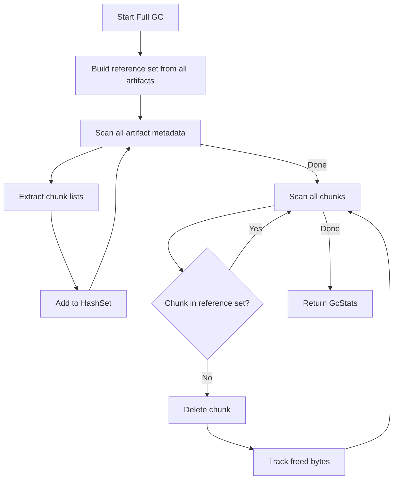
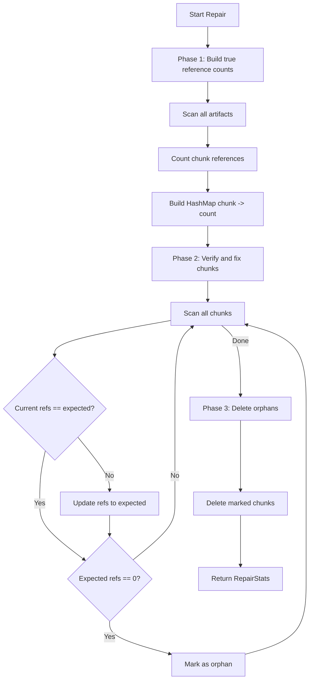

# Tensor Blob Architecture

S3-style object storage for large artifacts using content-addressable chunked storage with tensor-native metadata. Artifacts are split into SHA-256 hashed chunks for automatic deduplication, with metadata stored in the tensor store for integration with graph, relational, and vector queries.

All I/O operations are async via Tokio. Large files are streamed through `BlobWriter` and `BlobReader` without loading entirely into memory. Background garbage collection removes orphaned chunks automatically.

## Key Types

### Core Types

| Type | Description |
|------|-------------|
| `BlobStore` | Main API for storing, retrieving, and managing artifacts |
| `BlobConfig` | Configuration for chunk size, GC intervals, and limits |
| `BlobWriter` | Streaming upload with incremental chunking and hash computation |
| `BlobReader` | Streaming download with chunk-by-chunk reads and verification |
| `Chunk` | Content-addressed data segment with SHA-256 hash |
| `Chunker` | Splits data into fixed-size content-addressable chunks |
| `StreamingHasher` | Incremental SHA-256 computation for large files |
| `GarbageCollector` | Background task for cleaning orphaned chunks |

### Metadata Types

| Type | Description |
|------|-------------|
| `ArtifactMetadata` | Full metadata including filename, size, checksum, links, tags |
| `PutOptions` | Upload options: content type, creator, links, tags, custom metadata, embedding |
| `MetadataUpdates` | Partial updates for filename, content type, custom fields |
| `SimilarArtifact` | Search result with artifact ID, filename, and similarity score |
| `WriteState` | Internal state tracking artifact metadata during streaming upload |

### Statistics Types

| Type | Description |
|------|-------------|
| `BlobStats` | Storage statistics: artifact count, chunk count, dedup ratio, orphaned chunks |
| `GcStats` | GC results: chunks deleted, bytes freed |
| `RepairStats` | Repair results: artifacts checked, chunks verified, refs fixed, orphans deleted |

### Error Types

| Error | Description |
|-------|-------------|
| `NotFound` | Artifact does not exist |
| `ChunkMissing` | Referenced chunk not found in storage |
| `ChecksumMismatch` | Data corruption detected during verification |
| `EmptyData` | Cannot store empty artifact |
| `InvalidConfig` | Invalid configuration parameter (e.g., zero chunk size) |
| `InvalidArtifactId` | Malformed artifact ID format |
| `StorageError` | Underlying tensor store error |
| `GraphError` | Graph engine integration error (feature-gated) |
| `VectorError` | Vector engine integration error (feature-gated) |
| `IoError` | I/O error during streaming operations |
| `GcError` | Garbage collection failure |
| `AlreadyExists` | Artifact with given ID already exists |
| `DimensionMismatch` | Embedding dimension mismatch |

## Architecture Diagram

```
+--------------------------------------------------+
|                BlobStore (Public API)            |
|   - put, get, delete, exists                     |
|   - metadata, update_metadata                    |
|   - link, unlink, tag, untag                     |
|   - verify, repair, gc, full_gc                  |
+--------------------------------------------------+
            |              |              |
    +-------+      +-------+      +-------+
    |              |              |
+--------+   +-----------+   +----------+
| Writer |   |  Reader   |   |    GC    |
| Stream |   |  Stream   |   | (Tokio)  |
+--------+   +-----------+   +----------+
    |              |              |
    +-------+------+------+-------+
            |
    +------------------+
    |     Chunker      |
    |   SHA-256 hash   |
    +------------------+
            |
    +------------------+
    |   tensor_store   |
    | _blob:meta:*     |
    | _blob:chunk:*    |
    +------------------+
```

## Storage Format

### Artifact Metadata

Stored at `_blob:meta:{artifact_id}`:

| Field | Type | Description |
|-------|------|-------------|
| `_type` | String | Always `"blob_artifact"` |
| `_id` | String | Unique artifact identifier (UUID v4) |
| `_filename` | String | Original filename |
| `_content_type` | String | MIME type |
| `_size` | Int | Total size in bytes |
| `_checksum` | String | SHA-256 hash of full content (`sha256:{hex}`) |
| `_chunk_size` | Int | Size of each chunk (except possibly last) |
| `_chunk_count` | Int | Number of chunks |
| `_chunks` | Pointers | Ordered list of chunk keys |
| `_created` | Int | Unix timestamp (seconds) |
| `_modified` | Int | Unix timestamp (seconds) |
| `_created_by` | String | Creator identity |
| `_linked_to` | Pointers | Linked entity IDs |
| `_tags` | Pointers | Applied tags (prefixed with `tag:`) |
| `_meta:*` | String | Custom metadata fields |
| `_embedding` | Vector/Sparse | Optional embedding (sparse if >50% zeros) |
| `_embedded_model` | String | Embedding model name |

### Chunk Data

Stored at `_blob:chunk:sha256:{hex}`:

| Field | Type | Description |
|-------|------|-------------|
| `_type` | String | Always `"blob_chunk"` |
| `_data` | Bytes | Raw chunk data |
| `_size` | Int | Chunk size in bytes |
| `_refs` | Int | Reference count for deduplication |
| `_created` | Int | Unix timestamp (seconds) |

## Content-Addressable Chunking Algorithm

The chunker uses a fixed-size chunking strategy with SHA-256 content addressing:



### Chunker Implementation

```rust
// Chunker splits data into fixed-size segments
pub struct Chunker {
    chunk_size: usize,  // Default: 1MB (1,048,576 bytes)
}

impl Chunker {
    // Split data into chunks using Rust's chunks() iterator
    pub fn chunk<'a>(&'a self, data: &'a [u8]) -> impl Iterator<Item = Chunk> + 'a {
        data.chunks(self.chunk_size).map(|chunk_data| {
            let hash = compute_hash(chunk_data);
            Chunk {
                hash,
                data: chunk_data.to_vec(),
                size: chunk_data.len(),
            }
        })
    }

    // Count chunks without allocating (useful for progress estimation)
    pub fn chunk_count(&self, data_len: usize) -> usize {
        if data_len == 0 { 0 } else { data_len.div_ceil(self.chunk_size) }
    }
}
```

### Chunk Key Format

Chunk keys follow a deterministic format for content addressing:

```
_blob:chunk:sha256:{64_hex_chars}
```

Example:
```
_blob:chunk:sha256:b94d27b9934d3e08a52e52d7da7dabfac484efe37a5380ee9088f7ace2efcde9
```

### SHA-256 Checksum Computation

The system uses the `sha2` crate for cryptographic hashing:

```rust
use sha2::{Digest, Sha256};

// Single-shot hash for chunk content
pub fn compute_hash(data: &[u8]) -> String {
    let mut hasher = Sha256::new();
    hasher.update(data);
    let result = hasher.finalize();
    format!("sha256:{:x}", result)  // Lowercase hex encoding
}

// Streaming hash for large files (used by BlobWriter)
pub struct StreamingHasher {
    hasher: Sha256,
}

impl StreamingHasher {
    pub fn new() -> Self {
        Self { hasher: Sha256::new() }
    }

    pub fn update(&mut self, data: &[u8]) {
        self.hasher.update(data);
    }

    pub fn finalize(self) -> String {
        let result = self.hasher.finalize();
        format!("sha256:{:x}", result)
    }
}

// Multi-segment hash (for verification)
pub fn compute_hash_streaming<'a>(segments: impl Iterator<Item = &'a [u8]>) -> String {
    let mut hasher = Sha256::new();
    for segment in segments {
        hasher.update(segment);
    }
    let result = hasher.finalize();
    format!("sha256:{:x}", result)
}
```

## Content-Addressable Deduplication

Chunks are keyed by SHA-256 hash, enabling automatic deduplication:

1. When writing data, the chunker splits it into fixed-size segments (default 1MB)
2. Each chunk is hashed with SHA-256 to produce a unique key
3. If the chunk already exists, only the reference count is incremented
4. Identical data across different artifacts shares the same physical chunks

```rust
let data = vec![0u8; 10_000];

// Store same data twice
blob.put("file1.bin", &data, PutOptions::default()).await?;
blob.put("file2.bin", &data, PutOptions::default()).await?;

let stats = blob.stats().await?;
// stats.chunk_count = 1 (deduplicated)
// stats.dedup_ratio > 0.0
```

### Deduplication Ratio Calculation

```rust
let dedup_ratio = if total_bytes > 0 {
    1.0 - (unique_bytes as f64 / total_bytes as f64)
} else {
    0.0
};
```

A ratio of 0.5 means 50% space savings through deduplication.

## Streaming Upload State Machine

The `BlobWriter` manages incremental uploads with proper buffering:



### BlobWriter Internal State

```rust
pub struct BlobWriter {
    store: TensorStore,
    chunker: Chunker,
    state: WriteState,      // Artifact metadata (filename, content_type, etc.)
    chunks: Vec<String>,    // Ordered list of chunk keys
    total_size: usize,      // Running total of bytes written
    hasher: StreamingHasher, // Incremental full-file hash
    buffer: Vec<u8>,        // Incomplete chunk buffer
}
```

### Write Operation Flow

```rust
pub async fn write(&mut self, data: &[u8]) -> Result<()> {
    if data.is_empty() { return Ok(()); }

    // 1. Update full-file hash (computed independently of chunking)
    self.hasher.update(data);
    self.total_size += data.len();

    // 2. Add to internal buffer
    self.buffer.extend_from_slice(data);

    // 3. Process complete chunks (may be multiple if large write)
    while self.buffer.len() >= self.chunker.chunk_size() {
        let chunk_data: Vec<u8> = self.buffer.drain(..self.chunker.chunk_size()).collect();
        let chunk = Chunk::new(chunk_data);
        self.store_chunk(chunk).await?;
    }

    Ok(())
}
```

### Finish Operation

```rust
pub async fn finish(mut self) -> Result<String> {
    // 1. Flush remaining buffer as final (possibly smaller) chunk
    if !self.buffer.is_empty() {
        let chunk = Chunk::new(std::mem::take(&mut self.buffer));
        self.store_chunk(chunk).await?;
    }

    // 2. Finalize full-file checksum
    let checksum = self.hasher.finalize();

    // 3. Build and store metadata tensor
    let mut tensor = TensorData::new();
    tensor.set("_type", "blob_artifact");
    tensor.set("_id", self.state.artifact_id.clone());
    tensor.set("_checksum", checksum);
    tensor.set("_chunks", TensorValue::Pointers(self.chunks));
    // ... additional fields ...

    let meta_key = format!("_blob:meta:{}", self.state.artifact_id);
    self.store.put(&meta_key, tensor)?;

    Ok(self.state.artifact_id)
}
```

## Streaming Download State Machine

The `BlobReader` manages incremental downloads with chunk-level iteration:



### BlobReader Internal State

```rust
pub struct BlobReader {
    store: TensorStore,
    chunks: Vec<String>,       // Ordered list of chunk keys
    current_chunk: usize,      // Index of next chunk to read
    current_data: Option<Vec<u8>>, // Cached current chunk for read()
    current_offset: usize,     // Offset within current_data
    total_size: usize,         // Total artifact size
    bytes_read: usize,         // Bytes read so far
    checksum: String,          // Expected checksum for verification
}
```

### Read Modes

```rust
// Mode 1: Chunk-at-a-time (best for processing in batches)
while let Some(chunk) = reader.next_chunk().await? {
    process_chunk(&chunk);
}

// Mode 2: Read all into memory (convenient for small files)
let data = reader.read_all().await?;

// Mode 3: Buffer-based reading (for streaming to other APIs)
let mut buf = vec![0u8; 4096];
loop {
    let n = reader.read(&mut buf).await?;
    if n == 0 { break; }
    output.write_all(&buf[..n])?;
}
```

## Garbage Collection Reference Counting

The GC system uses reference counting with two operational modes:

### Reference Count Management

```rust
// When storing a chunk (in BlobWriter::store_chunk)
if self.store.exists(&chunk_key) {
    // Chunk already exists - just increment ref count
    increment_chunk_refs(&self.store, &chunk_key)?;
} else {
    // New chunk - store with ref count of 1
    let mut tensor = TensorData::new();
    tensor.set("_refs", TensorValue::Scalar(ScalarValue::Int(1)));
    // ... store chunk data ...
}

// When deleting an artifact
pub fn delete_artifact(store: &TensorStore, artifact_id: &str) -> Result<()> {
    let tensor = store.get(&meta_key)?;
    if let Some(chunks) = get_pointers(&tensor, "_chunks") {
        for chunk_key in chunks {
            decrement_chunk_refs(store, &chunk_key)?;  // Saturating at 0
        }
    }
    store.delete(&meta_key)?;
    Ok(())
}
```

### Incremental GC (`gc()`)

Processes a limited batch of chunks per cycle, respecting age requirements:



```rust
pub async fn gc_cycle(&self) -> GcStats {
    let mut deleted = 0;
    let mut freed_bytes = 0;

    let now = current_timestamp();
    let min_created = now.saturating_sub(self.config.min_age.as_secs());

    let chunk_keys = self.store.scan("_blob:chunk:");

    for chunk_key in chunk_keys.into_iter().take(self.config.batch_size) {
        if let Ok(tensor) = self.store.get(&chunk_key) {
            let refs = get_int(&tensor, "_refs").unwrap_or(0);
            let created = get_int(&tensor, "_created").unwrap_or(0) as u64;

            // Zero refs AND old enough
            if refs == 0 && created < min_created {
                let size = get_int(&tensor, "_size").unwrap_or(0) as usize;
                if self.store.delete(&chunk_key).is_ok() {
                    deleted += 1;
                    freed_bytes += size;
                }
            }
        }
    }

    GcStats { deleted, freed_bytes }
}
```

### Full GC (`full_gc()`)

Rebuilds reference counts from scratch and deletes all unreferenced chunks:



```rust
pub async fn full_gc(&self) -> Result<GcStats> {
    // Phase 1: Build reference set from all artifacts
    let mut referenced: HashSet<String> = HashSet::new();
    for meta_key in self.store.scan("_blob:meta:") {
        if let Ok(tensor) = self.store.get(&meta_key) {
            if let Some(chunks) = get_pointers(&tensor, "_chunks") {
                referenced.extend(chunks);
            }
        }
    }

    // Phase 2: Delete unreferenced chunks (ignores age requirement)
    let mut deleted = 0;
    let mut freed_bytes = 0;
    for chunk_key in self.store.scan("_blob:chunk:") {
        if !referenced.contains(&chunk_key) {
            if let Ok(tensor) = self.store.get(&chunk_key) {
                let size = get_int(&tensor, "_size").unwrap_or(0) as usize;
                if self.store.delete(&chunk_key).is_ok() {
                    deleted += 1;
                    freed_bytes += size;
                }
            }
        }
    }

    Ok(GcStats { deleted, freed_bytes })
}
```

### Background GC Task

```rust
pub fn start(self: Arc<Self>) -> JoinHandle<()> {
    let gc = Arc::clone(&self);
    tokio::spawn(async move {
        gc.run().await;
    })
}

async fn run(&self) {
    let mut interval = interval(self.config.check_interval);
    let mut shutdown_rx = self.shutdown_tx.subscribe();

    loop {
        tokio::select! {
            _ = interval.tick() => {
                let _ = self.gc_cycle().await;
            }
            _ = shutdown_rx.recv() => {
                break;
            }
        }
    }
}
```

## Integrity Repair Algorithm

The repair operation fixes reference count inconsistencies and removes orphans:



### Repair Implementation

```rust
pub async fn repair(store: &TensorStore) -> Result<RepairStats> {
    let mut stats = RepairStats::default();

    // Phase 1: Build true reference counts from all artifacts
    let mut true_refs: HashMap<String, i64> = HashMap::new();
    for meta_key in store.scan("_blob:meta:") {
        stats.artifacts_checked += 1;
        if let Ok(tensor) = store.get(&meta_key) {
            if let Some(chunks) = get_pointers(&tensor, "_chunks") {
                for chunk_key in chunks {
                    *true_refs.entry(chunk_key).or_insert(0) += 1;
                }
            }
        }
    }

    // Phase 2: Verify and fix reference counts
    let mut orphan_keys = Vec::new();
    for chunk_key in store.scan("_blob:chunk:") {
        stats.chunks_verified += 1;
        if let Ok(mut tensor) = store.get(&chunk_key) {
            let current_refs = get_int(&tensor, "_refs").unwrap_or(0);
            let expected_refs = true_refs.get(&chunk_key).copied().unwrap_or(0);

            if current_refs != expected_refs {
                tensor.set("_refs", TensorValue::Scalar(ScalarValue::Int(expected_refs)));
                store.put(&chunk_key, tensor)?;
                stats.refs_fixed += 1;
            }

            if expected_refs == 0 {
                orphan_keys.push(chunk_key);
            }
        }
    }

    // Phase 3: Delete orphans
    for orphan_key in orphan_keys {
        if store.delete(&orphan_key).is_ok() {
            stats.orphans_deleted += 1;
        }
    }

    Ok(stats)
}
```

### Artifact Verification

```rust
pub async fn verify_artifact(store: &TensorStore, artifact_id: &str) -> Result<bool> {
    let meta_key = format!("_blob:meta:{artifact_id}");
    let tensor = store.get(&meta_key)?;

    let expected_checksum = get_string(&tensor, "_checksum")?;
    let chunks = get_pointers(&tensor, "_chunks")?;

    // Recompute checksum by hashing all chunks in order
    let mut hasher = StreamingHasher::new();
    for chunk_key in &chunks {
        let chunk_tensor = store.get(chunk_key)?;
        let chunk_data = get_bytes(&chunk_tensor, "_data")?;
        hasher.update(&chunk_data);
    }

    let actual_checksum = hasher.finalize();
    Ok(actual_checksum == expected_checksum)
}

// Verify individual chunk integrity
pub fn verify_chunk(store: &TensorStore, chunk_key: &str) -> Result<bool> {
    let expected_hash = chunk_key.strip_prefix("_blob:chunk:")?;
    let tensor = store.get(chunk_key)?;
    let data = get_bytes(&tensor, "_data")?;
    let actual_hash = compute_hash(&data);
    Ok(actual_hash == expected_hash)
}
```

## Usage Examples

### Basic Storage

```rust
use tensor_blob::{BlobStore, BlobConfig, PutOptions};
use tensor_store::TensorStore;

let store = TensorStore::new();
let blob = BlobStore::new(store, BlobConfig::default()).await?;

// Store an artifact
let artifact_id = blob.put(
    "report.pdf",
    &file_bytes,
    PutOptions::new()
        .with_created_by("user:alice")
        .with_tag("quarterly")
        .with_link("task:123"),
).await?;

// Retrieve it
let data = blob.get(&artifact_id).await?;

// Get metadata
let meta = blob.metadata(&artifact_id).await?;
```

### Streaming API

```rust
// Streaming upload (memory-efficient for large files)
let mut writer = blob.writer("large_file.bin", PutOptions::default()).await?;
for chunk in file_chunks {
    writer.write(&chunk).await?;
}
let artifact_id = writer.finish().await?;

// Streaming download
let mut reader = blob.reader(&artifact_id).await?;
while let Some(chunk) = reader.next_chunk().await? {
    process_chunk(&chunk);
}

// Verify integrity after download
let mut reader = blob.reader(&artifact_id).await?;
let valid = reader.verify().await?;
```

### Entity Linking and Tagging

```rust
// Link artifact to entities
blob.link(&artifact_id, "user:alice").await?;
blob.link(&artifact_id, "task:123").await?;

// Find artifacts linked to an entity
let artifacts = blob.artifacts_for("user:alice").await?;

// Add tags
blob.tag(&artifact_id, "important").await?;

// Find artifacts by tag
let important_files = blob.by_tag("important").await?;
```

### Semantic Search (with `vector` feature)

```rust
// Set embedding for artifact
blob.set_embedding(&artifact_id, embedding, "text-embedding-3-small").await?;

// Find similar artifacts
let similar = blob.similar(&artifact_id, 10).await?;
```

## Configuration Options

| Option | Default | Description |
|--------|---------|-------------|
| `chunk_size` | 1 MB (1,048,576 bytes) | Size of each chunk in bytes |
| `max_artifact_size` | None (unlimited) | Maximum artifact size limit |
| `max_artifacts` | None (unlimited) | Maximum number of artifacts |
| `gc_interval` | 5 minutes (300s) | Background GC check frequency |
| `gc_batch_size` | 100 | Chunks processed per GC cycle |
| `gc_min_age` | 1 minute (60s) | Minimum age before GC eligible |
| `default_content_type` | `application/octet-stream` | Default MIME type |

```rust
let config = BlobConfig::new()
    .with_chunk_size(1024 * 1024)
    .with_gc_interval(Duration::from_secs(300))
    .with_gc_batch_size(100)
    .with_gc_min_age(Duration::from_secs(3600))
    .with_max_artifact_size(100 * 1024 * 1024);
```

### Configuration Validation

```rust
// Configuration is validated on BlobStore::new()
pub fn validate(&self) -> Result<()> {
    if self.chunk_size == 0 {
        return Err(BlobError::InvalidConfig("chunk_size must be > 0"));
    }
    if self.gc_batch_size == 0 {
        return Err(BlobError::InvalidConfig("gc_batch_size must be > 0"));
    }
    Ok(())
}
```

## Garbage Collection

Two GC modes are available:

| Method | Description | Age Requirement | Reference Source |
|--------|-------------|-----------------|------------------|
| `gc()` | Incremental GC: processes `batch_size` chunks per cycle | Respects `min_age` | Uses stored `_refs` field |
| `full_gc()` | Full GC: recounts all references from artifacts | Ignores age | Rebuilds from artifact metadata |

Background GC runs automatically when started:

```rust
blob.start().await?;     // Start background GC
// ... use blob store ...
blob.shutdown().await?;  // Graceful shutdown (waits for current cycle)
```

## BlobStore API

| Method | Description |
|--------|-------------|
| `new(store, config)` | Create with configuration (validates config) |
| `start()` | Start background GC task |
| `shutdown()` | Graceful shutdown (sends signal and awaits task) |
| `store()` | Get reference to underlying TensorStore |
| `put(filename, data, options)` | Store bytes, return artifact ID |
| `get(artifact_id)` | Retrieve all bytes |
| `delete(artifact_id)` | Delete artifact and decrement chunk refs |
| `exists(artifact_id)` | Check if artifact exists |
| `writer(filename, options)` | Create streaming upload writer |
| `reader(artifact_id)` | Create streaming download reader |
| `metadata(artifact_id)` | Get artifact metadata |
| `update_metadata(artifact_id, updates)` | Apply metadata updates |
| `set_meta(artifact_id, key, value)` | Set custom metadata field |
| `get_meta(artifact_id, key)` | Get custom metadata field |
| `link(artifact_id, entity)` | Link to entity |
| `unlink(artifact_id, entity)` | Remove link |
| `links(artifact_id)` | Get linked entities |
| `artifacts_for(entity)` | Find artifacts by linked entity |
| `tag(artifact_id, tag)` | Add tag |
| `untag(artifact_id, tag)` | Remove tag |
| `by_tag(tag)` | Find artifacts by tag |
| `list(prefix)` | List artifacts with optional prefix filter |
| `by_content_type(type)` | Find by content type |
| `by_creator(creator)` | Find by creator |
| `verify(artifact_id)` | Verify checksum integrity |
| `repair()` | Repair broken references |
| `gc()` | Run incremental GC |
| `full_gc()` | Run full GC |
| `stats()` | Get storage statistics |
| `set_embedding(id, vec, model)` | Set artifact embedding (feature-gated) |
| `similar(id, k)` | Find k similar artifacts (feature-gated) |
| `search_by_embedding(vec, k)` | Search by embedding vector (feature-gated) |

## BlobWriter API

| Method | Description |
|--------|-------------|
| `write(data)` | Write chunk of data (buffers until chunk_size reached) |
| `finish()` | Finalize, flush buffer, store metadata, return artifact ID |
| `bytes_written()` | Total bytes written so far |
| `chunks_written()` | Chunks stored so far (not including buffered data) |

## BlobReader API

| Method | Description |
|--------|-------------|
| `next_chunk()` | Read next chunk, returns `None` when done |
| `read_all()` | Read all remaining data into buffer |
| `read(buf)` | Read into buffer, returns bytes read (for streaming) |
| `verify()` | Verify checksum against stored value (resets read position) |
| `checksum()` | Get expected checksum |
| `total_size()` | Total artifact size |
| `bytes_read()` | Bytes read so far |
| `chunk_count()` | Number of chunks |

## Shell Commands

```
BLOB PUT 'filename' 'data'              Store inline data
BLOB PUT 'filename' FROM 'path'         Store from file path
BLOB GET 'artifact_id'                  Retrieve data
BLOB GET 'artifact_id' TO 'path'        Write to file
BLOB DELETE 'artifact_id'               Delete artifact
BLOB INFO 'artifact_id'                 Show metadata
BLOB VERIFY 'artifact_id'               Verify integrity

BLOB LINK 'artifact_id' TO 'entity'     Link to entity
BLOB UNLINK 'artifact_id' FROM 'entity' Remove link
BLOB TAG 'artifact_id' 'tag'            Add tag
BLOB UNTAG 'artifact_id' 'tag'          Remove tag

BLOB META SET 'artifact_id' 'key' 'value'  Set custom metadata
BLOB META GET 'artifact_id' 'key'          Get custom metadata

BLOB GC                                 Run incremental GC
BLOB GC FULL                            Full garbage collection
BLOB REPAIR                             Repair broken references
BLOB STATS                              Show storage statistics

BLOBS                                   List all artifacts
BLOBS FOR 'entity'                      Find by linked entity
BLOBS BY TAG 'tag'                      Find by tag
BLOBS WHERE TYPE = 'content/type'       Find by content type
BLOBS SIMILAR TO 'artifact_id' LIMIT n  Find similar (requires embeddings)
```

## Edge Cases and Gotchas

### Empty Data

```rust
// Empty data is rejected
let result = blob.put("empty.txt", b"", PutOptions::default()).await;
assert!(matches!(result, Err(BlobError::EmptyData)));
```

### Size Limits

```rust
// Exceeding max_artifact_size returns InvalidConfig error
let config = BlobConfig::new().with_max_artifact_size(1024);
let blob = BlobStore::new(store, config).await?;

let result = blob.put("large.bin", &vec![0u8; 2048], PutOptions::default()).await;
// Returns Err(BlobError::InvalidConfig("data size 2048 exceeds max 1024"))
```

### Concurrent Deduplication

The reference counting is not fully atomic. If two writers simultaneously store the same chunk:
- Both may check `exists()` and find it missing
- Both may store the chunk with `refs = 1`
- One write will overwrite the other
- Result: ref count may be 1 instead of 2

**Mitigation**: For high-concurrency scenarios, use `full_gc()` periodically to rebuild accurate reference counts.

### GC Timing

- Incremental GC respects `min_age` to avoid deleting chunks from in-progress uploads
- A writer that takes longer than `min_age` to complete may have chunks collected
- **Recommendation**: Set `gc_min_age` longer than your maximum expected upload time

### Checksum vs Chunk Hash

- **Checksum** (`_checksum`): SHA-256 of the entire file content
- **Chunk hash** (in key): SHA-256 of individual chunk data
- These are different values and cannot be compared directly

### Sparse Embedding Detection

```rust
// Embeddings with >50% zeros are stored in sparse format
pub(crate) fn should_use_sparse(vector: &[f32]) -> bool {
    if vector.is_empty() { return false; }
    let nnz = vector.iter().filter(|&&v| v.abs() > 1e-6).count();
    nnz * 2 <= vector.len()  // Use sparse if nnz <= 50%
}
```

## Performance Tips and Best Practices

### Chunk Size Selection

| Chunk Size | Best For | Trade-offs |
|------------|----------|------------|
| 256 KB | Many small files, high dedup potential | More metadata overhead |
| 1 MB (default) | General purpose | Good balance |
| 4 MB | Large media files, sequential access | Less dedup, fewer chunks |

```rust
// Benchmark different chunk sizes for your workload
let config = BlobConfig::new().with_chunk_size(512 * 1024); // 512KB
```

### Streaming for Large Files

```rust
// Bad: Loads entire file into memory
let data = std::fs::read("large_file.bin")?;
blob.put("large_file.bin", &data, PutOptions::default()).await?;

// Good: Streams file in chunks
let mut writer = blob.writer("large_file.bin", PutOptions::default()).await?;
let file = std::fs::File::open("large_file.bin")?;
let mut reader = std::io::BufReader::new(file);
let mut buffer = vec![0u8; 64 * 1024]; // 64KB read buffer
loop {
    let n = reader.read(&mut buffer)?;
    if n == 0 { break; }
    writer.write(&buffer[..n]).await?;
}
let artifact_id = writer.finish().await?;
```

### GC Tuning

```rust
// High-throughput: More aggressive GC
let config = BlobConfig::new()
    .with_gc_interval(Duration::from_secs(60))   // Check every minute
    .with_gc_batch_size(500)                      // Process more per cycle
    .with_gc_min_age(Duration::from_secs(300));   // 5 minute grace period

// Low-priority background: Less aggressive
let config = BlobConfig::new()
    .with_gc_interval(Duration::from_secs(3600)) // Check hourly
    .with_gc_batch_size(50)                       // Small batches
    .with_gc_min_age(Duration::from_secs(86400)); // 24 hour grace period
```

### Batch Operations

```rust
// For multiple related artifacts, batch metadata updates
for artifact_id in artifact_ids {
    blob.tag(&artifact_id, "batch-processed").await?;
}

// Use full_gc() after bulk deletions
for artifact_id in to_delete {
    blob.delete(&artifact_id).await?;
}
blob.full_gc().await?; // Clean up all orphans at once
```

### Verification Strategy

```rust
// Verify on read (paranoid mode)
let mut reader = blob.reader(&artifact_id).await?;
let data = reader.read_all().await?;
if !reader.verify().await? {
    return Err("Corruption detected");
}

// Periodic verification (background task)
for artifact_id in blob.list(None).await? {
    if !blob.verify(&artifact_id).await? {
        log::warn!("Corruption in artifact: {}", artifact_id);
    }
}
```

## Related Modules

| Module | Relationship |
|--------|--------------|
| `tensor_store` | Underlying key-value storage for chunks and metadata |
| `query_router` | Executes BLOB commands from parsed queries |
| `neumann_shell` | Interactive CLI for blob operations |
| `vector_engine` | Optional semantic search via embeddings |
| `graph_engine` | Optional entity linking via graph edges |

## Dependencies

| Crate | Purpose |
|-------|---------|
| `tensor_store` | Key-value storage layer |
| `tokio` | Async runtime for streaming and background GC |
| `sha2` | SHA-256 hashing for content addressing |
| `uuid` | Artifact ID generation (UUID v4) |
