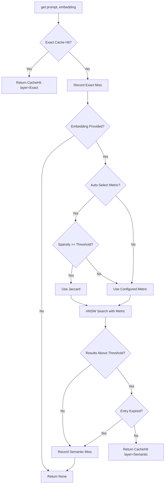
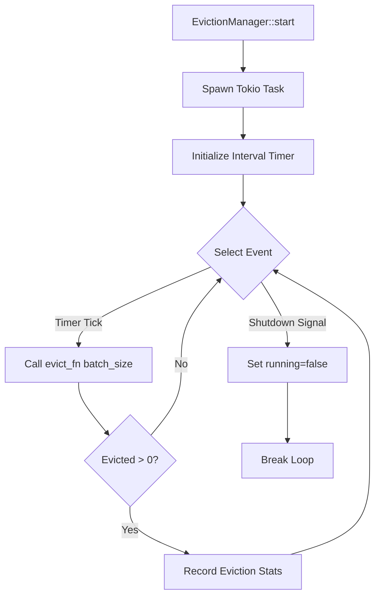

# Tensor Cache Architecture

Semantic caching for LLM responses with cost tracking and background eviction. Module 10 of Neumann.

The tensor_cache module provides multi-layer caching optimized for LLM workloads. It combines O(1) exact hash lookups with O(log n) semantic similarity search via HNSW indices. All cache entries are stored as `TensorData` in a shared `TensorStore`, following the tensor-native paradigm used by `tensor_vault` and `tensor_blob`.

## Design Principles

| Principle | Description |
|-----------|-------------|
| Multi-Layer Caching | Exact O(1), Semantic O(log n), Embedding O(1) lookups |
| Cost-Aware | Tracks tokens and estimates savings using tiktoken |
| Background Eviction | Async eviction with configurable strategies |
| TTL Expiration | Time-based entry expiration with min-heap tracking |
| Thread-Safe | All operations are concurrent via DashMap |
| Zero Allocation Lookup | Embeddings stored inline, not as pointers |
| Sparse-Aware | Automatic sparse storage for vectors with >50% zeros |

## Key Types

### Core Types

| Type | Description |
|------|-------------|
| `Cache` | Main API - multi-layer LLM response cache |
| `CacheConfig` | Configuration (capacity, TTL, eviction, metrics) |
| `CacheHit` | Successful cache lookup result |
| `CacheStats` | Thread-safe statistics with atomic counters |
| `StatsSnapshot` | Point-in-time snapshot for reporting |
| `CacheLayer` | Enum: `Exact`, `Semantic`, `Embedding` |
| `CacheError` | Error types for cache operations |

### Configuration Types

| Type | Description |
|------|-------------|
| `EvictionStrategy` | `LRU`, `LFU`, `CostBased`, `Hybrid` |
| `EvictionManager` | Background eviction task controller |
| `EvictionScorer` | Calculates eviction priority scores |
| `EvictionHandle` | Handle for controlling background eviction |
| `EvictionConfig` | Interval, batch size, and strategy settings |

### Token Counting

| Type | Description |
|------|-------------|
| `TokenCounter` | GPT-4 compatible token counting via tiktoken |
| `ModelPricing` | Predefined pricing for GPT-4, Claude 3, etc. |

### Index Types (Internal)

| Type | Description |
|------|-------------|
| `CacheIndex` | HNSW wrapper with key-to-node mapping |
| `IndexSearchResult` | Semantic search result with similarity score |

## Architecture Diagram

```
+--------------------------------------------------+
|                  Cache (Public API)               |
|   - get(prompt, embedding) -> CacheHit           |
|   - put(prompt, embedding, response, ...)        |
|   - stats(), evict(), clear()                    |
+--------------------------------------------------+
            |           |           |
    +-------+    +------+    +------+
    |            |           |
+--------+  +----------+  +-----------+
| Exact  |  | Semantic |  | Embedding |
| Cache  |  |  Cache   |  |   Cache   |
| O(1)   |  | O(log n) |  |   O(1)    |
+--------+  +----------+  +-----------+
    |            |           |
    +-------+----+----+------+
            |
    +------------------+
    |   CacheIndex     |
    |  (HNSW wrapper)  |
    +------------------+
            |
    +------------------+
    |   tensor_store   |
    |     hnsw.rs      |
    +------------------+
```

## Multi-Layer Cache Lookup Algorithm

The cache lookup algorithm is designed to maximize hit rates while minimizing latency. It follows a hierarchical approach, checking faster layers first before falling back to more expensive operations.

### Lookup Flow Diagram



### Exact Cache Lookup (O(1))

The exact cache uses a hash-based key derived from the prompt text:

```rust
// Key generation using DefaultHasher
fn exact_key(prompt: &str) -> String {
    let mut hasher = DefaultHasher::new();
    prompt.hash(&mut hasher);
    let hash = hasher.finish();
    format!("_cache:exact:{:016x}", hash)
}
```

The lookup sequence:
1. Generate hash key from prompt
2. Query `TensorStore` with key
3. Check expiration timestamp
4. Return hit or proceed to semantic lookup

### Semantic Cache Lookup (O(log n))

The semantic cache uses HNSW (Hierarchical Navigable Small World) graphs for approximate nearest neighbor search:


**Re-scoring Strategy**: The HNSW index retrieves candidates using cosine similarity, then re-scores them with the requested metric. This allows using different metrics without rebuilding the index:

```rust
// Retrieve more candidates than needed for re-scoring
let ef = (k * 3).max(10);
let candidates = index.search(query, ef);

// Re-score with specified metric
let similarity = match &embedding {
    EmbeddingStorage::Dense(dense) => {
        let stored_sparse = SparseVector::from_dense(dense);
        let raw = metric.compute(&query_sparse, &stored_sparse);
        metric.to_similarity(raw)
    }
    EmbeddingStorage::Sparse(sparse) => {
        let raw = metric.compute(&query_sparse, sparse);
        metric.to_similarity(raw)
    }
    // ...handles Delta and TensorTrain storage types
};
```

### Automatic Metric Selection

When `auto_select_metric` is enabled, the cache automatically selects the optimal distance metric based on embedding sparsity:

```rust
fn select_metric(&self, embedding: &[f32]) -> DistanceMetric {
    if !self.config.auto_select_metric {
        return self.config.distance_metric.clone();
    }

    let sparse = SparseVector::from_dense(embedding);
    if sparse.sparsity() >= self.config.sparsity_metric_threshold {
        DistanceMetric::Jaccard  // Better for sparse vectors
    } else {
        self.config.distance_metric.clone()  // Default (usually Cosine)
    }
}
```

## Cache Layers

### Exact Cache (O(1))

Hash-based lookup for identical queries. Keys are generated from prompt text using `DefaultHasher`. Stored with prefix `_cache:exact:`.

**When to use**: Repetitive queries with exact same prompts (e.g., FAQ systems, chatbots with canned responses).

### Semantic Cache (O(log n))

HNSW-based similarity search for semantically similar queries. Uses configurable distance metrics (Cosine, Jaccard, Euclidean, Angular). Stored with prefix `_cache:sem:`.

**When to use**: Natural language queries with variations (e.g., "What's the weather?" vs "How's the weather today?").

### Embedding Cache (O(1))

Stores precomputed embeddings to avoid redundant embedding API calls. Keys combine source and content hash. Stored with prefix `_cache:emb:`.

**When to use**: When embedding computation is expensive and the same content is embedded multiple times.

## Storage Format

Cache entries are stored as `TensorData` with standardized fields:

| Field | Type | Description |
|-------|------|-------------|
| `_response` | String | Cached response text |
| `_embedding` | Vector/Sparse | Embedding (semantic/embedding layers) |
| `_embedding_dim` | Int | Embedding dimension |
| `_input_tokens` | Int | Input token count |
| `_output_tokens` | Int | Output token count |
| `_model` | String | Model identifier |
| `_layer` | String | Cache layer (exact/semantic/embedding) |
| `_created_at` | Int | Creation timestamp (millis) |
| `_expires_at` | Int | Expiration timestamp (millis) |
| `_access_count` | Int | Access count for LFU |
| `_last_access` | Int | Last access timestamp for LRU |
| `_version` | String | Optional version tag |
| `_source` | String | Embedding source identifier |
| `_content_hash` | Int | Content hash for deduplication |

### Sparse Storage Optimization

Embeddings with high sparsity (>50% zeros) are automatically stored in sparse format to reduce memory usage:

```rust
fn should_use_sparse(vector: &[f32]) -> bool {
    if vector.is_empty() {
        return false;
    }
    let nnz = vector.iter().filter(|&&v| v.abs() > 1e-6).count();
    // Use sparse if non-zero count <= half of total length
    nnz * 2 <= vector.len()
}
```

## Distance Metrics

Configurable distance metrics for semantic similarity:

| Metric | Best For | Range | Formula |
|--------|----------|-------|---------|
| Cosine | Dense embeddings (default) | [-1, 1] | `dot(a,b) / (|a| * |b|)` |
| Angular | Linear angle relationships | [0, PI] | `acos(cosine_sim)` |
| Jaccard | Sparse/binary embeddings | [0, 1] | `|A intersect B| / |A union B|` |
| Euclidean | Absolute distances | [0, inf) | `sqrt(sum((a-b)^2))` |
| WeightedJaccard | Sparse with magnitudes | [0, 1] | Weighted set similarity |

**Auto-selection**: When `auto_select_metric` is true, the cache automatically selects Jaccard for sparse embeddings (sparsity >= threshold, default 70%) and the configured metric otherwise.

## Eviction Strategies

### Strategy Comparison

| Strategy | Description | Score Formula | Best For |
|----------|-------------|---------------|----------|
| LRU | Evicts entries that haven't been accessed recently | `-last_access_secs` | General purpose |
| LFU | Evicts entries with lowest access count | `access_count` | Stable workloads |
| CostBased | Evicts entries with lowest cost savings per byte | `cost_per_hit / size_bytes` | Cost optimization |
| Hybrid | Combines all strategies with configurable weights | Weighted combination | Production systems |

### Hybrid Eviction Score Algorithm

The Hybrid strategy combines recency, frequency, and cost factors:

```rust
pub fn score(
    &self,
    last_access_secs: f64,
    access_count: u64,
    cost_per_hit: f64,
    size_bytes: usize,
) -> f64 {
    match self.strategy {
        EvictionStrategy::LRU => -last_access_secs,
        EvictionStrategy::LFU => access_count as f64,
        EvictionStrategy::CostBased => {
            if size_bytes == 0 { 0.0 }
            else { cost_per_hit / size_bytes as f64 }
        }
        EvictionStrategy::Hybrid { lru_weight, lfu_weight, cost_weight } => {
            let total = f64::from(lru_weight) + f64::from(lfu_weight) + f64::from(cost_weight);
            let recency_w = f64::from(lru_weight) / total;
            let frequency_w = f64::from(lfu_weight) / total;
            let cost_w = f64::from(cost_weight) / total;

            let age_minutes = last_access_secs / 60.0;
            let recency_score = 1.0 / (1.0 + age_minutes);    // Decays with age
            let frequency_score = (1.0 + access_count as f64).log2();  // Log scale
            let cost_score = cost_per_hit;

            recency_score * recency_w + frequency_score * frequency_w + cost_score * cost_w
        }
    }
}
```

**Lower scores are evicted first**. The hybrid formula:
- `recency_score`: Decays as `1/(1 + age_in_minutes)` - newer entries score higher
- `frequency_score`: Grows logarithmically with access count - frequently accessed entries score higher
- `cost_score`: Direct cost per hit - higher cost savings score higher

### Background Eviction Flow



```rust
// Starting background eviction
let handle = manager.start(move |batch_size| {
    cache.evict(batch_size)
});

// Later: graceful shutdown
handle.shutdown().await;
```

## Configuration

### Default Configuration

```rust
CacheConfig {
    exact_capacity: 10_000,
    semantic_capacity: 5_000,
    embedding_capacity: 50_000,
    default_ttl: Duration::from_secs(3600),
    max_ttl: Duration::from_secs(86400),
    semantic_threshold: 0.92,
    embedding_dim: 1536,
    eviction_strategy: EvictionStrategy::Hybrid {
        lru_weight: 40,
        lfu_weight: 30,
        cost_weight: 30
    },
    eviction_interval: Duration::from_secs(60),
    eviction_batch_size: 100,
    input_cost_per_1k: 0.0015,
    output_cost_per_1k: 0.002,
    inline_threshold: 4096,
    distance_metric: DistanceMetric::Cosine,
    auto_select_metric: true,
    sparsity_metric_threshold: 0.7,
}
```

### Configuration Presets

| Preset | Use Case | Exact Capacity | Semantic Capacity | Embedding Capacity | Eviction Batch |
|--------|----------|----------------|-------------------|-------------------|----------------|
| `default()` | General purpose | 10,000 | 5,000 | 50,000 | 100 |
| `high_throughput()` | High-traffic server | 50,000 | 20,000 | 100,000 | 500 |
| `low_memory()` | Memory-constrained | 1,000 | 500 | 5,000 | 50 |
| `development()` | Dev/testing | 100 | 50 | 200 | 10 |
| `sparse_embeddings()` | Sparse vectors | 10,000 | 5,000 | 50,000 | 100 |

### Configuration Validation

The config validates on cache creation:

```rust
pub fn validate(&self) -> Result<(), String> {
    if self.semantic_threshold < 0.0 || self.semantic_threshold > 1.0 {
        return Err("semantic_threshold must be between 0.0 and 1.0");
    }
    if self.embedding_dim == 0 {
        return Err("embedding_dim must be greater than 0");
    }
    if self.eviction_batch_size == 0 {
        return Err("eviction_batch_size must be greater than 0");
    }
    if self.default_ttl > self.max_ttl {
        return Err("default_ttl cannot exceed max_ttl");
    }
    if self.sparsity_metric_threshold < 0.0 || self.sparsity_metric_threshold > 1.0 {
        return Err("sparsity_metric_threshold must be between 0.0 and 1.0");
    }
    Ok(())
}
```

## Usage Examples

### Basic Usage

```rust
use tensor_cache::{Cache, CacheConfig};

let mut config = CacheConfig::default();
config.embedding_dim = 3;
let cache = Cache::with_config(config).unwrap();

// Store a response
let embedding = vec![0.1, 0.2, 0.3];
cache.put("What is 2+2?", &embedding, "4", "gpt-4", None).unwrap();

// Look up (tries exact first, then semantic)
if let Some(hit) = cache.get("What is 2+2?", Some(&embedding)) {
    println!("Cached: {}", hit.response);
}
```

### Explicit Metric Queries

```rust
use tensor_cache::DistanceMetric;

let hit = cache.get_with_metric(
    "query",
    Some(&embedding),
    Some(&DistanceMetric::Euclidean),
);

if let Some(hit) = hit {
    println!("Metric used: {:?}", hit.metric_used);
}
```

### Embedding Cache with Compute Fallback

```rust
// Get cached embedding or compute on miss
let embedding = cache.get_or_compute_embedding(
    "openai",           // source
    "Hello, world!",    // content
    "text-embedding-3-small",  // model
    || {
        // Compute function called only on cache miss
        Ok(compute_embedding("Hello, world!"))
    }
)?;
```

### Token Counting and Cost Estimation

```rust
use tensor_cache::{TokenCounter, ModelPricing};

// Count tokens in text
let tokens = TokenCounter::count("Hello, world!");

// Count tokens in chat messages (includes overhead)
let messages = vec![("user", "Hello"), ("assistant", "Hi there!")];
let total = TokenCounter::count_messages(&messages);

// Estimate cost with custom rates
let cost = TokenCounter::estimate_cost(1000, 500, 0.01, 0.03);

// Use predefined model pricing
let pricing = ModelPricing::GPT4O;
let cost = pricing.estimate(1000, 500);

// Lookup pricing by model name
if let Some(pricing) = ModelPricing::for_model("gpt-4o-mini") {
    println!("Cost: ${:.4}", pricing.estimate(1000, 500));
}
```

### Statistics and Monitoring

```rust
let stats = cache.stats_snapshot();

// Hit rates by layer
println!("Exact hit rate: {:.2}%", stats.hit_rate(CacheLayer::Exact) * 100.0);
println!("Semantic hit rate: {:.2}%", stats.hit_rate(CacheLayer::Semantic) * 100.0);

// Tokens and cost saved
println!("Input tokens saved: {}", stats.tokens_saved_in);
println!("Output tokens saved: {}", stats.tokens_saved_out);
println!("Cost saved: ${:.2}", stats.cost_saved_dollars);

// Cache utilization
println!("Total entries: {}", stats.total_entries());
println!("Evictions: {}", stats.evictions);
println!("Expirations: {}", stats.expirations);
println!("Uptime: {} seconds", stats.uptime_secs);
```

### Shared TensorStore Integration

```rust
use tensor_store::TensorStore;
use tensor_cache::{Cache, CacheConfig};

// Share store with other engines
let store = TensorStore::new();
let cache = Cache::with_store(store.clone(), CacheConfig::default())?;

// Other engines can use the same store
let vault = Vault::with_store(store.clone(), VaultConfig::default())?;
```

## Token Counting Implementation

The `TokenCounter` uses tiktoken's `cl100k_base` encoding, which is compatible with GPT-4, GPT-3.5-turbo, and text-embedding-ada-002.

### Lazy Encoder Initialization

```rust
static CL100K_ENCODER: OnceLock<Option<CoreBPE>> = OnceLock::new();

impl TokenCounter {
    fn encoder() -> Option<&'static CoreBPE> {
        CL100K_ENCODER
            .get_or_init(|| tiktoken_rs::cl100k_base().ok())
            .as_ref()
    }
}
```

### Fallback Estimation

If tiktoken is unavailable, falls back to character-based estimation (~4 chars per token for English text):

```rust
const fn estimate_tokens(text: &str) -> usize {
    text.len().div_ceil(4)
}
```

### Message Token Counting

Chat messages include overhead tokens per message (role markers, separators):

```rust
pub fn count_message(role: &str, content: &str) -> usize {
    Self::encoder().map_or_else(
        || Self::estimate_tokens(role) + Self::estimate_tokens(content) + 4,
        |enc| {
            let role_tokens = enc.encode_ordinary(role).len();
            let content_tokens = enc.encode_ordinary(content).len();
            role_tokens + content_tokens + 4  // 4 tokens overhead per message
        },
    )
}

pub fn count_messages(messages: &[(&str, &str)]) -> usize {
    let mut total = 0;
    for (role, content) in messages {
        total += Self::count_message(role, content);
    }
    total + 3  // 3 tokens for assistant reply priming
}
```

### Cost Calculation Formulas

```rust
// Basic cost calculation
pub fn estimate_cost(
    input_tokens: usize,
    output_tokens: usize,
    input_rate: f64,   // $/1000 tokens
    output_rate: f64,  // $/1000 tokens
) -> f64 {
    (input_tokens as f64 / 1000.0) * input_rate +
    (output_tokens as f64 / 1000.0) * output_rate
}

// For atomic operations (avoids floating point accumulation errors)
pub fn estimate_cost_microdollars(...) -> u64 {
    let dollars = Self::estimate_cost(...);
    (dollars * 1_000_000.0) as u64
}
```

## Model Pricing

| Model | Input/1K | Output/1K | Notes |
|-------|----------|-----------|-------|
| GPT-4o | $0.005 | $0.015 | Best for complex tasks |
| GPT-4o mini | $0.00015 | $0.0006 | Cost-effective |
| GPT-4 Turbo | $0.01 | $0.03 | High capability |
| GPT-3.5 Turbo | $0.0005 | $0.0015 | Budget option |
| Claude 3 Opus | $0.015 | $0.075 | Highest quality |
| Claude 3 Sonnet | $0.003 | $0.015 | Balanced |
| Claude 3 Haiku | $0.00025 | $0.00125 | Fast and cheap |

### Model Name Matching

```rust
pub fn for_model(model: &str) -> Option<Self> {
    let model_lower = model.to_lowercase();
    if model_lower.contains("gpt-4o-mini") {
        Some(Self::GPT4O_MINI)
    } else if model_lower.contains("gpt-4o") {
        Some(Self::GPT4O)
    } else if model_lower.contains("gpt-4-turbo") {
        Some(Self::GPT4_TURBO)
    } else if model_lower.contains("gpt-3.5") {
        Some(Self::GPT35_TURBO)
    } else if model_lower.contains("claude-3-opus") || model_lower.contains("claude-opus") {
        Some(Self::CLAUDE3_OPUS)
    } else if model_lower.contains("claude-3-sonnet") || model_lower.contains("claude-sonnet") {
        Some(Self::CLAUDE3_SONNET)
    } else if model_lower.contains("claude-3-haiku") || model_lower.contains("claude-haiku") {
        Some(Self::CLAUDE3_HAIKU)
    } else {
        None
    }
}
```

## Semantic Search Index Internals

### CacheIndex Structure

```rust
pub struct CacheIndex {
    index: RwLock<HNSWIndex>,           // HNSW graph
    config: HNSWConfig,                  // For recreation on clear
    key_to_node: DashMap<String, usize>, // Cache key -> HNSW node
    node_to_key: DashMap<usize, String>, // HNSW node -> Cache key
    dimension: usize,                    // Expected embedding dimension
    entry_count: AtomicUsize,            // Entry count
    distance_metric: DistanceMetric,     // Default metric
}
```

### Insert Strategies

```rust
// Dense embedding insert
pub fn insert(&self, key: &str, embedding: &[f32]) -> Result<usize>;

// Sparse embedding insert (memory efficient)
pub fn insert_sparse(&self, key: &str, embedding: &SparseVector) -> Result<usize>;

// Auto-select based on sparsity threshold
pub fn insert_auto(
    &self,
    key: &str,
    embedding: &[f32],
    sparsity_threshold: f32,
) -> Result<usize>;
```

### Key Orphaning on Re-insert

When a key is re-inserted, the old HNSW node is orphaned (not deleted) because HNSW doesn't support efficient deletion:

```rust
let is_new = !self.key_to_node.contains_key(key);
if !is_new {
    // Remove mapping but leave HNSW node (will be ignored in search)
    self.key_to_node.remove(key);
}
```

### Memory Statistics

```rust
pub fn memory_stats(&self) -> Option<HNSWMemoryStats> {
    self.index.read().ok().map(|index| index.memory_stats())
}
// Returns: dense_count, sparse_count, delta_count, embedding_bytes, etc.
```

## Error Types

| Error | Description | Recovery |
|-------|-------------|----------|
| `NotFound` | Cache entry not found | Check key exists |
| `DimensionMismatch` | Embedding dimension does not match config | Verify embedding size |
| `StorageError` | Underlying tensor store error | Check store health |
| `SerializationError` | Serialization/deserialization failed | Verify data format |
| `TokenizerError` | Token counting failed | Falls back to estimation |
| `CacheFull` | Cache capacity exceeded | Run eviction or increase capacity |
| `InvalidConfig` | Invalid configuration provided | Fix config values |
| `Cancelled` | Operation was cancelled | Retry operation |
| `LockPoisoned` | Internal lock was poisoned | Restart cache |

### Error Conversion

```rust
impl From<tensor_store::TensorStoreError> for CacheError {
    fn from(e: TensorStoreError) -> Self {
        Self::StorageError(e.to_string())
    }
}

impl From<bincode::Error> for CacheError {
    fn from(e: bincode::Error) -> Self {
        Self::SerializationError(e.to_string())
    }
}
```

## Performance

### Benchmarks (10,000 entries, 128-dim embeddings)

| Operation | Time | Notes |
|-----------|------|-------|
| Exact lookup (hit) | ~50ns | Hash lookup + TensorStore get |
| Exact lookup (miss) | ~30ns | Hash lookup only |
| Semantic lookup | ~5us | HNSW search + re-scoring |
| Put (exact + semantic) | ~10us | Two stores + HNSW insert |
| Eviction (100 entries) | ~200us | Batch deletion |
| Clear (full index) | ~1ms | HNSW recreation |

### Distance Metric Performance (128-dim, 1000 entries)

| Metric | Search Time | Notes |
|--------|-------------|-------|
| Cosine | 21 us | Default, best for dense |
| Jaccard | 18 us | Best for sparse |
| Angular | 23 us | +acos overhead |
| Euclidean | 19 us | Absolute distance |

### Auto-Selection Overhead

| Operation | Time |
|-----------|------|
| Sparsity check | ~50 ns |
| Metric selection | ~10 ns |

### Memory Efficiency

| Storage Type | Memory per Entry | Best For |
|--------------|------------------|----------|
| Dense Vector | 4 * dim bytes | Low sparsity (<50% zeros) |
| Sparse Vector | 8 * nnz bytes | High sparsity (>50% zeros) |

## Edge Cases and Gotchas

### TTL Behavior

- Entries with `expires_at = 0` never expire
- Expired entries return `None` on lookup but remain in storage until cleanup
- `cleanup_expired()` must be called explicitly or via background eviction

### Capacity Limits

- `put()` fails with `CacheFull` when capacity is reached
- Capacity is checked per-layer (exact, semantic, embedding)
- No automatic eviction on put - must be explicit

### Hash Collisions

- Extremely unlikely with 64-bit hashes (~1 in 18 quintillion)
- If collision occurs, exact cache will return wrong response
- Semantic cache provides fallback for semantically different queries

### Metric Re-scoring

- HNSW always uses cosine similarity for graph navigation
- Re-scoring with different metrics may change result order
- Retrieves 3x candidates to account for re-ranking

### Sparse Storage Threshold

- Uses sparse format when `nnz * 2 <= len` (50% zeros)
- Different from auto-metric selection threshold (default 70%)
- Both thresholds are configurable

## Performance Tips and Best Practices

### Configuration Tuning

1. **Semantic Threshold**: Start with 0.92, lower to 0.85 for fuzzy matching
2. **Eviction Weights**: Increase `cost_weight` if API costs matter most
3. **Batch Size**: Larger batches (500+) for high-throughput systems
4. **TTL**: Match to your content freshness requirements

### Memory Optimization

1. Use `sparse_embeddings()` preset for sparse data
2. Set `inline_threshold` based on typical response sizes
3. Enable `auto_select_metric` for mixed workloads
4. Monitor `memory_stats()` to track sparse vs dense ratio

### Hit Rate Optimization

1. Normalize prompts before caching (lowercase, trim whitespace)
2. Use versioning for model/prompt template changes
3. Set appropriate semantic threshold for your domain
4. Consider domain-specific embeddings

### Cost Tracking

1. Use `estimate_cost_microdollars()` for atomic accumulation
2. Record cost per cache hit for ROI analysis
3. Compare `tokens_saved` against capacity costs

## Shell Commands

```
CACHE INIT     Initialize semantic cache
CACHE STATS    Show cache statistics
CACHE CLEAR    Clear all cache entries
```

## API Reference

### Cache Methods

| Method | Description |
|--------|-------------|
| `new()` | Create with default config |
| `with_config(config)` | Create with custom config |
| `with_store(store, config)` | Create with shared TensorStore |
| `get(prompt, embedding)` | Look up cached response |
| `get_with_metric(prompt, embedding, metric)` | Look up with explicit metric |
| `put(prompt, embedding, response, model, ttl)` | Store response |
| `get_embedding(source, content)` | Get cached embedding |
| `put_embedding(source, content, embedding, model)` | Store embedding |
| `get_or_compute_embedding(source, content, model, compute)` | Get or compute embedding |
| `get_simple(key)` | Simple key-value lookup |
| `put_simple(key, value)` | Simple key-value store |
| `invalidate(prompt)` | Remove exact entry |
| `invalidate_version(version)` | Remove entries by version |
| `invalidate_embeddings(source)` | Remove embeddings by source |
| `evict(count)` | Manually evict entries |
| `cleanup_expired()` | Remove expired entries |
| `clear()` | Clear all entries |
| `stats()` | Get statistics reference |
| `stats_snapshot()` | Get statistics snapshot |
| `config()` | Get configuration reference |
| `len()` | Total cached entries |
| `is_empty()` | Check if cache is empty |

### CacheHit Fields

| Field | Type | Description |
|-------|------|-------------|
| `response` | `String` | Cached response text |
| `layer` | `CacheLayer` | Which layer matched |
| `similarity` | `Option<f32>` | Similarity score (semantic only) |
| `input_tokens` | `usize` | Input tokens saved |
| `output_tokens` | `usize` | Output tokens saved |
| `cost_saved` | `f64` | Estimated cost saved (dollars) |
| `metric_used` | `Option<DistanceMetric>` | Metric used (semantic only) |

### StatsSnapshot Fields

| Field | Type | Description |
|-------|------|-------------|
| `exact_hits` | `u64` | Exact cache hits |
| `exact_misses` | `u64` | Exact cache misses |
| `semantic_hits` | `u64` | Semantic cache hits |
| `semantic_misses` | `u64` | Semantic cache misses |
| `embedding_hits` | `u64` | Embedding cache hits |
| `embedding_misses` | `u64` | Embedding cache misses |
| `tokens_saved_in` | `u64` | Total input tokens saved |
| `tokens_saved_out` | `u64` | Total output tokens saved |
| `cost_saved_dollars` | `f64` | Total cost saved |
| `evictions` | `u64` | Total evictions |
| `expirations` | `u64` | Total expirations |
| `exact_size` | `usize` | Current exact cache size |
| `semantic_size` | `usize` | Current semantic cache size |
| `embedding_size` | `usize` | Current embedding cache size |
| `uptime_secs` | `u64` | Cache uptime in seconds |

## Dependencies

| Crate | Purpose |
|-------|---------|
| `tensor_store` | HNSW index implementation, TensorStore |
| `tiktoken-rs` | GPT-compatible token counting |
| `dashmap` | Concurrent hash maps |
| `tokio` | Async runtime for background eviction |
| `uuid` | Unique ID generation |
| `thiserror` | Error type derivation |
| `serde` | Configuration serialization |
| `bincode` | Binary serialization |

## Related Modules

- `tensor_store` - Backing storage and HNSW index
- `query_router` - Cache integration for query execution
- `neumann_shell` - CLI commands for cache management
