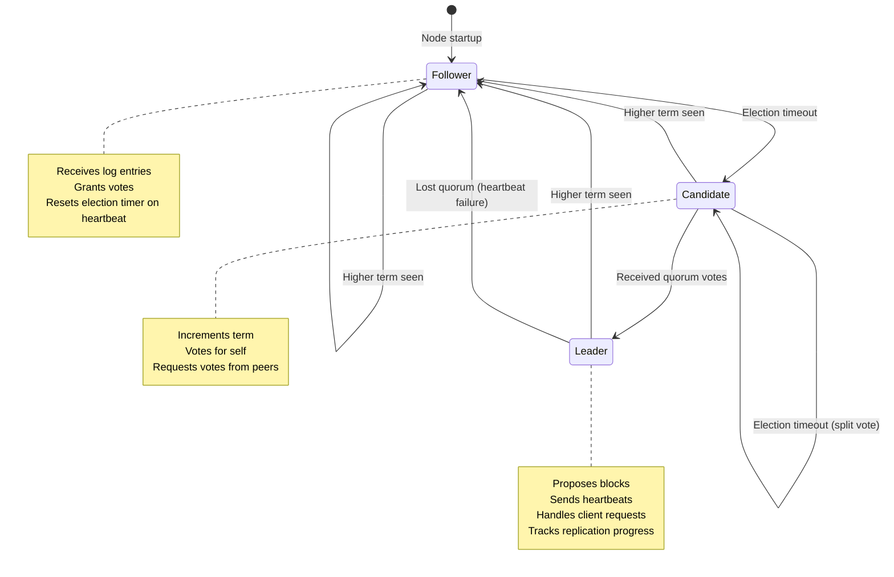
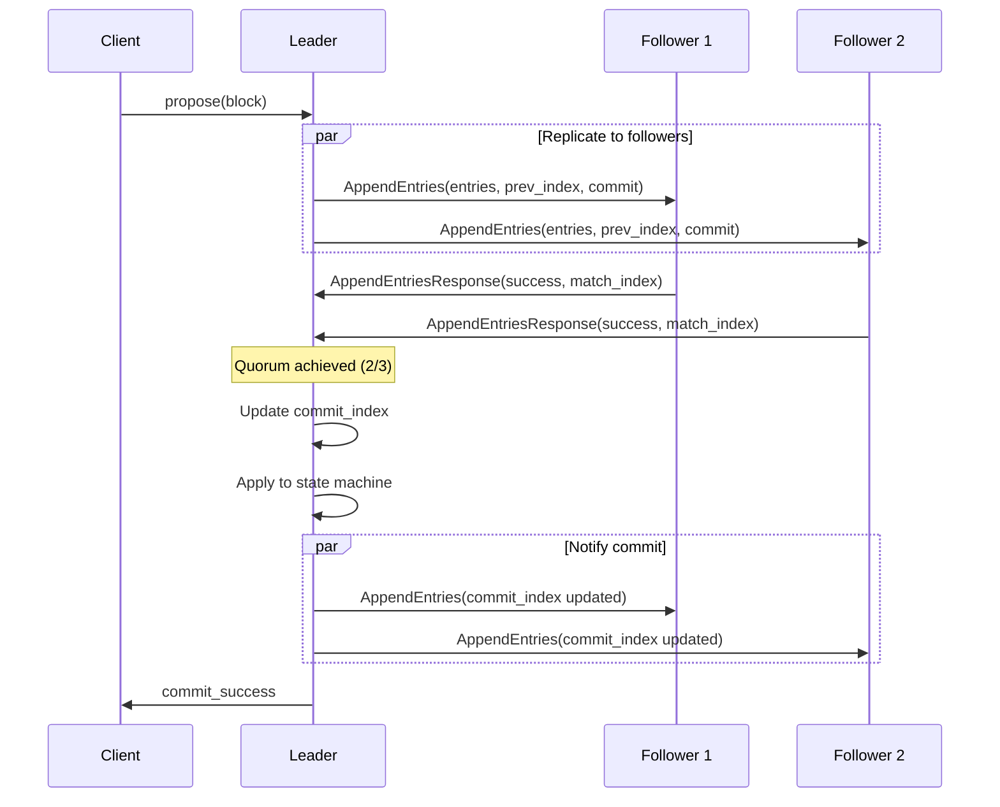
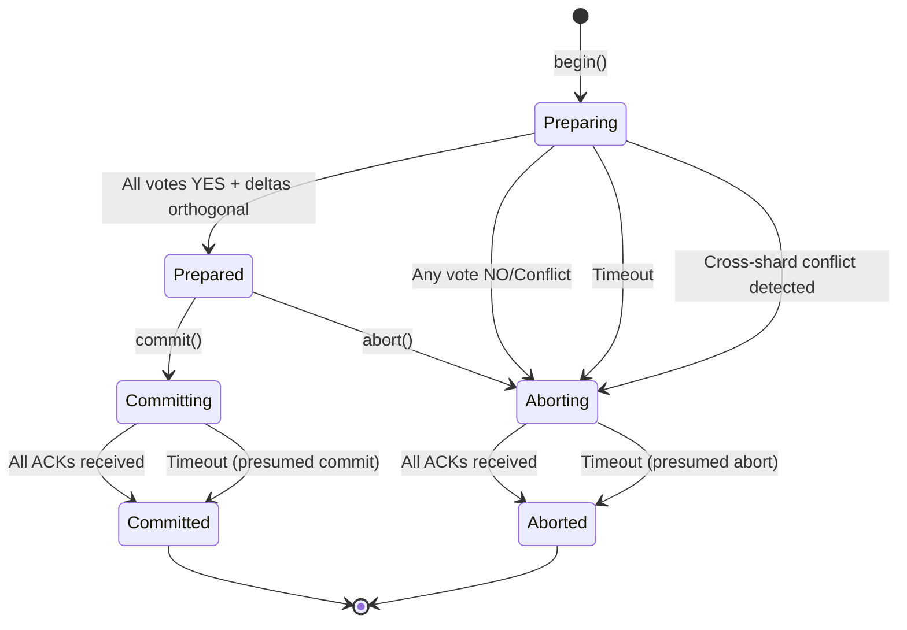
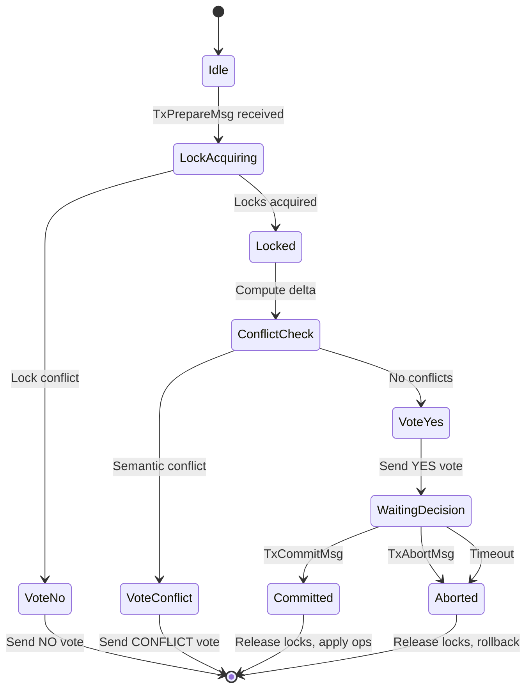
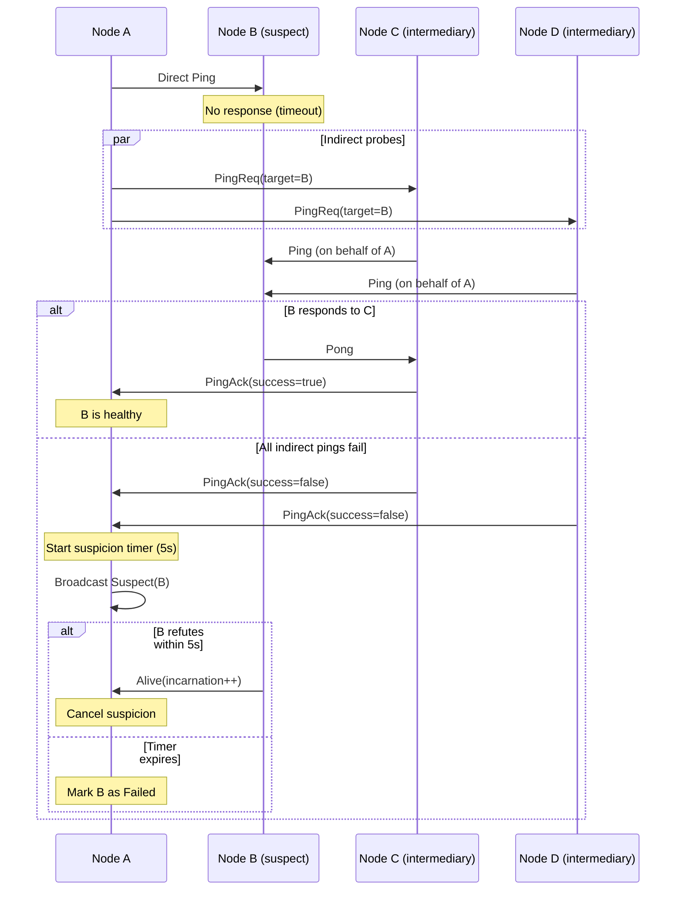
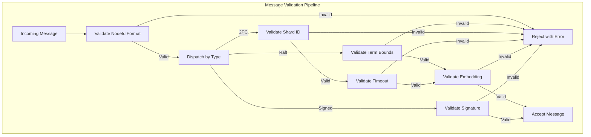
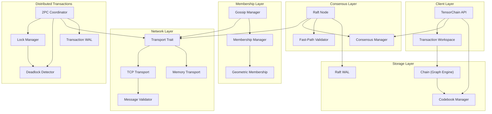

# Tensor Chain Architecture

Tensor-native blockchain with semantic conflict detection, hierarchical
codebook-based validation, and Tensor-Raft distributed consensus. This is the
most complex module in Neumann, providing distributed transaction coordination
across a cluster of nodes.

Tensor Chain treats transactions as geometric objects in embedding space.
Changes are represented as delta vectors, enabling similarity-based conflict
detection and automatic merging of orthogonal transactions. The module
integrates Raft consensus for leader election, two-phase commit (2PC) for
cross-shard transactions, SWIM gossip for failure detection, and wait-for graph
analysis for deadlock detection.

## Key Concepts

### Raft Consensus

Tensor-Raft extends the standard Raft consensus protocol with tensor-native
optimizations:

- **Similarity Fast-Path**: Followers can skip full validation when block
  embeddings are similar (>0.95 cosine) to recent blocks from the same leader
- **Geometric Tie-Breaking**: During elections with equal logs, candidates with
  similar state embeddings to the cluster centroid are preferred
- **Pre-Vote Phase**: Prevents disruptive elections by requiring majority
  agreement before incrementing term
- **Automatic Heartbeat**: Background task spawned on leader election maintains
  quorum

The leader replicates log entries containing blocks to followers. Entries are
committed when a quorum (majority) acknowledges them. Committed entries are
applied to the chain state machine.

#### Raft State Machine



#### Pre-Vote Protocol

Pre-vote prevents disruptive elections from partitioned nodes:

```text
Node A (partitioned, stale)              Healthy Cluster
    |                                         |
    |-- PreVote(term=5) --------------------->|
    |                                         |
    |<-- PreVoteResponse(granted=false) ------|
    |                                         |
    | Does NOT increment term                 |
    | (prevents term inflation)               |
```

A pre-vote is granted only if:

1. Candidate's term >= our term
2. Election timeout has elapsed (no recent leader heartbeat)
3. Candidate's log is at least as up-to-date as ours

#### Log Replication Flow



#### Quorum Calculation

Quorum requires a strict majority of voting members:

```rust
pub fn quorum_size(total_nodes: usize) -> usize {
    (total_nodes / 2) + 1
}

// Examples:
// 3 nodes: quorum = 2
// 5 nodes: quorum = 3
// 7 nodes: quorum = 4
```

#### Fast-Path Validation

When enabled, followers can skip expensive block validation for similar blocks:

```rust
pub struct FastPathValidator {
    similarity_threshold: f32,  // Default: 0.95
    min_history: usize,         // Default: 3 blocks
}

// Validation logic:
// 1. Check if we have enough history from this leader
// 2. Compute cosine similarity with recent embeddings
// 3. If similarity > threshold for all recent blocks:
//    - Skip full validation
//    - Record acceptance in stats
// 4. Otherwise: perform full validation
```

### Two-Phase Commit (2PC)

Cross-shard distributed transactions use 2PC with delta-based conflict
detection:

**Phase 1 - PREPARE**: Coordinator sends `TxPrepareMsg` to each participant
shard. Participants acquire locks, compute delta embeddings, and vote `Yes`,
`No`, or `Conflict`.

**Phase 2 - COMMIT/ABORT**: If all votes are `Yes` and cross-shard deltas are
orthogonal (cosine < 0.1), coordinator sends `TxCommitMsg`. Otherwise, sends
`TxAbortMsg` with retry.

Orthogonal transactions (operating on independent data dimensions) can commit in
parallel without coordination, reducing contention.

#### 2PC Coordinator State Machine



#### 2PC Participant State Machine



#### Lock Ordering (Deadlock Prevention)

The coordinator follows strict lock ordering to prevent internal deadlocks:

```text
Lock acquisition order:
1. pending           - Transaction state map
2. lock_manager.locks     - Key-level locks
3. lock_manager.tx_locks  - Per-transaction lock sets
4. pending_aborts    - Abort queue

CRITICAL: Never acquire pending_aborts while holding pending
```

#### WAL Recovery Protocol

The coordinator uses write-ahead logging for crash recovery:

```rust
// Recovery state machine:
// 1. Replay WAL to reconstruct pending transactions
// 2. For each transaction, determine recovery action:

match tx.phase {
    TxPhase::Preparing => {
        // Incomplete prepare - abort (presumed abort)
        tx.phase = TxPhase::Aborting;
    }
    TxPhase::Prepared => {
        // All YES votes recorded - check if can commit
        if all_yes_votes && deltas_orthogonal {
            tx.phase = TxPhase::Committing;
        } else {
            tx.phase = TxPhase::Aborting;
        }
    }
    TxPhase::Committing => {
        // Continue commit - presumed commit
        complete_commit(tx);
    }
    TxPhase::Aborting => {
        // Continue abort
        complete_abort(tx);
    }
}
```

### SWIM Gossip Protocol

Scalable membership management replaces O(N) sequential pings with O(log N)
epidemic propagation:

- **Peer Sampling**: Select k peers per round (default: 3) using geometric
  routing
- **LWW-CRDT State**: Last-Writer-Wins conflict resolution with Lamport
  timestamps
- **Suspicion Protocol**: Direct ping failure triggers indirect probes via
  intermediaries. Suspicion timer (5s default) allows refutation before marking
  node as failed

#### Gossip Message Types

```rust
pub enum GossipMessage {
    /// Sync message with piggy-backed node states
    Sync {
        sender: NodeId,
        states: Vec<GossipNodeState>,
        sender_time: u64,  // Lamport timestamp
    },

    /// Suspect a node of failure
    Suspect {
        reporter: NodeId,
        suspect: NodeId,
        incarnation: u64,
    },

    /// Refute suspicion by proving aliveness
    Alive {
        node_id: NodeId,
        incarnation: u64,  // Incremented to refute
    },

    /// Indirect ping request (SWIM protocol)
    PingReq {
        origin: NodeId,
        target: NodeId,
        sequence: u64,
    },

    /// Indirect ping response
    PingAck {
        origin: NodeId,
        target: NodeId,
        sequence: u64,
        success: bool,
    },
}
```

#### LWW-CRDT State Merging

```rust
// State supersession rules:
impl GossipNodeState {
    pub fn supersedes(&self, other: &GossipNodeState) -> bool {
        // Incarnation takes precedence
        if self.incarnation != other.incarnation {
            self.incarnation > other.incarnation
        } else {
            // Same incarnation: higher timestamp wins
            self.timestamp > other.timestamp
        }
    }
}

// Merge algorithm:
pub fn merge(&mut self, incoming: &[GossipNodeState]) -> Vec<NodeId> {
    let mut changed = Vec::new();

    for state in incoming {
        match self.states.get(&state.node_id) {
            Some(existing) if state.supersedes(existing) => {
                self.states.insert(state.node_id.clone(), state.clone());
                changed.push(state.node_id.clone());
            }
            None => {
                self.states.insert(state.node_id.clone(), state.clone());
                changed.push(state.node_id.clone());
            }
            _ => {} // Existing state is newer, ignore
        }
    }

    // Sync Lamport time to max + 1
    if let Some(max_ts) = incoming.iter().map(|s| s.timestamp).max() {
        self.lamport_time = self.lamport_time.max(max_ts) + 1;
    }

    changed
}
```

#### SWIM Failure Detection Flow



#### Incarnation Number Protocol

```text
Scenario: Node B receives Suspect about itself

B's current incarnation: 5
Suspect message incarnation: 5

B increments: incarnation = 6
B broadcasts: Alive { node_id: B, incarnation: 6 }

All nodes receiving Alive update B's state:
- incarnation: 6
- health: Healthy
- timestamp: <lamport_time++>
```

### Deadlock Detection

Wait-for graph tracks transaction dependencies for cycle detection:

1. Edge `A -> B` added when transaction A blocks waiting for B to release locks
2. Periodic DFS traversal detects cycles (deadlocks)
3. Victim selected based on policy (youngest, oldest, lowest priority, or most
   locks)
4. Victim transaction aborted to break the cycle

#### Wait-For Graph Structure

```rust
pub struct WaitForGraph {
    /// Maps tx_id -> set of tx_ids it is waiting for
    edges: HashMap<u64, HashSet<u64>>,

    /// Reverse edges for O(1) removal: holder -> waiters
    reverse_edges: HashMap<u64, HashSet<u64>>,

    /// Timestamp when wait started (for victim selection)
    wait_started: HashMap<u64, EpochMillis>,

    /// Priority values (lower = higher priority)
    priorities: HashMap<u64, u32>,
}
```

#### Tarjan's DFS Cycle Detection Algorithm

```rust
fn dfs_detect(
    &self,
    node: u64,
    edges: &HashMap<u64, HashSet<u64>>,
    visited: &mut HashSet<u64>,
    rec_stack: &mut HashSet<u64>,  // Current recursion path
    path: &mut Vec<u64>,           // Explicit path for extraction
    cycles: &mut Vec<Vec<u64>>,
) {
    visited.insert(node);
    rec_stack.insert(node);
    path.push(node);

    if let Some(neighbors) = edges.get(&node) {
        for &neighbor in neighbors {
            if !visited.contains(&neighbor) {
                // Continue DFS on unvisited
                self.dfs_detect(neighbor, edges, visited, rec_stack, path, cycles);
            } else if rec_stack.contains(&neighbor) {
                // Back-edge to ancestor = cycle found!
                if let Some(cycle_start) = path.iter().position(|&n| n == neighbor) {
                    cycles.push(path[cycle_start..].to_vec());
                }
            }
        }
    }

    path.pop();
    rec_stack.remove(&node);
}
```

#### Victim Selection Policies

| Policy | Selection Criteria | Trade-off |
| --- | --- | --- |
| `Youngest` | Most recent wait start (highest timestamp) | Minimizes wasted work, may starve long transactions |
| `Oldest` | Earliest wait start (lowest timestamp) | Prevents starvation, wastes more completed work |
| `LowestPriority` | Highest priority value | Business-rule based, requires priority assignment |
| `MostLocks` | Transaction holding most locks | Maximizes freed resources, may abort complex transactions |

### Ed25519 Signing and Identity

Cryptographic identity binding ensures message authenticity and enables
geometric routing:

#### Identity Generation and NodeId Derivation

```rust
pub struct Identity {
    signing_key: SigningKey,  // Ed25519 private key (zeroized on drop)
}

impl Identity {
    pub fn generate() -> Self {
        let signing_key = SigningKey::generate(&mut OsRng);
        Self { signing_key }
    }

    /// NodeId = BLAKE2b-128(domain || public_key)
    /// 16 bytes = 32 hex characters
    pub fn node_id(&self) -> NodeId {
        let mut hasher = Blake2b::<U16>::new();
        hasher.update(b"neumann_node_id_v1");
        hasher.update(self.signing_key.verifying_key().as_bytes());
        hex::encode(hasher.finalize())
    }

    /// Embedding = BLAKE2b-512(domain || public_key) -> 16 f32 coords
    /// Normalized to [-1, 1] for geometric operations
    pub fn to_embedding(&self) -> SparseVector {
        let mut hasher = Blake2b::<U64>::new();
        hasher.update(b"neumann_node_embedding_v1");
        hasher.update(self.signing_key.verifying_key().as_bytes());
        let hash = hasher.finalize();

        // 64 bytes -> 16 f32 coordinates
        let coords: Vec<f32> = hash.chunks(4)
            .map(|c| {
                let bits = u32::from_le_bytes([c[0], c[1], c[2], c[3]]);
                (bits as f64 / u32::MAX as f64 * 2.0 - 1.0) as f32
            })
            .collect();

        SparseVector::from_dense(&coords)
    }
}
```

#### Signed Message Envelope

```rust
pub struct SignedMessage {
    pub sender: NodeId,           // Derived from public key
    pub public_key: [u8; 32],     // Ed25519 verifying key
    pub payload: Vec<u8>,         // Message content
    pub signature: Vec<u8>,       // 64-byte Ed25519 signature
    pub sequence: u64,            // Replay protection
    pub timestamp_ms: u64,        // Freshness check
}

// Signature covers: sender || sequence || timestamp || payload
// This binds identity, ordering, and content together
```

#### Replay Protection

```rust
pub struct SequenceTracker {
    sequences: DashMap<NodeId, (u64, Instant)>,
    config: SequenceTrackerConfig,
}

impl SequenceTracker {
    pub fn check_and_record(
        &self,
        sender: &NodeId,
        sequence: u64,
        timestamp_ms: u64,
    ) -> Result<()> {
        // 1. Reject messages from the future (allow 1 min clock skew)
        if timestamp_ms > now_ms + 60_000 {
            return Err("message timestamp is in the future");
        }

        // 2. Reject stale messages (default: 5 min max age)
        if now_ms > timestamp_ms + self.config.max_age_ms {
            return Err("message too old");
        }

        // 3. Check sequence number is strictly increasing
        let entry = self.sequences.entry(sender.clone()).or_insert((0, now));
        if sequence <= entry.0 {
            return Err("replay detected: sequence <= last seen");
        }

        *entry = (sequence, now);
        Ok(())
    }
}
```

### Message Validation Pipeline

All incoming messages pass through validation before processing:



#### Embedding Validation

```rust
pub struct EmbeddingValidator {
    max_dimension: usize,    // Default: 65,536
    max_magnitude: f32,      // Default: 1,000,000
}

impl EmbeddingValidator {
    pub fn validate(&self, embedding: &SparseVector, field: &str) -> Result<()> {
        // 1. Dimension bounds
        if embedding.dimension() == 0 {
            return Err("dimension cannot be zero");
        }
        if embedding.dimension() > self.max_dimension {
            return Err("dimension exceeds maximum");
        }

        // 2. NaN/Inf detection (prevents computation errors)
        for (i, value) in embedding.values().iter().enumerate() {
            if value.is_nan() {
                return Err(format!("NaN value at position {}", i));
            }
            if value.is_infinite() {
                return Err(format!("infinite value at position {}", i));
            }
        }

        // 3. Magnitude bounds (prevents DoS via huge vectors)
        if embedding.magnitude() > self.max_magnitude {
            return Err("magnitude exceeds maximum");
        }

        // 4. Position validity (sorted, within bounds)
        let positions = embedding.positions();
        for (i, &pos) in positions.iter().enumerate() {
            if pos as usize >= embedding.dimension() {
                return Err("position out of bounds");
            }
            if i > 0 && positions[i - 1] >= pos {
                return Err("positions not strictly sorted");
            }
        }

        Ok(())
    }
}
```

### Semantic Conflict Detection

The consensus manager uses hybrid detection combining angular and structural
similarity:

#### Conflict Classification Algorithm

```rust
pub fn detect_conflict(&self, d1: &DeltaVector, d2: &DeltaVector) -> ConflictResult {
    let cosine = d1.cosine_similarity(d2);
    let jaccard = d1.structural_similarity(d2);  // Jaccard index
    let overlapping_keys = d1.overlapping_keys(d2);
    let all_keys_overlap = overlapping_keys.len() == d1.affected_keys.len()
        && overlapping_keys.len() == d2.affected_keys.len();

    // Classification hierarchy:
    let (class, action) = if cosine >= 0.99 && all_keys_overlap {
        // Identical: same direction, same keys
        (ConflictClass::Identical, MergeAction::Deduplicate)

    } else if cosine <= -0.95 && all_keys_overlap {
        // Opposite: cancel out (A + (-A) = 0)
        (ConflictClass::Opposite, MergeAction::Cancel)

    } else if cosine.abs() < 0.1 && jaccard < 0.5 {
        // Truly orthogonal: different directions AND different positions
        (ConflictClass::Orthogonal, MergeAction::VectorAdd)

    } else if cosine >= 0.7 {
        // Angular conflict: pointing same direction
        (ConflictClass::Conflicting, MergeAction::Reject)

    } else if jaccard >= 0.5 {
        // Structural conflict: same positions modified
        // Catches conflicts that cosine misses
        (ConflictClass::Conflicting, MergeAction::Reject)

    } else if !overlapping_keys.is_empty() {
        // Key overlap without structural/angular conflict
        (ConflictClass::Ambiguous, MergeAction::Reject)

    } else {
        // Low conflict: merge with weighted average
        (ConflictClass::LowConflict, MergeAction::WeightedAverage {
            weight1: 50, weight2: 50
        })
    };

    ConflictResult { class, cosine, jaccard, overlapping_keys, action, .. }
}
```

#### Merge Operations

```rust
impl DeltaVector {
    /// Vector addition for orthogonal deltas
    pub fn add(&self, other: &DeltaVector) -> DeltaVector {
        let delta = self.delta.add(&other.delta);
        let keys = self.affected_keys.union(&other.affected_keys).cloned().collect();
        DeltaVector::from_sparse(delta, keys, 0)
    }

    /// Weighted average for low-conflict deltas
    pub fn weighted_average(&self, other: &DeltaVector, w1: f32, w2: f32) -> DeltaVector {
        let total = w1 + w2;
        if total == 0.0 {
            return DeltaVector::zero(0);
        }
        let delta = self.delta.weighted_average(&other.delta, w1, w2);
        let keys = self.affected_keys.union(&other.affected_keys).cloned().collect();
        DeltaVector::from_sparse(delta, keys, 0)
    }

    /// Project out conflicting component
    pub fn project_non_conflicting(&self, conflict_direction: &SparseVector) -> DeltaVector {
        let delta = self.delta.project_orthogonal(conflict_direction);
        DeltaVector::from_sparse(delta, self.affected_keys.clone(), self.tx_id)
    }
}
```

## Types Reference

### Core Types

| Type | Module | Description |
| --- | --- | --- |
| `TensorChain` | `lib.rs` | Main API for chain operations, transaction management |
| `Block` | `block.rs` | Block structure with header, transactions, signatures |
| `BlockHeader` | `block.rs` | Height, prev_hash, delta_embedding, quantized_codes |
| `Transaction` | `block.rs` | Put, Delete, Update operations |
| `ChainConfig` | `lib.rs` | Node ID, max transactions, conflict threshold, auto-merge |
| `ChainError` | `error.rs` | Error types for all chain operations |
| `ChainMetrics` | `lib.rs` | Aggregated metrics from all components |

### Consensus Types

| Type | Module | Description |
| --- | --- | --- |
| `RaftNode` | `raft.rs` | Raft state machine with leader election, log replication |
| `RaftState` | `raft.rs` | Follower, Candidate, or Leader |
| `RaftConfig` | `raft.rs` | Election timeout, heartbeat interval, fast-path settings |
| `RaftStats` | `raft.rs` | Fast-path acceptance, heartbeat timing, quorum tracking |
| `QuorumTracker` | `raft.rs` | Tracks heartbeat responses to detect quorum loss |
| `SnapshotMetadata` | `raft.rs` | Log compaction point with hash and membership config |
| `LogEntry` | `network.rs` | Raft log entry with term, index, and data |
| `ConsensusManager` | `consensus.rs` | Semantic conflict detection and transaction merging |
| `DeltaVector` | `consensus.rs` | Sparse delta embedding with affected keys |
| `ConflictClass` | `consensus.rs` | Orthogonal, LowConflict, Ambiguous, Conflicting, Identical, Opposite |
| `FastPathValidator` | `validation.rs` | Block similarity validation for fast-path acceptance |
| `FastPathState` | `raft.rs` | Per-leader embedding history for fast-path |
| `TransferState` | `raft.rs` | Active leadership transfer tracking |
| `HeartbeatStats` | `raft.rs` | Heartbeat success/failure counters |

### Distributed Transaction Types

| Type | Module | Description |
| --- | --- | --- |
| `DistributedTxCoordinator` | `distributed_tx.rs` | 2PC coordinator with timeout and retry |
| `DistributedTransaction` | `distributed_tx.rs` | Transaction spanning multiple shards |
| `TxPhase` | `distributed_tx.rs` | Preparing, Prepared, Committing, Committed, Aborting, Aborted |
| `PrepareVote` | `distributed_tx.rs` | Yes (with lock handle), No (with reason), Conflict |
| `LockManager` | `distributed_tx.rs` | Key-level locking for transaction isolation |
| `KeyLock` | `distributed_tx.rs` | Lock on a key with timeout and handle |
| `TxWal` | `tx_wal.rs` | Write-ahead log for crash recovery |
| `TxWalEntry` | `tx_wal.rs` | WAL entry types: TxBegin, PrepareVote, PhaseChange, TxComplete |
| `TxRecoveryState` | `tx_wal.rs` | Reconstructed state from WAL replay |
| `PrepareRequest` | `distributed_tx.rs` | Request to prepare a transaction on a shard |
| `CommitRequest` | `distributed_tx.rs` | Request to commit a prepared transaction |
| `AbortRequest` | `distributed_tx.rs` | Request to abort a transaction |
| `CoordinatorState` | `distributed_tx.rs` | Serializable coordinator state for persistence |
| `ParticipantState` | `distributed_tx.rs` | Serializable participant state for persistence |

### Gossip Types

| Type | Module | Description |
| --- | --- | --- |
| `GossipMembershipManager` | `gossip.rs` | SWIM-style gossip with signing support |
| `GossipConfig` | `gossip.rs` | Fanout, interval, suspicion timeout, signature requirements |
| `GossipMessage` | `gossip.rs` | Sync, Suspect, Alive, PingReq, PingAck |
| `GossipNodeState` | `gossip.rs` | Node health, Lamport timestamp, incarnation |
| `LWWMembershipState` | `gossip.rs` | CRDT for conflict-free state merging |
| `PendingSuspicion` | `gossip.rs` | Suspicion timer tracking |
| `HealProgress` | `gossip.rs` | Recovery tracking for partitioned nodes |
| `SignedGossipMessage` | `signing.rs` | Gossip message with Ed25519 signature |

### Deadlock Detection Types

| Type | Module | Description |
| --- | --- | --- |
| `DeadlockDetector` | `deadlock.rs` | Cycle detection with configurable victim selection |
| `WaitForGraph` | `deadlock.rs` | Directed graph of transaction dependencies |
| `DeadlockInfo` | `deadlock.rs` | Detected cycle with selected victim |
| `VictimSelectionPolicy` | `deadlock.rs` | Youngest, Oldest, LowestPriority, MostLocks |
| `DeadlockStats` | `deadlock.rs` | Detection timing and cycle length statistics |
| `WaitInfo` | `deadlock.rs` | Lock conflict information for wait-graph edges |

### Identity and Signing Types

| Type | Module | Description |
| --- | --- | --- |
| `Identity` | `signing.rs` | Ed25519 private key (zeroized on drop) |
| `PublicIdentity` | `signing.rs` | Ed25519 public key for verification |
| `SignedMessage` | `signing.rs` | Message envelope with signature and replay protection |
| `ValidatorRegistry` | `signing.rs` | Registry of known validator public keys |
| `SequenceTracker` | `signing.rs` | Replay attack detection via sequence numbers |
| `SequenceTrackerConfig` | `signing.rs` | Max age, max entries, cleanup interval |

### Message Validation Types

| Type | Module | Description |
| --- | --- | --- |
| `MessageValidationConfig` | `message_validation.rs` | Bounds for DoS prevention |
| `CompositeValidator` | `message_validation.rs` | Validates all message types |
| `EmbeddingValidator` | `message_validation.rs` | Checks dimension, magnitude, NaN/Inf |
| `MessageValidator` | `message_validation.rs` | Trait for pluggable validation |

## Architecture Diagram



## Subsystems

### Consensus Subsystem

The Raft consensus implementation provides strong consistency guarantees:

**State Machine**:

- `Follower`: Receives AppendEntries from leader, grants votes
- `Candidate`: Requests votes after election timeout
- `Leader`: Proposes blocks, sends heartbeats, handles client requests

**Log Replication**:

```sql
Leader:  propose(block) -> AppendEntries to followers
                        -> Wait for quorum acknowledgment
                        -> Update commit_index
                        -> Apply to state machine
```

**Fast-Path Validation**:
When enabled and block embedding similarity exceeds threshold (default 0.95),
followers skip full validation. This optimization assumes semantically similar
blocks from the same leader are likely valid.

**Log Compaction**:
After `snapshot_threshold` entries (default 10,000), a snapshot captures the
state machine at the commit point. Entries before the snapshot can be truncated,
keeping only `snapshot_trailing_logs` entries for followers catching up.

### Distributed Transactions Subsystem

Cross-shard coordination uses two-phase commit with tensor-native conflict
detection:

**Phase 1 - Prepare**:

```text
Coordinator                    Participant (per shard)
    |                                  |
    |--- TxPrepareMsg --------------->|
    |    (ops, delta_embedding)        |
    |                                  |-- acquire locks
    |                                  |-- compute local delta
    |                                  |-- check conflicts
    |<--- TxPrepareResponse ----------|
    |     (Yes/No/Conflict)            |
```

**Phase 2 - Commit or Abort**:

```text
If all Yes AND deltas orthogonal:
    |--- TxCommitMsg ---------------->| -- release locks, apply ops
    |<--- TxAckMsg -------------------|

Otherwise:
    |--- TxAbortMsg ----------------->| -- release locks, rollback
    |<--- TxAckMsg -------------------|
```

**Conflict Detection**:
Uses hybrid detection combining cosine similarity (angular conflict) and Jaccard
index (structural conflict):

| Cosine | Jaccard | Classification | Action |
| --- | --- | --- | --- |
| < 0.1 | < 0.5 | Orthogonal | Auto-merge (vector add) |
| 0.1-0.7 | < 0.5 | LowConflict | Weighted merge |
| >= 0.7 | any | Conflicting | Reject |
| any | >= 0.5 | Conflicting | Reject (structural) |
| >= 0.99 | all keys | Identical | Deduplicate |
| <= -0.95 | all keys | Opposite | Cancel (no-op) |

### Gossip Protocol Subsystem

SWIM-style failure detection with LWW-CRDT state:

**Gossip Round**:

```sql
1. Select k peers (fanout=3) using geometric routing
2. Send Sync message with piggybacked node states
3. Merge received states (higher incarnation wins)
4. Update Lamport time
```

**Failure Detection**:

```text
Direct ping failed
    |
    v
Send PingReq to k intermediaries
    |
    v
All indirect pings failed?
    |-- No --> Mark healthy
    |-- Yes --> Start suspicion timer (5s)
                    |
                    v
                Timer expired without Alive?
                    |-- No --> Mark healthy (refuted)
                    |-- Yes --> Mark failed
```

**Incarnation Numbers**:
When a node receives a Suspect about itself, it increments its incarnation and
broadcasts Alive to refute the suspicion.

### Deadlock Detection Subsystem

Wait-for graph analysis for cycle detection:

**Graph Structure**:

```text
Edge: waiter_tx -> holder_tx
Meaning: waiter is blocked waiting for holder to release locks
```

**Detection Algorithm** (Tarjan's DFS):

```sql
1. For each unvisited node, start DFS
2. Track recursion stack for back-edge detection
3. Back-edge to ancestor = cycle found
4. Extract cycle path for victim selection
```

**Victim Selection Policies**:

- `Youngest`: Abort most recent transaction (minimize wasted work)
- `Oldest`: Abort earliest transaction (prevent starvation)
- `LowestPriority`: Abort transaction with highest priority value
- `MostLocks`: Abort transaction holding most locks (minimize cascade)

## Configuration Options

### RaftConfig

| Field | Default | Description |
| --- | --- | --- |
| `election_timeout` | (150, 300) | Random timeout range in ms |
| `heartbeat_interval` | 50 | Heartbeat interval in ms |
| `similarity_threshold` | 0.95 | Fast-path similarity threshold |
| `enable_fast_path` | true | Enable fast-path validation |
| `enable_pre_vote` | true | Enable pre-vote phase |
| `enable_geometric_tiebreak` | true | Enable geometric tie-breaking |
| `geometric_tiebreak_threshold` | 0.3 | Minimum similarity for tiebreak |
| `snapshot_threshold` | 10,000 | Entries before compaction |
| `snapshot_trailing_logs` | 100 | Entries to keep after snapshot |
| `snapshot_chunk_size` | 1MB | Chunk size for snapshot transfer |
| `transfer_timeout_ms` | 1,000 | Leadership transfer timeout |
| `compaction_check_interval` | 10 | Ticks between compaction checks |
| `compaction_cooldown_ms` | 60,000 | Minimum time between compactions |
| `snapshot_max_memory` | 256MB | Max memory for snapshot buffering |
| `auto_heartbeat` | true | Spawn heartbeat task on leader election |
| `max_heartbeat_failures` | 3 | Failures before logging warning |

### DistributedTxConfig

| Field | Default | Description |
| --- | --- | --- |
| `max_concurrent` | 100 | Maximum concurrent transactions |
| `prepare_timeout_ms` | 5,000 | Prepare phase timeout |
| `commit_timeout_ms` | 10,000 | Commit phase timeout |
| `orthogonal_threshold` | 0.1 | Cosine threshold for orthogonality |
| `optimistic_locking` | true | Enable semantic conflict detection |

### GossipConfig

| Field | Default | Description |
| --- | --- | --- |
| `fanout` | 3 | Peers per gossip round |
| `gossip_interval_ms` | 200 | Interval between rounds |
| `suspicion_timeout_ms` | 5,000 | Time before failure declaration |
| `max_states_per_message` | 20 | State limit per message |
| `geometric_routing` | true | Use embedding-based peer selection |
| `indirect_ping_count` | 3 | Indirect pings on direct failure |
| `indirect_ping_timeout_ms` | 500 | Timeout for indirect pings |
| `require_signatures` | false | Require Ed25519 signatures |
| `max_message_age_ms` | 300,000 | Maximum signed message age |

### DeadlockDetectorConfig

| Field | Default | Description |
| --- | --- | --- |
| `enabled` | true | Enable deadlock detection |
| `detection_interval_ms` | 100 | Detection cycle interval |
| `victim_policy` | Youngest | Victim selection policy |
| `max_cycle_length` | 100 | Maximum detectable cycle length |
| `auto_abort_victim` | true | Automatically abort victim |

### MessageValidationConfig

| Field | Default | Description |
| --- | --- | --- |
| `enabled` | true | Enable validation |
| `max_term` | u64::MAX - 1 | Prevent overflow attacks |
| `max_shard_id` | 65,536 | Bound shard addressing |
| `max_tx_timeout_ms` | 300,000 | Maximum transaction timeout |
| `max_node_id_len` | 256 | Maximum node ID length |
| `max_key_len` | 4,096 | Maximum key length |
| `max_embedding_dimension` | 65,536 | Prevent huge allocations |
| `max_embedding_magnitude` | 1,000,000 | Detect invalid values |
| `max_query_len` | 1MB | Maximum query string length |
| `max_message_age_ms` | 300,000 | Reject stale/replayed messages |
| `max_blocks_per_request` | 1,000 | Limit block range requests |
| `max_snapshot_chunk_size` | 10MB | Limit snapshot chunk size |

## Edge Cases and Gotchas

### Raft Edge Cases

1. **Split Vote**: When multiple candidates split the vote evenly, election
   timeout triggers new election. Randomized timeouts (150-300ms) reduce
   collision probability.

2. **Network Partition**: During partition, minority side cannot commit (lacks
   quorum). Pre-vote prevents term inflation when partition heals.

3. **Stale Leader**: A partitioned leader may not know it lost leadership.
   Quorum tracker detects heartbeat failures and steps down.

4. **Log Divergence**: Followers with divergent logs are overwritten by leader's
   log (consistency > availability).

5. **Snapshot During Election**: Snapshot transfer continues even if leadership
   changes. New leader may need to resend snapshot.

### 2PC Edge Cases

1. **Coordinator Failure After Prepare**: Participants holding locks may
   timeout. WAL recovery allows new coordinator to resume.

2. **Participant Failure**: Coordinator times out waiting for vote. Transaction
   aborts, participant recovers from WAL on restart.

3. **Network Partition Between Phases**: Commit messages may not reach all
   participants. Retry loop ensures eventual delivery.

4. **Lock Timeout vs Transaction Timeout**: Lock timeout (30s) should exceed
   transaction timeout (5s) to prevent premature lock release.

5. **Orphaned Locks**: Locks from crashed transactions are cleaned up by
   periodic `cleanup_expired()` or WAL recovery.

### Gossip Edge Cases

1. **Incarnation Overflow**: Theoretically possible with u64, but requires 2^64
   restarts. Practically impossible.

2. **Clock Skew**: Lamport timestamps are logical, not wall-clock. Sync messages
   update local Lamport time to `max(local, remote) + 1`.

3. **Signature Replay**: Sequence numbers and timestamp freshness checks prevent
   replaying old signed messages.

4. **Rapid Restart**: Node restarting rapidly may have lower incarnation than
   suspected state. New incarnation on restart resolves this.

### Conflict Detection Edge Cases

1. **Zero Vector**: Empty deltas (no changes) have undefined cosine similarity.
   Treated as orthogonal.

2. **Nearly Identical**: Transactions with 0.99 < similarity < 1.0 may conflict.
   Use structural overlap (Jaccard) as secondary check.

3. **Large Dimension Mismatch**: Deltas with different dimensions cannot be
   directly compared. Pad smaller to match larger.

## Recovery Procedures

### Raft Recovery from WAL

```rust
// 1. Open WAL and replay entries
let wal = RaftWal::open(wal_path)?;
let recovery = RaftRecoveryState::from_wal(&wal)?;

// 2. Restore term and voted_for
node.current_term = recovery.current_term;
node.voted_for = recovery.voted_for;

// 3. Validate snapshot if present
if let Some((meta, data)) = load_snapshot() {
    let computed_hash = sha256(&data);
    if computed_hash == meta.snapshot_hash {
        // Valid snapshot - restore state machine
        apply_snapshot(meta, data);
    } else {
        // Corrupted snapshot - ignore
        warn!("Snapshot hash mismatch, starting fresh");
    }
}

// 4. Start as follower
node.state = RaftState::Follower;
```

### 2PC Coordinator Recovery

```rust
// 1. Replay WAL to reconstruct pending transactions
let recovery = TxRecoveryState::from_wal(&wal)?;

// 2. Process each transaction based on phase
for tx in recovery.prepared_txs {
    // All YES votes - resume commit
    coordinator.pending.insert(tx.tx_id, restore_tx(tx, TxPhase::Prepared));
}

for tx in recovery.committing_txs {
    // Was committing - complete commit
    coordinator.complete_commit(tx.tx_id)?;
}

for tx in recovery.aborting_txs {
    // Was aborting - complete abort
    coordinator.complete_abort(tx.tx_id)?;
}

// 3. Timed out transactions default to abort (presumed abort)
for tx in recovery.timed_out_txs {
    coordinator.abort(tx.tx_id, "recovered - timeout")?;
}
```

### Gossip State Recovery

```rust
// Gossip state is reconstructed via protocol, not WAL
// 1. Start with only local node in state
let mut state = LWWMembershipState::new();
state.update_local(local_node.clone(), NodeHealth::Healthy, 0);

// 2. Add known peers as Unknown
for peer in known_peers {
    state.merge(&[GossipNodeState::new(peer, NodeHealth::Unknown, 0, 0)]);
}

// 3. Gossip protocol will converge to correct state
// - Healthy nodes will respond to Sync
// - Failed nodes will be suspected and eventually marked failed
```

## Operational Best Practices

### Cluster Sizing

- **Minimum**: 3 nodes (tolerates 1 failure)
- **Recommended**: 5 nodes (tolerates 2 failures)
- **Large**: 7 nodes (tolerates 3 failures)
- Avoid even numbers (split-brain risk)

### Timeout Tuning

```rust
// Network latency < 10ms (same datacenter)
RaftConfig {
    election_timeout: (150, 300),
    heartbeat_interval: 50,
}

// Network latency 10-50ms (cross-datacenter)
RaftConfig {
    election_timeout: (500, 1000),
    heartbeat_interval: 150,
}

// Network latency > 50ms (geo-distributed)
RaftConfig {
    election_timeout: (2000, 4000),
    heartbeat_interval: 500,
}
```

### Monitoring

Key metrics to monitor:

| Metric | Warning Threshold | Critical Threshold |
| --- | --- | --- |
| `heartbeat_success_rate` | < 0.95 | < 0.80 |
| `fast_path_rate` | < 0.50 | < 0.20 |
| `commit_rate` | < 0.80 | < 0.50 |
| `conflict_rate` | > 0.10 | > 0.30 |
| `deadlocks_detected` | > 0/min | > 10/min |
| `quorum_lost_events` | > 0/hour | > 0/min |

### Security Considerations

1. **Enable Message Signing**: Set `require_signatures: true` in production
2. **Rotate Keys**: Periodically generate new identities and update registry
3. **Network Isolation**: Use TLS for transport, firewall cluster ports
4. **Audit Logging**: Log all state transitions for forensic analysis

## Formal Verification

The three core protocols (Raft, 2PC, SWIM gossip) are formally
specified in TLA+ (`specs/tla/`) and exhaustively model-checked
with TLC:

| Spec | Distinct States | Properties Verified |
|------|----------------|---------------------|
| Raft.tla | 18,268,659 | ElectionSafety, LogMatching, StateMachineSafety, LeaderCompleteness, VoteIntegrity, TermMonotonicity |
| TwoPhaseCommit.tla | 2,264,939 | Atomicity, NoOrphanedLocks, ConsistentDecision, VoteIrrevocability, DecisionStability |
| Membership.tla | 54,148 | NoFalsePositivesSafety, MonotonicEpochs, MonotonicIncarnations |

Model checking discovered protocol-level bugs (out-of-order message
handling, self-message processing, heartbeat log truncation) that
were fixed in both the specs and the Rust implementation. See
[Formal Verification](../concepts/formal-verification.md) for full
results and the list of bugs found.

## Related Modules

| Module | Relationship |
| --- | --- |
| `tensor_store` | Provides `TensorStore` for persistence, `SparseVector` for embeddings, `ArchetypeRegistry` for delta compression |
| `graph_engine` | Blocks linked via graph edges, chain structure built on graph |
| `tensor_compress` | Int8 quantization for delta embeddings (4x compression) |
| `tensor_checkpoint` | Snapshot persistence for crash recovery |

## Performance Characteristics

| Operation | Time | Notes |
| --- | --- | --- |
| Transaction commit | ~50us | Single transaction block |
| Conflict detection | ~1us | Cosine + Jaccard calculation |
| Deadlock detection | ~350ns | DFS cycle detection |
| Gossip round | ~200ms | Configurable interval |
| Heartbeat | ~50ms | Leader to all followers |
| Fast-path validation | ~2us | Similarity check only |
| Full validation | ~50us | Complete block verification |
| Lock acquisition | ~100ns | Uncontended case |
| Lock acquisition (contended) | ~10us | With wait-graph update |
| Signature verification | ~50us | Ed25519 verify |
| Message validation | ~1us | Bounds checking |
