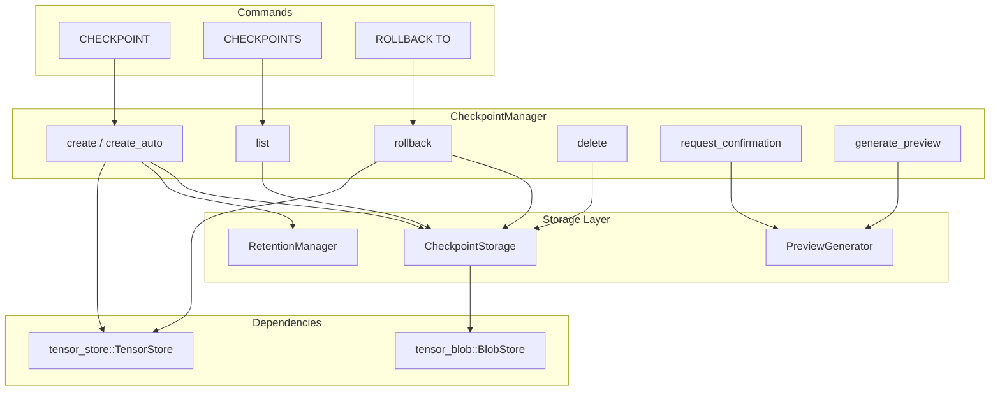
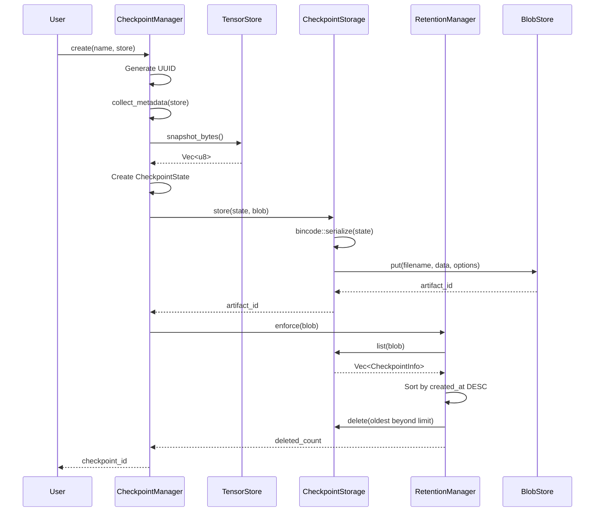
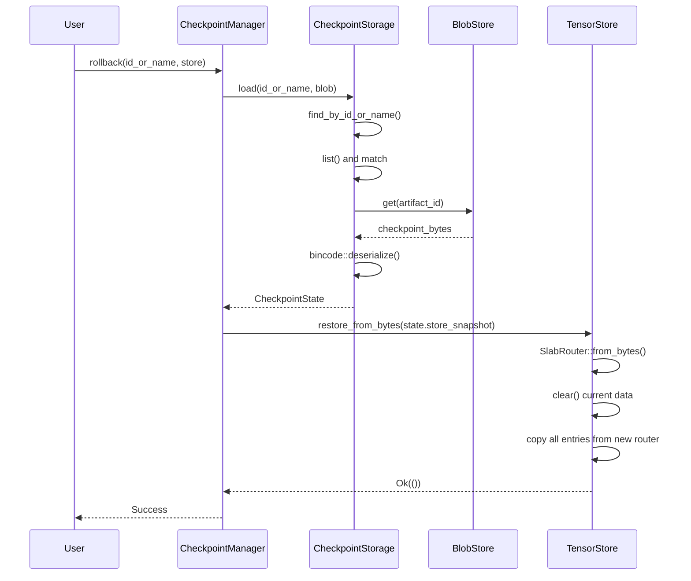

# Tensor Checkpoint

Tensor Checkpoint provides point-in-time snapshots of the database state for recovery operations. It enables users to create manual checkpoints before important operations, automatically checkpoint before destructive operations, and rollback to any previous checkpoint. Checkpoints are stored as blob artifacts in tensor_blob for content-addressable storage with automatic deduplication.

The module integrates with the query router to provide SQL-like commands (`CHECKPOINT`, `CHECKPOINTS`, `ROLLBACK TO`) and supports interactive confirmation prompts for destructive operations with configurable retention policies.

## Module Structure

```
tensor_checkpoint/
  src/
    lib.rs          # CheckpointManager, CheckpointConfig
    state.rs        # CheckpointState, DestructiveOp, metadata types
    storage.rs      # Blob storage integration
    retention.rs    # Count-based purge logic
    preview.rs      # Destructive operation previews
    error.rs        # Error types
```

## Key Types

### Core Types

| Type | Description |
|------|-------------|
| `CheckpointManager` | Main API for checkpoint operations |
| `CheckpointConfig` | Configuration (retention, auto-checkpoint, interactive mode) |
| `CheckpointState` | Full checkpoint data with snapshot and metadata |
| `CheckpointInfo` | Lightweight checkpoint listing info |
| `CheckpointTrigger` | Context for auto-checkpoints (command, operation, preview) |

### State Types

| Type | Description |
|------|-------------|
| `DestructiveOp` | Enum of destructive operations that trigger auto-checkpoints |
| `OperationPreview` | Summary and sample data for confirmation prompts |
| `CheckpointMetadata` | Statistics for validation (tables, nodes, embeddings) |
| `RelationalMeta` | Table and row counts |
| `GraphMeta` | Node and edge counts |
| `VectorMeta` | Embedding count |

### Error Types

| Variant | Description | Common Cause |
|---------|-------------|--------------|
| `NotFound` | Checkpoint not found by ID or name | Typo in checkpoint name or ID was pruned by retention |
| `Storage` | Blob storage error | Disk full, permissions issue |
| `Serialization` | Bincode serialization error | Corrupt in-memory state |
| `Deserialization` | Bincode deserialization error | Corrupt checkpoint file |
| `Blob` | Underlying blob store error | BlobStore not initialized |
| `Snapshot` | TensorStore snapshot error | Store locked or corrupted |
| `Cancelled` | Operation cancelled by user | User rejected confirmation prompt |
| `InvalidId` | Invalid checkpoint identifier | Empty or malformed ID string |
| `Retention` | Retention enforcement error | Failed to delete old checkpoints |

## Architecture



### Checkpoint Creation Flow



### Rollback Flow



## Storage Format

Checkpoints are stored as blob artifacts using content-addressable storage:

| Property | Value |
|----------|-------|
| Tag | `_system:checkpoint` |
| Content-Type | `application/x-neumann-checkpoint` |
| Format | bincode-serialized `CheckpointState` |
| Filename | `checkpoint_{id}.ncp` |
| Creator | `system:checkpoint` |

### Checkpoint State Structure

The `CheckpointState` is serialized using bincode for efficient binary encoding:

```rust
#[derive(Serialize, Deserialize)]
pub struct CheckpointState {
    pub id: String,           // UUID v4
    pub name: String,         // User-provided or auto-generated
    pub created_at: u64,      // Unix timestamp (seconds)
    pub trigger: Option<CheckpointTrigger>,  // For auto-checkpoints
    pub store_snapshot: Vec<u8>,  // Serialized SlabRouterSnapshot
    pub metadata: CheckpointMetadata,
}
```

### Snapshot Serialization Format

The `store_snapshot` field contains a V3 format snapshot:

```rust
// V3 snapshot structure (bincode serialized)
pub struct V3Snapshot {
    pub header: SnapshotHeader,     // Magic bytes, version, entry count
    pub router: SlabRouterSnapshot, // All slab data
}

pub struct SlabRouterSnapshot {
    pub index: EntityIndexSnapshot,      // Key-to-entity mapping
    pub embeddings: EmbeddingSlabSnapshot,
    pub graph: GraphTensorSnapshot,
    pub relations: RelationalSlabSnapshot,
    pub metadata: MetadataSlabSnapshot,
    pub cache: CacheRingSnapshot<TensorData>,
    pub blobs: BlobLogSnapshot,
}
```

Custom metadata stored with each artifact:

| Key | Type | Description |
|-----|------|-------------|
| `checkpoint_id` | String | UUID identifier |
| `checkpoint_name` | String | User-provided or auto-generated name |
| `created_at` | String | Unix timestamp (parsed to u64) |
| `trigger` | String | Operation name (for auto-checkpoints only) |

### Metadata Collection Algorithm

When creating a checkpoint, metadata is collected by scanning the store:

```rust
fn collect_metadata(&self, store: &TensorStore) -> CheckpointMetadata {
    let store_key_count = store.len();

    // Count relational tables by scanning _schema: prefix
    let table_keys: Vec<_> = store.scan("_schema:");
    let table_count = table_keys.len();
    let mut total_rows = 0;
    for key in &table_keys {
        if let Some(table_name) = key.strip_prefix("_schema:") {
            total_rows += store.scan_count(&format!("{table_name}:"));
        }
    }

    // Count graph entities
    let node_count = store.scan_count("node:");
    let edge_count = store.scan_count("edge:");

    // Count embeddings
    let embedding_count = store.scan_count("_embed:");

    CheckpointMetadata::new(
        RelationalMeta::new(table_count, total_rows),
        GraphMeta::new(node_count, edge_count),
        VectorMeta::new(embedding_count),
        store_key_count,
    )
}
```

## Configuration

### CheckpointConfig

| Field | Type | Default | Description |
|-------|------|---------|-------------|
| `max_checkpoints` | `usize` | 10 | Maximum checkpoints before pruning |
| `auto_checkpoint` | `bool` | true | Enable auto-checkpoints before destructive ops |
| `interactive_confirm` | `bool` | true | Require confirmation for destructive ops |
| `preview_sample_size` | `usize` | 5 | Number of sample rows in previews |

### Builder Pattern

```rust
let config = CheckpointConfig::default()
    .with_max_checkpoints(20)
    .with_auto_checkpoint(true)
    .with_interactive_confirm(false)
    .with_preview_sample_size(10);
```

### Configuration Presets

| Preset | max_checkpoints | auto_checkpoint | interactive_confirm | Use Case |
|--------|-----------------|-----------------|---------------------|----------|
| Default | 10 | true | true | Interactive CLI usage |
| Automated | 20 | true | false | Batch processing scripts |
| Minimal | 3 | false | false | Memory-constrained environments |
| Safe | 50 | true | true | Production with high retention |

## Destructive Operations

Operations that trigger auto-checkpoints when `auto_checkpoint` is enabled:

| Operation | Variant | Fields | Affected Count |
|-----------|---------|--------|----------------|
| DELETE | `Delete` | `table`, `row_count` | `row_count` |
| DROP TABLE | `DropTable` | `table`, `row_count` | `row_count` |
| DROP INDEX | `DropIndex` | `table`, `column` | 1 |
| NODE DELETE | `NodeDelete` | `node_id`, `edge_count` | 1 + `edge_count` |
| EMBED DELETE | `EmbedDelete` | `key` | 1 |
| VAULT DELETE | `VaultDelete` | `key` | 1 |
| BLOB DELETE | `BlobDelete` | `artifact_id`, `size` | 1 |
| CACHE CLEAR | `CacheClear` | `entry_count` | `entry_count` |

### DestructiveOp Implementation

```rust
#[derive(Debug, Clone, Serialize, Deserialize)]
pub enum DestructiveOp {
    Delete { table: String, row_count: usize },
    DropTable { table: String, row_count: usize },
    DropIndex { table: String, column: String },
    NodeDelete { node_id: u64, edge_count: usize },
    EmbedDelete { key: String },
    VaultDelete { key: String },
    BlobDelete { artifact_id: String, size: usize },
    CacheClear { entry_count: usize },
}

impl DestructiveOp {
    pub fn operation_name(&self) -> &'static str {
        match self {
            DestructiveOp::Delete { .. } => "DELETE",
            DestructiveOp::DropTable { .. } => "DROP TABLE",
            // ... etc
        }
    }

    pub fn affected_count(&self) -> usize {
        match self {
            DestructiveOp::Delete { row_count, .. } => *row_count,
            DestructiveOp::NodeDelete { edge_count, .. } => 1 + edge_count,
            DestructiveOp::DropIndex { .. } => 1,
            // ... etc
        }
    }
}
```

## SQL Commands

### CHECKPOINT

```sql
-- Named checkpoint
CHECKPOINT 'before-migration'

-- Auto-generated name (checkpoint-{timestamp})
CHECKPOINT
```

### CHECKPOINTS

```sql
-- List all checkpoints
CHECKPOINTS

-- List last N checkpoints
CHECKPOINTS LIMIT 10
```

Returns: `ID`, `Name`, `Created`, `Type` (manual/auto)

### ROLLBACK TO

```sql
-- By name
ROLLBACK TO 'checkpoint-name'

-- By ID
ROLLBACK TO 'uuid-string'
```

## API Reference

### CheckpointManager

```rust
impl CheckpointManager {
    /// Create manager with blob storage and configuration
    pub async fn new(
        blob: Arc<Mutex<BlobStore>>,
        config: CheckpointConfig
    ) -> Self;

    /// Create a manual checkpoint
    pub async fn create(
        &self,
        name: Option<&str>,
        store: &TensorStore
    ) -> Result<String>;

    /// Create an auto-checkpoint before destructive operation
    pub async fn create_auto(
        &self,
        command: &str,
        op: DestructiveOp,
        preview: OperationPreview,
        store: &TensorStore
    ) -> Result<String>;

    /// Rollback to a checkpoint by ID or name
    pub async fn rollback(
        &self,
        id_or_name: &str,
        store: &TensorStore
    ) -> Result<()>;

    /// List checkpoints, most recent first
    pub async fn list(
        &self,
        limit: Option<usize>
    ) -> Result<Vec<CheckpointInfo>>;

    /// Delete a checkpoint by ID or name
    pub async fn delete(&self, id_or_name: &str) -> Result<()>;

    /// Generate preview for a destructive operation
    pub fn generate_preview(
        &self,
        op: &DestructiveOp,
        sample_data: Vec<String>
    ) -> OperationPreview;

    /// Request user confirmation for an operation
    pub fn request_confirmation(
        &self,
        op: &DestructiveOp,
        preview: &OperationPreview
    ) -> bool;

    /// Set custom confirmation handler
    pub fn set_confirmation_handler(
        &mut self,
        handler: Arc<dyn ConfirmationHandler>
    );

    /// Check if auto-checkpoint is enabled
    pub fn auto_checkpoint_enabled(&self) -> bool;

    /// Check if interactive confirmation is enabled
    pub fn interactive_confirm_enabled(&self) -> bool;

    /// Access the current configuration
    pub fn config(&self) -> &CheckpointConfig;
}
```

### ConfirmationHandler

```rust
pub trait ConfirmationHandler: Send + Sync {
    fn confirm(&self, op: &DestructiveOp, preview: &OperationPreview) -> bool;
}
```

Built-in implementations:

| Type | Behavior | Use Case |
|------|----------|----------|
| `AutoConfirm` | Always returns true | Automated scripts, testing |
| `AutoReject` | Always returns false | Testing cancellation paths |

### CheckpointStorage

Internal storage layer for checkpoint persistence:

```rust
impl CheckpointStorage {
    /// Store a checkpoint state to blob storage
    pub async fn store(state: &CheckpointState, blob: &BlobStore) -> Result<String>;

    /// Load a checkpoint by ID or name
    pub async fn load(checkpoint_id: &str, blob: &BlobStore) -> Result<CheckpointState>;

    /// List all checkpoints (sorted by created_at descending)
    pub async fn list(blob: &BlobStore) -> Result<Vec<CheckpointInfo>>;

    /// Delete a checkpoint by artifact ID
    pub async fn delete(artifact_id: &str, blob: &BlobStore) -> Result<()>;
}
```

### PreviewGenerator

Generates human-readable previews for destructive operations:

```rust
impl PreviewGenerator {
    pub fn new(sample_size: usize) -> Self;

    pub fn generate(&self, op: &DestructiveOp, sample_data: Vec<String>) -> OperationPreview;
}

// Utility functions
pub fn format_warning(op: &DestructiveOp) -> String;
pub fn format_confirmation_prompt(op: &DestructiveOp, preview: &OperationPreview) -> String;
```

## Usage Examples

### Basic Usage

```rust
use tensor_checkpoint::{CheckpointManager, CheckpointConfig};
use tensor_blob::{BlobStore, BlobConfig};
use tensor_store::TensorStore;

// Initialize
let store = TensorStore::new();
let blob = BlobStore::new(store.clone(), BlobConfig::default()).await?;
let blob = Arc::new(Mutex::new(blob));

let config = CheckpointConfig::default();
let manager = CheckpointManager::new(blob, config).await;

// Create checkpoint
let id = manager.create(Some("before-migration"), &store).await?;

// ... make changes ...

// Rollback if needed
manager.rollback("before-migration", &store).await?;
```

### With Query Router

```rust
use query_router::QueryRouter;

let mut router = QueryRouter::new();
router.init_blob()?;
router.init_checkpoint()?;

// Execute checkpoint commands via SQL
router.execute_parsed("CHECKPOINT 'backup'")?;
router.execute_parsed("CHECKPOINTS")?;
router.execute_parsed("ROLLBACK TO 'backup'")?;
```

### Custom Confirmation Handler

```rust
use tensor_checkpoint::{ConfirmationHandler, DestructiveOp, OperationPreview};
use std::io::{self, Write};

struct InteractiveHandler;

impl ConfirmationHandler for InteractiveHandler {
    fn confirm(&self, op: &DestructiveOp, preview: &OperationPreview) -> bool {
        println!("{}", tensor_checkpoint::format_confirmation_prompt(op, preview));
        io::stdout().flush().unwrap();

        let mut input = String::new();
        io::stdin().read_line(&mut input).unwrap();
        input.trim().to_lowercase() == "yes"
    }
}

// Usage
manager.set_confirmation_handler(Arc::new(InteractiveHandler));
```

### Auto-Checkpoint with Rejection

```rust
use tensor_checkpoint::{AutoReject, CheckpointConfig};

// Create config with auto-checkpoint enabled
let config = CheckpointConfig::default()
    .with_auto_checkpoint(true)
    .with_interactive_confirm(true);

let mut manager = CheckpointManager::new(blob, config).await;
manager.set_confirmation_handler(Arc::new(AutoReject));

// DELETE will be rejected, no checkpoint created, operation cancelled
let result = router.execute("DELETE FROM users WHERE age > 50");
assert!(result.is_err());  // Operation cancelled by user
```

## Retention Management

Checkpoints are automatically pruned when `max_checkpoints` is exceeded:

### Retention Algorithm

```rust
pub async fn enforce(&self, blob: &BlobStore) -> Result<usize> {
    let checkpoints = CheckpointStorage::list(blob).await?;

    if checkpoints.len() <= self.max_checkpoints {
        return Ok(0);
    }

    let to_remove = checkpoints.len() - self.max_checkpoints;
    let mut removed = 0;

    // Checkpoints are sorted by created_at descending, oldest are at end
    for checkpoint in checkpoints.iter().rev().take(to_remove) {
        if CheckpointStorage::delete(&checkpoint.artifact_id, blob)
            .await
            .is_ok()
        {
            removed += 1;
        }
    }

    Ok(removed)
}
```

### Retention Timing

Retention is enforced after every checkpoint creation:

1. Create new checkpoint
2. Store in blob storage
3. Call `retention.enforce()`
4. Return checkpoint ID

This ensures the checkpoint count never exceeds `max_checkpoints + 1` at any point.

### Retention Edge Cases

| Scenario | Behavior |
|----------|----------|
| Creation fails | Retention not called, count unchanged |
| Retention delete fails | Logged but not fatal, continues deleting |
| max_checkpoints = 0 | All checkpoints deleted after creation |
| max_checkpoints = 1 | Only newest checkpoint retained |

## Interactive Confirmation

When `interactive_confirm` is enabled, destructive operations display a preview:

```
WARNING: About to delete 5 row(s) from table 'users'
Will delete 5 row(s) from table 'users'

Affected data sample:
  1. id=1, name='Alice'
  2. id=2, name='Bob'
  ... and 3 more

Type 'yes' to proceed, anything else to cancel:
```

### Preview Generation

The preview generator formats human-readable summaries:

```rust
fn format_summary(&self, op: &DestructiveOp) -> String {
    match op {
        DestructiveOp::Delete { table, row_count } => {
            format!("Will delete {row_count} row(s) from table '{table}'")
        },
        DestructiveOp::DropTable { table, row_count } => {
            format!("Will drop table '{table}' containing {row_count} row(s)")
        },
        DestructiveOp::BlobDelete { artifact_id, size } => {
            let size_str = format_bytes(*size);
            format!("Will delete blob artifact '{artifact_id}' ({size_str})")
        },
        // ... etc
    }
}
```

### Size Formatting

Blob sizes are formatted for readability:

| Bytes | Display |
|-------|---------|
| < 1024 | "N bytes" |
| >= 1 KB | "N.NN KB" |
| >= 1 MB | "N.NN MB" |
| >= 1 GB | "N.NN GB" |

## Rollback Algorithm

The rollback process completely replaces the store contents:

### Algorithm Steps

1. **Locate Checkpoint**: Search by ID first, then by name
2. **Load State**: Deserialize `CheckpointState` from blob storage
3. **Deserialize Snapshot**: Convert `store_snapshot` bytes to `SlabRouter`
4. **Clear Current Data**: Remove all entries from current store
5. **Copy Restored Data**: Iterate and copy all entries from restored router

### Rollback Implementation

```rust
pub async fn rollback(&self, id_or_name: &str, store: &TensorStore) -> Result<()> {
    let blob = self.blob.lock().await;
    let state = CheckpointStorage::load(id_or_name, &blob).await?;

    store
        .restore_from_bytes(&state.store_snapshot)
        .map_err(|e| CheckpointError::Snapshot(e.to_string()))?;

    Ok(())
}

// In TensorStore
pub fn restore_from_bytes(&self, bytes: &[u8]) -> SnapshotResult<()> {
    let new_router = SlabRouter::from_bytes(bytes)?;

    // Clear current and copy data from new router
    self.router.clear();
    for key in new_router.scan("") {
        if let Ok(value) = new_router.get(&key) {
            let _ = self.router.put(&key, value);
        }
    }

    Ok(())
}
```

### Rollback Characteristics

| Aspect | Behavior |
|--------|----------|
| Atomicity | Not atomic - partial restore possible on failure |
| Isolation | No locking - concurrent operations may see partial state |
| Duration | O(n) where n = number of entries |
| Memory | Requires 2x memory during restore (old + new) |

## Edge Cases and Gotchas

### Name vs ID Lookup

Checkpoints can be referenced by either name or ID:

```rust
async fn find_by_id_or_name(id_or_name: &str, blob: &BlobStore) -> Result<String> {
    let checkpoints = Self::list(blob).await?;

    for cp in checkpoints {
        // Exact match on ID or name
        if cp.id == id_or_name || cp.name == id_or_name {
            return Ok(cp.artifact_id);
        }
    }

    Err(CheckpointError::NotFound(id_or_name.to_string()))
}
```

**Gotcha**: If a checkpoint is named with a valid UUID format, it may conflict with ID lookup.

### Auto-Generated Names

When no name is provided:

```rust
let name = name.map(String::from).unwrap_or_else(|| {
    let now = std::time::SystemTime::now()
        .duration_since(std::time::UNIX_EPOCH)
        .map(|d| d.as_secs())
        .unwrap_or(0);
    format!("checkpoint-{now}")
});
```

Auto-checkpoint names follow the pattern: `auto-before-{operation-name}`

### Timestamp Edge Cases

| Scenario | Behavior |
|----------|----------|
| System time before epoch | Timestamp becomes 0 |
| Rapid checkpoint creation | May have same second timestamp |
| Clock drift | Checkpoints may be out of order |

### Blob Store Dependency

```rust
pub fn init_checkpoint(&mut self) -> Result<()> {
    self.init_checkpoint_with_config(CheckpointConfig::default())
}

pub fn init_checkpoint_with_config(&mut self, config: CheckpointConfig) -> Result<()> {
    let blob = self
        .blob
        .as_ref()
        .ok_or_else(|| {
            RouterError::CheckpointError(
                "Blob store must be initialized first".to_string()
            )
        })?;
    // ...
}
```

**Gotcha**: Always call `init_blob()` before `init_checkpoint()`.

## Performance Tips

### Checkpoint Creation Performance

| Factor | Impact | Recommendation |
|--------|--------|----------------|
| Store size | O(n) serialization | Keep hot data separate |
| Retention limit | More deletions on creation | Set appropriate `max_checkpoints` |
| Blob storage | Network latency for remote | Use local storage for fast checkpoints |

### Memory Considerations

- Full snapshot is held in memory during creation
- Rollback requires 2x memory temporarily
- Large embeddings significantly increase checkpoint size

### Optimization Strategies

1. **Incremental Checkpoints** (not yet supported)
   - Currently full snapshots only
   - Future: delta-based checkpoints

2. **Selective Checkpointing**
   - Use separate stores for hot vs. cold data
   - Only checkpoint critical data

3. **Compression**
   - TensorStore supports compressed snapshots for file I/O
   - Checkpoint uses bincode (no compression)

### Benchmarks

| Store Size | Checkpoint Time | Rollback Time | Memory |
|------------|-----------------|---------------|--------|
| 1K entries | ~5ms | ~3ms | ~100KB |
| 10K entries | ~50ms | ~30ms | ~1MB |
| 100K entries | ~500ms | ~300ms | ~10MB |
| 1M entries | ~5s | ~3s | ~100MB |

## Related Modules

| Module | Relationship |
|--------|--------------|
| `tensor_blob` | Storage backend for checkpoint data |
| `tensor_store` | Source of snapshots and restore target |
| `query_router` | SQL command integration |
| `neumann_shell` | Interactive confirmation handling |

## Limitations

- Full snapshots only (no incremental checkpoints)
- Single-node operation (no distributed checkpoints)
- In-memory restore (entire snapshot loaded)
- No automatic scheduling (manual or trigger-based only)
- Not atomic (partial restore possible on failure)
- No encryption (checkpoints stored in plaintext)
- Bloom filter state not preserved (rebuilt on load if needed)
