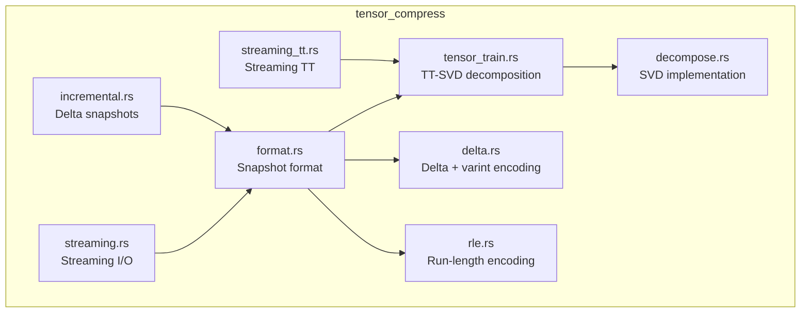
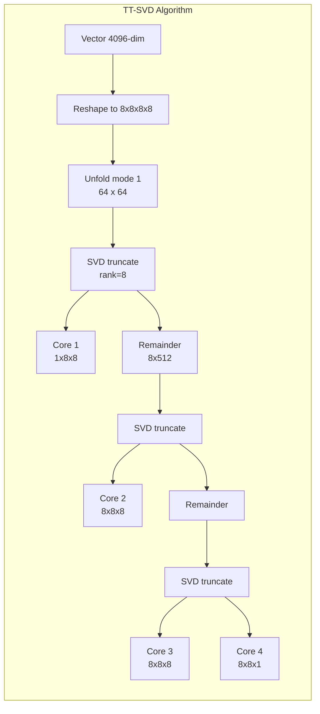
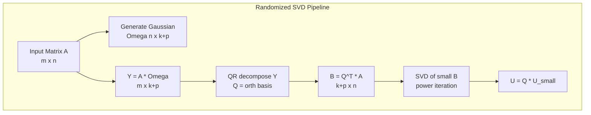
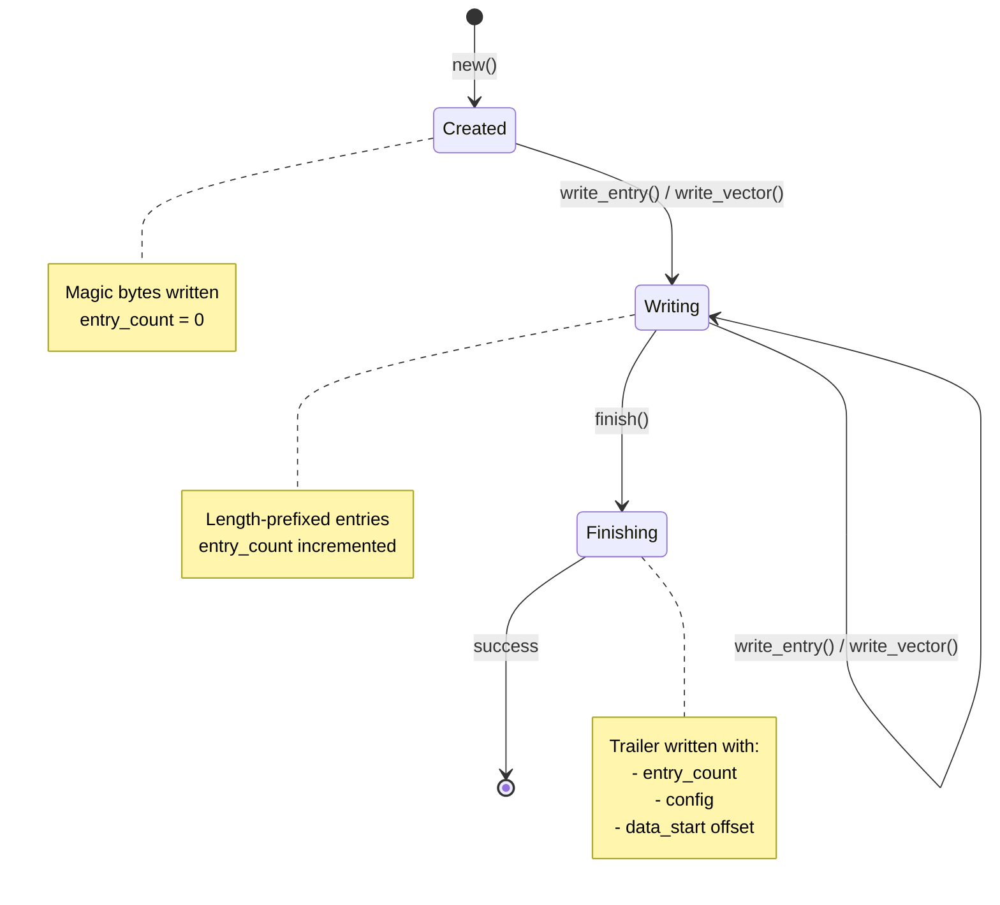
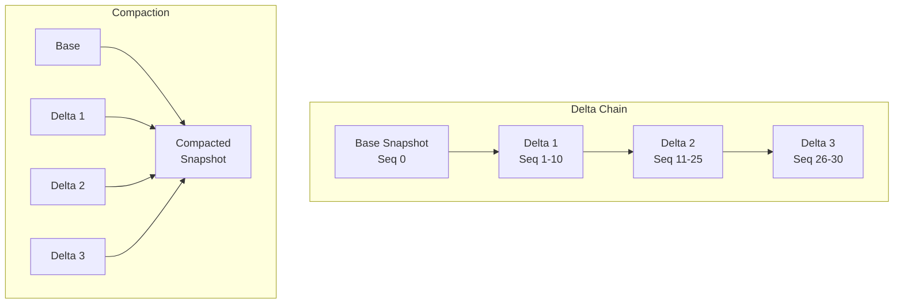
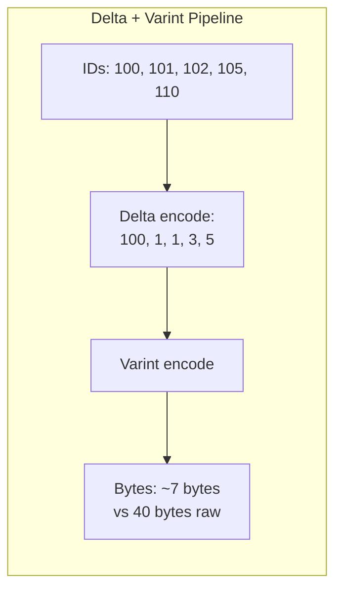

# Tensor Compress

Module 8 of Neumann. Provides tensor-native compression exploiting the mathematical structure of high-dimensional embeddings.

The primary compression method is Tensor Train (TT) decomposition, which decomposes vectors reshaped as tensors into a chain of smaller 3D cores using successive SVD truncations. This achieves 10-40x compression for 1024+ dimension vectors while enabling similarity computations directly in compressed space.

## Design Principles

1. **Tensor Mathematics**: Uses Tensor Train decomposition to exploit low-rank structure
2. **Higher Dimensions Are Lower**: Decomposes vectors into products of smaller tensors
3. **Streaming I/O**: Process large snapshots without loading entire dataset
4. **Incremental Updates**: Delta snapshots for efficient replication
5. **Pure Rust**: No external LAPACK/BLAS dependencies - fully portable

## Key Types

| Type | Description |
|------|-------------|
| `TTVector` | Complete TT-decomposition of a vector with cores, shape, and ranks |
| `TTCore` | Single 3D tensor core (left_rank x mode_size x right_rank) |
| `TTConfig` | Configuration for TT decomposition (shape, max_rank, tolerance) |
| `CompressionConfig` | Snapshot compression settings (tensor mode, delta, RLE) |
| `TensorMode` | Compression mode enum (currently TensorTrain variant) |
| `RleEncoded<T>` | Run-length encoded data with values and run lengths |
| `DeltaSnapshot` | Snapshot containing only changes since a base snapshot |
| `DeltaChain` | Chain of deltas with efficient lookup and compaction |
| `StreamingWriter` | Memory-bounded incremental snapshot writer |
| `StreamingReader` | Iterator-based snapshot reader |
| `StreamingTTWriter` | Streaming TT-compressed vector writer |
| `StreamingTTReader` | Streaming TT-compressed vector reader |
| `Matrix` | Row-major matrix for SVD operations |
| `SvdResult` | Truncated SVD result (U, S, Vt matrices) |
| `TensorView` | Zero-copy logical view of tensor data |
| `DeltaBuilder` | Builder for creating delta snapshots |

## Error Types

| Error | Description |
|-------|-------------|
| `TTError::ShapeMismatch` | Vector dimension doesn't match reshape target |
| `TTError::EmptyVector` | Cannot decompose empty vector |
| `TTError::InvalidRank` | TT-rank must be >= 1 |
| `TTError::IncompatibleShapes` | TT vectors have different shapes for operation |
| `TTError::InvalidShape` | Shape contains zero or is empty |
| `TTError::InvalidTolerance` | Tolerance must be 0 < tol <= 1 |
| `TTError::Decompose` | SVD decomposition failed |
| `FormatError::InvalidMagic` | File magic bytes don't match expected |
| `FormatError::UnsupportedVersion` | Format version is newer than supported |
| `FormatError::Serialization` | Bincode serialization/deserialization error |
| `DeltaError::BaseNotFound` | Referenced base snapshot doesn't exist |
| `DeltaError::SequenceGap` | Delta sequence numbers have gaps |
| `DeltaError::ChainTooLong` | Delta chain exceeds maximum length |
| `DecomposeError::EmptyMatrix` | Cannot decompose empty matrix |
| `DecomposeError::DimensionMismatch` | Matrix dimensions don't match for operation |
| `DecomposeError::SvdNotConverged` | SVD iteration didn't converge |

## Architecture



## Tensor Train Decomposition

### Algorithm Overview

The TT-SVD algorithm (Oseledets 2011) decomposes a vector by:

1. **Reshape**: Convert 1D vector to multi-dimensional tensor
2. **Left-to-right sweep**: For each mode k from 1 to n-1:
   - Left-unfold the current tensor into a matrix
   - Compute truncated SVD: A = U * S * Vt
   - Store U as the k-th core
   - Multiply S * Vt to get the remainder for next iteration
3. **Final core**: The last remainder becomes the final core



### Compression Example

For a 4096-dim embedding reshaped to (8, 8, 8, 8):

```
Original: 4096 floats = 16 KB
TT-cores: 1x8x8 + 8x8x8 + 8x8x8 + 8x8x1 = 64 + 512 + 512 + 64 = 1152 floats
With max_rank=8: 1x8x4 + 4x8x4 + 4x8x4 + 4x8x1 = 32 + 128 + 128 + 32 = 320 floats = 1.25 KB
Compression: 12.8x
```

### SVD Implementation Details

The module implements two SVD algorithms:

**1. Power Iteration with Deflation (small matrices)**

Used when matrix dimensions are <= 32 or rank is close to matrix size:

```rust
// Simplified power iteration
fn power_iteration(a: &Matrix, max_iter: usize, tol: f32) -> (sigma, u, v) {
    // Initialize v randomly (deterministic seed)
    let mut v: Vec<f32> = (0..cols).map(|i| ((i * 7 + 3) % 13) as f32 / 13.0 - 0.5).collect();
    normalize(&mut v);

    for _ in 0..max_iter {
        // u = A * v, then normalize
        u = matmul(a, v);
        new_sigma = normalize(&mut u);

        // v = A^T * u, then normalize
        v = matmul_transpose(a, u);
        normalize(&mut v);

        // Check convergence
        if (new_sigma - sigma).abs() < tol * sigma.max(1.0) {
            return (new_sigma, u, v);
        }
        sigma = new_sigma;
    }
}
```

After finding each singular triplet, the algorithm deflates: A = A - sigma * u * vT

**2. Randomized SVD (large matrices)**

Uses the Halko-Martinsson-Tropp 2011 algorithm for matrices > 32 dimensions:



Key implementation details:

- **Gaussian matrix generation**: Uses a Linear Congruential Generator (LCG) with Box-Muller transform for deterministic, portable random numbers
- **QR orthonormalization**: Modified Gram-Schmidt for numerical stability
- **Oversampling**: Adds 5 extra columns to improve accuracy
- **Convergence**: 20 iterations max (sufficient for embedding vectors)

```rust
// LCG parameters from Numerical Recipes
fn lcg_next(state: &mut u64) -> u64 {
    *state = state.wrapping_mul(6_364_136_223_846_793_005)
                  .wrapping_add(1_442_695_040_888_963_407);
    *state
}

// Box-Muller transform for Gaussian
fn box_muller(u1: f32, u2: f32) -> (f32, f32) {
    let r = (-2.0 * u1.ln()).sqrt();
    let theta = 2.0 * PI * u2;
    (r * theta.cos(), r * theta.sin())
}
```

### Optimal Shape Selection

The module includes hardcoded optimal shapes for common embedding dimensions:

| Dimension | Shape | Why |
|-----------|-------|-----|
| 64 | [4, 4, 4] | 3 balanced factors |
| 128 | [4, 4, 8] | Near-balanced |
| 256 | [4, 8, 8] | Near-balanced |
| 384 | [4, 8, 12] | all-MiniLM-L6-v2 |
| 512 | [8, 8, 8] | Perfect cube |
| 768 | [8, 8, 12] | BERT dimension |
| 1024 | [8, 8, 16] | Common LLM size |
| 1536 | [8, 12, 16] | OpenAI ada-002 |
| 2048 | [8, 16, 16] | Near-balanced |
| 3072 | [8, 16, 24] | Large models |
| 4096 | [8, 8, 8, 8] | 4D balanced |
| 8192 | [8, 8, 8, 16] | Extra large |

For non-standard dimensions, `factorize_balanced` finds factors close to the nth root:

```rust
fn factorize_balanced(n: usize) -> Vec<usize> {
    // Target 2-6 factors based on log2(n)
    let target_factors = (ln(n) / ln(2)).ceil().clamp(2, 6);
    let target_size = n^(1/target_factors);

    // Greedily find factors close to target_size
    // ...
}
```

### TT Operations

| Function | Description | Complexity |
|----------|-------------|------------|
| `tt_decompose` | Decompose vector to TT format | O(n * d * r^2) |
| `tt_decompose_batch` | Parallel batch decomposition (4+ vectors) | O(batch * n * d * r^2 / threads) |
| `tt_reconstruct` | Reconstruct vector from TT | O(d^n * r^2) |
| `tt_dot_product` | Dot product in TT space | O(n * d * r^4) |
| `tt_dot_product_batch` | Batch dot products | Parallel when >= 4 targets |
| `tt_cosine_similarity` | Cosine similarity in TT space | O(n * d * r^4) |
| `tt_cosine_similarity_batch` | Batch cosine similarities | Parallel when >= 4 targets |
| `tt_euclidean_distance` | Euclidean distance in TT space | O(n * d * r^4) |
| `tt_euclidean_distance_batch` | Batch Euclidean distances | Parallel when >= 4 targets |
| `tt_norm` | L2 norm of TT vector | O(n * d * r^4) |
| `tt_scale` | Scale TT vector by constant | O(cores[0].size) |

Where: n = number of modes, d = mode size, r = TT-rank

### TT Gram Matrix Computation

Computing dot products and norms in TT space uses the Gram matrix approach:

```rust
// Gram matrix propagation for dot product
fn tt_dot_product(a: &TTVector, b: &TTVector) -> f32 {
    let mut gram = vec![1.0f32];  // Start with 1x1 identity

    for (core_a, core_b) in a.cores.iter().zip(b.cores.iter()) {
        let (r1a, n, r2a) = core_a.shape;
        let (r1b, _, r2b) = core_b.shape;
        let mut new_gram = vec![0.0; r2a * r2b];

        // Contract: new_gram[a,b] = sum_{k,i,j} gram[i,j] * A[i,k,a] * B[j,k,b]
        for a_idx in 0..r2a {
            for b_idx in 0..r2b {
                for k in 0..n {
                    for ia in 0..r1a {
                        for ib in 0..r1b {
                            let g = gram[ia * r1b + ib];
                            new_gram[a_idx * r2b + b_idx] +=
                                g * core_a.get(ia, k, a_idx) * core_b.get(ib, k, b_idx);
                        }
                    }
                }
            }
        }
        gram = new_gram;
    }

    gram[0]  // Final 1x1 Gram matrix
}
```

### Usage

```rust
use tensor_compress::{tt_decompose, tt_reconstruct, tt_cosine_similarity, TTConfig};

let embedding: Vec<f32> = get_embedding();  // 4096-dim
let config = TTConfig::for_dim(4096)?;

// Decompose
let tt = tt_decompose(&embedding, &config)?;
println!("Compression: {:.1}x", tt.compression_ratio());
println!("Storage: {} floats", tt.storage_size());
println!("Max rank: {}", tt.max_rank());

// Reconstruct
let restored = tt_reconstruct(&tt);

// Compute similarity without reconstruction
let tt2 = tt_decompose(&other_embedding, &config)?;
let sim = tt_cosine_similarity(&tt, &tt2)?;
```

### Batch Operations

Batch operations use rayon for parallel processing when handling 4+ vectors:

```rust
use tensor_compress::{tt_decompose_batch, tt_cosine_similarity_batch, TTConfig};

let vectors: Vec<Vec<f32>> = load_embeddings();
let config = TTConfig::for_dim(4096)?;

// Batch decompose (parallel for 4+ vectors)
let refs: Vec<&[f32]> = vectors.iter().map(|v| v.as_slice()).collect();
let tts = tt_decompose_batch(&refs, &config)?;

// Batch similarity search
let query_tt = &tts[0];
let similarities = tt_cosine_similarity_batch(query_tt, &tts[1..])?;

// Find top-k
let mut indexed: Vec<_> = similarities.iter().enumerate().collect();
indexed.sort_by(|a, b| b.1.partial_cmp(a.1).unwrap());
let top_5: Vec<_> = indexed.iter().take(5).collect();
```

The parallel threshold constant is:

```rust
const PARALLEL_THRESHOLD: usize = 4;
```

## Configuration

### TTConfig Presets

| Preset | max_rank | tolerance | Use Case |
|--------|----------|-----------|----------|
| `for_dim(d)` | 8 | 1e-4 | Balanced compression/accuracy |
| `high_compression(d)` | 4 | 1e-2 | Maximize compression (2-3x more) |
| `high_accuracy(d)` | 16 | 1e-6 | Maximize accuracy (<0.1% error) |

### TTConfig Validation

```rust
impl TTConfig {
    pub fn validate(&self) -> Result<(), TTError> {
        if self.shape.is_empty() {
            return Err(TTError::InvalidShape("empty shape".into()));
        }
        if self.shape.contains(&0) {
            return Err(TTError::InvalidShape("shape contains zero".into()));
        }
        if self.max_rank < 1 {
            return Err(TTError::InvalidRank);
        }
        if self.tolerance <= 0.0 || self.tolerance > 1.0 || !self.tolerance.is_finite() {
            return Err(TTError::InvalidTolerance(self.tolerance));
        }
        Ok(())
    }
}
```

### CompressionConfig

```rust
pub struct CompressionConfig {
    pub tensor_mode: Option<TensorMode>,  // TT compression for vectors
    pub delta_encoding: bool,             // For sorted ID lists
    pub rle_encoding: bool,               // For repeated values
}

// Presets
CompressionConfig::high_compression()  // max_rank=4, all encodings enabled
CompressionConfig::balanced(dim)       // max_rank=8, all encodings enabled
CompressionConfig::high_accuracy(dim)  // max_rank=16, all encodings enabled
```

### Dimension Presets

| Constant | Value | Model |
|----------|-------|-------|
| `SMALL` | 64 | MiniLM and small models |
| `MEDIUM` | 384 | all-MiniLM-L6-v2 |
| `STANDARD` | 768 | BERT, sentence-transformers |
| `LARGE` | 1536 | OpenAI text-embedding-ada-002 |
| `XLARGE` | 4096 | LLaMA and large models |

## Streaming Operations

### State Machine



### File Format

Uses a trailer-based header so entry count is known at the end:

```
+------------------------+
| Magic (NEUS/NEUT)  4B  |  Identifies streaming snapshot/TT
+------------------------+
| Entry 1 length     4B  |  Little-endian u32
+------------------------+
| Entry 1 data      var  |  Bincode-serialized entry
+------------------------+
| Entry 2 length     4B  |
+------------------------+
| Entry 2 data      var  |
+------------------------+
| ...                    |
+------------------------+
| Trailer           var  |  Bincode-serialized header
+------------------------+
| Trailer size       8B  |  Little-endian u64
+------------------------+
```

**Security limits:**
- Maximum trailer size: 1 MB (`MAX_TRAILER_SIZE`)
- Maximum entry size: 100 MB (`MAX_ENTRY_SIZE`)

### Usage

```rust
use tensor_compress::streaming::{StreamingWriter, StreamingReader};

// Write entries one at a time
let mut writer = StreamingWriter::new(file, config)?;
for entry in entries {
    writer.write_entry(&entry)?;
}
writer.finish()?;

// Read entries one at a time (iterator-based)
let reader = StreamingReader::open(file)?;
println!("Entry count: {}", reader.entry_count());
for entry in reader {
    process(entry?);
}
```

### Streaming TT Operations

| Function | Description |
|----------|-------------|
| `StreamingTTWriter::new` | Create TT streaming writer |
| `StreamingTTWriter::write_vector` | Decompose and write vector |
| `StreamingTTWriter::write_tt` | Write pre-decomposed TT |
| `StreamingTTWriter::finish` | Finalize with trailer |
| `StreamingTTReader::open` | Open TT streaming file |
| `streaming_tt_similarity_search` | Search streaming TT file |
| `convert_vectors_to_streaming_tt` | Batch convert vectors |
| `read_streaming_tt_all` | Load all TT vectors |

```rust
use tensor_compress::streaming_tt::{StreamingTTWriter, StreamingTTReader,
    streaming_tt_similarity_search};

// Create streaming TT file
let config = TTConfig::for_dim(768)?;
let mut writer = StreamingTTWriter::new(file, config.clone())?;

for vector in vectors {
    writer.write_vector(&vector)?;  // Decompose on-the-fly
}
writer.finish()?;

// Similarity search without loading all into memory
let query_tt = tt_decompose(&query, &config)?;
let top_10 = streaming_tt_similarity_search(file, &query_tt, 10)?;
// Returns Vec<(index, similarity)> sorted by descending similarity
```

### Merge and Convert Operations

```rust
use tensor_compress::streaming::{convert_to_streaming, read_streaming_to_snapshot,
    merge_streaming};

// Convert non-streaming snapshot to streaming format
let count = convert_to_streaming(&snapshot, output_file)?;

// Read streaming format into full snapshot (for compatibility)
let snapshot = read_streaming_to_snapshot(file)?;

// Merge multiple streaming snapshots
let count = merge_streaming(vec![file1, file2, file3], output, config)?;
```

## Incremental Updates

### Delta Snapshot Architecture



### Delta Entry Types

```rust
pub enum ChangeType {
    Put,    // Entry was added or updated
    Delete, // Entry was deleted
}

pub struct DeltaEntry {
    pub key: String,
    pub change: ChangeType,
    pub value: Option<CompressedEntry>,  // None for Delete
    pub sequence: u64,
}
```

### Usage

```rust
use tensor_compress::incremental::{DeltaBuilder, DeltaChain, apply_delta,
    merge_deltas, diff_snapshots};

// Create delta
let mut builder = DeltaBuilder::new("base_snapshot_id", sequence);
builder.put("key1", entry1);
builder.delete("key2");
let delta = builder.build();

// Apply delta
let new_snapshot = apply_delta(&base, &delta)?;

// Chain management
let mut chain = DeltaChain::new(base_snapshot);
chain.push(delta1)?;
chain.push(delta2)?;
let value = chain.get("key1");  // Checks chain then base

// Compact when chain grows long
if chain.should_compact(10) {
    let compacted = chain.compact()?;
}

// Compare two snapshots
let delta = diff_snapshots(&old_snapshot, &new_snapshot, "old_id")?;

// Merge multiple deltas into one
let merged = merge_deltas(&[delta1, delta2, delta3])?;
```

### Delta Operations

| Function | Description |
|----------|-------------|
| `DeltaBuilder::new` | Create delta builder with base ID and start sequence |
| `DeltaBuilder::put` | Record a put (add/update) change |
| `DeltaBuilder::delete` | Record a delete change |
| `DeltaBuilder::build` | Build the delta snapshot |
| `apply_delta` | Apply delta to base snapshot |
| `merge_deltas` | Merge multiple deltas (keeps latest state per key) |
| `diff_snapshots` | Compute delta between two snapshots |
| `DeltaChain::get` | Get current state of key (checks chain then base) |
| `DeltaChain::compact` | Compact all deltas into new base |
| `DeltaChain::should_compact` | Check if compaction is recommended |

### Delta Format

```
+------------------------+
| Magic (NEUD)       4B  |
+------------------------+
| Version            2B  |
+------------------------+
| Base ID           var  |  String (length-prefixed)
+------------------------+
| Sequence Range     16B |  (start, end) u64 pair
+------------------------+
| Change Count        8B |
+------------------------+
| Created At          8B |  Unix timestamp
+------------------------+
| Entries           var  |  Bincode-serialized Vec<DeltaEntry>
+------------------------+
```

## Lossless Compression

### Delta + Varint Encoding

For sorted integer sequences (node IDs, timestamps):



**Algorithm:**

```rust
// Delta encoding: store first value, then differences
pub fn delta_encode(ids: &[u64]) -> Vec<u64> {
    let mut result = vec![ids[0]];
    for window in ids.windows(2) {
        result.push(window[1].saturating_sub(window[0]));
    }
    result
}

// Varint encoding: 7 bits per byte, high bit = continuation
pub fn varint_encode(values: &[u64]) -> Vec<u8> {
    let mut result = Vec::with_capacity(values.len() * 2);
    for &value in values {
        let mut v = value;
        loop {
            let byte = (v & 0x7f) as u8;
            v >>= 7;
            if v == 0 {
                result.push(byte);  // Final byte (no continuation)
                break;
            }
            result.push(byte | 0x80);  // Continuation bit set
        }
    }
    result
}
```

**Usage:**

```rust
use tensor_compress::{compress_ids, decompress_ids};

let ids: Vec<u64> = (1000..2000).collect();
let compressed = compress_ids(&ids);  // ~100 bytes vs 8000

let restored = decompress_ids(&compressed);
assert_eq!(ids, restored);
```

**Varint byte sizes:**

| Value Range | Bytes |
|-------------|-------|
| 0 - 127 | 1 |
| 128 - 16,383 | 2 |
| 16,384 - 2,097,151 | 3 |
| 2,097,152 - 268,435,455 | 4 |
| ... up to u64::MAX | 10 |

### Run-Length Encoding

For repeated values:

```rust
use tensor_compress::{rle_encode, rle_decode};

let statuses = vec!["active"; 1000];
let encoded = rle_encode(&statuses);
assert_eq!(encoded.runs(), 1);  // Single run

// Storage: 1 string + 1 u32 = ~12 bytes vs 6000+ bytes
```

**Internal representation:**

```rust
pub struct RleEncoded<T: Eq> {
    pub values: Vec<T>,      // Unique values in order
    pub run_lengths: Vec<u32>, // Count for each value
}
```

**Compression scenarios:**

| Data Pattern | Runs | Compression |
|--------------|------|-------------|
| [5, 5, 5, 5, 5] (1000x) | 1 | 500x |
| [1, 2, 3, 4, 5] (all different) | 5 | 0.8x (overhead) |
| [1, 1, 2, 2, 2, 3, 1, 1, 1, 1] | 4 | 2.5x |
| Status column (pending/active/done) | ~300 per 10000 | ~33x |

### Sparse Vector Format

For vectors with >50% zeros:

```rust
use tensor_compress::{compress_sparse, compress_dense_as_sparse,
    should_use_sparse, should_use_sparse_threshold};

// Direct sparse compression
let positions = vec![0, 50, 99];
let values = vec![1.0, 2.0, 3.0];
let compressed = compress_sparse(100, &positions, &values);

// Auto-detect and compress
if should_use_sparse_threshold(&vector, 0.5) {
    let compressed = compress_dense_as_sparse(&vector);
}

// Check if sparse is beneficial
if should_use_sparse(dimension, non_zero_count) {
    // Use sparse format
}
```

**Storage calculation:**

```rust
// sparse_storage_size = 8 + 8 + nnz*2 + nnz*4 = 16 + nnz*6
// Dense storage = dimension * 4

// Sparse is better when: 16 + nnz*6 < dimension*4
// Solving: nnz < (dimension*4 - 16) / 6 = dimension*0.67 - 2.67
```

| Dimension | Max NNZ for Sparse | Sparsity Threshold |
|-----------|-------------------|-------------------|
| 100 | 64 | 64% |
| 1000 | 664 | 66.4% |
| 4096 | 2728 | 66.6% |

## Compressed Value Types

```rust
pub enum CompressedValue {
    Scalar(CompressedScalar),           // Int, Float, String, Bool, Null
    VectorRaw(Vec<f32>),                // Uncompressed
    VectorTT { cores, original_dim, shape, ranks },  // TT-compressed
    VectorSparse { dimension, positions, values },   // Sparse
    IdList(Vec<u8>),                    // Delta + varint encoded
    RleInt(RleEncoded<i64>),            // RLE encoded integers
    Pointer(String),                    // Single pointer
    Pointers(Vec<String>),              // Multiple pointers
}
```

### Automatic Format Selection

```rust
pub fn compress_vector(vector: &[f32], key: &str, field_name: &str,
    config: &CompressionConfig) -> Result<CompressedValue, FormatError> {

    // 1. Check for embedding-like keys
    let is_embedding = key.starts_with("emb:") ||
                       field_name == "_embedding" ||
                       field_name == "vector";

    if is_embedding {
        if let Some(TensorMode::TensorTrain(tt_config)) = &config.tensor_mode {
            return Ok(CompressedValue::VectorTT { ... });
        }
    }

    // 2. Check for ID list pattern
    if config.delta_encoding && looks_like_id_list(vector, field_name) {
        return Ok(CompressedValue::IdList(...));
    }

    // 3. Fall back to raw
    Ok(CompressedValue::VectorRaw(vector.to_vec()))
}
```

## Performance

Benchmarks on Apple M4 (aarch64, MacBook Air 24GB), release build:

| Dimension | Decompose | Reconstruct | Similarity | Compression |
|-----------|-----------|-------------|------------|-------------|
| 64 | 6.2 us | 29.5 us | 1.1 us | 2.0x |
| 256 | 13.4 us | 113.0 us | 1.5 us | 4.6x |
| 768 | 26.9 us | 431.7 us | 2.4 us | 10.7x |
| 1536 | 62.0 us | 709.8 us | 2.0 us | 16.0x |
| 4096 | 464.5 us | 2142.2 us | 2.4 us | 42.7x |

Batch operations (768-dim, 1000 vectors):

| Operation | Time | Per-vector |
|-----------|------|------------|
| `tt_decompose_batch` | 21 ms | 21.0 us |
| `tt_cosine_similarity_batch` | 11.3 ms | 11.4 us |

Throughput: **39,318 vectors/sec** (768-dim decomposition)

### Industry Comparison

| Method | Compression | Recall | Notes |
|--------|-------------|--------|-------|
| **Tensor Train (this)** | 10-42x | ~99% | Similarity in compressed space |
| Scalar Quantization | 4x | 99%+ | Industry default |
| Product Quantization | 16-64x | 56-90% | Requires training |
| Binary Quantization | 32x | 80-95% | Speed-optimized |

## Edge Cases and Gotchas

### Vector Content Patterns

| Pattern | Compression | Reconstruction | Notes |
|---------|-------------|----------------|-------|
| Constant (all same) | Excellent (>5x) | Accurate | Rank-1 structure |
| All zeros | Good | Accurate | Degenerate case |
| Single spike | Poor | Moderate | No low-rank structure |
| Linear ramp | Good (>2x) | Good | Low-rank |
| Alternating +1/-1 | Poor | Moderate | High-frequency needs high rank |
| Random dense | Good | Good (>0.9 cosine) | Typical embeddings |
| 90% zeros | Consider sparse instead | n/a | Use `compress_dense_as_sparse` |

### Numerical Edge Cases

```rust
// Very small values (denormalized floats)
let tiny: Vec<f32> = (0..64).map(|i| (i as f32) * 1e-38).collect();
// Works, but may lose precision

// Large values (1e6 range)
let large: Vec<f32> = (0..64).map(|i| (i as f32) * 1e6).collect();
// Works, no overflow

// Prime dimensions
let prime_127: Vec<f32> = (0..127).map(|i| (i as f32 * 0.1).sin()).collect();
// Works but may have poor compression
```

### Streaming Gotchas

1. **Incomplete files**: Magic bytes are written first, but entry count is in trailer. If writer crashes before `finish()`, the file is corrupt.

2. **Memory limits**: `MAX_ENTRY_SIZE = 100MB` and `MAX_TRAILER_SIZE = 1MB` prevent allocation attacks. Exceeding these returns an error.

3. **Seek requirement**: `StreamingReader::open` requires `Seek` to read the trailer. For non-seekable streams, use `read_streaming_to_snapshot` which buffers.

### Delta Chain Gotchas

1. **Chain length**: Default `max_chain_len = 100`. After this, `push()` returns `ChainTooLong` error. Call `compact()` periodically.

2. **Sequence gaps**: Deltas should have contiguous sequences. The `merge_deltas` function only keeps the latest state per key.

3. **Base reference**: Deltas store a `base_id` string but don't validate it exists. Your application must track base snapshots.

## Performance Tips and Best Practices

### Choosing Configuration

```rust
// For search/retrieval (similarity queries)
let config = TTConfig::for_dim(dim)?;  // Balanced

// For archival/cold storage
let config = TTConfig::high_compression(dim)?;  // Smaller, slower queries

// For real-time applications
let config = TTConfig::high_accuracy(dim)?;  // Larger, faster queries
```

### Batch Size Optimization

```rust
// Below parallel threshold (4), sequential is faster
// due to thread spawn overhead
let small_batch = tt_decompose_batch(&vectors[..3], &config);  // Sequential

// At threshold, parallel kicks in
let large_batch = tt_decompose_batch(&vectors, &config);  // Parallel if >= 4
```

### Memory Efficiency

```rust
// Bad: Load all, then process
let all_vectors = read_streaming_tt_all(file)?;  // Loads all into memory

// Good: Stream process
for tt in StreamingTTReader::open(file)? {
    process(tt?);  // One at a time
}

// Best: Use streaming search
let results = streaming_tt_similarity_search(file, &query_tt, 10)?;
```

### Delta Compaction Strategy

```rust
let mut chain = DeltaChain::new(base);

// After N deltas or M total changes
if chain.len() >= 10 || total_changes >= 10000 {
    let new_base = chain.compact()?;
    chain = DeltaChain::new(new_base);
}
```

## Dependencies

- `serde`: Serialization traits
- `bincode`: Binary format
- `thiserror`: Error types
- `rayon`: Parallel batch operations

No external LAPACK/BLAS - pure Rust SVD implementation.

## Related Modules

| Module | Relationship |
|--------|--------------|
| [tensor_store](tensor-store.md) | Uses compression for snapshot I/O |
| [tensor_chain](tensor-chain.md) | Delta compression for state replication |
| [tensor_checkpoint](tensor-checkpoint.md) | Snapshot format integration |
