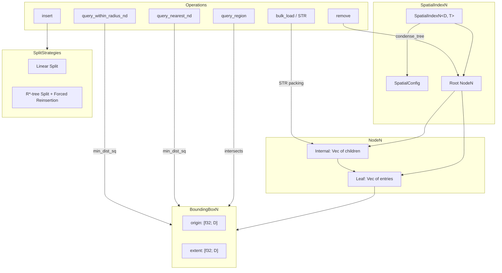

# Tensor Spatial

R-tree spatial index for region, radius, and nearest-neighbor queries
in N-dimensional space.

The tensor_spatial crate provides a generic R-tree parameterized by
`const D: usize` for the spatial dimension and `T` for user data.
It supports linear and R\*-tree split strategies, configurable node
fanout, bulk loading via Sort-Tile-Recursive (STR), and bitcode-based
serialization with backward-compatible versioning.

## Design Principles

| Principle | Description |
| --- | --- |
| Generic N-Dimensional | Const-generic `D` parameter; 2D and 3D via type aliases |
| Dual Split Strategies | Linear O(n) and R\*-tree overlap-minimizing splits |
| Branchless Distance | `min_dist_sq` uses `f32::max` for auto-vectorization |
| Configurable Fanout | Node capacity tunable via `SpatialConfig` (min 4) |
| STR Bulk Loading | Sort-Tile-Recursive packing for read-heavy workloads |
| No Internal Locking | Wrap in `Arc<RwLock<>>` for concurrent access |
| Versioned Serde | v2 (legacy Linear) and v3 (strategy-aware) formats |

## Key Types

| Type | Description |
| --- | --- |
| `BoundingBoxN<D>` | Axis-aligned bounding box (origin + extent) |
| `SpatialEntryN<D, T>` | Bounding box paired with user data |
| `SpatialIndexN<D, T>` | R-tree index; the main query/insert API |
| `SpatialIterN<D, T>` | Iterator over entry references |
| `SpatialConfig` | Node capacity and split strategy configuration |
| `SplitStrategy` | Enum: `Linear` or `RStar` (default) |
| `SpatialError` | Error type for bounds, config, and lookup failures |

### Type Aliases

| Alias | Expands To |
| --- | --- |
| `BoundingBox` | `BoundingBoxN<2>` |
| `BoundingBox3D` | `BoundingBoxN<3>` |
| `SpatialEntry<T>` | `SpatialEntryN<2, T>` |
| `SpatialEntry3D<T>` | `SpatialEntryN<3, T>` |
| `SpatialIndex<T>` | `SpatialIndexN<2, T>` |
| `SpatialIndex3D<T>` | `SpatialIndexN<3, T>` |
| `SpatialIter<T>` | `SpatialIterN<2, T>` |

### Error Variants

| Variant | Cause |
| --- | --- |
| `InvalidBounds` | Negative extent in bounding box constructor |
| `NotFound` | Entry not found during removal |
| `InvalidRadius` | Negative, NaN, or infinite radius |
| `InvalidBounds3D` | Negative extent in 3D constructor |
| `InvalidConfig` | `max_entries < 4` |

## Architecture



## Modules

| Module | Purpose |
| --- | --- |
| `bbox` | `BoundingBoxN`, `SpatialEntryN`, serde, 2D/3D accessors |
| `index` | `SpatialIndexN`, insert/remove/query, bulk_load, serde |
| `node` | `NodeN` (Leaf/Internal), split algorithms, STR builder |
| `iter` | `SpatialIterN` depth-first entry iterator |
| `lib` | Config, strategy enum, type aliases, error types |

## Split Strategies

### Linear Split

Selects the two most separated entries as seeds, then greedily
assigns remaining entries to the seed whose bounding box grows least.
O(M) per split where M is the node capacity.

### R\*-tree Split

Evaluates candidate splits along each axis, choosing the partition
that minimizes overlap between the two resulting nodes. On first
overflow at each level, performs forced reinsertion of 30% of entries
(sorted by distance from center) before splitting, which improves
tree quality.

| Property | Linear | R\*-tree |
| --- | --- | --- |
| Split cost | O(M) | O(M * D * log M) |
| Query performance | Good | Better (less overlap) |
| Insert cost | Lower | Higher (reinsertion) |
| Default | No | Yes |

## Configuration

```rust
use tensor_spatial::{SpatialConfig, SplitStrategy};

// Default: max_entries=9, min_entries=4, RStar
let cfg = SpatialConfig::DEFAULT;

// Custom fanout
let cfg = SpatialConfig::new(16).unwrap(); // max=16, min=8

// Explicit strategy
let cfg = SpatialConfig::with_strategy(12, SplitStrategy::Linear)
    .unwrap();
```

Constraints:
- `max_entries >= 4`
- `min_entries` is always `max_entries / 2`

## Concurrency

`SpatialIndexN` has no internal synchronization. For concurrent
access, wrap in `Arc<parking_lot::RwLock<>>`:

```rust
use std::sync::Arc;
use parking_lot::RwLock;
use tensor_spatial::{SpatialIndex, SpatialEntry, BoundingBox};

let index = Arc::new(RwLock::new(SpatialIndex::<u32>::new()));

// Multiple concurrent readers:
let results = index.read().query_region(
    BoundingBox::new(0.0, 0.0, 10.0, 10.0).unwrap()
);

// Exclusive writer:
index.write().insert(SpatialEntry {
    bounds: BoundingBox::new(1.0, 2.0, 1.0, 1.0).unwrap(),
    data: 42,
});
```

## Serialization

Uses bitcode for compact binary serialization with versioned format:

| Version | Split Strategy | Compatibility |
| --- | --- | --- |
| v2 | Always `Linear` | Legacy indexes |
| v3 | Stored in header | Current default |

Deserialized v2 indexes preserve `Linear` strategy. New indexes
serialize as v3 with the configured strategy. Deserialization
validates all bounding box extents to reject corrupt data.

## Usage Examples

### 2D Insert and Query

```rust
use tensor_spatial::{BoundingBox, SpatialEntry, SpatialIndex};

let mut index = SpatialIndex::new();
index.insert(SpatialEntry {
    bounds: BoundingBox::new(10.0, 20.0, 5.0, 5.0).unwrap(),
    data: "building_a",
});

// Region query
let region = BoundingBox::new(8.0, 18.0, 10.0, 10.0).unwrap();
let hits = index.query_region(region);
assert_eq!(hits.len(), 1);

// Nearest neighbor
let nearest = index.query_nearest(12.0, 22.0, 3);

// Radius query
let within = index.query_within_radius(12.0, 22.0, 50.0);
```

### 3D Index

```rust
use tensor_spatial::{
    BoundingBox3D, SpatialEntry3D, SpatialIndex3D,
};

let mut index = SpatialIndex3D::new();
index.insert(SpatialEntry3D {
    bounds: BoundingBox3D::new(
        1.0, 2.0, 3.0, 1.0, 1.0, 1.0,
    ).unwrap(),
    data: "voxel",
});

let nearest = index.query_nearest_nd([1.5, 2.5, 3.5], 5);
```

### Bulk Loading

```rust
use tensor_spatial::{BoundingBox, SpatialEntry, SpatialIndex};

let entries: Vec<SpatialEntry<u32>> = (0..10_000)
    .map(|i| SpatialEntry {
        bounds: BoundingBox::new(
            i as f32, 0.0, 1.0, 1.0,
        ).unwrap(),
        data: i,
    })
    .collect();

// STR bulk load -- faster than repeated insert for static data
let index = SpatialIndex::bulk_load(entries);
```

### Removal

```rust
use tensor_spatial::{BoundingBox, SpatialEntry, SpatialIndex};

let mut index = SpatialIndex::new();
index.insert(SpatialEntry {
    bounds: BoundingBox::new(5.0, 5.0, 1.0, 1.0).unwrap(),
    data: 42u32,
});

// Remove by region + predicate
let region = BoundingBox::new(5.0, 5.0, 1.0, 1.0).unwrap();
index.remove(region, |e| e.data == 42).unwrap();
```

## Distance Computation

The `min_dist_sq_nd` method computes the squared Euclidean distance
from a point to the nearest edge of a bounding box. It uses a
branchless formulation:

```rust
let d = (origin - point).max(0.0) + (point - origin - extent).max(0.0);
sum = d.mul_add(d, sum);
```

On aarch64, LLVM compiles this to `fmaxnm` + `fmadd` instructions
with zero branches per dimension, enabling auto-vectorization for
higher dimensions.

## Dependencies

| Crate | Purpose |
| --- | --- |
| `thiserror` | Error derive macros |
| `serde` | Serialize/Deserialize traits |
| `bitcode` | Compact binary serialization (dev) |
| `criterion` | Benchmark harness (dev) |
| `parking_lot` | RwLock for concurrency tests (dev) |
| `rand` | Random data generation for tests/benchmarks (dev) |
