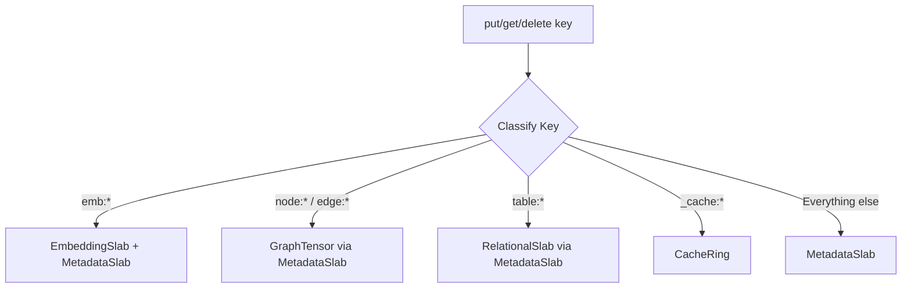
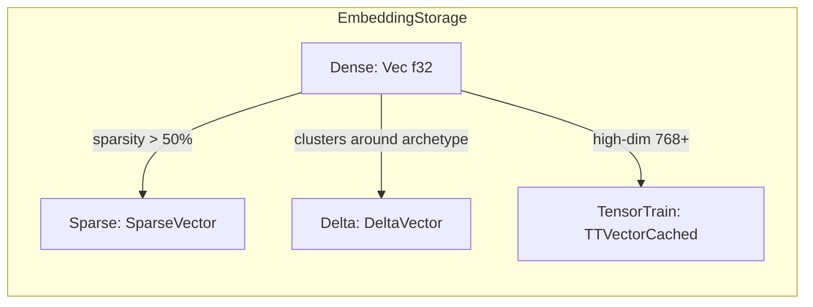
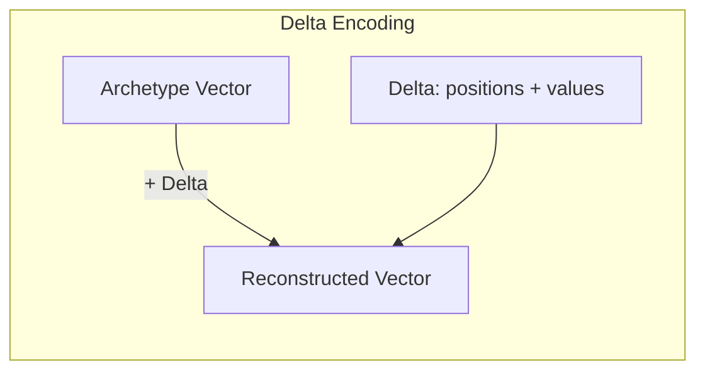
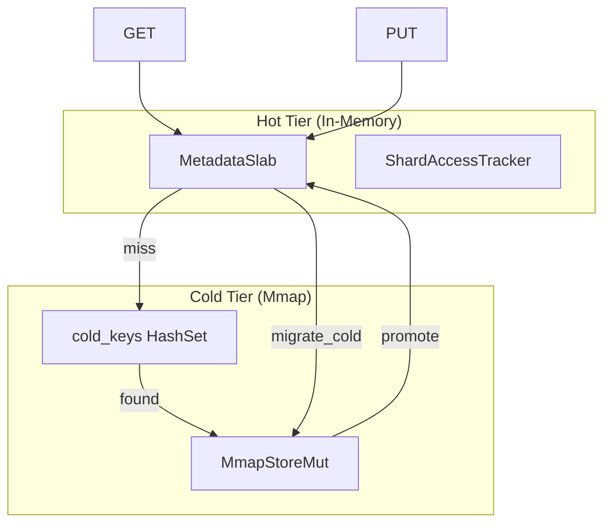

# Tensor Store Architecture

The tensor_store crate is the foundational storage layer for Neumann. It
provides a unified tensor-based key-value store that holds all data -
relational, graph, and vector - in a single mathematical structure. The store
knows nothing about queries; it purely stores and retrieves tensors by key.

The architecture uses SlabRouter internally, which routes operations to
specialized slabs based on key prefixes. This design eliminates hash table
resize stalls by using BTreeMap-based storage, providing predictable O(log n)
performance without the throughput cliffs caused by hash map resizing.

## Core Types

### TensorValue

Represents different types of values a tensor can hold.

| Variant | Rust Type | Use Case |
| --- | --- | --- |
| `Scalar(ScalarValue)` | enum | Properties (name, age, active) |
| `Vector(Vec<f32>)` | dense array | Embeddings for similarity search |
| `Sparse(SparseVector)` | compressed | Sparse embeddings (>70% zeros) |
| `Pointer(String)` | single ref | Single relationship to another tensor |
| `Pointers(Vec<String>)` | multi ref | Multiple relationships |

**Automatic Sparsification**: Use `TensorValue::from_embedding_auto(dense)` to
automatically choose between dense and sparse representation based on sparsity:

```rust
// Automatically uses Sparse if sparsity >= 70%
let val = TensorValue::from_embedding_auto(dense_vec);

// With custom thresholds (value_threshold, sparsity_threshold)
let val = TensorValue::from_embedding(dense_vec, 0.01, 0.8);
```

**Vector Operations**: TensorValue supports cross-format operations:

```rust
// Dot product works across Dense, Sparse, and mixed
let dot = tensor_a.dot(&tensor_b);

// Cosine similarity with automatic format handling
let sim = tensor_a.cosine_similarity(&tensor_b);
```

### ScalarValue

| Variant | Rust Type | Example |
| --- | --- | --- |
| `Null` | --- | Missing/undefined value |
| `Bool` | `bool` | `true`, `false` |
| `Int` | `i64` | `42`, `-1` |
| `Float` | `f64` | `3.14159` |
| `String` | `String` | `"Alice"` |
| `Bytes` | `Vec<u8>` | Raw binary data |

### TensorData

An entity that holds scalar properties, vector embeddings, and pointers to other
tensors via a `HashMap<String, TensorValue>` internally.

### Reserved Field Names

| Field | Purpose | Used By |
| --- | --- | --- |
| `_out` | Outgoing graph edge pointers | GraphEngine |
| `_in` | Incoming graph edge pointers | GraphEngine |
| `_embedding` | Vector embedding | VectorEngine |
| `_label` | Entity type/label | GraphEngine |
| `_type` | Discriminator field | All engines |
| `_from` | Edge source | GraphEngine |
| `_to` | Edge target | GraphEngine |
| `_edge_type` | Edge relationship type | GraphEngine |
| `_directed` | Edge direction flag | GraphEngine |
| `_table` | Table membership | RelationalEngine |
| `_id` | Entity ID | System |

## Architecture Diagram

```text
TensorStore
  |
  +-- Arc<SlabRouter>
         |
         +-- MetadataSlab (general key-value, BTreeMap-based)
         +-- EntityIndex (sorted vocabulary + hash index)
         +-- EmbeddingSlab (dense f32 arrays)
         +-- GraphTensor (CSR format for edges)
         +-- RelationalSlab (columnar storage)
         +-- CacheRing (LRU/LFU eviction)
         +-- BlobLog (append-only blob storage)
```

## SlabRouter Internals

SlabRouter is the core routing layer that directs operations to specialized
storage backends based on key prefixes.

### Key Routing Algorithm



### Key Classification

| Prefix | KeyClass | Slab | Purpose |
| --- | --- | --- | --- |
| `emb:*` | Embedding | EmbeddingSlab + EntityIndex | Embedding vectors with stable ID assignment |
| `node:*`, `edge:*` | Graph | MetadataSlab | Graph nodes and edges |
| `table:*` | Table | MetadataSlab | Relational rows |
| `_cache:*` | Cache | CacheRing | Cached data with eviction |
| `_blob:*` | Metadata | MetadataSlab | Blob metadata (chunks stored separately) |
| Everything else | Metadata | MetadataSlab | General key-value storage |

### SlabRouter Operation Flow

**PUT Operation**:

```rust
fn put(&self, key: &str, value: TensorData) {
    match classify_key(key) {
        KeyClass::Embedding => {
            // 1. Get or create stable entity ID
            let entity_id = self.index.get_or_create(key);
            // 2. Extract and store embedding vector
            if let Some(TensorValue::Vector(vec)) = value.get("_embedding") {
                self.embeddings.set(entity_id, vec);
            }
            // 3. Store full metadata
            self.metadata.set(key, value);
        }
        KeyClass::Cache => {
            let size = estimate_size(&value);
            self.cache.put(key, value, 1.0, size);
        }
        _ => self.metadata.set(key, value),
    }
}
```

**GET Operation**:

```rust
fn get(&self, key: &str) -> Result<TensorData> {
    match classify_key(key) {
        KeyClass::Embedding => {
            // Try to reconstruct from embedding slab + metadata
            if let Some(entity_id) = self.index.get(key) {
                if let Some(vector) = self.embeddings.get(entity_id) {
                    let mut data = self.metadata.get(key).unwrap_or_default();
                    data.set("_embedding", TensorValue::Vector(vector));
                    return Ok(data);
                }
            }
            self.metadata.get(key)
        }
        KeyClass::Cache => self.cache.get(key),
        _ => self.metadata.get(key),
    }
}
```

### Specialized Slabs

| Slab | Data Structure | Purpose |
| --- | --- | --- |
| `MetadataSlab` | `RwLock<BTreeMap<String, TensorData>>` | General key-value storage |
| `EntityIndex` | Sorted vocabulary + hash index | Stable ID assignment |
| `EmbeddingSlab` | Dense f32 arrays + BTreeMap | Embedding vectors |
| `GraphTensor` | CSR format (row pointers + column indices) | Graph edges |
| `RelationalSlab` | Columnar storage | Table rows |
| `CacheRing` | Ring buffer with LRU/LFU | Fixed-size cache |
| `BlobLog` | Append-only segments | Large binary data |

## Performance Characteristics

### Operation Complexity

| Operation | Time Complexity | Notes |
| --- | --- | --- |
| `put` | O(log n) | BTreeMap insert |
| `get` | O(log n) + clone | Clone prevents reference issues |
| `delete` | O(log n) | BTreeMap remove |
| `exists` | O(log n) | BTreeMap lookup |
| `scan` | O(k + log n) | BTreeMap range, k = result count |
| `scan_count` | O(k + log n) | No allocation |
| `scan_filter_map` | O(k + log n) | Single-pass filter with selective cloning |
| `len` | O(1) | Cached count |
| `clear` | O(n) | Clears all data |

### Throughput Comparison

| Metric | SlabRouter | Previous (DashMap) |
| --- | --- | --- |
| PUT throughput | 3.1+ M ops/sec | 2.5 M ops/sec |
| GET throughput | 4.9+ M ops/sec | 4.5 M ops/sec |
| Throughput variance (CV) | 12% steady-state | 222% during resize |
| Resize stalls | None | 99.6% throughput drops |

### Optimized Scan Performance

Use `scan_filter_map` for selective queries to avoid cloning non-matching
entries:

```rust
// Old path: 5000 clones for 5000 rows, ~2.6ms
let users = store.scan("users:");
let matches: Vec<_> = users.iter()
    .filter_map(|key| store.get(key).ok())
    .filter(|data| /* condition */)
    .collect();

// New path: 250 clones for 5% match rate, ~0.13ms (20x faster)
let matches = store.scan_filter_map("users:", |key, data| {
    if /* condition */ {
        Some(data.clone())
    } else {
        None
    }
});
```

## Concurrency Model

TensorStore uses tensor-based structures instead of hash maps for predictable
performance:

- **No Resize Stalls**: BTreeMap and sorted arrays grow incrementally
- **Lock-free Reads**: RwLock allows many concurrent readers
- **Predictable Writes**: O(log n) inserts, no amortized O(n) resizing
- **Clone on Read**: `get()` returns cloned data to avoid holding references
- **Shareable Storage**: TensorStore clones share the same underlying data via
  Arc

## BloomFilter

The BloomFilter provides O(1) probabilistic rejection of non-existent keys,
useful for sparse key spaces where most lookups are misses.

### Mathematical Foundation

The Bloom filter uses optimal parameters calculated as:

**Bit array size**: `m = -n * ln(p) / (ln(2)^2)`

- Where n = expected items, p = false positive rate

**Number of hash functions**: `k = (m/n) * ln(2)`

- Clamped to range [1, 16]

### Implementation Details

```rust
pub struct BloomFilter {
    bits: Box<[AtomicU64]>,  // Atomic u64 blocks for lock-free access
    num_bits: usize,
    num_hashes: usize,
}
```

**Hash Function**: Uses SipHash with different seeds for each hash function:

```rust
fn hash_index<K: Hash>(&self, key: &K, seed: usize) -> usize {
    let mut hasher = SipHasher::new_with_seed(seed as u64);
    key.hash(&mut hasher);
    (hasher.finish() as usize) % self.num_bits
}
```

### Parameter Tuning Guide

| Expected Items | FP Rate | Bits | Hash Functions | Memory |
| --- | --- | --- | --- | --- |
| 10,000 | 1% | 95,851 | 7 | ~12 KB |
| 10,000 | 0.1% | 143,776 | 10 | ~18 KB |
| 100,000 | 1% | 958,506 | 7 | ~117 KB |
| 1,000,000 | 1% | 9,585,059 | 7 | ~1.2 MB |

**Gotchas**:

- Bloom filter state is **not persisted** in snapshots; rebuild after load
- Thread-safe via AtomicU64 with Relaxed ordering (eventual consistency)
- Cannot remove items (use counting bloom filter for that case)
- False positive rate increases if more items than expected are inserted

## HNSW Index

Hierarchical Navigable Small World index for approximate nearest neighbor search
with O(log n) complexity.

### Algorithm Overview


### Layer Selection

New nodes are assigned layers using exponential distribution:

```rust
fn random_level(&self) -> usize {
    let f = random_float_0_1();
    let level = (-f.ln() * self.config.ml).floor() as usize;
    level.min(32)  // Cap at 32 layers
}
```

Where `ml = 1 / ln(m)` and m = connections per layer.

### HNSWConfig Parameters

| Parameter | Default | Description |
| --- | --- | --- |
| `m` | 16 | Max connections per node per layer |
| `m0` | 32 | Max connections at layer 0 (2*m) |
| `ef_construction` | 200 | Candidates during construction |
| `ef_search` | 50 | Candidates during search |
| `ml` | 1/ln(m) | Level multiplier |
| `sparsity_threshold` | 0.5 | Auto-sparse storage threshold |
| `max_nodes` | 10,000,000 | Capacity limit (prevents memory exhaustion) |

### Configuration Presets

```rust
// High recall (slower, more accurate)
HNSWConfig::high_recall()  // m=32, m0=64, ef_construction=400, ef_search=200

// High speed (faster, lower recall)
HNSWConfig::high_speed()   // m=8, m0=16, ef_construction=100, ef_search=20

// Custom configuration
HNSWConfig {
    m: 24,
    m0: 48,
    ef_construction: 300,
    ef_search: 100,
    ..Default::default()
}
```

### SIMD-Accelerated Distance

Dense vector operations use 8-wide SIMD (f32x8):

```rust
pub fn dot_product(a: &[f32], b: &[f32]) -> f32 {
    let chunks = a.len() / 8;
    let mut sum = f32x8::ZERO;

    for i in 0..chunks {
        let offset = i * 8;
        let va = f32x8::from(&a[offset..offset + 8]);
        let vb = f32x8::from(&b[offset..offset + 8]);
        sum += va * vb;
    }

    // Sum lanes and handle remainder
    let arr: [f32; 8] = sum.into();
    let mut result: f32 = arr.iter().sum();
    // ... scalar remainder handling
}
```

### Neighbor Compression

HNSW neighbor lists use delta-varint encoding for 3-8x compression:

```rust
struct CompressedNeighbors {
    compressed: Vec<u8>,  // Delta-varint encoded neighbor IDs
}

// Decompression: O(n) where n = neighbor count
fn get(&self) -> Vec<usize> {
    decompress_ids(&self.compressed)
}

// Compression: Sort + delta encode
fn set(&mut self, ids: &[usize]) {
    let mut sorted = ids.to_vec();
    sorted.sort_unstable();
    self.compressed = compress_ids(&sorted);
}
```

### Storage Types



| Storage Type | Memory | Use Case | Distance Computation |
| --- | --- | --- | --- |
| Dense | 4 bytes/dim | General purpose | SIMD dot product |
| Sparse | 6 bytes/nnz | >50% zeros | Sparse-sparse O(nnz) |
| Delta | 6 bytes/diff | Clustered embeddings | Via archetype |
| TensorTrain | 8-10x compression | 768+ dimensions | Native TT or reconstruct |

### Edge Cases and Gotchas

1. **Delta vectors cannot be inserted directly** - they require archetype
   registry for distance computation. Convert to Dense first.

2. **TensorTrain storage** - While stored in TT format, HNSW reconstructs to
   dense for fast distance computation during search (native TT distance is
   O(r^4) per comparison).

3. **Capacity limits** - Default max_nodes=10M prevents memory exhaustion from
   fuzzing/adversarial input. Use `try_insert` for graceful handling.

4. **Empty index** - Entry point is `usize::MAX` when empty; search returns
   empty results.

## SparseVector

Memory-efficient storage for vectors with many zeros, based on the philosophy
that "zero represents absence of information, not a stored value."

### Internal Structure

```rust
pub struct SparseVector {
    dimension: usize,      // Total dimension (shell/boundary)
    positions: Vec<u32>,   // Sorted positions of non-zero values
    values: Vec<f32>,      // Corresponding values
}
```

### Operation Complexity

| Operation | Complexity | Notes |
| --- | --- | --- |
| `from_dense` | O(n) | Filters zeros |
| `to_dense` | O(n) | Reconstructs full vector |
| `get(index)` | O(log nnz) | Binary search |
| `set(index, value)` | O(nnz) | Insert/remove maintains sort |
| `dot(sparse)` | O(min(nnz_a, nnz_b)) | Merge-join on positions |
| `dot_dense(dense)` | O(nnz) | Only access stored positions |
| `add(sparse)` | O(nnz_a + nnz_b) | Merge-based |
| `cosine_similarity` | O(nnz) | Using cached magnitudes |

### Sparse Arithmetic Operations

```rust
// Create delta from before/after states (only stores differences)
let delta = SparseVector::from_diff(&before, &after, threshold);

// Subtraction: self - other
let diff = a.sub(&b);

// Weighted average: (w1 * a + w2 * b) / (w1 + w2)
let merged = a.weighted_average(&b, 0.7, 0.3);

// Project out conflicting component
let orthogonal = v.project_orthogonal(&conflict_direction);
```

### Distance Metrics

| Metric | Range | Use Case |
| --- | --- | --- |
| `cosine_similarity` | [-1, 1] | Directional similarity |
| `angular_distance` | [0, PI] | Linear for small angles |
| `geodesic_distance` | [0, PI] | Arc length on unit sphere |
| `jaccard_index` | [0, 1] | Structural overlap (positions) |
| `overlap_coefficient` | [0, 1] | Subset containment |
| `weighted_jaccard` | [0, 1] | Value-weighted structural overlap |
| `euclidean_distance` | [0, inf) | L2 norm of difference |
| `manhattan_distance` | [0, inf) | L1 norm of difference |

### Security: NaN/Inf Sanitization

All similarity metrics sanitize results to prevent consensus ordering issues:

```rust
pub fn cosine_similarity(&self, other: &SparseVector) -> f32 {
    // ... computation ...

    // SECURITY: Sanitize result to valid range
    if result.is_nan() || result.is_infinite() {
        0.0
    } else {
        result.clamp(-1.0, 1.0)
    }
}
```

### Memory Efficiency

```rust
let sparse = SparseVector::from_dense(&dense_vec);

// Metrics
sparse.sparsity()           // Fraction of zeros (0.0 - 1.0)
sparse.memory_bytes()       // Actual memory used
sparse.dense_memory_bytes() // Memory if stored dense
sparse.compression_ratio()  // Dense / Sparse ratio
```

For a 1000-dim vector with 90% zeros:

- Dense: 4000 bytes
- Sparse: ~800 bytes (100 positions *4 bytes + 100 values* 4 bytes)
- Compression ratio: 5x

## Delta Vectors and Archetype Registry

Delta encoding stores vectors as differences from reference "archetype" vectors,
providing significant compression for clustered embeddings.

### Concept



When many embeddings cluster around common patterns:

- Identify archetype vectors (cluster centroids via k-means)
- Store each embedding as: `archetype_id + sparse_delta`
- Reconstruct on demand: `archetype + delta = original`

### DeltaVector Structure

```rust
pub struct DeltaVector {
    archetype_id: usize,       // Reference archetype
    dimension: usize,          // For reconstruction
    positions: Vec<u16>,       // Diff positions (u16 for memory)
    deltas: Vec<f32>,          // Delta values
    cached_magnitude: Option<f32>,  // For fast cosine similarity
}
```

### Optimized Dot Products

```rust
// With precomputed archetype dot query
// Total: O(nnz) instead of O(dimension)
let result = delta.dot_dense_with_precomputed(query, archetype_dot_query);

// Between two deltas from SAME archetype
// dot(A, B) = dot(R, R) + dot(R, delta_b) + dot(delta_a, R) + dot(delta_a, delta_b)
let result = a.dot_same_archetype(&b, archetype, archetype_magnitude_sq);
```

### ArchetypeRegistry

```rust
// Create registry with max 16 archetypes
let mut registry = ArchetypeRegistry::new(16);

// Discover archetypes via k-means clustering
let config = KMeansConfig {
    max_iterations: 100,
    convergence_threshold: 1e-4,
    seed: 42,
    init_method: KMeansInit::KMeansPlusPlus,  // Better but slower
};
registry.discover_archetypes(&embeddings, 5, config);

// Encode vectors as deltas
let delta = registry.encode(&vector, threshold)?;

// Analyze coverage
let stats = registry.analyze_coverage(&vectors, 0.01);
// stats.avg_similarity, stats.avg_compression_ratio, stats.archetype_usage
```

### Persistence

```rust
// Save to TensorStore
registry.save_to_store(&store)?;

// Load from TensorStore
let registry = ArchetypeRegistry::load_from_store(&store, 16)?;
```

## Tiered Storage

Two-tier storage with hot (in-memory) and cold (mmap) layers for
memory-efficient storage of large datasets.

### Architecture



### TieredConfig

| Field | Type | Default | Description |
| --- | --- | --- | --- |
| `cold_dir` | `PathBuf` | `/tmp/tensor_cold` | Directory for cold storage files |
| `cold_capacity` | `usize` | 64MB | Initial cold file size |
| `sample_rate` | `u32` | 100 | Access tracking sampling (100 = 1%) |

### Migration Algorithm

```rust
pub fn migrate_cold(&mut self, threshold_ms: u64) -> Result<usize> {
    // 1. Find shards not accessed within threshold
    let cold_shards = self.instrumentation.cold_shards(threshold_ms);

    // 2. Collect keys belonging to cold shards
    let keys_to_migrate: Vec<String> = self.hot.scan("")
        .filter(|(key, _)| {
            let shard = shard_for_key(key);
            cold_shards.contains(&shard)
        })
        .map(|(key, _)| key)
        .collect();

    // 3. Move to cold storage
    for key in keys_to_migrate {
        cold.insert(&key, &tensor)?;
        self.cold_keys.insert(key.clone());
        self.hot.delete(&key);
    }

    cold.flush()?;
}
```

### Automatic Promotion

When cold data is accessed, it's automatically promoted back to hot:

```rust
pub fn get(&mut self, key: &str) -> Result<TensorData> {
    // Try hot first
    if let Some(data) = self.hot.get(key) {
        return Ok(data);
    }

    // Try cold
    if self.cold_keys.contains(key) {
        let tensor = self.cold.get(key)?;

        // Promote to hot
        self.hot.set(key, tensor.clone());
        self.cold_keys.remove(key);
        self.migrations_to_hot.fetch_add(1, Ordering::Relaxed);

        return Ok(tensor);
    }

    Err(TensorStoreError::NotFound(key))
}
```

### Statistics

```rust
let stats = store.stats();
// stats.hot_count, stats.cold_count
// stats.hot_lookups, stats.cold_lookups, stats.cold_hits
// stats.migrations_to_cold, stats.migrations_to_hot
```

## Access Instrumentation

Low-overhead tracking of shard access patterns for intelligent memory tiering.

### ShardAccessTracker

```rust
pub struct ShardAccessTracker {
    shards: Box<[ShardStats]>,     // Per-shard counters
    shard_count: usize,            // Default: 16
    start_time: Instant,           // For last_access timestamps
    sample_rate: u32,              // 1 = every access, 100 = 1%
    sample_counter: AtomicU64,     // For sampling
}

// Sampling logic
fn should_sample(&self) -> bool {
    if self.sample_rate == 1 { return true; }
    self.sample_counter.fetch_add(1, Relaxed).is_multiple_of(self.sample_rate)
}
```

### Hot/Cold Detection

```rust
// Get shards sorted by access count (hottest first)
let hot = tracker.hot_shards(5);  // Top 5 hottest

// Get shards not accessed within threshold
let cold = tracker.cold_shards(30_000);  // Not accessed in 30s
```

### HNSW Access Stats

Specialized instrumentation for HNSW index:

```rust
pub struct HNSWAccessStats {
    entry_point_accesses: AtomicU64,
    layer0_traversals: AtomicU64,
    upper_layer_traversals: AtomicU64,
    total_searches: AtomicU64,
    distance_calculations: AtomicU64,
}

// Snapshot metrics
let stats = hnsw.access_stats()?;
stats.layer0_ratio()          // Layer 0 work fraction
stats.avg_distances_per_search  // Distance calcs per search
stats.searches_per_second()   // Throughput
```

## Configuration Options

### SlabRouterConfig

| Field | Type | Default | Description |
| --- | --- | --- | --- |
| `embedding_dim` | `usize` | 384 | Embedding dimension for EmbeddingSlab |
| `cache_capacity` | `usize` | 10,000 | Cache capacity for CacheRing |
| `cache_strategy` | `EvictionStrategy` | Default | Eviction strategy (LRU/LFU) |
| `blob_segment_size` | `usize` | 64MB | Segment size for BlobLog |
| `graph_merge_threshold` | `usize` | 10,000 | Merge threshold for GraphTensor |

## Usage Examples

### Basic Operations

```rust
let store = TensorStore::new();

// Store a tensor
let mut user = TensorData::new();
user.set("name", TensorValue::Scalar(ScalarValue::String("Alice".into())));
user.set("age", TensorValue::Scalar(ScalarValue::Int(30)));
user.set("embedding", TensorValue::Vector(vec![0.1, 0.2, 0.3, 0.4]));
store.put("user:1", user)?;

// Retrieve
let data = store.get("user:1")?;

// Scan by prefix
let user_keys = store.scan("user:");
let count = store.scan_count("user:");
```

### With Bloom Filter

```rust
// Fast rejection of non-existent keys
let store = TensorStore::with_bloom_filter(10_000, 0.01);
store.put("key:1", tensor)?;

// O(1) rejection if key definitely doesn't exist
if store.exists("key:999") { /* ... */ }
```

### With Instrumentation

```rust
// Enable access tracking with 1% sampling
let store = TensorStore::with_instrumentation(100);

// After operations, check access patterns
let snapshot = store.access_snapshot()?;
println!("Hot shards: {:?}", store.hot_shards(5)?);
println!("Cold shards: {:?}", store.cold_shards(30_000)?);
```

### Shared Storage Across Engines

```rust
let store = TensorStore::new();

// Clone shares the same underlying Arc<SlabRouter>
let store_clone = store.clone();

// Both see the same data
store.put("user:1", user_data)?;
assert!(store_clone.exists("user:1"));

// Use with multiple engines
let vector_engine = VectorEngine::with_store(store.clone());
let graph_engine = GraphEngine::with_store(store.clone());
```

### Persistence

```rust
// Save snapshot
store.save_snapshot("data.bin")?;

// Load snapshot
let store = TensorStore::load_snapshot("data.bin")?;

// Load with Bloom filter rebuild
let store = TensorStore::load_snapshot_with_bloom_filter(
    "data.bin",
    10_000,   // expected items
    0.01      // false positive rate
)?;

// Compressed snapshot
use tensor_compress::{CompressionConfig, QuantMode};
let config = CompressionConfig {
    vector_quantization: Some(QuantMode::Int8),  // 4x compression
    delta_encoding: true,
    rle_encoding: true,
};
store.save_snapshot_compressed("data.bin", config)?;
```

### Tiered Storage

```rust
use tensor_store::{TieredStore, TieredConfig};

let config = TieredConfig {
    cold_dir: "/data/cold".into(),
    cold_capacity: 64 * 1024 * 1024,
    sample_rate: 100,
};

let mut store = TieredStore::new(config)?;
store.put("user:1", tensor);

// Migrate cold data (not accessed in 30s)
let migrated = store.migrate_cold(30_000)?;

// Check stats
let stats = store.stats();
println!("Hot: {}, Cold: {}", stats.hot_count, stats.cold_count);
```

### HNSW Index

```rust
let index = HNSWIndex::with_config(HNSWConfig::default());

// Insert dense, sparse, or auto-select
index.insert(vec![0.1, 0.2, 0.3]);
index.insert_sparse(sparse_vec);
index.insert_auto(mixed_vec);  // Auto-selects dense/sparse

// With capacity checking
match index.try_insert(vec) {
    Ok(id) => println!("Inserted as node {}", id),
    Err(EmbeddingStorageError::CapacityExceeded { limit, current }) => {
        println!("Index full: {} / {}", current, limit);
    }
}

// Search with custom ef
let results = index.search_with_ef(&query, 10, 100);
for (id, similarity) in results {
    println!("Node {}: {:.4}", id, similarity);
}
```

### Delta-Encoded Embeddings

```rust
let mut registry = ArchetypeRegistry::new(16);

// Discover archetypes from existing embeddings
registry.discover_archetypes(&embeddings, 5, KMeansConfig::default());

// Encode new vectors as deltas
let results = registry.encode_batch(&embeddings, 0.01);
for (delta, compression_ratio) in results {
    println!("Archetype {}, compression: {:.2}x",
             delta.archetype_id(), compression_ratio);
}
```

## Error Types

### TensorStoreError

| Error | Cause |
| --- | --- |
| `NotFound(key)` | `get` or `delete` on nonexistent key |

### SnapshotError

| Error | Cause |
| --- | --- |
| `IoError(std::io::Error)` | File not found, permission denied, disk full |
| `SerializationError(String)` | Corrupted file, incompatible format |

### TieredError

| Error | Cause |
| --- | --- |
| `Store(TensorStoreError)` | Underlying store error |
| `Mmap(MmapError)` | Memory-mapped file error |
| `Io(std::io::Error)` | I/O error |
| `NotConfigured` | Cold storage not configured |

### EmbeddingStorageError

| Error | Cause |
| --- | --- |
| `DeltaRequiresRegistry` | Delta storage used without archetype registry |
| `ArchetypeNotFound(id)` | Referenced archetype not in registry |
| `CapacityExceeded { limit, current }` | HNSW index at max_nodes limit |
| `DeltaNotSupported` | Delta vectors inserted into HNSW (unsupported) |

## Related Modules

| Module | Relationship |
| --- | --- |
| `relational_engine` | Uses TensorStore for table row storage |
| `graph_engine` | Uses TensorStore for node/edge storage |
| `vector_engine` | Uses TensorStore + HNSWIndex for embeddings |
| `tensor_compress` | Provides compression for snapshots |
| `tensor_checkpoint` | Uses TensorStore snapshots for atomic restore |
| `tensor_chain` | Uses TensorStore for blockchain state |

## Dependencies

| Crate | Purpose |
| --- | --- |
| `serde` | Serialization |
| `bincode` | Binary snapshot format |
| `tensor_compress` | Compression algorithms |
| `wide` | SIMD operations (f32x8) |
| `memmap2` | Memory-mapped files |
| `fxhash` | Fast hashing |
| `parking_lot` | Efficient locks |
| `bitvec` | Bit vectors for bloom filter |
