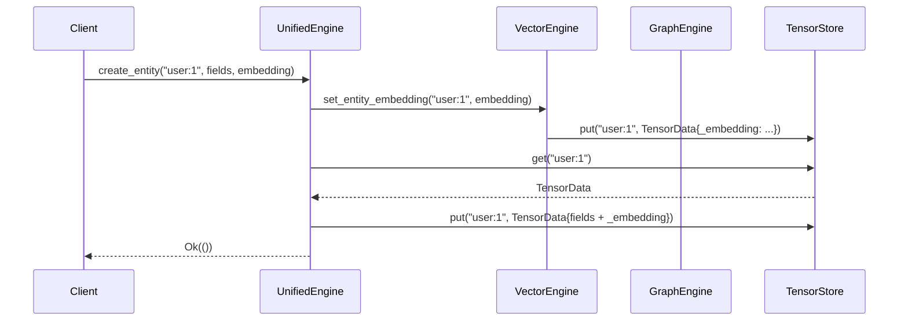
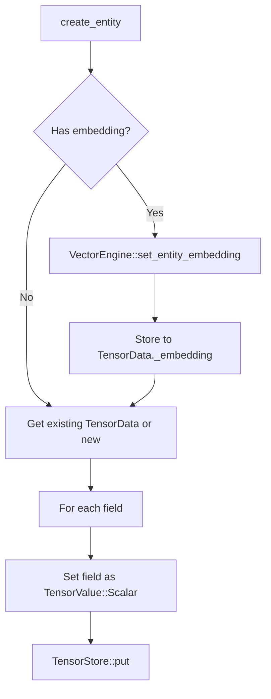
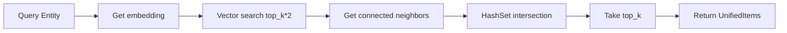
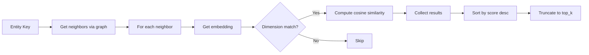
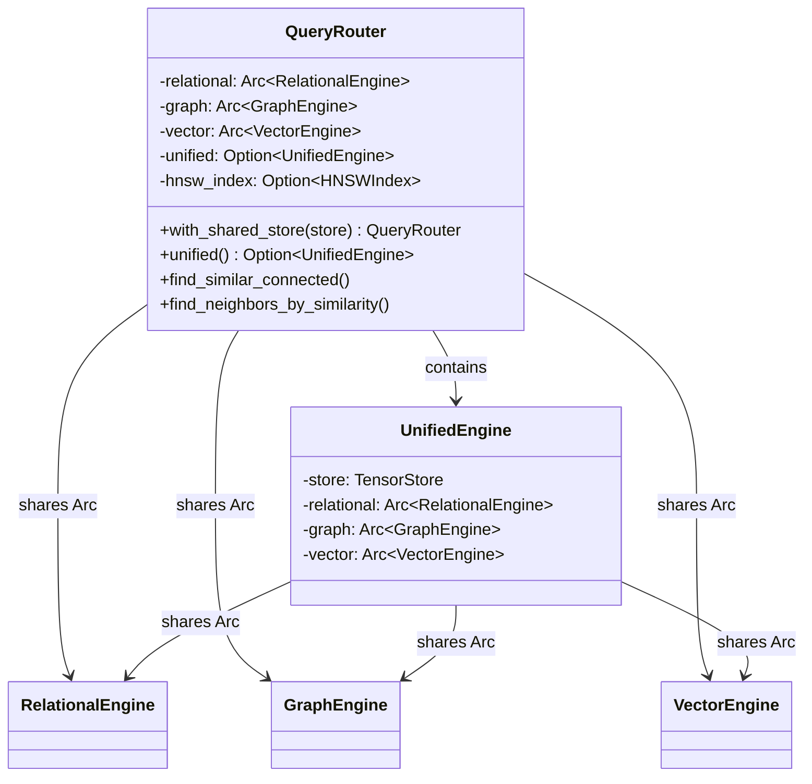

# Tensor Unified

Cross-engine operations and unified entity management for Neumann. Provides a
single interface for queries that span relational, graph, and vector engines
with async-first design and thread safety inherited from TensorStore.

## Design Principles

1. **Cross-Engine Abstraction**: Single interface for operations spanning
   multiple engines
2. **Unified Entities**: Entities can have relational fields, graph connections,
   and embeddings
3. **Composable Queries**: Combine vector similarity with graph connectivity
4. **Async-First**: All cross-engine operations support async execution
5. **Thread Safety**: Inherits from underlying engines via TensorStore

## Architecture

```text
                    +------------------+
                    | UnifiedEngine    |
                    +------------------+
                           |
        +------------------+------------------+
        |                  |                  |
        v                  v                  v
+---------------+  +---------------+  +---------------+
|  Relational   |  |    Graph      |  |    Vector     |
|    Engine     |  |    Engine     |  |    Engine     |
+---------------+  +---------------+  +---------------+
        |                  |                  |
        +------------------+------------------+
                           |
                    +------v------+
                    | TensorStore |
                    +-------------+
```

All engines share the same TensorStore instance, enabling cross-engine queries
without data duplication.

### Internal Engine Coordination



## Key Types

| Type | Description |
| --- | --- |
| `UnifiedEngine` | Main entry point for cross-engine operations |
| `UnifiedResult` | Query result containing description and items |
| `UnifiedItem` | Single item with source, id, data, embedding, and score |
| `UnifiedError` | Error type wrapping engine-specific errors |
| `FindPattern` | Pattern for FIND queries (Nodes or Edges) |
| `DistanceMetric` | Similarity metric (Cosine, Euclidean, DotProduct) |
| `EntityInput` | Tuple type for batch operations: (key, fields, embedding) |
| `Unified` | Trait for converting engine types to UnifiedItem |
| `FilterCondition` | Re-exported from vector_engine for filtered search |
| `FilterValue` | Re-exported from vector_engine for filter values |
| `VectorCollectionConfig` | Re-exported from vector_engine for collection config |

### UnifiedItem

```rust
pub struct UnifiedItem {
    pub source: String,                    // "relational", "graph", "vector", or combined
    pub id: String,                        // Entity key
    pub data: HashMap<String, String>,     // Entity fields
    pub embedding: Option<Vec<f32>>,       // Optional embedding
    pub score: Option<f32>,                // Similarity score if applicable
}
```

The `source` field indicates which engine(s) produced the result:

- `"graph"` - Result from graph operations (nodes, edges)
- `"vector"` - Result from vector similarity search
- `"unified"` - Result from cross-engine entity retrieval
- `"vector+graph"` - Result from `find_similar_connected` (similarity +
  connectivity)
- `"graph+vector"` - Result from `find_neighbors_by_similarity` (connectivity +
  similarity)

### UnifiedError

| Variant | Cause |
| --- | --- |
| `RelationalError` | Error from relational engine |
| `GraphError` | Error from graph engine |
| `VectorError` | Error from vector engine |
| `NotFound` | Entity not found |
| `InvalidOperation` | Invalid operation attempted |

Error conversion is automatic via `From` implementations:

```rust
impl From<graph_engine::GraphError> for UnifiedError {
    fn from(e: graph_engine::GraphError) -> Self {
        UnifiedError::GraphError(e.to_string())
    }
}

impl From<vector_engine::VectorError> for UnifiedError {
    fn from(e: vector_engine::VectorError) -> Self {
        UnifiedError::VectorError(e.to_string())
    }
}

impl From<relational_engine::RelationalError> for UnifiedError {
    fn from(e: relational_engine::RelationalError) -> Self {
        UnifiedError::RelationalError(e.to_string())
    }
}
```

## Entity Storage Format

Unified entities use reserved field prefixes in `TensorData` to store
cross-engine data within a single key-value entry:

| Field | Type | Description |
| --- | --- | --- |
| `_out` | `Pointers(Vec<String>)` | Outgoing edge keys |
| `_in` | `Pointers(Vec<String>)` | Incoming edge keys |
| `_embedding` | `Vector(Vec<f32>)` or `Sparse(SparseVector)` | Embedding vector |
| `_label` | `Scalar(String)` | Entity type/label |
| `_type` | `Scalar(String)` | Discriminator ("node", "edge", "row") |
| `_id` | `Scalar(Int)` | Numeric entity ID |
| `_from` | `Scalar(String)` | Edge source key |
| `_to` | `Scalar(String)` | Edge target key |
| `_edge_type` | `Scalar(String)` | Edge type |
| `_directed` | `Scalar(Bool)` | Whether edge is directed |
| `_table` | `Scalar(String)` | Table name for relational rows |

### Entity Storage Example

```text
Key: "user:alice"
TensorData:
  _embedding: Vector([0.1, 0.2, 0.3, 0.4])
  _out: Pointers(["edge:follows:1", "edge:likes:2"])
  _in: Pointers(["edge:follows:3"])
  name: Scalar(String("Alice"))
  role: Scalar(String("admin"))

Key: "edge:follows:1"
TensorData:
  _type: Scalar(String("edge"))
  _from: Scalar(String("user:alice"))
  _to: Scalar(String("user:bob"))
  _edge_type: Scalar(String("follows"))
  _directed: Scalar(Bool(true))
```

### Sparse Vector Auto-Detection

Embeddings are automatically stored in sparse format when >50% of values are
zero:

```rust
fn should_use_sparse(vector: &[f32]) -> bool {
    if vector.is_empty() {
        return false;
    }
    let nnz = vector.iter().filter(|&&v| v.abs() > 1e-6).count();
    // Sparse if nnz <= len/2
    nnz * 2 <= vector.len()
}
```

## Initialization

```rust
use tensor_unified::UnifiedEngine;
use tensor_store::TensorStore;

// Create with new store
let engine = UnifiedEngine::new();

// Create with shared store
let store = TensorStore::new();
let engine = UnifiedEngine::with_store(store);

// Create with existing engines
let engine = UnifiedEngine::with_engines(store, relational, graph, vector);
```

### Internal Structure

```rust
pub struct UnifiedEngine {
    store: TensorStore,
    relational: Arc<RelationalEngine>,
    graph: Arc<GraphEngine>,
    vector: Arc<VectorEngine>,
}
```

The `Arc` wrappers enable:

- Thread-safe sharing across async tasks
- Zero-copy cloning of the engine
- Independent engine access when needed

## Entity Operations

### Creating Entities

```rust
use std::collections::HashMap;

// Create an entity with fields and optional embedding
let mut fields = HashMap::new();
fields.insert("name".to_string(), "Alice".to_string());
fields.insert("role".to_string(), "admin".to_string());

engine.create_entity(
    "user:1",
    fields,
    Some(vec![0.1, 0.2, 0.3, 0.4])  // Optional embedding
).await?;
```

**Internal flow:**



### Connecting Entities

```rust
// Connect entities via graph edge
let edge_id = engine.connect_entities("user:1", "user:2", "follows").await?;
```

Edge creation updates three TensorData entries:

1. Creates new edge entry with `_from`, `_to`, `_edge_type`, `_directed`
2. Adds edge key to source entity's `_out` field
3. Adds edge key to target entity's `_in` field

### Retrieving Entities

```rust
// Get entity with all data and embedding
let item = engine.get_entity("user:1").await?;
println!("Fields: {:?}", item.data);
println!("Embedding: {:?}", item.embedding);
```

**Gotcha:** Returns `UnifiedError::NotFound` if the entity has neither fields
nor embedding.

## Cross-Engine Queries

### Find Similar Connected

Find entities similar to a query that are also connected via graph edges:



```rust
// Find entities similar to query AND connected to target
let results = engine.find_similar_connected(
    "user:1",      // Query entity (uses its embedding)
    "hub:main",    // Find entities connected to this
    10             // Top-k results
).await?;
```

**Algorithm details:**

1. Retrieves embedding from `query_key` via `VectorEngine::get_entity_embedding`
2. Searches for top `k*2` similar entities (over-fetches for filtering)
3. Gets neighbors of `connected_to` via `GraphEngine::get_entity_neighbors`
4. Builds HashSet of connected neighbors for O(1) lookup
5. Filters similar results to only those in the neighbor set
6. Returns top-k results with source `"vector+graph"`

**Edge case:** If `query_key` has no embedding, returns `VectorError::NotFound`.

### Find Similar Connected with Filter

Enhanced version that combines vector similarity, graph connectivity, and
metadata filtering:

```rust
use vector_engine::{FilterCondition, FilterValue};

// Build a filter for metadata
let filter = FilterCondition::Eq(
    "category".to_string(),
    FilterValue::String("article".to_string())
);

// Find entities similar to query, connected to hub, matching filter
let results = engine.find_similar_connected_filtered(
    "user:1",      // Query entity (uses its embedding)
    "hub:main",    // Find entities connected to this
    Some(&filter), // Optional metadata filter
    10             // Top-k results
).await?;
```

**Algorithm:**

1. Gets query embedding from `query_key`
2. Gets connected neighbor keys from graph
3. Builds combined filter: `key IN neighbors AND user_filter`
4. Uses pre-filter strategy for high selectivity
5. Returns filtered results with source `"vector+graph"`

The filtered version eliminates post-processing by pushing filters into the
vector search, improving performance for selective queries.

### Find Neighbors by Similarity

Find graph neighbors sorted by similarity to a query vector:



```rust
// Find neighbors of an entity sorted by similarity to a vector
let results = engine.find_neighbors_by_similarity(
    "user:1",                    // Entity to get neighbors of
    &[0.1, 0.2, 0.3, 0.4],      // Query vector
    10                           // Top-k results
).await?;
```

**Algorithm details:**

1. Gets all neighbors (both directions) via `GraphEngine::get_entity_neighbors`
2. For each neighbor:
   - Attempts to get embedding via `VectorEngine::get_entity_embedding`
   - Skips if no embedding or dimension mismatch
   - Computes cosine similarity with query vector
3. Sorts results by score descending
4. Truncates to top-k
5. Returns results with source `"graph+vector"`

**Gotcha:** Neighbors without embeddings are silently skipped.

## Unified Entity Storage

The unified entity storage methods provide a streamlined API for storing entity
fields as vector metadata, eliminating double-storage overhead.

### Creating Unified Entities

```rust
use std::collections::HashMap;

let mut fields = HashMap::new();
fields.insert("title".to_string(), "Introduction to Rust".to_string());
fields.insert("author".to_string(), "Alice".to_string());

// Store entity with fields as vector metadata
engine.create_entity_unified(
    "doc:1",
    fields,
    Some(vec![0.1, 0.2, 0.3, 0.4])
).await?;

// Without embedding, stores to TensorStore only
engine.create_entity_unified("doc:2", fields, None).await?;
```

When an embedding is provided, fields are stored as vector metadata alongside
the embedding. This enables filtered search without requiring a separate storage
lookup.

### Retrieving Unified Entities

```rust
// Get entity with fields from vector metadata
let item = engine.get_entity_unified("doc:1").await?;

println!("Title: {:?}", item.data.get("title"));
println!("Embedding: {:?}", item.embedding);
```

The retrieval first attempts to load from vector metadata. If not found, it
falls back to the standard TensorStore lookup.

## Collection-Based Entity Organization

Collections provide type-based organization for entities, enabling scoped
searches and dimension enforcement.

### Creating Entities in Collections

```rust
use vector_engine::VectorCollectionConfig;
use std::collections::HashMap;

// Create a collection for documents
let config = VectorCollectionConfig::default()
    .with_dimension(768)
    .with_metric(DistanceMetric::Cosine);

engine.create_entity_collection("documents", config)?;

// Store entity in collection
let mut fields = HashMap::new();
fields.insert("title".to_string(), "ML Paper".to_string());

engine.create_entity_in_collection(
    "documents",
    "paper:1",
    fields,
    vec![0.1; 768]
).await?;
```

### Searching in Collections

```rust
use vector_engine::FilterCondition;

// Basic search in collection
let results = engine.find_similar_in_collection(
    "documents",
    &query_embedding,
    None,  // No filter
    10
).await?;

// Filtered search in collection
let filter = FilterCondition::Eq("author".to_string(), "Alice".into());
let results = engine.find_similar_in_collection(
    "documents",
    &query_embedding,
    Some(&filter),
    10
).await?;
```

### Managing Collections

```rust
// List all entity collections
let collections = engine.list_entity_collections();

// Delete a collection
engine.delete_entity_collection("documents")?;
```

### Collection Isolation

Collections ensure entity isolation:

- Each collection has its own key namespace
- Dimension mismatches are rejected per-collection config
- Searches only see entities within the specified collection
- Deleting a collection removes all entities in it

### Find Nodes and Edges

```rust
// Find all nodes with optional label filter
let nodes = engine.find_nodes(Some("person"), None).await?;

// Find all edges with optional type filter
let edges = engine.find_edges(Some("follows"), None).await?;

// Find with pattern and limit
let pattern = FindPattern::Nodes { label: Some("document".to_string()) };
let result = engine.find(&pattern, Some(10)).await?;
```

## Find Pattern Matching Implementation

The `find_nodes` and `find_edges` methods scan the TensorStore for matching
entities:

### Node Scanning Algorithm

```rust
fn scan_nodes(&self, label_filter: Option<&str>) -> Result<Vec<Node>> {
    let keys = self.store.scan("node:");  // Prefix scan

    for key in keys {
        // Filter out edge lists (node:123:out, node:123:in)
        if key.contains(":out") || key.contains(":in") {
            continue;
        }

        // Parse node ID from key "node:{id}"
        if let Some(id_str) = key.strip_prefix("node:") {
            if let Ok(id) = id_str.parse::<u64>() {
                // Fetch and optionally filter by label
            }
        }
    }
}
```

### Condition Matching

Conditions are evaluated against node/edge properties:

| Condition | Node Fields | Edge Fields |
| --- | --- | --- |
| `Eq("id", ...)` | Matches `node.id` | Matches `edge.id` |
| `Eq("label", ...)` | Matches `node.label` | N/A |
| `Eq("type", ...)` | N/A | Matches `edge.edge_type` |
| `Eq("edge_type", ...)` | N/A | Matches `edge.edge_type` (alias) |
| `Eq("from", ...)` | N/A | Matches `edge.from` |
| `Eq("to", ...)` | N/A | Matches `edge.to` |
| `Eq(property, ...)` | Matches `node.properties[property]` | Matches `edge.properties[property]` |
| `And(a, b)` | Both must match | Both must match |
| `Or(a, b)` | Either must match | Either must match |
| Other conditions | Returns `true` (pass-through) | Returns `true` (pass-through) |

**Gotcha:** Conditions other than `Eq`, `And`, `Or` return `true` (not yet
implemented for graph entities).

## Batch Operations

```rust
// Store multiple embeddings
let items = vec![
    ("doc1".to_string(), vec![0.1, 0.2, 0.3]),
    ("doc2".to_string(), vec![0.4, 0.5, 0.6]),
];
let count = engine.embed_batch(items).await?;

// Create multiple entities
let entities: Vec<EntityInput> = vec![
    ("e1".to_string(), HashMap::from([("name".to_string(), "A".to_string())]), None),
    ("e2".to_string(), HashMap::from([("name".to_string(), "B".to_string())]), Some(vec![0.1, 0.2])),
];
let count = engine.create_entities_batch(entities).await?;
```

**Note:** Batch operations process sequentially (not parallel). Failed
individual operations are counted as failures but don't abort the batch.

## Unified Trait

Types implementing the `Unified` trait can be converted to `UnifiedItem`:

```rust
pub trait Unified {
    fn as_unified(&self) -> UnifiedItem;
    fn source_engine(&self) -> &'static str;
    fn unified_id(&self) -> String;
}
```

Implemented for:

- `graph_engine::Node` - Converts label and properties to data fields
- `graph_engine::Edge` - Converts from, to, type, and properties to data fields
- `vector_engine::SearchResult` - Converts key and score

### Implementation Examples

```rust
impl Unified for Node {
    fn as_unified(&self) -> UnifiedItem {
        let mut item = UnifiedItem::new("graph", self.id.to_string());
        item.set("label", &self.label);
        for (k, v) in &self.properties {
            item.set(k.clone(), format!("{:?}", v));  // Debug format for PropertyValue
        }
        item
    }

    fn source_engine(&self) -> &'static str { "graph" }
    fn unified_id(&self) -> String { self.id.to_string() }
}

impl Unified for SearchResult {
    fn as_unified(&self) -> UnifiedItem {
        UnifiedItem::new("vector", &self.key).with_score(self.score)
    }

    fn source_engine(&self) -> &'static str { "vector" }
    fn unified_id(&self) -> String { self.key.clone() }
}
```

## Query Language

Cross-engine operations are exposed via the query language:

### Entity Creation

```sql
-- Create entity with fields and embedding
ENTITY CREATE 'user:1' {name: 'Alice', role: 'admin'} EMBEDDING [0.1, 0.2, 0.3]

-- Create entity with fields only
ENTITY CREATE 'user:2' {name: 'Bob'}

-- Connect entities
ENTITY CONNECT 'user:1' -> 'user:2' : follows
```

### Cross-Engine Similarity

```sql
-- Find similar entities that are also connected to a hub
SIMILAR 'query:key' CONNECTED TO 'hub:entity' LIMIT 10

-- Find neighbors sorted by similarity
NEIGHBORS 'entity:key' BY SIMILAR [0.1, 0.2, 0.3] LIMIT 10
```

## QueryRouter Integration

QueryRouter integrates with UnifiedEngine for cross-engine operations. When
created with `with_shared_store()`, the router automatically initializes an
internal UnifiedEngine:



```rust
use query_router::QueryRouter;
use tensor_store::TensorStore;

// Create router with shared store - this initializes UnifiedEngine
let store = TensorStore::new();
let router = QueryRouter::with_shared_store(store);

// Verify UnifiedEngine is available
assert!(router.unified().is_some());

// Cross-engine Rust API methods delegate to UnifiedEngine
let results = router.find_neighbors_by_similarity("entity:1", &[0.1, 0.2], 10)?;
let results = router.find_similar_connected("query:1", "hub:1", 5)?;

// Query language commands also use the integrated engines
router.execute_parsed("ENTITY CREATE 'doc:1' {title: 'Hello'} EMBEDDING [0.1, 0.2]")?;
router.execute_parsed("ENTITY CONNECT 'user:1' -> 'doc:1' : authored")?;
router.execute_parsed("SIMILAR 'query:doc' CONNECTED TO 'user:1' LIMIT 5")?;
```

### HNSW Optimization Path

When QueryRouter has an HNSW index, `find_similar_connected` uses it instead of
brute-force search:

```rust
// Use HNSW index if available, otherwise fall back to brute-force
let similar = if let Some((ref index, ref keys)) = self.hnsw_index {
    self.vector.search_with_hnsw(index, keys, &query_embedding, top_k * 2)
} else {
    self.vector.search_entities(&query_embedding, top_k * 2)
};
```

## Performance

| Operation | Complexity | Notes |
| --- | --- | --- |
| `create_entity` | O(1) | Single store put + optional embedding |
| `connect_entities` | O(1) | Three store operations (edge + 2 entity updates) |
| `get_entity` | O(1) | Single store get + optional embedding lookup |
| `find_similar_connected` | O(k log n) | HNSW search + graph intersection |
| `find_similar_connected` (brute) | O(n) | Linear scan when no HNSW index |
| `find_similar_connected_filtered` | O(m) | Pre-filter search, m = matching keys |
| `create_entity_unified` | O(1) | Single store with metadata |
| `get_entity_unified` | O(1) | Metadata lookup with fallback |
| `create_entity_in_collection` | O(1) | Collection-scoped store |
| `find_similar_in_collection` | O(c) | c = collection size |
| `find_neighbors_by_similarity` | O(d * k) | Neighbor fetch + k similarity computations |
| `find_nodes` | O(n) | Full scan with prefix filter |
| `find_edges` | O(e) | Full scan with prefix filter |
| `embed_batch` | O(b) | Sequential embedding storage |
| `create_entities_batch` | O(b) | Sequential entity creation |

Where:

- n = number of entities with embeddings
- d = average degree (number of neighbors)
- k = top-k results requested
- e = number of edges
- b = batch size

### Benchmarks

From `tensor_unified_bench.rs`:

| Operation | 10 items | 100 items | 1000 items |
| --- | --- | --- | --- |
| `create_entity` | ~50us | ~500us | ~5ms |
| `embed_batch` | ~30us | ~300us | ~3ms |
| `find_nodes` | ~10us | ~100us | ~1ms |
| `UnifiedItem::new` | ~50ns | --- | --- |
| `UnifiedItem::with_data` | ~200ns | --- | --- |

## Thread Safety

UnifiedEngine is thread-safe via:

- `Arc<VectorEngine>`, `Arc<GraphEngine>`, `Arc<RelationalEngine>`
- All underlying engines share thread-safe TensorStore (DashMap)
- No lock poisoning (parking_lot semantics)

```rust
impl Clone for UnifiedEngine {
    fn clone(&self) -> Self {
        Self {
            store: self.store.clone(),           // Arc<DashMap> clone
            relational: Arc::clone(&self.relational),
            graph: Arc::clone(&self.graph),
            vector: Arc::clone(&self.vector),
        }
    }
}
```

**Safe concurrent patterns:**

- Multiple readers on same entity
- Multiple writers on different entities
- Mixed reads/writes (DashMap shard locking)

**Gotcha:** Concurrent writes to the same entity may interleave fields. Use
transactions for atomicity.

## Configuration

UnifiedEngine uses the configuration of its underlying engines:

- `TensorStore`: Storage configuration
- `VectorEngine`: HNSW index parameters, similarity metrics
- `GraphEngine`: Graph traversal settings
- `RelationalEngine`: Table and index configuration

## Best Practices

### Entity Key Naming

Use prefixed keys to distinguish entity types:

```rust
"user:123"      // User entities
"doc:456"       // Document entities
"hub:main"      // Hub/aggregate entities
"edge:follows:1" // Edge entities (auto-generated)
```

### Embedding Dimensions

Ensure consistent embedding dimensions across entities:

```rust
// Good: All entities use 384-dimensional embeddings
engine.create_entity("doc:1", fields, Some(vec![0.0; 384])).await?;
engine.create_entity("doc:2", fields, Some(vec![0.0; 384])).await?;

// Bad: Dimension mismatch causes similarity search to skip entities
engine.create_entity("doc:1", fields, Some(vec![0.0; 384])).await?;
engine.create_entity("doc:2", fields, Some(vec![0.0; 768])).await?;  // Different dimension!
```

### Cross-Engine Query Optimization

For `find_similar_connected`:

1. Build HNSW index for large vector sets (>5000 entities)
2. Ensure `connected_to` entity has edges (empty neighbors returns empty
   results)
3. Request `top_k * 2` internally to account for filtering

For `find_neighbors_by_similarity`:

1. Ensure neighbors have embeddings (no embedding = skipped)
2. Use same dimension for query vector as stored embeddings
3. Consider degree distribution (high-degree nodes = more similarity
   computations)

## Related Modules

| Module | Relationship |
| --- | --- |
| `tensor_store` | Shared storage backend, provides `TensorData` and `fields` constants |
| `relational_engine` | Relational data, conditions for filtering |
| `graph_engine` | Graph connectivity, entity edges, neighbor queries |
| `vector_engine` | Embeddings, similarity search, HNSW index, `FilterCondition`, `FilterValue`, `VectorCollectionConfig` |
| `query_router` | Query execution, language integration, HNSW optimization, re-exports filter types |

## Dependencies

- `tensor_store`: Core storage
- `relational_engine`: Table operations
- `graph_engine`: Graph operations
- `vector_engine`: Vector search
- `tokio`: Async runtime (multi-threaded)
- `futures`: Async utilities
- `serde`: Serialization for results and items
- `serde_json`: JSON output for `UnifiedResult`

## Example: Code Intelligence System

From `examples/code_search.rs`:

```rust
use std::collections::HashMap;
use tensor_unified::UnifiedEngine;

#[tokio::main]
async fn main() -> Result<(), Box<dyn std::error::Error>> {
    let engine = UnifiedEngine::new();

    // Store functions with embeddings representing semantic meaning
    let mut props = HashMap::new();
    props.insert("type".to_string(), "function".to_string());
    props.insert("language".to_string(), "rust".to_string());

    // "process_data" - embedding represents data processing semantics
    engine.create_entity(
        "func:process_data",
        props.clone(),
        Some(vec![1.0, 0.9, 0.0, 0.0])
    ).await?;

    // "validate_input" - embedding represents validation semantics
    engine.create_entity(
        "func:validate_input",
        props.clone(),
        Some(vec![0.0, 0.1, 0.9, 0.9])
    ).await?;

    // Create call graph relationship
    engine.connect_entities(
        "func:process_data",
        "func:validate_input",
        "CALLS"
    ).await?;

    // Find functions similar to "data processing" that call validate_input
    let results = engine.find_similar_connected(
        "func:process_data",   // Query by this function's embedding
        "func:validate_input", // Must be connected to validation
        5
    ).await?;

    for item in results {
        println!("Found: {} (Score: {:.4})", item.id, item.score.unwrap_or(0.0));
    }

    Ok(())
}
```
