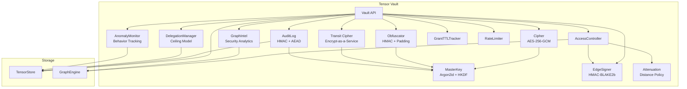
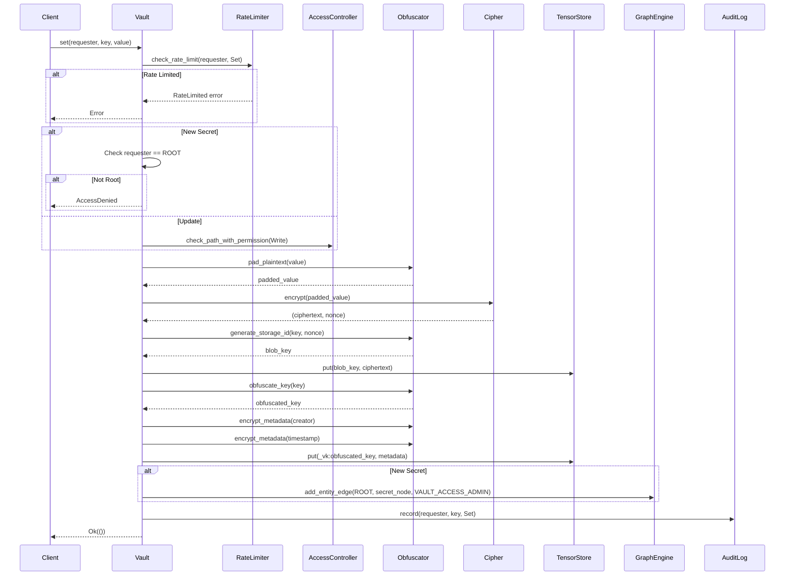
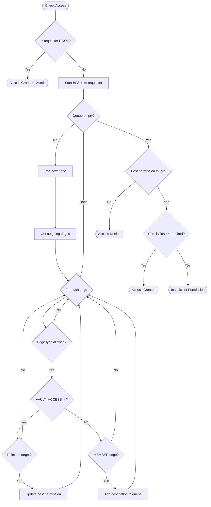

# Tensor Vault

Tensor Vault provides secure secret storage with AES-256-GCM encryption and
graph-based access control. Designed for multi-agent environments, it implements
a zero-trust architecture where access is determined by graph topology rather
than traditional ACLs.

All secrets are encrypted at rest with authenticated encryption. The vault
maintains a permanent audit trail of all operations and supports features like
rate limiting, TTL-based grants, and namespace isolation for multi-tenant
deployments.

## When to Use Tensor Vault

| Scenario | How Tensor Vault Helps |
| --- | --- |
| Multiple agents need access to shared secrets | Graph-based access control with per-agent permission levels |
| You need to audit who accessed what and when | Tamper-evident audit log with HMAC integrity and AEAD encryption |
| Temporary access to secrets | TTL-based grants and secret expiration auto-revoke access |
| Agent delegation chains | Delegation with ceiling model, depth limits, and cascading revocation |
| Security posture review | Graph intelligence: blast radius, privilege analysis, role inference |
| Incident response | Break-glass emergency access with justification and auto-expiry |
| Application-level encryption | Transit encryption lets agents encrypt data without holding keys |
| Regulatory compliance | Immutable audit trail, key rotation, and anomaly detection |

## Design Principles

| Principle | Description |
| --- | --- |
| Encryption at Rest | All secrets encrypted with AES-256-GCM |
| Topological Access Control | Access determined by graph path, not ACLs |
| Zero Trust | No bypass mode; `node:root` is the only universal accessor |
| Memory Safety | Keys zeroized on drop via `zeroize` crate |
| Tamper-Evident Graph | All permission edges HMAC-signed; tampering detected on traversal |
| Distance Attenuation | Permissions degrade with graph distance from the secret |
| Least Privilege Delegation | Agents delegate subsets of their own access with ceiling model |
| Behavioral Monitoring | Per-agent anomaly detection flags spikes, bulk ops, and dormancy |
| Permanent Audit Trail | All operations logged with HMAC integrity and AEAD encryption |
| Defense in Depth | Multiple obfuscation layers hide patterns |
| Multi-Tenant Ready | Namespace isolation and rate limiting for agent systems |

## Key Types

### Core Types

| Type | Description |
| --- | --- |
| `Vault` | Main API for encrypted secret storage with graph-based access control |
| `VaultConfig` | Configuration for key derivation, rate limiting, and versioning |
| `VaultError` | Error types (AccessDenied, NotFound, CryptoError, etc.) |
| `Permission` | Access levels: Read, Write, Admin |
| `VersionInfo` | Metadata about a secret version (version number, timestamp) |
| `ScopedVault` | Entity-bound view for simplified API usage |
| `NamespacedVault` | Namespace-prefixed view for multi-tenant isolation |

### Cryptographic Types

| Type | Description |
| --- | --- |
| `MasterKey` | Derived encryption key with zeroize-on-drop (32 bytes) |
| `Cipher` | AES-256-GCM encryption wrapper |
| `Obfuscator` | HMAC-based key obfuscation and AEAD metadata encryption |
| `PaddingSize` | Padding buckets for length hiding (256B to 64KB) |

### Access Control Types

| Type | Description |
| --- | --- |
| `AccessController` | BFS-based graph path verification |
| `GrantTTLTracker` | Min-heap tracking grant expirations with persistence |
| `RateLimiter` | Sliding window rate limiting per entity |
| `RateLimitConfig` | Configurable limits per operation type |

### Edge Signing Types

| Type | Description |
| --- | --- |
| `EdgeSigner` | HMAC-BLAKE2b signer for graph edge integrity |

### Attenuation Types

| Type | Description |
| --- | --- |
| `AttenuationPolicy` | Distance-based permission degradation policy |

### Delegation Types

| Type | Description |
| --- | --- |
| `DelegationManager` | Agent-to-agent delegation with depth limits and ceiling model |
| `DelegationRecord` | Single delegation grant (parent, child, secrets, ceiling, TTL) |

### Anomaly Detection Types

| Type | Description |
| --- | --- |
| `AnomalyMonitor` | Real-time per-agent behavioral anomaly tracker |
| `AnomalyThresholds` | Configurable limits for spike, bulk, and inactivity detection |
| `AgentProfile` | Per-agent access history (known secrets, counts, timestamps) |
| `AnomalyEvent` | Event variants: FrequencySpike, BulkOperation, InactiveAgentResumed, FirstSecretAccess |

### Audit Types

| Type | Description |
| --- | --- |
| `AuditLog` | Query interface for audit entries with optional HMAC/AEAD protection |
| `AuditEntry` | Single operation record (entity, key, operation, timestamp) |
| `AuditOperation` | Operation types: Get, Set, Delete, Rotate, Grant, Revoke, List |

### Graph Intelligence Types

| Type | Description |
| --- | --- |
| `AccessExplanation` | Path-level explanation of why access was granted or denied |
| `BlastRadius` | All secrets reachable by an entity with permission and hop detail |
| `SimulationResult` | Dry-run impact analysis of a hypothetical grant |
| `SecurityAuditReport` | SCC cycles, single points of failure, over-privileged entities |
| `CriticalEntity` | Articulation-point analysis with PageRank and dependency counts |
| `PrivilegeAnalysisReport` | PageRank-weighted reachability scores per entity |
| `DelegationAnomalyScore` | Jaccard and Adamic-Adar similarity for delegation edges |
| `RoleInferenceResult` | Louvain community detection mapped to inferred roles |
| `TrustTransitivityReport` | Triangle counting and clustering coefficients |
| `RiskPropagationReport` | Eigenvector centrality weighted by admin reachability |

## Architecture



### Data Flow

1. **Set Operation**: Plaintext is padded, encrypted with random nonce, metadata
   obfuscated, stored via TensorStore
2. **Get Operation**: Rate limit check, access path verified via BFS, ciphertext
   decrypted, padding removed, audit logged
3. **Grant Operation**: Permission edge created in GraphEngine, TTL tracked if
   specified
4. **Revoke Operation**: Permission edge deleted, expired grants cleaned up

### Set Operation Flow



## Access Control Model

Access is determined by graph topology using BFS traversal:

```text
node:root ──VAULT_ACCESS_ADMIN──> vault_secret:api_key
                                          ^
user:alice ──VAULT_ACCESS_READ───────────┘
                                          ^
team:devs ──VAULT_ACCESS_WRITE───────────┘
      ^
user:bob ──MEMBER────────────────────────┘
```

| Requester | Path | Access |
| --- | --- | --- |
| `node:root` | Always | Granted (Admin) |
| `user:alice` | Direct edge | Granted (Read only) |
| `team:devs` | Direct edge | Granted (Write) |
| `user:bob` | bob -> team:devs -> secret | Granted (Write via team) |
| `user:carol` | No path | Denied |

### Permission Levels

| Level | Capabilities |
| --- | --- |
| Read | `get()`, `list()`, `get_version()`, `list_versions()` |
| Write | Read + `set()` (update), `rotate()`, `rollback()` |
| Admin | Write + `delete()`, `grant()`, `revoke()` |

Permission propagation follows graph paths. The effective permission is
determined by the `VAULT_ACCESS_*` edge type at the end of the path.

### Allowed Traversal Edges

Only these edge types can grant transitive access:

- `VAULT_ACCESS` - Legacy edge type (treated as Admin for backward
  compatibility)
- `VAULT_ACCESS_READ` - Read-only access
- `VAULT_ACCESS_WRITE` - Read + Write access
- `VAULT_ACCESS_ADMIN` - Full access including grant/revoke
- `MEMBER` - Allows group membership traversal but does NOT grant permission
  directly

### Access Control Algorithm

The `AccessController` uses BFS to find the best permission level along any
path:

```rust
// Simplified algorithm from access.rs
pub fn get_permission_level(graph: &GraphEngine, source: &str, target: &str) -> Option<Permission> {
    if source == target {
        return Some(Permission::Admin);  // Self-access
    }

    let mut visited = HashSet::new();
    let mut queue = VecDeque::new();
    let mut best_permission: Option<Permission> = None;

    queue.push_back(source.to_string());
    visited.insert(source.to_string());

    while let Some(current) = queue.pop_front() {
        for edge in graph.get_entity_outgoing(&current) {
            let (_, to, edge_type, _) = graph.get_entity_edge(&edge);

            // Only traverse allowed edge types
            if !is_allowed_edge_type(&edge_type) {
                continue;
            }

            // VAULT_ACCESS_* edges grant permission to target
            if edge_type.starts_with("VAULT_ACCESS") && to == target {
                if let Some(perm) = Permission::from_edge_type(&edge_type) {
                    best_permission = max(best_permission, perm);
                }
            } else if edge_type == "MEMBER" {
                // MEMBER edges allow traversal but NO permission grant
                if !visited.contains(&to) {
                    visited.insert(to.clone());
                    queue.push_back(to);
                }
            }
        }
    }

    best_permission
}
```

**Security Note**: `MEMBER` edges enable traversal through groups but do not
grant permissions. Only `VAULT_ACCESS_*` edges grant actual permissions. This
prevents privilege escalation via group membership.

### Access Control Flow



## Edge Signing

Every permission edge in the graph is signed with HMAC-BLAKE2b to
prevent topology tampering. When the vault creates or modifies a
`VAULT_ACCESS_*` edge, it computes a signature over the canonicalized
tuple `(from, to, edge_type, timestamp)` and stores it as an edge
property.

```rust
// From signing.rs
impl EdgeSigner {
    pub fn sign_edge(
        &self,
        from: &str,
        to: &str,
        edge_type: &str,
        timestamp: i64,
    ) -> Vec<u8> {
        // HMAC-BLAKE2b over canonical representation
        // from || ":" || to || ":" || edge_type || ":" || timestamp
    }

    pub fn verify_edge(
        &self,
        from: &str,
        to: &str,
        edge_type: &str,
        timestamp: i64,
        signature: &[u8],
    ) -> bool {
        // Constant-time comparison to prevent timing attacks
    }
}
```

Signature verification happens during BFS traversal. If a tampered
edge is encountered, the `AccessController` skips it and the
`explain_access` API reports a `TamperedEdge` denial reason.

## Distance-Based Attenuation

Permissions degrade as graph distance increases between an entity
and a secret. This limits the blast radius of transitive access
chains.

### AttenuationPolicy

| Field | Type | Default | Description |
| --- | --- | --- | --- |
| `admin_limit` | `usize` | 1 | Maximum hops that preserve Admin |
| `write_limit` | `usize` | 2 | Maximum hops that preserve Write |
| `horizon` | `usize` | 10 | BFS cutoff; access denied beyond this |

### Permission at Each Hop

| Hops | Effective Permission |
| --- | --- |
| 1 | Admin (if granted Admin) |
| 2 | Write (Admin attenuates to Write) |
| 3-10 | Read (Write attenuates to Read) |
| >10 | Denied (beyond horizon) |

```rust
// From attenuation.rs
impl AttenuationPolicy {
    pub fn attenuate(
        &self,
        perm: Permission,
        hops: usize,
    ) -> Option<Permission> {
        if hops > self.horizon {
            return None; // Beyond horizon
        }
        match perm {
            Permission::Admin if hops > self.admin_limit =>
                self.attenuate(Permission::Write, hops),
            Permission::Write if hops > self.write_limit =>
                Some(Permission::Read),
            other => Some(other),
        }
    }
}
```

Use `AttenuationPolicy::none()` to disable attenuation for backward
compatibility with legacy deployments.

## Delegation

Agents can delegate subsets of their own access to child agents.
Delegation follows a ceiling model: the child can never exceed the
parent's permission level.

### Key Properties

- **Ceiling model**: `effective = min(parent_permission, requested)`
- **Depth limits**: Configurable maximum chain depth (default 3)
- **Cycle prevention**: A child cannot delegate back to an ancestor
- **Cascading revocation**: Revoking a parent revokes all descendants
- **TTL support**: Delegations can expire automatically

### DelegationRecord Fields

| Field | Type | Description |
| --- | --- | --- |
| `parent` | `String` | Delegating (parent) agent |
| `child` | `String` | Receiving (child) agent |
| `secrets` | `Vec<String>` | Secret names delegated |
| `max_permission` | `Permission` | Ceiling permission level |
| `ttl_ms` | `Option<i64>` | Optional TTL in milliseconds |
| `created_at_ms` | `i64` | Creation timestamp (unix ms) |
| `delegation_depth` | `u32` | Hops from root to this child |

```rust
// Delegation creates graph edges with ceiling enforcement
vault.delegate(
    "user:alice",   // parent
    "agent:deploy", // child
    &["db/password", "api/key"],
    Permission::Read,
    Some(3_600_000), // 1-hour TTL
)?;

// Cascading revocation removes agent:deploy and all its children
vault.revoke_delegation_cascading("user:alice", "agent:deploy")?;
```

Delegation composes with attenuation: the effective permission is
the minimum of the delegation ceiling and the attenuated permission
at the child's graph distance.

## Anomaly Detection

The vault monitors per-agent behavior in real time and flags
suspicious patterns. The `AnomalyMonitor` is non-blocking; it
records events but does not deny access.

### AnomalyThresholds

| Field | Type | Default | Description |
| --- | --- | --- | --- |
| `frequency_spike_limit` | `u64` | 50 | Ops per window that trigger a spike |
| `frequency_window_ms` | `i64` | 60,000 | Sliding window size (1 minute) |
| `bulk_operation_threshold` | `u64` | 10 | Burst size that triggers a bulk event |
| `inactive_threshold_ms` | `i64` | 86,400,000 | Inactivity before resumption is flagged (24h) |

### AnomalyEvent Variants

| Event | Trigger |
| --- | --- |
| `FirstSecretAccess` | Entity accesses a secret it has never accessed before |
| `FrequencySpike` | Operations in window exceed `frequency_spike_limit` |
| `BulkOperation` | Burst of operations exceeds `bulk_operation_threshold` |
| `InactiveAgentResumed` | Entity resumes after `inactive_threshold_ms` of silence |

### AgentProfile

Each entity accumulates an `AgentProfile` containing:

- Set of known (obfuscated) secret keys accessed
- Per-secret access counts
- Timestamp of most recent operation
- Total lifetime operation count
- Recent timestamps for sliding-window frequency analysis

Profiles are persisted to `TensorStore` and survive vault restarts.

## Storage Format

Secrets use a two-tier storage model for security:

### Metadata Tensor

Storage key: `_vk:{HMAC(key)}` (key name obfuscated via HMAC-BLAKE2b)

| Field | Type | Description |
| --- | --- | --- |
| `_blob` | Pointer | Reference to current version ciphertext blob |
| `_nonce` | Bytes | 12-byte encryption nonce for current version |
| `_versions` | Pointers | List of all version blob keys (oldest first) |
| `_key_enc` | Bytes | AES-GCM encrypted original key name |
| `_key_nonce` | Bytes | Nonce for key encryption |
| `_creator_obf` | Bytes | AEAD-encrypted creator (nonce prepended) |
| `_created_obf` | Bytes | AEAD-encrypted timestamp (nonce prepended) |
| `_rotator_obf` | Bytes | AEAD-encrypted last rotator (optional) |
| `_rotated_obf` | Bytes | AEAD-encrypted last rotation timestamp (optional) |

### Ciphertext Blob

Storage key: `_vs:{HMAC(key, nonce)}` (random-looking storage ID)

| Field | Type | Description |
| --- | --- | --- |
| `_data` | Bytes | Padded + encrypted secret |
| `_nonce` | Bytes | 12-byte encryption nonce |
| `_ts` | Int | Unix timestamp (seconds) when version was created |

### Storage Key Structure

```text
_vault:salt          - Persisted 16-byte salt for key derivation
_vk:<32-hex-chars>   - Metadata tensor (HMAC of secret key)
_vs:<24-hex-chars>   - Ciphertext blob (HMAC of key + nonce)
_va:<timestamp>:<counter> - Audit log entries
_vault_ttl_grants    - Persisted TTL grants (JSON)
vault_secret:<32-hex-chars> - Secret node for graph access control
```

## Encryption

### Key Derivation

Master key derived using Argon2id with HKDF-based subkey separation:

```rust
// From key.rs - Argon2id parameters
pub const SALT_SIZE: usize = 16;  // 128-bit salt
pub const KEY_SIZE: usize = 32;   // 256-bit key (AES-256)

// Default VaultConfig values:
// argon2_memory_cost: 65536 (64 MiB)
// argon2_time_cost: 3 (iterations)
// argon2_parallelism: 4 (threads)

// Argon2id configuration
let params = Params::new(
    config.argon2_memory_cost,  // Memory in KiB
    config.argon2_time_cost,    // Iterations
    config.argon2_parallelism,  // Parallelism
    Some(KEY_SIZE),             // Output length
)?;

let argon2 = Argon2::new(Algorithm::Argon2id, Version::V0x13, params);
argon2.hash_password_into(input, salt, &mut key)?;
```

**Argon2id Security Properties**:

- Hybrid algorithm: Argon2i (side-channel resistant) + Argon2d (GPU resistant)
- Memory-hard: Requires 64 MiB by default, defeating GPU/ASIC attacks
- Time-hard: 3 iterations increase computation time
- Parallelism: 4 threads to utilize modern CPUs

### HKDF Subkey Derivation

Each purpose gets a cryptographically independent key via HKDF-SHA256:

```rust
// From key.rs - Domain-separated subkeys
impl MasterKey {
    pub fn derive_subkey(&self, domain: &[u8]) -> [u8; KEY_SIZE] {
        let hk = Hkdf::<Sha256>::new(None, &self.bytes);
        let mut output = [0u8; KEY_SIZE];
        hk.expand(domain, &mut output)
            .expect("HKDF expand cannot fail for 32 bytes");
        output
    }

    pub fn encryption_key(&self) -> [u8; KEY_SIZE] {
        self.derive_subkey(b"neumann_vault_encryption_v1")
    }

    pub fn obfuscation_key(&self) -> [u8; KEY_SIZE] {
        self.derive_subkey(b"neumann_vault_obfuscation_v1")
    }

    pub fn metadata_key(&self) -> [u8; KEY_SIZE] {
        self.derive_subkey(b"neumann_vault_metadata_v1")
    }

    pub fn audit_key(&self) -> [u8; KEY_SIZE] {
        self.derive_subkey(b"neumann_vault_audit_v1")
    }

    pub fn transit_key(&self) -> [u8; KEY_SIZE] {
        self.derive_subkey(b"neumann_vault_transit_v1")
    }
}
```

**Key Hierarchy**:

```text
Master Password + Salt
        │
        ▼ Argon2id
    MasterKey (32 bytes)
        │
        ├──▶ HKDF("encryption_v1")  ──▶ AES-256-GCM key (secret data)
        ├──▶ HKDF("obfuscation_v1") ──▶ HMAC-BLAKE2b key (key names)
        ├──▶ HKDF("metadata_v1")    ──▶ AES-256-GCM key (metadata)
        ├──▶ HKDF("audit_v1")       ──▶ HMAC + AES-256-GCM key (audit)
        └──▶ HKDF("transit_v1")     ──▶ AES-256-GCM key (transit encryption)
```

Each subkey is cryptographically independent via HKDF domain separation.
Compromising one subkey does not reveal any other.

### Salt Persistence

The vault automatically manages salt persistence:

```rust
// From lib.rs - Salt handling on vault creation
pub fn new(master_key: &[u8], graph: Arc<GraphEngine>, store: TensorStore, config: VaultConfig) -> Result<Self> {
    let derived = if config.salt.is_some() {
        // Explicit salt provided - use it directly
        let (key, _) = MasterKey::derive(master_key, &config)?;
        key
    } else if let Some(persisted_salt) = Self::load_salt(&store) {
        // Use persisted salt for consistency across reopens
        MasterKey::derive_with_salt(master_key, &persisted_salt, &config)?
    } else {
        // Generate new random salt and persist it
        let (key, new_salt) = MasterKey::derive(master_key, &config)?;
        Self::save_salt(&store, new_salt)?;
        key
    };
    // ...
}
```

### Encryption Process

1. Pad plaintext to fixed bucket size (256B, 1KB, 4KB, 16KB, 32KB, or 64KB)
2. Generate random 12-byte nonce
3. Encrypt with AES-256-GCM
4. Store ciphertext and nonce separately

```rust
// From encryption.rs
pub const NONCE_SIZE: usize = 12;  // 96-bit nonce (AES-GCM standard)

impl Cipher {
    pub fn encrypt(&self, plaintext: &[u8]) -> Result<(Vec<u8>, [u8; NONCE_SIZE])> {
        let cipher = Aes256Gcm::new_from_slice(self.key.as_bytes())?;

        // Generate random nonce - CRITICAL for security
        let mut nonce_bytes = [0u8; NONCE_SIZE];
        rand::thread_rng().fill_bytes(&mut nonce_bytes);
        let nonce = Nonce::from_slice(&nonce_bytes);

        // AES-GCM provides authenticated encryption
        // Output: ciphertext || 16-byte authentication tag
        let ciphertext = cipher.encrypt(nonce, plaintext)?;

        Ok((ciphertext, nonce_bytes))
    }

    pub fn decrypt(&self, ciphertext: &[u8], nonce_bytes: &[u8]) -> Result<Vec<u8>> {
        if nonce_bytes.len() != NONCE_SIZE {
            return Err(VaultError::CryptoError("Invalid nonce size"));
        }

        let cipher = Aes256Gcm::new_from_slice(self.key.as_bytes())?;
        let nonce = Nonce::from_slice(nonce_bytes);

        // Decryption verifies authentication tag
        // Fails if ciphertext was tampered
        cipher.decrypt(nonce, ciphertext)
    }
}
```

**AES-256-GCM Security Properties**:

- Authenticated encryption: Detects tampering via 128-bit authentication tag
- Nonce requirement: Each encryption MUST use a unique nonce
- Ciphertext expansion: 16 bytes larger than plaintext (auth tag)

### Obfuscation Layers

| Layer | Purpose | Implementation |
| --- | --- | --- |
| Key Obfuscation | Hide secret names | HMAC-BLAKE2b hash of key name |
| Pointer Indirection | Hide storage patterns | Ciphertext in separate blob with random-looking key |
| Length Padding | Hide plaintext size | Pad to fixed bucket sizes |
| Metadata Encryption | Hide creator/timestamps | AES-GCM with per-record random nonces |
| Blind Indexes | Searchable encryption | HMAC-based indexes for pattern matching |

### Padding Bucket Sizes

```rust
// From obfuscation.rs
pub enum PaddingSize {
    Small = 256,        // API keys, tokens
    Medium = 1024,      // Certificates, small configs
    Large = 4096,       // Private keys, large configs
    ExtraLarge = 16384, // Very large secrets
    Huge = 32768,       // Oversized secrets
    Maximum = 65536,    // Maximum supported
}

// Bucket selection (includes 4-byte length prefix + 1 byte min padding)
pub fn for_length(len: usize) -> Option<Self> {
    let min_required = len + 5;  // length prefix + min padding

    if min_required <= 256 { Some(Small) }
    else if min_required <= 1024 { Some(Medium) }
    else if min_required <= 4096 { Some(Large) }
    else if min_required <= 16384 { Some(ExtraLarge) }
    else if min_required <= 32768 { Some(Huge) }
    else if min_required <= 65536 { Some(Maximum) }
    else { None }
}
```

### Padding Format

```text
+----------------+-------------------+------------------+
| Length (4B LE) | Plaintext (N B)   | Random Padding   |
+----------------+-------------------+------------------+
|<--------------- Bucket Size (256/1K/4K/...) -------->|
```

```rust
// From obfuscation.rs
pub fn pad_plaintext(plaintext: &[u8]) -> Result<Vec<u8>> {
    let target_size = PaddingSize::for_length(plaintext.len())? as usize;
    let padding_len = target_size - 4 - plaintext.len();  // 4 = length prefix

    let mut padded = Vec::with_capacity(target_size);

    // Store original length as u32 little-endian
    let len_bytes = (plaintext.len() as u32).to_le_bytes();
    padded.extend_from_slice(&len_bytes);

    // Original data
    padded.extend_from_slice(plaintext);

    // Random padding (not zeros - prevents padding oracle attacks)
    let mut rng_bytes = vec![0u8; padding_len];
    rand::thread_rng().fill_bytes(&mut rng_bytes);
    padded.extend_from_slice(&rng_bytes);

    Ok(padded)
}
```

### HMAC-BLAKE2b Construction

```rust
// From obfuscation.rs - HMAC construction for key obfuscation
fn hmac_hash(&self, data: &[u8], domain: &[u8]) -> [u8; 32] {
    // Inner hash: H((key XOR ipad) || domain || data)
    let mut inner_key = self.obfuscation_key;
    for byte in &mut inner_key {
        *byte ^= 0x36;  // ipad
    }
    let mut inner_hasher = Blake2b::<U32>::new();
    inner_hasher.update(inner_key);
    inner_hasher.update(domain);
    inner_hasher.update(data);
    let inner_hash = inner_hasher.finalize();

    // Outer hash: H((key XOR opad) || inner_hash)
    let mut outer_key = self.obfuscation_key;
    for byte in &mut outer_key {
        *byte ^= 0x5c;  // opad
    }
    let mut outer_hasher = Blake2b::<U32>::new();
    outer_hasher.update(outer_key);
    outer_hasher.update(inner_hash);

    outer_hasher.finalize().into()
}
```

### Metadata AEAD Encryption

```rust
// From obfuscation.rs - Per-record AEAD encryption
pub fn encrypt_metadata(&self, data: &[u8]) -> Result<Vec<u8>> {
    let cipher = Aes256Gcm::new_from_slice(&self.metadata_key)?;

    // Random nonce for each encryption
    let mut nonce_bytes = [0u8; 12];
    rand::thread_rng().fill_bytes(&mut nonce_bytes);
    let nonce = Nonce::from_slice(&nonce_bytes);

    let ciphertext = cipher.encrypt(nonce, data)?;

    // Format: nonce || ciphertext
    let mut result = Vec::with_capacity(12 + ciphertext.len());
    result.extend_from_slice(&nonce_bytes);
    result.extend(ciphertext);
    Ok(result)
}
```

## Rate Limiting

Rate limiting uses a sliding window algorithm to prevent brute-force attacks:

```rust
// From rate_limit.rs
pub struct RateLimiter {
    // (entity, operation) -> timestamps of recent requests
    history: DashMap<(String, String), VecDeque<Instant>>,
    config: RateLimitConfig,
}

impl RateLimiter {
    pub fn check_and_record(&self, entity: &str, op: Operation) -> Result<(), String> {
        let limit = op.limit(&self.config);
        if limit == u32::MAX {
            return Ok(());  // Unlimited
        }

        let key = (entity.to_string(), op.as_str().to_string());
        let now = Instant::now();
        let window_start = now - self.config.window;

        let mut entry = self.history.entry(key).or_default();
        let timestamps = entry.value_mut();

        // Remove expired entries outside window
        while let Some(front) = timestamps.front() {
            if *front < window_start {
                timestamps.pop_front();
            } else {
                break;
            }
        }

        let count = timestamps.len() as u32;
        if count >= limit {
            Err(format!("Rate limit exceeded: {} {} calls in {:?}", count, op, self.config.window))
        } else {
            timestamps.push_back(now);  // Record this request
            Ok(())
        }
    }
}
```

### Sliding Window Visualization

```text
Window: 60 seconds
Limit: 5 requests

Timeline:
|--[req1]--[req2]---[req3]--[req4]---[req5]---|
|<------------------ Window ----------------->|
                                               ^
                                               Now (6th request blocked)

After 10 seconds:
                    |--[req2]---[req3]--[req4]---[req5]---|
   [req1] expired   |<------------------ Window --------->|
                                                           ^
                                                           Now (6th request allowed)
```

### Rate Limit Configuration Presets

```rust
// Default configuration
impl Default for RateLimitConfig {
    fn default() -> Self {
        Self {
            max_gets: 60,    // 60 get() calls per minute
            max_lists: 10,   // 10 list() calls per minute
            max_sets: 30,    // 30 set() calls per minute
            max_grants: 20,  // 20 grant() calls per minute
            window: Duration::from_secs(60),
        }
    }
}

// Strict configuration for testing
pub fn strict() -> Self {
    Self {
        max_gets: 5,
        max_lists: 2,
        max_sets: 3,
        max_grants: 2,
        window: Duration::from_secs(60),
    }
}

// No rate limiting
pub fn unlimited() -> Self {
    Self {
        max_gets: u32::MAX,
        max_lists: u32::MAX,
        max_sets: u32::MAX,
        max_grants: u32::MAX,
        window: Duration::from_secs(60),
    }
}
```

**Note**: `node:root` is exempt from rate limiting.

## TTL Grant Tracking

TTL grants use a min-heap for efficient expiration tracking:

```rust
// From ttl.rs
pub struct GrantTTLTracker {
    // Priority queue of expiration times (min-heap)
    heap: Mutex<BinaryHeap<GrantTTLEntry>>,
}

struct GrantTTLEntry {
    expires_at: Instant,
    entity: String,
    secret_key: String,
}

// Reverse ordering for min-heap (earliest expiration first)
impl Ord for GrantTTLEntry {
    fn cmp(&self, other: &Self) -> Ordering {
        other.expires_at.cmp(&self.expires_at)  // Reversed!
    }
}
```

### TTL Operations

```rust
// Add a grant with TTL
pub fn add(&self, entity: &str, secret_key: &str, ttl: Duration) {
    let entry = GrantTTLEntry {
        expires_at: Instant::now() + ttl,
        entity: entity.to_string(),
        secret_key: secret_key.to_string(),
    };
    self.heap.lock().unwrap().push(entry);
}

// Efficient expiration check - O(1) to peek, O(log n) to pop
pub fn get_expired(&self) -> Vec<(String, String)> {
    let now = Instant::now();
    let mut expired = Vec::new();
    let mut heap = self.heap.lock().unwrap();

    // Pop all expired entries (they're at the top due to min-heap)
    while let Some(entry) = heap.peek() {
        if entry.expires_at <= now {
            if let Some(entry) = heap.pop() {
                expired.push((entry.entity, entry.secret_key));
            }
        } else {
            break;  // No more expired entries
        }
    }

    expired
}
```

### TTL Persistence

TTL grants survive vault restarts via TensorStore persistence:

```rust
// From ttl.rs
const TTL_STORAGE_KEY: &str = "_vault_ttl_grants";

#[derive(Serialize, Deserialize)]
pub struct PersistedGrant {
    pub expires_at_ms: i64,  // Unix timestamp
    pub entity: String,
    pub secret_key: String,
}

pub fn persist(&self, store: &TensorStore) -> Result<()> {
    let grants: Vec<PersistedGrant> = self.heap.lock().unwrap()
        .iter()
        .map(|e| PersistedGrant {
            expires_at_ms: instant_to_unix_ms(e.expires_at),
            entity: e.entity.clone(),
            secret_key: e.secret_key.clone(),
        })
        .collect();

    let data = serde_json::to_vec(&grants)?;
    store.put(TTL_STORAGE_KEY, tensor_with_bytes(data))?;
    Ok(())
}

pub fn load(store: &TensorStore) -> Result<Self> {
    let tracker = Self::new();
    let grants: Vec<PersistedGrant> = load_from_store(store)?;

    for grant in grants {
        // Skip already expired grants
        if !grant.is_expired() {
            tracker.add_with_expiration(
                &grant.entity,
                &grant.secret_key,
                unix_ms_to_instant(grant.expires_at_ms),
            );
        }
    }

    Ok(tracker)
}
```

### Cleanup Strategy

Expired grants are cleaned up opportunistically during `get()` operations:

```rust
// From lib.rs
pub fn get(&self, requester: &str, key: &str) -> Result<String> {
    // Opportunistic cleanup of expired grants
    self.cleanup_expired_grants();

    // ... rest of get operation
}

pub fn cleanup_expired_grants(&self) -> usize {
    let expired = self.ttl_tracker.get_expired();
    let mut revoked = 0;

    for (entity, key) in expired {
        let secret_node = self.secret_node_key(&key);

        // Delete the VAULT_ACCESS_* edge
        if let Ok(edges) = self.graph.get_entity_outgoing(&entity) {
            for edge_key in edges {
                if let Ok((_, to, edge_type, _)) = self.graph.get_entity_edge(&edge_key) {
                    if to == secret_node && edge_type.starts_with("VAULT_ACCESS") {
                        if self.graph.delete_entity_edge(&edge_key).is_ok() {
                            revoked += 1;
                        }
                    }
                }
            }
        }
    }

    revoked
}
```

## Audit Logging

### Keyed vs Legacy Mode

The audit log supports two modes:

| Mode | Audit Key | Entity/Target | Integrity |
| --- | --- | --- | --- |
| Legacy (unkeyed) | `None` | Plaintext | None |
| Keyed | `Some([u8; 32])` | AEAD-encrypted | HMAC per entry |

When an `audit_key` is provided (derived from `MasterKey::audit_key()`),
each entry gets:

- **`_entity_enc` / `_target_enc`**: AES-256-GCM encrypted entity and
  target fields (nonce prepended). Prevents casual log readers from
  learning who accessed what.
- **`_hmac`**: HMAC-BLAKE2b over the full entry. Any modification
  (timestamp, operation, entity) is detected on read.
- **`_audit_epoch`**: Key rotation counter. Entries from a previous
  epoch are still readable during transition but flagged as stale.

### Audit Entry Storage

```rust
// From audit.rs
const AUDIT_PREFIX: &str = "_va:";
static AUDIT_COUNTER: AtomicU64 = AtomicU64::new(0);

pub fn record(
    &self,
    entity: &str,
    secret_key: &str,
    operation: &AuditOperation,
) {
    let timestamp = now_millis();
    let counter = AUDIT_COUNTER.fetch_add(1, Ordering::SeqCst);
    let key = format!("{AUDIT_PREFIX}{timestamp}:{counter}");

    let mut tensor = TensorData::new();
    tensor.set("_entity", entity);
    tensor.set("_secret", secret_key);
    tensor.set("_op", operation.as_str());
    tensor.set("_ts", timestamp);

    // Additional fields for grant/revoke
    match operation {
        AuditOperation::Grant { to, permission } => {
            tensor.set("_target", to);
            tensor.set("_permission", permission);
        }
        AuditOperation::Revoke { from } => {
            tensor.set("_target", from);
        }
        _ => {}
    }

    // In keyed mode: encrypt entity/target with AEAD,
    // compute HMAC over all fields, attach epoch counter

    let _ = self.store.put(&key, tensor);
}
```

### Audit Query Methods

| Method | Description | Time Complexity |
| --- | --- | --- |
| `by_secret(key)` | All entries for a secret | O(n) scan + filter |
| `by_entity(entity)` | All entries by requester | O(n) scan + filter |
| `since(timestamp)` | Entries since timestamp | O(n) scan + filter |
| `between(start, end)` | Entries in time range | O(n) scan + filter |
| `recent(limit)` | Last N entries | O(n log n) sort + truncate |

**Note**: Secret keys are obfuscated in audit logs to prevent leaking
plaintext names. In keyed mode, entity and target fields are
additionally encrypted with AEAD.

## Transit Encryption

Transit encryption provides encrypt-as-a-service: agents can encrypt
data using a vault-managed key without ever seeing the key material.

```rust
// Encrypt data for storage outside the vault
let sealed = vault.encrypt_for("user:alice", "db/password", b"plaintext")?;

// Later, decrypt it
let plaintext = vault.decrypt_as("user:alice", "db/password", &sealed)?;
```

Transit encryption uses a dedicated `transit_key` subkey, separate
from the secret-encryption key. The caller must have at least Read
permission on the referenced secret. This enables use cases like
encrypting application data at rest without storing it in the vault.

## Secret Expiration

Secrets themselves can have a TTL, distinct from grant TTLs. When a
secret expires, any `get()` call returns `SecretExpired`.

```rust
use std::time::Duration;

// Store a secret that expires in 24 hours
vault.set_with_ttl(
    Vault::ROOT,
    "temp/token",
    "abc123",
    Duration::from_secs(86400),
)?;

// Check remaining lifetime
let expires_at = vault.get_expiration(Vault::ROOT, "temp/token")?;

// Remove expiration (make permanent)
vault.clear_expiration(Vault::ROOT, "temp/token")?;
```

Secret expiration is enforced on read. The ciphertext remains in
storage until explicitly deleted or overwritten.

## Break-Glass Emergency Access

Emergency access bypasses the normal graph-based access check for
time-critical scenarios. It is rate-limited, heavily audited, and
auto-expires.

```rust
// Break-glass: get a secret you don't normally have access to
let value = vault.emergency_access(
    "ops:oncall",
    "prod/db_root",
    "P1 incident INC-4521",
    Duration::from_secs(1800), // 30-minute window
)?;
```

**Constraints**:

- Rate-limited to 1 emergency access per rate-limit window
- The justification string is recorded in the audit log
- Access auto-expires after the specified duration
- All break-glass events generate a distinct audit operation

## Batch Operations

Batch operations reduce round-trip overhead for bulk reads and
writes. Both methods acquire locks in sorted key order to prevent
deadlocks.

```rust
// Read multiple secrets in one call
let results = vault.batch_get("user:alice", &["db/pass", "api/key"])?;
for (key, result) in &results {
    match result {
        Ok(value) => println!("{key}: {value}"),
        Err(e) => println!("{key}: {e}"),
    }
}

// Write multiple secrets atomically
vault.batch_set(Vault::ROOT, &[
    ("db/pass", "new_pass"),
    ("api/key", "new_key"),
])?;
```

`batch_set` is atomic: either all writes succeed or none are
applied. `batch_get` returns per-key results so partial failures
are visible.

## Master Key Rotation

`rotate_master_key()` re-derives all 5 subkeys from a new password
and atomically re-encrypts all secrets, re-signs all graph edges,
and increments the audit epoch.

```rust
// Rotate the master password
let mut vault = Vault::new(b"old_password", graph, store, config)?;
let secrets_rotated = vault.rotate_master_key(b"new_password")?;
println!("Re-encrypted {secrets_rotated} secrets");
```

The rotation is atomic: if any re-encryption fails, the vault
reverts to the old key. After rotation, all previously issued
transit ciphertexts become undecryptable (forward secrecy for
transit data).

## Graph Intelligence

The vault includes three tiers of graph-based security analysis,
all operating on the live permission graph.

### Tier 1 -- Graph-Native Features

These features use the permission graph directly for access
explanation, impact analysis, and structural auditing.

#### explain_access

Returns a path-level explanation of why access was granted or
denied, including denial reasons (no path, insufficient permission,
attenuation, tampered edge).

```rust
let explanation = vault.explain_access("user:bob", "db/password");
if explanation.granted {
    for path in &explanation.paths {
        for hop in path {
            println!("{} --{}-->", hop.entity, hop.edge_type);
        }
    }
} else if let Some(reason) = &explanation.denial_reason {
    println!("Denied: {reason:?}");
}
```

#### blast_radius

Computes all secrets reachable by an entity, with permission level
and hop count for each.

```rust
let radius = vault.blast_radius("user:alice");
println!("{} can reach {} secrets", radius.entity, radius.total_secrets);
for secret in &radius.secrets {
    println!(
        "  {} ({:?}, {} hops)",
        secret.secret_name, secret.permission, secret.hop_count
    );
}
```

#### simulate_grant

Dry-run a hypothetical grant and see what new access it would
create across the graph, without actually modifying anything.

```rust
let sim = vault.simulate_grant("user:bob", "db/password", Permission::Write);
println!("{} entities would gain new access", sim.total_affected);
for access in &sim.new_accesses {
    println!("  {} gains {:?} on {}", access.entity, access.permission, access.secret);
}
```

#### security_audit

Runs a structural security audit detecting:

- **Cycles**: Strongly connected components in the access graph
- **Single points of failure**: Entities whose removal disconnects
  secrets
- **Over-privileged entities**: High PageRank with excessive
  reachability

```rust
let report = vault.security_audit();
println!("Cycles: {}", report.cycles.len());
println!("SPOFs: {}", report.single_points_of_failure.len());
println!("Over-privileged: {}", report.over_privileged.len());
```

#### find_critical_entities

Identifies articulation points in the permission graph --
entities whose removal would isolate secrets from all other
accessors.

```rust
let critical = vault.find_critical_entities();
for entity in &critical {
    println!(
        "{}: SPOF={}, {} secrets solely dependent, PageRank={:.4}",
        entity.entity,
        entity.is_single_point_of_failure,
        entity.secrets_solely_dependent,
        entity.pagerank_score,
    );
}
```

### Tier 2 -- Production Features

Transit encryption, secret expiration, break-glass emergency access,
batch operations, and master key rotation are covered in their own
sections above.

### Tier 3 -- Graph Analytics

These features apply well-known graph algorithms to the permission
topology for deeper security insights.

#### privilege_analysis

Uses PageRank to rank entities by influence, combined with
reachability counts to produce a privilege score.

```rust
let report = vault.privilege_analysis();
for entity in &report.entities {
    println!(
        "{}: PageRank={:.4}, reachable={}, privilege={:.4}",
        entity.entity,
        entity.pagerank_score,
        entity.reachable_secrets,
        entity.privilege_score,
    );
}
```

#### delegation_anomaly_scores

Computes Jaccard similarity and Adamic-Adar scores for each
entity-secret delegation edge. Low Jaccard scores indicate
unusual delegations that may warrant review.

```rust
let scores = vault.delegation_anomaly_scores();
for score in &scores {
    println!(
        "{} -> {}: Jaccard={:.3}, anomaly={:.3}",
        score.entity, score.secret,
        score.jaccard, score.anomaly_score,
    );
}
```

#### infer_roles

Applies Louvain community detection to discover implicit role
groupings among entities based on shared access patterns.

```rust
let roles = vault.infer_roles();
println!("Modularity: {:.4}", roles.modularity);
for role in &roles.roles {
    println!(
        "Role {}: {} members, {} common secrets",
        role.role_id,
        role.members.len(),
        role.common_secrets.len(),
    );
}
```

#### trust_transitivity

Counts triangles and computes clustering coefficients to
measure how "tightly knit" trust relationships are. High
clustering suggests robust mutual oversight.

```rust
let trust = vault.trust_transitivity();
println!("Global clustering: {:.4}", trust.global_clustering);
println!("Total triangles: {}", trust.total_triangles);
for entity in &trust.entities {
    println!(
        "{}: triangles={}, clustering={:.4}, trust={:.4}",
        entity.entity,
        entity.triangle_count,
        entity.clustering_coefficient,
        entity.trust_score,
    );
}
```

#### risk_propagation

Uses eigenvector centrality to model how risk propagates through
the access graph, weighted by admin reachability.

```rust
let risk = vault.risk_propagation();
println!("Max risk: {:.4}", risk.max_risk);
for entity in &risk.entities {
    println!(
        "{}: eigenvector={:.4}, admin_secrets={}, risk={:.4}",
        entity.entity,
        entity.eigenvector_score,
        entity.reachable_admin_secrets,
        entity.risk_score,
    );
}
```

## Use Cases

### Multi-Agent Secret Sharing

A deployment pipeline has three agents: a CI runner, a deploy agent,
and a monitoring agent. Each needs different access levels to database
credentials.

```rust
// CI runner needs read-only access to run migrations
vault.grant_with_permission(
    Vault::ROOT, "agent:ci", "db/password", Permission::Read,
)?;

// Deploy agent needs write to rotate credentials
vault.grant_with_permission(
    Vault::ROOT, "agent:deploy", "db/password", Permission::Write,
)?;

// Monitoring agent gets temporary read access
vault.grant_with_ttl(
    Vault::ROOT, "agent:monitor", "db/password",
    Permission::Read, Duration::from_secs(3600),
)?;
```

### Agent Delegation Chains

A team lead delegates a subset of secrets to a deploy agent, which
further delegates to a canary agent. The ceiling model ensures no
agent exceeds its parent's permissions.

```rust
// Team lead delegates read-only access to deploy agent
vault.delegate(
    "user:lead",
    "agent:deploy",
    &["prod/db", "prod/api_key"],
    Permission::Read,
    None, // no TTL
)?;

// Deploy agent delegates to canary (ceiling: Read)
vault.delegate(
    "agent:deploy",
    "agent:canary",
    &["prod/db"],
    Permission::Read, // cannot exceed parent's Read
    Some(Duration::from_secs(600)), // 10-minute window
)?;

// Revoking deploy agent cascades to canary
vault.revoke_delegation_cascading("user:lead", "agent:deploy")?;
```

### Security Posture Review

Run periodic security audits to detect over-privileged agents,
single points of failure, and unusual delegation patterns.

```rust
// Find entities with excessive access
let audit = vault.security_audit();
for entity in &audit.over_privileged {
    println!("Over-privileged: {} (PageRank {:.4}, {} secrets)",
        entity.entity, entity.pagerank_score, entity.reachable_secrets);
}

// Detect unusual delegations via Jaccard similarity
let anomalies = vault.delegation_anomaly_scores();
for score in anomalies.iter().filter(|s| s.anomaly_score > 0.8) {
    println!("Unusual delegation: {} -> {} (anomaly {:.2})",
        score.entity, score.secret, score.anomaly_score);
}
```

### Incident Response

During a security incident, use break-glass access to retrieve a
secret you don't normally have permission to read, with full
audit trail.

```rust
let value = vault.emergency_access(
    "ops:oncall",
    "prod/db_root",
    "P1 incident INC-4521 -- database compromise",
    Duration::from_secs(1800),
)?;
// Access is audited, rate-limited, and auto-expires
```

### Application-Level Encryption

Use transit encryption to protect application data at rest without
storing it in the vault. The application never sees the key.

```rust
// Encrypt data using a vault-managed key
let sealed = vault.encrypt_for("app:backend", "encryption/key", b"user PII data")?;
// Store `sealed` in application database

// Later, decrypt it
let plaintext = vault.decrypt_as("app:backend", "encryption/key", &sealed)?;
```

## Usage Examples

### Basic Operations

```rust
use tensor_vault::{Vault, VaultConfig, Permission};
use graph_engine::GraphEngine;
use tensor_store::TensorStore;
use std::sync::Arc;

// Initialize vault
let graph = Arc::new(GraphEngine::new());
let store = TensorStore::new();
let vault = Vault::new(b"master_password", graph, store, VaultConfig::default())?;

// Store a secret (root only)
vault.set(Vault::ROOT, "api_key", "sk-secret123")?;

// Grant access with permission level
vault.grant_with_permission(Vault::ROOT, "user:alice", "api_key", Permission::Read)?;

// Retrieve secret
let value = vault.get("user:alice", "api_key")?;

// Revoke access
vault.revoke(Vault::ROOT, "user:alice", "api_key")?;
```

### Permission-Based Access

```rust
// Grant different permission levels
vault.grant_with_permission(Vault::ROOT, "user:reader", "secret", Permission::Read)?;
vault.grant_with_permission(Vault::ROOT, "user:writer", "secret", Permission::Write)?;
vault.grant_with_permission(Vault::ROOT, "user:admin", "secret", Permission::Admin)?;

// Reader can only get/list
vault.get("user:reader", "secret")?;  // OK
vault.set("user:reader", "secret", "new")?;  // InsufficientPermission

// Writer can update
vault.rotate("user:writer", "secret", "new_value")?;  // OK
vault.delete("user:writer", "secret")?;  // InsufficientPermission

// Admin can do everything
vault.grant_with_permission("user:admin", "user:new", "secret", Permission::Read)?;  // OK
vault.delete("user:admin", "secret")?;  // OK
```

### TTL Grants

```rust
use std::time::Duration;

// Grant temporary access (1 hour)
vault.grant_with_ttl(
    Vault::ROOT,
    "agent:temp",
    "api_key",
    Permission::Read,
    Duration::from_secs(3600),
)?;

// Access works during TTL
vault.get("agent:temp", "api_key")?;  // OK

// After 1 hour, access is automatically revoked
// (cleanup happens opportunistically on next vault operation)
```

### Namespace Isolation

```rust
// Create namespaced vault for multi-tenant isolation
let backend = vault.namespace("team:backend", "user:alice");
let frontend = vault.namespace("team:frontend", "user:bob");

// Keys are automatically prefixed
backend.set("db_password", "secret1")?;   // Stored as "team:backend:db_password"
frontend.set("api_key", "secret2")?;      // Stored as "team:frontend:api_key"

// Cross-namespace access blocked
frontend.get("db_password")?;  // AccessDenied
```

### Secret Versioning

```rust
// Each set/rotate creates a new version
vault.set(Vault::ROOT, "api_key", "v1")?;
vault.rotate(Vault::ROOT, "api_key", "v2")?;
vault.rotate(Vault::ROOT, "api_key", "v3")?;

// Get version info
let version = vault.current_version(Vault::ROOT, "api_key")?;  // 3
let versions = vault.list_versions(Vault::ROOT, "api_key")?;
// [VersionInfo { version: 1, created_at: ... }, ...]

// Get specific version
let old_value = vault.get_version(Vault::ROOT, "api_key", 1)?;  // "v1"

// Rollback (creates new version with old content)
vault.rollback(Vault::ROOT, "api_key", 1)?;
vault.get(Vault::ROOT, "api_key")?;  // "v1"
vault.current_version(Vault::ROOT, "api_key")?;  // 4 (rollback creates new version)
```

### Audit Queries

```rust
// Query by secret
let entries = vault.audit_log("api_key");

// Query by entity
let alice_actions = vault.audit_by_entity("user:alice");

// Query by time
let recent = vault.audit_since(timestamp_millis);
let last_10 = vault.audit_recent(10);

// Audit entries include operation details
for entry in entries {
    match &entry.operation {
        AuditOperation::Grant { to, permission } => {
            println!("Granted {} to {} at {}", permission, to, entry.timestamp);
        },
        AuditOperation::Get => {
            println!("{} read secret at {}", entry.entity, entry.timestamp);
        },
        _ => {},
    }
}
```

### Scoped Vault

```rust
// Create a scoped view for a specific entity
let alice = vault.scope("user:alice");

// All operations use alice as the requester
alice.get("api_key")?;  // Same as vault.get("user:alice", "api_key")
alice.list("*")?;       // Same as vault.list("user:alice", "*")
```

## Configuration Options

### VaultConfig

| Field | Type | Default | Description |
| --- | --- | --- | --- |
| `salt` | `Option<[u8; 16]>` | None | Salt for key derivation (random if not provided, persisted) |
| `argon2_memory_cost` | `u32` | 65536 | Memory cost in KiB (64MB) |
| `argon2_time_cost` | `u32` | 3 | Iteration count |
| `argon2_parallelism` | `u32` | 4 | Thread count |
| `rate_limit` | `Option<RateLimitConfig>` | None | Rate limiting (disabled if None) |
| `max_versions` | `usize` | 5 | Maximum versions to retain per secret |
| `attenuation` | `AttenuationPolicy` | `default()` | Distance-based permission degradation |
| `anomaly_thresholds` | `Option<AnomalyThresholds>` | None | Anomaly detection config (default thresholds if None) |
| `max_delegation_depth` | `Option<u32>` | None | Maximum delegation chain depth (default 3) |

VaultConfig supports a builder pattern for ergonomic construction:

```rust
let config = VaultConfig::default()
    .with_rate_limit(RateLimitConfig::default())
    .with_attenuation(AttenuationPolicy {
        admin_limit: 1,
        write_limit: 2,
        horizon: 5,
    })
    .with_anomaly_thresholds(AnomalyThresholds {
        frequency_spike_limit: 100,
        ..AnomalyThresholds::default()
    })
    .with_max_delegation_depth(4);
```

### RateLimitConfig

| Field | Type | Default | Description |
| --- | --- | --- | --- |
| `max_gets` | `u32` | 60 | Maximum get() calls per window |
| `max_lists` | `u32` | 10 | Maximum list() calls per window |
| `max_sets` | `u32` | 30 | Maximum set() calls per window |
| `max_grants` | `u32` | 20 | Maximum grant() calls per window |
| `window` | `Duration` | 60s | Sliding window duration |

### Environment Variables

| Variable | Description |
| --- | --- |
| `NEUMANN_VAULT_KEY` | Base64-encoded 32-byte master key |

## Shell Commands

### Core Operations

```text
VAULT INIT                              Initialize vault from NEUMANN_VAULT_KEY
VAULT IDENTITY 'node:alice'             Set current identity
VAULT NAMESPACE 'team:backend'          Set current namespace

VAULT SET 'api_key' 'sk-123'            Store encrypted secret
VAULT GET 'api_key'                     Retrieve secret
VAULT GET 'api_key' VERSION 2           Get specific version
VAULT DELETE 'api_key'                  Delete secret
VAULT LIST 'prefix:*'                   List accessible secrets
VAULT ROTATE 'api_key' 'new'            Rotate secret value
VAULT VERSIONS 'api_key'                List version history
VAULT ROLLBACK 'api_key' VERSION 2      Rollback to version
```

### Access Control

```text
VAULT GRANT 'user:bob' ON 'api_key'              Grant admin access
VAULT GRANT 'user:bob' ON 'api_key' READ         Grant read-only access
VAULT GRANT 'user:bob' ON 'api_key' WRITE        Grant write access
VAULT GRANT 'user:bob' ON 'api_key' TTL 3600     Grant with 1-hour expiry
VAULT REVOKE 'user:bob' ON 'api_key'             Revoke access
```

### Audit

```text
VAULT AUDIT 'api_key'                   View audit log for secret
VAULT AUDIT BY 'user:alice'             View audit log for entity
VAULT AUDIT RECENT 10                   View last 10 operations
```

### Rust API Only

The following features are available through the Rust API but do not
yet have shell command equivalents:

| Feature | API Method |
| --- | --- |
| Delegation | `vault.delegate()`, `vault.revoke_delegation()` |
| Transit encryption | `vault.encrypt_for()`, `vault.decrypt_as()` |
| Secret expiration | `vault.set_with_ttl()`, `vault.get_expiration()` |
| Break-glass | `vault.emergency_access()` |
| Batch operations | `vault.batch_get()`, `vault.batch_set()` |
| Key rotation | `vault.rotate_master_key()` |
| Access explanation | `vault.explain_access()` |
| Blast radius | `vault.blast_radius()` |
| Grant simulation | `vault.simulate_grant()` |
| Security audit | `vault.security_audit()` |
| Critical entities | `vault.find_critical_entities()` |
| Privilege analysis | `vault.privilege_analysis()` |
| Delegation anomalies | `vault.delegation_anomaly_scores()` |
| Role inference | `vault.infer_roles()` |
| Trust transitivity | `vault.trust_transitivity()` |
| Risk propagation | `vault.risk_propagation()` |

## Security Considerations

### Best Practices

1. **Use strong master passwords**: At least 128 bits of entropy
2. **Rotate secrets regularly**: Use `rotate()` to maintain version history
3. **Rotate the master key periodically**: `rotate_master_key()` re-encrypts everything
4. **Grant minimal permissions**: Use Read when Write/Admin not needed
5. **Use TTL grants for temporary access**: Prevents forgotten grants
6. **Use delegation instead of direct grants for agents**: Ceiling model limits blast radius
7. **Enable rate limiting in production**: Prevents brute-force attacks
8. **Enable anomaly detection**: Flags suspicious behavioral patterns early
9. **Use namespaces for multi-tenant**: Enforces isolation
10. **Review audit logs and run security_audit()**: Detect cycles, SPOFs, over-privilege
11. **Use explain_access() to debug permission problems**: Shows exact paths and denial reasons
12. **Keep attenuation horizon low**: Limits transitive privilege escalation

### Edge Cases and Gotchas

| Scenario | Behavior |
| --- | --- |
| Grant to non-existent entity | Succeeds (edge created, entity may exist later) |
| Revoke non-existent grant | Succeeds silently (idempotent) |
| Get non-existent secret | Returns `NotFound` error |
| Get expired secret | Returns `SecretExpired` error |
| Set by non-root without Write | Returns `AccessDenied` or `InsufficientPermission` |
| TTL grant cleanup | Opportunistic on `get()` -- may not be immediate |
| Version limit exceeded | Oldest versions automatically deleted |
| Plaintext > 64KB | Returns `CryptoError` |
| Invalid UTF-8 in secret | `get()` returns `CryptoError` |
| Concurrent modifications | Thread-safe via DashMap sharding |
| MEMBER edge to secret | Path exists but NO permission granted |
| Tampered graph edge | BFS skips the edge; `explain_access` reports `TamperedEdge` |
| Delegation depth exceeded | Returns error; configurable via `max_delegation_depth` |
| Delegation cycle attempt | Returns error; ancestors cannot be children |
| Break-glass rate limited | Only 1 emergency access per rate-limit window |
| Transit ciphertext after key rotation | Undecryptable (forward secrecy) |

### Threat Model

| Threat | Mitigation |
| --- | --- |
| Password brute-force | Argon2id memory-hard KDF (64MB, 3 iterations) |
| Offline dictionary attack | Random 128-bit salt, stored in TensorStore |
| Ciphertext tampering | AES-GCM authentication tag (128-bit) |
| Nonce reuse | Random 96-bit nonce per encryption |
| Key leakage | Keys zeroized on drop, 5 independent subkeys via HKDF |
| Pattern analysis | Key obfuscation, padding, metadata encryption |
| Access enumeration | Rate limiting, audit logging |
| Privilege escalation | MEMBER edges don't grant permissions |
| Replay attacks | Per-operation nonces, timestamps in metadata |
| Topology tampering | HMAC-BLAKE2b edge signatures with constant-time verification |
| Transitive escalation | Distance-based attenuation degrades permissions with hops |
| Delegation abuse | Ceiling model, depth limits, cycle prevention |
| Behavioral anomaly | Real-time per-agent anomaly detection |
| Emergency misuse | Rate-limited break-glass with mandatory justification and audit |
| Audit log tampering | HMAC integrity protection per entry, AEAD encryption of fields |
| Stale audit after rotation | Audit epoch counter detects entries from previous key |

## Performance

| Operation | Time | Notes |
| --- | --- | --- |
| Key derivation (Argon2id) | ~80ms | 64MB memory cost |
| set (1KB) | ~29us | Includes encryption + versioning |
| get (1KB) | ~24us | Includes decryption + audit |
| set (10KB) | ~93us | Scales with data size |
| get (10KB) | ~91us | Scales with data size |
| Access check (shallow) | ~6us | Direct edge |
| Access check (deep, 10 hops) | ~17us | BFS traversal |
| grant | ~18us | Creates graph edge |
| revoke | ~1.1ms | Edge deletion + TTL cleanup |
| list (100 secrets) | ~291us | Pattern matching + access check |
| list (1000 secrets) | ~2.7ms | Scales linearly |

## Related Modules

| Module | Relationship |
| --- | --- |
| [Tensor Store](tensor-store.md) | Underlying key-value storage for encrypted secrets |
| [Graph Engine](graph-engine.md) | Access control edges and audit trail |
| [Query Router](query-router.md) | VAULT command execution |
| [Neumann Shell](neumann-shell.md) | Interactive vault commands |

## Dependencies

| Crate | Purpose |
| --- | --- |
| `aes-gcm` | AES-256-GCM authenticated encryption |
| `argon2` | Argon2id key derivation |
| `hkdf` | HKDF-SHA256 subkey derivation |
| `blake2` | HMAC-BLAKE2b for obfuscation, edge signing, audit integrity |
| `rand` | Nonce and salt generation |
| `zeroize` | Secure memory cleanup on drop |
| `dashmap` | Concurrent rate limit and anomaly tracking |
| `serde` | TTL grant and delegation persistence |
| `graph_engine` | BFS traversal, PageRank, Louvain, eigenvector centrality |
| `tensor_store` | Underlying key-value storage for all vault data |
