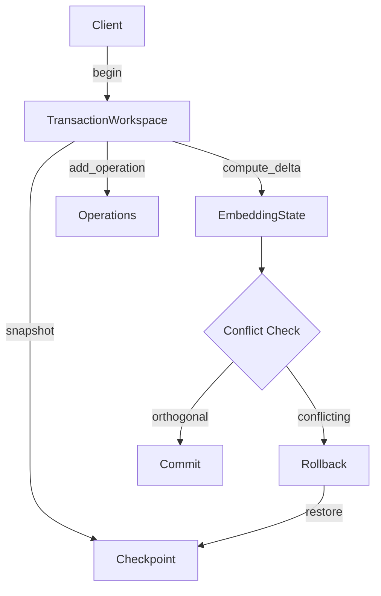
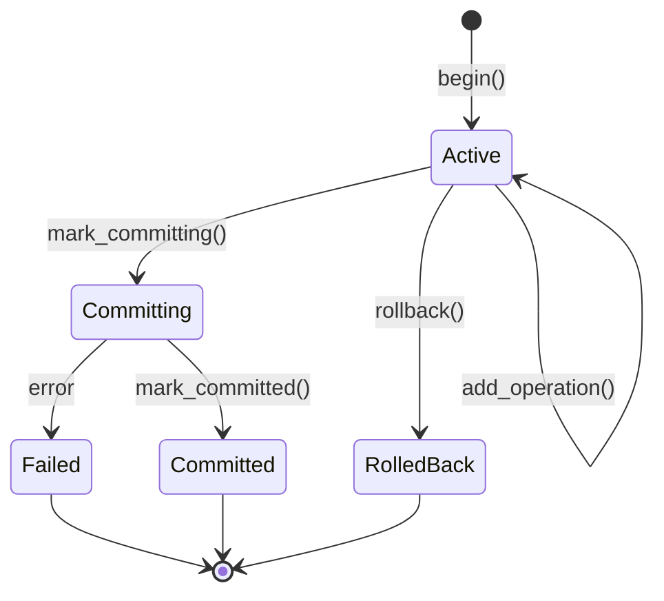
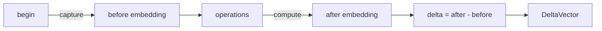
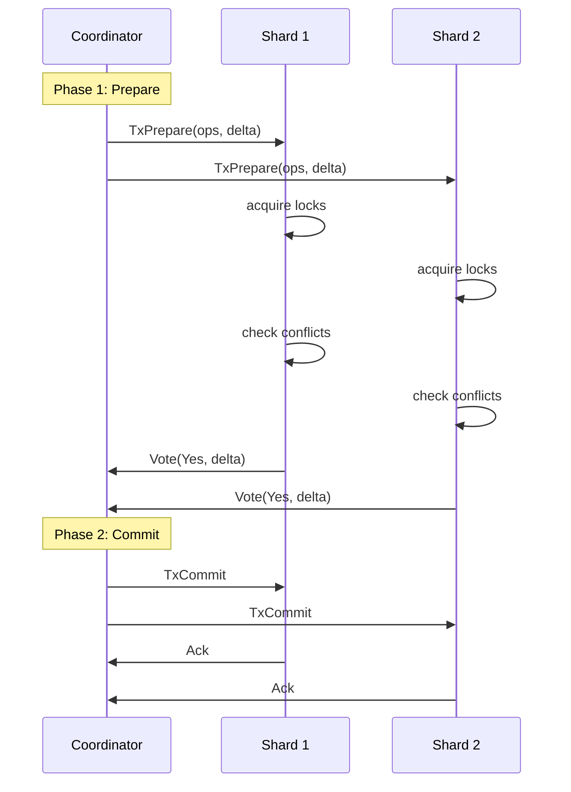

# Transaction Workspace

The transaction workspace system provides ACID transaction semantics for
tensor_chain operations. It enables isolated execution with snapshot-based
reads and atomic commits via delta tracking.

## Overview

Key features:

- **Snapshot isolation**: Reads see consistent state from transaction start
- **Delta tracking**: Changes tracked as semantic embeddings for conflict
  detection
- **Atomic commit**: All-or-nothing via block append
- **Cross-shard coordination**: Two-phase commit (2PC) for distributed
  transactions



## Workspace Lifecycle

### State Machine



### State Descriptions

| State | Description |
| --- | --- |
| Active | Operations can be added |
| Committing | Commit in progress, no more operations |
| Committed | Successfully committed to the chain |
| RolledBack | Rolled back, state restored from checkpoint |
| Failed | Error during commit, requires manual resolution |

## Transaction Operations

### Basic Usage

```rust
use tensor_chain::{TensorStore, TransactionWorkspace};
use tensor_chain::block::Transaction;

let store = TensorStore::new();

// Begin transaction
let workspace = TransactionWorkspace::begin(&store)?;

// Add operations
workspace.add_operation(Transaction::Put {
    key: "user:1".to_string(),
    data: vec![1, 2, 3],
})?;

workspace.add_operation(Transaction::Put {
    key: "user:2".to_string(),
    data: vec![4, 5, 6],
})?;

// Check affected keys
let keys = workspace.affected_keys();
assert!(keys.contains("user:1"));

// Commit or rollback
workspace.mark_committing()?;
workspace.mark_committed();
```

### Operation Types

| Operation | Description | Affected Key |
| --- | --- | --- |
| `Put` | Insert or update key | The key itself |
| `Delete` | Remove key | The key itself |
| `Update` | Modify existing key | The key itself |

## Delta Tracking

The workspace tracks changes as semantic embeddings using the `EmbeddingState`
machine. This enables conflict detection based on vector similarity.

### Before/After Embedding Flow



### Computing Deltas

```rust
// Set the before-state embedding at transaction start
workspace.set_before_embedding(before_embedding);

// ... execute operations ...

// Compute delta at commit time
workspace.compute_delta(after_embedding);

// Get delta for conflict detection
let delta_vector = workspace.to_delta_vector();
```

### Delta Vector Structure

| Field | Type | Description |
| --- | --- | --- |
| `embedding` | `Vec<f32>` | Semantic change vector |
| `affected_keys` | `HashSet<String>` | Keys modified by transaction |
| `tx_id` | `u64` | Transaction identifier |

## Isolation Levels

The workspace provides snapshot isolation by default. All reads within a
transaction see the state captured at `begin()`.

| Level | Dirty Reads | Non-Repeatable | Phantom Reads |
| --- | --- | --- | --- |
| Snapshot (default) | No | No | No |

### Snapshot Mechanism

1. `begin()` captures the store state as a binary checkpoint
2. All reads within the transaction see this snapshot
3. `rollback()` restores the snapshot if needed
4. Checkpoint is discarded after commit/rollback

## Lock Management

For distributed transactions, the `LockManager` provides key-level locking
with deadlock prevention.

### Lock Ordering

To prevent deadlocks, always acquire locks in this order:

1. `pending` - Transaction state map
2. `lock_manager.locks` - Key-level locks
3. `lock_manager.tx_locks` - Per-transaction lock sets
4. `pending_aborts` - Abort queue

### Lock Configuration

| Parameter | Default | Description |
| --- | --- | --- |
| `default_timeout` | 30s | Lock expiration time |
| `timeout_ms` | 5000 | Transaction timeout |

### Lock Acquisition

```rust
// Try to acquire locks for multiple keys
match lock_manager.try_lock(tx_id, &keys) {
    Ok(lock_handle) => {
        // Locks acquired successfully
    }
    Err(conflicting_tx) => {
        // Another transaction holds a lock
    }
}
```

## Cross-Shard Coordination

Distributed transactions use two-phase commit (2PC) for cross-shard
coordination.

### 2PC Protocol



### Transaction Phases

| Phase | Description |
| --- | --- |
| Preparing | Acquiring locks, computing deltas |
| Prepared | All participants voted YES |
| Committing | Finalizing the commit |
| Committed | Successfully committed |
| Aborting | Rolling back due to NO vote or timeout |
| Aborted | Successfully aborted |

### Prepare Vote Types

| Vote | Description | Action |
| --- | --- | --- |
| Yes | Ready to commit, locks acquired | Proceed to Phase 2 |
| No | Cannot commit (validation failed) | Abort |
| Conflict | Detected semantic conflict | Abort |

## Conflict Detection

The workspace uses delta embeddings to detect conflicts based on vector
similarity.

### Orthogonality Check

Two transactions are considered **orthogonal** (non-conflicting) if their
delta vectors have low cosine similarity:

```text
similarity = cos(delta_A, delta_B)
orthogonal = abs(similarity) < threshold
```

### Configuration

| Parameter | Default | Description |
| --- | --- | --- |
| `orthogonal_threshold` | 0.1 | Max similarity for orthogonal |
| `merge_window_ms` | 60000 | Window for merge candidates |

### Merge Candidates

The `TransactionManager` can find transactions eligible for parallel commit:

```rust
// Find orthogonal transactions that can be merged
let candidates = manager.find_merge_candidates(
    &workspace,
    0.1,      // orthogonal threshold
    60_000,   // merge window (60s)
);

// Candidates are sorted by similarity (most orthogonal first)
for candidate in candidates {
    println!("Tx {} similarity: {}", candidate.workspace.id(), candidate.similarity);
}
```

## Error Handling

| Error | Cause | Recovery |
| --- | --- | --- |
| `TransactionFailed` | Operation on non-active workspace | Check state first |
| `WorkspaceError` | Snapshot/restore failed | Check store health |
| `LockConflict` | Another tx holds the lock | Retry with backoff |
| `Timeout` | Transaction exceeded timeout | Increase timeout |

## Usage Example

### Complete Transaction Flow

```rust
use tensor_chain::{TensorStore, TransactionManager};
use tensor_chain::block::Transaction;

// Create manager
let store = TensorStore::new();
let manager = TransactionManager::new();

// Begin transaction
let workspace = manager.begin(&store)?;

// Add operations
workspace.add_operation(Transaction::Put {
    key: "account:1".to_string(),
    data: serialize(&Account { balance: 100 }),
})?;

workspace.add_operation(Transaction::Put {
    key: "account:2".to_string(),
    data: serialize(&Account { balance: 200 }),
})?;

// Set embeddings for conflict detection
workspace.set_before_embedding(vec![0.0; 128]);
workspace.compute_delta(compute_state_embedding(&store));

// Check for conflicts with other active transactions
let candidates = manager.find_merge_candidates(&workspace, 0.1, 60_000);
if candidates.is_empty() {
    // No orthogonal transactions, commit alone
    workspace.mark_committing()?;
    workspace.mark_committed();
} else {
    // Can merge with orthogonal transactions
    // ... merge logic ...
}

// Remove from manager
manager.remove(workspace.id());
```

## Source Reference

- `tensor_chain/src/transaction.rs` - TransactionWorkspace, TransactionManager
- `tensor_chain/src/distributed_tx.rs` - 2PC coordinator, LockManager
- `tensor_chain/src/embedding.rs` - EmbeddingState machine
- `tensor_chain/src/consensus.rs` - DeltaVector, conflict detection
