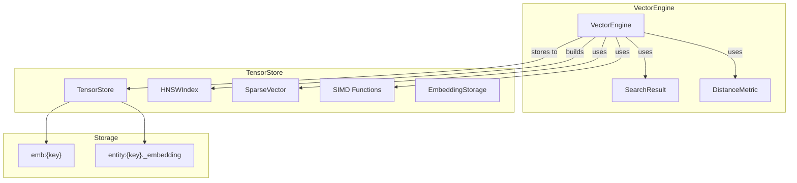
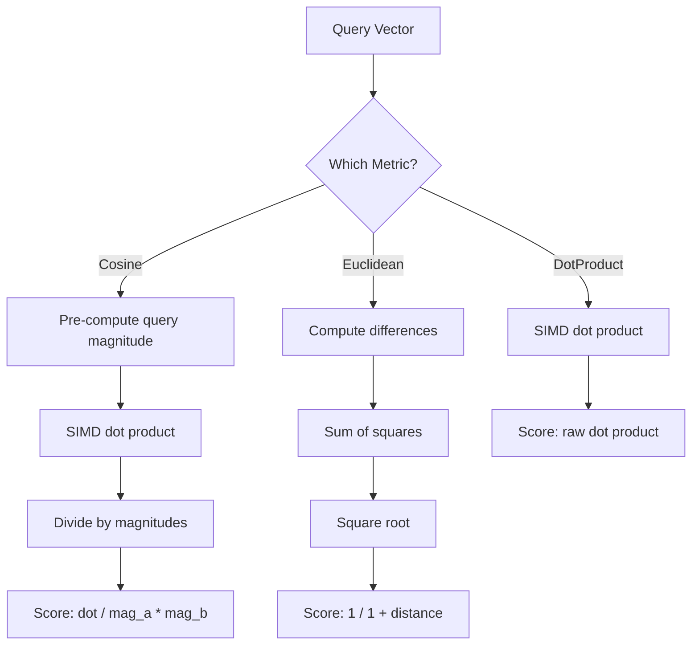
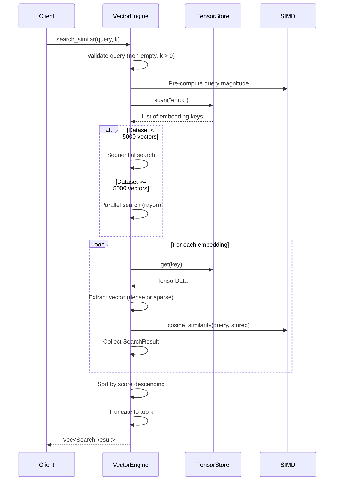
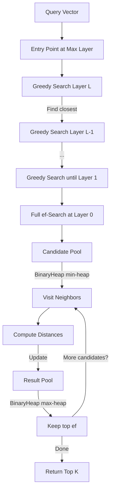
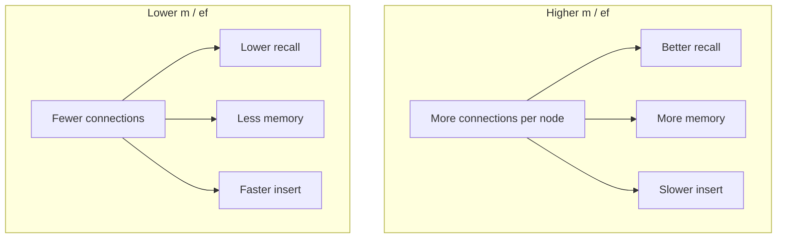

# Vector Engine

Module 4 of Neumann. Provides embeddings storage and similarity search with
SIMD-accelerated distance computations.

The Vector Engine builds on `tensor_store` to provide k-NN search capabilities.
It supports both brute-force O(n) search and HNSW O(log n) approximate search,
with automatic sparse vector optimization for memory efficiency.

## Design Principles

| Principle | Description |
| --- | --- |
| Layered Architecture | Depends only on Tensor Store for persistence |
| Multiple Distance Metrics | Cosine, Euclidean, and Dot Product similarity |
| SIMD Acceleration | 8-wide SIMD for dot products and magnitudes |
| Dual Search Modes | Brute-force O(n) or HNSW O(log n) |
| Unified Entities | Embeddings can be attached to shared entities |
| Thread Safety | Inherits from Tensor Store |
| Serializable Types | All types implement `serde::Serialize`/`Deserialize` |
| Automatic Sparsity Detection | Vectors with >50% zeros stored efficiently |

## Architecture



## Key Types

| Type | Description |
| --- | --- |
| `VectorEngine` | Main engine for storing and searching embeddings |
| `VectorEngineConfig` | Configuration for engine behavior and memory bounds |
| `SearchResult` | Result with key and similarity score |
| `DistanceMetric` | Enum: `Cosine`, `Euclidean`, `DotProduct` |
| `ExtendedDistanceMetric` | Extended metrics for HNSW (9+ variants) |
| `VectorError` | Error types for vector operations |
| `EmbeddingInput` | Input for batch store operations |
| `BatchResult` | Result of batch operations |
| `Pagination` | Parameters for paginated queries |
| `PagedResult<T>` | Paginated query result |
| `HNSWIndex` | Hierarchical navigable small world graph (re-exported from tensor_store) |
| `HNSWConfig` | HNSW index configuration (re-exported from tensor_store) |
| `SparseVector` | Memory-efficient sparse embedding storage |

### VectorError Variants

| Variant | Description | When Triggered |
| --- | --- | --- |
| `NotFound` | Embedding key doesn't exist | `get_embedding`, `delete_embedding` |
| `DimensionMismatch` | Vectors have different dimensions | `compute_similarity`, exceeds `max_dimension` |
| `EmptyVector` | Empty vector provided | Any operation with `vec![]` |
| `InvalidTopK` | top_k is 0 | `search_similar`, `search_with_hnsw` |
| `StorageError` | Underlying Tensor Store error | Storage failures |
| `BatchValidationError` | Invalid input in batch | `batch_store_embeddings` validation |
| `BatchOperationError` | Operation failed in batch | `batch_store_embeddings` execution |
| `ConfigurationError` | Invalid configuration | `VectorEngineConfig::validate()` |

## Configuration

### VectorEngineConfig

Configuration for the Vector Engine with memory bounds and performance tuning.

| Field | Type | Default | Description |
| --- | --- | --- | --- |
| `default_dimension` | `Option<usize>` | `None` | Expected embedding dimension |
| `sparse_threshold` | `f32` | `0.5` | Sparsity threshold (0.0-1.0) |
| `parallel_threshold` | `usize` | `5000` | Dataset size for parallel search |
| `default_metric` | `DistanceMetric` | `Cosine` | Default distance metric |
| `max_dimension` | `Option<usize>` | `None` | Maximum allowed dimension |
| `max_keys_per_scan` | `Option<usize>` | `None` | Limit for unbounded scans |
| `batch_parallel_threshold` | `usize` | `100` | Batch size for parallel processing |

### Configuration Presets

| Preset | Description | Key Settings |
| --- | --- | --- |
| `default()` | Balanced for most workloads | All defaults |
| `high_throughput()` | Optimized for write-heavy loads | `parallel_threshold: 1000` |
| `low_memory()` | Memory-constrained environments | `max_dimension: 4096`, `max_keys_per_scan: 10000` |

### Builder Methods

All builder methods are `const fn` for compile-time configuration:

```rust
let config = VectorEngineConfig::default()
    .with_default_dimension(768)
    .with_sparse_threshold(0.7)
    .with_parallel_threshold(1000)
    .with_default_metric(DistanceMetric::Cosine)
    .with_max_dimension(4096)
    .with_max_keys_per_scan(50_000)
    .with_batch_parallel_threshold(200);

let engine = VectorEngine::with_config(config)?;
```

### Memory Bounds

For production deployments, configure memory bounds to prevent resource exhaustion:

```rust
// Reject embeddings larger than 4096 dimensions
let config = VectorEngineConfig::default()
    .with_max_dimension(4096)
    .with_max_keys_per_scan(10_000);

let engine = VectorEngine::with_config(config)?;

// This will fail with DimensionMismatch
engine.store_embedding("too_big", vec![0.0; 5000])?; // Error!
```

## Distance Metrics

| Metric | Formula | Score Range | Use Case | HNSW Support |
| --- | --- | --- | --- | --- |
| Cosine | `a.b / (‖a‖ * ‖b‖)` | -1.0 to 1.0 | Semantic similarity | Yes |
| Euclidean | `1 / (1 + sqrt(sum((a-b)^2)))` | 0.0 to 1.0 | Spatial distance | No (brute-force) |
| DotProduct | `sum(a * b)` | unbounded | Magnitude-aware | No (brute-force) |

All metrics return higher scores for better matches. Euclidean distance is
transformed to similarity score.

### Extended Distance Metrics (HNSW)

The `ExtendedDistanceMetric` enum provides additional metrics for HNSW-based
search via `search_with_hnsw_and_metric()`:

| Metric | Description | Best For |
| --- | --- | --- |
| `Cosine` | Angle-based similarity | Text embeddings, normalized vectors |
| `Euclidean` | L2 distance | Spatial data, absolute distances |
| `Angular` | Cosine converted to angular | When angle interpretation needed |
| `Manhattan` | L1 norm | Robust to outliers |
| `Chebyshev` | L-infinity (max diff) | When max deviation matters |
| `Jaccard` | Set similarity | Binary/sparse vectors, TF-IDF |
| `Overlap` | Minimum overlap coefficient | Partial matches |
| `Geodesic` | Spherical distance | Geographic coordinates |
| `Composite` | Weighted combination | Custom similarity functions |

```rust
use vector_engine::ExtendedDistanceMetric;

let (index, keys) = engine.build_hnsw_index_default()?;

// Search with Jaccard similarity for sparse vectors
let results = engine.search_with_hnsw_and_metric(
    &index,
    &keys,
    &query,
    10,
    ExtendedDistanceMetric::Jaccard,
)?;
```

### Distance Metric Implementation Details



#### Cosine Similarity Edge Cases

```rust
// Zero-magnitude vectors return 0.0 similarity
let zero = vec![0.0, 0.0, 0.0];
let normal = vec![1.0, 2.0, 3.0];
VectorEngine::compute_similarity(&zero, &normal)?; // Returns 0.0

// Identical vectors return 1.0
VectorEngine::compute_similarity(&normal, &normal)?; // Returns 1.0

// Opposite vectors return -1.0
let opposite = vec![-1.0, -2.0, -3.0];
VectorEngine::compute_similarity(&normal, &opposite)?; // Returns -1.0

// Orthogonal vectors return 0.0
let a = vec![1.0, 0.0];
let b = vec![0.0, 1.0];
VectorEngine::compute_similarity(&a, &b)?; // Returns 0.0
```

#### Euclidean Distance Transformation

The engine transforms Euclidean distance to similarity score using `1 / (1 +
distance)`:

| Distance | Similarity Score |
| --- | --- |
| 0.0 | 1.0 (identical) |
| 1.0 | 0.5 |
| 2.0 | 0.333 |
| 9.0 | 0.1 |
| Infinity | 0.0 |

## SIMD Implementation

The Vector Engine uses 8-wide SIMD operations via the `wide` crate for
accelerated distance computations.

### SIMD Dot Product Algorithm

```rust
// Simplified view of the SIMD implementation
pub fn dot_product(a: &[f32], b: &[f32]) -> f32 {
    let chunks = a.len() / 8;        // Process 8 floats at a time
    let remainder = a.len() % 8;

    let mut sum = f32x8::ZERO;

    // Process 8 elements at a time with SIMD
    for i in 0..chunks {
        let offset = i * 8;
        let va = f32x8::from(&a[offset..offset + 8]);
        let vb = f32x8::from(&b[offset..offset + 8]);
        sum += va * vb;  // Parallel multiply-add
    }

    // Sum SIMD lanes + handle remainder scalar
    let arr: [f32; 8] = sum.into();
    let mut result: f32 = arr.iter().sum();

    // Handle remainder with scalar operations
    let start = chunks * 8;
    for i in 0..remainder {
        result += a[start + i] * b[start + i];
    }

    result
}
```

### SIMD Performance Characteristics

| Dimension | SIMD Speedup | Notes |
| --- | --- | --- |
| 8 | 1x | Baseline (single SIMD operation) |
| 64 | 4-6x | Full pipeline utilization |
| 384 | 6-8x | Sentence Transformers size |
| 768 | 6-8x | BERT embedding size |
| 1536 | 6-8x | OpenAI ada-002 size |
| 3072 | 6-8x | OpenAI text-embedding-3-large |

SIMD operations are cache-friendly due to sequential memory access patterns.

## API Reference

### Basic Operations

```rust
let engine = VectorEngine::new();

// Store an embedding
engine.store_embedding("doc1", vec![0.1, 0.2, 0.3])?;

// Get an embedding
let vector = engine.get_embedding("doc1")?;

// Delete an embedding
engine.delete_embedding("doc1")?;

// Check existence
engine.exists("doc1");  // -> bool

// Count embeddings
engine.count();  // -> usize

// List all keys
let keys = engine.list_keys();

// Clear all embeddings
engine.clear()?;

// Get dimension (from first embedding)
engine.dimension();  // -> Option<usize>
```

### Similarity Search

```rust
// Find top-k most similar (cosine by default)
let query = vec![0.1, 0.2, 0.3];
let results = engine.search_similar(&query, 5)?;

for result in results {
    println!("Key: {}, Score: {}", result.key, result.score);
}

// Search with specific metric
let results = engine.search_similar_with_metric(
    &query,
    5,
    DistanceMetric::Euclidean
)?;

// Direct similarity computation
let similarity = VectorEngine::compute_similarity(&vec_a, &vec_b)?;
```

### Batch Operations

For bulk insert and delete operations with parallel processing:

```rust
use vector_engine::EmbeddingInput;

// Batch store - validates all inputs first, then stores in parallel
let inputs = vec![
    EmbeddingInput::new("doc1", vec![0.1, 0.2, 0.3]),
    EmbeddingInput::new("doc2", vec![0.2, 0.3, 0.4]),
    EmbeddingInput::new("doc3", vec![0.3, 0.4, 0.5]),
];

let result = engine.batch_store_embeddings(inputs)?;
println!("Stored {} embeddings", result.count);  // -> 3

// Batch delete - returns count of successfully deleted
let keys = vec!["doc1".to_string(), "doc2".to_string()];
let deleted = engine.batch_delete_embeddings(keys)?;
println!("Deleted {} embeddings", deleted);  // -> 2
```

Batches larger than `batch_parallel_threshold` (default: 100) use parallel
processing via rayon.

### Pagination

For memory-efficient iteration over large datasets:

```rust
use vector_engine::Pagination;

// List keys with pagination
let page = Pagination::new(0, 100);  // skip=0, limit=100
let result = engine.list_keys_paginated(page);
println!("Items: {}, Has more: {}", result.items.len(), result.has_more);

// Get total count with pagination
let page = Pagination::new(0, 100).with_total();
let result = engine.list_keys_paginated(page);
println!("Total: {:?}", result.total_count);  // Some(total)

// Paginated similarity search
let page = Pagination::new(10, 5);  // skip first 10, return 5
let results = engine.search_similar_paginated(&query, 100, page)?;

// Paginated entity search
let results = engine.search_entities_paginated(&query, 100, page)?;
```

Use `list_keys_bounded()` for production to enforce `max_keys_per_scan` limits.

### Search Flow Diagram



### HNSW Index

For large datasets, build an HNSW index for O(log n) search:

```rust
// Build index with default config
let (index, key_mapping) = engine.build_hnsw_index_default()?;

// Search using the index
let results = engine.search_with_hnsw(&index, &key_mapping, &query, 10)?;

// Build with custom config
let config = HNSWConfig::high_recall();
let (index, key_mapping) = engine.build_hnsw_index(config)?;

// Direct HNSW operations
let index = HNSWIndex::new();
index.insert(vec![1.0, 2.0, 3.0]);
let results = index.search(&query, 10);

// Search with custom ef (recall/speed tradeoff)
let results = index.search_with_ef(&query, 10, 200);
```

### HNSW Search Flow



### Unified Entity Mode

Attach embeddings directly to entities for cross-engine queries:

```rust
let store = TensorStore::new();
let engine = VectorEngine::with_store(store.clone());

// Set embedding on an entity
engine.set_entity_embedding("user:1", vec![0.1, 0.2, 0.3])?;

// Get embedding from an entity
let embedding = engine.get_entity_embedding("user:1")?;

// Check if entity has embedding
engine.entity_has_embedding("user:1");  // -> bool

// Remove embedding (preserves other entity data)
engine.remove_entity_embedding("user:1")?;

// Search entities with embeddings
let results = engine.search_entities(&query, 5)?;

// Scan all entities with embeddings
let entity_keys = engine.scan_entities_with_embeddings();

// Count entities with embeddings
let count = engine.count_entities_with_embeddings();
```

Unified entity embeddings are stored in the `_embedding` field of the entity's
TensorData.

## Storage Model

| Key Pattern | Content | Use Case |
| --- | --- | --- |
| `emb:{key}` | TensorData with "vector" field | Standalone embeddings |
| `{entity_key}` | TensorData with "_embedding" field | Unified entities |

### Automatic Sparse Storage

Vectors with >50% zeros are automatically stored as sparse vectors:

```rust
// Detection threshold: nnz * 2 <= len (i.e., sparsity >= 50%)
fn should_use_sparse(vector: &[f32]) -> bool {
    let nnz = vector.iter().filter(|&&v| v.abs() > 1e-6).count();
    nnz * 2 <= vector.len()
}

// 97% sparse vector (3 non-zeros in 100 elements)
let mut sparse = vec![0.0f32; 100];
sparse[0] = 1.0;
sparse[50] = 2.0;
sparse[99] = 3.0;

// Stored efficiently as SparseVector
engine.store_embedding("sparse_doc", sparse)?;

// Retrieved as dense for computation
let dense = engine.get_embedding("sparse_doc")?;
```

### Storage Format Comparison

| Format | Memory per Element | Best For |
| --- | --- | --- |
| Dense | 4 bytes | Sparsity < 50% |
| Sparse | 8 bytes per non-zero (4 pos + 4 val) | Sparsity > 50% |

Example: 1000-dim vector with 100 non-zeros:

- Dense: 4000 bytes
- Sparse: 800 bytes (5x compression)

## Sparse Vector Operations

### Memory Layout

```text
SparseVector {
    dimension: usize,        // Total vector dimension
    positions: Vec<u32>,     // Sorted indices of non-zeros
    values: Vec<f32>,        // Corresponding values
}
```

### Sparse Dot Product Algorithm

```rust
// O(min(nnz_a, nnz_b)) - only overlapping positions contribute
pub fn dot(&self, other: &SparseVector) -> f32 {
    let mut result = 0.0;
    let mut i = 0;
    let mut j = 0;

    // Merge-sort style traversal
    while i < self.positions.len() && j < other.positions.len() {
        match self.positions[i].cmp(&other.positions[j]) {
            Equal => {
                result += self.values[i] * other.values[j];
                i += 1; j += 1;
            },
            Less => i += 1,
            Greater => j += 1,
        }
    }
    result
}
```

### Sparse-Dense Dot Product

```rust
// O(nnz) - only iterate over sparse non-zeros
pub fn dot_dense(&self, dense: &[f32]) -> f32 {
    self.positions.iter()
        .zip(&self.values)
        .map(|(&pos, &val)| val * dense[pos as usize])
        .sum()
}
```

### Sparse Distance Metrics

| Metric | Complexity | Description |
| --- | --- | --- |
| `dot` | O(min(nnz_a, nnz_b)) | Sparse-sparse dot product |
| `dot_dense` | O(nnz) | Sparse-dense dot product |
| `cosine_similarity` | O(min(nnz_a, nnz_b)) | Angle-based similarity |
| `euclidean_distance` | O(nnz_a + nnz_b) | L2 distance |
| `manhattan_distance` | O(nnz_a + nnz_b) | L1 distance |
| `jaccard_index` | O(min(nnz_a, nnz_b)) | Position overlap |
| `angular_distance` | O(min(nnz_a, nnz_b)) | Arc-cosine |

## HNSW Configuration

### Configuration Parameters

| Parameter | Default | Description |
| --- | --- | --- |
| `m` | 16 | Max connections per node per layer |
| `m0` | 32 | Max connections at layer 0 (2*m) |
| `ef_construction` | 200 | Candidates during index building |
| `ef_search` | 50 | Candidates during search |
| `ml` | 1/ln(m) | Level multiplier for layer selection |
| `sparsity_threshold` | 0.5 | Auto-sparse threshold |
| `max_nodes` | 10,000,000 | Capacity limit |

### Presets

| Preset | m | m0 | ef_construction | ef_search | Use Case |
| --- | --- | --- | --- | --- | --- |
| `default()` | 16 | 32 | 200 | 50 | Balanced |
| `high_recall()` | 32 | 64 | 400 | 200 | Accuracy over speed |
| `high_speed()` | 8 | 16 | 100 | 20 | Speed over accuracy |

### Tuning Guidelines



#### Workload-Specific Tuning

| Workload | Recommended Config | Rationale |
| --- | --- | --- |
| RAG/Semantic Search | `high_recall()` | Accuracy critical |
| Real-time recommendations | `high_speed()` | Latency critical |
| Batch processing | `default()` | Balanced |
| Small dataset (<10K) | Brute-force | HNSW overhead not worth it |
| Large dataset (>100K) | `default()` with higher ef_search | Scale benefits |

#### Memory vs Recall Tradeoff

| Config | Memory/Node | Recall@10 | Search Time |
| --- | --- | --- | --- |
| high_speed | ~128 bytes | ~85% | 0.1ms |
| default | ~256 bytes | ~95% | 0.3ms |
| high_recall | ~512 bytes | ~99% | 1.0ms |

## Performance Characteristics

| Operation | Complexity | Notes |
| --- | --- | --- |
| `store_embedding` | O(1) | Single store put |
| `get_embedding` | O(1) | Single store get |
| `delete_embedding` | O(1) | Single store delete |
| `search_similar` | O(n*d) | Brute-force, n=count, d=dimension |
| `search_with_hnsw` | O(log n *ef* m) | Approximate nearest neighbor |
| `build_hnsw_index` | O(n *log n* ef_construction * m) | Index construction |
| `count` | O(n) | Scans all embeddings |
| `list_keys` | O(n) | Scans all embeddings |

### Parallel Search Threshold

Automatic parallel iteration for datasets >5000 vectors:

```rust
const PARALLEL_THRESHOLD: usize = 5000;

if keys.len() >= PARALLEL_THRESHOLD {
    // Use rayon parallel iterator
    keys.par_iter().filter_map(...)
} else {
    // Use sequential iterator
    keys.iter().filter_map(...)
}
```

### Benchmark Results

| Dataset Size | Brute-Force | With HNSW | Speedup |
| --- | --- | --- | --- |
| 200 vectors | 4.17s | 9.3us | 448,000x |
| 1,000 vectors | ~5ms | ~20us | 250x |
| 10,000 vectors | ~50ms | ~50us | 1000x |
| 100,000 vectors | ~500ms | ~100us | 5000x |

## Supported Embedding Dimensions

| Model | Dimensions | Recommended Config |
| --- | --- | --- |
| OpenAI text-embedding-ada-002 | 1536 | default |
| OpenAI text-embedding-3-small | 1536 | default |
| OpenAI text-embedding-3-large | 3072 | high_recall |
| BERT base | 768 | default |
| Sentence Transformers | 384-768 | default |
| Cohere embed-v3 | 1024 | default |
| Custom/small | <256 | high_speed |

## Edge Cases and Gotchas

### Zero-Magnitude Vectors

| Metric | Behavior | Rationale |
| --- | --- | --- |
| Cosine | Returns empty results | Division by zero undefined |
| DotProduct | Returns empty results | Undefined direction |
| Euclidean | Works correctly | Finds vectors closest to origin |

### Dimension Mismatch Handling

```rust
// Mismatched dimensions are silently skipped during search
engine.store_embedding("2d", vec![1.0, 0.0])?;
engine.store_embedding("3d", vec![1.0, 0.0, 0.0])?;

// Search with 2D query only matches 2D vectors
let results = engine.search_similar(&[1.0, 0.0], 10)?;
assert_eq!(results.len(), 1);  // Only "2d" matched
```

### HNSW Limitations

| Limitation | Details | Workaround |
| --- | --- | --- |
| Only cosine similarity | HNSW uses cosine distance internally | Use brute-force for other metrics |
| No deletion | Cannot remove vectors | Rebuild index |
| Static after build | Index doesn't update with new vectors | Rebuild periodically |
| Memory overhead | Graph structure adds ~2-4x | Use for large datasets only |

### NaN/Infinity Handling

Sparse vector operations sanitize NaN/Inf results:

```rust
// cosine_similarity returns 0.0 for NaN/Inf
if result.is_nan() || result.is_infinite() {
    0.0
} else {
    result.clamp(-1.0, 1.0)
}

// cosine_distance_dense returns 1.0 (max distance) for NaN/Inf
if similarity.is_nan() || similarity.is_infinite() {
    1.0  // Maximum distance
} else {
    1.0 - similarity.clamp(-1.0, 1.0)
}
```

## Best Practices

### Memory Optimization

1. **Use sparse vectors for high-sparsity data**: Automatic at >50% zeros
2. **Batch insert for HNSW**: Build index once after all data loaded
3. **Choose appropriate HNSW config**: Don't over-provision m/ef
4. **Monitor memory with `HNSWMemoryStats`**: Track dense vs sparse counts

```rust
let stats = index.memory_stats();
println!("Dense: {}, Sparse: {}, Total bytes: {}",
    stats.dense_count, stats.sparse_count, stats.embedding_bytes);
```

### Search Performance

1. **Pre-compute query magnitude**: Done automatically in search
2. **Use HNSW for >10K vectors**: Brute-force for smaller sets
3. **Tune ef_search**: Higher for recall, lower for speed
4. **Parallel threshold**: Automatic at 5000 vectors

### Unified Entity Best Practices

1. **Use for cross-engine queries**: When embeddings relate to graph/relational
   data
2. **Entity key conventions**: Use prefixes like `user:`, `doc:`, `item:`
3. **Separate embedding namespace**: Use `store_embedding` for isolated vectors

## Dependencies

| Crate | Purpose |
| --- | --- |
| `tensor_store` | Persistence, SparseVector, HNSWIndex, SIMD |
| `rayon` | Parallel iteration for large datasets |
| `serde` | Serialization of types |
| `tracing` | Instrumentation and observability |

Note: `wide` (SIMD f32x8 operations) is a transitive dependency via `tensor_store`.

## Related Modules

- [Tensor Store](tensor-store.md) - Underlying storage and HNSW implementation
- [Query Router](query-router.md) - Executes SIMILAR queries using VectorEngine
- [Tensor Cache](tensor-cache.md) - Uses vector similarity for semantic caching
