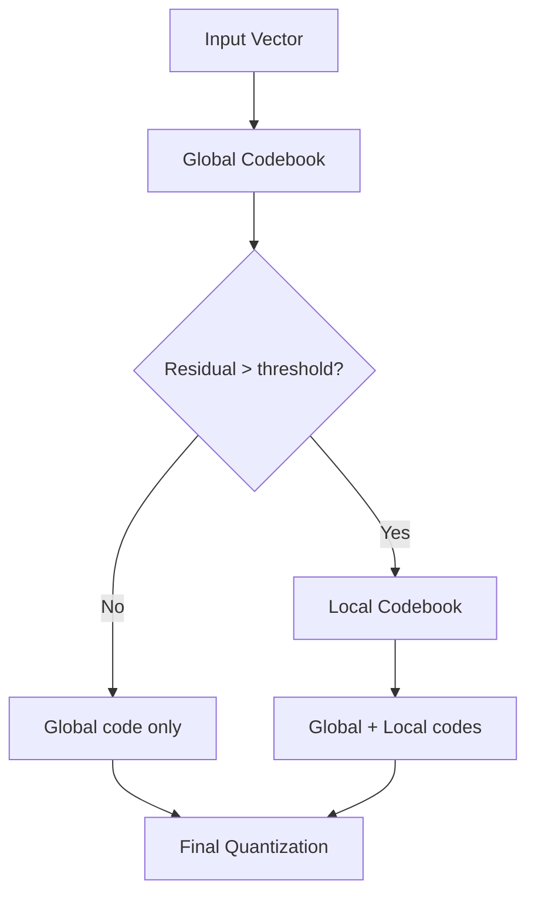
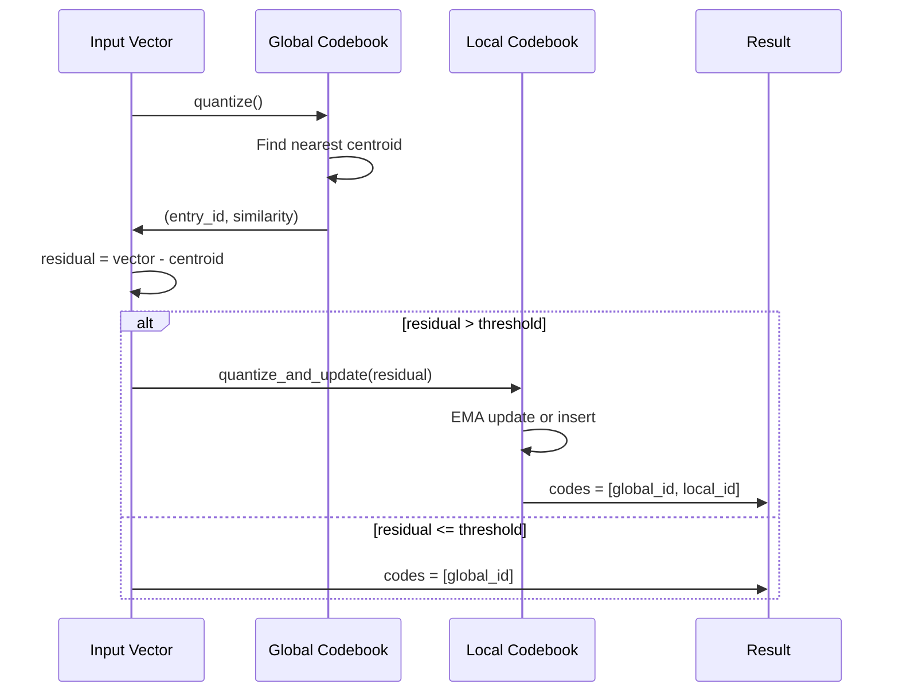
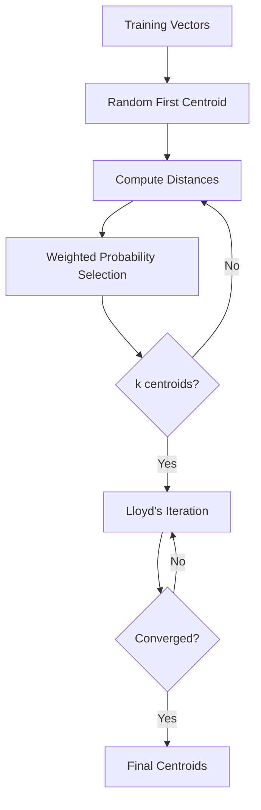

# Codebook Manager

The codebook system provides vector quantization for mapping continuous tensor
states to a finite vocabulary of valid states. It enables state validation and
efficient consensus through hierarchical quantization.

## Overview

The system consists of two levels:

- **GlobalCodebook**: Static codebook shared across all nodes for consensus
- **LocalCodebook**: Adaptive codebook per domain that captures residuals



## Global Codebook

The global codebook provides consensus-safe quantization using static
centroids shared by all nodes.

### Initialization Methods

| Method | Description |
| --- | --- |
| `new(dimension)` | Empty codebook |
| `from_centroids(Vec<Vec<f32>>)` | From pre-computed centroids |
| `from_centroids_with_labels` | Centroids with semantic labels |
| `from_kmeans(vectors, k, iters)` | Initialize via k-means clustering |

### Quantization

```rust
use tensor_chain::codebook::GlobalCodebook;

// Initialize from training data
let codebook = GlobalCodebook::from_kmeans(&training_vectors, 256, 100);

// Quantize a vector
if let Some((entry_id, similarity)) = codebook.quantize(&vector) {
    println!("Nearest entry: {}, similarity: {}", entry_id, similarity);
}

// Compute residual for hierarchical quantization
if let Some((id, residual)) = codebook.compute_residual(&vector) {
    // residual = vector - centroid[id]
}
```

## Local Codebook

Local codebooks adapt to domain-specific patterns using exponential moving
average (EMA) updates. They capture residuals that the global codebook
misses.

### EMA Update Formula

When an observation matches an existing entry:

```text
centroid_new = alpha * observation + (1 - alpha) * centroid_old
```

where `alpha` controls the learning rate (default: 0.1).

### Configuration

| Parameter | Default | Description |
| --- | --- | --- |
| `max_entries` | 256 | Maximum entries in the codebook |
| `ema_alpha` | 0.1 | EMA learning rate |
| `min_usage_for_prune` | 2 | Minimum accesses before pruning |
| `pruning_strategy` | Hybrid | How to select entries for removal |

### Pruning Strategies

| Strategy | Description | Score Formula |
| --- | --- | --- |
| LRU | Least Recently Used | `last_access` |
| LFU | Least Frequently Used | `access_count` |
| Hybrid | Weighted combination | `w1*recency + w2*frequency` |

```rust
use tensor_chain::codebook::{LocalCodebook, PruningStrategy};

let mut local = LocalCodebook::new("transactions", 128, 256, 0.1);

// Use LRU pruning
local.set_pruning_strategy(PruningStrategy::LRU);

// Or hybrid with custom weights
local.set_pruning_strategy(PruningStrategy::Hybrid {
    recency_weight: 0.7,
    frequency_weight: 0.3,
});
```

## CodebookManager

The `CodebookManager` coordinates hierarchical quantization across global
and local codebooks.

### Configuration

```rust
use tensor_chain::codebook::{CodebookManager, CodebookConfig, GlobalCodebook};

let config = CodebookConfig {
    local_capacity: 256,        // Max entries per local codebook
    ema_alpha: 0.1,             // EMA learning rate
    similarity_threshold: 0.9,   // Match threshold for local updates
    residual_threshold: 0.05,    // Min residual for local quantization
    validity_threshold: 0.8,     // State validity threshold
};

let global = GlobalCodebook::from_kmeans(&training_data, 512, 100);
let manager = CodebookManager::new(global, config);
```

### Hierarchical Quantization



### Usage

```rust
// Quantize a transaction embedding
let result = manager.quantize("transactions", &embedding)?;

println!("Global entry: {}", result.global_entry_id);
println!("Global similarity: {}", result.global_similarity);

if let Some(local_id) = result.local_entry_id {
    println!("Local entry: {}", local_id);
    println!("Local similarity: {}", result.local_similarity.unwrap());
}

// Final codes for storage/transmission
println!("Codes: {:?}", result.codes);
```

## State Validation

The codebook system validates states against known-good patterns.

### Validation Methods

```rust
// Check if a state is valid (matches any codebook entry)
let is_valid = manager.is_valid_state("transactions", &state);

// Check if a transition is valid
let is_valid_transition = manager.is_valid_transition(
    "transactions",
    &from_state,
    &to_state,
    0.5,  // max allowed distance
);
```

### Validation Flow

| Check | Threshold | Outcome |
| --- | --- | --- |
| Global match | `validity_threshold` | Valid if similarity >= threshold |
| Local match | `validity_threshold` | Valid if similarity >= threshold |
| Transition distance | `max_distance` | Valid if euclidean <= max |

## Worked Example

### Training and Runtime Quantization

```rust
use tensor_chain::codebook::{CodebookManager, CodebookConfig, GlobalCodebook};

// Phase 1: Training - build global codebook
let training_embeddings: Vec<Vec<f32>> = collect_training_data();
let global = GlobalCodebook::from_kmeans(&training_embeddings, 512, 100);

// Phase 2: Runtime - create manager
let config = CodebookConfig::default();
let manager = CodebookManager::new(global, config);

// Phase 3: Quantize incoming transactions
for tx in transactions {
    let embedding = compute_embedding(&tx);

    // Hierarchical quantization
    let quant = manager.quantize("transactions", &embedding)?;

    // Validate the state
    if !manager.is_valid_state("transactions", &embedding) {
        warn!("Unusual transaction state: {:?}", tx);
    }

    // Store codes for consensus
    tx.set_quantization_codes(quant.codes);
}

// Local codebook learns domain-specific patterns over time
manager.with_local("transactions", |local| {
    let stats = local.stats();
    println!("Local entries: {}", stats.entry_count);
    println!("Total updates: {}", stats.total_updates);
});
```

## k-Means Initialization

The global codebook uses k-means++ initialization for optimal centroid
placement.



### Configuration

```rust
use tensor_store::{KMeans, KMeansConfig};

let config = KMeansConfig {
    max_iterations: 100,
    tolerance: 1e-4,
    init_method: InitMethod::KMeansPlusPlus,
};

let kmeans = KMeans::new(config);
let centroids = kmeans.fit(&vectors, 512);
```

## Statistics and Monitoring

### Local Codebook Stats

| Metric | Description |
| --- | --- |
| `entry_count` | Current number of entries |
| `total_updates` | EMA updates performed |
| `total_lookups` | Quantization queries |
| `total_prunes` | Entries removed due to capacity |
| `total_insertions` | New entries added |

```rust
manager.with_local("transactions", |local| {
    let stats = local.stats();
    let hit_rate = 1.0 - (stats.total_insertions as f64 / stats.total_lookups as f64);
    println!("Cache hit rate: {:.2}%", hit_rate * 100.0);
});
```

## Source Reference

- `tensor_chain/src/codebook.rs` - Codebook implementations
- `tensor_store/src/lib.rs` - KMeans clustering
