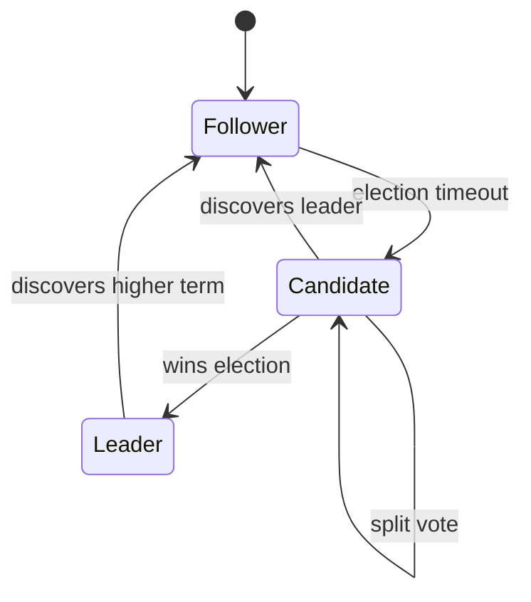
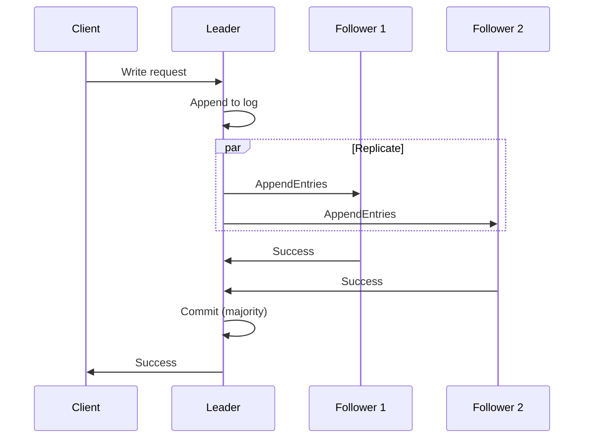
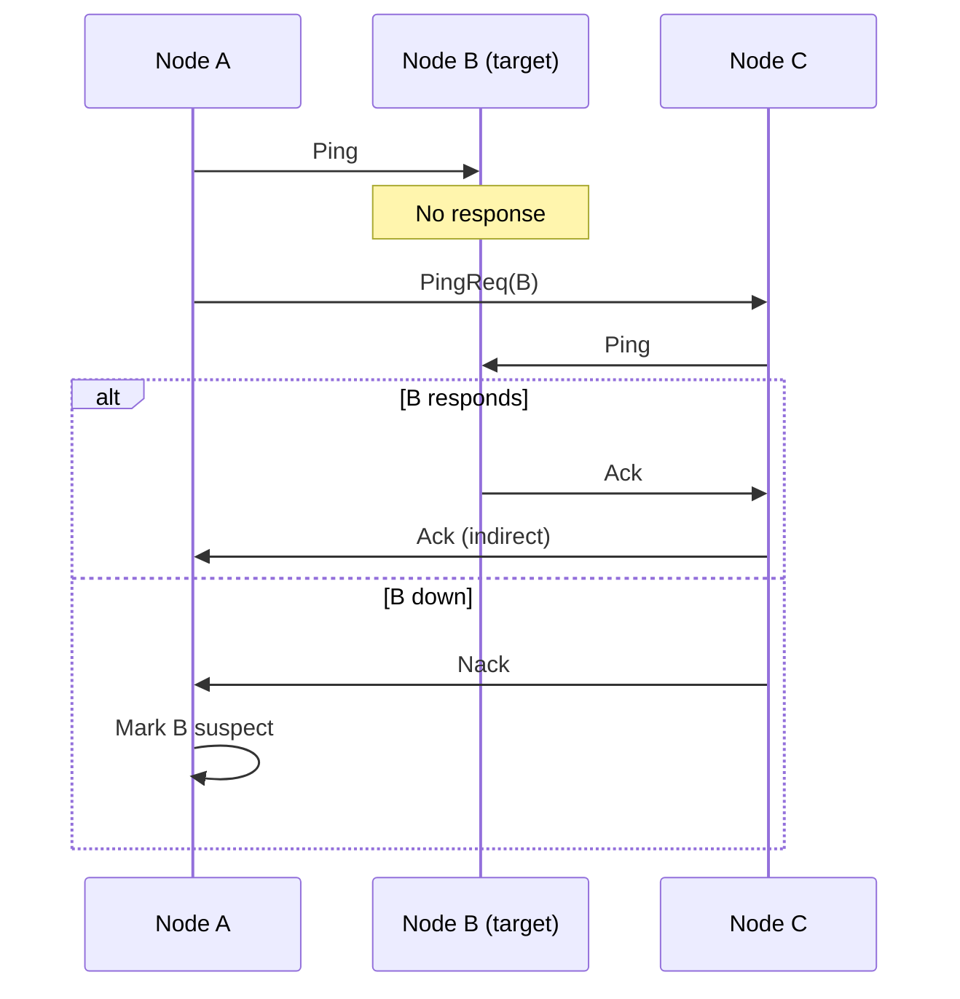
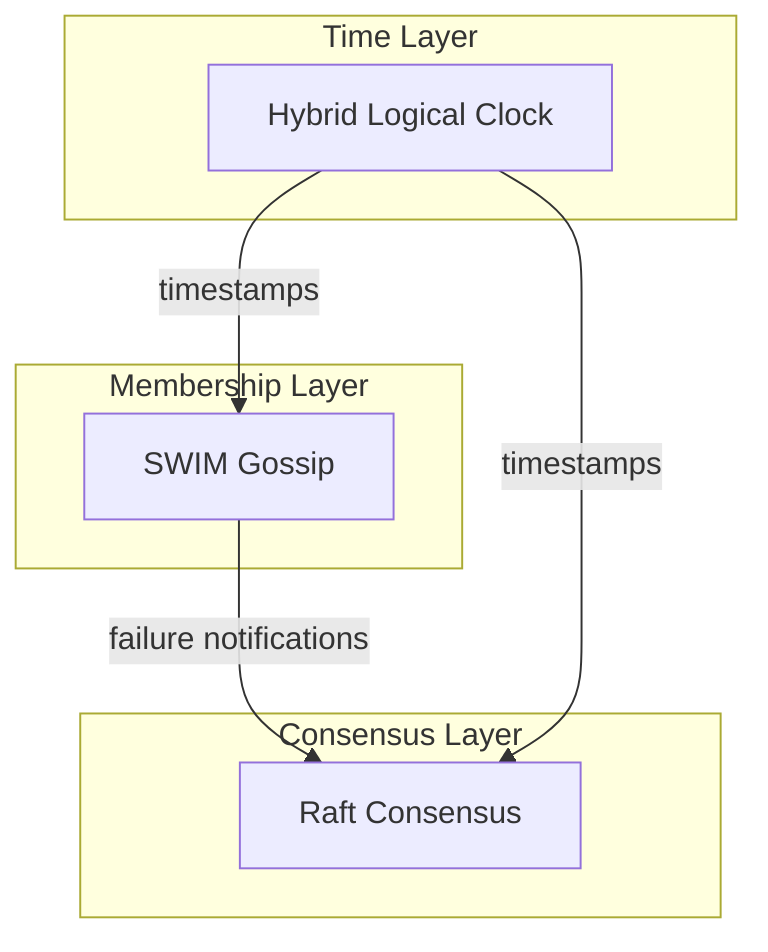

# Consensus Protocols

tensor_chain uses Raft consensus with SWIM gossip for membership management.

## Raft Consensus

### Overview

Raft provides:

- Leader election
- Log replication
- Safety (never returns incorrect results)
- Availability (operational if majority alive)

### Node States



### Terms

Time divided into terms with at most one leader:

```text
Term 1: [Leader A] -----> [Follower timeout]
Term 2: [Election] -> [Leader B] -----> ...
```

### Log Replication



### Configuration

| Parameter | Default | Description |
| --- | --- | --- |
| `election_timeout_min` | 150ms | Min election timeout |
| `election_timeout_max` | 300ms | Max election timeout |
| `heartbeat_interval` | 50ms | Leader heartbeat frequency |
| `max_entries_per_append` | 100 | Batch size for replication |

## SWIM Gossip

### Overview

Scalable Weakly-consistent Infection-style Membership:

- O(log N) failure detection
- Distributed membership view
- No single point of failure

### Protocol



### Node States

| State | Description | Transition |
| --- | --- | --- |
| Healthy | Responding normally | --- |
| Suspect | Failed direct ping | After timeout |
| Failed | Confirmed down | After indirect ping failure |

### LWW-CRDT Membership

Last-Writer-Wins with incarnation numbers:

```rust
// State comparison
fn supersedes(&self, other: &Self) -> bool {
    (self.incarnation, self.timestamp) > (other.incarnation, other.timestamp)
}

// Merge takes winner per node
fn merge(&mut self, other: &Self) {
    for (node_id, state) in &other.states {
        if state.supersedes(&self.states[node_id]) {
            self.states.insert(node_id.clone(), state.clone());
        }
    }
}
```

### Configuration

| Parameter | Default | Description |
| --- | --- | --- |
| `ping_interval` | 1s | Direct ping frequency |
| `ping_timeout` | 500ms | Time to wait for response |
| `suspect_timeout` | 3s | Time before marking failed |
| `indirect_ping_count` | 3 | Number of indirect pings |

## Hybrid Logical Clocks

Combine physical time with logical counters:

```rust
pub struct HybridTimestamp {
    wall_ms: u64,    // Physical time (milliseconds)
    logical: u16,    // Logical counter
}
```

### Properties

- Monotonic: Always increases
- Bounded drift: Stays close to wall clock
- Causality: If A happens-before B, then ts(A) < ts(B)

### Usage

```rust
let hlc = HybridLogicalClock::new(node_id);

// Local event
let ts = hlc.now();

// Receive message with timestamp
let ts = hlc.receive(message_ts);
```

## Formal Verification

Both protocols are formally specified in TLA+ and exhaustively
model-checked with TLC:

- **Raft.tla** verifies `ElectionSafety`, `LogMatching`,
  `StateMachineSafety`, `LeaderCompleteness`, `VoteIntegrity`,
  and `TermMonotonicity` across 18.3M distinct states.
- **Membership.tla** verifies `NoFalsePositivesSafety`,
  `MonotonicEpochs`, and `MonotonicIncarnations` across 54K
  distinct states.

Model checking found and led to fixes for protocol bugs including
out-of-order message handling in Raft log replication and an invalid
fairness formula in the gossip spec. See
[Formal Verification](formal-verification.md) for full results.

## Integration

Raft and SWIM work together:

1. **SWIM** detects node failures quickly
2. **Raft** handles leader election and log consistency
3. **HLC** provides ordering across the cluster


