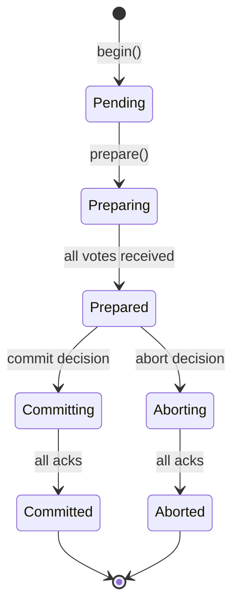

# Distributed Transactions

tensor_chain implements distributed transactions using Two-Phase Commit (2PC)
with semantic conflict detection.

## Transaction Lifecycle



## Two-Phase Commit

### Phase 1: Prepare

1. Coordinator sends `Prepare` to all participants
2. Each participant:
   - Acquires locks
   - Validates constraints
   - Writes to WAL
   - Votes `Yes` or `No`

### Phase 2: Commit/Abort

1. If all vote `Yes`: Coordinator sends `Commit`
2. If any vote `No`: Coordinator sends `Abort`
3. Participants apply or rollback

## Message Types

| Message | Direction | Purpose |
| --- | --- | --- |
| `TxPrepareMsg` | Coordinator -> Participant | Start prepare phase |
| `TxVote` | Participant -> Coordinator | Vote yes/no |
| `TxCommitMsg` | Coordinator -> Participant | Commit decision |
| `TxAbortMsg` | Coordinator -> Participant | Abort decision |
| `TxAck` | Participant -> Coordinator | Acknowledge commit/abort |

## Lock Management

### Lock Types

| Lock | Compatibility | Use |
| --- | --- | --- |
| Shared (S) | S-S compatible | Read operations |
| Exclusive (X) | Incompatible with all | Write operations |

### Lock Acquisition

```rust
// Acquire lock with timeout
let lock = lock_manager.acquire(
    tx_id,
    key,
    LockMode::Exclusive,
    Duration::from_secs(5),
)?;
```

## Deadlock Detection

Wait-for graph analysis:

```rust
// Check for cycles before waiting
if wait_graph.would_create_cycle(my_tx, blocking_tx) {
    // Abort to prevent deadlock
    return Err(DeadlockDetected);
}

// Register wait
wait_graph.add_wait(my_tx, blocking_tx);
```

### Victim Selection

| Policy | Behavior |
| --- | --- |
| Youngest | Abort most recent transaction |
| Oldest | Abort longest-running |
| LowestPriority | Abort lowest priority |
| MostLocks | Abort holding most locks |

## Semantic Conflict Detection

Beyond lock-based conflicts, tensor_chain detects semantic conflicts:

```rust
// Compute embedding deltas
let delta_a = tx_a.compute_delta();
let delta_b = tx_b.compute_delta();

// Check for semantic overlap
if delta_a.cosine_similarity(&delta_b) > CONFLICT_THRESHOLD {
    // Semantic conflict - need manual resolution
    return PrepareVote::Conflict { ... };
}
```

## Recovery

### Coordinator Failure

1. New coordinator queries participants for tx state
2. If any committed: complete commit
3. If all prepared: re-run commit decision
4. Otherwise: abort

### Participant Failure

1. Participant replays WAL on restart
2. For prepared transactions: query coordinator
3. Apply commit or abort based on coordinator state

## Configuration

```rust
pub struct DistributedTxConfig {
    /// Prepare phase timeout
    pub prepare_timeout_ms: u64,
    /// Commit phase timeout
    pub commit_timeout_ms: u64,
    /// Maximum concurrent transactions
    pub max_concurrent_tx: usize,
    /// Lock wait timeout
    pub lock_timeout_ms: u64,
}
```

## Best Practices

1. **Keep transactions short**: Long transactions increase conflict probability
2. **Order lock acquisition**: Acquire locks in consistent order to prevent
   deadlocks
3. **Use appropriate isolation**: Not all operations need serializable isolation
4. **Monitor deadlock rate**: High rates indicate contention issues
