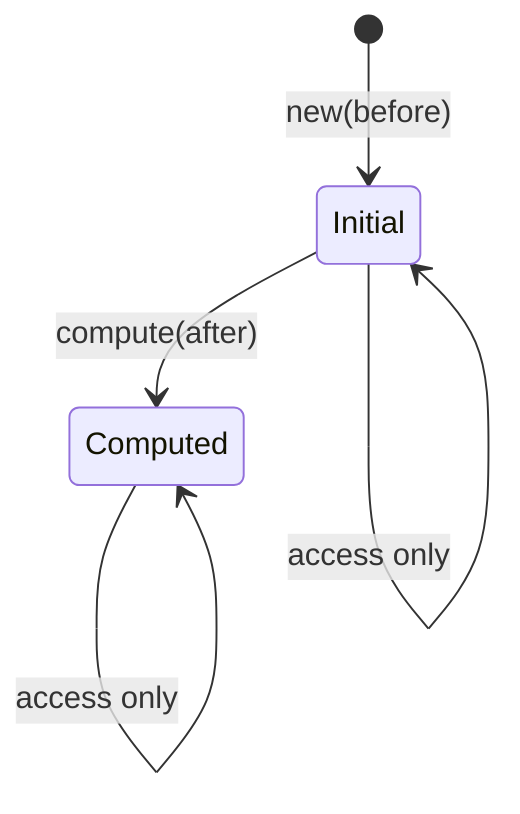

# Embedding State Machine

The `EmbeddingState` provides type-safe state transitions for transaction
embedding lifecycle. It eliminates Option ceremony and ensures correct API
usage at compile time.

## Overview

Transaction embeddings track the semantic change from before-state to
after-state. The state machine ensures:

- Before embedding is always available
- Delta is only accessible after computation
- Dimension mismatches are caught early
- Double-computation is prevented

## State Diagram



| State | Description | Available Data |
| --- | --- | --- |
| Initial | Transaction started, before captured | before |
| Computed | Delta computed, ready for conflict check | before, after, delta |

## API Reference

### Construction Methods

| Method | Description | Result State |
| --- | --- | --- |
| `new(before)` | Create from sparse vector | Initial |
| `from_dense(&[f32])` | Create from dense slice | Initial |
| `empty(dim)` | Create zero vector of given dimension | Initial |
| `default()` | Create empty (dimension 0) | Initial |

### State Query Methods

| Method | Initial | Computed |
| --- | --- | --- |
| `before()` | `&SparseVector` | `&SparseVector` |
| `after()` | `None` | `Some(&SparseVector)` |
| `delta()` | `None` | `Some(&SparseVector)` |
| `is_computed()` | `false` | `true` |
| `dimension()` | dimension | dimension |

### Transition Methods

| Method | From | To | Error Conditions |
| --- | --- | --- | --- |
| `compute(after)` | Initial | Computed | AlreadyComputed, DimensionMismatch |
| `compute_from_dense(&[f32])` | Initial | Computed | AlreadyComputed, DimensionMismatch |
| `compute_with_threshold(after, threshold)` | Initial | Computed | AlreadyComputed, DimensionMismatch |

## Threshold Configuration

The `compute_with_threshold` method creates sparse deltas by ignoring small
changes. This reduces memory usage for high-dimensional embeddings.

### Threshold Effects

| Threshold | Effect | Use Case |
| --- | --- | --- |
| 0.0 | All differences captured | Exact tracking |
| 0.001 | Ignore floating-point noise | General use |
| 0.01 | Ignore minor changes | Dimensionality reduction |
| 0.1 | Only major changes | Coarse conflict detection |

### Example

```rust
let state = EmbeddingState::from_dense(&before);

// Only capture differences > 0.01
let computed = state.compute_with_threshold(&after, 0.01)?;

// Sparse delta - fewer non-zero entries
let delta = computed.delta().unwrap();
println!("Non-zero entries: {}", delta.nnz());
```

## Error Handling

### Error Types

| Error | Cause | Prevention |
| --- | --- | --- |
| `NotComputed` | Accessing delta before compute | Check `is_computed()` |
| `AlreadyComputed` | Calling compute twice | Check `is_computed()` |
| `DimensionMismatch` | Before and after have different dims | Validate dimensions |

### Error Display

```rust
// NotComputed
"delta not yet computed"

// AlreadyComputed
"delta already computed"

// DimensionMismatch
"dimension mismatch: before=128, after=64"
```

## Example Usage

### Basic Workflow

```rust
use tensor_chain::embedding::EmbeddingState;
use tensor_store::SparseVector;

// 1. Capture before-state at transaction start
let before = SparseVector::from_dense(&[1.0, 0.0, 0.0, 0.0]);
let state = EmbeddingState::new(before);

// 2. State is Initial - delta not available
assert!(!state.is_computed());
assert!(state.delta().is_none());

// 3. Compute delta at commit time
let after = SparseVector::from_dense(&[1.0, 0.5, 0.0, 0.0]);
let computed = state.compute(after)?;

// 4. State is Computed - delta available
assert!(computed.is_computed());
let delta = computed.delta().unwrap();

// Delta is [0.0, 0.5, 0.0, 0.0]
assert_eq!(delta.nnz(), 1);  // Only one non-zero
```

### Using delta_or_zero

For code that needs a dense vector regardless of state:

```rust
// Safe to call in any state
let dense_delta = state.delta_or_zero();

// Returns zeros if Initial
// Returns actual delta if Computed
```

### Delta Magnitude

```rust
// Check if transaction made significant changes
let magnitude = state.delta_magnitude();

if magnitude < 0.001 {
    println!("No meaningful changes");
} else {
    println!("Change magnitude: {}", magnitude);
}
```

## Integration with Consensus

The embedding state integrates with the consensus layer for conflict detection.

### Delta to DeltaVector

```rust
use tensor_chain::consensus::DeltaVector;

let state = EmbeddingState::from_dense(&before);
let computed = state.compute_from_dense(&after)?;

// Create DeltaVector for conflict detection
let delta_vec = DeltaVector::new(
    computed.delta_or_zero(),
    affected_keys,
    tx_id,
);

// Check orthogonality with another transaction
let similarity = delta_vec.cosine_similarity(&other_delta);
if similarity.abs() < 0.1 {
    println!("Transactions are orthogonal - can merge");
}
```

### Conflict Classification

| Similarity | Classification | Action |
| --- | --- | --- |
| < 0.1 | Orthogonal | Can merge |
| 0.1 - 0.5 | Low conflict | Merge possible |
| 0.5 - 0.9 | Conflicting | Needs resolution |
| > 0.9 | Parallel | Must serialize |

## Serialization

The state machine supports bincode serialization for persistence:

```rust
// Serialize
let bytes = bincode::serialize(&state)?;

// Deserialize
let restored: EmbeddingState = bincode::deserialize(&bytes)?;

// State is preserved
assert_eq!(state.is_computed(), restored.is_computed());
```

## Source Reference

- `tensor_chain/src/embedding.rs` - EmbeddingState implementation
- `tensor_store/src/lib.rs` - SparseVector type
