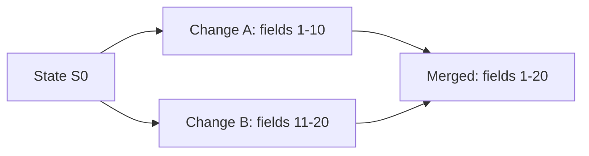
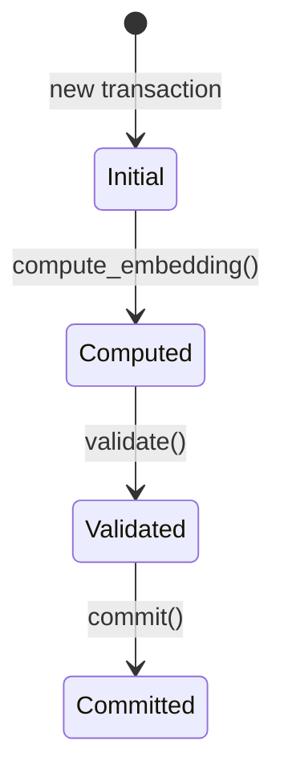

# Semantic Operations

Semantic operations in Neumann leverage vector embeddings to perform
meaning-aware computations.

## Core Concepts

### Embeddings

Embeddings map data to vector space where similar items are close:

```text
"cat" -> [0.2, 0.8, 0.1, ...]
"dog" -> [0.3, 0.7, 0.2, ...]  (close to cat)
"car" -> [0.9, 0.1, 0.5, ...]  (far from cat)
```

### Similarity Search

Find items similar to a query:

```sql
SELECT * FROM documents
WHERE SIMILAR(embedding, query_vec, 0.8)
LIMIT 10;
```

## Operations

### Conflict Detection

In tensor_chain, semantic operations detect conflicts:

```rust
// Two changes conflict if their deltas overlap
let conflict = delta_a.cosine_similarity(&delta_b) > threshold;

// Orthogonal changes can be merged
if delta_a.is_orthogonal(&delta_b) {
    let merged = delta_a.add(&delta_b);
}
```

### Auto-Merge

Non-conflicting changes merge automatically:



### Semantic Conflict Resolution

When changes overlap:

| Scenario | Detection | Resolution |
| --- | --- | --- |
| Orthogonal | `similarity < 0.1` | Auto-merge |
| Partial overlap | `0.1 <= similarity < 0.5` | Manual review |
| Direct conflict | `similarity >= 0.5` | Reject newer |

## Codebook Quantization

For efficient similarity comparisons:

### Global Codebook

Static centroids for consensus validation:

```rust
let codebook = GlobalCodebook::new(1024, 128); // 1024 centroids, 128 dims
let quantized = codebook.quantize(&embedding);
```

### Local Codebook

Adaptive centroids per domain:

```rust
let mut codebook = LocalCodebook::new(256, 128);
codebook.update(&new_embeddings, 0.1); // EMA update
```

## Distance Metrics

| Metric | Use Case | Properties |
| --- | --- | --- |
| Cosine | Text similarity | Scale-invariant |
| Euclidean | Spatial data | Absolute distance |
| Angular | Normalized comparison | [0, 1] range |
| Geodesic | Manifold data | Curvature-aware |

## Cache Semantic Search

tensor_cache uses semantic similarity:

```rust
// Exact match first
if let Some(hit) = cache.get_exact(&prompt_hash) {
    return hit;
}

// Then semantic search
if let Some(hit) = cache.search_similar(&prompt_embedding, 0.95) {
    return hit;
}
```

## Embedding State Machine

tensor_chain tracks embedding lifecycle:



```rust
pub enum EmbeddingState {
    Initial,                    // No embedding yet
    Computed(SparseVector),     // Computed, not validated
    Validated(SparseVector),    // Passed validation
}
```
