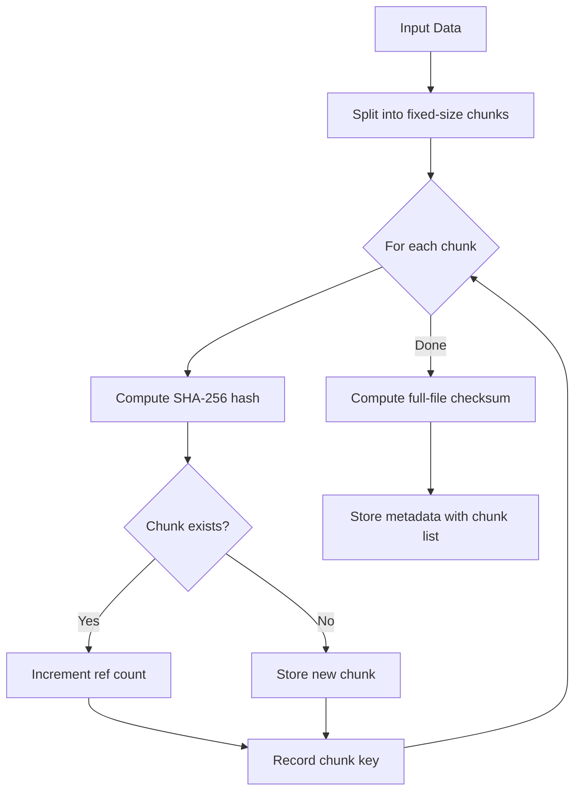
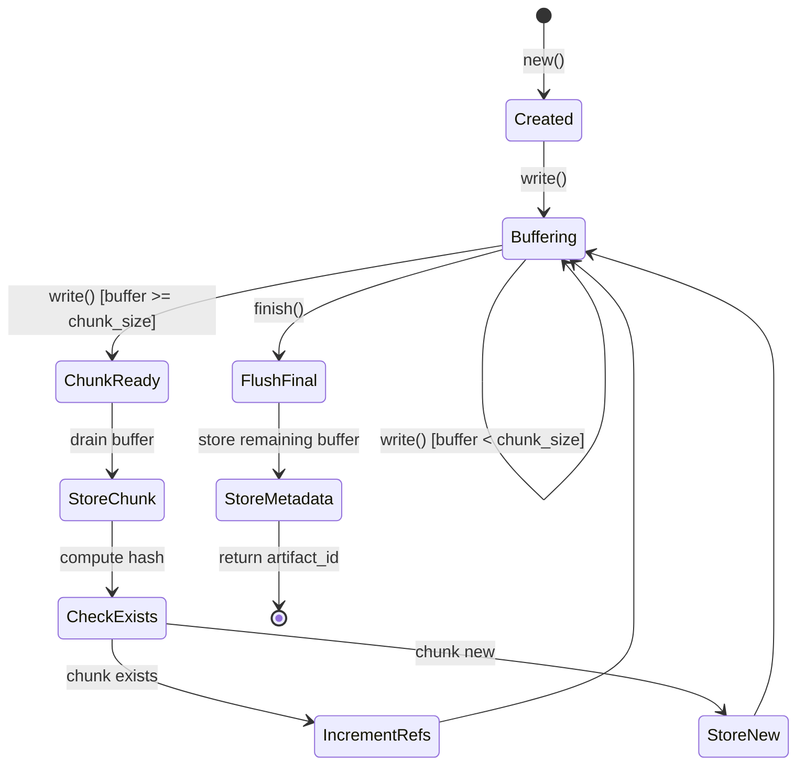
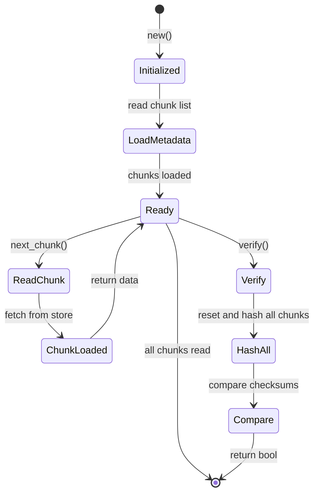
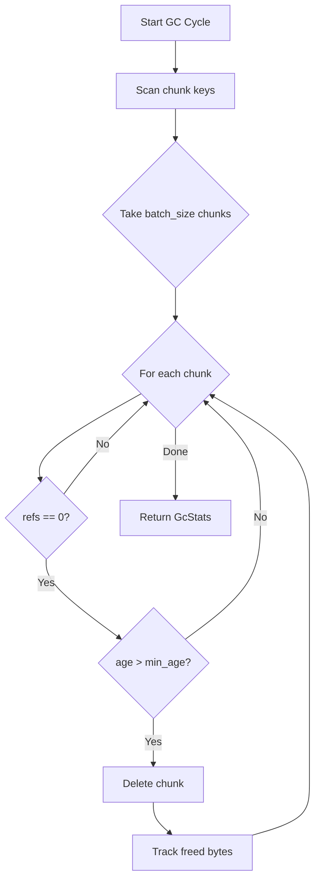
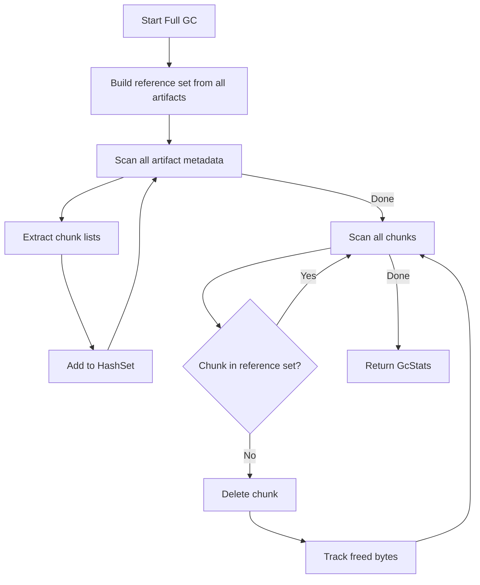
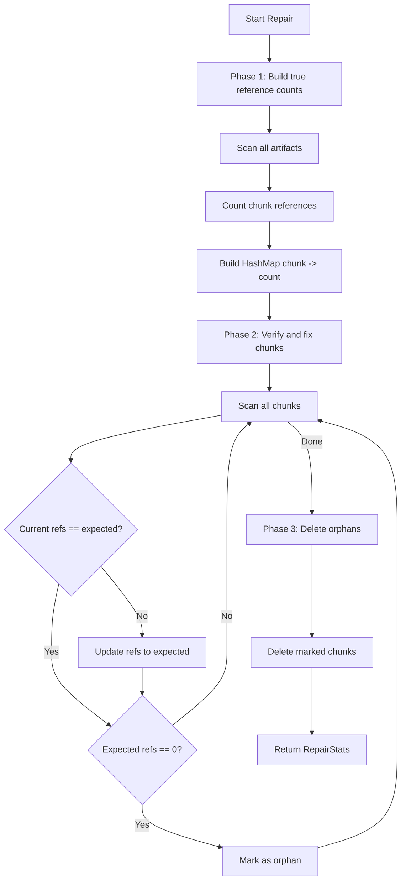

# Blob Storage Design

This document explains the content-addressable storage architecture of
`tensor_blob`: why fixed-size chunking with SHA-256 was chosen, how
deduplication works through reference counting, how the streaming I/O model
avoids loading large files into memory, and why all operations are async-first.

For the full type and configuration reference, see the
[Tensor Blob API Reference](../reference/api/tensor-blob.md). For practical
usage examples, see
[How to: Store and Retrieve Blobs](../how-to/store-retrieve-blobs.md).

## Architecture

```text
+--------------------------------------------------+
|                BlobStore (Public API)             |
|   - put, get, delete, exists                     |
|   - metadata, update_metadata                    |
|   - link, unlink, tag, untag                     |
|   - verify, repair, gc, full_gc                  |
+--------------------------------------------------+
            |              |              |
    +-------+      +-------+      +-------+
    |              |              |
+--------+   +-----------+   +----------+
| Writer |   |  Reader   |   |    GC    |
| Stream |   |  Stream   |   | (Tokio)  |
+--------+   +-----------+   +----------+
    |              |              |
    +-------+------+------+-------+
            |
    +------------------+
    |     Chunker      |
    |   SHA-256 hash   |
    +------------------+
            |
    +------------------+
    |   tensor_store   |
    | _blob:meta:*     |
    | _blob:chunk:*    |
    +------------------+
```

## Content-Addressable Design

Artifacts are split into fixed-size chunks (default 1 MB), each identified by
its SHA-256 hash. This design provides:

1. **Automatic deduplication**: Identical data across different artifacts shares
   the same physical chunks, saving storage proportional to data redundancy
2. **Integrity verification**: Any chunk can be independently verified by
   recomputing its hash
3. **Incremental operations**: Uploading or downloading can be interrupted and
   resumed at chunk boundaries

### Chunking Algorithm



Fixed-size chunking was chosen over content-defined chunking (e.g., Rabin
fingerprinting) for simplicity and predictable performance. The trade-off is
slightly lower deduplication for data with insertions, but fixed chunks have O(1)
seek and consistent memory usage.

### Chunk Key Format

```text
_blob:chunk:sha256:{64_hex_chars}
```

Example:

```text
_blob:chunk:sha256:b94d27b9934d3e08a52e52d7da7dabfac484efe37a5380ee9088f7ace2efcde9
```

### SHA-256 Computation

```rust
use sha2::{Digest, Sha256};

// Single-shot hash for chunk content
pub fn compute_hash(data: &[u8]) -> String {
    let mut hasher = Sha256::new();
    hasher.update(data);
    let result = hasher.finalize();
    format!("sha256:{:x}", result)
}

// Streaming hash for large files (used by BlobWriter)
pub struct StreamingHasher {
    hasher: Sha256,
}

impl StreamingHasher {
    pub fn new() -> Self {
        Self { hasher: Sha256::new() }
    }

    pub fn update(&mut self, data: &[u8]) {
        self.hasher.update(data);
    }

    pub fn finalize(self) -> String {
        let result = self.hasher.finalize();
        format!("sha256:{:x}", result)
    }
}
```

Note the distinction between the **checksum** (`_checksum` field, SHA-256 of
entire file content) and the **chunk hash** (in the key, SHA-256 of individual
chunk data). These are different values and cannot be compared directly.

## Deduplication Through Reference Counting

Chunks maintain a `_refs` counter tracking how many artifacts reference them:

- When a chunk is first stored, `_refs = 1`
- When a new artifact references an existing chunk, `_refs` is incremented
- When an artifact is deleted, `_refs` is decremented for each of its chunks
- Chunks with `_refs = 0` are eligible for garbage collection

```rust
let data = vec![0u8; 10_000];

// Store same data twice
blob.put("file1.bin", &data, PutOptions::default()).await?;
blob.put("file2.bin", &data, PutOptions::default()).await?;

let stats = blob.stats().await?;
// stats.chunk_count = 1 (deduplicated)
// stats.dedup_ratio > 0.0
```

The deduplication ratio is calculated as:

```rust
let dedup_ratio = if total_bytes > 0 {
    1.0 - (unique_bytes as f64 / total_bytes as f64)
} else {
    0.0
};
```

A ratio of 0.5 means 50% space savings through deduplication.

### Concurrent Deduplication Caveat

The reference counting is not fully atomic. If two writers simultaneously store
the same chunk, both may check `exists()` and find it missing, both store with
`_refs = 1`, and one write overwrites the other. The result: ref count may be 1
instead of 2.

**Mitigation**: For high-concurrency scenarios, use `full_gc()` periodically to
rebuild accurate reference counts from scratch.

## Streaming I/O Model

The streaming model was chosen to handle arbitrarily large files without loading
them entirely into memory. Both upload and download operate at chunk granularity.

### Streaming Upload (BlobWriter)



The writer maintains an internal buffer. When `write()` is called, data is
appended to the buffer. Once the buffer reaches `chunk_size`, the complete chunk
is drained, hashed, and stored. On `finish()`, any remaining buffered data is
flushed as a final (possibly smaller) chunk, and metadata is written.

```rust
pub struct BlobWriter {
    store: TensorStore,
    chunker: Chunker,
    state: WriteState,
    chunks: Vec<String>,     // Ordered list of chunk keys
    total_size: usize,       // Running total of bytes written
    hasher: StreamingHasher, // Incremental full-file hash
    buffer: Vec<u8>,         // Incomplete chunk buffer
}
```

The `StreamingHasher` computes the full-file checksum incrementally, independent
of chunk boundaries. This means the checksum is always correct regardless of
write sizes.

### Streaming Download (BlobReader)



Three read modes:

1. **Chunk-at-a-time**: Best for batch processing
2. **Read all**: Convenient for small files
3. **Buffer-based**: For streaming to other APIs

## Async-First Design Rationale

All `BlobStore` operations are async via Tokio. This design was mandated because:

1. **Large file I/O**: Streaming uploads and downloads involve many small I/O
   operations that would block threads in a synchronous model
2. **Background GC**: Garbage collection runs as a Tokio task with `select!` for
   graceful shutdown
3. **Integration with other async crates**: The Neumann ecosystem uses Tokio for
   `tensor_chain` (Raft consensus) and `neumann_server` (gRPC)

**Important**: Do not use blocking I/O in `tensor_blob`. The CLAUDE.md project
rules explicitly state this constraint.

## Garbage Collection

Two GC modes address different operational needs:

### Incremental GC

Processes a limited batch of chunks per cycle, respecting age requirements to
avoid deleting chunks from in-progress uploads:



The `min_age` guard is critical: a writer that takes longer than `min_age` to
complete may have its chunks collected. Set `gc_min_age` longer than your maximum
expected upload time.

### Full GC

Rebuilds reference counts from scratch by scanning all artifact metadata, then
deletes all unreferenced chunks regardless of age:



Full GC is more expensive but corrects any reference count drift from concurrent
deduplication races.

### Background GC Task

The GC runs as a Tokio task that responds to both timer ticks and shutdown
signals:

```rust
pub fn start(self: Arc<Self>) -> JoinHandle<()> {
    let gc = Arc::clone(&self);
    tokio::spawn(async move {
        gc.run().await;
    })
}

async fn run(&self) {
    let mut interval = interval(self.config.check_interval);
    let mut shutdown_rx = self.shutdown_tx.subscribe();

    loop {
        tokio::select! {
            _ = interval.tick() => {
                let _ = self.gc_cycle().await;
            }
            _ = shutdown_rx.recv() => {
                break;
            }
        }
    }
}
```

## Integrity Verification and Repair

### Artifact Verification

Verifies an artifact by re-hashing all its chunks in order and comparing against
the stored checksum:

```rust
pub async fn verify_artifact(store: &TensorStore, artifact_id: &str) -> Result<bool> {
    let meta_key = format!("_blob:meta:{artifact_id}");
    let tensor = store.get(&meta_key)?;

    let expected_checksum = get_string(&tensor, "_checksum")?;
    let chunks = get_pointers(&tensor, "_chunks")?;

    let mut hasher = StreamingHasher::new();
    for chunk_key in &chunks {
        let chunk_tensor = store.get(chunk_key)?;
        let chunk_data = get_bytes(&chunk_tensor, "_data")?;
        hasher.update(&chunk_data);
    }

    let actual_checksum = hasher.finalize();
    Ok(actual_checksum == expected_checksum)
}
```

### Repair Algorithm

The repair operation runs in three phases:

1. **Build true reference counts** from all artifact metadata
2. **Verify and fix** stored reference counts where they differ
3. **Delete orphans** -- chunks with zero expected references



## See Also

- [Tensor Blob API Reference](../reference/api/tensor-blob.md) -- complete type
  tables, configuration options, and method signatures
- [How to: Store and Retrieve Blobs](../how-to/store-retrieve-blobs.md) --
  practical examples for uploading, downloading, and managing blobs
