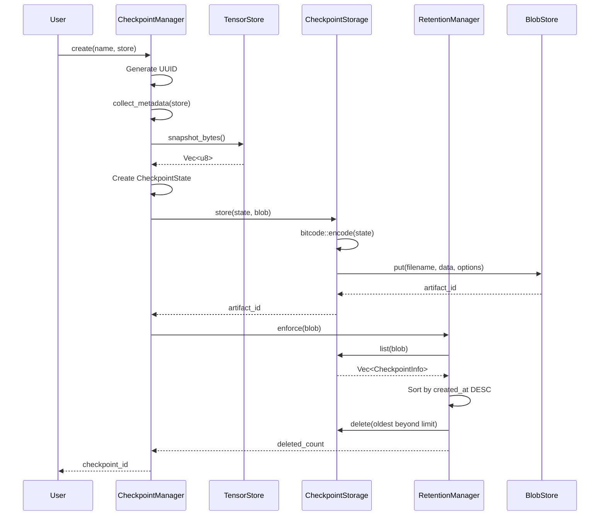
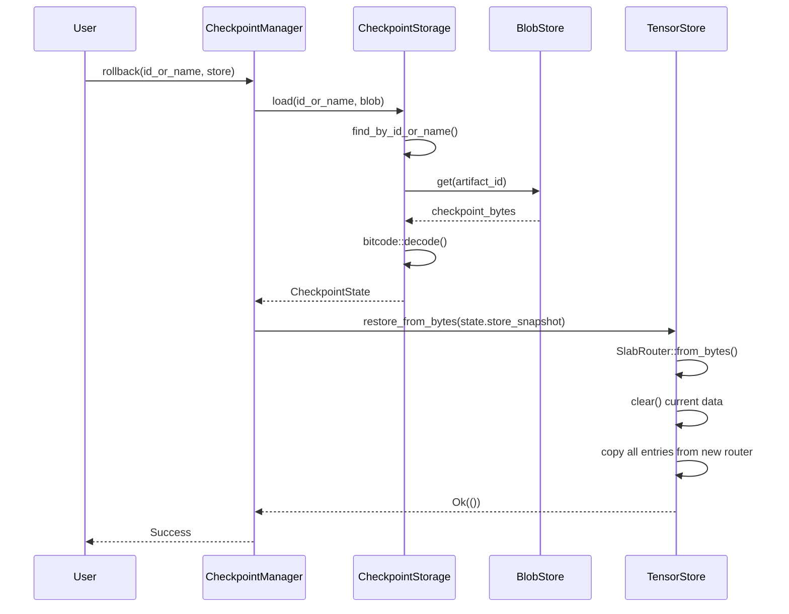

# Checkpoint Design

How tensor_checkpoint provides atomic-intent snapshot/restore with retention
management and interactive confirmation for destructive operations.

> **See also:** [Tensor Checkpoint API](../reference/api/tensor-checkpoint.md) |
> [Checkpoint and Restore How-To](../how-to/checkpoint-restore.md) |
> [Architecture](../reference/api/tensor-checkpoint.md)

## Overview

Tensor Checkpoint enables point-in-time recovery by serializing the entire
TensorStore state into content-addressable blob storage. It integrates with
the query router to provide SQL-like commands (`CHECKPOINT`, `CHECKPOINTS`,
`ROLLBACK TO`) and supports automatic checkpointing before destructive
operations with configurable retention policies.

## Checkpoint Creation Flow

When a checkpoint is created, the system:

1. Generates a UUID v4 identifier
2. Collects metadata by scanning the store (table counts, node counts, embedding counts)
3. Serializes the store's `SlabRouter` into a V3 format snapshot
4. Wraps everything into a `CheckpointState` and serializes it with bincode
5. Stores the result as a blob artifact with the `_system:checkpoint` tag
6. Enforces the retention policy, pruning old checkpoints if needed



## Metadata Collection

The metadata scan provides validation statistics without storing redundant data.
It works by prefix-scanning the store's key space:

- `_schema:` prefix keys enumerate relational tables
- For each table, `{table_name}:` prefix gives the row count
- `node:` and `edge:` prefixes give graph entity counts
- `_embed:` prefix gives embedding counts

This metadata is informational only -- it is not used during restore. The full
snapshot bytes contain all actual data.

## Rollback Design

Rollback completely replaces the store contents:



### Rollback Characteristics

| Aspect | Behavior |
| --- | --- |
| Atomicity | Not atomic -- partial restore possible on failure |
| Isolation | No locking -- concurrent operations may see partial state |
| Duration | O(n) where n = number of entries |
| Memory | Requires 2x memory during restore (old + new) |

The restore process deserializes the snapshot into a new `SlabRouter`, clears
the current store, then copies all entries from the new router. This two-phase
approach means a failure after `clear()` but before copy completion leaves the
store in an incomplete state. For production use, consider creating a checkpoint
before rollback.

## Retention Strategy

Retention is enforced after every checkpoint creation using a simple
count-based policy:

1. List all checkpoints sorted by creation time (newest first)
2. If count exceeds `max_checkpoints`, delete the oldest entries
3. Deletion failures are logged but do not fail the creation

This ensures the checkpoint count never exceeds `max_checkpoints + 1` at any
point (the +1 accounts for the just-created checkpoint before retention runs).

### Edge Cases

| Scenario | Behavior |
| --- | --- |
| Creation fails | Retention not called, count unchanged |
| Retention delete fails | Logged but not fatal, continues deleting |
| max_checkpoints = 0 | All checkpoints deleted after creation |
| max_checkpoints = 1 | Only newest checkpoint retained |

## Auto-Checkpoint and Confirmation Workflow

When `auto_checkpoint` is enabled, destructive operations follow this workflow:

1. The query router identifies a destructive operation (DELETE, DROP TABLE, etc.)
2. A `DestructiveOp` is created with operation-specific metadata
3. If `interactive_confirm` is enabled, a preview is generated and the user is prompted
4. If the user confirms (or confirmation is disabled), an auto-checkpoint is created
5. The destructive operation proceeds

The confirmation system is pluggable via the `ConfirmationHandler` trait,
allowing test code to use `AutoConfirm` or `AutoReject` while production code
uses an interactive terminal prompt.

## Why Content-Addressable Storage?

Checkpoints are stored in tensor_blob rather than as flat files for several
reasons:

- **Deduplication**: If the store has not changed between checkpoints,
  content-addressable storage avoids storing duplicate data
- **Metadata**: Blob artifacts support custom metadata (checkpoint name, ID,
  trigger), making listing and lookup efficient without deserializing the full
  checkpoint
- **Consistency**: The blob store provides its own integrity guarantees for
  stored artifacts
- **Unified management**: Checkpoint lifecycle (creation, listing, deletion)
  reuses the existing blob storage API rather than implementing a separate
  storage layer

## Snapshot Format

The `store_snapshot` field within `CheckpointState` contains a V3 format
snapshot from tensor_store:

```rust
pub struct V3Snapshot {
    pub header: SnapshotHeader,     // Magic bytes, version, entry count
    pub router: SlabRouterSnapshot, // All slab data
}

pub struct SlabRouterSnapshot {
    pub index: EntityIndexSnapshot,
    pub embeddings: EmbeddingSlabSnapshot,
    pub graph: GraphTensorSnapshot,
    pub relations: RelationalSlabSnapshot,
    pub metadata: MetadataSlabSnapshot,
    pub cache: CacheRingSnapshot<TensorData>,
    pub blobs: BlobLogSnapshot,
}
```

This nests the entire store state, including all slab types, within the
checkpoint. The format is versioned (V2/V3) in tensor_store's snapshot system
for backward compatibility.
