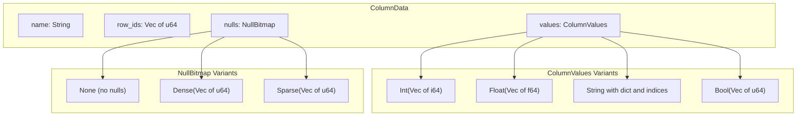
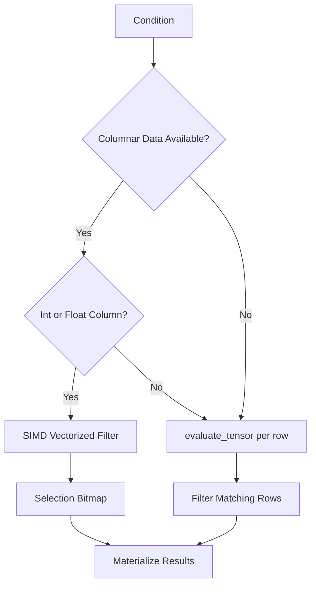

# Columnar Architecture and SIMD Filtering

The relational engine uses columnar storage with SIMD-accelerated filtering to
achieve high-throughput analytical queries. This page explains the design
rationale behind the columnar architecture, how SIMD vectorization works, and
why columnar storage enables these optimizations.

For the API reference and function tables, see the
[Relational Engine API Reference](../reference/api/relational-engine.md). For
step-by-step usage, see [Columnar SIMD Queries](../how-to/columnar-simd.md).

## Why Columnar Storage?

Traditional row-oriented storage places all columns of a row together on disk
and in memory. This layout is optimal for point lookups (fetch a single row by
ID) but inefficient for analytical scans that touch only a few columns across
many rows.

Columnar storage transposes the layout: values for a single column are stored
contiguously in memory. This unlocks three performance advantages:

1. **Cache efficiency** -- scanning a column touches only the bytes needed,
   avoiding cache pollution from unrelated columns.
2. **SIMD vectorization** -- contiguous arrays of fixed-width values (i64, f64)
   can be processed four elements at a time using SIMD instructions.
3. **Compression** -- homogeneous data compresses better (e.g., dictionary
   encoding for strings, packed bitmaps for booleans).

## Columnar Data Structures

Each materialized column is represented by a `ColumnData` struct containing the
column name, a vector of row IDs, a null bitmap, and the column values.



### Null Bitmap Selection

The engine chooses the most memory-efficient null bitmap representation
automatically:

- **None**: When the column has no null values at all. Zero overhead.
- **Sparse**: When nulls are less than 10% of rows. Stores only the positions
  of null values as a sorted vector of indices.
- **Dense**: When nulls are 10% or more of rows. Uses a packed bitmap where
  each bit corresponds to one row (64 rows per `u64` word).

The 10% threshold is a heuristic: sparse representation stores one `u64` per
null row, while dense stores one bit per row. At 10% null density the
break-even point is roughly 640 rows, after which the dense bitmap uses less
memory.

### Dictionary Encoding for Strings

String columns use dictionary encoding to deduplicate repeated values. A
separate dictionary maps each unique string to an integer index, and the column
stores only the integer indices. This reduces memory usage for columns with low
cardinality (e.g., status codes, country names) and enables faster equality
comparisons via integer matching.

## SIMD Filtering Design

Column data stored in contiguous arrays enables 4-wide SIMD vectorized
comparisons using the `wide` crate. The engine processes four values at a time
with `i64x4` or `f64x4` SIMD types.

### How It Works

The SIMD filter functions follow a uniform pattern:

1. **Broadcast the threshold** into a SIMD vector (e.g., `i64x4::splat(42)`).
2. **Load four contiguous values** from the column array.
3. **Compare** using the SIMD comparison instruction (`cmp_lt`, `cmp_gt`,
   etc.), which produces a mask of all-ones or all-zeros per lane.
4. **Pack the result** into a selection bitmap, setting bits for matching rows.
5. **Handle the remainder** (rows not divisible by 4) with a scalar fallback.

```rust
// Conceptual SIMD filter for less-than comparison on i64 columns
pub fn filter_lt_i64(values: &[i64], threshold: i64, result: &mut [u64]) {
    let chunks = values.len() / 4;
    let threshold_vec = i64x4::splat(threshold);

    for i in 0..chunks {
        let offset = i * 4;
        let v = i64x4::new([
            values[offset],
            values[offset + 1],
            values[offset + 2],
            values[offset + 3],
        ]);
        let cmp = v.cmp_lt(threshold_vec);
        let mask_arr: [i64; 4] = cmp.into();

        for (j, &m) in mask_arr.iter().enumerate() {
            if m != 0 {
                let bit_pos = offset + j;
                result[bit_pos / 64] |= 1u64 << (bit_pos % 64);
            }
        }
    }

    // Scalar fallback for remainder
    let start = chunks * 4;
    for i in start..values.len() {
        if values[i] < threshold {
            result[i / 64] |= 1u64 << (i % 64);
        }
    }
}
```

### Selection Vectors

Query results use bitmap-based selection vectors to avoid copying data. Instead
of materializing filtered rows immediately, the engine produces a `SelectionVector`
-- a packed bitmap where each set bit represents a matching row. This allows
combining multiple filter conditions (via bitmap AND/OR) before materializing
results, reducing intermediate allocations.

```rust
pub struct SelectionVector {
    bitmap: Vec<u64>,  // Packed bits indicating selected rows
    row_count: usize,
}
```

Key operations on selection vectors:

- `intersect` (AND): computes the intersection of two selections
- `union` (OR): computes the union of two selections
- `count`: returns the number of set bits (matching rows) using popcount
- `is_selected`: checks whether a specific row index is in the selection

## Condition Evaluation Paths

The engine automatically selects the optimal evaluation strategy:



There are two row-level evaluation methods:

- **`evaluate(&row)`**: Legacy path that creates intermediate `Row` objects.
- **`evaluate_tensor(&tensor)`**: Direct evaluation on `TensorData`, 31% faster
  due to zero intermediate allocation.

The SIMD path is chosen when columnar data has been materialized for the
filtered column and the column type supports vectorized comparison (i64 or
f64). In all other cases, the engine falls back to per-row evaluation using
`evaluate_tensor`.
