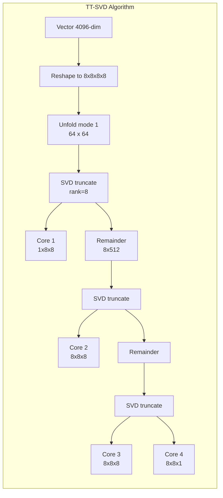
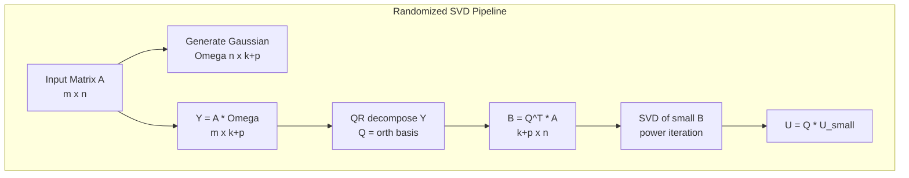
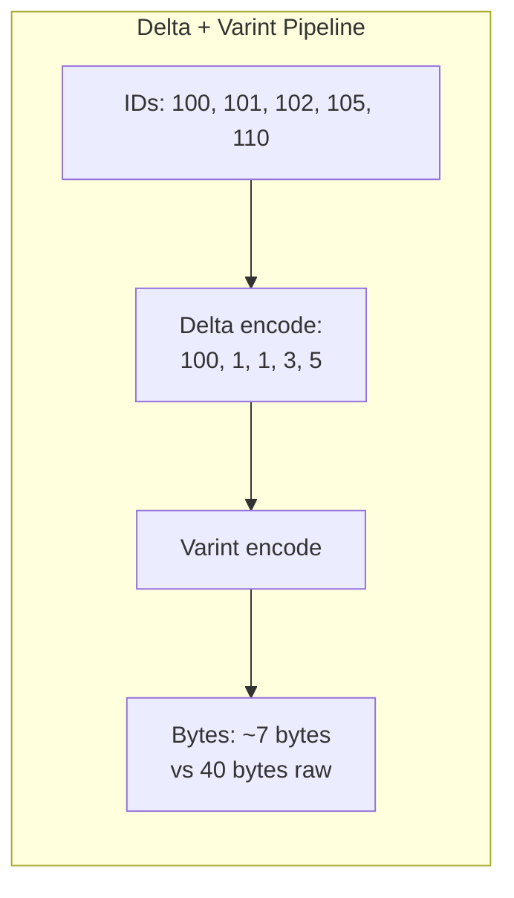
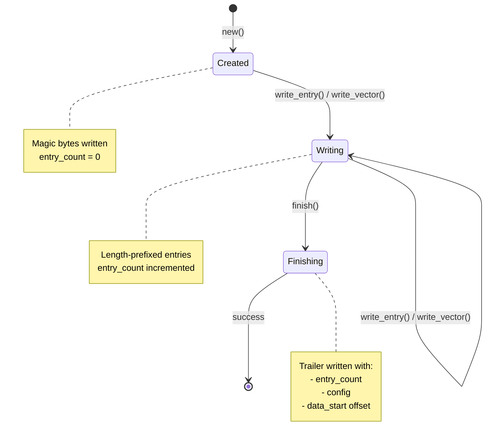
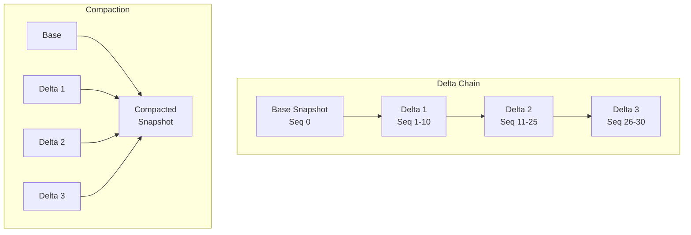

# Compression Algorithms

How tensor_compress exploits mathematical structure in high-dimensional
embeddings to achieve 10-40x compression with ~99% recall.

> **See also:** [Tensor Compress API](../reference/api/tensor-compress.md) |
> [Compression How-To](../how-to/compression.md) |
> [Architecture](../reference/api/tensor-compress.md)

## Design Principles

1. **Tensor Mathematics**: Uses Tensor Train decomposition to exploit low-rank
   structure in embedding vectors
2. **Higher Dimensions Are Lower**: Decomposes vectors into products of smaller
   tensors -- a high-dimensional vector becomes a chain of small 3D cores
3. **Streaming I/O**: Process large snapshots without loading entire dataset
4. **Incremental Updates**: Delta snapshots for efficient replication
5. **Pure Rust**: No external LAPACK/BLAS dependencies -- fully portable

## Tensor Train Decomposition

### Algorithm Overview

The TT-SVD algorithm (Oseledets 2011) decomposes a vector by:

1. **Reshape**: Convert 1D vector to multi-dimensional tensor
2. **Left-to-right sweep**: For each mode k from 1 to n-1:
   - Left-unfold the current tensor into a matrix
   - Compute truncated SVD: A = U * S * Vt
   - Store U as the k-th core
   - Multiply S * Vt to get the remainder for next iteration
3. **Final core**: The last remainder becomes the final core



### Compression Example

For a 4096-dim embedding reshaped to (8, 8, 8, 8):

```text
Original: 4096 floats = 16 KB
TT-cores: 1x8x8 + 8x8x8 + 8x8x8 + 8x8x1 = 64 + 512 + 512 + 64 = 1152 floats
With max_rank=8: 1x8x4 + 4x8x4 + 4x8x4 + 4x8x1 = 32 + 128 + 128 + 32 = 320 floats = 1.25 KB
Compression: 12.8x
```

### Why Tensor Train Works for Embeddings

Embedding vectors from neural networks tend to have low-rank structure when
reshaped as tensors. The information content is concentrated in a few dominant
singular values at each decomposition step, so truncating to a small TT-rank
(e.g., 8) discards very little information. This is fundamentally different from
generic data compression -- it exploits the mathematical properties of the data
rather than statistical redundancy.

## SVD Implementation

The module implements two SVD algorithms, chosen automatically based on matrix
size.

### Power Iteration with Deflation (small matrices)

Used when matrix dimensions are <= 32 or rank is close to matrix size:

```rust
// Simplified power iteration
fn power_iteration(a: &Matrix, max_iter: usize, tol: f32) -> (sigma, u, v) {
    // Initialize v randomly (deterministic seed)
    let mut v: Vec<f32> = (0..cols).map(|i| ((i * 7 + 3) % 13) as f32 / 13.0 - 0.5).collect();
    normalize(&mut v);

    for _ in 0..max_iter {
        // u = A * v, then normalize
        u = matmul(a, v);
        new_sigma = normalize(&mut u);

        // v = A^T * u, then normalize
        v = matmul_transpose(a, u);
        normalize(&mut v);

        // Check convergence
        if (new_sigma - sigma).abs() < tol * sigma.max(1.0) {
            return (new_sigma, u, v);
        }
        sigma = new_sigma;
    }
}
```

After finding each singular triplet, the algorithm deflates: A = A - sigma * u * vT

### Randomized SVD (large matrices)

Uses the Halko-Martinsson-Tropp 2011 algorithm for matrices > 32 dimensions:



Key implementation details:

- **Gaussian matrix generation**: Uses a Linear Congruential Generator (LCG)
  with Box-Muller transform for deterministic, portable random numbers
- **QR orthonormalization**: Modified Gram-Schmidt for numerical stability
- **Oversampling**: Adds 5 extra columns to improve accuracy
- **Convergence**: 20 iterations max (sufficient for embedding vectors)

```rust
// LCG parameters from Numerical Recipes
fn lcg_next(state: &mut u64) -> u64 {
    *state = state.wrapping_mul(6_364_136_223_846_793_005)
                  .wrapping_add(1_442_695_040_888_963_407);
    *state
}

// Box-Muller transform for Gaussian
fn box_muller(u1: f32, u2: f32) -> (f32, f32) {
    let r = (-2.0 * u1.ln()).sqrt();
    let theta = 2.0 * PI * u2;
    (r * theta.cos(), r * theta.sin())
}
```

## TT Gram Matrix Computation

Computing dot products and norms in TT space avoids full reconstruction. The
Gram matrix approach propagates a small matrix through each pair of cores:

```rust
// Gram matrix propagation for dot product
fn tt_dot_product(a: &TTVector, b: &TTVector) -> f32 {
    let mut gram = vec![1.0f32];  // Start with 1x1 identity

    for (core_a, core_b) in a.cores.iter().zip(b.cores.iter()) {
        let (r1a, n, r2a) = core_a.shape;
        let (r1b, _, r2b) = core_b.shape;
        let mut new_gram = vec![0.0; r2a * r2b];

        // Contract: new_gram[a,b] = sum_{k,i,j} gram[i,j] * A[i,k,a] * B[j,k,b]
        for a_idx in 0..r2a {
            for b_idx in 0..r2b {
                for k in 0..n {
                    for ia in 0..r1a {
                        for ib in 0..r1b {
                            let g = gram[ia * r1b + ib];
                            new_gram[a_idx * r2b + b_idx] +=
                                g * core_a.get(ia, k, a_idx) * core_b.get(ib, k, b_idx);
                        }
                    }
                }
            }
        }
        gram = new_gram;
    }

    gram[0]  // Final 1x1 Gram matrix
}
```

This enables cosine similarity, Euclidean distance, and dot product queries
directly in compressed space with O(n * d * r^4) complexity instead of
reconstructing the full vectors first.

## Delta Encoding and Varint

For sorted integer sequences (node IDs, timestamps), delta encoding reduces
values to small differences, then varint encoding compresses those small
integers:



**Delta encoding** stores the first value verbatim, then successive differences.
For nearly-contiguous ID sequences, most deltas are 1, which compress to a
single byte under varint.

**Varint encoding** uses 7 bits per byte with the high bit as a continuation
flag. Values 0-127 take 1 byte; values up to ~16K take 2 bytes. This eliminates
the wasted bytes in fixed-width u64 encoding for small values.

```rust
// Delta encoding: store first value, then differences
pub fn delta_encode(ids: &[u64]) -> Vec<u64> {
    let mut result = vec![ids[0]];
    for window in ids.windows(2) {
        result.push(window[1].saturating_sub(window[0]));
    }
    result
}

// Varint encoding: 7 bits per byte, high bit = continuation
pub fn varint_encode(values: &[u64]) -> Vec<u8> {
    let mut result = Vec::with_capacity(values.len() * 2);
    for &value in values {
        let mut v = value;
        loop {
            let byte = (v & 0x7f) as u8;
            v >>= 7;
            if v == 0 {
                result.push(byte);  // Final byte (no continuation)
                break;
            }
            result.push(byte | 0x80);  // Continuation bit set
        }
    }
    result
}
```

## Run-Length Encoding

RLE compresses data with long runs of identical values. It stores each unique
value once alongside its repeat count, which is highly effective for columns
with low cardinality (status fields, boolean flags, category labels).

RLE adds overhead (~0.8x) for data with no repetition, so it is only applied
when the compression config enables it and the data pattern benefits from it.

## Streaming Architecture

Streaming operations use a trailer-based file format so the entry count does not
need to be known upfront:



This design means the writer can stream entries of unknown total count, and the
reader reads the trailer first (via seek) to learn how many entries exist before
iterating. If the writer crashes before calling `finish()`, the file is corrupt
because the trailer is missing.

## Delta Snapshot Architecture

Delta snapshots enable incremental replication by storing only changes since a
base snapshot:



A `DeltaChain` tracks a base snapshot plus an ordered sequence of deltas.
Lookups check the chain from newest to oldest, falling back to the base.
When the chain grows beyond a threshold (default 100), compaction merges all
deltas into a new base snapshot.

## Design Rationale

### Why Tensor Train over Product Quantization?

Product Quantization (PQ) achieves higher compression (16-64x) but requires a
training phase on representative data and loses more information (56-90%
recall). Tensor Train decomposition is training-free, achieves ~99% recall, and
supports exact mathematical operations (dot product, cosine similarity) directly
in compressed space without reconstruction.

### Why Pure Rust SVD?

External LAPACK/BLAS libraries add build complexity, platform-specific linking,
and non-trivial deployment requirements. Since TT decomposition only needs
truncated SVD on relatively small matrices (the unfolded cores), a pure Rust
implementation with power iteration and randomized SVD is sufficient and keeps
the crate fully portable.

### Why Deterministic Random Numbers?

The randomized SVD uses a Linear Congruential Generator rather than OS entropy.
This ensures identical decompositions for identical inputs across platforms,
which is critical for reproducible snapshot formats and test determinism.
