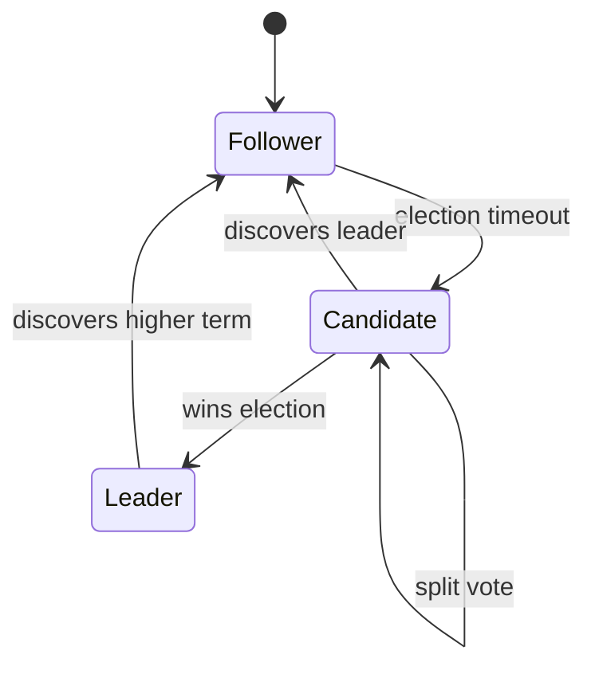
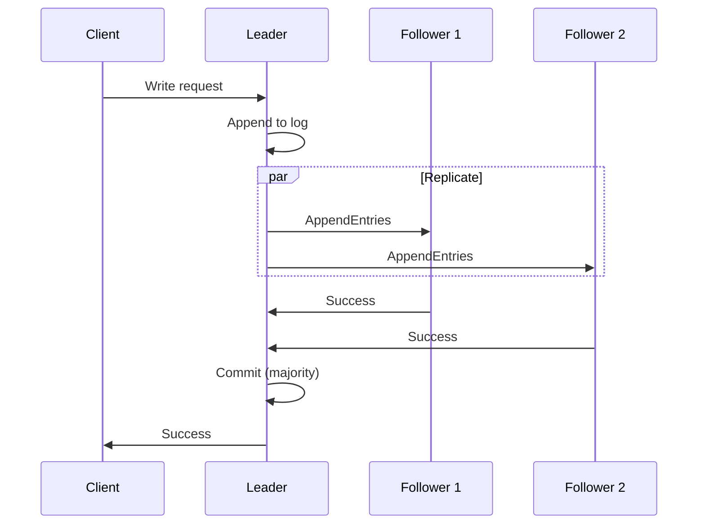
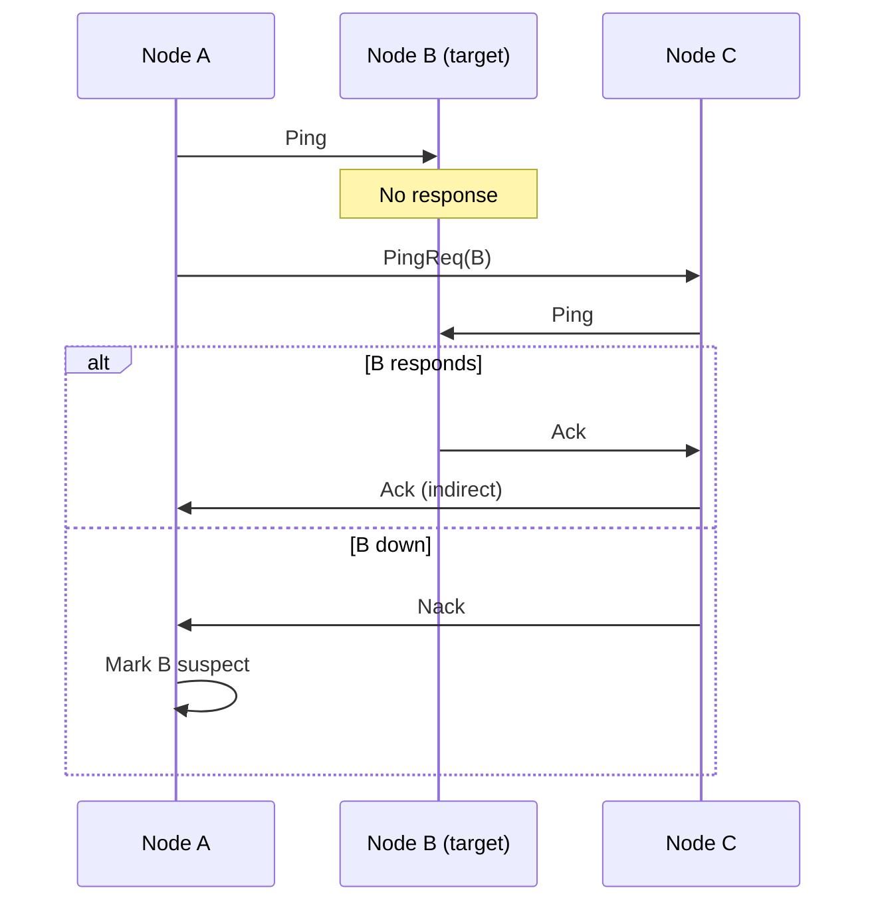
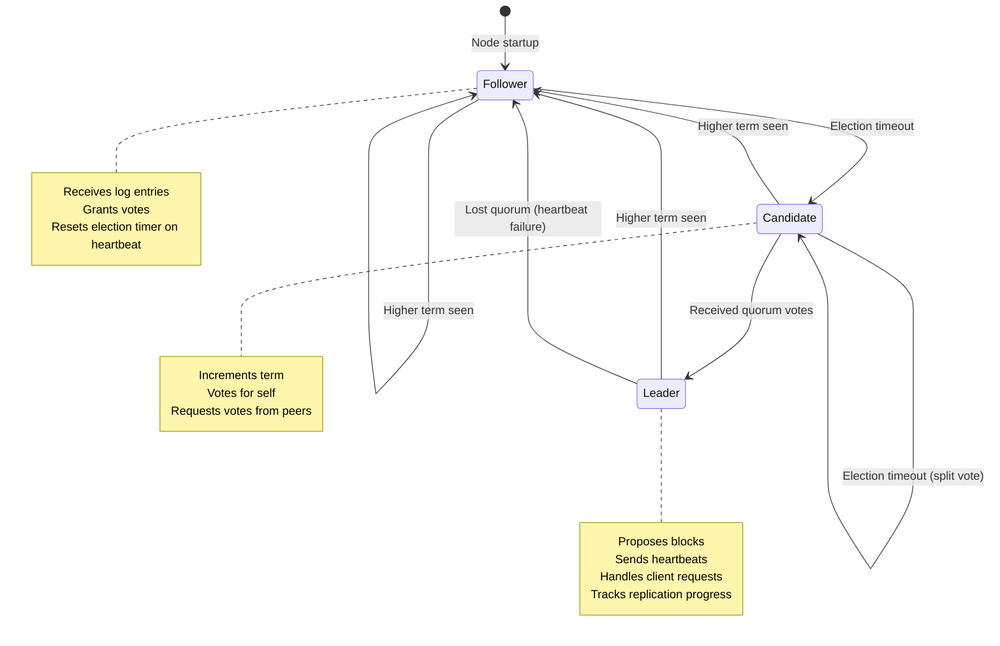
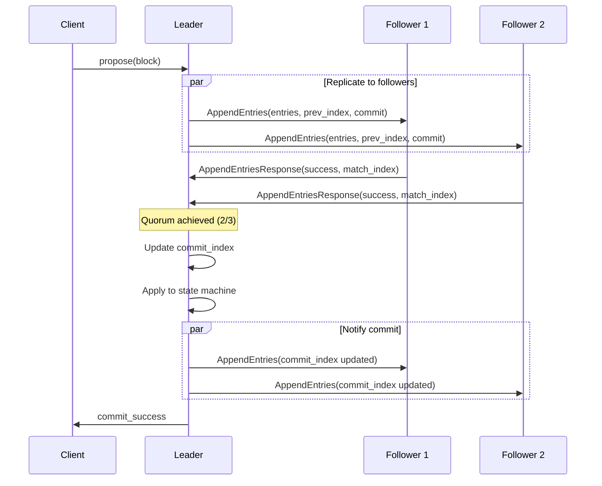
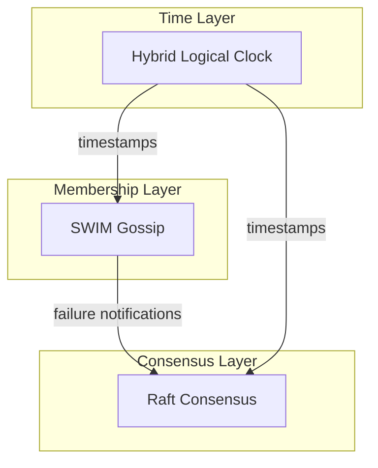

# Consensus Protocols

tensor_chain uses Raft consensus with SWIM gossip for membership management.

## Raft Consensus

### Overview

Raft provides:

- Leader election
- Log replication
- Safety (never returns incorrect results)
- Availability (operational if majority alive)

### Node States



### Terms

Time divided into terms with at most one leader:

```text
Term 1: [Leader A] -----> [Follower timeout]
Term 2: [Election] -> [Leader B] -----> ...
```

### Log Replication



### Configuration

| Parameter | Default | Description |
| --- | --- | --- |
| `election_timeout_min` | 150ms | Min election timeout |
| `election_timeout_max` | 300ms | Max election timeout |
| `heartbeat_interval` | 50ms | Leader heartbeat frequency |
| `max_entries_per_append` | 100 | Batch size for replication |

## SWIM Gossip

### Overview

Scalable Weakly-consistent Infection-style Membership:

- O(log N) failure detection
- Distributed membership view
- No single point of failure

### Protocol



### Node States

| State | Description | Transition |
| --- | --- | --- |
| Healthy | Responding normally | --- |
| Suspect | Failed direct ping | After timeout |
| Failed | Confirmed down | After indirect ping failure |

### LWW-CRDT Membership

Last-Writer-Wins with incarnation numbers:

```rust
// State comparison
fn supersedes(&self, other: &Self) -> bool {
    (self.incarnation, self.timestamp) > (other.incarnation, other.timestamp)
}

// Merge takes winner per node
fn merge(&mut self, other: &Self) {
    for (node_id, state) in &other.states {
        if state.supersedes(&self.states[node_id]) {
            self.states.insert(node_id.clone(), state.clone());
        }
    }
}
```

### Configuration

| Parameter | Default | Description |
| --- | --- | --- |
| `ping_interval` | 1s | Direct ping frequency |
| `ping_timeout` | 500ms | Time to wait for response |
| `suspect_timeout` | 3s | Time before marking failed |
| `indirect_ping_count` | 3 | Number of indirect pings |

## Hybrid Logical Clocks

Combine physical time with logical counters:

```rust
pub struct HybridTimestamp {
    wall_ms: u64,    // Physical time (milliseconds)
    logical: u16,    // Logical counter
}
```

### Properties

- Monotonic: Always increases
- Bounded drift: Stays close to wall clock
- Causality: If A happens-before B, then ts(A) < ts(B)

### Usage

```rust
let hlc = HybridLogicalClock::new(node_id);

// Local event
let ts = hlc.now();

// Receive message with timestamp
let ts = hlc.receive(message_ts);
```

## Formal Verification

Both protocols are formally specified in TLA+ and exhaustively
model-checked with TLC:

- **Raft.tla** verifies `ElectionSafety`, `LogMatching`,
  `StateMachineSafety`, `LeaderCompleteness`, `VoteIntegrity`,
  and `TermMonotonicity` across 18.3M distinct states.
- **Membership.tla** verifies `NoFalsePositivesSafety`,
  `MonotonicEpochs`, and `MonotonicIncarnations` across 54K
  distinct states.

Model checking found and led to fixes for protocol bugs including
out-of-order message handling in Raft log replication and an invalid
fairness formula in the gossip spec. See
[Formal Verification](formal-verification.md) for full results.

## Tensor-Raft Extensions

Tensor-Raft extends the standard Raft consensus protocol with three
tensor-native optimizations.

### Similarity Fast-Path

Followers can skip full block validation when the block embedding is
sufficiently similar to recent blocks from the same leader. This works
because semantically similar blocks from a trusted leader are overwhelmingly
likely to be valid.

```rust
pub struct FastPathValidator {
    similarity_threshold: f32,  // Default: 0.95
    min_history: usize,         // Default: 3 blocks
}

// Validation logic:
// 1. Check if we have enough history from this leader
// 2. Compute cosine similarity with recent embeddings
// 3. If similarity > threshold for all recent blocks:
//    - Skip full validation
//    - Record acceptance in stats
// 4. Otherwise: perform full validation
```

Each follower maintains a `FastPathState` per leader, storing recent block
embeddings. After `snapshot_threshold` entries (default 10,000), a snapshot
captures the state machine at the commit point. Entries before the snapshot
can be truncated, keeping only `snapshot_trailing_logs` entries for followers
catching up.

### Geometric Tie-Breaking

During elections where candidates have equally up-to-date logs, the candidate
whose state embedding is closest to the cluster centroid is preferred. This
produces more stable leaders because centrally-positioned nodes are better
connected to the rest of the cluster in embedding space.

The threshold is configurable via `geometric_tiebreak_threshold` (default 0.3).
A candidate's similarity to the centroid must exceed this minimum to trigger
the tie-break logic.

### Pre-Vote Protocol

Pre-vote prevents disruptive elections from partitioned or stale nodes.
Before incrementing its term and starting a real election, a candidate first
sends `PreVote` messages. A pre-vote is granted only if:

1. The candidate's term is >= the voter's current term
2. The voter's election timeout has elapsed (no recent leader heartbeat)
3. The candidate's log is at least as up-to-date as the voter's

```text
Node A (partitioned, stale)              Healthy Cluster
    |                                         |
    |-- PreVote(term=5) --------------------->|
    |                                         |
    |<-- PreVoteResponse(granted=false) ------|
    |                                         |
    | Does NOT increment term                 |
    | (prevents term inflation)               |
```

This prevents a partitioned node from incrementing its term repeatedly
and then disrupting the cluster with a high term when the partition heals.

## Detailed Raft State Machine

The full state machine includes transitions that the simplified overview
omits, particularly around quorum loss and heartbeat-driven resets:



### Leader Election Detail

The leader election flow with log replication follows this sequence:



### Automatic Heartbeat

When a node becomes leader, it spawns a background heartbeat task that sends
`AppendEntries` (with no new entries) to all followers at the configured
`heartbeat_interval`. The `QuorumTracker` monitors heartbeat responses:

- If fewer than a quorum of nodes respond within the election timeout window,
  the leader logs a warning after `max_heartbeat_failures` consecutive failures
- The leader steps down to Follower if it detects sustained quorum loss

### Log Compaction and Snapshots

After `snapshot_threshold` entries accumulate in the log, the leader creates a
snapshot of the current state machine. The snapshot metadata includes:

- The last included log index and term
- A SHA-256 hash of the snapshot data for integrity verification
- The current membership configuration

Followers that fall too far behind receive the snapshot via `InstallSnapshot`
RPCs (chunked at `snapshot_chunk_size`, default 1MB). A compaction cooldown
(`compaction_cooldown_ms`, default 60s) prevents excessive snapshot creation.

## Raft Edge Cases

1. **Split Vote**: When multiple candidates split the vote evenly, election
   timeout triggers a new election. Randomized timeouts (150-300ms) reduce
   collision probability.

2. **Network Partition**: During partition, the minority side cannot commit
   (lacks quorum). Pre-vote prevents term inflation when the partition heals.

3. **Stale Leader**: A partitioned leader may not know it lost leadership.
   The quorum tracker detects heartbeat failures and steps down.

4. **Log Divergence**: Followers with divergent logs are overwritten by the
   leader's log (consistency > availability).

5. **Snapshot During Election**: Snapshot transfer continues even if leadership
   changes. The new leader may need to resend the snapshot.

## Raft Recovery from WAL

```rust
// 1. Open WAL and replay entries
let wal = RaftWal::open(wal_path)?;
let recovery = RaftRecoveryState::from_wal(&wal)?;

// 2. Restore term and voted_for
node.current_term = recovery.current_term;
node.voted_for = recovery.voted_for;

// 3. Validate snapshot if present
if let Some((meta, data)) = load_snapshot() {
    let computed_hash = sha256(&data);
    if computed_hash == meta.snapshot_hash {
        // Valid snapshot - restore state machine
        apply_snapshot(meta, data);
    } else {
        // Corrupted snapshot - ignore
        warn!("Snapshot hash mismatch, starting fresh");
    }
}

// 4. Start as follower
node.state = RaftState::Follower;
```

## Integration

Raft and SWIM work together:

1. **SWIM** detects node failures quickly
2. **Raft** handles leader election and log consistency
3. **HLC** provides ordering across the cluster


