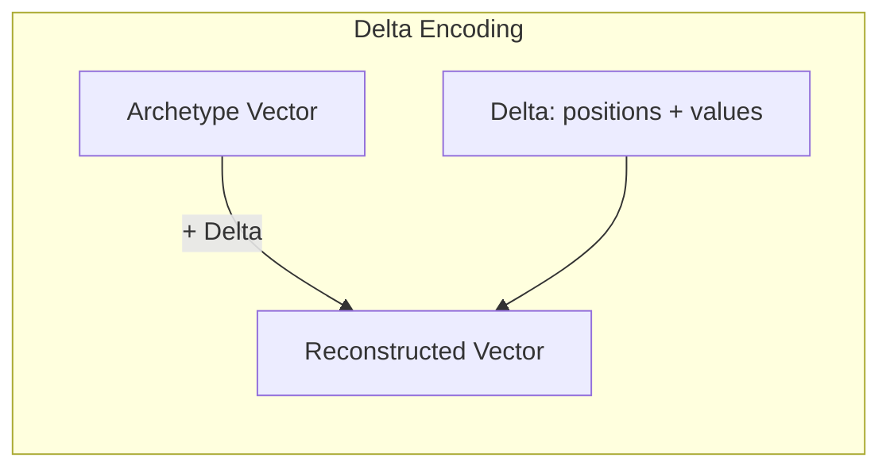

# Delta Vectors and Archetype Registry

Delta encoding stores embedding vectors as differences from reference
"archetype" vectors, providing significant compression for clustered embeddings.
When many embeddings share a common pattern (e.g., product descriptions in the
same category), storing only the deviation from that pattern is far more compact
than storing the full vector.

**See also**: [How-to: Delta Embeddings](../how-to/delta-embeddings.md) |
[HNSW Algorithm](hnsw-algorithm.md) |
[API Reference](../reference/api/tensor-store.md)

---

## Concept



The idea is straightforward:

1. **Identify archetype vectors** -- cluster centroids discovered via k-means
   over the embedding collection.
2. **Encode each embedding** as `archetype_id + sparse_delta`, where the delta
   captures only the dimensions that differ from the archetype beyond a
   threshold.
3. **Reconstruct on demand**: `archetype + delta = original` (within the
   threshold tolerance).

If embeddings cluster tightly around a few archetypes, most deltas are sparse
(few non-zero entries), yielding compression ratios of 3-10x compared to dense
storage.

---

## DeltaVector Structure

```rust
pub struct DeltaVector {
    archetype_id: usize,       // Reference archetype
    dimension: usize,          // For reconstruction
    positions: Vec<u16>,       // Diff positions (u16 for memory)
    deltas: Vec<f32>,          // Delta values
    cached_magnitude: Option<f32>,  // For fast cosine similarity
}
```

The `positions` field uses `u16` instead of `u32` to save memory. This limits
delta encoding to vectors with at most 65,536 dimensions, which covers all
common embedding models (384, 768, 1536, 4096).

The `cached_magnitude` avoids recomputing the vector magnitude on every cosine
similarity call. It is invalidated when the delta is modified.

---

## Optimized Dot Products

Delta encoding enables algebraic shortcuts for distance computation.

### With a Dense Query

When computing `dot(archetype + delta, query)`:

```
dot(archetype + delta, query) = dot(archetype, query) + dot(delta, query)
```

If `dot(archetype, query)` is precomputed once per search (the archetype is
shared by many vectors), each individual distance computation costs only
O(nnz_delta) instead of O(dimension):

```rust
let result = delta.dot_dense_with_precomputed(query, archetype_dot_query);
```

For a 768-dim embedding with a 50-entry delta, this is a 15x reduction in
floating-point operations per distance calculation.

### Between Two Deltas (Same Archetype)

When two vectors share the same archetype:

```
dot(A + delta_a, A + delta_b)
    = dot(A, A) + dot(A, delta_b) + dot(delta_a, A) + dot(delta_a, delta_b)
```

With `dot(A, A)` (the archetype's squared magnitude) precomputed:

```rust
let result = a.dot_same_archetype(&b, archetype, archetype_magnitude_sq);
```

This is particularly fast when both deltas are sparse, as `dot(delta_a,
delta_b)` is O(min(nnz_a, nnz_b)).

---

## Archetype Registry Design

The `ArchetypeRegistry` manages the set of reference vectors and provides
encoding/decoding operations.

### K-Means Discovery

Archetypes are discovered by running k-means clustering over a representative
sample of embeddings:

```rust
let config = KMeansConfig {
    max_iterations: 100,
    convergence_threshold: 1e-4,
    seed: 42,
    init_method: KMeansInit::KMeansPlusPlus,
};
registry.discover_archetypes(&embeddings, 5, config);
```

`KMeansPlusPlus` initialization spreads initial centroids to avoid degenerate
clusters. The `seed` parameter makes discovery deterministic for reproducible
results.

### Encoding

Each vector is assigned to its nearest archetype. The delta is the sparse
difference vector, with values below the threshold zeroed out:

```rust
let delta = registry.encode(&vector, threshold)?;
```

The `threshold` parameter controls the precision-compression trade-off:
- Lower threshold (e.g., 0.001): more non-zero delta entries, better precision
- Higher threshold (e.g., 0.05): fewer entries, more compression, some precision
  loss

### Coverage Analysis

The registry can report how well the current archetypes cover the embedding
collection:

```rust
let stats = registry.analyze_coverage(&vectors, 0.01);
// stats.avg_similarity     -- mean cosine similarity to nearest archetype
// stats.avg_compression_ratio -- mean compression ratio
// stats.archetype_usage    -- per-archetype assignment counts
```

Poor coverage (low average similarity) suggests adding more archetypes or
re-running discovery with a larger sample.

### Persistence

The registry serializes to and from TensorStore:

```rust
registry.save_to_store(&store)?;
let registry = ArchetypeRegistry::load_from_store(&store, 16)?;
```

This allows archetype vectors to survive snapshot/restore cycles.

---

## Design Rationale

**Why k-means for archetype discovery?** K-means is simple, well-understood,
and produces compact centroids. More sophisticated clustering (DBSCAN, spectral)
would add complexity without proportional benefit, since the archetypes only need
to be "close enough" to yield sparse deltas.

**Why u16 for positions?** Embedding dimensions above 65,536 are rare in
practice. Using u16 instead of u32 saves 2 bytes per delta entry, which
compounds across millions of vectors. The 65,536-dimension limit is enforced at
encoding time.

**Why cache the magnitude?** Cosine similarity requires the magnitude of both
vectors. For delta vectors, computing the magnitude requires reconstructing the
full vector (archetype + delta). Caching avoids this reconstruction on repeated
similarity calls against the same vector.
