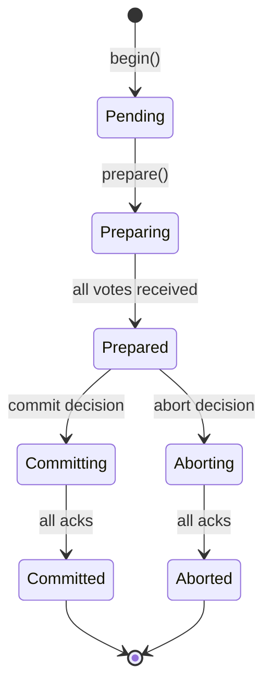
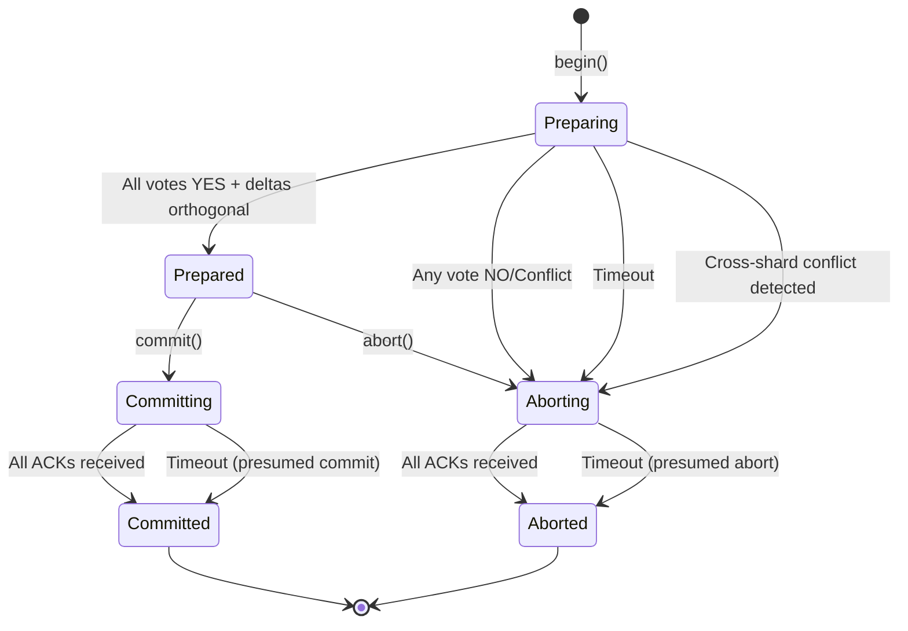
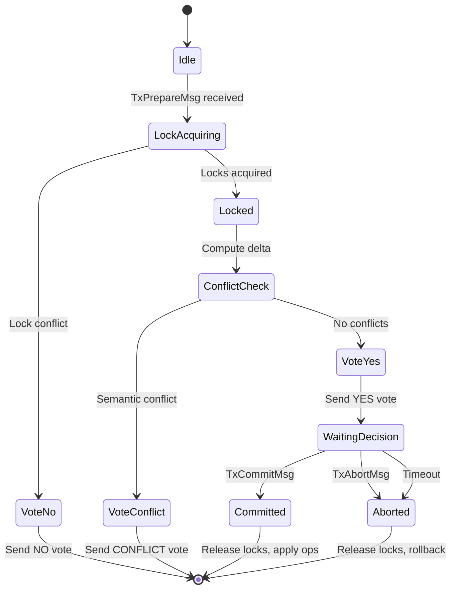

# Distributed Transactions

tensor_chain implements distributed transactions using Two-Phase Commit (2PC)
with semantic conflict detection.

## Transaction Lifecycle



## Two-Phase Commit

### Phase 1: Prepare

1. Coordinator sends `Prepare` to all participants
2. Each participant:
   - Acquires locks
   - Validates constraints
   - Writes to WAL
   - Votes `Yes` or `No`

### Phase 2: Commit/Abort

1. If all vote `Yes`: Coordinator sends `Commit`
2. If any vote `No`: Coordinator sends `Abort`
3. Participants apply or rollback

## Message Types

| Message | Direction | Purpose |
| --- | --- | --- |
| `TxPrepareMsg` | Coordinator -> Participant | Start prepare phase |
| `TxVote` | Participant -> Coordinator | Vote yes/no |
| `TxCommitMsg` | Coordinator -> Participant | Commit decision |
| `TxAbortMsg` | Coordinator -> Participant | Abort decision |
| `TxAck` | Participant -> Coordinator | Acknowledge commit/abort |

## Lock Management

### Lock Types

| Lock | Compatibility | Use |
| --- | --- | --- |
| Shared (S) | S-S compatible | Read operations |
| Exclusive (X) | Incompatible with all | Write operations |

### Lock Acquisition

```rust
// Acquire lock with timeout
let lock = lock_manager.acquire(
    tx_id,
    key,
    LockMode::Exclusive,
    Duration::from_secs(5),
)?;
```

## Deadlock Detection

Wait-for graph analysis:

```rust
// Check for cycles before waiting
if wait_graph.would_create_cycle(my_tx, blocking_tx) {
    // Abort to prevent deadlock
    return Err(DeadlockDetected);
}

// Register wait
wait_graph.add_wait(my_tx, blocking_tx);
```

### Victim Selection

| Policy | Behavior |
| --- | --- |
| Youngest | Abort most recent transaction |
| Oldest | Abort longest-running |
| LowestPriority | Abort lowest priority |
| MostLocks | Abort holding most locks |

## Semantic Conflict Detection

Beyond lock-based conflicts, tensor_chain detects semantic conflicts:

```rust
// Compute embedding deltas
let delta_a = tx_a.compute_delta();
let delta_b = tx_b.compute_delta();

// Check for semantic overlap
if delta_a.cosine_similarity(&delta_b) > CONFLICT_THRESHOLD {
    // Semantic conflict - need manual resolution
    return PrepareVote::Conflict { ... };
}
```

## Recovery

### Coordinator Failure

1. New coordinator queries participants for tx state
2. If any committed: complete commit
3. If all prepared: re-run commit decision
4. Otherwise: abort

### Participant Failure

1. Participant replays WAL on restart
2. For prepared transactions: query coordinator
3. Apply commit or abort based on coordinator state

## Configuration

```rust
pub struct DistributedTxConfig {
    /// Prepare phase timeout
    pub prepare_timeout_ms: u64,
    /// Commit phase timeout
    pub commit_timeout_ms: u64,
    /// Maximum concurrent transactions
    pub max_concurrent_tx: usize,
    /// Lock wait timeout
    pub lock_timeout_ms: u64,
}
```

## Formal Verification

The 2PC protocol is formally specified in `TwoPhaseCommit.tla` and
exhaustively model-checked with TLC across 2.3M distinct states.
The model verifies `Atomicity` (all-or-nothing), `NoOrphanedLocks`,
`ConsistentDecision`, `VoteIrrevocability`, and `DecisionStability`.
See [Formal Verification](formal-verification.md) for full results.

## Detailed State Machines

### Coordinator State Machine

The coordinator tracks each distributed transaction through a precise
sequence of phases:



### Participant State Machine

Each participant shard follows its own state machine, driven by
coordinator messages:



## Internal Lock Ordering

The coordinator follows strict lock ordering to prevent internal deadlocks
among its own data structures. Violating this order causes self-deadlock
within the coordinator process:

```text
Lock acquisition order:
1. pending           - Transaction state map
2. lock_manager.locks     - Key-level locks
3. lock_manager.tx_locks  - Per-transaction lock sets
4. pending_aborts    - Abort queue

CRITICAL: Never acquire pending_aborts while holding pending
```

## Wait-For Graph Internals

The `WaitForGraph` maintains both forward and reverse edges for efficient
cycle detection and cleanup:

```rust
pub struct WaitForGraph {
    /// Maps tx_id -> set of tx_ids it is waiting for
    edges: HashMap<u64, HashSet<u64>>,

    /// Reverse edges for O(1) removal: holder -> waiters
    reverse_edges: HashMap<u64, HashSet<u64>>,

    /// Timestamp when wait started (for victim selection)
    wait_started: HashMap<u64, EpochMillis>,

    /// Priority values (lower = higher priority)
    priorities: HashMap<u64, u32>,
}
```

An edge `A -> B` means transaction A is blocked waiting for transaction B
to release locks. Reverse edges allow O(1) cleanup when a transaction
completes: all waiters of that transaction can be found immediately.

### Tarjan's DFS Cycle Detection

The deadlock detector uses a DFS-based algorithm with an explicit
recursion stack to detect back-edges (cycles):

```rust
fn dfs_detect(
    &self,
    node: u64,
    edges: &HashMap<u64, HashSet<u64>>,
    visited: &mut HashSet<u64>,
    rec_stack: &mut HashSet<u64>,  // Current recursion path
    path: &mut Vec<u64>,           // Explicit path for extraction
    cycles: &mut Vec<Vec<u64>>,
) {
    visited.insert(node);
    rec_stack.insert(node);
    path.push(node);

    if let Some(neighbors) = edges.get(&node) {
        for &neighbor in neighbors {
            if !visited.contains(&neighbor) {
                self.dfs_detect(neighbor, edges, visited, rec_stack, path, cycles);
            } else if rec_stack.contains(&neighbor) {
                // Back-edge to ancestor = cycle found!
                if let Some(cycle_start) = path.iter().position(|&n| n == neighbor) {
                    cycles.push(path[cycle_start..].to_vec());
                }
            }
        }
    }

    path.pop();
    rec_stack.remove(&node);
}
```

### Victim Selection Policy Details

| Policy | Selection Criteria | Trade-off |
| --- | --- | --- |
| `Youngest` | Most recent wait start (highest timestamp) | Minimizes wasted work, may starve long transactions |
| `Oldest` | Earliest wait start (lowest timestamp) | Prevents starvation, wastes more completed work |
| `LowestPriority` | Highest priority value | Business-rule based, requires priority assignment |
| `MostLocks` | Transaction holding most locks | Maximizes freed resources, may abort complex transactions |

## WAL Recovery Protocol

The coordinator uses write-ahead logging for crash recovery. On restart,
the WAL is replayed to reconstruct in-flight transactions:

```rust
// Recovery state machine:
match tx.phase {
    TxPhase::Preparing => {
        // Incomplete prepare - abort (presumed abort)
        tx.phase = TxPhase::Aborting;
    }
    TxPhase::Prepared => {
        // All YES votes recorded - check if can commit
        if all_yes_votes && deltas_orthogonal {
            tx.phase = TxPhase::Committing;
        } else {
            tx.phase = TxPhase::Aborting;
        }
    }
    TxPhase::Committing => {
        // Continue commit - presumed commit
        complete_commit(tx);
    }
    TxPhase::Aborting => {
        // Continue abort
        complete_abort(tx);
    }
}
```

The WAL records four entry types: `TxBegin` when a transaction starts,
`PrepareVote` when a vote is received, `PhaseChange` on state transitions,
and `TxComplete` when a transaction finishes. On recovery:

- **Preparing** transactions with incomplete votes are aborted (presumed abort)
- **Prepared** transactions with all YES votes resume the commit path
- **Committing** transactions are completed (presumed commit)
- **Aborting** transactions continue their abort

## Semantic Conflict Detection Details

Beyond lock-based conflicts, tensor_chain uses delta embeddings to detect
semantic conflicts between concurrent transactions. The
`ConsensusManager` applies a hybrid approach combining angular similarity
(cosine) and structural overlap (Jaccard index):

### Conflict Classification

```rust
pub fn detect_conflict(&self, d1: &DeltaVector, d2: &DeltaVector) -> ConflictResult {
    let cosine = d1.cosine_similarity(d2);
    let jaccard = d1.structural_similarity(d2);  // Jaccard index
    let overlapping_keys = d1.overlapping_keys(d2);
    let all_keys_overlap = overlapping_keys.len() == d1.affected_keys.len()
        && overlapping_keys.len() == d2.affected_keys.len();

    // Classification hierarchy (evaluated in order):
    // cosine >= 0.99 && all keys overlap -> Identical (deduplicate)
    // cosine <= -0.95 && all keys overlap -> Opposite (cancel)
    // |cosine| < 0.1 && jaccard < 0.5 -> Orthogonal (vector add)
    // cosine >= 0.7 -> Conflicting (reject)
    // jaccard >= 0.5 -> Conflicting (reject, structural)
    // overlapping keys exist -> Ambiguous (reject)
    // otherwise -> LowConflict (weighted average)
}
```

### Classification Summary

| Cosine | Jaccard | Classification | Merge Action |
| --- | --- | --- | --- |
| < 0.1 | < 0.5 | Orthogonal | Auto-merge (vector add) |
| 0.1-0.7 | < 0.5 | LowConflict | Weighted merge |
| >= 0.7 | any | Conflicting | Reject |
| any | >= 0.5 | Conflicting | Reject (structural) |
| >= 0.99 | all keys | Identical | Deduplicate |
| <= -0.95 | all keys | Opposite | Cancel (no-op) |

Orthogonal transactions operate on independent data dimensions and can
commit in parallel without coordination, reducing contention.

### Merge Operations

```rust
impl DeltaVector {
    /// Vector addition for orthogonal deltas
    pub fn add(&self, other: &DeltaVector) -> DeltaVector;

    /// Weighted average for low-conflict deltas
    pub fn weighted_average(&self, other: &DeltaVector, w1: f32, w2: f32) -> DeltaVector;

    /// Project out conflicting component
    pub fn project_non_conflicting(&self, conflict_direction: &SparseVector) -> DeltaVector;
}
```

## 2PC Edge Cases

1. **Coordinator Failure After Prepare**: Participants holding locks may
   timeout. WAL recovery allows a new coordinator to resume.

2. **Participant Failure**: Coordinator times out waiting for vote. Transaction
   aborts; participant recovers from WAL on restart.

3. **Network Partition Between Phases**: Commit messages may not reach all
   participants. A retry loop ensures eventual delivery.

4. **Lock Timeout vs Transaction Timeout**: Lock timeout (30s) should exceed
   transaction timeout (5s) to prevent premature lock release.

5. **Orphaned Locks**: Locks from crashed transactions are cleaned up by
   periodic `cleanup_expired()` or WAL recovery.

## Best Practices

1. **Keep transactions short**: Long transactions increase conflict probability
2. **Order lock acquisition**: Acquire locks in consistent order to prevent
   deadlocks
3. **Use appropriate isolation**: Not all operations need serializable isolation
4. **Monitor deadlock rate**: High rates indicate contention issues
