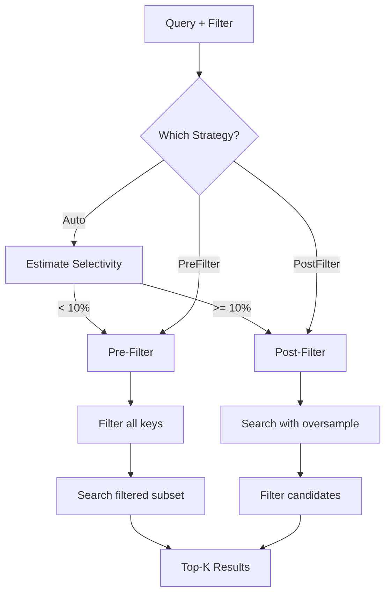

# Filtered Search Design

How the Vector Engine combines metadata filtering with similarity search, and
the tradeoffs between pre-filter and post-filter strategies.

> **See Also:**
> [Vector Engine API Reference](../reference/api/vector-engine.md) |
> [Vector Search Modes](vector-search-modes.md) |
> [Filtered Search How-To](../how-to/filtered-search.md)

## Overview

Filtered search lets you restrict similarity search to embeddings that match
a set of metadata conditions. For example, "find the 10 most similar documents
to this query, but only among documents published after 2020 in the science
category."

The challenge is efficiency: naively you could search all embeddings then filter,
but that wastes work on irrelevant results. Alternatively you could filter first
then search only the subset, but that misses the benefit of indexed search. The
Vector Engine provides both strategies plus automatic selection.

## How Metadata Filtering Works

Every embedding can carry arbitrary metadata stored as key-value pairs alongside
the vector data. Filters are expressed as a tree of `FilterCondition` nodes that
evaluate against this metadata:

```rust
let filter = FilterCondition::Eq("category".to_string(), FilterValue::String("science".to_string()))
    .and(FilterCondition::Gt("year".to_string(), FilterValue::Int(2020)));
```

The filter tree supports logical composition (`And`, `Or`), comparisons (`Eq`,
`Ne`, `Lt`, `Le`, `Gt`, `Ge`), set membership (`In`), string operations
(`Contains`, `StartsWith`), and existence checks (`Exists`).

Evaluation is straightforward: for each candidate embedding, the engine loads
its metadata and walks the filter tree. There is no secondary index on metadata
fields -- filtering is a scan operation.

## Pre-Filter vs Post-Filter

The engine offers two strategies, selected by the `FilterStrategy` enum.

### Pre-Filter Strategy

Pre-filter evaluates the metadata condition against all embeddings first,
producing a set of keys that pass the filter. It then performs similarity search
only within that subset.

**Best for:** Highly selective filters (< 10% of embeddings match). When the
filter eliminates most candidates, searching a small subset is much faster than
searching everything and discarding results.

**Tradeoff:** The initial filter scan touches all embeddings to check metadata,
so for very large datasets with low selectivity, this scan itself can be
expensive.

### Post-Filter Strategy

Post-filter runs the similarity search first with an oversampled k (retrieving
more candidates than requested), then filters the results by metadata. The
oversample factor compensates for candidates that will be removed by filtering.

**Best for:** Broad filters (> 10% of embeddings match). When most candidates
pass the filter anyway, searching with oversample and filtering afterward avoids
the cost of a full metadata scan.

**Tradeoff:** If the filter is very selective, you may need a high oversample
factor to get enough passing results, which can be wasteful. In the worst case
(very selective filter with low oversample), you may get fewer than k results.

### Strategy Selection Flow



## Automatic Strategy Selection

When using `FilterStrategy::Auto` (the default), the engine estimates filter
selectivity before choosing a strategy:

1. **Sample metadata** from existing embeddings to estimate what fraction would
   pass the filter.
2. If the estimated pass rate is below 10%, choose **pre-filter** (the small
   candidate set makes subset search efficient).
3. If the estimated pass rate is 10% or above, choose **post-filter** (most
   candidates will pass, so oversample is efficient).

The selectivity estimate is available programmatically via
`engine.estimate_filter_selectivity(&filter)`, which returns a value between 0.0
(matches nothing) and 1.0 (matches everything).

## Performance Implications

| Scenario | Strategy | Why |
| --- | --- | --- |
| "category = rare_topic" (1% match) | Pre-filter | Only ~1% of vectors need distance computation |
| "year > 2020" (60% match) | Post-filter | Most vectors pass; oversample 2x is sufficient |
| Complex AND of selective conditions | Pre-filter | Intersection shrinks candidate set quickly |
| Broad OR of common conditions | Post-filter | Union is large; filtering after search is cheaper |

### Oversample Tuning

The `FilteredSearchConfig::with_oversample(factor)` method controls how many
extra candidates to retrieve in post-filter mode. The engine retrieves
`k * oversample` candidates from the similarity search, then filters down to
the top k that pass the metadata condition.

- Default oversample: 2x (retrieve twice as many candidates as requested)
- Selective filters: increase to 5x or 10x to ensure enough results survive filtering
- Non-selective filters: 2x is usually sufficient

### No Secondary Index

The current implementation does not maintain secondary indexes on metadata
fields. All filtering is done by scanning metadata at query time. This keeps the
write path simple (no index maintenance on metadata updates) but means filter
evaluation cost scales linearly with the number of embeddings.

For workloads with extremely selective, frequently-used filters, consider
organizing embeddings into separate [collections](../how-to/vector-collections.md)
by the filter dimension (e.g., one collection per category) to avoid scanning.

## Filter Helper Methods

The engine provides utilities for understanding filter behavior before running
expensive searches:

| Method | Returns | Purpose |
| --- | --- | --- |
| `estimate_filter_selectivity(&filter)` | `f32` (0.0 - 1.0) | Estimate fraction of matches |
| `count_matching(&filter)` | `usize` | Exact count of matching embeddings |
| `list_keys_matching(&filter)` | `Vec<String>` | Keys of all matching embeddings |

These methods are useful for monitoring and debugging filter performance.

## Related Pages

- [Vector Search Modes](vector-search-modes.md) -- brute-force vs HNSW trade-offs
- [Filtered Search How-To](../how-to/filtered-search.md) -- step-by-step examples
- [Vector Engine API Reference](../reference/api/vector-engine.md) -- FilterCondition and FilterStrategy tables
