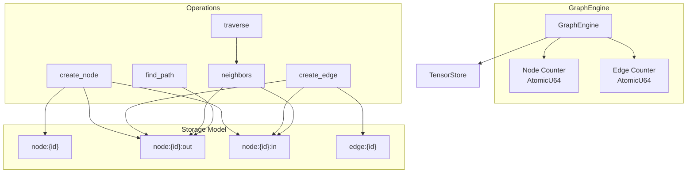
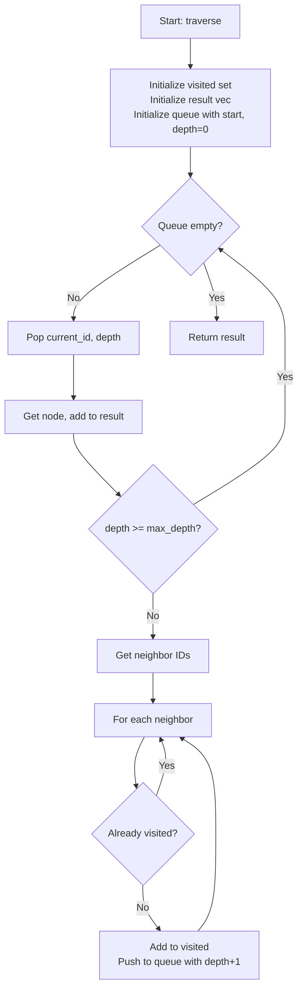
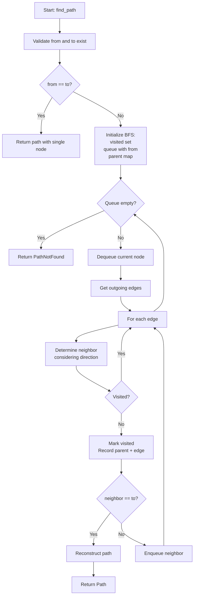
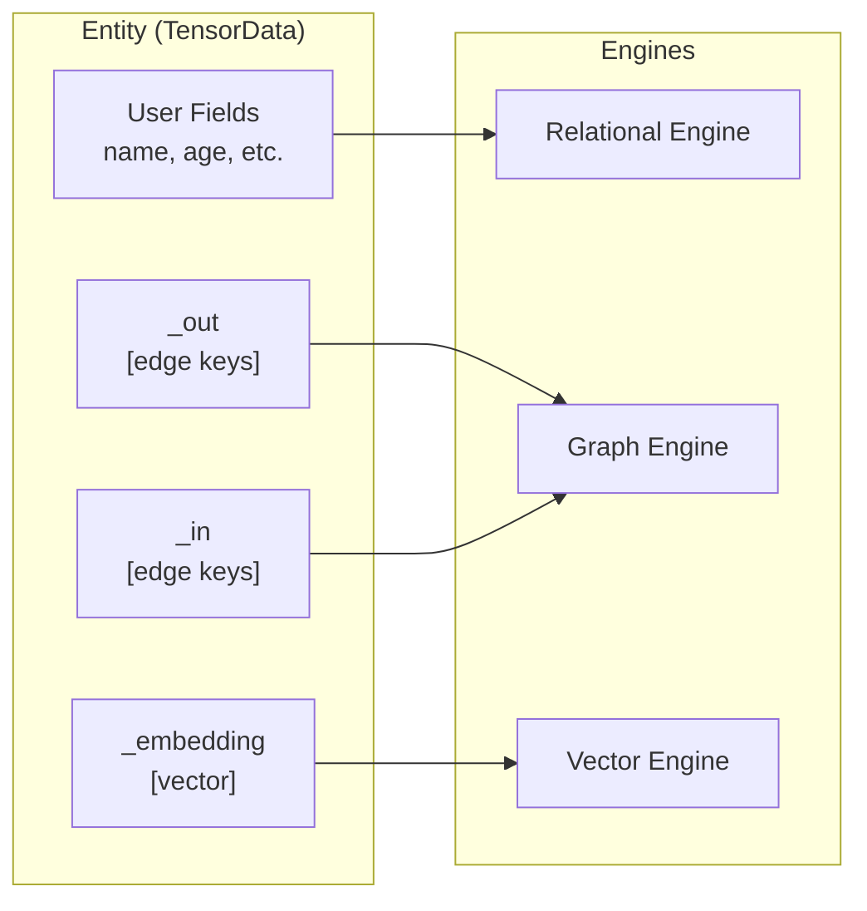

# Graph Storage Internals

> **See also:** [Graph Engine API Reference](../reference/api/graph-engine.md) |
> [Graph CRUD How-To](../how-to/graph-crud.md) |
> [Graph Traversals How-To](../how-to/graph-traversals.md)

This page explains the internal design of the Graph Engine -- how it maps a
labeled property graph onto Tensor Store's key-value model, why certain
trade-offs were made, and how traversals and concurrency work under the hood.

## Design Principles

| Principle | Description |
| --- | --- |
| Layered Architecture | Depends only on Tensor Store for persistence |
| Direction-Aware | Supports both directed and undirected edges |
| BFS Traversal | Breadth-first search for shortest paths |
| Cycle-Safe | Handles cyclic graphs without infinite loops via visited set |
| Unified Entities | Edges can connect shared entities across engines |
| Thread Safety | Inherits from Tensor Store's DashMap (~16 shards) |
| Serializable Types | All types implement serde Serialize/Deserialize |
| Parallel Optimization | High-degree node deletion uses rayon for parallelism |

## Architecture Diagram



## GraphEngine Struct

```rust
pub struct GraphEngine {
    store: TensorStore,           // Underlying key-value storage
    node_counter: AtomicU64,      // Atomic counter for node IDs
    edge_counter: AtomicU64,      // Atomic counter for edge IDs
}
```

The engine uses atomic counters (`SeqCst` ordering) to generate unique IDs:

- Node IDs start at 1 and increment monotonically.
- Edge IDs are separate from node IDs.
- Both counters support concurrent ID allocation.

## Storage Layout

The Graph Engine maps graph primitives onto Tensor Store's flat key-value
space. Every node produces three keys and every edge produces one key, plus
updates to the endpoint nodes' edge lists.

### Key Generation

```rust
fn node_key(id: u64) -> String { format!("node:{}", id) }
fn edge_key(id: u64) -> String { format!("edge:{}", id) }
fn outgoing_edges_key(node_id: u64) -> String { format!("node:{}:out", node_id) }
fn incoming_edges_key(node_id: u64) -> String { format!("node:{}:in", node_id) }
```

### Edge List Format

Edge lists are stored as `TensorData` with dynamically named fields. Each
field name is `e{edge_id}` and its value is the edge ID as an integer:

```rust
tensor.set("e1", TensorValue::Scalar(ScalarValue::Int(1)));
tensor.set("e5", TensorValue::Scalar(ScalarValue::Int(5)));
```

This format gives O(1) edge addition (just insert a new field) but O(n) edge
listing (must scan all keys starting with `e`). The trade-off favors write
performance, which is important because edge creation is the most frequent
mutation in typical graph workloads.

```rust
fn get_edge_list(&self, key: &str) -> Result<Vec<u64>> {
    let tensor = self.store.get(key)?;
    let mut edges = Vec::new();
    for k in tensor.keys() {
        if k.starts_with('e') {
            if let Some(TensorValue::Scalar(ScalarValue::Int(id))) = tensor.get(k) {
                edges.push(*id as u64);
            }
        }
    }
    Ok(edges)
}
```

### Node Count Calculation

Because each node occupies three keys (`node:{id}`, `node:{id}:out`,
`node:{id}:in`), the engine derives the node count from the total key scan:

```rust
pub fn node_count(&self) -> usize {
    self.store.scan_count("node:") - self.store.scan_count("node:") / 3 * 2
}
```

## Undirected Edge Implementation

When an undirected edge is created, it is added to **four** edge lists (both
nodes' outgoing **and** incoming lists) to enable traversal from either
endpoint regardless of the direction filter:

```rust
if !directed {
    self.add_edge_to_list(Self::outgoing_edges_key(to), id)?;
    self.add_edge_to_list(Self::incoming_edges_key(from), id)?;
}
```

A directed edge only appears in two lists: the source's outgoing list and the
target's incoming list.

## How BFS Traversal Works

The `traverse` method implements breadth-first search with depth limiting and
cycle detection.



Key properties of the traversal:

- **Cycle-Safe** -- The `visited` HashSet prevents revisiting nodes.
- **Depth-Limited** -- The `max_depth` parameter bounds traversal depth.
- **Level-Order** -- BFS naturally visits nodes in level order.
- **Start Node Included** -- The starting node is always in the result at depth 0.

## Shortest Path Algorithm

The `find_path` method uses BFS to find the shortest (minimum hop) path
between two nodes.



Path reconstruction walks parent pointers backwards from the target to the
source and then reverses to produce a source-to-target ordering.

## Parallel Deletion Optimization

High-degree nodes (>= 100 edges) trigger parallel edge deletion using rayon's
`par_iter`. Below the threshold, edges are deleted sequentially to avoid
thread-pool overhead for small batches.

| Edge Count | Deletion Strategy | Benefit |
| --- | --- | --- |
| < 100 | Sequential | Lower overhead for small nodes |
| >= 100 | Parallel (rayon) | ~2-4x speedup on multi-core systems |

## Thread Safety Model

`GraphEngine` inherits thread safety from `TensorStore`'s `DashMap`-based
shard router (~16 shards). There is no additional locking inside the Graph
Engine itself:

- ID generation uses `AtomicU64` with `SeqCst` ordering.
- Multiple threads can create nodes, edges, and run traversals concurrently.
- Writes only block other writes to the same shard; reads are lock-free.

## Unified Entity Layer

The Unified Entity API connects any shared entities (not just graph nodes) for
cross-engine queries. Entity edges use the `_out` and `_in` reserved fields
in `TensorData`, enabling the same entity key to have relational fields, graph
connections, and a vector embedding simultaneously.



For undirected entity edges, both entities receive the edge in both `_out` and
`_in`, mirroring the four-list approach used for node-based undirected edges.

## Edge Cases and Gotchas

### Self-Loop Edges

Self-loops (edges from a node to itself) are valid but filtered from neighbor
results. Creating a self-loop succeeds, but `neighbors()` will not return the
node itself.

### Deleted Edge Orphans

When deleting a node, connected edges are deleted from storage but may remain
in other nodes' edge lists. This is a known limitation -- edge retrieval
gracefully handles missing edges by skipping them.

### Bytes Property Conversion

`ScalarValue::Bytes` converts to `PropertyValue::Null` since `PropertyValue`
does not support binary data. Be aware of this if you are converting
`ScalarValue` properties into graph properties.

### Same-Node Path

Finding a path from a node to itself returns a single-node path with an empty
edge list.
