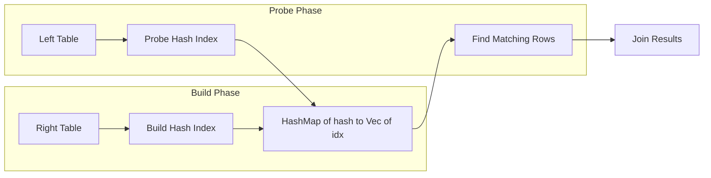

# Hash Join Algorithm

The relational engine implements all equality joins (INNER, LEFT, RIGHT, FULL)
using a hash join algorithm with O(n+m) time complexity, where n is the number
of rows in the left table and m is the number of rows in the right table.

For the API reference, see the
[Relational Engine API Reference](../reference/api/relational-engine.md). For
usage examples of joins, see
[Create and Manage Tables](../how-to/create-manage-tables.md).

## Algorithm Overview

Hash join operates in two phases:



### Build Phase

The right table is scanned once to build an in-memory hash map. For each row,
the join column value is hashed using `hash_key()`, and the row's index is
appended to the corresponding bucket.

### Probe Phase

The left table is scanned once. For each row, the join column value is hashed
and looked up in the hash map. When a matching bucket is found, the engine
verifies actual equality (to handle hash collisions) before emitting the joined
row pair.

## Implementation

```rust
pub fn join(&self, table_a: &str, table_b: &str,
            on_a: &str, on_b: &str) -> Result<Vec<(Row, Row)>> {
    let rows_a = self.select(table_a, Condition::True)?;
    let rows_b = self.select(table_b, Condition::True)?;

    // Build phase: index the right table
    let mut index: HashMap<String, Vec<usize>> = HashMap::with_capacity(rows_b.len());
    for (i, row) in rows_b.iter().enumerate() {
        if let Some(val) = row.get_with_id(on_b) {
            let hash = val.hash_key();
            index.entry(hash).or_default().push(i);
        }
    }

    // Probe phase: scan left table and probe index
    let mut results = Vec::with_capacity(min(rows_a.len(), rows_b.len()));
    for row_a in &rows_a {
        if let Some(val) = row_a.get_with_id(on_a) {
            let hash = val.hash_key();
            if let Some(indices) = index.get(&hash) {
                for &i in indices {
                    let row_b = &rows_b[i];
                    // Verify actual equality (handles hash collisions)
                    if row_b.get_with_id(on_b).as_ref() == Some(&val) {
                        results.push((row_a.clone(), row_b.clone()));
                    }
                }
            }
        }
    }
    Ok(results)
}
```

## Parallel Threshold

When the left table exceeds `PARALLEL_THRESHOLD` (1000 rows), the probe phase
switches to parallel execution using Rayon. The build phase remains sequential
because it constructs a shared hash map, but probing is embarrassingly parallel
-- each left-table row can independently look up the hash map.

```rust
if rows_a.len() >= Self::PARALLEL_THRESHOLD {
    rows_a.par_iter()
        .flat_map(|row_a| {
            // Parallel probe of hash index
        })
        .collect()
}
```

The threshold of 1000 rows is chosen to avoid Rayon's thread-pool overhead on
small tables. For tables below this threshold, sequential execution is faster
due to lower synchronization cost and better cache locality.

## Join Variants

All six SQL join types share the same hash join build phase. They differ only in
how unmatched rows are handled during the probe phase:

| Join Type | Left Unmatched | Right Unmatched |
| --- | --- | --- |
| INNER | Dropped | Dropped |
| LEFT | Emitted with `None` right | Dropped |
| RIGHT | Dropped | Emitted with `None` left |
| FULL | Emitted with `None` right | Emitted with `None` left |
| CROSS | N/A (Cartesian product) | N/A |
| NATURAL | Same as INNER, on all common columns | Same as INNER |

For LEFT, RIGHT, and FULL joins, the probe phase tracks which right-table rows
were matched. After scanning all left-table rows, unmatched right-table rows
are emitted (RIGHT and FULL only).

## Natural Join

Natural join is a special case that finds all common column names between two
tables and joins on their combined equality:

```rust
pub fn natural_join(&self, table_a: &str, table_b: &str) -> Result<Vec<(Row, Row)>> {
    let schema_a = self.get_schema(table_a)?;
    let schema_b = self.get_schema(table_b)?;

    // Find common columns
    let cols_a: HashSet<_> = schema_a.columns.iter().map(|c| c.name.as_str()).collect();
    let cols_b: HashSet<_> = schema_b.columns.iter().map(|c| c.name.as_str()).collect();
    let common_cols: Vec<_> = cols_a.intersection(&cols_b).copied().collect();

    // No common columns = cross join
    if common_cols.is_empty() {
        return self.cross_join(table_a, table_b);
    }

    // Build composite hash key from all common columns
    // ...
}
```

When no common columns exist, natural join falls back to a cross join
(Cartesian product).

## Performance Analysis

| Metric | Value |
| --- | --- |
| Time complexity | O(n + m) for build + probe |
| Space complexity | O(m) for the hash map on the right table |
| Parallel speedup | Linear with core count (probe phase only) |
| Hash collision handling | Full equality verification after hash match |

The hash join approach avoids the O(n * m) cost of nested-loop joins and the
O(n log n + m log m) cost of sort-merge joins. The trade-off is O(m) memory
for the hash map, which is acceptable for the expected table sizes.

## Aggregate Functions and Parallel Reduction

Aggregate functions (SUM, AVG, MIN, MAX) also use the parallel threshold. For
tables exceeding 1000 rows, aggregates use Rayon's `par_iter` with parallel
map-reduce:

```rust
// Parallel average computation
let (total, count) = rows.par_iter()
    .map(|row| extract_numeric(row, column))
    .reduce(|| (0.0, 0u64), |(s1, c1), (s2, c2)| (s1 + s2, c1 + c2));
```

MIN and MAX use `reduce_with` to find the extreme value across parallel
partitions, comparing values using `partial_cmp_value` for correct ordering
across all value types.
