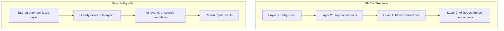
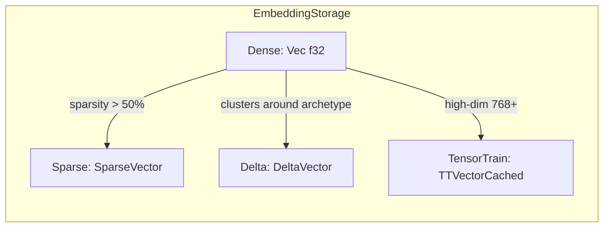

# HNSW Algorithm

Hierarchical Navigable Small World (HNSW) is the approximate nearest neighbor
index used by `tensor_store` and `vector_engine`. It provides O(log n) search
complexity with high recall, making it practical for million-scale embedding
collections.

**See also**: [How-to: Tune HNSW](../how-to/tune-hnsw.md) |
[Delta Vectors](delta-vectors.md) |
[API Reference](../reference/api/tensor-store.md)

---

## Algorithm Overview

HNSW builds a multi-layer graph where each layer is a navigable small world
network. Higher layers have fewer nodes and act as "express lanes" for coarse
navigation; layer 0 contains all nodes with dense local connections.



**Search** begins at the entry point on the highest layer. At each layer, the
algorithm greedily moves to the neighbor closest to the query vector. Once the
greedy search stalls (no closer neighbor exists), it descends to the next layer,
carrying forward the best candidate found so far. At layer 0, it performs a
broader beam search with `ef_search` candidates and returns the top-k results.

**Insertion** follows the same top-down greedy search to find the node's
neighbors at each layer. The new node is then connected to its nearest neighbors
on every layer up to and including its assigned layer. If the new node's layer
exceeds the current maximum, it becomes the new entry point.

---

## Layer Selection Mechanism

New nodes are assigned layers using an exponential distribution, which ensures
that higher layers are exponentially sparser:

```rust
fn random_level(&self) -> usize {
    let f = random_float_0_1();
    let level = (-f.ln() * self.config.ml).floor() as usize;
    level.min(32)  // Cap at 32 layers
}
```

Where `ml = 1 / ln(m)` and `m` is the number of connections per layer.

With `m=16`, the expected layer distribution is:

- Layer 0: 100% of nodes
- Layer 1: ~36% of nodes
- Layer 2: ~13% of nodes
- Layer 3: ~5% of nodes

This exponential decay means the upper layers are cheap to traverse (few nodes,
few distance calculations) while layer 0 provides the dense connectivity needed
for high recall.

---

## SIMD Optimization

Dense vector distance computation is the dominant cost in HNSW search. The
implementation uses 8-wide SIMD (f32x8) to compute dot products in parallel:

```rust
pub fn dot_product(a: &[f32], b: &[f32]) -> f32 {
    let chunks = a.len() / 8;
    let mut sum = f32x8::ZERO;

    for i in 0..chunks {
        let offset = i * 8;
        let va = f32x8::from(&a[offset..offset + 8]);
        let vb = f32x8::from(&b[offset..offset + 8]);
        sum += va * vb;
    }

    // Sum lanes and handle remainder
    let arr: [f32; 8] = sum.into();
    let mut result: f32 = arr.iter().sum();
    // ... scalar remainder handling
}
```

This processes 8 dimensions per instruction, yielding approximately 4-6x
throughput improvement over scalar code for typical embedding dimensions (384,
768, 1536). The remainder loop handles dimensions that are not multiples of 8.

---

## Neighbor Compression

HNSW neighbor lists use delta-varint encoding for 3-8x compression of neighbor
ID storage:

```rust
struct CompressedNeighbors {
    compressed: Vec<u8>,  // Delta-varint encoded neighbor IDs
}
```

The compression works by:

1. **Sorting** neighbor IDs (they are unordered graph neighbors).
2. **Delta encoding**: storing differences between consecutive sorted IDs
   instead of absolute values. Nearby nodes tend to have nearby IDs, so deltas
   are small.
3. **Varint encoding**: encoding each delta as a variable-length integer.
   Small deltas (common case) use 1-2 bytes instead of 8 bytes for a `usize`.

Decompression is O(n) where n is the neighbor count, which is bounded by `m`
(typically 16-32). This cost is negligible compared to distance computation.

The trade-off: neighbor list modification requires decompress-modify-recompress.
Since HNSW neighbor lists are written once during construction and read many
times during search, this is favorable.

---

## Storage Type Trade-offs

HNSW supports four embedding storage formats, each optimized for different data
characteristics:



| Storage Type | Memory | Use Case | Distance Computation |
| --- | --- | --- | --- |
| Dense | 4 bytes/dim | General purpose | SIMD dot product |
| Sparse | 6 bytes/nnz | >50% zeros | Sparse-sparse O(nnz) |
| Delta | 6 bytes/diff | Clustered embeddings | Via archetype |
| TensorTrain | 8-10x compression | 768+ dimensions | Native TT or reconstruct |

### Dense

The default and fastest for distance computation. Use when most dimensions are
non-zero and memory is not the bottleneck.

### Sparse

Uses `SparseVector` (sorted positions + values). Efficient when more than 50%
of dimensions are zero. Distance computation between two sparse vectors is
O(min(nnz_a, nnz_b)) via merge-join on sorted positions. See
[Sparse Vectors](sparse-vectors.md) for details.

### Delta

Stores each embedding as a difference from a reference archetype vector. When
embeddings cluster around common patterns (e.g., document embeddings from the
same domain), deltas are sparse and small. See [Delta Vectors](delta-vectors.md)
for the full explanation.

### TensorTrain

Tensor Train decomposition achieves 8-10x compression for high-dimensional
embeddings (768+). During HNSW search, TT vectors are reconstructed to dense
format for distance computation because native TT distance is O(r^4) per
comparison -- too expensive for the hundreds of distance calculations in a
single search.

---

## Edge Cases and Gotchas

1. **Delta vectors cannot be inserted directly** into HNSW. They require an
   archetype registry for distance computation. Convert to Dense first, or use
   the archetype-aware insertion path.

2. **TensorTrain storage** -- While stored in TT format, HNSW reconstructs to
   dense for fast distance computation during search. The compression benefit is
   in memory, not in search speed.

3. **Capacity limits** -- Default `max_nodes=10M` prevents memory exhaustion
   from fuzzing or adversarial input. Use `try_insert` for graceful handling
   when the index might be full.

4. **Empty index** -- The entry point is `usize::MAX` when the index is empty;
   search returns empty results without error.

5. **NaN/Inf sanitization** -- All similarity metrics sanitize results to
   prevent consensus ordering issues. NaN and Inf are replaced with 0.0, and
   cosine similarity is clamped to [-1.0, 1.0].
