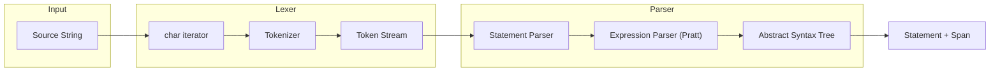
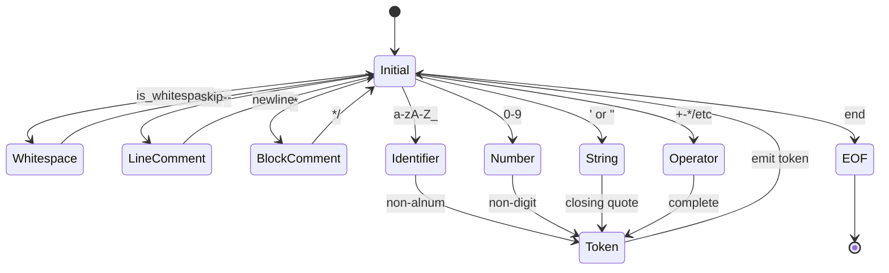

# Parser Design

The `neumann_parser` crate implements a hand-written recursive descent parser
with a Pratt expression parser for operator precedence. This document explains
the architectural decisions, the tokenizer pipeline, how keywords are handled as
identifiers, and EOF enforcement.

## Why Recursive Descent

Neumann's query language combines SQL syntax, graph operations, vector commands,
and domain-specific statements (vault, cache, blob, chain, cluster) in a single
grammar. A parser generator would require maintaining a grammar file and dealing
with generator-specific conflict resolution. A hand-written recursive descent
parser provides:

- **Direct control** over error messages and recovery. Each parse function knows
  its context and can produce specific, actionable error messages with source
  location.
- **Zero external dependencies**. The parser crate has no build-time or runtime
  dependencies beyond the standard library.
- **Single-pass O(n) performance** with constant memory overhead per token. The
  parser never backtracks.
- **Easy extensibility**. Adding a new statement type means adding one match arm
  and one parse function.

## Architecture Overview



The pipeline has two stages:

1. **Lexer** (`lexer.rs`): Converts a `&str` into a stream of `Token` values,
   each carrying a `TokenKind` and a `Span`.
2. **Parser** (`parser.rs` + `expr.rs`): Consumes tokens and builds an AST of
   `Statement` and `Expr` nodes, each annotated with spans.

## Tokenizer Architecture

### Internal State

```rust
pub struct Lexer<'a> {
    source: &'a str,      // Original source text
    chars: Chars<'a>,     // Character iterator
    pos: u32,             // Current byte position
    peeked: Option<char>, // One-character lookahead
}
```

The lexer uses a single-character lookahead (`peeked`) to resolve ambiguous
sequences like `-` vs. `->` and `<` vs. `<=` vs. `<>` vs. `<<`.

### State Machine



Whitespace, line comments (`--`), and block comments (`/* */`) are consumed but
never emitted as tokens. Block comments are nestable: `/* outer /* inner */ */`
is valid.

### Character Classification

| Category | Characters | Handling |
| --- | --- | --- |
| Whitespace | space, tab, newline | Skipped |
| Line comment | `--` to newline | Skipped |
| Block comment | `/* */` (nestable) | Skipped, supports nesting |
| Identifier | `[a-zA-Z_][a-zA-Z0-9_]*` | Keyword lookup then Ident |
| Integer | `[0-9]+` | Parse as i64 |
| Float | `[0-9]+\.[0-9]+` or scientific | Parse as f64 |
| String | `'...'` or `"..."` | Handle escapes |

### Identifier vs. Keyword Resolution

When the lexer scans an identifier, it uppercases the text and checks it against
the keyword table (a `match` statement). If it matches, the token is emitted as
the keyword variant (e.g., `TokenKind::Select`); otherwise it is emitted as
`TokenKind::Ident(name)` with the original casing preserved.

This design means keywords are case-insensitive (`select`, `SELECT`, `Select`
all produce `TokenKind::Select`) while identifiers retain their original case.

### Operator Recognition

Multi-character operators are resolved with a single lookahead:

```rust
match c {
    '-' => if self.eat('>') { Arrow }      // ->
           else { Minus },                  // -
    '=' => if self.eat('>') { FatArrow }   // =>
           else { Eq },                     // =
    '<' => if self.eat('=') { Le }         // <=
           else if self.eat('>') { Ne }    // <>
           else if self.eat('<') { Shl }   // <<
           else { Lt },                     // <
    '>' => if self.eat('=') { Ge }         // >=
           else if self.eat('>') { Shr }   // >>
           else { Gt },                     // >
    '|' => if self.eat('|') { Concat }     // ||
           else { Pipe },                   // |
    '&' => if self.eat('&') { AmpAmp }     // &&
           else { Amp },                    // &
    ':' => if self.eat(':') { ColonColon } // ::
           else { Colon },                  // :
}
```

## How Keywords Work as Identifiers

Many domain keywords (`STATUS`, `NODES`, `LEADER`, `HEIGHT`, `BEGIN`, etc.) are
also valid column names in SQL contexts. The parser handles this through
contextual keywords:

1. The `TokenKind::is_contextual_keyword()` method identifies tokens that can
   serve as identifiers outside their statement context.
2. In expression parsing, when the parser encounters a token that is not a
   standard prefix expression start, it checks `is_contextual_keyword()`. If
   true, it treats the token as an identifier.
3. The `expect_ident_or_keyword()` method explicitly accepts both `Ident` tokens
   and contextual keyword tokens where a column or table name is expected.

This avoids the need for quoting common words:

```sql
SELECT status, height FROM metrics  -- "status" and "height" are contextual keywords
```

## Pratt Parsing for Expressions

Expressions are parsed using the Pratt algorithm, which handles operator
precedence through "binding power" values. Each operator has a left binding
power (l_bp) and right binding power (r_bp):

- Left associativity: `r_bp > l_bp` (e.g., `+` has bp `(15, 16)`)
- Right associativity: `l_bp > r_bp` (not used currently)
- The parser recurses with `min_bp = r_bp`, which naturally implements precedence

The core loop:

1. Parse a prefix expression (literal, identifier, unary operator, parenthesized
   expression).
2. Check for postfix operators (IS NULL, IN, BETWEEN, LIKE, dot access).
3. Check for an infix operator. If its left binding power is less than the
   current minimum, stop (the operator belongs to an outer expression).
4. Otherwise, consume the operator, parse the right-hand side with the
   operator's right binding power as the new minimum, and build a `Binary` node.
5. Repeat from step 2.

### Depth Limiting

Expression nesting is capped at 64 levels (`MAX_DEPTH`). Each call to
`parse_expr_bp` increments a depth counter; exceeding the limit produces a
`TooDeep` error. This prevents stack overflow on pathological inputs like
70 nested parentheses.

## EOF Enforcement

After parsing a statement, the parser verifies that either:

- The next token is `TokenKind::Eof` (the input is fully consumed), or
- The next token is `TokenKind::Semicolon` (a statement separator).

If neither condition holds, the parser produces an `UnexpectedToken` error
pointing at the unconsumed token. This catches common mistakes like trailing
garbage after an otherwise-valid statement.

For `parse_all`, the parser repeatedly calls `parse_statement` until it reaches
EOF, collecting all statements. Semicolons between statements are consumed
automatically.

## Span Tracking

Every AST node carries a `Span` (start and end `BytePos` values) that records
its location in the original source. Spans are:

- Created by the lexer for each token.
- Merged by the parser when building compound nodes (e.g., `lhs.span.merge(rhs.span)` for binary expressions).
- Used by `format_with_source()` to render error messages with source context
  and caret indicators.

The `BytePos` type is a `u32` to minimize AST memory overhead (8 bytes per span
instead of 16 with `usize`).

### Line/Column Calculation

```rust
pub fn line_col(source: &str, pos: BytePos) -> (usize, usize) {
    let offset = pos.as_usize().min(source.len());
    let mut line = 1;
    let mut col = 1;
    for (i, ch) in source.char_indices() {
        if i >= offset { break; }
        if ch == '\n' {
            line += 1;
            col = 1;
        } else {
            col += 1;
        }
    }
    (line, col)
}
```

## Error Reporting

Errors include the error kind, a span, and an optional help message. The
`format_with_source` method renders them with context:

```text
error: unexpected FROM, expected expression or '*' after SELECT
  --> line 1:8
   |
  1 | SELECT FROM users
   |        ^^^^
```

Error creation patterns:

```rust
// Unexpected token
ParseError::unexpected(TokenKind::Comma, self.current.span, "column name")

// Unexpected EOF
ParseError::unexpected_eof(self.current.span, "expression")

// Invalid syntax with help
ParseError::invalid("unknown keyword SELCT", span)
    .with_help("did you mean SELECT?")
```

## Edge Cases

### Number Parsing

```text
"3."   -> [Integer(3), Dot, Eof]      -- trailing dot is not part of the number
"3.0"  -> [Float(3.0), Eof]           -- digit after dot makes it a float
"3.x"  -> [Integer(3), Dot, Ident("x"), Eof]
"1e10" -> [Float(1e10), Eof]          -- scientific notation
```

### String Literals

```text
"'it''s'"        -> [String("it's"), Eof]          -- SQL-style doubled quotes
"'unterminated"  -> [Error("unterminated..."), Eof] -- error token
"'line1\nline2'" -> Error                           -- strings cannot span lines
```

### BETWEEN Precedence

The `AND` in `BETWEEN low AND high` is part of the BETWEEN syntax, not a logical
AND operator:

```text
"x BETWEEN 1 AND 10 AND y = 5"
parses as: (x BETWEEN 1 AND 10) AND (y = 5)
```

### Qualified Wildcard

`table.*` is valid, but `(expr).*` is rejected because a qualified wildcard
requires an identifier on the left side of the dot.

## Design Rationale

The parser was built as a single-pass, zero-dependency module because:

- **Parser generators** (lalrpop, pest, nom) add build complexity and make error
  messages harder to customize. Neumann's multi-domain grammar benefits from
  hand-tuned error recovery.
- **Pratt parsing** was chosen over precedence climbing for its natural handling
  of both prefix and postfix operators in the same framework.
- **Span tracking** was prioritized from the start because the parser's primary
  consumer (the shell REPL) needs precise error locations for interactive use.
- **Case-insensitive keywords with case-preserving identifiers** match SQL
  conventions and avoid surprising users who expect `SELECT` and `select` to be
  equivalent.

## See Also

- **Reference**: [Neumann Parser API](../reference/api/neumann-parser.md)
- **Architecture**: [Neumann Parser](../reference/api/neumann-parser.md)
