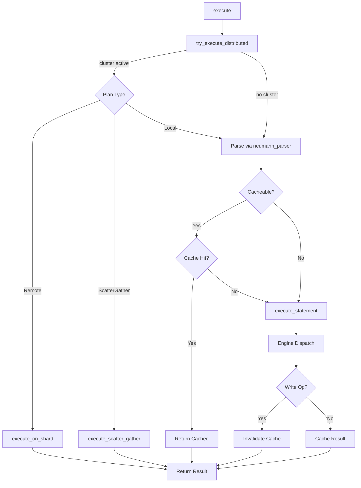
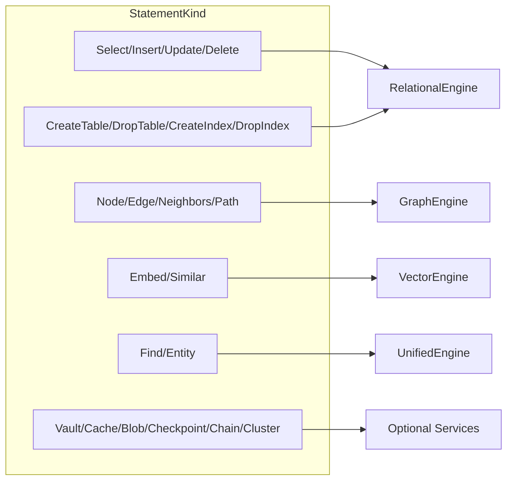
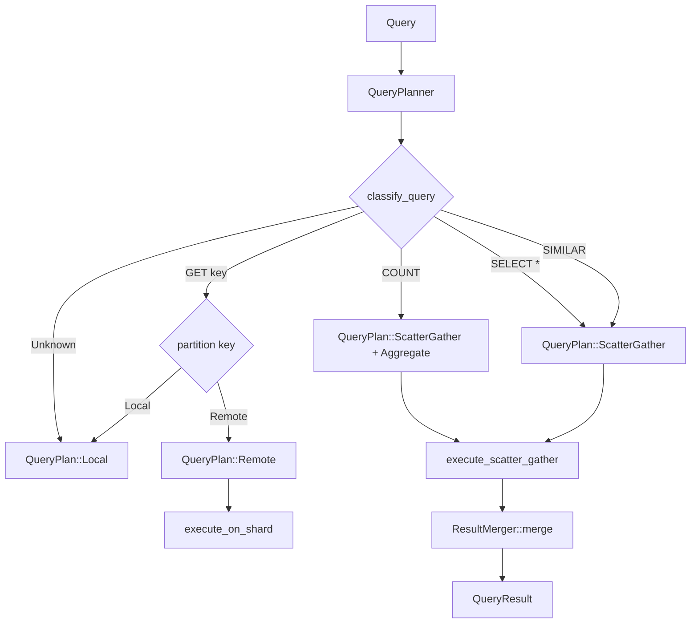

# Query Routing

The query router is the unified entry point for all query execution in Neumann.
This document explains how queries are parsed, dispatched to engines, and how
cross-engine query planning works.

## Execution Pipeline

Every query follows the same pipeline, regardless of type:



### Step 1: Distributed Check

If cluster mode is active, `try_execute_distributed` examines the raw query
string before parsing. The `QueryPlanner` classifies the query and determines
whether it should run locally, be forwarded to a specific shard, or be scattered
to all shards and gathered.

### Step 2: Parse

The query string is parsed into an AST via `neumann_parser::parse()`. Parse
errors are reported with source context (line, column, caret indicators) via
`ParseError::format_with_source()`. Unknown commands (unrecognized first keyword)
produce `RouterError::UnknownCommand`.

There is no legacy regex-based parsing path. All queries flow through the AST
parser.

### Step 3: Cache Check

For cacheable queries (`SELECT`, `SIMILAR`, `NEIGHBORS`, `PATH`), the router
checks the cache. Cache keys are normalized by trimming whitespace and
lowercasing.

### Step 4: Engine Dispatch

The router matches on `StatementKind` to determine which engine handles the
query:



### Step 5: Cache Update and Invalidation

After execution:

- Cacheable query results are serialized to JSON and stored in the cache.
- Write operations (`INSERT`, `UPDATE`, `DELETE`, DDL) invalidate the entire
  cache. There is no table-level cache tracking.

## Statement Handler Pattern

Each handler follows a consistent structure:

```rust
fn exec_<statement>(&self, stmt: &<Statement>Stmt) -> Result<QueryResult> {
    // 1. Validate/extract parameters
    let param = self.eval_string_expr(&stmt.field)?;

    // 2. Check service availability (for optional services)
    let service = self.service.as_ref()
        .ok_or_else(|| RouterError::ServiceError("Service not initialized".to_string()))?;

    // 3. For destructive ops, check protection
    if is_destructive {
        match self.protect_destructive_op(...)? {
            ProtectedOpResult::Cancelled => return Err(...),
            ProtectedOpResult::Proceed => {},
        }
    }

    // 4. Execute operation
    let result = service.operation(...)?;

    // 5. Convert to QueryResult
    Ok(QueryResult::Variant(result))
}
```

Destructive operations (DELETE, DROP TABLE, NODE DELETE, etc.) go through a
protection check that creates an automatic checkpoint before proceeding, if
checkpoint is configured. The user's confirmation handler can cancel the
operation.

## Routing Logic

### Core Engines (Always Available)

The three core engines are always initialized when a `QueryRouter` is created:

- **RelationalEngine**: Handles all SQL DML/DDL (SELECT, INSERT, UPDATE, DELETE,
  CREATE TABLE, DROP TABLE, indexes).
- **GraphEngine**: Handles NODE, EDGE, NEIGHBORS, PATH statements.
- **VectorEngine**: Handles EMBED, SIMILAR statements.

### Unified Engine (Conditional)

The `UnifiedEngine` is only available when the router is created with
`with_shared_store()`. It handles FIND and ENTITY statements. If a FIND or
ENTITY query arrives but the unified engine is not initialized, the router
returns an error.

### Optional Services

Optional services must be explicitly initialized:

- **Vault**: `init_vault(master_key)` or `ensure_vault()` (from env var)
- **Cache**: `init_cache()` or `ensure_cache()`
- **Blob**: `init_blob()` + `start_blob()`
- **Checkpoint**: `init_checkpoint()` (requires blob)
- **Chain**: `init_chain(node_id)` or `ensure_chain()`
- **Cluster**: `init_cluster(node_id, addr, peers)`

If a query targets a service that has not been initialized, the router returns a
descriptive error (e.g., "Vault not initialized").

### Authentication

Vault operations require an explicit identity. The router tracks
`current_identity`, set via `set_identity()`. All vault queries call
`require_identity()` at the start, returning `AuthenticationRequired` if no
identity is set.

## Cross-Engine Query Planning

Cross-engine queries combine data from multiple engines in a single call:

### find_similar_connected

Combines vector similarity with graph connectivity:

```rust
pub fn find_similar_connected(
    &self,
    query_key: &str,
    connected_to: &str,
    top_k: usize,
) -> Result<Vec<UnifiedItem>> {
    let query_embedding = self.vector.get_entity_embedding(query_key)?;

    // Use HNSW index if available, otherwise brute-force
    let similar = if let Some((ref index, ref keys)) = self.hnsw_index {
        self.vector.search_with_hnsw(index, keys, &query_embedding, top_k * 2)?
    } else {
        self.vector.search_entities(&query_embedding, top_k * 2)?
    };

    // Get graph neighbors of connected_to entity
    let connected_neighbors: HashSet<String> = self.graph
        .get_entity_neighbors(connected_to)
        .unwrap_or_default()
        .into_iter()
        .collect();

    // Filter to entities that are both similar AND connected
    let items: Vec<UnifiedItem> = similar
        .into_iter()
        .filter(|s| connected_neighbors.contains(&s.key))
        .take(top_k)
        .map(|s| UnifiedItem::new("vector+graph", &s.key).with_score(s.score))
        .collect();

    Ok(items)
}
```

The HNSW index optimization path uses `search_with_hnsw` for O(log n) search
when the index has been built via `build_vector_index()`. Without it, the search
falls back to O(n) brute-force.

## Distributed Query Execution

When cluster mode is active, the `QueryPlanner` classifies queries and builds
execution plans:



### Query Classification

The planner classifies queries based on text pattern matching:

- **Point lookups** (`GET`, `NODE GET`, `ENTITY GET`): Extract the key and
  determine which shard owns it via consistent hashing. Route to that shard
  only.
- **Similarity search** (`SIMILAR`): Must scatter to all shards because relevant
  vectors may be distributed. Results are merged with TopK strategy.
- **Table scans** (`SELECT`): Scattered to all shards. If the query contains
  `COUNT` or `SUM`, results are merged with the Aggregate strategy.
- **Unknown**: Default to local execution.

### Result Merging

The `ResultMerger` combines results from multiple shards according to the merge
strategy:

- **Union**: Concatenate all rows/nodes/edges from all shards.
- **TopK(k)**: Collect all `SimilarResult` values, sort by score descending,
  truncate to k.
- **Aggregate**: Combine partial aggregates (e.g., sum partial COUNTs, compute
  AVG from partial SUM and COUNT).
- **FirstNonEmpty**: Return the first non-empty result (short-circuits).
- **Concat**: Same as Union but preserves shard order.

### Semantic Routing

For embedding-aware queries, `plan_with_embedding` can route similarity searches
to only the relevant shards based on the query embedding, reducing the scatter
scope.

## Async vs. Sync

The router supports both execution modes:

- **Sync** (`execute`, `execute_parsed`): Blocks the calling thread. Supports
  distributed routing and caching.
- **Async** (`execute_parsed_async`): Returns a future. Supports caching but
  not distributed routing. Use for concurrent query execution via `tokio::join!`.

Blob and checkpoint operations internally use async I/O but are bridged to sync
in the sync execution path via `runtime.block_on()`.

## Design Rationale

### Single Entry Point

All queries flow through the same `execute` method rather than having separate
APIs for each engine. This ensures consistent caching, error handling,
protection, and distributed routing regardless of query type.

### Lazy Service Initialization

Services are initialized on demand rather than at construction time. This
avoids paying the cost of initializing unused subsystems (e.g., vault
encryption, chain consensus) and allows the router to be created quickly for
simple use cases.

### Full Cache Invalidation

The cache uses full invalidation on writes rather than per-table tracking. This
is a deliberate simplicity trade-off: per-table invalidation would require
tracking which tables are affected by each cached query (including JOINs and
subqueries), which adds significant complexity for marginal benefit in typical
workloads.

## See Also

- **Reference**: [Query Router API](../reference/api/query-router.md)
- **Architecture**: [Query Router](../reference/api/query-router.md)
