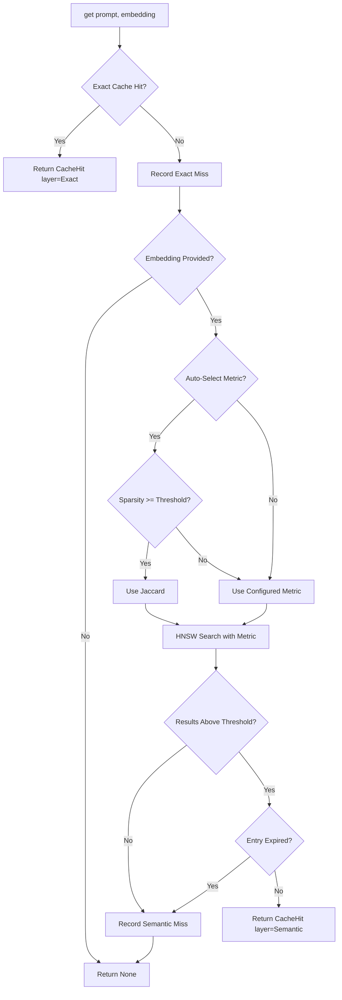
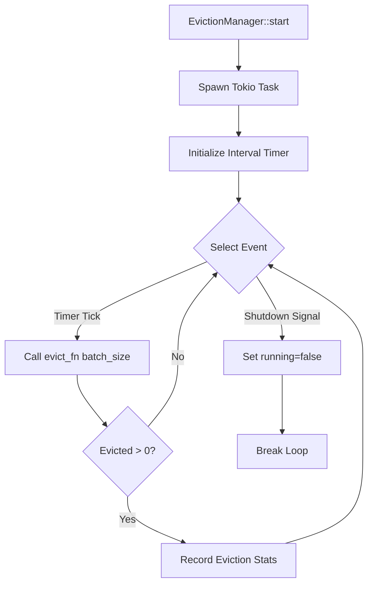

# Semantic Caching Design

This document explains the multi-layer cache architecture in `tensor_cache`: how
the exact, semantic, and embedding layers interact, why HNSW was chosen for
approximate nearest neighbor search, how metric selection works, and the
rationale behind the eviction strategies.

For the full type and configuration reference, see the
[Tensor Cache API Reference](../reference/api/tensor-cache.md). For practical
configuration guides, see
[How to: Configure Semantic Cache](../how-to/configure-semantic-cache.md).

## Architecture

```text
+--------------------------------------------------+
|                  Cache (Public API)               |
|   - get(prompt, embedding) -> CacheHit           |
|   - put(prompt, embedding, response, ...)        |
|   - stats(), evict(), clear()                    |
+--------------------------------------------------+
            |           |           |
    +-------+    +------+    +------+
    |            |           |
+--------+  +----------+  +-----------+
| Exact  |  | Semantic |  | Embedding |
| Cache  |  |  Cache   |  |   Cache   |
| O(1)   |  | O(log n) |  |   O(1)    |
+--------+  +----------+  +-----------+
    |            |           |
    +-------+----+----+------+
            |
    +------------------+
    |   CacheIndex     |
    |  (HNSW wrapper)  |
    +------------------+
            |
    +------------------+
    |   tensor_store   |
    |     hnsw.rs      |
    +------------------+
```

All cache entries are stored as `TensorData` in a shared `TensorStore`,
following the tensor-native paradigm used by `tensor_vault` and `tensor_blob`.

## Multi-Layer Cache Lookup Algorithm

The cache lookup maximizes hit rates while minimizing latency by checking faster
layers first:



### Exact Cache Lookup (O(1))

The exact cache uses a hash-based key derived from the prompt text:

```rust
fn exact_key(prompt: &str) -> String {
    let mut hasher = DefaultHasher::new();
    prompt.hash(&mut hasher);
    let hash = hasher.finish();
    format!("_cache:exact:{:016x}", hash)
}
```

The lookup sequence:

1. Generate hash key from prompt
2. Query `TensorStore` with key
3. Check expiration timestamp
4. Return hit or proceed to semantic lookup

### Semantic Cache Lookup (O(log n))

The semantic cache uses HNSW (Hierarchical Navigable Small World) graphs for
approximate nearest neighbor search:


**Why HNSW**: HNSW provides O(log n) search with high recall, making it suitable
for real-time semantic similarity. The graph structure is maintained by
`tensor_store`'s HNSW implementation.

**Re-scoring strategy**: The HNSW index retrieves candidates using cosine
similarity, then re-scores them with the requested metric. This allows using
different metrics without rebuilding the index:

```rust
// Retrieve more candidates than needed for re-scoring
let ef = (k * 3).max(10);
let candidates = index.search(query, ef);

// Re-score with specified metric
let similarity = match &embedding {
    EmbeddingStorage::Dense(dense) => {
        let stored_sparse = SparseVector::from_dense(dense);
        let raw = metric.compute(&query_sparse, &stored_sparse);
        metric.to_similarity(raw)
    }
    EmbeddingStorage::Sparse(sparse) => {
        let raw = metric.compute(&query_sparse, sparse);
        metric.to_similarity(raw)
    }
    // ...handles Delta and TensorTrain storage types
};
```

### Automatic Metric Selection

When `auto_select_metric` is enabled, the cache selects the optimal distance
metric based on embedding sparsity:

```rust
fn select_metric(&self, embedding: &[f32]) -> DistanceMetric {
    if !self.config.auto_select_metric {
        return self.config.distance_metric.clone();
    }

    let sparse = SparseVector::from_dense(embedding);
    if sparse.sparsity() >= self.config.sparsity_metric_threshold {
        DistanceMetric::Jaccard  // Better for sparse vectors
    } else {
        self.config.distance_metric.clone()  // Default (usually Cosine)
    }
}
```

The overhead is minimal: ~50 ns for sparsity check and ~10 ns for metric
selection.

## Sparse Storage Optimization

Embeddings with high sparsity (>50% zeros) are automatically stored in sparse
format to reduce memory usage:

```rust
fn should_use_sparse(vector: &[f32]) -> bool {
    if vector.is_empty() {
        return false;
    }
    let nnz = vector.iter().filter(|&&v| v.abs() > 1e-6).count();
    nnz * 2 <= vector.len()
}
```

| Storage Type | Memory per Entry | Best For |
| --- | --- | --- |
| Dense Vector | 4 * dim bytes | Low sparsity (<50% zeros) |
| Sparse Vector | 8 * nnz bytes | High sparsity (>50% zeros) |

Note: The sparse storage threshold (50%) is different from the auto-metric
selection threshold (default 70%). Both are configurable.

## Eviction Strategy Design

The cache supports four eviction strategies, each optimized for different
workload patterns.

### Strategy Comparison

| Strategy | Description | Score Formula | Best For |
| --- | --- | --- | --- |
| LRU | Evicts least recently accessed | `-last_access_secs` | General purpose |
| LFU | Evicts least frequently accessed | `access_count` | Stable workloads |
| CostBased | Evicts lowest cost savings per byte | `cost_per_hit / size_bytes` | Cost optimization |
| Hybrid | Combines all with configurable weights | Weighted combination | Production systems |

### Hybrid Eviction Score Algorithm

The Hybrid strategy combines recency, frequency, and cost factors. **Lower
scores are evicted first.**

```rust
pub fn score(
    &self,
    last_access_secs: f64,
    access_count: u64,
    cost_per_hit: f64,
    size_bytes: usize,
) -> f64 {
    match self.strategy {
        EvictionStrategy::LRU => -last_access_secs,
        EvictionStrategy::LFU => access_count as f64,
        EvictionStrategy::CostBased => {
            if size_bytes == 0 { 0.0 }
            else { cost_per_hit / size_bytes as f64 }
        }
        EvictionStrategy::Hybrid { lru_weight, lfu_weight, cost_weight } => {
            let total = f64::from(lru_weight) + f64::from(lfu_weight) + f64::from(cost_weight);
            let recency_w = f64::from(lru_weight) / total;
            let frequency_w = f64::from(lfu_weight) / total;
            let cost_w = f64::from(cost_weight) / total;

            let age_minutes = last_access_secs / 60.0;
            let recency_score = 1.0 / (1.0 + age_minutes);
            let frequency_score = (1.0 + access_count as f64).log2();
            let cost_score = cost_per_hit;

            recency_score * recency_w + frequency_score * frequency_w + cost_score * cost_w
        }
    }
}
```

The hybrid formula:

- **recency_score**: Decays as `1/(1 + age_in_minutes)` -- newer entries score
  higher
- **frequency_score**: Grows logarithmically with access count -- frequently
  accessed entries score higher
- **cost_score**: Direct cost per hit -- higher cost savings score higher

### Background Eviction



The eviction manager runs as an async Tokio task, processing `batch_size`
entries at each interval tick. It responds to a shutdown signal for graceful
cleanup.

## Token Counting

The `TokenCounter` uses tiktoken's `cl100k_base` encoding, compatible with
GPT-4, GPT-3.5-turbo, and text-embedding-ada-002.

### Lazy Encoder Initialization

```rust
static CL100K_ENCODER: OnceLock<Option<CoreBPE>> = OnceLock::new();

impl TokenCounter {
    fn encoder() -> Option<&'static CoreBPE> {
        CL100K_ENCODER
            .get_or_init(|| tiktoken_rs::cl100k_base().ok())
            .as_ref()
    }
}
```

### Fallback Estimation

If tiktoken is unavailable, the counter falls back to character-based estimation
(~4 chars per token for English text):

```rust
const fn estimate_tokens(text: &str) -> usize {
    text.len().div_ceil(4)
}
```

### Message Overhead

Chat messages include 4 tokens of overhead per message (role markers,
separators), plus 3 tokens for assistant reply priming:

```rust
pub fn count_messages(messages: &[(&str, &str)]) -> usize {
    let mut total = 0;
    for (role, content) in messages {
        total += Self::count_message(role, content);
    }
    total + 3  // 3 tokens for assistant reply priming
}
```

### Cost Calculation

```rust
// For atomic operations (avoids floating point accumulation errors)
pub fn estimate_cost_microdollars(...) -> u64 {
    let dollars = Self::estimate_cost(...);
    (dollars * 1_000_000.0) as u64
}
```

## Key Orphaning on Re-insert

When a key is re-inserted into the HNSW index, the old node is orphaned (not
deleted) because HNSW does not support efficient deletion:

```rust
let is_new = !self.key_to_node.contains_key(key);
if !is_new {
    self.key_to_node.remove(key);
}
```

Orphaned nodes consume memory but are ignored during search because they have no
key mapping.

## See Also

- [Tensor Cache API Reference](../reference/api/tensor-cache.md) -- complete
  type tables, configuration options, and method signatures
- [How to: Configure Semantic Cache](../how-to/configure-semantic-cache.md) --
  practical configuration and tuning guides
