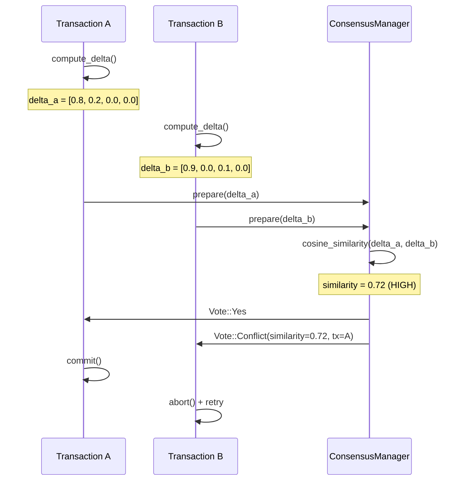
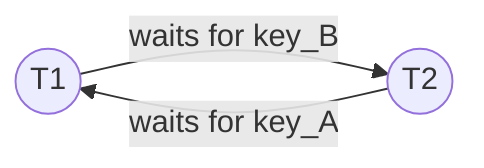
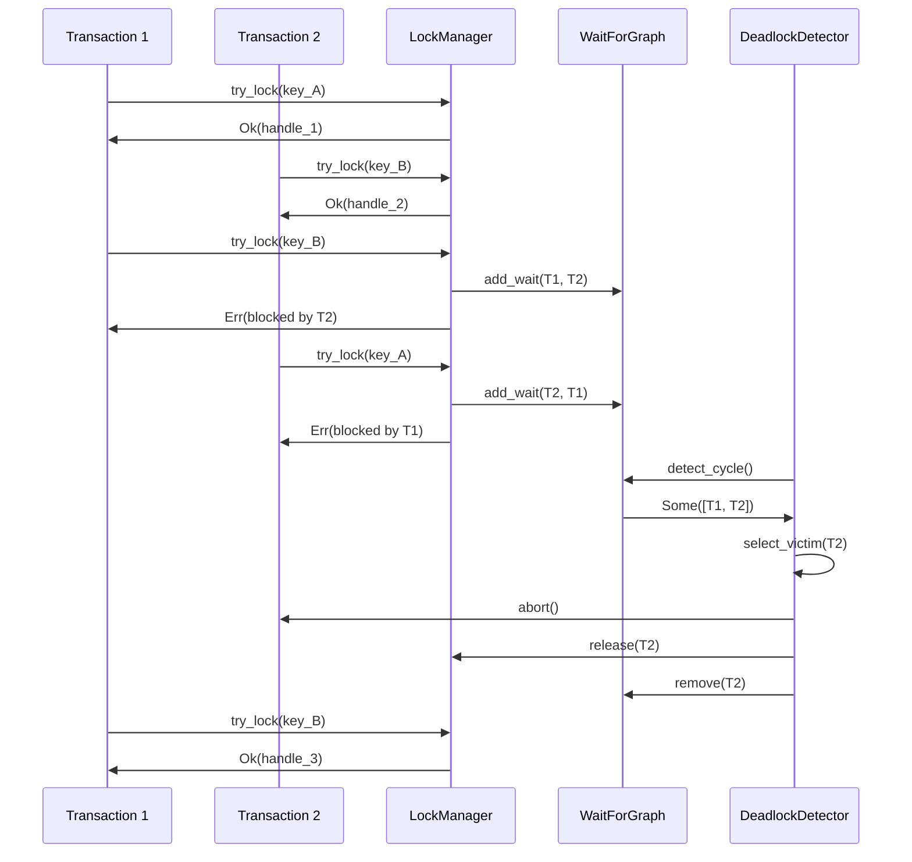
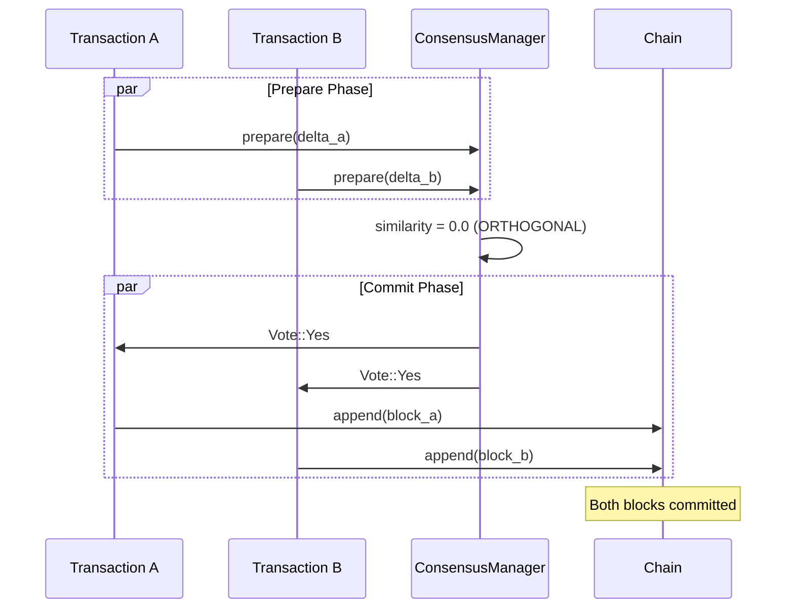

# Semantic Conflict Detection

Neumann uses delta embedding similarity to detect conflicts between
concurrent transactions without requiring explicit lock declarations.

## How It Works

Each transaction computes a delta embedding that encodes its write set.
When two transactions attempt to commit concurrently, the consensus manager
compares their delta embeddings using cosine similarity to determine whether
they conflict.

### Conflict Detection Flow

### Classification Table

| Similarity Range | Classification | Action |
| --- | --- | --- |
| 0.0 - 0.1 | Orthogonal | Parallel commit OK |
| 0.1 - 0.5 | Low overlap | Merge possible |
| 0.5 - 0.9 | Conflicting | Serialize execution |
| 0.9 - 1.0 | Parallel | Abort one |

## Deadlock Detection

When two transactions wait on each other's locks, a cycle forms in the
wait-for graph.

### Wait-For Graph

### Detection Flow

### Victim Selection

| Criterion | Weight | Description |
| --- | --- | --- |
| Lock count | 0.3 | Fewer locks = preferred victim |
| Transaction age | 0.3 | Younger = preferred victim |
| Priority | 0.4 | Lower priority = preferred victim |

## Orthogonal Transaction Merging

Transactions with orthogonal delta embeddings (similarity near 0.0) can be
committed in parallel by merging into a single block.

### Parallel Commit

### Orthogonality Analysis

| Transaction A | Transaction B | Overlap | Similarity | Can Merge? |
| --- | --- | --- | --- | --- |
| user:1:prefs | product:42:stock | None | 0.00 | Yes |
| user:1:balance | user:2:balance | None | 0.15 | Yes |
| user:1:balance | user:1:prefs | user:1 | 0.30 | Maybe |
| account:1 | account:1 | Full | 0.95 | No |

## Summary

| Scenario | Detection Method | Resolution |
| --- | --- | --- |
| Conflict | Delta similarity > 0.5 | Serialize, retry loser |
| Deadlock | Wait-for graph cycle | Abort victim, retry |
| Orthogonal | Delta similarity < 0.1 | Parallel commit/merge |

## Further Reading

- [Embedding State Machine](embedding-state.md)
- [Transaction Workspace](transaction-workspace.md)
- [Distributed Transactions](distributed-transactions.md)
