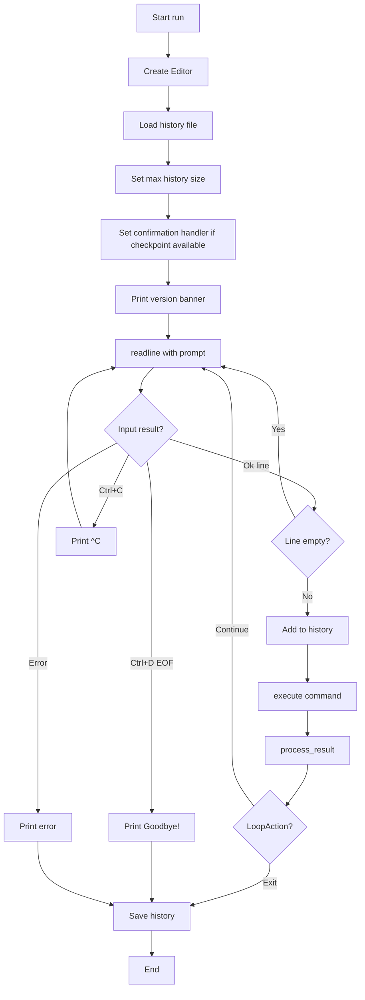
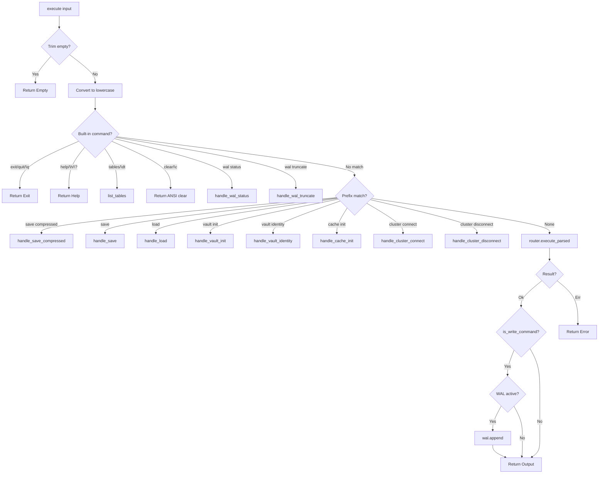
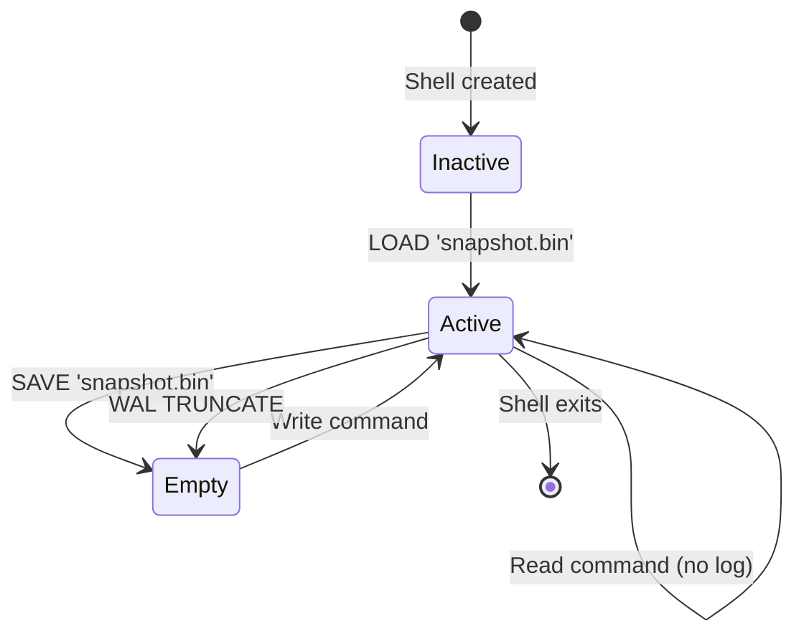

# Shell Design

The Neumann Shell (`neumann_shell`) is an interactive REPL (Read-Eval-Print
Loop) that provides a human-first interface to the Neumann database. It is
intentionally a thin layer: it handles readline input, command history, output
formatting, and crash recovery, then delegates all query execution to the Query
Router.

> **See Also:**
> - [Neumann Shell API Reference](../reference/api/neumann-shell.md) -- commands, config, error types

## Design Principles

The shell follows four design principles:

- **Human-first interface** -- readable prompts, formatted output, command
  history
- **Thin layer** -- minimal logic, delegates to Query Router
- **Graceful handling** -- Ctrl+C does not exit, errors displayed cleanly
- **Zero configuration** -- works out of the box with sensible defaults

## REPL Loop Architecture

The REPL is built on the `rustyline` crate for readline functionality. The
control flow handles three input states: valid input (execute and continue),
Ctrl+C (cancel current line and continue), and Ctrl+D / error (exit).



### Initialization Sequence

```rust
pub fn run(&mut self) -> Result<(), ShellError> {
    // 1. Create rustyline editor
    let editor: Editor<(), DefaultHistory> =
        DefaultEditor::new().map_err(|e| ShellError::Init(e.to_string()))?;
    let editor = Arc::new(Mutex::new(editor));

    // 2. Load existing history
    {
        let mut ed = editor.lock();
        if let Some(ref path) = self.config.history_file {
            let _ = ed.load_history(path);
        }
        ed.history_mut()
            .set_max_len(self.config.history_size)
            .map_err(|e| ShellError::Init(e.to_string()))?;
    }

    // 3. Set up confirmation handler for destructive operations
    {
        let router = self.router.read();
        if router.has_checkpoint() {
            let handler = Arc::new(ShellConfirmationHandler::new(Arc::clone(&editor)));
            drop(router);
            let router = self.router.write();
            if let Err(e) = router.set_confirmation_handler(handler) {
                eprintln!("Warning: Failed to set confirmation handler: {e}");
            }
        }
    }

    println!("Neumann Database Shell v{}", Self::version());
    println!("Type 'help' for available commands.\n");

    // 4. Main REPL loop
    // ... readline -> execute -> process_result -> loop/exit
}
```

## Command Execution Flow

When a command arrives, the shell checks for built-in commands first, then falls
through to the Query Router for database queries:



## WAL Integration

The shell includes a write-ahead log for crash recovery. When active, all write
commands are logged to a text file that can be replayed after loading a snapshot.

### WAL Lifecycle



Key behaviors:

- The WAL is activated after `LOAD` (stored as `<snapshot>.log`)
- All write commands (INSERT, UPDATE, DELETE, NODE CREATE, etc.) are logged
- On subsequent `LOAD`, the snapshot is loaded first, then WAL is replayed
- `SAVE` truncates the WAL (snapshot now contains all data)
- `WAL TRUNCATE` manually clears the log without saving

### WAL File Format

The WAL is a simple text file with one command per line. Each command is written
verbatim followed by a newline and an immediate flush:

```sql
INSERT INTO users VALUES (1, 'Alice')
NODE CREATE person {name: 'Bob'}
EMBED STORE 'doc1' [0.1, 0.2, 0.3]
```

Format details:

- Line-delimited plain text, UTF-8 encoded
- Each line is the exact command string
- Flushed immediately after each write for durability
- Empty lines are skipped during replay

### Write Command Detection

The `is_write_command` function determines which commands should be logged:

```rust
fn is_write_command(cmd: &str) -> bool {
    let upper = cmd.to_uppercase();
    let first_word = upper.split_whitespace().next().unwrap_or("");

    match first_word {
        "INSERT" | "UPDATE" | "DELETE" | "CREATE" | "DROP" => true,
        "NODE" => !upper.contains("NODE GET"),
        "EDGE" => !upper.contains("EDGE GET"),
        "EMBED" => upper.contains("EMBED STORE") || upper.contains("EMBED DELETE"),
        "VAULT" => {
            upper.contains("VAULT SET")
                || upper.contains("VAULT DELETE")
                || upper.contains("VAULT ROTATE")
                || upper.contains("VAULT GRANT")
                || upper.contains("VAULT REVOKE")
        },
        "CACHE" => upper.contains("CACHE CLEAR"),
        "BLOB" => {
            upper.contains("BLOB PUT")
                || upper.contains("BLOB DELETE")
                || upper.contains("BLOB LINK")
                || upper.contains("BLOB UNLINK")
                || upper.contains("BLOB TAG")
                || upper.contains("BLOB UNTAG")
                || upper.contains("BLOB GC")
                || upper.contains("BLOB REPAIR")
                || upper.contains("BLOB META SET")
        },
        _ => false,
    }
}
```

### WAL Replay Algorithm

```rust
fn replay_wal(&self, wal_path: &Path) -> Result<usize, String> {
    let file = File::open(wal_path).map_err(|e| format!("Failed to open WAL: {e}"))?;
    let reader = BufReader::new(file);

    let mut count = 0;
    for (line_num, line) in reader.lines().enumerate() {
        let cmd = line.map_err(|e| format!("Failed to read WAL line {}: {e}", line_num + 1))?;
        let cmd = cmd.trim();

        if cmd.is_empty() {
            continue;  // Skip empty lines
        }

        let result = self.router.read().execute_parsed(cmd);
        if let Err(e) = result {
            return Err(format!("WAL replay failed at line {}: {e}", line_num + 1));
        }
        count += 1;
    }

    Ok(count)
}
```

## Snapshot Integration

### Auto-Detection of Embedding Dimension

For compressed snapshots, the shell auto-detects the embedding dimension by
sampling stored vectors:

```rust
fn detect_embedding_dimension(store: &TensorStore) -> usize {
    // Sample vectors to find dimension
    let keys = store.scan("");
    for key in keys.iter().take(100) {
        if let Ok(tensor) = store.get(key) {
            for field in tensor.keys() {
                match tensor.get(field) {
                    Some(TensorValue::Vector(v)) => return v.len(),
                    Some(TensorValue::Sparse(s)) => return s.dimension(),
                    _ => {},
                }
            }
        }
    }

    // Default to standard BERT dimension if no vectors found
    tensor_compress::CompressionDefaults::STANDARD  // 768
}
```

## Output Formatting

The shell converts `QueryResult` variants into human-readable strings through
the `format_result` function:

```rust
fn format_result(result: &QueryResult) -> String {
    match result {
        QueryResult::Empty => "OK".to_string(),
        QueryResult::Value(s) => s.clone(),
        QueryResult::Count(n) => format_count(*n),
        QueryResult::Ids(ids) => format_ids(ids),
        QueryResult::Rows(rows) => format_rows(rows),
        QueryResult::Nodes(nodes) => format_nodes(nodes),
        QueryResult::Edges(edges) => format_edges(edges),
        QueryResult::Path(path) => format_path(path),
        QueryResult::Similar(results) => format_similar(results),
        QueryResult::Unified(unified) => unified.description.clone(),
        QueryResult::TableList(tables) => format_table_list(tables),
        QueryResult::Blob(data) => format_blob(data),
        QueryResult::ArtifactInfo(info) => format_artifact_info(info),
        QueryResult::ArtifactList(ids) => format_artifact_list(ids),
        QueryResult::BlobStats(stats) => format_blob_stats(stats),
        QueryResult::CheckpointList(checkpoints) => format_checkpoint_list(checkpoints),
        QueryResult::Chain(chain) => format_chain_result(chain),
    }
}
```

### Table Formatting (ASCII Tables)

The `format_rows` function implements dynamic column width calculation, producing
aligned ASCII tables:

```text
name  | age | email
------+-----+------------------
Alice | 30  | alice@example.com
Bob   | 25  | bob@example.com
(2 rows)
```

Column widths are computed as the maximum of the header length and all cell
widths. The separator row uses `-` with `+` at column boundaries.

### Node Formatting

```text
Nodes:
  [1] person {name: Alice, age: 30}
  [2] person {name: Bob, age: 25}
(2 nodes)
```

### Edge Formatting

```text
Edges:
  [1] 1 -> 2 : knows
(1 edges)
```

### Path Formatting

```text
Path: 1 -> 3 -> 5 -> 7
```

### Similar Embeddings Formatting

```text
Similar:
  1. doc1 (similarity: 0.9800)
  2. doc2 (similarity: 0.9500)
```

### Blob Formatting

Binary data is displayed with a size threshold:

- Blobs at most 256 bytes are displayed as UTF-8 if they contain no control
  characters (except `\n` and `\t`)
- Larger or binary blobs show as `<binary data: N bytes>`

### Timestamp Formatting

Relative time formatting for readability:

| Duration | Format |
| --- | --- |
| < 60 seconds | `Ns ago` |
| < 1 hour | `Nm ago` |
| < 1 day | `Nh ago` |
| >= 1 day | `Nd ago` |
| Epoch 0 | `unknown` |

## Destructive Operation Confirmation

The shell integrates with the checkpoint system to provide interactive
confirmation for destructive operations:

```rust
struct ShellConfirmationHandler {
    editor: Arc<Mutex<Editor<(), DefaultHistory>>>,
}

impl ConfirmationHandler for ShellConfirmationHandler {
    fn confirm(&self, op: &DestructiveOp, preview: &OperationPreview) -> bool {
        let prompt = format_confirmation_prompt(op, preview);

        // Print the warning with sample data
        println!("\n{prompt}");

        // Ask for confirmation using readline
        let mut editor = self.editor.lock();
        editor
            .readline("Type 'yes' to proceed: ")
            .is_ok_and(|input| input.trim().eq_ignore_ascii_case("yes"))
    }
}
```

## User Experience Tips

1. **Use compressed snapshots for large datasets**: `SAVE COMPRESSED` reduces
   file size by approximately 4x with minimal precision loss.

2. **Check WAL status before critical operations**: Run `WAL STATUS` to verify
   recovery capability.

3. **Use tab completion**: Rustyline provides filename completion in some
   contexts.

4. **Ctrl+C is safe**: It only cancels the current line, not the entire session.

5. **History survives sessions**: Previous commands are available across shell
   restarts.

6. **For scripts, use programmatic API**: `shell.execute()` returns structured
   results for automation.

7. **Cluster connect before distributed operations**: Ensure `CLUSTER CONNECT`
   succeeds before running distributed transactions.
