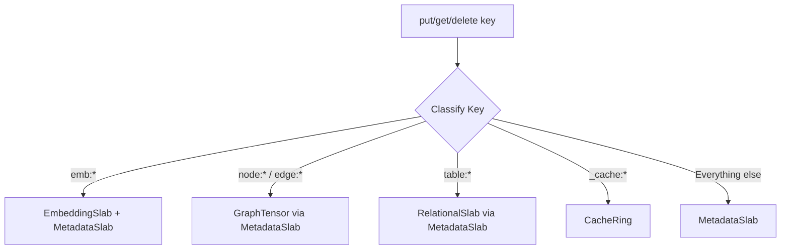

# SlabRouter Architecture

The SlabRouter is the core routing layer inside `tensor_store` that directs
operations to specialized storage backends based on key prefixes. It replaces
the previous DashMap-based design, eliminating hash table resize stalls and
providing predictable O(log n) performance.

**See also**: [API Reference](../reference/api/tensor-store.md) |
[Tiered Storage](tiered-storage.md)

---

## Architecture Diagram

```text
TensorStore
  |
  +-- Arc<SlabRouter>
         |
         +-- MetadataSlab (general key-value, BTreeMap-based)
         +-- EntityIndex (sorted vocabulary + hash index)
         +-- EmbeddingSlab (dense f32 arrays)
         +-- GraphTensor (CSR format for edges)
         +-- RelationalSlab (columnar storage)
         +-- CacheRing (LRU/LFU eviction)
         +-- BlobLog (append-only blob storage)
```

TensorStore wraps the SlabRouter in an `Arc`, making clones cheap and allowing
multiple engines to share the same underlying data. A `store.clone()` creates a
new handle to the same storage, not a copy of the data.

---

## Key Routing Algorithm

Every operation on TensorStore starts with key classification. The SlabRouter
inspects the key prefix to decide which slab handles the operation:



The classification is deterministic and O(1) -- a prefix check, not a hash
lookup.

### Key Classification Table

| Prefix | KeyClass | Slab | Purpose |
| --- | --- | --- | --- |
| `emb:*` | Embedding | EmbeddingSlab + EntityIndex | Embedding vectors with stable ID assignment |
| `node:*`, `edge:*` | Graph | MetadataSlab | Graph nodes and edges |
| `table:*` | Table | MetadataSlab | Relational rows |
| `_cache:*` | Cache | CacheRing | Cached data with eviction |
| `_blob:*` | Metadata | MetadataSlab | Blob metadata (chunks stored separately) |
| Everything else | Metadata | MetadataSlab | General key-value storage |

---

## Why Specialized Slabs?

Each slab is purpose-built for its data pattern:

- **MetadataSlab** uses `RwLock<BTreeMap>` for ordered key-value storage. The
  BTreeMap provides range scans (prefix iteration) without secondary indexes.

- **EntityIndex** maintains a sorted vocabulary with a hash index for stable ID
  assignment. This matters because HNSW requires numeric node IDs, so
  string-keyed embeddings need a stable string-to-integer mapping.

- **EmbeddingSlab** stores dense f32 arrays separately from metadata. This keeps
  the hot path for vector similarity search in a contiguous memory layout,
  avoiding pointer chasing through TensorData maps.

- **GraphTensor** uses CSR (Compressed Sparse Row) format for edges. CSR is
  cache-friendly for outgoing edge traversal (the dominant graph operation) and
  uses less memory than adjacency lists.

- **CacheRing** implements a fixed-size ring buffer with LRU/LFU eviction.
  Bounded memory prevents cache growth from consuming all available RAM.

- **BlobLog** uses append-only segments for large binary data. Append-only
  writes are sequential and fast; segment rotation enables garbage collection.

---

## Operation Flow

### PUT Operation

```rust
fn put(&self, key: &str, value: TensorData) {
    match classify_key(key) {
        KeyClass::Embedding => {
            // 1. Get or create stable entity ID
            let entity_id = self.index.get_or_create(key);
            // 2. Extract and store embedding vector
            if let Some(TensorValue::Vector(vec)) = value.get("_embedding") {
                self.embeddings.set(entity_id, vec);
            }
            // 3. Store full metadata
            self.metadata.set(key, value);
        }
        KeyClass::Cache => {
            let size = estimate_size(&value);
            self.cache.put(key, value, 1.0, size);
        }
        _ => self.metadata.set(key, value),
    }
}
```

Embedding puts are dual-writes: the vector goes to the EmbeddingSlab for fast
distance computation, and the full entity (including the vector) goes to the
MetadataSlab so that `get` can reconstruct the complete TensorData.

### GET Operation

```rust
fn get(&self, key: &str) -> Result<TensorData> {
    match classify_key(key) {
        KeyClass::Embedding => {
            // Try to reconstruct from embedding slab + metadata
            if let Some(entity_id) = self.index.get(key) {
                if let Some(vector) = self.embeddings.get(entity_id) {
                    let mut data = self.metadata.get(key).unwrap_or_default();
                    data.set("_embedding", TensorValue::Vector(vector));
                    return Ok(data);
                }
            }
            self.metadata.get(key)
        }
        KeyClass::Cache => self.cache.get(key),
        _ => self.metadata.get(key),
    }
}
```

Embedding gets reconstruct the full entity by merging metadata with the
embedding vector. This keeps the API uniform: callers always get a TensorData
regardless of internal storage layout.

---

## Concurrency Model

TensorStore uses tensor-based structures instead of hash maps for predictable
performance:

- **No Resize Stalls**: BTreeMap and sorted arrays grow incrementally.
  DashMap-based storage suffered 99.6% throughput drops during hash table
  resizes; SlabRouter's BTreeMaps never resize in bulk.

- **Lock-free Reads**: RwLock allows many concurrent readers. The typical
  workload (read-heavy) rarely contends.

- **Predictable Writes**: O(log n) inserts with no amortized O(n) resizing.
  Steady-state throughput variance is 12% (compared to 222% with DashMap).

- **Clone on Read**: `get()` returns cloned data to avoid holding read locks
  across caller code. This prevents lock-ordering issues but means callers pay
  a clone cost per read.

- **Shareable Storage**: TensorStore clones share the same underlying data via
  Arc. Multiple engines (relational, graph, vector) operate on the same
  SlabRouter without coordination.

### Optimized Scan Performance

`scan_filter_map` avoids cloning non-matching entries during filtered scans:

```rust
// Old path: 5000 clones for 5000 rows, ~2.6ms
let users = store.scan("users:");
let matches: Vec<_> = users.iter()
    .filter_map(|key| store.get(key).ok())
    .filter(|data| /* condition */)
    .collect();

// New path: 250 clones for 5% match rate, ~0.13ms (20x faster)
let matches = store.scan_filter_map("users:", |key, data| {
    if /* condition */ {
        Some(data.clone())
    } else {
        None
    }
});
```

The key insight: scanning with a filter function inside the read lock avoids
re-acquiring the lock per key and skips cloning entries that do not match.

---

## Design Rationale

**Why BTreeMap over HashMap?** BTreeMap provides ordered iteration (needed for
prefix scans) and incremental growth (no resize stalls). The O(log n) vs O(1)
trade-off is acceptable because n is bounded per slab, and cache locality of
BTreeMap nodes often makes the constant factor competitive.

**Why prefix-based routing?** The key prefix convention (`emb:`, `node:`,
`table:`) is already enforced by the upper engines. SlabRouter leverages this
existing structure rather than adding a separate routing table or configuration.

**Why dual-write for embeddings?** Vector similarity search needs contiguous
float arrays, but entity metadata needs the full key-value map. Storing both
avoids format conversion on every access at the cost of some write amplification.
