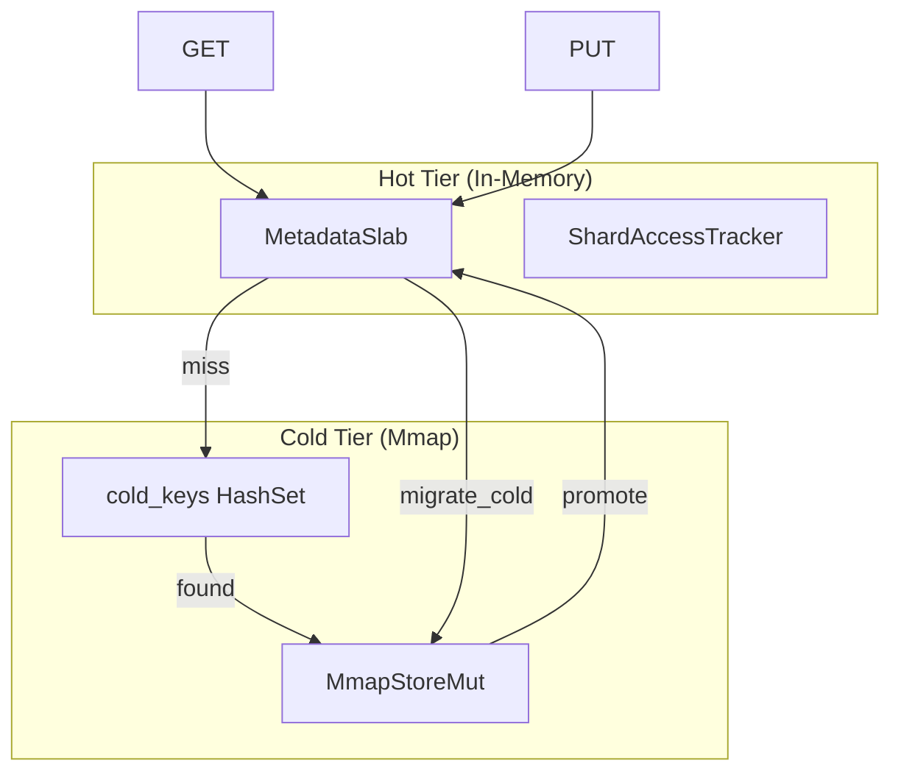

# Tiered Storage

Tiered storage in `tensor_store` provides a two-tier architecture with hot
(in-memory) and cold (memory-mapped file) layers. It enables memory-efficient
storage of large datasets by migrating infrequently accessed data to disk while
keeping hot data in RAM for fast access.

**See also**: [How-to: Configure Tiered Storage](../how-to/configure-tiered-storage.md) |
[SlabRouter Architecture](slab-router.md) |
[API Reference](../reference/api/tensor-store.md)

---

## Architecture Diagram



All writes go to the hot tier. Data migrates to cold storage when a shard's
access pattern indicates it is no longer actively used. Reads check hot first,
then cold; accessing cold data promotes it back to hot.

---

## Migration Algorithm

Migration is driven by shard-level access tracking, not per-key timestamps. The
`ShardAccessTracker` samples access patterns at a configurable rate (default 1%
sampling) and records the last access time per shard.

```rust
pub fn migrate_cold(&mut self, threshold_ms: u64) -> Result<usize> {
    // 1. Find shards not accessed within threshold
    let cold_shards = self.instrumentation.cold_shards(threshold_ms);

    // 2. Collect keys belonging to cold shards
    let keys_to_migrate: Vec<String> = self.hot.scan("")
        .filter(|(key, _)| {
            let shard = shard_for_key(key);
            cold_shards.contains(&shard)
        })
        .map(|(key, _)| key)
        .collect();

    // 3. Move to cold storage
    for key in keys_to_migrate {
        cold.insert(&key, &tensor)?;
        self.cold_keys.insert(key.clone());
        self.hot.delete(&key);
    }

    cold.flush()?;
}
```

Key design decisions:

- **Shard granularity**: migrating entire shards (not individual keys) amortizes
  the cost of cold file I/O and reduces the tracking overhead.
- **Threshold-based**: the `threshold_ms` parameter defines "cold" as "no access
  in this many milliseconds." This is simple and predictable compared to LRU
  eviction or frequency-based policies.
- **Explicit trigger**: `migrate_cold()` is called by the application, not on a
  background timer. This gives the caller control over when migration happens
  (e.g., during low-traffic periods).

---

## Promotion Logic

When cold data is accessed, it is automatically promoted back to the hot tier:

```rust
pub fn get(&mut self, key: &str) -> Result<TensorData> {
    // Try hot first
    if let Some(data) = self.hot.get(key) {
        return Ok(data);
    }

    // Try cold
    if self.cold_keys.contains(key) {
        let tensor = self.cold.get(key)?;

        // Promote to hot
        self.hot.set(key, tensor.clone());
        self.cold_keys.remove(key);
        self.migrations_to_hot.fetch_add(1, Ordering::Relaxed);

        return Ok(tensor);
    }

    Err(TensorStoreError::NotFound(key))
}
```

Promotion is eager: a single read moves the data back to hot. This avoids
repeated cold reads for data that becomes active again. The trade-off is that a
one-off cold read unnecessarily promotes the data, but in practice, access
patterns are bursty enough that this works well.

The `cold_keys` HashSet provides O(1) lookup to determine whether a key exists
in cold storage without touching the mmap file. This keeps the miss path (key
does not exist at all) fast.

---

## Access Instrumentation

The `ShardAccessTracker` provides low-overhead monitoring of access patterns:

```rust
pub struct ShardAccessTracker {
    shards: Box<[ShardStats]>,
    shard_count: usize,
    start_time: Instant,
    sample_rate: u32,
    sample_counter: AtomicU64,
}
```

### Sampling

At `sample_rate=100`, only 1 in 100 accesses updates the tracker. This reduces
the overhead of access tracking to near zero while still providing a
statistically representative picture of access patterns.

```rust
fn should_sample(&self) -> bool {
    if self.sample_rate == 1 { return true; }
    self.sample_counter.fetch_add(1, Relaxed).is_multiple_of(self.sample_rate)
}
```

### Hot/Cold Detection

```rust
// Get shards sorted by access count (hottest first)
let hot = tracker.hot_shards(5);  // Top 5 hottest

// Get shards not accessed within threshold
let cold = tracker.cold_shards(30_000);  // Not accessed in 30s
```

### HNSW Access Stats

HNSW has specialized instrumentation that tracks layer-level access patterns:

```rust
pub struct HNSWAccessStats {
    entry_point_accesses: AtomicU64,
    layer0_traversals: AtomicU64,
    upper_layer_traversals: AtomicU64,
    total_searches: AtomicU64,
    distance_calculations: AtomicU64,
}
```

This data helps diagnose HNSW performance issues: a high
`layer0_ratio()` (layer 0 work fraction) suggests the upper layers are not
providing enough navigational benefit, which may indicate poor layer assignment
or too few connections.

---

## Design Rationale

**Why two tiers instead of three?** Two tiers (hot/cold) are sufficient for
most workloads. A third tier (e.g., compressed cold) would add complexity to the
promotion/demotion logic and the snapshot format. If needed, the cold tier can
be backed by compressed mmap files.

**Why mmap for cold storage?** Memory-mapped files let the OS manage the page
cache, avoiding the need for a custom buffer pool. Cold data that is never
accessed never occupies physical RAM. When it is accessed, the OS pages it in
on demand.

**Why not background migration?** Explicit `migrate_cold()` calls give the
application control over when I/O happens. Background migration would require
a timer thread and could cause unexpected latency spikes during peak load. The
caller knows best when migration is safe.

**Why shard-level tracking instead of per-key?** Per-key access timestamps
would consume 8 bytes per key (a `u64` timestamp). With millions of keys, this
adds significant memory overhead. Shard-level tracking uses a fixed-size array
(default 16 shards) regardless of key count.
