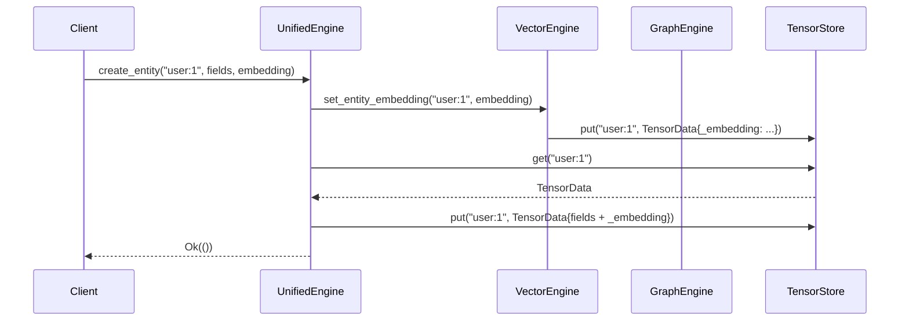

# Unified Entities

Neumann's unified entity model allows a single entity to hold relational fields,
graph connections, and vector embeddings simultaneously. This document explains
the design rationale, how entities are shared across engines, and the
cross-modal contraction algorithm.

## Design Principles

1. **Cross-Engine Abstraction**: A single interface for operations that span
   multiple engines, avoiding the need to call each engine separately.
2. **Unified Entities**: An entity like `user:alice` can have relational fields
   (`name`, `role`), graph connections (`follows`, `likes`), and an embedding
   vector -- all stored under the same key.
3. **Composable Queries**: Vector similarity can be combined with graph
   connectivity in a single call, rather than requiring application-level joins.
4. **Async-First**: All cross-engine operations support async execution because
   they may touch multiple engines with different latency profiles.
5. **Thread Safety**: Inherited from `TensorStore`'s `DashMap`-based
   `SlabRouter`, with no additional locking at the unified layer.

## Architecture

```text
                    +------------------+
                    | UnifiedEngine    |
                    +------------------+
                           |
        +------------------+------------------+
        |                  |                  |
        v                  v                  v
+---------------+  +---------------+  +---------------+
|  Relational   |  |    Graph      |  |    Vector     |
|    Engine     |  |    Engine     |  |    Engine     |
+---------------+  +---------------+  +---------------+
        |                  |                  |
        +------------------+------------------+
                           |
                    +------v------+
                    | TensorStore |
                    +-------------+
```

All engines share the same `TensorStore` instance. This is the key design
decision: because every engine reads and writes the same backing store, an
entity created in one engine is immediately visible to the others without
replication or synchronization.

## How Entities Are Shared Across Engines

A unified entity is a single `TensorData` entry (a `HashMap<String, TensorValue>`)
stored under a string key in `TensorStore`. The reserved field prefixes (`_out`,
`_in`, `_embedding`, `_label`, `_type`, etc.) carry engine-specific data within
that single entry:

- **Relational fields** are stored as `Scalar` values (e.g., `name: Scalar(String("Alice"))`).
- **Graph connections** are stored as `Pointers` under `_out` and `_in`, with
  separate edge entries for metadata.
- **Embeddings** are stored as `Vector` or `Sparse` under `_embedding`.

When `create_entity` is called with both fields and an embedding, the engine:

1. Calls `VectorEngine::set_entity_embedding` to store the embedding.
2. Fetches the resulting `TensorData` (which now includes `_embedding`).
3. Merges the user-provided fields into the same entry.
4. Writes the combined entry back to `TensorStore` in a single `put`.

This avoids double-storage: the embedding and the relational fields coexist in
one `TensorData` instance.

### Internal Engine Coordination



### Edge Storage

When `connect_entities(from, to, label)` is called, three `TensorStore` entries
are modified:

1. A new edge entry is created (e.g., `edge:follows:1`) with `_from`, `_to`,
   `_edge_type`, and `_directed` fields.
2. The source entity's `_out` Pointers list is extended.
3. The target entity's `_in` Pointers list is extended.

This bidirectional linking allows the graph engine to traverse neighbors in both
directions.

## Unified vs. Standard Entity Storage

The `create_entity_unified` method stores fields as vector metadata alongside
the embedding. This eliminates the need for a separate `TensorStore` lookup
when performing filtered vector search: the filter values are already attached
to the embedding entry.

Standard `create_entity` stores fields in `TensorStore` and the embedding in
`VectorEngine` separately. Use `create_entity_unified` when you expect to run
filtered similarity searches against the entity.

## Collection-Based Organization

Collections enforce per-collection dimension and metric constraints. A search
within a collection only sees entities belonging to that collection, providing
both logical isolation and search-scope reduction.

Each collection has its own key namespace: an entity `paper:1` in collection
`"documents"` does not collide with `paper:1` in collection `"preprints"`.

## Cross-Engine Query Strategies

### Find Similar Connected

This query type answers: "Which entities are both similar to X and connected to
Y in the graph?"

1. Retrieve the embedding from the query entity.
2. Run a vector similarity search for `top_k * 2` candidates (over-fetch to
   account for filtering).
3. Get the graph neighbors of the `connected_to` entity.
4. Intersect the two sets using a `HashSet` for O(1) membership tests.
5. Return the top-k intersected results.

The over-fetch factor of 2x ensures that after graph filtering, enough results
remain to fill the requested `top_k`.

### Find Neighbors by Similarity

This query answers: "Among the graph neighbors of X, which are most similar to
a given vector?"

1. Get all graph neighbors (both directions) of the entity.
2. For each neighbor, attempt to retrieve its embedding.
3. Compute cosine similarity between the neighbor's embedding and the query
   vector. Skip neighbors without embeddings or with dimension mismatches.
4. Sort by score descending and truncate to top-k.

This is O(d * k) where d is the entity's degree, making it efficient for
moderately-connected entities but potentially slow for high-degree hubs.

### Find Similar Connected with Filter

An optimized variant that pushes metadata filters into the vector search engine
rather than post-processing. The filter is combined with a key-membership
constraint (only keys that are graph neighbors) and uses a pre-filter strategy
for high selectivity.

## Cross-Modal Tensor Contraction

The contraction module fuses graph adjacency, vector similarity, and relational
interactions into a single algebraic scoring expression:

```text
score = (G[x,:] * s)^T R        (shape-safe: (1xn * 1xn)^T . nxm -> 1xm)
```

where **G** is the graph adjacency row for source entity *x*, **s** is the
cosine-similarity vector between *x* and its neighbors, and **R** is the
neighbor-to-item interaction matrix from a relational table.

### Algorithm

Given a source entity (e.g., a user):

1. **Adjacency** -- gather the source's graph neighbors with edge weights,
   optionally filtered by edge type and direction.
2. **Similarity** -- compute cosine similarity between the source's embedding
   and each neighbor's embedding. Neighbors without embeddings are skipped.
3. **Hadamard product** -- fuse adjacency and similarity into a single weight
   per neighbor: `w[i] = adj[i] * sim[i]`. Non-finite values are skipped.
4. **Normalization** (optional) -- L1-normalize the weight vector to control
   magnitude.
5. **Contraction** -- multiply the weight vector by the interaction matrix: for
   each neighbor, distribute its weight to every item it interacted with.
6. **Post-processing** -- exclude already-owned items, apply a category mask,
   per-item normalization, filter non-finite scores, and truncate to top-k with
   deterministic tie-breaking (score descending, then key ascending).

### Worked Example

```text
Graph: alice --FRIEND--> bob, carol, dave

Embeddings:
  alice = [1, 0, 0]
  bob   = [0.9, 0.1, 0]    cos(alice, bob)   ~ 0.994
  carol = [0.5, 0.5, 0]    cos(alice, carol)  ~ 0.707
  dave  = [0, 1, 0]        cos(alice, dave)   = 0.000

Purchases table:
  bob   -> {book, pen}
  carol -> {pen, laptop}
  dave  -> {phone}

Contraction scores:
  pen    = 0.994 + 0.707 = 1.701   (from bob + carol)
  book   = 0.994                    (from bob)
  laptop = 0.707                    (from carol)
  phone  = 0.000                    (from dave -- orthogonal embedding)
```

Items are ranked by score descending: pen > book > laptop > phone.

### Schema Validation

The engine adapter checks that the relational table and columns exist, and that
column types are key-compatible (`String`, `Int`, or `Float`). `Bool`, `Bytes`,
and `Json` columns are rejected with `InvalidOperation`.

### Edge Weight Extraction

If an edge has a `"weight"` property with a numeric value, that value is used as
the adjacency weight. Otherwise the edge is treated as unweighted (1.0).

## Design Rationale

The unified entity model was chosen over alternatives like:

- **Federated queries** (separate stores with a mediator): rejected because
  cross-engine joins would require network round-trips and complex consistency
  protocols.
- **Materialized views**: rejected because maintaining synchronized copies of
  data across engines adds write amplification and staleness risk.
- **Single monolithic engine**: rejected because different query types have
  fundamentally different access patterns (B-tree scans vs. HNSW traversal vs.
  graph BFS).

The shared-store approach gives each engine its own optimized data structures
while allowing zero-copy cross-engine access through the common `TensorData`
format.

## See Also

- **Reference**: [Tensor Unified API](../reference/api/tensor-unified.md)
- **How-to**: [Unified Entities](../how-to/unified-entities.md)
- **Architecture**: [Tensor Unified](../reference/api/tensor-unified.md)
