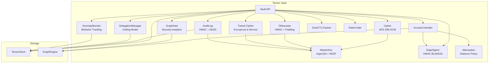

# Vault Cryptography Design

This document explains the cryptographic architecture of Tensor Vault: why each
design decision was made, how the layers interact, and what threat model they
address.

For the full type and configuration reference, see the
[Tensor Vault API Reference](../reference/api/tensor-vault.md). For practical
usage examples, see
[How to: Store and Retrieve Secrets](../how-to/vault-secrets.md).

## Design Principles

| Principle | Description |
| --- | --- |
| Encryption at Rest | All secrets encrypted with AES-256-GCM |
| Topological Access Control | Access determined by graph path, not ACLs |
| Zero Trust | No bypass mode; `node:root` is the only universal accessor |
| Memory Safety | Keys zeroized on drop via `zeroize` crate |
| Tamper-Evident Graph | All permission edges HMAC-signed; tampering detected on traversal |
| Distance Attenuation | Permissions degrade with graph distance from the secret |
| Least Privilege Delegation | Agents delegate subsets of their own access with ceiling model |
| Behavioral Monitoring | Per-agent anomaly detection flags spikes, bulk ops, and dormancy |
| Permanent Audit Trail | All operations logged with HMAC integrity and AEAD encryption |
| Defense in Depth | Multiple obfuscation layers hide patterns |
| Multi-Tenant Ready | Namespace isolation and rate limiting for agent systems |

## Architecture



## Key Derivation

The vault derives all cryptographic material from a single master password using
a two-stage process: Argon2id for password stretching, then HKDF-SHA256 for
domain-separated subkey derivation.

### Why Argon2id

Argon2id is a hybrid algorithm combining Argon2i (side-channel resistant) and
Argon2d (GPU resistant). The default parameters require 64 MiB of memory,
defeating GPU/ASIC brute-force attacks, with 3 iterations to increase
computation time and 4 threads to utilize modern CPUs.

```rust
// Argon2id configuration
pub const SALT_SIZE: usize = 16;  // 128-bit salt
pub const KEY_SIZE: usize = 32;   // 256-bit key (AES-256)

let params = Params::new(
    config.argon2_memory_cost,  // Memory in KiB (default 65536)
    config.argon2_time_cost,    // Iterations (default 3)
    config.argon2_parallelism,  // Parallelism (default 4)
    Some(KEY_SIZE),             // Output length
)?;

let argon2 = Argon2::new(Algorithm::Argon2id, Version::V0x13, params);
argon2.hash_password_into(input, salt, &mut key)?;
```

### HKDF Subkey Separation

Each purpose gets a cryptographically independent key via HKDF-SHA256. This
means compromising one subkey does not reveal any other.

```rust
impl MasterKey {
    pub fn derive_subkey(&self, domain: &[u8]) -> [u8; KEY_SIZE] {
        let hk = Hkdf::<Sha256>::new(None, &self.bytes);
        let mut output = [0u8; KEY_SIZE];
        hk.expand(domain, &mut output)
            .expect("HKDF expand cannot fail for 32 bytes");
        output
    }

    pub fn encryption_key(&self) -> [u8; KEY_SIZE] {
        self.derive_subkey(b"neumann_vault_encryption_v1")
    }

    pub fn obfuscation_key(&self) -> [u8; KEY_SIZE] {
        self.derive_subkey(b"neumann_vault_obfuscation_v1")
    }

    pub fn metadata_key(&self) -> [u8; KEY_SIZE] {
        self.derive_subkey(b"neumann_vault_metadata_v1")
    }

    pub fn audit_key(&self) -> [u8; KEY_SIZE] {
        self.derive_subkey(b"neumann_vault_audit_v1")
    }

    pub fn transit_key(&self) -> [u8; KEY_SIZE] {
        self.derive_subkey(b"neumann_vault_transit_v1")
    }
}
```

### Key Hierarchy

```text
Master Password + Salt
        |
        v Argon2id
    MasterKey (32 bytes)
        |
        +-->  HKDF("encryption_v1")  -->  AES-256-GCM key (secret data)
        +-->  HKDF("obfuscation_v1") -->  HMAC-BLAKE2b key (key names)
        +-->  HKDF("metadata_v1")    -->  AES-256-GCM key (metadata)
        +-->  HKDF("audit_v1")       -->  HMAC + AES-256-GCM key (audit)
        +-->  HKDF("transit_v1")     -->  AES-256-GCM key (transit encryption)
```

### Salt Persistence

The vault automatically manages salt persistence. On first creation a random
salt is generated and stored in TensorStore at `_vault:salt`. Subsequent opens
load the persisted salt so the same master password derives the same keys.

```rust
pub fn new(master_key: &[u8], graph: Arc<GraphEngine>, store: TensorStore, config: VaultConfig) -> Result<Self> {
    let derived = if config.salt.is_some() {
        // Explicit salt provided - use it directly
        let (key, _) = MasterKey::derive(master_key, &config)?;
        key
    } else if let Some(persisted_salt) = Self::load_salt(&store) {
        // Use persisted salt for consistency across reopens
        MasterKey::derive_with_salt(master_key, &persisted_salt, &config)?
    } else {
        // Generate new random salt and persist it
        let (key, new_salt) = MasterKey::derive(master_key, &config)?;
        Self::save_salt(&store, new_salt)?;
        key
    };
    // ...
}
```

## AES-256-GCM Encryption

### Encryption Process

1. Pad plaintext to a fixed bucket size (256B, 1KB, 4KB, 16KB, 32KB, or 64KB)
2. Generate a random 12-byte nonce
3. Encrypt with AES-256-GCM
4. Store ciphertext and nonce separately

```rust
pub const NONCE_SIZE: usize = 12;  // 96-bit nonce (AES-GCM standard)

impl Cipher {
    pub fn encrypt(&self, plaintext: &[u8]) -> Result<(Vec<u8>, [u8; NONCE_SIZE])> {
        let cipher = Aes256Gcm::new_from_slice(self.key.as_bytes())?;

        // Generate random nonce - CRITICAL for security
        let mut nonce_bytes = [0u8; NONCE_SIZE];
        rand::thread_rng().fill_bytes(&mut nonce_bytes);
        let nonce = Nonce::from_slice(&nonce_bytes);

        // AES-GCM provides authenticated encryption
        // Output: ciphertext || 16-byte authentication tag
        let ciphertext = cipher.encrypt(nonce, plaintext)?;

        Ok((ciphertext, nonce_bytes))
    }

    pub fn decrypt(&self, ciphertext: &[u8], nonce_bytes: &[u8]) -> Result<Vec<u8>> {
        if nonce_bytes.len() != NONCE_SIZE {
            return Err(VaultError::CryptoError("Invalid nonce size"));
        }

        let cipher = Aes256Gcm::new_from_slice(self.key.as_bytes())?;
        let nonce = Nonce::from_slice(nonce_bytes);

        // Decryption verifies authentication tag
        // Fails if ciphertext was tampered
        cipher.decrypt(nonce, ciphertext)
    }
}
```

### Security Properties

- **Authenticated encryption**: Detects tampering via 128-bit authentication tag
- **Nonce requirement**: Each encryption MUST use a unique nonce
- **Ciphertext expansion**: 16 bytes larger than plaintext (auth tag)

## Obfuscation Layers

The vault applies multiple obfuscation layers beyond encryption to hide access
patterns and metadata from an attacker who can observe the storage layer.

| Layer | Purpose | Implementation |
| --- | --- | --- |
| Key Obfuscation | Hide secret names | HMAC-BLAKE2b hash of key name |
| Pointer Indirection | Hide storage patterns | Ciphertext in separate blob with random-looking key |
| Length Padding | Hide plaintext size | Pad to fixed bucket sizes |
| Metadata Encryption | Hide creator/timestamps | AES-GCM with per-record random nonces |
| Blind Indexes | Searchable encryption | HMAC-based indexes for pattern matching |

### Padding Format

```text
+----------------+-------------------+------------------+
| Length (4B LE) | Plaintext (N B)   | Random Padding   |
+----------------+-------------------+------------------+
|<--------------- Bucket Size (256/1K/4K/...) -------->|
```

Random padding (not zeros) prevents padding oracle attacks. The 4-byte
little-endian length prefix allows exact plaintext recovery on decryption.

### HMAC-BLAKE2b Construction

```rust
fn hmac_hash(&self, data: &[u8], domain: &[u8]) -> [u8; 32] {
    // Inner hash: H((key XOR ipad) || domain || data)
    let mut inner_key = self.obfuscation_key;
    for byte in &mut inner_key {
        *byte ^= 0x36;  // ipad
    }
    let mut inner_hasher = Blake2b::<U32>::new();
    inner_hasher.update(inner_key);
    inner_hasher.update(domain);
    inner_hasher.update(data);
    let inner_hash = inner_hasher.finalize();

    // Outer hash: H((key XOR opad) || inner_hash)
    let mut outer_key = self.obfuscation_key;
    for byte in &mut outer_key {
        *byte ^= 0x5c;  // opad
    }
    let mut outer_hasher = Blake2b::<U32>::new();
    outer_hasher.update(outer_key);
    outer_hasher.update(inner_hash);

    outer_hasher.finalize().into()
}
```

### Metadata AEAD Encryption

Each metadata field (creator, timestamps) is individually encrypted with a
random nonce prepended to the ciphertext:

```rust
pub fn encrypt_metadata(&self, data: &[u8]) -> Result<Vec<u8>> {
    let cipher = Aes256Gcm::new_from_slice(&self.metadata_key)?;

    let mut nonce_bytes = [0u8; 12];
    rand::thread_rng().fill_bytes(&mut nonce_bytes);
    let nonce = Nonce::from_slice(&nonce_bytes);

    let ciphertext = cipher.encrypt(nonce, data)?;

    // Format: nonce || ciphertext
    let mut result = Vec::with_capacity(12 + ciphertext.len());
    result.extend_from_slice(&nonce_bytes);
    result.extend(ciphertext);
    Ok(result)
}
```

## Edge Signing

Every permission edge in the graph is signed with HMAC-BLAKE2b to prevent
topology tampering. When the vault creates or modifies a `VAULT_ACCESS_*` edge,
it computes a signature over the canonicalized tuple
`(from, to, edge_type, timestamp)` and stores it as an edge property.

```rust
impl EdgeSigner {
    pub fn sign_edge(
        &self,
        from: &str,
        to: &str,
        edge_type: &str,
        timestamp: i64,
    ) -> Vec<u8> {
        // HMAC-BLAKE2b over canonical representation
        // from || ":" || to || ":" || edge_type || ":" || timestamp
    }

    pub fn verify_edge(
        &self,
        from: &str,
        to: &str,
        edge_type: &str,
        timestamp: i64,
        signature: &[u8],
    ) -> bool {
        // Constant-time comparison to prevent timing attacks
    }
}
```

Signature verification happens during BFS traversal. If a tampered edge is
encountered, the `AccessController` skips it and the `explain_access` API
reports a `TamperedEdge` denial reason.

## Access Control Graph Model

Access is determined by graph topology using BFS traversal rather than
traditional access control lists. This design was chosen because:

1. **Composability**: Group membership, team hierarchies, and delegation chains
   are naturally expressed as graph paths
2. **Auditability**: The `explain_access` method can trace exact paths,
   making permission debugging straightforward
3. **Attenuation**: Permission degradation with graph distance limits transitive
   privilege escalation automatically

### Graph Topology

```text
node:root --VAULT_ACCESS_ADMIN--> vault_secret:api_key
                                          ^
user:alice --VAULT_ACCESS_READ------------+
                                          ^
team:devs --VAULT_ACCESS_WRITE-----------+
      ^
user:bob --MEMBER--------------------------+
```

### Allowed Traversal Edges

Only these edge types can grant transitive access:

- `VAULT_ACCESS` -- Legacy edge type (treated as Admin for backward
  compatibility)
- `VAULT_ACCESS_READ` -- Read-only access
- `VAULT_ACCESS_WRITE` -- Read + Write access
- `VAULT_ACCESS_ADMIN` -- Full access including grant/revoke
- `MEMBER` -- Allows group membership traversal but does NOT grant permission
  directly

**Security note**: `MEMBER` edges enable traversal through groups but do not
grant permissions. Only `VAULT_ACCESS_*` edges grant actual permissions. This
prevents privilege escalation via group membership.

### BFS Access Check Algorithm

```rust
pub fn get_permission_level(graph: &GraphEngine, source: &str, target: &str) -> Option<Permission> {
    if source == target {
        return Some(Permission::Admin);  // Self-access
    }

    let mut visited = HashSet::new();
    let mut queue = VecDeque::new();
    let mut best_permission: Option<Permission> = None;

    queue.push_back(source.to_string());
    visited.insert(source.to_string());

    while let Some(current) = queue.pop_front() {
        for edge in graph.get_entity_outgoing(&current) {
            let (_, to, edge_type, _) = graph.get_entity_edge(&edge);

            if !is_allowed_edge_type(&edge_type) {
                continue;
            }

            if edge_type.starts_with("VAULT_ACCESS") && to == target {
                if let Some(perm) = Permission::from_edge_type(&edge_type) {
                    best_permission = max(best_permission, perm);
                }
            } else if edge_type == "MEMBER" {
                if !visited.contains(&to) {
                    visited.insert(to.clone());
                    queue.push_back(to);
                }
            }
        }
    }

    best_permission
}
```

## Distance-Based Attenuation

Permissions degrade as graph distance increases between an entity and a secret.
This limits the blast radius of transitive access chains.

| Hops | Effective Permission |
| --- | --- |
| 1 | Admin (if granted Admin) |
| 2 | Write (Admin attenuates to Write) |
| 3-10 | Read (Write attenuates to Read) |
| >10 | Denied (beyond horizon) |

```rust
impl AttenuationPolicy {
    pub fn attenuate(
        &self,
        perm: Permission,
        hops: usize,
    ) -> Option<Permission> {
        if hops > self.horizon {
            return None; // Beyond horizon
        }
        match perm {
            Permission::Admin if hops > self.admin_limit =>
                self.attenuate(Permission::Write, hops),
            Permission::Write if hops > self.write_limit =>
                Some(Permission::Read),
            other => Some(other),
        }
    }
}
```

## Anomaly Detection

The vault monitors per-agent behavior in real time and flags suspicious
patterns. The `AnomalyMonitor` is non-blocking: it records events but does not
deny access.

### Event Types

| Event | Trigger |
| --- | --- |
| `FirstSecretAccess` | Entity accesses a secret it has never accessed before |
| `FrequencySpike` | Operations in window exceed `frequency_spike_limit` |
| `BulkOperation` | Burst of operations exceeds `bulk_operation_threshold` |
| `InactiveAgentResumed` | Entity resumes after `inactive_threshold_ms` of silence |

Each entity accumulates an `AgentProfile` containing the set of known secret
keys accessed, per-secret access counts, timestamps, and recent operation
history for sliding-window frequency analysis. Profiles are persisted to
`TensorStore` and survive vault restarts.

## Audit Log Integrity

### Keyed vs Legacy Mode

| Mode | Audit Key | Entity/Target | Integrity |
| --- | --- | --- | --- |
| Legacy (unkeyed) | `None` | Plaintext | None |
| Keyed | `Some([u8; 32])` | AEAD-encrypted | HMAC per entry |

When an `audit_key` is provided (derived from `MasterKey::audit_key()`), each
entry gets:

- **`_entity_enc` / `_target_enc`**: AES-256-GCM encrypted entity and target
  fields (nonce prepended). Prevents casual log readers from learning who
  accessed what.
- **`_hmac`**: HMAC-BLAKE2b over the full entry. Any modification (timestamp,
  operation, entity) is detected on read.
- **`_audit_epoch`**: Key rotation counter. Entries from a previous epoch are
  still readable during transition but flagged as stale.

## Master Key Rotation

`rotate_master_key()` re-derives all 5 subkeys from a new password and
atomically re-encrypts all secrets, re-signs all graph edges, and increments the
audit epoch.

The rotation is atomic: if any re-encryption fails, the vault reverts to the old
key. After rotation, all previously issued transit ciphertexts become
undecryptable (forward secrecy for transit data).

## Threat Model

| Threat | Mitigation |
| --- | --- |
| Password brute-force | Argon2id memory-hard KDF (64MB, 3 iterations) |
| Offline dictionary attack | Random 128-bit salt, stored in TensorStore |
| Ciphertext tampering | AES-GCM authentication tag (128-bit) |
| Nonce reuse | Random 96-bit nonce per encryption |
| Key leakage | Keys zeroized on drop, 5 independent subkeys via HKDF |
| Pattern analysis | Key obfuscation, padding, metadata encryption |
| Access enumeration | Rate limiting, audit logging |
| Privilege escalation | MEMBER edges don't grant permissions |
| Replay attacks | Per-operation nonces, timestamps in metadata |
| Topology tampering | HMAC-BLAKE2b edge signatures with constant-time verification |
| Transitive escalation | Distance-based attenuation degrades permissions with hops |
| Delegation abuse | Ceiling model, depth limits, cycle prevention |
| Behavioral anomaly | Real-time per-agent anomaly detection |
| Emergency misuse | Rate-limited break-glass with mandatory justification and audit |
| Audit log tampering | HMAC integrity protection per entry, AEAD encryption of fields |
| Stale audit after rotation | Audit epoch counter detects entries from previous key |

## Security Best Practices

1. **Use strong master passwords**: At least 128 bits of entropy
2. **Rotate secrets regularly**: Use `rotate()` to maintain version history
3. **Rotate the master key periodically**: `rotate_master_key()` re-encrypts everything
4. **Grant minimal permissions**: Use Read when Write/Admin not needed
5. **Use TTL grants for temporary access**: Prevents forgotten grants
6. **Use delegation instead of direct grants for agents**: Ceiling model limits blast radius
7. **Enable rate limiting in production**: Prevents brute-force attacks
8. **Enable anomaly detection**: Flags suspicious behavioral patterns early
9. **Use namespaces for multi-tenant**: Enforces isolation
10. **Review audit logs and run security_audit()**: Detect cycles, SPOFs, over-privilege
11. **Use explain_access() to debug permission problems**: Shows exact paths and denial reasons
12. **Keep attenuation horizon low**: Limits transitive privilege escalation

## See Also

- [Tensor Vault API Reference](../reference/api/tensor-vault.md) -- complete
  type and configuration tables
- [How to: Store and Retrieve Secrets](../how-to/vault-secrets.md) --
  practical step-by-step examples
- [How to: Vault Access Control](../how-to/vault-access-control.md) --
  set up graph-based permissions and delegation
